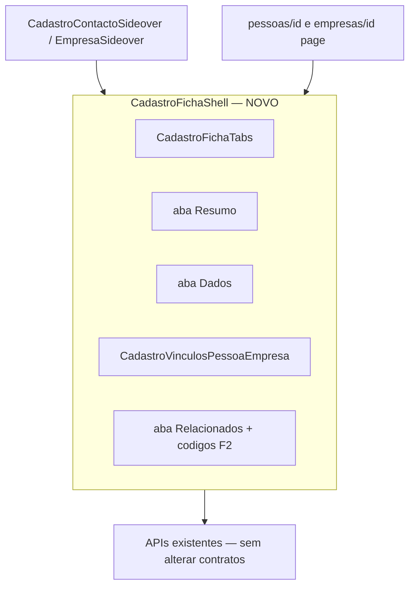
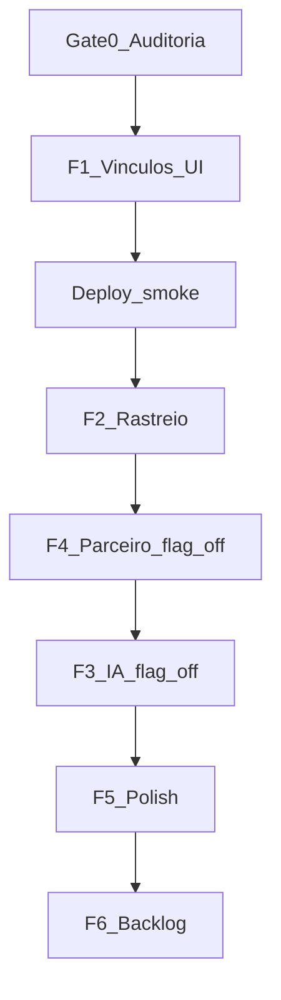
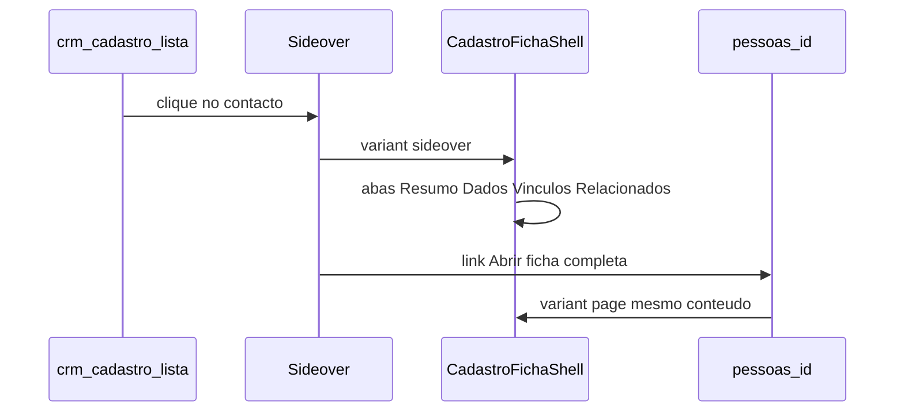
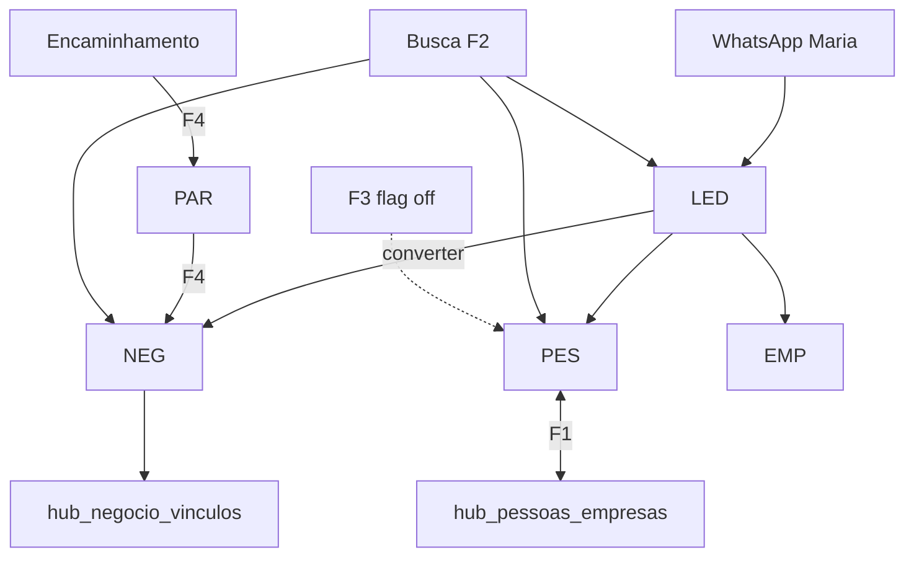

# Hub Obra10+ CRM — plano consolidado

> **Documento único** — fecha as abas antigas `crm_rastreio_e_vínculos` e `gap_analysis_pdf_crm` no Cursor; use só este ficheiro.
>
> **Fonte funcional:** `Hub_Obra10_Documento_Funcional_Consolidado (1).pdf` (34 partes)

---

## 0. Unificação das duas telas (plano + UI)

Hoje existem **duas experiências paralelas** para o mesmo cadastro — isto é o que o utilizador vê como «2 telas»:

| Tela actual | Onde | O que tem | O que falta |
|-------------|------|-----------|-------------|
| **Sideover** | `/crm/cadastro` → clique na lista | Ver/editar rápido, excluir | Abas Resumo/Dados/**Vínculos**/Relacionados |
| **Ficha página** | `/crm/pessoas/[id]`, `/crm/empresas/[id]` | `CadastroFichaTabs` completas | Vínculos só leitura; código duplicado vs sideover |

**Decisão (sem impacto em produção):** não criar uma terceira tela nem remover rotas existentes. **Unificar por componente partilhado** — uma única fonte de verdade para conteúdo, dois invólucros (sideover vs página).

### Regras do fluxo unificado

1. **Lista `/crm/cadastro`** continua a abrir o **sideover** (consulta rápida, 90% dos casos).
2. **Link «Abrir ficha completa»** no sideover mantém `/crm/pessoas/[id]` (partilha URL, impressão, bookmark).
3. **Mesmas abas, mesma ordem, mesmos componentes** nos dois sítios — utilizador não reaprende UI.
4. **Rotas `/crm/pessoas` e `/crm/empresas`** (listas antigas) **não são removidas**; podem redireccionar para `/crm/cadastro` numa fase posterior (F6), não no MVP.
5. **APIs inalteradas** — só refactor React; zero mudança em POST/PATCH/DELETE de cadastro.

### Implementação F1 (ordem segura)

| Passo | Acção | Risco |
|-------|-------|-------|
| 1 | Extrair `CadastroFichaShell` (tabs + slots) de [`pessoas/[id]/page.tsx`](app/crm/pessoas/[id]/page.tsx) | Baixo — move JSX, comportamento igual |
| 2 | Sideover passa a renderizar `CadastroFichaShell` em modo `variant="sideover"` | Baixo — sideover ganha abas |
| 3 | Adicionar `CadastroVinculosPessoaEmpresa` na aba Vínculos (um componente, dois sítios) | Baixo — API já existe |
| 4 | Ficha página usa o mesmo shell em `variant="page"` | Baixo — elimina duplicação |

**Não fazer na unificação:** mudar URLs, remover sideover, alterar wizard de criação, tocar em `hub-insert-crm` ou listagens.

---

## 1. Resumo executivo

### O que o sistema já cobre (núcleo PDF)

- Lead leve (LED), cadastro permanente pessoa/empresa (PES/EMP), negócio central (NEG)
- Conversão lead→negócio com vínculos em `hub_negocio_vinculos`
- Pipelines por mercado em [`lib/crm/pipelines.ts`](lib/crm/pipelines.ts)
- Encaminhamento com aprovação humana (`hub_encaminhamentos`, `/crm/aprovacoes`)
- Módulos obra/projeto/imóvel/financeiro, códigos de rastreio
- Menu alinhado ao PDF em [`lib/crm-nav-groups.ts`](lib/crm-nav-groups.ts)

### Maiores lacunas (prioridade MVP)

| # | Lacuna | Fase |
|---|--------|------|
| 1 | UI editável vínculo pessoa↔empresa (API existe; fichas só leitura; sideover sem aba Vínculos) | **F1** |
| 2 | Rastreio ponta a ponta visível (busca global + painel cadeia) | **F2** |
| 3 | Parceiro persistido no lead/negócio após encaminhamento IMB/ARQ | **F4** |
| 4 | IA criar cadastro CRM (tool + flag off em prod) | **F3** |
| 5 | Homologação como status em PES/EMP (hoje em `hub_parceiros`) | **F6** |

### Não alterar sem plano dedicado

- Formato de códigos (`PES-2026-0001` vs `PS2026001` do PDF) — **manter actual**
- Remoção do módulo `/crm/parceiros`
- Migrações destrutivas em `hub_pessoas_empresas` ou `hub_negocio_vinculos`

---

## 2. Já concluído (fix lista cadastro + polish)

| Item | Ficheiros | Estado |
|------|-----------|--------|
| Refetch activo após gravar cadastro | [`app/crm/cadastro/page.tsx`](app/crm/cadastro/page.tsx) | Feito |
| Banner erro lista + retry | `page.tsx`, [`hooks/useCrmListQueries.ts`](hooks/useCrmListQueries.ts) | Feito |
| Fallback listagem com/sem tenant | [`app/api/crm/pessoas/route.ts`](app/api/crm/pessoas/route.ts), empresas | Feito |
| POST devolve pessoa com campos da lista | [`lib/crm/hub-insert-crm.ts`](lib/crm/hub-insert-crm.ts) | Feito |
| Backfill `tenant_id` NULL → Obra10 | [`supabase/migrations/20260530120000_hub_pessoas_tenant_backfill.sql`](supabase/migrations/20260530120000_hub_pessoas_tenant_backfill.sql) | Criado — confirmar aplicado no Supabase |
| Botão Convidar → link partilhável | [`ParceiroLinkWizard.tsx`](components/crm/parceiros/ParceiroLinkWizard.tsx) | Feito |
| Headers UTF-8 (nomes com acentos) | [`lib/http-header-utf8.ts`](lib/http-header-utf8.ts) | Feito |

---

## 3. Gap analysis — matriz PDF vs sistema

Legenda: **OK** | **PARCIAL** | **FALTA** | **DIVERGE** (manter)

| Pt | Tema | Estado | Evidência | Fase |
|----|------|--------|-----------|------|
| 1 | Cadeia lead→negócio→obra | PARCIAL | `converter-negocio`, projetos `negocio_id` | F2, F6 |
| 2 | Menus Vendas/Cadastros | OK | `crm-nav-groups.ts` | — |
| 3 | Lead leve | OK | `hub_leads_crm`, LED | F5 |
| 4–5 | Tipos/fluxo por mercado | PARCIAL | metadata + funil | F6 |
| 6–7 | Pessoa/Empresa | PARCIAL | fichas + cadastro unificado | F1, F6 |
| **8** | **Vínculo pessoa↔empresa** | **PARCIAL** | API OK; UI só leitura | **F1** |
| 9 | Homologação = status | DIVERGE/FALTA | `hub_parceiros` | F6 |
| **10** | **Negócio centro** | **PARCIAL** | `hub_negocio_vinculos`; PAR incompleto | **F4, F5** |
| 11 | Pipelines por mercado | PARCIAL | `pipelines.ts` | F6 |
| 12 | Próxima ação obrigatória | PARCIAL | `lead-rules`, `negocio-rules` | F5 |
| **13** | **Encaminhamento** | **PARCIAL** | aprovações; antifraude incompleto | **F4** |
| 14 | Tarefas comerciais | FALTA | sem `/crm/tarefas` | F6 |
| 15 | Comissão | PARCIAL | `comissao_pct` parceiros | F6 |
| **16–17** | **IA + duplicidade** | **PARCIAL** | lookup lead; sem criar cadastro | **F3** |
| 18–19 | Logs + permissões | PARCIAL | timeline; sem RBAC CRM | F4, F6 |
| **20** | **Rastreabilidade** | **PARCIAL** | códigos; sem busca global | **F2** |
| 21–29 | Imóvel, obra, financeiro | PARCIAL | módulos existem; ligação NEG fraca | F6 |
| 30–33 | Marketing, analytics | OK/PARCIAL | campanhas, inbox, relatórios | — |
| 34 | Modelo domínio | PARCIAL | tensões parceiro/homologação/código | ver §4 |

### Divergências intencionais

| Tópico | PDF | Código | Acção |
|--------|-----|--------|-------|
| Código | `PS2026001` | `PES-2026-0001` | Manter; alias UI opcional |
| Parceiro | Relação | `hub_parceiros` + UI | F4 liga ao NEG; F6 homologação |
| Cadastro | PF/PJ separados no menu | `/crm/cadastro` unificado | OK |
| Vínculos | Nas fichas | API OK, UI incompleta | F1 |

---

## 4. O que já existe (não reinventar)

| Necessidade | Estado |
|-------------|--------|
| Códigos PES/EMP/LED/NEG/PAR/IMO | [`lib/crm/codigos-rastreio.ts`](lib/crm/codigos-rastreio.ts) |
| Vínculo pessoa↔empresa (BD) | `hub_pessoas_empresas` + [`pessoa-empresa-vinculo.ts`](lib/crm/pessoa-empresa-vinculo.ts) + API vinculos |
| Vínculos negócio | `hub_negocio_vinculos` + [`negocio-vinculos.ts`](lib/crm/negocio-vinculos.ts) |
| Lead → Negócio | [`converter-negocio/route.ts`](app/api/crm/leads/[id]/converter-negocio/route.ts) |
| Negócio perdido | `motivo_perda` + [`negocio-rules.ts`](lib/crm/negocio-rules.ts) |
| Wizard negócio | [`NegocioFormDrawer.tsx`](components/crm/NegocioFormDrawer.tsx) |
| IA tools actuais | [`executar-ferramenta-ia.ts`](lib/hub/executar-ferramenta-ia.ts) — lookup/atualizar lead |

---

## 5. Princípio: evolução sem quebrar produção

- **Adicionar, não substituir** — APIs, colunas nullable, flags default off
- **tenantScopeOrFilter** — nunca mais restritivo sem migração
- **WhatsApp/IA** — só com feature flags; default `false` em Render
- **Migrações** — só ADD/IF NOT EXISTS/backfill WHERE NULL
- **Deploy** — uma fase de cada vez + smoke em prod

### Matriz de risco

| Fase | BD | WhatsApp | Risco | Mitigação |
|------|-----|----------|-------|-----------|
| F0 | Não | Não | Nenhum | Só leitura |
| F1 | Não | Não | Baixo | Só UI |
| F2 | SELECT | Não | Baixo | Read-only |
| F3 | INSERT | Sim | Alto | `CRM_IA_AUTO_CADASTRO=false` |
| F4 | UPDATE | Indirecto | Médio | `CRM_VINCULO_PARCEIRO_AUTO=false` |
| F5 | Não | Não | Baixo | UI/relatórios |
| F6 | Variável | Variável | Alto | Só após F1–F5 |

### Feature flags (novas)

| Flag | Default prod | Controla |
|------|--------------|----------|
| `CRM_IA_AUTO_CADASTRO` | `false` | Tool IA criar PES/LED |
| `CRM_VINCULO_PARCEIRO_AUTO` | `false` | Parceiro no lead + PAR no NEG |
| `CRM_RASTREIO_BUSCA` | `true` | UI busca por código |

### Ordem de deploy

---

## 6. Fase F0 — Gate 0 (obrigatório)

Antes de cada fase:

| Verificação | Onde |
|-------------|------|
| Rotas afectadas | `app/api/crm/*`, `lib/crm/*` |
| Tabelas | `hub_pessoas`, `hub_empresas`, `hub_pessoas_empresas`, `hub_leads_crm`, `hub_negocios`, `hub_negocio_vinculos` |
| Fluxos prod | cadastro, funil, converter negócio, webhook WhatsApp |
| Flags Render | `CRM_DISTRIBUICAO_AUTO`, `CRM_ENCAMINHAMENTO_V2`, tenant |
| Scripts | `npm run build`, `verify:regression`, `verify:crm-golive` |

**Critério:** build OK + checklist manual + prod não regrediu.

---

## 7. Fase F1 — Shell unificado + vínculos editáveis (PDF Pt.8)

**Objectivo:** Uma ficha, dois invólucros (sideover + página), vínculos editáveis em ambos.

### 7.1 Novo `CadastroFichaShell.tsx`

Props sugeridas:

- `entityType: "pessoa" | "empresa"`
- `entityId: string`
- `variant: "sideover" | "page"` — controla densidade/layout, não conteúdo
- `mode: "view" | "edit"` — sideover já usa isto
- `onSaved`, `onClose` — callbacks opcionais (só sideover)

Conteúdo interno (partilhado):

- [`CadastroFichaTabs`](components/crm/cadastro/CadastroFichaTabs.tsx): Resumo · Dados · Vínculos · Relacionados
- Reutilizar grids/campos já existentes no sideover e na página (extrair para sub-componentes se necessário)

### 7.2 `CadastroVinculosPessoaEmpresa.tsx`

- Listar: `GET /api/crm/pessoas/[id]/vinculos` ou empresas
- Adicionar: `POST /api/crm/vinculos/pessoa-empresa`
- Campos: pessoa, empresa, cargo, principal, status
- Remover: `DELETE` por id do vínculo
- Mostrar códigos EMP/PES com links (sideover abre outro registo; página navega)

### 7.3 Integração

| Ficheiro | Mudança |
|----------|---------|
| [`CadastroContactoSideover.tsx`](components/crm/cadastro/CadastroContactoSideover.tsx) | Wrapper + header ações; corpo = `CadastroFichaShell` |
| [`CadastroEmpresaSideover.tsx`](components/crm/cadastro/CadastroEmpresaSideover.tsx) | Idem |
| [`pessoas/[id]/page.tsx`](app/crm/pessoas/[id]/page.tsx) | Substituir tabs inline por `CadastroFichaShell variant="page"` |
| [`empresas/[id]/page.tsx`](app/crm/empresas/[id]/page.tsx) | Idem |

### 7.4 Fluxo do utilizador (pós-F1)

**Não fazer:** alterar `salvar-super-cadastro`, inserts PES/EMP, formato códigos, rotas API.

---

## 8. Fase F2 — Rastreio por código (PDF Pt.20)

### 8.1 API `GET /api/crm/rastreio?codigo=`

- Resolver prefixo PES|EMP|LED|NEG|PAR|IMO
- Cadeia via `hub_negocio_vinculos` + relações directas
- Read-only; regex prefixo; rate limit

### 8.2 UI

- Busca no header CRM ou `/crm/cadastro`
- `CrmRastreioCadeia.tsx` em lead, negócio, sideover (Relacionados)

**Não fazer:** alterar queries de listagem existentes.

---

## 9. Fase F3 — IA cria cadastro (PDF Pt.16–17)

### 9.1 Tool `hub_crm_criar_cadastro`

- Input: nome, telefone, tipo_pessoa, mercado, origem, email
- Chama [`salvarSuperCadastro`](lib/crm/salvar-super-cadastro.ts)
- Output: `pessoa_id`, `codigo_pessoa`, `lead_id`, `codigo_lead`

### 9.2 Playbook Maria

- Após qualificação mínima, se lookup telefone vazio e flag on
- Idempotência: não duplicar telefone/doc

**Risco:** alto se flag on sem teste — default `false` em Render.

---

## 10. Fase F4 — Mercado + parceiro (PDF Pt.5, 10, 13)

| Cenário | Acção |
|---------|-------|
| IMB → corretor | metadata `parceiro_id` no LED; PAR no NEG ao converter |
| ARQ → arquiteto | mesmo padrão |
| Encaminhamento | merge metadata JSON (nunca substituir inteiro) |

- Estender [`criarVinculosNegocioFromLead`](lib/crm/negocio-vinculos.ts) com PAR
- UI lead: card «Profissional atribuído» + CTA converter

**Flag:** `CRM_VINCULO_PARCEIRO_AUTO` default off em prod.

---

## 11. Fase F5 — Polish negócio (PDF Pt.10, 12)

- Preview «Será criado LED-…» no wizard
- UI obrigatória `motivo_perda` quando NEG perdido
- Relatórios com colunas PES/LED/NEG
- KPI: negócios sem vínculo LED

---

## 12. Fase F6 — Backlog (pós-MVP)

- Homologação como status em PES/EMP (conviver com `hub_parceiros`)
- Pipelines kanban completos por mercado
- Tarefas comerciais (`/crm/tarefas`)
- Comissão ligada ao NEG
- RBAC CRM (gestor/financeiro)
- Projeto/obra com rastreio código na cadeia NEG
- Campos dinâmicos segmento (CRECI, CAU…) via `dados_extras`

**Não iniciar F6 antes de F1–F5 estáveis em produção.**

---

## 13. Diagrama alvo (MVP)

---

## 14. Checklist regressão (cada deploy)

1. `/crm/cadastro` — lista carrega (incl. registos existentes)
2. Sideover PES — sem erro headers
3. `/crm/leads` — funil e encaminhamentos
4. Converter lead → NEG com código
5. Webhook WhatsApp — não duplica lead
6. `npm run build` + verify scripts

## 15. Critérios de aceite

1. Sideover: adicionar/remover vínculo PES↔EMP editável
2. Buscar `LED-…` → cadeia PES + NEG (read-only)
3. Lead IMB encaminhado (flag on) → NEG com PAR + LED + PES
4. IA (flag on, local) → PES + LED sem duplicar telefone
5. NEG perdido mantém código + exige motivo
6. **Flags off em prod:** comportamento idêntico ao actual excepto UI F1/F2

## 16. Regra dos três cliques (PDF Pt.16)

| Acção | Passos |
|-------|--------|
| Criar lead | Novo → tipo → mínimo e salvar |
| Converter negócio | Lead → Converter → Confirmar |
| Encaminhar | Lead → Encaminhar → Selecionar e enviar |
| Pessoa na empresa | Empresa → Adicionar → Selecionar (F1) |

---

## Próximo passo

**Executar:** F0 + F1 (maior gap UX, menor risco). F2 e F4 em paralelo após F0.
