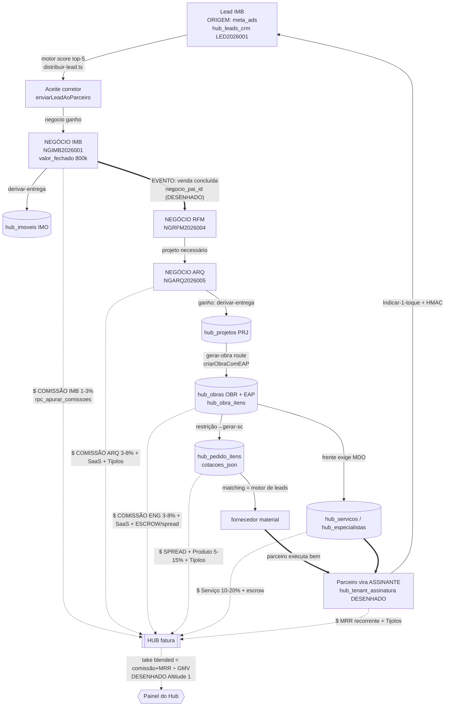

# Obra10+ / Escritório Virtual — Modelo de Negócio & Fluxos (COMPLETO)

> Documento-mãe ULTRA-detalhado. Produzido por mesa Fable (25 agentes) com recon ancorado no código real (migrações, RPCs, rotas, tabelas hub_*). Convenção: **[CONSTRUÍDO]** existe em código; **[DESENHADO]** só em spec; **[BUG/GAP]** achado verificado. Data: 07/jul/2026.


---

## Sumário Executivo

## Documento-Mãe Obra10+ / Escritório Virtual — Síntese do Editor-Chefe

**O que é.** O Obra10+ é um *rail* (trilho) transacional multi-vertical para a cadeia de construção e serviços: **capta** demanda → **roteia** por um motor determinístico de score → **gere** o ciclo `negócio → projeto → obra` por cima da rede → **liquida** o pagamento via custódia (escrow) auditada, e monetiza por **três torneiras simultâneas** — assinatura SaaS (MRR), comissão da rede (split por código único) e créditos de IA (Tijolos, metering 100:1). O Hub **não é um CRM**: o CRM é apenas a *altitude de dentro do tenant*. O produto é um marketplace/rail asset-light onde **o Hub é juiz, não parte**.

**A frase-mãe (a tese ética e de engenharia).** *"A honestidade é a arquitetura, não uma feature — o sistema é estruturalmente mais difícil de mentir do que de dizer a verdade."* Isso não é slogan: materializa-se em defesa-na-query (o endpoint de preço fechado nem seleciona `valor_unitario`), append-only onde há dinheiro/prova, delete-que-só-arquiva, escrow de dupla-chave humana distinta e selo de auditoria por número.

**Onde está (a verdade sem fachada).** A **Altitude 2** (dentro do tenant — captação, roteamento, negócios, esteira de entrega, obra/EAP, telas do dinheiro) está **CONSTRUÍDA e no ar**. A **Altitude 1** (o Hub acima da rede: ler todos os tenants, descer como juiz, "take blended na tela") está **DESENHADA, não construída** — papel de plataforma morto no runtime. O sistema é **single-tenant disfarçado** (tenant sentinela; isolamento por filtro de código, não por RLS, porque `service_role` bypassa RLS). A **IA está DESLIGADA** (Mistral sem chave) — tudo degrada para determinístico. O **motor de comissões** está construído e testado (4 tabelas + 3 RPCs via MCP) mas **represado na janela do dono**; **escrow E6** e a **camada AEC (E0–E7, A0–A1)** têm código pronto e migrações *file-only*; o **metering de Tijolos** roda em **modo sombra** (mede, não cobra).

**As leis inegociáveis.** Click-and-Go / IA-first (sugere→confirma, ≤3 cliques) · fonte única/várias lentes · o espaço vale ouro · honestidade de dado · nada se perde (linhagem, código único imutável, escrow cash-basis). O único gap **verdadeiramente irreversível** é a linhagem `negocio_pai_id`/`negocio_raiz_id` — a fechar antes de dado real de rede (7 negócios já entram "sem lead de origem").

**Números honestos.** ~40% do produto na visão completa; ~70% de um MVP seguro e operável single-tenant. A métrica-mãe (take blended = (comissão+MRR)÷GMV) é **zero na tela hoje**, porque depende da Altitude 1. O que falta não é reinventar economia — é acender interruptores na ordem certa: travar o irreversível → ligar a IA → aplicar a janela AEC/escrow → endurecer para o 2º tenant → cobrar (carteira+régua) → subir a Altitude 1 → Portal do Cliente.


---

## Índice

- 1. Sumário Executivo & Tese do Negócio
- 2. Modelo de Negócio & Unit Economics
- 3. As Duas Altitudes (Hub ↑ / Tenant ↓)
- 4. Verticais / Mercados (uma a uma, jornada completa)
- 5. Conexões Entre os Mercados — o Value-Chain / Flywheel do Hub
- 6. Fluxo-Mãe End-to-End
- 7. Motor de Direcionamento de Leads
- 8. Captação, Origem & Canais
- 9. Fontes de Rentabilização (EXAUSTIVO)
- 10. Escrow, Confiança & Pagamentos
- 11. Rastreabilidade & "Nada se Perde"
- 12. Estrutura Unificada de Obra
- 13. Cliente Final, 5 Medos & Portal
- 14. Papéis & Personas
- 15. IA-first, Conversacional & Agentes
- 16. Modelo de Dados
- 17. Segurança, RBAC, RLS & Multitenant
- 18. Mapa de Telas ↔ Modelo
- 19. Estado Real (Construído vs Desenhado) & Roadmap


---


## 1. Sumário Executivo & Tese do Negócio

> **Documento-mãe do Obra10+ / Escritório Virtual.** Esta seção define, em profundidade, *o que o negócio é*, *por que existe*, *como ganha dinheiro* e *o que já é real vs. o que ainda é intenção*. Todas as afirmações estão ancoradas em artefatos verificáveis do repositório (`C:\Users\wende\Documents\escritorio-virtual-ramon`). A convenção de estado usada em TODO o documento está fixada em §1.12 — leia-a antes de prosseguir.

---

### 1.1 A definição em uma frase (e por que cada palavra importa)

**O Obra10+ é um *rail* (trilho) transacional multi-vertical para a cadeia de construção e serviços: ele CAPTA demanda, ROTEIA essa demanda por um motor dedicado até o fornecedor certo, GERE o ciclo `negócio → projeto → obra` por cima, LIQUIDA o pagamento via custódia (escrow) auditada, e monetiza a rede por três torneiras simultâneas — assinatura SaaS, comissão por código único e créditos de IA.**

Cada palavra dessa frase é uma decisão de arquitetura, não retórica:

| Palavra | O que significa concretamente | Âncora real |
|---|---|---|
| **Rail / trilho** | O sistema é o caminho por onde a transação anda; as telas fixas e determinísticas são "trilhos confiáveis" e a IA é uma camada por cima que os invoca — **não se joga as telas fora**. | `visao-ia-first-comando-multimodal.md` ("RAILS + IA"); `lib/hub/executar-ferramenta-ia.ts` |
| **Multi-vertical** | Uma mesma COLUNA (espinha) serve seis mercados com motores de venda diferentes. Não são seis sistemas — é um esqueleto de tenant + módulos. | `MERCADOS_PREFIXO` em `lib/crm/negocio-cadastro.ts:5`; `arquitetura-camadas-negocio.md` |
| **Capta** | Tráfego (anúncio) ou cadastro manual cai no CRM do Hub como lead. | `hub_leads_crm`; `fluxo-core-captacao-direcionamento.md` |
| **Roteia** | Motor determinístico de score (SEM LLM) escolhe os 5 fornecedores mais aderentes. | `lib/crm/distribuir-lead.ts` (`scoreParceiro`) |
| **Gere por cima** | O negócio ganho DERIVA a entrega na área certa (obra/projeto/serviço), idempotente. | `lib/crm/derivar-negocio.ts` + `derivar-entrega.ts` |
| **Liquida via escrow** | Todo pagamento passa por custódia com dupla-chave; o Hub é o juiz. | migração `20260730120000_e6_financeiro_contrato_escrow.sql`; `lib/ia/aprovacoes.ts` |
| **Três torneiras** | SaaS/MRR + comissão (split) + créditos de IA (Tijolos). | `DESIGN-FINANCEIRO-REDE-COMISSOES.md`; `lib/ia/metering.ts` |

> **Nota de honestidade estrutural (não pule):** essa frase descreve o **modelo completo**. No runtime de hoje, a captação, o roteamento, o ciclo do lead e a esteira de entrega estão **construídos e no ar**; o escrow está **construído mas dormente** (migração marcada "NÃO aplicar — janela do dono"); a IA está **desligada** (Mistral sem chave); e a *altitude de rede* (o Hub vendo todos os tenants) está **DESENHADA, não construída**. O detalhe completo está em §1.10.

---

### 1.2 A frase-mãe (o cerne filosófico)

O produto tem uma frase que resume a sua vantagem competitiva e a sua ética de engenharia ao mesmo tempo. Ela está transcrita em `docs/PORTAL-CLIENTE-DESIGN.md` e ecoa em `docs/MODELO-DE-NEGOCIO-E-FLUXOS.md`:

> ## **"A honestidade é a arquitetura, não uma feature — o sistema é estruturalmente mais difícil de mentir do que de dizer a verdade."**

Isso não é slogan. É uma **restrição de design que se materializa em código real**, e é o que separa o Obra10+ de "mais um CRM". Prova por artefato:

- **Defesa na QUERY, não na UI.** No contrato de *preço fechado*, o endpoint do cliente **nunca faz `SELECT` de `valor_unitario`/`quantidade`** — é impossível vazar a composição de custo por inspeção de rede, não porque a tela esconde, mas porque o dado nunca sai do banco. (`lib/obras/financeiro.ts`, modo `totais`.)
- **Append-only onde há dinheiro e prova.** Medições, movimentos de escrow, comissões e `hub_eventos` são imutáveis por trigger (`trg_hub_comissoes_imutavel`, `trg_hub_negocio_fin_mov_imutavel`, guard `hub_append_only_guard()`). Correção = linha negativa de estorno, nunca `UPDATE`. Mentir exigiria apagar história que o schema proíbe apagar.
- **Delete só arquiva.** Nenhuma ação de usuário faz hard-delete; `excluirPessoaCrm`/`excluirEmpresaCrm` fazem `arquivado_em = now()` (`lib/crm/excluir-cadastro-crm.ts`, commit `9881fdc` converteu 10 endpoints). A linha permanece para auditoria.
- **O selo do cliente é prova por número, não badge.** Estados honestos: **ⓥ auditado** (conferido in loco, com nome+data), **ⓘ declarado** (informado, auditoria pendente — nunca finge ser ⓥ), **⚠ divergência** (mostra o número VERIFICADO, não o declarado). (`PORTAL-CLIENTE-DESIGN.md`, medo #4.)

Frases-satélite que operacionalizam a frase-mãe (todas com lastro):
- **"O Hub é juiz, não parte."** (diferencial contra o medo de ser enganado.)
- **"Nada se perde."** (rastreabilidade: linhagem pai/raiz, grafo, código único imutável.)
- **"Identidade esconde, documento aparece."** (chama-se tudo pelo NOME; código de identidade é interno — `rastreio-busca.ts`; ordem/OS aparece.)
- **"O Hub determina; o parceiro/arquiteto dá o OK."** (assimetria da dupla-chave de escrow.)

---

### 1.3 Por que o Hub existe — o problema que ele ataca

O dono (Wendel — engenheiro civil + corretor, perfil em `dono-perfil-wendel.md`) viveu a dor dos dois lados: quem **capta** o cliente (corretor/arquiteto) e quem **executa** (engenharia/obra). O problema real que o Hub ataca tem quatro faces:

1. **A demanda se perde entre elos.** Um lead de imóvel vira reforma vira projeto vira obra — e a cada handoff some quem indicou, some o histórico, some a comissão. O Hub trata isso com **código único tipo-CPF** (`lib/crm/codigos-rastreio.ts`) e **grafo de vínculos N:N** (`hub_negocio_vinculos`), para que a linhagem `PES → LED → NEG → OBR` sobreviva a cada passo.
2. **A confiança do cliente final é o gargalo do setor.** Obra é o produto onde o comprador tem mais medo: os **5 MEDOS** (atrasar / não acabar / não saber / ser enganado / perder dinheiro — `PORTAL-CLIENTE-DESIGN.md`). O Hub existe para ser a camada de **custódia + auditoria** que cura esses medos — não vendendo confiança, mas tornando-se estruturalmente incapaz de esconder a verdade (§1.2).
3. **O fornecedor é bom de ofício e ruim de gestão.** O Obra10+ dá a ele a COLUNA (CRM + funil editável + copiloto + EAP + financeiro) sem que ele precise montar um sistema. "A lógica está certa, o sistema é ruim de UX/visual" (`ceo-mandato-produto.md`) — o produto embrulha o processo que o fornecedor já tem.
4. **Ninguém cobra a rede inteira de forma justa.** Uma venda-de-imóvel que gera uma obra que gera uma marcenaria envolve N participantes. O Hub existe para **liquidar o split por cima da transação** (motor de comissões, §1.4 e Seção do Dinheiro) e cobrar sua fatia como *juiz* que audita, não como parte que executa.

O Obra10+ **é a plataforma principal** (não "só o CRM de captação"): o Hub recebe leads → qualifica/distribui ao fornecedor de maior score → o fornecedor trabalha **DENTRO da plataforma** → fecha → vira projeto/obra/serviço → gestão de obra. (`plataforma-arquitetura-visao.md`.)

---

### 1.4 A tese econômica — as TRÊS torneiras que confluem

A rentabilidade não vem de uma cobrança; vem de **três fontes que se somam sobre a mesma transação**. Esta é a tese financeira central (refs: `monetizacao-licenciamento-rede.md`, `decisoes-alavanca-06jul-faixa-escrow-tijolos.md`, `DESIGN-FINANCEIRO-REDE-COMISSOES.md`). Detalhe completo na Seção do Dinheiro; aqui fica a tese e o estado.

| # | Torneira | Como cobra | Estado real | Âncora |
|---|---|---|---|---|
| 1 | **Assinatura SaaS / MRR** | Mensalidade + por usuário (seat) + por módulo + por plano; recorrente, **sem rateio**. Planos denominados em **Blocos**: Fundação ~R$99, Estrutura ~R$249, Acabamento ~R$499. | **DESENHADO, não construído.** Billing não existe (`STATUS-MODULOS` #17 ≈ 3%). Tabelas `hub_planos`/`hub_tenant_assinatura`/`hub_tenant_modulos` **só em docs**. | `DESIGN-CARTEIRA-TIJOLOS-BLOCOS.md §7` |
| 2 | **Comissão da rede (split por código único)** | 1 transação → N beneficiários. Base = **POTE = `valor_fechado × percentual_comissao`**. Split congelado em snapshot imutável. Comissão sacável = **sempre BRL**. | **Motor CONSTRUÍDO e testado (06/jul)**: 4 tabelas + 3 RPCs, validado via Supabase MCP. **Represado** na janela do dono (RLS da espinha `hub_negocio_vinculos` a apertar). | `20260706170000_financeiro_rede_comissoes_fundacao.sql`; `hub_negocios` (`valor_fechado`, `percentual_comissao`, `comissao_calculada` GERADA) |
| 3 | **Créditos de IA — "Tijolos" (metering)** | Consumo de token medido, cobrado com **markup** (spread). **1 Tijolo = R$0,10; 1 Bloco = 100 Tijolos = R$10,00** (relação 100:1 = apresentação, não coluna). | **CONSTRUÍDO em modo SOMBRA**: mede mas não cobra (`IA_HARD_CAP` ausente = fail-open). Blocos/planos = desenhados. | `lib/ia/metering.ts`, `lib/ia/metering-calc.ts`; `20260626210000_ia_metering.sql` |

**A métrica-mãe da tese** (o número que prova o negócio) é o *take blended*:

> **take = (comissão realizada + MRR) ÷ GMV** — quanto o Hub extrai de cada real que passa pelo trilho.

Esse número **é zero na tela hoje**, porque depende da *altitude de rede* (§1.5), que está desenhada e não construída. (`MODELO-DE-NEGOCIO-E-FLUXOS.md §2`.)

**Regra de bolso que separa as moedas** (evita o erro fatal de virar e-money/BACEN — `DESIGN-CARTEIRA §4-5`):
- **Ação humana = grátis** (incluso no plano).
- **IA / serviço externo = Tijolos** (crédito pré-pago de serviço próprio; NÃO sacável, NÃO transferível).
- **Comissão de negócio + físico = BRL, nunca converte** (dinheiro de terceiros, sacável — é a razão do escrow existir).
- Os ledgers são **fisicamente separados**; a UI **nunca soma os dois saldos**. A única ponte é referência cruzada (`ref_tipo/ref_id`), jamais transferência de valor.

---

### 1.5 As DUAS ALTITUDES — a chave para entender o estado do produto

Todo o sistema tem que ser lido em duas altitudes. Confundi-las é o erro conceitual mais caro deste projeto.

```
┌───────────────────────────────────────────────────────────────┐
│  ALTITUDE 1 — O HUB (acima da rede)          [DESENHADO]        │
│  Vê TODOS os tenants + desce para dentro de qualquer um.       │
│  Enxerga MRR + comissão realizada da rede inteira (a métrica-  │
│  mãe). Regra: "só o dono do tenant MOVE; o Hub VÊ TUDO"        │
│  (quando entrar num tenant = read-only + trilha de auditoria). │
│  → NÃO EXISTE no runtime. Nenhum guard cross-tenant. Papel de  │
│    plataforma MORTO no runtime.                                 │
├───────────────────────────────────────────────────────────────┤
│  ALTITUDE 2 — DENTRO DO TENANT (o CRM onde o lead cai) [CONSTR.]│
│  Todo o /crm/*. Isolamento roda por filtro de código           │
│  (.eq("tenant_id", ctx.tenantId)). É onde o fornecedor         │
│  trabalha o dia-a-dia. HOJE É O ÚNICO QUE TEM RUNTIME.          │
└───────────────────────────────────────────────────────────────┘
```

**Provas do estado:**
- A altitude 2 é real: `getCallerContext` (`lib/crm/crm-api-auth.ts:79`) resolve `tenantId` da sessão (cookie), e cada endpoint filtra por ele. Guards de rota em `lib/crm/crm-permissoes.ts`.
- A altitude 1 é desenho: o escopo `plataforma` e a capability `plataforma:ler_cross_tenant` existem no **tipo** (`lib/rbac/role-map.ts:48,110-123`), mas **nenhum guard os consome** — não há endpoint SELECT-only que ignore o filtro de sessão. `DESIGN-RBAC-MULTITENANT.md §4`: "super_admin read-only cross-tenant… exige guard dedicado SELECT-only" → Onda 6, futuro. Impersonação ("ver como persona") = `§5.1`, sem código.
- **Single-tenant disfarçado:** todos caem no sentinela `DEFAULT_OBRA10_TENANT_ID = '00000000-0000-4000-8000-000000000001'` (`lib/tenant-default.ts`). A fundação multi-tenant existe (`current_user_tenant_id()` dinâmica, `20260626130000_multitenant_foundation.sql`) mas ninguém sai do sentinela.

> **Armadilha de nome — memorize:** a **"Faixa B" já aplicada = ENDURECIMENTO DE SEGURANÇA** (fechar RLS, backfill de `tenant_id` NULL, `.eq` puro). **NÃO é** a leitura da rede. A leitura cross-tenant (altitude 1) continua fechada e é **build**, não janela de migração.

---

### 1.6 A visão de rede — marketplace/rail, não CRM

O Hub NÃO é um CRM. Um CRM é uma consequência (a altitude 2). O Hub é um **marketplace/rail** que orquestra a rede. A distinção operacional:

- **Modelo de tenant (a complexidade colapsa):** existe **1 HUB** (camada meta) + **N FORNECEDORES** (cada escritório de arquitetura/engenharia/prestador/corretor/imobiliária = mesma estrutura de tenant, muda o MÓDULO/vertical sobre a mesma COLUNA). Dentro do tenant: **USUÁRIOS** (papéis) e **REGISTROS** (dados sem-ator: mão-de-obra sem login, clientes, imóveis, produtos). "Não são 10 sistemas — é 1 esqueleto de tenant + módulos." (`modelo-tenant-pragmatico.md`.)
- **Regra A vs. B (elegante, `DESIGN-RBAC-MULTITENANT.md §4`):**
  - **Assinatura SaaS → vira tenant próprio (Modelo A)** [futuro].
  - **Só comissionamento/direcionamento → view no Hub (Modelo B)** [é o default de hoje].
  - **Cliente final → sempre GUEST, nunca tenant.**
- **MESTRE × VINCULADO:** o Hub é dono do Lead Mestre; o fornecedor recebe o Lead Vinculado e trabalha. **Compartilha, não duplica.** Regra dura: "Hub vê TODOS os leads; fornecedor vê SOMENTE os dele." [O enforcement real disso é **DESENHADO** — depende do flip de RLS em ~36 tabelas; hoje o isolamento é filtro de código no sentinela único.]
- **Futuro recursivo (cuidado de arquitetura):** HUB-FRANQUIA (`Franqueador → Franquias-do-Hub → Fornecedores`). Por isso **não se pode chumbar "existe um Hub só"** — embora hoje esteja chumbado.
- **Marketplace/iFood da construção** [DESENHADO, Fase 2, `MARKETPLACE-DESIGN.md`]: o moat não é entrega rápida, é **"o cérebro da obra prevendo a falta antes do peão"** (EAP + estoque + restrição). Asset-light: Obra10 orquestra (trilho + demanda + predição + escrow + spread), o fornecedor cumpre, a logística (Lalamove) entrega. O matching **reusa o motor de leads** (`distribuir-lead.ts`), trocando "lead" por "item".

**As 6 verticais (uma coluna, motores diferentes)** — nunca achatar num funil só:

| Vertical | Prefixo (código) | Motor / ciclo | Entrega derivada |
|---|---|---|---|
| Imóvel | `IMB` | ticket alto, ciclo longo | `hub_obras` (default) |
| Arquitetura | `ARQ` | projeto, briefing→aprovações | `hub_projetos` (PRJ) |
| Reforma | `RFM` | fork Reforma (injeta Demolição) | `hub_obras` (OBR) |
| Engenharia/Obra | `ENG` | ticket altíssimo, meses, escrow | `hub_obras` (OBR) |
| Serviços | `SRV` | agendável, recorrente | `hub_servicos` (SRV) |
| Produtos + SaaS | `PRO`/`FOR` + SaaS | volume/transacional; SaaS = MRR | marcenaria/marmoraria/vidraçaria; assinatura |

(`MERCADOS_PREFIXO` em `lib/crm/negocio-cadastro.ts:5` = `["IMB","ARQ","RFM","MRC","ENG","SRV","PRO","FOR"]`; mapa de entrega em `lib/crm/derivar-negocio.ts:32-38`.) Estratégia do dono: **construir a COLUNA uma vez, uma vertical por vez** — Arquitetura primeiro (base para Engenharia), depois Engenharia, depois as demais.

**As duas etiquetas de todo lead** (invariante do modelo, implementado):
- **MERCADO (o quê)** — `resolverMercadoLead()`, default `"IMB"`, com `mercado_principal` + `mercados[]`. O código do negócio embute o mercado: `NGIMB2026001`.
- **ORIGEM (como veio)** — `LEAD_ORIGENS` (`lib/crm/lead-cadastro.ts:19`) = `whatsapp | instagram | meta_ads | google_ads | linkedin | site | indicacao | outro`; default `"whatsapp"`.

---

### 1.7 O FLUXO-MÃE em uma linha (e o que é real em cada elo)

```
Demanda CAPTADA → ROTEADA → ACEITA (vira negócio) → PROJETO/OBRA (execução) → PAGA (escrow) → COMISSÃO
```

| Elo | O que acontece | Estado | Âncora |
|---|---|---|---|
| **Captada** | Lead entra em `hub_leads_crm` (estágio `novo`); IA qualifica e preenche o CRM. | Entrada [C]; **qualificação por IA [D]** (Mistral off, flag `iaAutoCadastro` OFF em prod). | `fluxo-core-captacao-direcionamento.md`; `lib/crm/feature-flags.ts` |
| **Roteada** | Motor de score (determinístico) traz os 5 fornecedores; cria `hub_encaminhamentos` `aguardando_validacao`. | **[C]** funciona sem LLM. | `distribuir-lead.ts`; `sugerir-encaminhamento-auto.ts` |
| **Aceita** | Humano aprova → handoff ao parceiro (gate financeiro: bloqueado não recebe) → vira `hub_negocios`. | **[C]**; cascata de recusa ao próximo candidato [C]. | `notificar-parceiro-lead.ts`; `app/api/crm/negocios/route.ts` |
| **Projeto/Obra** | Negócio ganho DERIVA a entrega na tabela da área, idempotente. **Gate humano** ("propor+confirmar"). | **[C]**; a criação automática foi **revertida** para clique humano (decisão 02/jul — um "ganho" por engano criaria obra REAL imortal pela regra "nada se apaga"). | `derivar-entrega.ts`; `converter-obra/route.ts` (reversão em `negocios/[id]/route.ts:295-299`) |
| **Paga** | Medição append-only → recebível; escrow com **dupla-chave** (técnica + Hub); cash-basis. | **Escrow [C] mas DORMENTE** (migração "não aplicar — janela do dono"). | `medicoes/route.ts`; `lib/obras/financeiro.ts`; `lib/ia/aprovacoes.ts` |
| **Comissão** | Split congelado em snapshot; só paga após o cliente pagar; sacável em BRL. | **Motor [C]+testado, represado** na janela. | `20260706170000_...comissoes_fundacao.sql` (3 RPCs) |

---

### 1.8 A estrutura unificada da obra (por que "obra" não é caos)

A tese operacional que sustenta a vertical mais pesada (obra) é a **estrutura unificada**: **orçamento = cronograma = gestão = ESCOPO**, tudo o mesmo fio (`estrutura-unificada-orcamento-cronograma-escopo.md`):

> **ambiente → serviço/frente/disciplina → material + mão de obra + equipamento.**
> *"A planilha É o escopo: se está ali, está; se não, é aditivo."*

- Item único de escopo = `hub_obra_itens` (custo + preço + avanço + datas). BDI em 3 camadas (`bdiEfetivo`: item → obra → 1.0 neutro).
- **Lentes** sobre a mesma fonte (preço/custo/margem/avanço) e **personas** (executor/arquiteto/hub/prestador — o arquiteto NÃO vê dinheiro; o prestador vê só o preço do que executa). (`lib/obras/escopo.ts`.)
- Regra dura: **medido nunca passa do contratado sem aditivo aprovado** (`modulo-engenharia-obra.md`).

Isso conecta com a frase-mãe: o mesmo item alimenta memorial → planilha → proposta → contrato → cronograma → gestão → medição → Portal do Cliente. Não há "segunda verdade" para maquiar.

---

### 1.9 Os cinco princípios que governam todo o produto

Estas são as **leis** (`MODELO-DE-NEGOCIO-E-FLUXOS.md §9`; `ux-principio-click-talk-go.md`; `ceo-mandato-produto.md`). Toda tela e todo fluxo do documento se subordinam a elas:

1. **Click-and-Go / Talk-and-Go** — escolher e confirmar, **≤3 cliques** ("3" = o menor possível, não uma prisão); não digitar o que dá para clicar; voz preenche, humano confirma em 1 toque. (1º caso entregue: `LeadRapidoSideover` = só Nome+Telefone.)
2. **IA-first / conversacional** — a IA resolve a complexidade e **mostra o que fez** (nunca muda calado); sempre **sugere → humano confirma**, principalmente em compra/pagamento.
3. **Fonte única, várias lentes** — nada de telas duplicadas; o mesmo dado, fatiado por persona/contexto.
4. **O espaço vale ouro** — número puro parado é banido: ou vira **ação**, ou vira **tendência** (drill-in). **Tabela ≠ tela de trabalho** (tabela = Relatório, em `/crm/relatorios`).
5. **Honestidade de dado** — nunca número falso; o que depende de janela aparece como "acende na janela", não como zero mentiroso.

Estas leis são *inegociáveis* e servem de critério de aceite para qualquer proposta de tela no resto do documento.

---

### 1.10 Estado real vs. visão — a verdade sem fachada

Esta subseção é a bússola de expectativa. Métrica de referência: `STATUS-MODULOS.md` (01/jul) estima **~40% do produto na visão completa** e **~70% de um MVP seguro+operável**.

**CONSTRUÍDO e no ar (altitude 2 / staging-overlay `feature/escritorio-visual`):**
- CRM do tenant (leads/negócios/obras/pedidos), funil editável (`hub_pipelines`/`hub_pipeline_estagios`).
- Motor de direcionamento (score determinístico, sem LLM) + ciclo do lead (auditado 06/jul).
- Esteira de entrega idempotente (negócio → obra/projeto/serviço), com gate humano.
- Telas do dinheiro: split na ficha do negócio, "Meu Dinheiro", indicar-em-1-toque, undo de baixa.
- Motor de comissões: 4 tabelas + 3 RPCs, testado via MCP.
- Metering de IA (Tijolos) em **modo sombra**.
- RBAC de 13 papéis (`role-map.ts`) + escrow por capability + HMAC de atribuição de parceiro.

**CONSTRUÍDO mas represado / dormente (janela do dono):**
- E6 escrow/contratos (migração pronta, "NÃO aplicar"): dupla-chave, custódia contábil, contratos administração×preço-fechado.
- Motor de comissões represado até apertar a RLS da espinha `hub_negocio_vinculos`.
- Camada AEC (obra/arquitetura E0–E7, A0–A1): 10+ migrações **file-only**, código pronto.

**DESENHADO, não construído:**
- **Altitude 1** (leitura cross-tenant / impersonação / mover-como-juiz / `hub_negocio_acessos`) — *papel de plataforma morto no runtime*.
- **Dinheiro do Hub na tela** (a métrica-mãe *take blended*).
- Camada SaaS/MRR e entitlements (`hub_planos`, `hub_tenant_assinatura`, `hub_tenant_modulos`).
- Carteira Tijolos fase 1 (colunas de imutabilidade + `hub_carteira_topups` + RPCs atômicas) e Blocos/planos.
- Rastreabilidade completa: **linhagem `negocio_pai_id`/`negocio_raiz_id`** (o **único gap verdadeiramente irreversível** — `DESIGN-RASTREABILIDADE-CADASTROS.md`, Tier 0.3; já há **7 negócios "sem lead de origem"**).
- **Portal do Cliente** (a "alma do produto", ~10%, zero código; reusa o engine de obra).
- **IA ligada** (Mistral desligada — hoje "sem IA"); WhatsApp/UAZAPI operando com IA.

**Bombas-relógio conhecidas (a desarmar antes do 2º tenant), de `DESIGN-RBAC-MULTITENANT.md §4`:**
- `tenantScopeOrFilter` com ramo `tenant_id IS NULL` → vazamento cross-tenant adormecido (inofensivo com 1 tenant, perigoso no 2º).
- `INTERNAL_API_KEY` estática única + `NEXT_PUBLIC_INTERNAL_API_KEY` (chave ao browser) → rotacionar/reescopar.
- Markup 0/negativo aceito no PUT de config de IA (`app/api/crm/ia/config/route.ts:41-43`) → IA de graça (fix desenhado, não aplicado).
- Escrow no Modelo A: Chave Hub amarrada ao nível `owner` genérico → parceiro que licencia assinaria a própria Chave Hub (juiz+executor); cura = amarrar à pessoa física do Hub raiz.

> **Diretriz de leitura para a equipe:** onde este documento descrever um comportamento sem a etiqueta `[DESENHADO]`, presuma que existe em código verificável. Onde a etiqueta aparecer, trate como **contrato de intenção** — é o alinhamento do que vamos construir, não uma descrição do runtime.

---

### 1.11 O mandato de produto (como as decisões são tomadas)

Para alinhar *processo*, não só produto: o Obra10+ opera sob um **mandato de CEO de produto** (`ceo-mandato-produto.md`, "você é o meu CEO", 25/jun). O dono traz o mercado, as dores e os processos; o sistema **transforma em telas e PROPÕE soluções** — não espera o dono especificar UI. As travas desse mandato (que valem para todo o documento):

- **Revolução COM prudência:** pode mudar tudo, mas **aditivo**, preservando a lógica que já está certa; validado por gate (`tsc + vitest`), mesa redonda de UI/UX a cada etapa, backups reversíveis, sem push/secrets sem ordem.
- **Migração em produção = sempre janela do dono** (aplicar junto). Por isso o motor de comissões e o E6 estão "prontos e represados".
- **Só o dono decide negócio** (preço, split, política); o sistema decide técnico de baixo/médio risco sozinho.
- **Honestidade acima de bajulação:** o CEO aponta risco e discorda quando preciso (`contrato-ceo-honesto-sem-bajulacao.md`).

---

### 1.12 Convenção de estado usada em TODO o documento

Para que dono e equipe leiam sem ambiguidade, toda afirmação de capacidade carrega (explícita ou implicitamente) um destes rótulos:

| Rótulo | Significa | Como foi verificado |
|---|---|---|
| **[CONSTRUÍDO]** / **[C]** | Existe em migração aplicada **e** em código executável no runtime de hoje. | Arquivo/rota/tabela lido no repositório. |
| **[REPRESADO]** | Código e migração prontos, porém **não aplicados** em produção (aguardando janela do dono). | Migração presente + comentário "não aplicar" / file-only. |
| **[MODO SOMBRA]** | Roda e mede, mas **não produz efeito de negócio** (ex.: metering sem cobrança, `IA_HARD_CAP` ausente). | Gate/flag lido no código. |
| **[DESENHADO, não construído]** / **[D]** | Existe só em spec/decisão/memória; **sem tabela ou rota** que o realize. | Grep confirmou ausência no schema/rotas. |
| **[BUG/GAP]** | Defeito ou lacuna verificada no código durante o recon. | Linha/arquivo citado. |
| **[⚠️ contradição]** | Memória/decisão diverge do código atual. | Ambos os lados citados. |

> **Aviso de herança:** existem dois "documentos-mestre" antigos no repo — `docs/documento-mestre-obra10-v1.md` e `docs/01_documento_mestre.md` — ambos da era **Vercel + Anthropic-first**, **desatualizados** vs. o estado atual (**Render + Mistral-first, IA desligada**). Este documento-mãe os **substitui**; não herde as premissas deles cegamente.

---

**Síntese da tese, em três linhas, para fixar antes de descer aos detalhes:**

1. **O QUÊ:** um rail multi-vertical da construção que capta, roteia, gere e liquida — com o Hub como *juiz* da confiança.
2. **COMO GANHA:** três torneiras (SaaS + comissão por código único + Tijolos de IA), medidas pela métrica-mãe *take = (comissão+MRR)÷GMV*.
3. **ONDE ESTÁ:** a altitude-tenant está viva; a altitude-Hub (a rede) está desenhada; a IA está latente; e a honestidade — a única coisa que não se pode terceirizar — já está **na arquitetura, não numa feature**.


## 2. Modelo de Negócio & Unit Economics

> **Como ler esta seção.** Ela responde a uma pergunta só: *como este negócio ganha dinheiro e por que ele se sustenta*. Cada afirmação está ancorada num artefato real (tabela `hub_*`, arquivo, rota, migração ou decisão registrada) ou marcada como **[DESENHADO, não construído]** quando é intenção sem código. Todo número de GMV/LTV/CAC/margem é **ILUSTRATIVO** — um modelo para alinhar raciocínio, **não** um dado extraído do sistema (hoje o sistema é single-tenant e não mede a rede; ver §2.10). Convenção herdada dos digests: **[C]** construído no runtime · **[D]** desenhado · **[⚠️]** risco/bomba conhecida.

---

### 2.1 A tese central — o Hub é um *rail*, não um CRM

O erro de leitura mais caro que se pode cometer sobre este produto é chamá-lo de "CRM de construção". O CRM é **uma das telas dentro de um tenant**, não o negócio. O negócio é um **rail (trilho) multi-vertical de intermediação da construção e serviços**: uma camada que **capta demanda → roteia por um motor dedicado → gere o ciclo negócio→projeto→obra→pagamento por cima da rede → e tira valor de cada transação que passa**, sem executar a obra.

O modelo se resume em uma frase operacional:

> **"Uma base, um trilho, três torneiras."** Uma base de cadastros com código único (identidade); um trilho `lead → negócio → projeto/obra/serviço → pagamento (escrow) → comissão`; e três torneiras de receita (assinatura SaaS, comissão da rede, créditos de IA) que abrem sobre o mesmo trilho.

Isso posiciona o Hub na mesma família de negócios de **marketplace/rail**: iFood (rail de pedido+entrega de comida), Uber (rail de mobilidade), Mercado Livre (rail de comércio+pagamento+logística), Shopify (SaaS+pagamento sobre comércio). A diferença de vertical é o *ticket* e o *ciclo*: aqui a transação é uma obra/projeto/serviço de construção — ticket que vai de centenas de reais (um serviço avulso) a **centenas de milhares** (uma obra), com ciclo de meses e necessidade de custódia (escrow). Isso muda tudo na unit economics (ver §2.5): poucas transações de valor altíssimo, não milhões de transações baratas.

**As duas altitudes** (que definem *onde* o valor é capturado):
- **Altitude 1 — Hub acima da rede** [DESENHADO, não construído]: vê todos os tenants e desce para dentro de qualquer um (read-only + trilha de auditoria). É desta altitude que se enxerga o GMV agregado e o *take-rate blended* — hoje **zero na tela** (`docs/MODELO-DE-NEGOCIO-E-FLUXOS.md §2, §10`; `docs/AUDITORIA-DASHBOARD-CEO.md`). Regra dura: **"só o dono do tenant MOVE; o Hub VÊ TUDO"**.
- **Altitude 2 — dentro do tenant** [C]: o CRM onde o lead cai, guardado por `crmNivelFromRole`/`crmPodeVerRota` (`lib/crm/crm-permissoes.ts`), isolado por `.eq("tenant_id", ...)`.

A captura de valor **da rede** (comissão agregada + MRR agregado sobre o GMV total) só existe economicamente na Altitude 1. Hoje o motor transacional existe [C] mas roda dentro de **um** tenant sentinela (`DEFAULT_OBRA10_TENANT_ID = 00000000-0000-4000-8000-000000000001`), então o negócio-rail está **construído em miniatura, não em escala**.

---

### 2.2 Como o Hub captura valor SEM executar (asset-light)

O princípio de arquitetura de negócio é **asset-light**: o Hub **orquestra**, o fornecedor **executa**, o cliente **paga por dentro do trilho**, e o Hub **retém uma fatia + audita**. Ele nunca compra o material, nunca contrata o pedreiro, nunca assume a responsabilidade técnica da obra. O que ele possui é o **trilho, a demanda, o dado e a custódia**.

Cinco alavancas de captura de valor sem execução:

| # | Alavanca | Mecanismo real | O que o Hub NÃO faz |
|---|----------|----------------|---------------------|
| 1 | **Roteamento de demanda** | Motor de score determinístico (`lib/crm/distribuir-lead.ts`) → `hub_encaminhamentos` → handoff (`lib/crm/notificar-parceiro-lead.ts`) | Não atende o lead nem fecha a venda |
| 2 | **Comissão sobre o fechado** | POTE = `hub_negocios.valor_fechado × percentual_comissao`; snapshot em `hub_comissoes`; split em `hub_negocio_titulos` | Não vende o imóvel/obra; só rastreia e divide |
| 3 | **Assinatura SaaS** | Tenant usa a plataforma (CRM+obra+IA) por mensalidade+seats+módulos [D] | Não faz o trabalho do escritório; aluga o trilho |
| 4 | **Custódia (escrow) + auditoria** | `hub_obra_escrow_contas`/`hub_obra_escrow_movimentos`; Hub é **juiz** (2 chaves) | Não é parte do contrato obra↔cliente; é o cofre neutro |
| 5 | **Créditos de IA (Tijolos)** | Metering `lib/ia/metering.ts` com markup 10× sobre o custo real do LLM | Não vende tokens; vende *capacidade* com spread |

A frase-âncora do produto (`docs/PORTAL-CLIENTE-DESIGN.md`) explica por que o modelo é defensável: **"o Hub é juiz, não parte"** — ele lucra por **estar no meio de forma confiável**, não por assumir o risco de execução. Quem assume o risco técnico é o fornecedor (chave `escrow:chave_tecnica`, `architect`/`operation`); o Hub segura a chave `escrow:chave_hub` e **audita antes de liberar** (`lib/ia/aprovacoes.ts:validarChaveEscrow`). É exatamente o modelo asset-light do iFood (não cozinha) e do Uber (não é dono do carro), transposto para uma vertical de ticket altíssimo.

**Regra de ouro do que o Hub embolsa vs. o que ele apenas custodia** (fronteira regulatória, `docs/DESIGN-CARTEIRA-TIJOLOS-BLOCOS.md §5`, `docs/DESIGN-FINANCEIRO-REDE-COMISSOES.md §5`):
- **Dinheiro de terceiros em trânsito** (o pagamento cliente→fornecedor) = **custódia**, passa pelo escrow, é sacável, **não é receita do Hub** — é `hub_obra_escrow_movimentos`.
- **A fatia do Hub** (comissão da plataforma + taxa de serviço + MRR + spread de IA) = **receita**, essa sim vira caixa próprio.
- Trava dura no schema: `hub_comissoes.moeda TEXT DEFAULT 'BRL' CHECK (moeda = 'BRL')` — a comissão nunca é Tijolo (evita virar e-money/BACEN).

---

### 2.3 Drivers de receita — as três torneiras

O modelo tem **três fontes de rentabilidade que confluem sobre o mesmo trilho** (`docs/DESIGN-CARTEIRA-TIJOLOS-BLOCOS.md`, `docs/DESIGN-FINANCEIRO-REDE-COMISSOES.md`, `monetizacao-licenciamento-rede.md`). Elas têm **naturezas econômicas diferentes** e por isso se somam sem canibalizar:

| Torneira | Natureza | Recorrência | Rateio? | Estado |
|----------|----------|-------------|---------|--------|
| **1. Assinatura SaaS / MRR** | Aluguel de software | Mensal, previsível | Não | **[D]** desenhado |
| **2. Comissão da rede (split)** | Take transacional | Por negócio fechado | Sim (1 transação → N beneficiários) | **[C]** motor construído 06/jul |
| **3. Créditos de IA (Tijolos)** | Consumo com spread | Por uso | Não | **[C]** modo sombra |

Regra de bolso que decide **qual moeda debita cada ação** (`DESIGN-CARTEIRA §4`): **ação humana = grátis (incluída no plano); IA/serviço externo = Tijolos; comissão de negócio + valor físico = BRL, nunca converte.**

#### 2.3.1 Torneira 1 — Assinatura SaaS / MRR  [DESENHADO, não construído]

Fonte: `monetizacao-licenciamento-rede.md`, `DESIGN-CARTEIRA §7`. Status de código: os nomes `hub_planos`, `hub_tenant_assinatura`, `hub_tenant_modulos`, `hub_tenant_creditos` aparecem **apenas em docs** — nenhuma migração ou rota (Grep confirmou). Billing SaaS está em ~3% (`STATUS-MODULOS #17`).

**Três camadas hoje coladas que a assinatura separa:**
1. **Cadastro/Parte** — PF/PJ com código único tipo-CPF (`hub_pessoas.codigo` `PS2026001`, `hub_empresas` `EMP2026001+sufixo`); participa de negócio **sem login e sem mensalidade**. A maioria da rede fica aqui — é o "lado da oferta" gratuito, como o restaurante que só recebe pedido no iFood.
2. **Conta SaaS/Tenant** — cadastro promovido a conta paga (fornecedor/escritório); ganha login + RBAC. **É aqui que nasce o MRR.**
3. **Licença de módulos (entitlements)** [D, "GAP a construir; o Hub libera"].

**Estrutura de cobrança:** mensalidade + por usuário (seat) + por módulo + por plano + créditos. Catálogo de módulos cobráveis: CRM · Atendimento (WhatsApp) · Projetos · Obras · Serviços · Compras · Financeiro · Marketing · IA/Copiloto · Integrações. Base **não** cobrada (entra em qualquer plano): Cadastros+códigos, Dashboard, Usuários/RBAC, Admin.

**Planos propostos (a validar — decisão #4 do dono, `DESIGN-CARTEIRA §7`), denominados em Blocos:**

| Plano | Preço/mês (≈) | Blocos/mês | Franquia de Tijolos | Inclui |
|-------|---------------|-----------|--------------------|--------|
| 🧱 **Fundação** | R$ 99 | 10 | 300 Tijolos | CRM, 2 usuários, 1 obra |
| 🏗️ **Estrutura** | R$ 249 | 25 | 1.000 Tijolos | + Obra/EAP, escrow, WhatsApp IA, leads da rede |
| 🏠 **Acabamento** | R$ 499 | 50 | 2.500 Tijolos | + Portal do Cliente, ilimitado, IA avançada, prioridade no score |
| **Rede** | R$ 0 | — | (só bônus) | Parceiro leve, só comissionamento |

O plano **Rede** (mensalidade zero) é estratégico: é o análogo do "restaurante grátis no app" — maximiza o lado da oferta sem barreira de entrada, e o Hub ganha desse parceiro **pela torneira 2** (comissão), não pela 1. Quem vira tenant pago é quem quer **operar dentro** da plataforma (gestão de obra, portal do cliente), não só receber leads.

**Sanidade declarada** (`DESIGN-CARTEIRA §7`): a franquia do Estrutura (1.000 Tijolos = R$100 de valor de face) custa ~4% da mensalidade em LLM real (com markup 10×) — ou seja, a IA embutida no plano é subsídio barato que aumenta retenção sem furar a margem.

**Faseamento (decisão #6, risco de churn silencioso):** fase 1 = **fatura BRL fora da carteira** + o plano **credita a franquia** de Tijolos (`hub_ia_creditos_mov` tipo `assinatura`); débito-da-carteira e corte por saldo só na fase 2+, **após régua de aviso 7/3/1 dias** (cortar IA sem avisar = matar o copiloto no meio do atendimento).

**Por que a assinatura é a 1ª fonte a cobrar** (`PAINEL-DECISOES-CEO` item 6): é a receita **mais previsível e menos dependente da Altitude 1**. Comissão exige a rede rodando cross-tenant; Tijolo exige a IA ligada (Mistral está desligada). MRR só exige um gateway e a promoção de um cadastro a tenant pago.

#### 2.3.2 Torneira 2 — Comissão da rede / take-rate transacional  [MOTOR CONSTRUÍDO 06/jul]

Esta é a torneira que define o Hub como **rail** e não como SaaS puro. Design: `docs/DESIGN-FINANCEIRO-REDE-COMISSOES.md` (mesa Fable, CEO aprovou); aplicada + testada via Supabase MCP em 06/jul; telas no overlay `feature/escritorio-visual`.

**Princípio-mãe:** *"Uma base, um snapshot, um trilho, duas moedas que nunca se misturam."*

**A BASE da comissão = o POTE:**
```
POTE = hub_negocios.valor_fechado × (hub_negocios.percentual_comissao / 100)
```
Colunas **reais** (migração `20260522120000_ensure_hub_negocios.sql:14-16`):
- `valor_fechado NUMERIC(12,2)` — o valor da transação (o GMV daquele negócio);
- `percentual_comissao NUMERIC(5,2) DEFAULT 0` — o take-rate daquele negócio;
- `comissao_calculada NUMERIC(12,2)` — **coluna GERADA** = `valor_fechado * percentual_comissao / 100`.

Cada beneficiário recebe **uma fatia do pote** (% do pote ou valor fixo), nunca uma comissão paralela. *"Quem quer mexer no total mexe no `percentual_comissao` do próprio negócio."*

**O take-rate (percentual_comissao) por vertical — defaults sugeridos a validar** (`monetizacao-licenciamento-rede.md`):

| Vertical (MERCADO) | Prefixo | Take-rate sugerido | Racional econômico |
|--------------------|---------|--------------------|--------------------|
| Imóvel | IMB | **1–3 %** | Ticket altíssimo, margem imobiliária magra, corretagem já é 6% do mercado — Hub tira uma fração |
| Serviços | SRV | **10–20 %** | Ticket baixo/médio, alta frequência, pouca intermediação concorrente |
| Produto | PRO | **5–15 %** | Volume, transacional, comparável a marketplace de bens |
| Obra / Engenharia / Arquitetura | OBR/ENG/ARQ | **3–8 %** | Ticket altíssimo, ciclo longo, Hub agrega custódia+auditoria |

Percentuais em **camadas editáveis** pelo owner: prefixado por *tipo × mercado × produto* → override *negócio-a-negócio* / *membro-a-membro*. O default vivo hoje no código é `hub_parceiros.comissao_pct DEFAULT 5%` (`20260523170000_obra10_runtime_essencial.sql:122`).

**O split — 1 transação → N beneficiários por CÓDIGO ÚNICO.** É o coração do rail. Quatro tabelas novas [C] (`20260706170000_financeiro_rede_comissoes_fundacao.sql`), todas `tenant_id NOT NULL`, RLS on, `REVOKE ALL FROM anon, authenticated` (só service_role), append-only por trigger:

1. **`hub_split_regras`** — onde a regra nasce. `escopo IN ('parceiro','negocio')`; beneficiário `parceiro|pessoa|empresa|hub`; `papel_gatilho IN ('indicou_cliente','indicou_comprador','indicou_vendedor','executor','captador')`; `pct` XOR `valor_fixo`. **Precedência determinística de 4 degraus:** (1) ajuste manual no snapshot (alçada+log) → (2) regra `escopo='negocio'` → (3) regra `escopo='parceiro'` (+`mercado_sigla`) → (4) fallback `comissao_pct`. **Sem regra → 100% do pote fica no Hub** (dinheiro nunca some).
2. **`hub_comissoes`** — snapshot **imutável append-only**: congela tudo por VALOR (`base_valor`, `pool_pct`, `pct_aplicado`, `valor`, `beneficiario_nome`), `moeda CHECK ='BRL'`, correção = linha negativa (`estorna_comissao_id`, nunca UPDATE). Idempotência por UNIQUE `(negocio_id, apuracao_seq, beneficiario_tipo, beneficiario_id)`.
3. **`hub_negocio_titulos`** — o financeiro **por negócio** (a pagar/receber de cada participante). `valor_exigivel` = coração do cash-basis; `status IN ('previsto','apurado','exigivel','liberado','autorizado','pago','cancelado','retido')`; gate duplo `aprovacao_benef_id` + `aprovacao_hub_id`.
4. **`hub_negocio_fin_movimentos`** — extrato append-only.

**Três RPCs SECURITY DEFINER [C + testadas via MCP]:**
- `rpc_apurar_comissoes(...)` — congela o split que o **humano confirmou** (fatias vêm num jsonb); fail-closed se `valor_fechado` NULL/≤0 (`erro:'sem_valor_fechado'`), valida `SUM(fatias) ≤ pote+0.005`, grava linha explícita `regra_origem='residual_hub'` para a sobra. **Teste registrado:** pote=500 (10.000×5%), fatias 300+150, residual Hub=50, soma = pote.
- `rpc_registrar_recebimento_negocio(...)` — **cash-basis pro-rata**: cliente paga → cada fatia vira exigível = `fatia × (total_pago / valor_fechado)`; resíduo de centavos no maior título. **Teste:** pagar 50% → 150/75/soma 225.
- `rpc_liberar_pagamento_comissao(...)` — **dupla chave**: só libera se `aprovacao_benef_id`='aprovado' E `aprovacao_hub_id`='aprovado' E título EXIGÍVEL.

**Os 5 estados da comissão (a linha do tempo do take):** PREVISTA (simulação) → APURADA (confirma humano, nunca no drag do kanban) → EXIGÍVEL (cliente pagou, pro-rata) → APROVADA (2 chaves) → PAGA (baixa manual + comprovante). Renegociou depois de congelado = estorno (linha negativa) + apuração `seq+1`.

**Cadeia de atribuição — a rede que gera o split:**
- **Nível 1 [C]:** participantes de `hub_negocio_vinculos` com papel remunerável (o CHECK já inclui `'indicador'`). Ex.: arquiteto que trouxe o comprador = fatia BRL do pote.
- **Nível 2 [D, fase 2]:** `indicado_por` (self-FK + HMAC). **Hard-stop no schema: `CHECK nivel IN (1,2)`** — nível 3+ não existe (mata leitura de pirâmide/MMM). Decaimento 20%; recompensa de nível 2 = **bônus em Tijolos NÃO-sacáveis** (marketing do Hub, nunca descontado do split). Só paga sobre negócio **fechado E recebido**.

**Rotas/UI [C]:** `app/api/crm/financeiro-rede/route.ts` (GET "Meu Dinheiro" do escritório) · `app/api/crm/negocios/[id]/financeiro-rede/route.ts` (GET split/títulos + POST ações `apurar|receber|liberar`) · telas `app/crm/financeiro/rede/page.tsx` + `NegocioFinanceiroRedeSection`. Segurança: `tenant_id`/`criado_por` SEMPRE da sessão (`requireCrmFinanceiro`), nunca do body; posse por 404. **"Indicar em 1 toque"** [C]: `app/api/crm/indicacoes/route.ts` (carimbo imutável `metadata.indicacao`, dedup first-touch por telefone).

#### 2.3.3 Torneira 3 — Créditos de IA (Tijolos)  [CONSTRUÍDO em modo sombra]

Visão: `creditos-ia-metering-visao.md`. Código: `lib/ia/metering.ts` + `lib/ia/metering-calc.ts`. Migração `20260626210000_ia_metering.sql` (aplicada).

**A decisão-mãe: NÃO existe moeda nova.** O Tijolo **já é** o crédito de IA em `hub_ia_creditos_mov`. A "carteira ampla" = promover esse ledger a Carteira do Tenant (aditivo). Criar 2ª moeda = o único erro fatal.

**Paridade (âncora do código):** **1 Tijolo = R$ 0,10 → 1 Bloco = 100 Tijolos = R$ 10,00.** Armazenado em Tijolo inteiro; Bloco é regra de **apresentação** (como real×centavo). Config em `hub_ia_config.valor_credito_brl`. UX: *"compra em Blocos, gasta em Tijolos"*, vocabulário bancário — o usuário **nunca vê R$/tokens** (base de cálculo oculta).

**A mecânica do spread (o take da IA):**
```
custo_usd = (tokensIn·inputUSD/1M) + (tokensOut·outputUSD/1M)
custo_brl = custo_usd × fx × markup            ← fx=6, markup=10 (CONFIG_PADRAO)
tijolos_debitados = ceil(custo_brl / valor_credito_brl)   ← valor_credito_brl=0,10
```
Preços de referência (`PRECOS_MODELOS`, USD/1M tokens): Opus 4.8 5/25, Sonnet 4.6 3/15, Haiku 4.5 1/5, Mistral large 2/6, small 0.2/0.6; default conservador 10/50.

**O markup 10× é o driver de margem da torneira 3.** É *o mesmo mecanismo econômico do spread do iFood sobre a comida*: o Hub compra o insumo (token) a custo e revende embutido em Tijolo com margem. `spec-rede-comissoes` item 3: *"o que consome token da Anthropic/Mistral, a plataforma cobra com spread/markup configurável"* — zero tabela nova, o spread **já é** `markup` em `hub_ia_config`.

**Estado (LENTE "sem IA"):** `IA_HARD_CAP` em **modo sombra** (`assertSaldoAntesDoLLM` fail-open, `permitido=true` sempre) — o metering **mede mas não cobra**. Sequência de virada travada: **carteira → top-up → régua 7/3/1 → só então `IA_HARD_CAP=on`**.

**[⚠️ BUG confirmado no código]** `app/api/crm/ia/config/route.ts` PUT (linhas 41-43) valida só `Number.isFinite(Number(body.markup))` — **aceita markup 0/negativo = IA de graça**. O fix (`markup>=1` no PUT + CHECK no banco) **ainda não foi aplicado**. Isto é um furo direto na margem da torneira 3.

---

### 2.4 GMV, take-rate e receita — as métricas do rail

**Definições operacionais** (para alinhar o vocabulário da equipe):

| Métrica | Definição no nosso contexto | Fonte de dado real | Estado |
|---------|------------------------------|--------------------|--------|
| **GMV** (Gross Merchandise Value) | Soma de `hub_negocios.valor_fechado` de todos os negócios ganhos, em todos os tenants | `hub_negocios.valor_fechado` (existe [C]) — mas agregação cross-tenant [D] | Mensurável só na Altitude 1 |
| **Take-rate por negócio** | `percentual_comissao` daquele negócio | `hub_negocios.percentual_comissao` [C] | [C] por negócio |
| **Receita de comissão** | Só a fatia do Hub (residual + regras `beneficiario_tipo='hub'`) | `hub_comissoes WHERE beneficiario_tipo='hub'` [C] | [C] por tenant |
| **MRR** | Soma das assinaturas ativas | `hub_tenant_assinatura` [D] | [D] |
| **Receita de IA** | Σ(markup − custo) por movimento | `hub_ia_consumo` (colunas de snapshot de markup [D]) | [C] mede, [D] separa margem |
| **Take blended** | (comissão do Hub + MRR + margem IA) ÷ GMV | precisa das 3 torneiras agregadas | **[D]** — hoje **zero na tela** |

A **métrica-mãe** do negócio é o **take blended** = `(comissão da rede + MRR) ÷ GMV` (`docs/MODELO-DE-NEGOCIO-E-FLUXOS.md §10`). Ela é **zero na tela hoje** porque depende da Altitude 1 (leitura cross-tenant), que é [D]. É o número que prova se o rail está capturando valor de forma saudável — abaixo de ~2-3% o rail está "regalando" o serviço; acima de ~15% num vertical de ticket alto ele vira predatório e a rede foge.

**Exemplo concreto de captura de valor num único negócio [ILUSTRATIVO, aritmética real do motor]:**

Cenário: uma **obra de reforma** fechada por **R$ 200.000**, take-rate 5%, com um arquiteto que indicou o cliente.

```
valor_fechado         = R$ 200.000,00
percentual_comissao   = 5,00 %
POTE (comissao_calc)  = R$  10.000,00   ← base do split

Split confirmado pelo humano (rpc_apurar_comissoes):
  - Arquiteto (indicou_cliente)  60% do pote = R$ 6.000,00  → hub_negocio_titulos (pagar)
  - Hub (residual)               40% do pote = R$ 4.000,00  → regra_origem='residual_hub'
  SOMA = R$ 10.000,00  (= pote, valida SUM ≤ pote+0,005)

Cliente paga a 1ª parcela de R$ 100.000 (50%):
  rpc_registrar_recebimento_negocio → pro-rata cash-basis
  - Título arquiteto vira exigível: 6.000 × (100.000/200.000) = R$ 3.000,00
  - Título Hub    vira exigível:    4.000 × (100.000/200.000) = R$ 2.000,00
  (a outra metade só fica exigível quando o cliente pagar o resto)

Receita reconhecida do Hub nesse momento (cash-basis) = R$ 2.000,00 (exigível)
GMV desse negócio = R$ 200.000  →  take do Hub nesse negócio = 4.000/200.000 = 2,0%
```

Note: **o take do Hub (2%) ≠ o take-rate do negócio (5%)** — porque parte do pote foi para o arquiteto (rede). O rail redistribui a maior parte da comissão para a própria rede (incentivo de oferta) e retém o residual. Isso é intencional e é o que faz a rede crescer.

---

### 2.5 Unit economics — LTV, CAC, payback

> **Aviso duro:** os números abaixo são um **modelo ILUSTRATIVO** para alinhar o raciocínio da equipe. O sistema **não mede** LTV/CAC hoje (não há billing, não há Altitude 1, `hub_eventos` ainda não alimenta analytics — `STATUS-MODULOS #15`). Trate isto como *hipótese a validar*, não como dado.

O Hub tem **dois "clientes" com unit economics separadas** que precisam ser modeladas em paralelo — é o erro clássico de marketplace tratar só um lado:

**(A) O TENANT/FORNECEDOR (lado da oferta = quem paga MRR + gera comissão)**

| Componente | Valor ILUSTRATIVO | Como se calcula |
|------------|-------------------|-----------------|
| Ticket médio de assinatura | R$ 249/mês (plano Estrutura) | Σ MRR / tenants ativos |
| Receita de comissão média/tenant | R$ 800/mês [suposição] | (nº negócios × pote × take Hub) / tenants |
| Receita de IA média/tenant | R$ 80/mês [suposição] | Tijolos consumidos × margem |
| **ARPA** (receita média por conta) | **≈ R$ 1.130/mês** | soma das 3 torneiras |
| Churn mensal | 4 % [suposição SaaS B2B PME] | tenants perdidos / base |
| **Lifetime** | 25 meses | 1 / churn |
| **LTV** | **≈ R$ 28.000** (×margem) | ARPA × lifetime × margem bruta |
| **CAC** | R$ 1.500–4.000 [suposição] | custo de vendas+marketing / tenants novos |
| **LTV/CAC** | **7–18×** (alvo saudável ≥ 3×) | — |
| **Payback** | 2–4 meses | CAC / (ARPA × margem) |

O que faz o LTV do tenant ser alto neste modelo: **três torneiras somadas** (SaaS não churna fácil quando o dinheiro do fornecedor passa pelo escrow do próprio Hub) + **alto switching cost** (histórico de obras, códigos únicos, portal do cliente já entregue) + **efeito flywheel** (quem respeita SLA recebe mais leads — ver `scoreParceiro`, penalidade `status_financeiro='bloqueado' −40`).

**(B) O CLIENTE FINAL / O NEGÓCIO (lado da demanda = o GMV que passa)**

Aqui a "unit" não é uma assinatura, é uma **transação (negócio)**. O que importa:
- **Take por transação** = fatia do Hub sobre o pote (ex. §2.4 = 2% do GMV do negócio).
- **CAC do lead** = custo de captação (anúncio Meta/Google via Windsor.ai) ÷ leads convertidos.
- **Taxa de conversão do funil**: lead → qualificado → encaminhado → aceito → negócio → ganho → pago. Cada gate tem perda; o motor de score existe para **maximizar aceite** (mandar o lead ao fornecedor de maior aderência).

**A conta que fecha o negócio-rail [ILUSTRATIVA]:** se o GMV anual da rede for R$ 50 MM e o take blended for 5%, a receita transacional é R$ 2,5 MM/ano; somada ao MRR (ex. 500 tenants × R$ 249 × 12 = R$ 1,5 MM) e à IA, o rail captura ~R$ 4 MM sobre R$ 50 MM de GMV = **take blended ~8%** — a métrica-mãe que hoje é zero na tela.

**Casos-limite da unit economics que a equipe precisa vigiar:**
- **Negócio ganho sem `valor_fechado`** → o pote é zero, a comissão "some em silêncio". A RPC recusa honestamente (`erro:'sem_valor_fechado'`), mas **falta guard na UI** (§2.9). Isso corrói o GMV medido.
- **7 negócios já entram "sem lead de origem"** (`MODELO §6/§10`) → a linhagem `negocio_pai_id`/`negocio_raiz_id` [D, Tier 0.3, único gap irreversível] impede atribuir CAC ao canal certo → LTV/CAC vira adivinhação. **Fechar a linhagem antes de dado real é pré-condição para medir unit economics.**
- **Clawback** [decisão pendente do dono]: cliente dá calote *depois* da comissão paga — cobrar de volta ou absorver? Sem regra, o LTV está superestimado.

---

### 2.6 Drivers de custo — o COGS do rail

Sendo asset-light, o Hub tem custo variável baixo *por transação de construção* (não compra material, não paga mão de obra). Seu COGS real é o de uma **plataforma de software+IA+pagamento**:

| Driver de custo | Natureza | Escala com | Mitigação no design |
|-----------------|----------|-----------|---------------------|
| **Custo de LLM (tokens)** | Variável | Uso de IA | Repassado com markup 10× (torneira 3 é *lucrativa*, não centro de custo — desde que o [⚠️ bug do markup] seja corrigido) |
| **Infra (Render web+worker+cron, Supabase)** | Semi-fixo | Nº tenants/tráfego | Worker dedicado + cron `*/5min`; fila durável `hub_msg_jobs` evita reprocesso |
| **WhatsApp/UAZAPI** | Variável | Nº mensagens | `WHATSAPP_DRY_RUN` para não gastar em teste; provider-agnóstico (`whatsapp-provider.ts`) permite trocar por custo |
| **Custódia/escrow (risco financeiro)** | Contingente | GMV custodiado | **Hub não se responsabiliza por desavença fornecedor↔cliente** (decisão travada na migração E6); escrow interno é custódia **contábil** (`provedor='interno'`), não banco real ainda |
| **Risco de PIX/chargeback** | Contingente | Volume de top-up | MED do PIX ~80d; dupla checagem em valores altos; limite diário por tenant (`DESIGN-CARTEIRA §6`) |
| **CAC (marketing de aquisição)** | Investimento | Crescimento | Windsor.ai (Meta Ads) é o único conector real hoje; ciclo diretor de tráfego (`app/api/ciclos`) |
| **Custo de fraude de comissão** | Contingente | Tamanho da rede | HMAC no `?por=` do link de parceiro (`lib/crm/parceiro-convite.ts`) fecha a forja do indicador |

**Insight de margem:** neste modelo, a IA é uma torneira de **receita com margem positiva** (markup 10×), não um custo — o inverso do que a maioria dos SaaS-com-IA sofre hoje. O risco é operacional (o bug do markup 0) e regulatório (não deixar o Tijolo virar sacável). O maior custo *contingente* é o **risco de custódia**: por isso a doutrina é **"o Hub é juiz, não parte"** e **"a comissão do Hub não se devolve"** — o desenho blinda o Hub de assumir o prejuízo de uma obra que deu errado.

**Custo de conformidade/segurança (dívida a pagar antes de escalar):** a Faixa B (endurecimento RLS), a rotação de `INTERNAL_API_KEY`, o backfill de `tenant_id NULL` e o guard SELECT-only cross-tenant (Ondas 4-7 do `DESIGN-RBAC-MULTITENANT.md`) são **pré-requisitos de custo** para ligar o 2º tenant com segurança — sem eles, o rail não pode operar multi-tenant sem risco de vazamento cross-tenant (uma bomba que hoje dorme por só existir 1 tenant).

---

### 2.7 Comparáveis — "o iFood da construção" e outros rails

O rótulo interno **"iFood/marketplace da construção"** (`docs/MARKETPLACE-DESIGN.md`, `marketplace-rede-servicos-ifood.md`) é uma bússola de modelo de negócio, não uma cópia de UX. O paralelo, com precisão:

| Dimensão | iFood | **Obra10+ / Hub** | Nota |
|----------|-------|-------------------|------|
| **O que roteia** | Pedido de comida | Lead / demanda de construção | Motor: `lib/crm/distribuir-lead.ts` |
| **Lado da oferta** | Restaurantes | Fornecedores/escritórios (arq/eng/prestador/imob) | `hub_parceiros`/`hub_fornecedores` |
| **Take** | ~12-27% do pedido | 1-20% do pote, por vertical | `percentual_comissao` |
| **Logística** | Entregador próprio/nuvem | **Lalamove** (fase 2/3, só urgência) | Asset-light: não é dono da frota |
| **Ticket** | R$ 30-100 | **R$ 500 – R$ 500.000** | Muda toda a unit economics |
| **Frequência** | Diária | Baixa (uma obra a cada meses) | LTV vem de MRR+recorrência de fornecedor, não de repetição do cliente final |
| **Custódia/pagamento** | iFood Pago | **Escrow com Hub-juiz + 2 chaves** | Diferencial: a custódia auditada É o produto |
| **Moat** | Densidade de rede + dado de demanda | **Rede + o "cérebro da obra" preditivo** | §2.8 |

Comparáveis mais precisos por torneira:
- **Torneira 1 (SaaS)** ≈ **Shopify / Pipedrive** — aluga o software de gestão ao fornecedor.
- **Torneira 2 (comissão/split)** ≈ **iFood / Mercado Livre / Uber** — take transacional sobre o GMV que passa pelo trilho.
- **Torneira 3 (IA com spread)** ≈ **Twilio / OpenAI-reseller** — revende capacidade de infraestrutura com markup.

O poder do modelo é **empilhar as três sobre a mesma base de rede** — algo que iFood (só take) ou Shopify (só SaaS+pagamento) fazem parcialmente. O comparável mais fiel de "SaaS + marketplace + fintech empilhados numa vertical" é **Shopify (SaaS + Shopify Payments + Shopify Capital)** e **Mercado Livre (marketplace + Mercado Pago + Mercado Envios)** — ambos provam que empilhar torneiras sobre uma rede aumenta o take blended sem aumentar o CAC.

**Sub-modelo do marketplace de materiais** [D, Fase 2 sobre E5, `docs/MARKETPLACE-DESIGN.md`]: JOB = *"comprar sem largar a obra"* (~3h → <3min). Matching = **reúso do motor de leads** (`distribuir-lead.ts`), trocando "lead" por "item de compra"; grava top-N em `hub_pedido_itens.cotacoes_json` (campo já existe em E5). Spread honesto: **preço-de-rede** (o ganho aparece como *desconto do cliente*) OU **taxa de serviço transparente** (obrigatória em obra por administração — nunca markup escondido, por causa do medo #4). Cadeia de ofícios com **split por elo** (`hub_contratacao`, Fase 3): arquiteto→empreiteira→prestadora→mão de obra, cada handoff é uma contratação encadeada com código único, **Hub sempre o escrow**.

---

### 2.8 O moat — rede + dado preditivo

Um rail sem moat vira commodity e o take-rate colapsa. O moat do Hub tem **duas camadas que se reforçam** (flywheel):

**Camada 1 — efeito de rede (dois lados):**
- Mais fornecedores homologados → melhor cobertura de mercado/geografia → melhor match para o lead → maior taxa de aceite → mais clientes satisfeitos → mais leads → atrai mais fornecedores.
- O **flywheel de mérito** está no código: `scoreParceiro` (`distribuir-lead.ts:62-124`) premia quem respeita SLA/KPI (`homologado +10`, `carga` anti-sobrecarga) e pune quem tem pendência financeira (`bloqueado −40`, `pendente −15`). **Quem serve melhor a rede recebe mais fluxo** — isso trava o fornecedor no rail (switching cost) e melhora a qualidade média sem o Hub executar nada.

**Camada 2 — dado preditivo (o verdadeiro moat, `MARKETPLACE-DESIGN.md`):**
> O moat **não é entrega rápida** — é **"o cérebro da obra prevendo a falta antes do peão"**.

O Hub acumula, na estrutura unificada de obra (`hub_obra_itens`, EAP, `hub_obra_frentes_eap`, estoque, restrições), o **dado de execução real de milhares de obras**: quanto de cada material cada tipo de obra consome, quando falta, quanto atrasa cada disciplina, qual fornecedor cumpre prazo. Esse dado permite, em escala:
- **Prever a demanda de compra antes da obra pedir** (EAP + estoque + restrição → sugere a SC antes da falta).
- **Precificar risco** (IA de risco/gargalos no onboarding auditorial).
- **Melhorar o match** (não só por geografia, mas por *histórico de cumprimento*).
- **Alimentar o escrow com evidência** (medição append-only com foto/vídeo → o selo de auditoria vira *prova por número*, não badge).

Esse dado **não é replicável por um concorrente que só faz uma torneira**: um SaaS de gestão de obra tem o dado mas não a rede; um marketplace de materiais tem a transação mas não o dado de execução; um portal de leads tem o lead mas não o ciclo completo até o pagamento. **O Hub tem o trilho inteiro `lead→obra→pagamento`, então tem o dado do trilho inteiro** — e é isso que defende o take-rate ao longo do tempo.

**Rastreabilidade como infraestrutura do moat** (`docs/DESIGN-RASTREABILIDADE-CADASTROS.md`, ~80% [C]): código único tipo-CPF (`lib/crm/codigos-rastreio.ts`), grafo N:N (`hub_negocio_vinculos`), "nada se perde" (delete só arquiva, `lib/crm/excluir-cadastro-crm.ts`), `hub_eventos` append-only (keystone F4). Sem essa espinha, o dado preditivo seria ruído; com ela, cada transação enriquece o cérebro. **Gap crítico que enfraquece o moat até ser fechado:** linhagem `negocio_pai_id`/`negocio_raiz_id` [D, Tier 0.3] — sem ela, "de qual venda-do-imóvel veio esta obra" é adivinhação permanente, e o grafo de valor da rede fica cego a montante.

---

### 2.9 Regras e casos-limite da captura de valor

Regras duras que o modelo já enforça (ou desenha) para não vazar valor nem virar predatório:

1. **Sem regra de split → 100% do pote fica no Hub** (`rpc_apurar_comissoes`, linha `residual_hub`). Dinheiro nunca some; na ausência de beneficiário, o Hub retém — não zera.
2. **Congelar só na confirmação humana** — a apuração **nunca** dispara no drag do kanban (lição do "spawn mágico" revertido em 02/jul, `negocios/[id]/route.ts:295-299`). Um "ganho" por engano criaria comissão real que a regra "nada se apaga" tornaria lixo imortal.
3. **Cash-basis** — comissão só vira exigível **depois** que o cliente paga (`rpc_registrar_recebimento_negocio`, pro-rata). O Hub não antecipa risco de inadimplência do cliente.
4. **A comissão do Hub não se devolve** (decisão travada na migração E6): o Hub audita, não se responsabiliza por desavença fornecedor↔cliente. Blinda a margem contra disputa de execução.
5. **Dupla chave para liberar dinheiro** — `escrow:chave_hub` (juiz) + `escrow:chave_tecnica` (arq/eng); **humano distinto nas duas** (`lib/ia/aprovacoes.ts`, compara `aprovado_por` da linha irmã); **ai_agent nunca aprova dinheiro**; **nunca por voz**. O Hub determina, o parceiro dá o OK.
6. **Duas moedas nunca se misturam** — comissão sacável = BRL sempre; Tijolo nunca é comissão; ponte só por referência cruzada (`ref_tipo/ref_id`), nunca transferência de valor. UI nunca soma os dois saldos.
7. **Take-rate em camadas editáveis** — default por tipo×mercado, override por negócio/membro; "quem quer mexer no total mexe no `percentual_comissao` do próprio negócio".

**Casos-limite que ainda drenam ou distorcem valor (a resolver):**

| Caso-limite | Efeito no valor capturado | Estado / mitigação |
|-------------|---------------------------|--------------------|
| `valor_fechado` NULL no ganho | Pote=0, comissão "some em silêncio" | RPC recusa honesto; **falta guard na UI** [gap] |
| Markup 0/negativo aceito no PUT config | IA de graça → margem da torneira 3 vai a zero | **[⚠️ BUG]** não corrigido (`ia/config/route.ts:41-43`) |
| Soma de fatias > 100% do pote | Comissão excede a base → prejuízo | Mitigado em 3 camadas (barra UI + 400 API + `SUM≤pote` na RPC) |
| Dupla contagem obra×negócio | GMV/receita inflados | Ponte obrigatória `pagamento_obra_id`/`ref_escrow_mov_id` |
| Negócio sem linhagem de origem | CAC/LTV por canal impossível | **[D]** Tier 0.3 — único gap irreversível |
| Clawback (calote pós-pagamento) | LTV superestimado | **Decisão pendente do dono** |
| SEC-8: inserts de custo IA não-atômicos | Reconciliação de Tijolos frágil | **[gap]** precisa RPC transacional (janela do dono) |
| RLS aberta sob o dinheiro (`hub_negocio_vinculos`) | Atendente podia mexer em comissão | Faixa B endurece; motor represado na janela do dono |

---

### 2.10 Estado do modelo de negócio — construído vs. desenhado

Fechando a seção com a verdade sem fachada (`docs/MODELO-DE-NEGOCIO-E-FLUXOS.md §2, §10`; `STATUS-MODULOS.md`):

**Construído e no ar (staging/overlay `feature/escritorio-visual`):**
- Motor de comissão/split — 4 tabelas (`hub_split_regras`, `hub_comissoes`, `hub_negocio_titulos`, `hub_negocio_fin_movimentos`) + 3 RPCs testadas via MCP.
- Telas do dinheiro — split na ficha do negócio, "Meu Dinheiro", indicar-1-toque, undo-de-baixa.
- Metering de IA (Tijolos) em **modo sombra** — mede, não cobra.
- A base do rail — código único, grafo de vínculos, esteira de entrega idempotente, funil por mercado (`hub_pipelines`), motor de score determinístico (roda **sem IA**).

**Construído mas represado (janela do dono):**
- Escrow/contratos E6 (`20260730120000_e6_...sql` — marcada "⚠️ NÃO aplicar"): custódia contábil, dupla chave, cash-basis. Bug conhecido `GREATEST(0, ...)` (custódia fantasma) + falta `FOR UPDATE`.
- Camada AEC (E0–E7, A0–A1): código pronto, migrações file-only.

**DESENHADO, não construído:**
- **Altitude 1 (Hub acima da rede)** — leitura cross-tenant, impersonação, `hub_negocio_acessos`. **O papel de plataforma está MORTO no runtime.** Sem isto, **GMV agregado, MRR agregado e take blended não existem na tela** — a métrica-mãe é zero.
- **Camada SaaS/MRR** — `hub_planos`, `hub_tenant_assinatura`, `hub_tenant_modulos`, `hub_tenant_creditos`; billing em ~3%.
- **Carteira Tijolos fase 1** — colunas novas em `hub_ia_creditos_mov`, `hub_carteira_topups`, RPCs atômicas; gateway/PIX/boleto/NF.
- **Nível 2 da cadeia de comissão**, **hard-cap de IA ligado**, **Portal do Cliente**, **Marketplace de materiais**.

**Duas armadilhas de nome que a equipe precisa ter travadas:**
1. **"Faixa B já aplicada" = ENDURECIMENTO de segurança, NÃO leitura da rede.** A leitura cross-tenant continua fechada e é **build, não janela**.
2. **Single-tenant hoje.** O isolamento é filtro de código (`.eq tenant_id`), não RLS de rede; `crmDb()` usa service_role e **bypassa RLS** — a barreira primária é o código. Multi-tenant real depende das Ondas 4-7 do RBAC.

**Conclusão de alinhamento para o dono e a equipe:** o *coração transacional* do modelo de negócio (o take da rede, torneira 2) **existe, foi testado e está no ar em miniatura** — prova que o rail funciona. O que falta para o modelo virar **negócio mensurável em escala** não é reinventar economia, é **acender três interruptores na ordem certa**: (1) ligar a **assinatura SaaS** (a receita mais previsível e menos dependente de tudo o mais); (2) subir a **Altitude 1** para enxergar GMV/take blended; (3) ligar a **IA + carteira Tijolos** com a régua de aviso, corrigindo antes o bug do markup. Cada interruptor abre uma torneira; as três sobre a mesma rede é o que separa este produto de "mais um CRM".


## 3. As Duas Altitudes (Hub ↑ / Tenant ↓)

> **Tese da seção.** O produto não é "um CRM". É uma estrutura de **duas altitudes de observação e comando** sobre a mesma coluna de dados: a altitude do **Hub** (acima da rede, olhando todos os tenants de cima e podendo *descer* para dentro de um) e a altitude **dentro do tenant** (o chão de fábrica, o CRM onde o lead cai e o trabalho acontece). A regra-mãe que rege a fronteira entre elas é uma só e cabe numa frase: **"só o dono do tenant MOVE; o Hub VÊ TUDO."** Esta seção detalha o que cada altitude é, o que já roda (CONSTRUÍDO) e o que ainda é intenção (DESENHADO, não construído), com os arquivos, tabelas e rotas reais que sustentam — ou que faltam sustentar — cada afirmação.

**Aviso de estado, dado uma vez para toda a seção:** hoje o sistema roda **single-tenant** (um único tenant sentinela). A Altitude 1 (Hub acima da rede) está **DESENHADA, não construída** — não existe no runtime nenhum guard cross-tenant, nenhuma tela que agregue vários tenants, nenhuma impersonação. A Altitude 2 (dentro do tenant) está **CONSTRUÍDA** e é onde 100% da operação vive. Tudo que a lente chama de "Faixa B / endurecimento" é segurança da Altitude 2 — **não** é a leitura da rede. Não confundir as duas coisas é o ponto mais importante desta seção.

---

### 3.1 O modelo mental: duas altitudes, uma coluna

Pense num prédio de vidro com um mezanino de auditoria.

| | **Altitude 1 — HUB (↑ acima da rede)** | **Altitude 2 — DENTRO DO TENANT (↓ o chão)** |
|---|---|---|
| **O que é** | A camada meta: growth, comercial da rede, direção, **auditoria** ("gestão da gestão") | O CRM/ERP operacional de UM escritório (fornecedor, arquiteto, corretor, imobiliária) |
| **Quem opera** | Staff da plataforma (Wendel + equipe do Hub) | O dono do tenant e a equipe dele (vendedores, engenharia, financeiro) |
| **O que enxerga** | **TODOS** os tenants + pode descer para dentro de qualquer um | **APENAS** os dados do próprio tenant |
| **O que faz** | **VÊ** tudo; quando entra num tenant, entra como **juiz/auditor** (read-only + trilha); só move como árbitro do escrow | **MOVE** a esteira: cria lead, qualifica, fecha negócio, gera obra, mede, paga |
| **Métrica-mãe** | Take blended da rede = (comissão + MRR) ÷ GMV; MRR; comissão realizada | Faturamento do escritório, pipeline, avanço de obra, "Meu Dinheiro" |
| **Estado** | **DESENHADO, não construído** (papel de plataforma morto no runtime) | **CONSTRUÍDO** e no ar |

Ambas as altitudes usam **a mesma COLUNA** (a espinha compartilhada, memória `arquitetura-camadas-negocio.md`): copiloto conversacional + funil editável (`hub_pipelines`/`hub_pipeline_estagios`) + engine/ferramentas de IA + kanban + os elos `lead → negócio → projeto/obra → pagamento`. **O Hub não é um sistema separado** — é uma **lente elevada** sobre a mesma coluna, com um filtro de tenant removido (e uma trilha de auditoria adicionada). Essa é a decisão de arquitetura que evita construir "dois produtos": constrói-se a coluna uma vez, dentro do tenant; a altitude Hub é a mesma coluna vista sem o `WHERE tenant_id = …`.

O erro de arquitetura que o dono explicitou evitar (memória `modelo-tenant-pragmatico.md`): **não chumbar "existe um Hub só"**. O modelo tem de admitir, no futuro, `Franqueador → Franquias-do-Hub → Fornecedores` (HUB-FRANQUIA recursivo). Hoje o Hub *está* chumbado como um só (o tenant sentinela é hardcoded — ver §3.7), e desatar esse nó é parte do trabalho da Altitude 1.

---

### 3.2 Altitude 2 — DENTRO DO TENANT (o que está CONSTRUÍDO)

Esta é a altitude viva. Tudo em `/crm/*` roda aqui. É onde o lead cai, é o "chão de fábrica".

#### 3.2.1 Como a identidade e o tenant do chamador são resolvidos

Fonte: `lib/crm/crm-api-auth.ts` (`getCallerContext`), `lib/crm/supabase-server.ts`, `lib/tenant-default.ts`.

1. **Autenticação** — o cookie httpOnly `CRM_ACCESS_COOKIE` é **validado na fonte** contra `/auth/v1/user` do Supabase (`resolveCallerAuthId`, `crm-api-auth.ts:40`), que confere **assinatura + expiração**. (Correção de segurança de 05/jul: antes o `sub` era só decodificado localmente em base64 → um cookie forjado passava; hoje é verificado de verdade.)
2. **Tenant** — `getCallerContext` (`crm-api-auth.ts:79`) resolve `ctx.tenantId` **a partir da sessão**, nunca do corpo da requisição.
3. **Isolamento** — todo endpoint filtra `.eq("tenant_id", ctx.tenantId)`. Como `crmDb()` usa a **service_role key** (que **bypassa RLS**), a **barreira primária de isolamento é o filtro no código**; a RLS é a camada 2 (defesa em profundidade).

#### 3.2.2 Os dois helpers de escopo (a decisão de segurança mais repetida do repo)

Confirmado agora na leitura de `lib/tenant-default.ts`:

- **`tenantScopeExact(tenantId)`** (linha 55) — resolve o tenant e **nada mais**; **NÃO** inclui `tenant_id IS NULL`. É a **opção segura para tabelas privadas** (o caso normal). Uso: `query.eq("tenant_id", tenantScopeExact(tid))`.
- **`tenantScopeOrFilter(tenantId)`** (linha 68) — ⚠️ inclui `tenant_id.is.null` **de propósito**, e **SÓ** deve ser usado em **master-data global** (catálogos/pipelines/config onde `NULL` = "vale para todos"). Em tabela privada, **VAZA entre tenants**: a linha legada com `tenant_id NULL` aparece para todo mundo. O próprio comentário do código aponta o risco e manda ver `docs/AUDITORIA-TENANT-NULL-LEAK-05JUL.md`. Ele é reconhecido como **padrão de todo o repo** com múltiplos consumidores (obs. 13972, 05/jul).

Regra prática para a equipe: **tabela privada ⇒ `tenantScopeExact` + `.eq`**. Só use `tenantScopeOrFilter` se a tabela é um catálogo compartilhado. Este é, hoje, o mecanismo de isolamento de tenant — não a RLS.

#### 3.2.3 O caminho interno (cron/worker) e o header de tenant

`tenantIdFromRequest(headers)` (`tenant-default.ts:87`) só honra o header `x-tenant-id` **quando acompanhado de `x-api-key === INTERNAL_API_KEY`** (a chave interna do servidor) **e** o UUID é válido. Sem isso, o header é ignorado e cai no default. **Rotas com sessão de usuário NÃO devem usar essa função** — devem derivar o tenant de `ctx.tenantId`. Isso é o que impede o browser de forjar o tenant pela borda.

#### 3.2.4 Guards de rota da Altitude 2

`lib/crm/crm-permissoes.ts` implementa a escada CRM legada de 5 níveis (`NIVEL_RANK`: owner 50 > gestor 40 > comercial 30 > financeiro 20 > atendente 10) e os mapas de rota:

- `ROTA_MIN_NIVEL` — prefixo → nível mínimo. Ex.: `/crm/onboarding-tenant`, `/crm/empresas`, `/crm/integracoes`, `/crm/contatos` = **owner**; `/crm/usuarios`, `/crm/aprovacoes`, `/crm/distribuicao` = **gestor**.
- `ROTA_ROLES_EXATAS` — o financeiro é **ortogonal**: um comercial de rank superior **não** entra em `/crm/financeiro`.
- `rotaAbertaPorEscrowCap` — exceção cirúrgica: **só** `/crm/aprovacoes` abre por **capability** de escrow, para `architect`/`operation` assinarem a chave sem serem elevados a gestor.

Guards expostos por `crm-api-auth.ts`: `requireCrmOwner`, `requireCrmGestor`, `requireCrmFinanceiro`, `requireCrmComercial`, `requireCrmSessao`, `requireCrmAprovador` (gestor+ **OU** portador de `escrow:chave_tecnica`/`escrow:chave_hub`), `requireInternalApiKey`.

#### 3.2.5 Navegação da Altitude 2

A sidebar é montada por `lib/crm-nav-groups.ts`, **filtrada por papel**. Um `commercial` vê o funil; não vê `/crm/usuarios` nem `/crm/financeiro`. O shell é `app/crm/layout.tsx` (refatorado em `CrmShell` + `CrmLayout`, commit d0fea5b). O copiloto de voz (`components/crm/CopilotoVoz.tsx`) é montado aqui como FAB (dynamic, `ssr:false`).

---

### 3.3 Altitude 1 — O HUB ACIMA DA REDE (DESENHADO, não construído)

Esta é a altitude que **ainda não existe no runtime**. É crucial que a equipe entenda que ela é **intenção arquitetada**, não código rodando. As provas de que está DESENHADA (e não construída):

#### 3.3.1 O escopo existe no TIPO, mas não é consumido por nenhum guard

Confirmado agora em `lib/rbac/role-map.ts`:

- O tipo `RbacEscopoTenant` (linha 48) inclui **`"plataforma"`** entre `hub | guest | proprio-ao-licenciar | plataforma`.
- Os papéis `super_admin` (linha 110) e `admin_hub` (linha 117) carregam `escopo_tenant: "plataforma"` **e** a capability **`plataforma:ler_cross_tenant`** (declarada em `RbacCapacidade`, linha 61: *"leitura cross-tenant (staff-plataforma)"*).
- **MAS** essa capability **não é consumida por nenhum guard**. Não existe endpoint SELECT-only que ignore o filtro de sessão e leia através dos tenants. O tipo e o papel existem; o **enforcement não**.

O próprio design é explícito (`docs/DESIGN-RBAC-MULTITENANT.md §4`): *"super_admin read-only cross-tenant NÃO se resolve reusando os endpoints normais… exige guard dedicado SELECT-only"* → previsto para a **Onda 6**, futuro.

#### 3.3.2 O que a Altitude 1 fará quando existir (a lista de capacidades desenhadas)

1. **Ver a rede toda de cima** — dashboards/analytics do Hub que agregam **todos os tenants**: quem é dono de cada negócio, quem está envolvido, em que mercado, em que etapa, com a cor do mercado de origem; filtrar por mercado/escritório/etapa/saúde; "ver o avanço da rede num olhar" (`crm-cross-conta-visibilidade-permissao.md §6`, elevado a régua "absurdamente bom"). **Métrica-mãe** = take blended = (comissão + MRR) ÷ GMV — hoje **zero na tela**, porque depende da Altitude 1.
2. **Descer para dentro de um tenant** ("desce pra dentro de um") — entrar no CRM de um escritório específico como **auditor read-only + trilha**. Descrito em `DESIGN-RBAC-MULTITENANT.md §5.1`: *"estruturalmente read-only… perde capacidades de escrita em nível de código"*. **Não há código.** Confirma o "sem impersonação" da lente.
3. **Mover como juiz** — a única escrita do Hub dentro de um tenant é como **árbitro do escrow** (a Chave Hub) e como árbitro de disputa cross-conta. Nunca operar o dia a dia do escritório alheio.
4. **Financeiro do Hub na tela** — MRR + comissão realizada da rede. Exige "RLS Faixa B na janela" + um endpoint novo tipo `/api/crm/hub-financeiro` (`docs/AUDITORIA-DASHBOARD-CEO.md`). Não existe.

#### 3.3.3 Por que o "papel de plataforma está morto no runtime" — a prova pelo cockpit

`lib/crm/persona-cockpit.ts` mapeia `hub-auditor → "comercial"`. Ou seja: hoje, o `owner`/Hub renderiza **o dashboard comercial atual** (`aggregateDashboard` só filtra por tenant, **zero noção de papel** — comentário na linha 6). Isso materializa a decisão do dono **"owner OPERA, não só audita"** (D1): enquanto Wendel é o operador diário single-tenant, o cockpit do owner **é** a bancada de operação, não um painel de rede. O **modo auditoria/cross-tenant é uma lente adicional [DESENHADA]**, não o estado padrão. Conclusão dura: **a Altitude Hub não tem runtime hoje.**

---

### 3.4 Arquitetura de navegação: como as duas altitudes se manifestam em rotas

Hoje **tudo** vive sob `/crm/*` (Altitude 2). A separação de altitudes ainda **não** tem um namespace próprio de rota. Mapa do que existe vs. o que falta:

| Superfície | Rota real | Altitude | Estado |
|---|---|---|---|
| CRM operacional (leads/negócios/kanban) | `/crm`, `/crm/negocios`, `/crm/leads` | 2 | **CONSTRUÍDO** |
| Distribuição/direcionamento | `/crm/distribuicao` + `app/api/crm/distribuicao/fila` | 2 | **CONSTRUÍDO** |
| Obras / EAP / medição / escrow | `/crm/obras/[id]/{eap,escopo,cronograma,medicoes,...}` | 2 | **CONSTRUÍDO** (escrow E6 dormente) |
| Arquitetura / projetos | `/crm/arquitetura`, `/crm/projetos/[id]/programa` | 2 | **CONSTRUÍDO** |
| "Meu Dinheiro" (financeiro-rede do escritório) | `/crm/financeiro/rede` + `app/api/crm/financeiro-rede` | 2 | **CONSTRUÍDO** |
| Agentes / copiloto | `/crm/agentes`, `/crm/agentes-reais` | 2 | **CONSTRUÍDO** (IA latente) |
| Onboarding de tenant | `/crm/onboarding-tenant` (guard owner) | 2→A | **PARCIAL** |
| Portal do Cliente | `/portal` (persona `cliente`) | fora das 2 (guest) | **DESENHADO** (rota não existe) |
| Portal do Parceiro | `/parceiro/dashboard`, `/parceiro/cadastro/rede` | 2 (borda) | **CONSTRUÍDO** (link HMAC) |
| **Hub acima da rede** (agregação cross-tenant) | **— não existe —** (previsto algo tipo `/hub/*` ou `/crm/hub-financeiro`) | 1 | **DESENHADO** |
| **Descer no tenant** (auditar como juiz) | **— não existe —** (guard SELECT-only Onda 6) | 1→2 | **DESENHADO** |

**Ponto de alinhamento para a equipe:** quando a Altitude 1 for construída, a decisão de arquitetura provável é **não** duplicar telas — reusar os mesmos agregadores (`lib/crm/cockpit-aggregate.ts`, `analytics-aggregate`) removendo o filtro de tenant e adicionando trilha de auditoria, sob um namespace de rota que só a persona `plataforma` alcança, gated pelo guard SELECT-only dedicado.

---

### 3.5 A regra-mãe: "só o dono do tenant MOVE; o Hub VÊ TUDO"

Esta é a **constituição** da fronteira entre altitudes. Fonte canônica: `docs/insumos-do-dono/crm-cross-conta-visibilidade-permissao.md` (insumo do dono, 29/jun). Ela tem **três atores** e é aplicada **por linha de negócio**, não por tenant inteiro:

| Papel no negócio | Vê | Move na esteira | Comenta / atribui info |
|---|---|---|---|
| **Dono do negócio** (o escritório onde o negócio nasceu) | ✓ | ✓ **(só ele)** | ✓ |
| **Hub** | ✓ **(todos)** | ✓ **(como juiz)** | ✓ |
| **Envolvido** (ex.: arquiteto que trouxe o imóvel para o corretor) | ✓ (na **cor do mercado original**) | ✗ **NÃO move** | ✓ comenta + atribui informações |

Desdobramento em regras operacionais (todas do §3–4 do insumo):

- **O Hub vê os pipelines/CRM de todos os usuários** — leads e negócios de todos. É a camada de auditoria / "gestão da gestão".
- **Todo funil é customizável** tanto no Hub quanto no membro; e **é obrigatório** que todo usuário tenha um funil no seu mercado principal (não pode ficar sem).
- **Um negócio, um dono, N envolvidos.** O negócio aparece no CRM de todos os envolvidos, **mas só o dono (e o Hub) edita/move na esteira**. Ele aparece nos CRMs alheios **com a cor e as informações do mercado de origem** (anti-confusão: "é imobiliário, você está envolvido").
- **O envolvido acompanha o avanço, comenta e atribui informações — mas a esteira fica travada (read-only) para ele.**

**Exemplo concreto do dono** (transcrito do insumo): *o arquiteto vê o lead imobiliário no seu próprio CRM, sabe que é porque está envolvido no negócio, acompanha o avanço, mas só pode comentar e atribuir informações — não pode mover na esteira. Quem move é o corretor (dono) ou o Hub (juiz).*

**Estado desta regra:** **DESENHADO, não construído.** Ela depende de:
- `hub_negocio_acessos` (a tabela de ACL por envolvimento, do design da Plataforma) — **não existe no schema**.
- A evolução do modelo **lead MESTRE × VINCULADO** (`distribuicao-leads-motor.md`: "compartilha, não duplica"), que hoje só existe conceitualmente porque o runtime é single-tenant.
- **Mesa-redonda pendente** (§8 do insumo): definir o que é "atribuir informações" (campos? anexos?), notificação ao dono quando o envolvido comenta, como o envolvimento é criado (quem adiciona quem), e a herança de cor por mercado.

Hoje, sem `hub_negocio_acessos` e com single-tenant, essa matriz **não tem enforcement**. O que existe é o embrião: a espinha de vínculos (`hub_negocio_vinculos`, §3.8) e o `hub_negocios.tenant_id`. A regra "só o dono move" é hoje **implícita** (só há um tenant, então só há um dono possível).

---

### 3.6 A mecânica de "descer para dentro de um tenant" (DESENHADO)

Quando o Hub entra num tenant, a doutrina é **read-only por construção + trilha de auditoria**. Detalhamento do desenho (`DESIGN-RBAC-MULTITENANT.md §5.1` + `crm-cross-conta §7`):

1. **Read-only estrutural, não cosmético.** Não é "esconder o botão de editar". É perder a capacidade de escrita **em nível de código** — o guard SELECT-only nunca chama rotas de mutação. (Mesmo princípio de defesa-na-query que o Portal do Cliente usa: no preço-fechado o endpoint **nunca seleciona** `valor_unitario`, então é impossível vazar por inspeção de rede.)
2. **Trilha obrigatória.** Toda descida do Hub num tenant gera evento em `hub_eventos` (o keystone append-only) — "o Hub esteve aqui, viu isto, em tal hora". Nada-se-perde vale também para o auditor.
3. **A única escrita é a arbitragem.** O Hub só move como **juiz do escrow** (Chave Hub) e como árbitro de disputa cross-conta. Nunca opera o funil do escritório alheio.
4. **Break-glass** (Onda 6) — um mecanismo de acesso de emergência explícito, logado, para o Hub agir dentro de um tenant em incidente. Desenhado, não construído.

**"Mesmo core, telas diferentes por persona"** (o princípio anti-poluição, `crm-cross-conta §7`, decisão do dono 29/jun): a tela que o Hub vê ao descer **não** é a tela que o executor opera. **Hub audita/controla/2ª chave/distribuição — não executa** ≠ **executor (engenharia/obra) opera** ≠ **prestador (só seu escopo, sem ver a obra inteira nem a margem)**. Cada persona ganha uma interface curada sobre o mesmo motor. Isso vale para Portal, Marketplace, Hub, Tarefas e Aprovações. **Implicação de build:** nunca uma tela genérica "serve todos".

---

### 3.7 Como o isolamento realmente funciona HOJE (single-tenant disfarçado)

Este é o estado de fato, e a equipe precisa tê-lo cristalino antes de ligar o 2º tenant.

- **O tenant sentinela é hardcoded.** `DEFAULT_OBRA10_TENANT_ID = "00000000-0000-4000-8000-000000000001"` (`tenant-default.ts:2`). Todos os usuários caem nele. `defaultTenantId()` só troca isso se `process.env.DEFAULT_TENANT_ID` estiver setado.
- **A fundação multi-tenant já está aplicada, mas comportamentalmente neutra.** A migração `20260626130000_multitenant_foundation.sql` criou `current_user_tenant_id()` (SECURITY DEFINER: resolve `users.tenant_id` via `auth.uid() → users.auth_id`, com **fallback ao sentinela**). As ~36 tabelas `hub_*` já têm RLS tenant-scoped no padrão `tenant_id = current_user_tenant_id() OR tenant_id IS NULL`. Como todo mundo resolve para o sentinela, o comportamento é **behavior-preserving** — ninguém percebe a RLS.
- **A barreira real é o filtro de código, não a RLS** — porque `crmDb()` usa service_role (bypassa RLS). Ver §3.2.2.
- **Troca B→A não é re-arquitetura.** Ligar um 2º tenant "de verdade" (modelo A, §3.9) = inserir uma linha em `hub_tenants` com `tenant_type='parceiro'` + `parent_tenant_id = Hub` e migrar os dados daquele escritório — **migração local**, não reescrever a RLS. As colunas `tenant_type`/`parent_tenant_id` **ainda não existem** (Onda 4, aditiva).

**As bombas-relógio adormecidas** (inofensivas com 1 tenant, letais no 2º — `DESIGN-RBAC-MULTITENANT.md §4` + `multitenant-golive-plano.md`):

| # | Bomba | Por que dorme hoje | Cura |
|---|---|---|---|
| 1 | `tenantScopeOrFilter` + policies `x OR tenant_id IS NULL` | com 1 tenant, o NULL legado "é de todos" e ninguém mais existe | backfill NULL→sentinela + `NOT NULL` + trocar `OR` por `.eq` puro (Ondas 4–5) |
| 2 | `INTERNAL_API_KEY` estática única | segredo único que personifica **qualquer** tenant; e `NEXT_PUBLIC_INTERNAL_API_KEY` mandava a chave ao browser | rotacionar + reescopar por integração/tenant (Onda 7) |
| 3 | `resolveInviteTenantId`: owner pode convidar p/ **qualquer** `tenant_id` UUID (o sentinela é público) | só há um tenant p/ convidar | restringir owner → próprio tenant/filhos |
| 4 | `is_hub_admin()` não exige `tenant_type='hub'` raiz | não há tenant não-hub | amarrar admin-de-hub à raiz, senão modelo A cria super-admins locais globais |
| 5 | Furo do escrow no modelo A: Chave Hub = `isCrmOwnerRole` genérico | só há um owner (Wendel) | Chave Hub amarrada à pessoa física/allowlist do **Hub raiz**, não ao nível `owner` (D7) |
| 6 | `crmDb()` service_role sem guard em ~32 rotas + proxy libera qualquer sessão | atendente e dono são a mesma pessoa hoje | fechar tabelas abertas, guard de papel por rota (Faixa B) |

**Reforço da armadilha de nome:** a **"Faixa B" já aplicada = ENDURECIMENTO de segurança da Altitude 2** (fechar tabelas `USING(true)`, backfill de tenant NULL, `.eq` puro, `UNIQUE(tenant_id, documento)`). **NÃO é a leitura da rede.** A leitura cross-tenant (Altitude 1) continua fechada e é **build**, não janela de migração.

---

### 3.8 O eixo `escopo_tenant` e os papéis que "veem tenant"

`role-map.ts` é a **fonte única** dos 13 papéis canônicos do enum `app_role`, cada um com **4 eixos ortogonais**: `nivel` (escada linear só para internos), `persona` (cockpit/UI), `escopo_tenant` (onde enxerga) e `capacidades[]` (lista fechada). O eixo que define a altitude é **`escopo_tenant`**:

| `escopo_tenant` | Significado | Papéis | Altitude |
|---|---|---|---|
| **`plataforma`** | vê **cross-tenant** (staff da rede) | `super_admin`, `admin_hub` (fundidos por D4) | **1** (DESENHADO — capability `plataforma:ler_cross_tenant` sem guard) |
| **`hub`** | opera **dentro** do tenant Hub | `owner`, `admin`, `commercial`, `financial`, `operation` | **2** |
| **`proprio-ao-licenciar`** | vira tenant próprio **quando licenciar** | `architect` e os externos que assinam SaaS | **2 → A** (modelo A, futuro) |
| **`guest`** | nunca é membro de tenant | `client` (o cliente final) | fora das 2 (Portal) |

Detalhes que importam para a fronteira de altitude:
- **Só o cluster Hub-staff "vê o conceito de tenant"** (comentário `role-map.ts:94`). `owner` = persona `hub-auditor`, escopo `hub`, capacidades `["escrow:chave_hub", "hub:gerir", "crm:operar", "financeiro:ler"]` — ou seja, o owner **opera** (D1), não só audita.
- **`admin`** (Ramon/dev) = gestor técnico, escopo `hub`, **explicitamente SEM chave de escrow** (bloqueio: rank "gestor" não qualifica para dinheiro).
- **`super_admin`/`admin_hub`** são os únicos com `escopo_tenant: "plataforma"` e a capability cross-tenant — **os candidatos naturais à Altitude 1** quando ela existir. Hoje são staff-plataforma sem staff-plataforma real, por isso D4 os funde.
- **Fail-closed universal:** papel desconhecido → `nivel null, persona "restrito", escopo nenhum, capacidades []` (`role-map.ts:19`). Nunca cai no dashboard do Hub.

**Chaves do escrow como capability, não como rank** (fecha o furo do modelo A): `escrow:chave_hub` (owner = juiz) e `escrow:chave_tecnica` (`architect` em projetos OU `operation` em obra). São **capabilities explícitas**, nunca deduzidas de nível — exatamente para que, quando um parceiro licenciar e virar `owner` do próprio tenant, ele **não** herde automaticamente a Chave Hub do próprio pagamento (juiz ≠ parte). Enforcement em `lib/ia/aprovacoes.ts` (`validarChaveEscrow`): humano-only (`ehHumano`), humano **distinto** nas 2 chaves, ai_agent nunca aprova dinheiro.

---

### 3.9 Modelo A vs Modelo B — a regra elegante que separa "vira tenant" de "só comissiona"

A fronteira entre altitudes se materializa em **como** um parceiro entra na rede (`DESIGN-RBAC-MULTITENANT.md §4` + `multitenant-golive-plano.md`):

> **Assinatura SaaS → vira tenant próprio (MODELO A).**
> **Só comissionamento/direcionamento → view no Hub (MODELO B).**
> **Cliente → sempre GUEST, nunca tenant.**

| | **Modelo B (HOJE / default)** | **Modelo A (futuro)** |
|---|---|---|
| O que é | Todos são **papel dentro do tenant sentinela**; visão filtrada por persona + ownership de linha | Parceiro que **licencia** ganha **tenant próprio** (`tenant_type='parceiro'`, `parent_tenant_id=Hub`) |
| Estado | **CONSTRUÍDO** (é o single-tenant disfarçado) | **DESENHADO** (Onda 8; colunas `tenant_type`/`parent_tenant_id` não existem) |
| Gatilho | — | 1º parceiro assina SaaS |
| Isolamento | filtro de código no tenant único | tenant separado + RLS pura |

O dono **escolheu o Modelo A** no plano de go-live (28/jun) e mandou fazer a Fase 1 (isolamento) — mas **parou** (foi para o módulo Arquitetura). Prontidão registrada: **~55%** para blindar 1 tenant, **~25%** para ligar o 2º com segurança. Regra de negócio dura (`monetizacao-licenciamento-rede`): quem só recebe direcionamento e comissiona **não vira tenant** — é uma **view no Hub** (Modelo B), o que mantém a maioria dos cadastros na Altitude 2 sem custo de infraestrutura.

---

### 3.10 Registros SEM login não são "papel" nem "tenant" (a 3ª classe de entidade)

A confusão comum é achar que tudo que entra no sistema é usuário. Não é. O modelo tem **três classes** (`modelo-tenant-pragmatico.md`):

1. **TENANT** — o Hub (meta) + cada FORNECEDOR (escritório). Mesma estrutura, muda o módulo/vertical.
2. **USUÁRIO** — role **dentro** de um tenant (vendedor, engenharia, financeiro). Tem login + RBAC.
3. **REGISTRO** — dado **sem ator**, dentro do tenant, **sem login**: mão-de-obra/especialistas, clientes (cadastro), produtos, imóveis.

Exemplo que a equipe erra: **especialistas/mão-de-obra** (pedreiro, eletricista) são **REGISTRO**, não papel do enum (`especialistas-cadastro-mao-de-obra.md`, confirmado em `DESIGN-RBAC §3.4`). Vinculados ao fornecedor que os cadastra, sem login, sem tenant próprio. Dois caminhos de entrada: manual (chips) e link público (`app/especialista/cadastro` + `POST /api/public/especialista`, com `cadastrado_por` = convidador, mesmo padrão HMAC do convite de parceiro). O **cliente final** também é REGISTRO/GUEST — nunca membro de tenant; no Portal ele terá login próprio via `hub_portal_clientes` amarrado a `negocio_id`, mas isso é **guest**, fora das duas altitudes internas.

---

### 3.11 A espinha que sustenta o cross-conta: `hub_negocio_vinculos`

Mesmo sem `hub_negocio_acessos`, a rastreabilidade que **vai** alimentar a regra "vê/move/comenta" já existe parcialmente na Altitude 2:

- **`hub_negocio_vinculos`** (grafo N:N, CONSTRUÍDO) — colunas `negocio_id`, `entidade_tipo` (pessoa|empresa|parceiro|lead), `entidade_id`, `papel`, `codigo_rastreio`, `tenant_id`. Papéis (`VinculoPapel`): `cliente`, `contato_principal`, `lead_origem`, `empresa`, `parceiro`, `indicador`, `participante`. `criarVinculosNegocioFromLead()` cria os vínculos ao converter lead→negócio.
- É esse grafo que, no futuro, dirá **quem está envolvido** num negócio (para renderizá-lo no CRM do envolvido com a cor do mercado original). Hoje ele serve à comissão (§ Dinheiro) e à rastreabilidade; a **camada de visibilidade cross-conta** (quem vê o quê) é o que falta (`hub_negocio_acessos`).
- **Gap conhecido:** o N:N real **pessoa↔empresa** não existe (só `hub_pessoas.empresa_id`, FK 1:1); UI bidirecional a construir (provável `hub_pessoa_empresa_vinculos`).

**Buraco irreversível a fechar antes de dado real de rede** (`DESIGN-RASTREABILIDADE-CADASTROS.md`, Tier 0.3): **linhagem `negocio_pai_id` + `negocio_raiz_id`** (self-FK). Sem ela, "de qual venda-do-imóvel veio esta obra" vira adivinhação permanente — e a Altitude 1 (que audita a rede) precisa desse fio para provar a cadeia. Confirmado: **7 negócios já entram "sem lead de origem"** hoje.

---

### 3.12 Casos-limite e regras de fronteira (para não errar na implementação)

1. **Um endpoint com sessão NUNCA lê tenant do body nem do header.** Sempre de `ctx.tenantId`. `tenantIdFromRequest` é **só** para cron/worker com `INTERNAL_API_KEY`. Violar isso é reabrir o forjamento de tenant pela borda.
2. **Tabela privada com `tenantScopeOrFilter` = vazamento no 2º tenant.** Auditar cada uso: se a tabela não é catálogo global, trocar por `tenantScopeExact` + `.eq`.
3. **O Hub descer num tenant é read-only estrutural, não visual.** O guard SELECT-only não pode "só esconder botões" — tem de não expor rotas de escrita. (Defesa-na-query, como o Portal.)
4. **O Hub como juiz do escrow ≠ o Hub operando o escritório.** A única escrita legítima do Hub dentro de um tenant é a Chave Hub e a arbitragem de disputa. Ele não fecha negócio nem move funil alheio.
5. **Envolvido comenta, não move.** A esteira do negócio fica **travada (read-only)** para o envolvido; só comentário/atribuição liberados. O dono do negócio e o Hub movem.
6. **Owner local (modelo A) não pode assinar a Chave Hub do próprio pagamento.** Juiz e parte não podem ser a mesma pessoa — por isso a Chave Hub deve ser amarrada à pessoa física do **Hub raiz**, não ao nível `owner` genérico (D7). Bomba #5 acima.
7. **`getCallerContext` só barra `status != 'ativo'`.** Arquivar um usuário exige **setar o status** — senão o acesso permanece (Onda 0-b). Delete-só-arquiva vale para dados; para *acesso* é preciso o status.
8. **`CRM_OWNER_EMAILS` hardcoded** (`crm-permissoes.ts:46`: `ramonexercito`, `nice.engemp`, `ariane.ot`) é dual-source com `users.role` e está em drift — a corrigir na Onda 4 (owner só Wendel/obradezmais; Ramon→admin; Ariane→commercial).

---

### 3.13 Placar CONSTRUÍDO vs DESENHADO (a verdade sem fachada)

| Item da fronteira de altitudes | Estado | Âncora |
|---|---|---|
| Altitude 2 (CRM dentro do tenant) — auth, filtro de tenant, guards, navegação | **CONSTRUÍDO** | `crm-api-auth.ts`, `crm-permissoes.ts`, `crm-nav-groups.ts` |
| Helpers de escopo (`tenantScopeExact`/`OrFilter`) | **CONSTRUÍDO** | `tenant-default.ts:55,68` |
| Fundação multi-tenant (`current_user_tenant_id()`, RLS tenant-scoped neutra) | **CONSTRUÍDO (neutro)** | `20260626130000_multitenant_foundation.sql` |
| RBAC fonte única (13 papéis, 4 eixos, escrow por capability) | **CONSTRUÍDO** | `role-map.ts` |
| Escopo `plataforma` + capability `plataforma:ler_cross_tenant` | **TIPO existe, guard NÃO** | `role-map.ts:48,61,110` |
| Altitude 1 — agregação cross-tenant / dashboards da rede | **DESENHADO** | `DESIGN-RBAC §4`, `AUDITORIA-DASHBOARD-CEO.md` |
| "Descer no tenant" (auditor read-only + trilha + break-glass) | **DESENHADO** (Onda 6) | `DESIGN-RBAC §5.1` |
| Impersonação / "ver como persona" | **DESENHADO** (sem código) | `DESIGN-RBAC §5.1` |
| Regra "só o dono move, Hub vê tudo" (matriz vê/move/comenta) | **DESENHADO** | `crm-cross-conta-visibilidade-permissao.md §3-4` |
| `hub_negocio_acessos` (ACL por envolvimento) | **DESENHADO** (tabela não existe) | idem §5 |
| Lead MESTRE × VINCULADO em runtime | **DESENHADO** (single-tenant) | `distribuicao-leads-motor.md` |
| Modelo A (tenant próprio ao licenciar); `tenant_type`/`parent_tenant_id` | **DESENHADO** (Onda 8; colunas ausentes) | `multitenant-golive-plano.md` |
| Financeiro do Hub na tela (MRR + comissão da rede); take blended | **DESENHADO** (zero na tela) | `MODELO-DE-NEGOCIO-E-FLUXOS.md §2,§10` |
| Grafo `hub_negocio_vinculos` (embrião do cross-conta) | **CONSTRUÍDO** | `lib/crm/negocio-vinculos.ts` |
| Linhagem `negocio_pai_id`/`negocio_raiz_id` (Tier 0.3) | **DESENHADO** (buraco irreversível aberto) | `DESIGN-RASTREABILIDADE-CADASTROS.md` |

---

### 3.14 Plano de ondas para acender a Altitude 1 (mapa do caminho)

`DESIGN-RBAC-MULTITENANT.md §6`, resumido pela ótica das altitudes:

- **Onda 0** — verificar produção. **Ondas 1/1b/1c** — fonte única de papel (feito: `role-map.ts`) + escrow blindado (feito) + fail-closed. → **isso é a Altitude 2 endurecida.**
- **Onda 2** — UX de bloqueio ("Este espaço não é seu").
- **Onda 3** — telas órfãs de persona (Portal do cliente `/minha-obra`, cockpit parceiro restrito, MDO). → prepara personas de borda.
- **Onda 4** — janela do dono: roles corretos + **backfill NULL→sentinela** (desarma a bomba #1). Colunas `tenant_type`/`parent_tenant_id` (aditivas).
- **Onda 5** — **RLS pura** (troca `OR NULL` por `.eq`). → o isolamento deixa de depender só do código.
- **Onda 6** — **auditoria cross-tenant + guard SELECT-only + break-glass.** → **É AQUI QUE A ALTITUDE 1 NASCE.**
- **Onda 7** — rotação/reescopo de chaves (bomba #2), antecipada.
- **Onda 8** — **Modelo A** (ligar o 1º parceiro como tenant próprio) — "só quando o 1º parceiro licenciar" (D10).
- **Onda 9** — decisão final do enum (PT vs EN).

Baldes: **(A)** = Ondas 0+1+1b+1c (feito); **(B)** = Onda 3 (Cliente + Arquiteto); **(C)** = Ondas 4–7. As **Ondas 1/1b já estão no runtime** (o código de RBAC e escrow desta seção). **As Ondas 2–9 são DESENHADAS** — e a Altitude 1, especificamente, só existe de verdade a partir da **Onda 6**.

---

**Fecho da seção — o que a equipe precisa levar daqui:**
1. Hoje só existe a Altitude 2, e ela é a **coluna** inteira, single-tenant, isolada por **filtro de código** (service_role bypassa RLS).
2. A Altitude 1 é **desenho maduro, zero runtime** — o tipo `plataforma` e a capability cross-tenant existem, mas **nenhum guard** os consome; nenhuma tela agrega a rede; não há impersonação.
3. A regra "só o dono move, Hub vê tudo" é **constitucional e desenhada**, mas depende de `hub_negocio_acessos` (inexistente) e do fim do single-tenant.
4. "Faixa B / endurecimento" é **segurança da Altitude 2**, não a leitura da rede — não confundir.
5. Acender a Altitude 1 é **build (Ondas 4→6)**, não uma janela de migração — e tem 6 bombas-relógio a desarmar antes do 2º tenant.

**Arquivos-âncora desta seção (absolutos):** `C:\Users\wende\Documents\escritorio-virtual-ramon\lib\rbac\role-map.ts` · `...\lib\tenant-default.ts` · `...\lib\crm\crm-api-auth.ts` · `...\lib\crm\crm-permissoes.ts` · `...\lib\crm\supabase-server.ts` · `...\lib\crm\persona-cockpit.ts` · `...\lib\crm\crm-nav-groups.ts` · `...\lib\ia\aprovacoes.ts` · `...\lib\crm\negocio-vinculos.ts` · `...\docs\DESIGN-RBAC-MULTITENANT.md` · `...\docs\insumos-do-dono\crm-cross-conta-visibilidade-permissao.md` · `...\docs\_arquivo\memoria-snapshot\{modelo-tenant-pragmatico,arquitetura-camadas-negocio,plataforma-arquitetura-visao,multitenant-golive-plano,distribuicao-leads-motor,especialistas-cadastro-mao-de-obra}.md` · `...\supabase\migrations\{20260620190000_users_rbac_tenant,20260626130000_multitenant_foundation}.sql`


## 4. Verticais / Mercados (uma a uma, jornada completa)

> **Leitura obrigatória antes das subseções.** Esta seção descreve os mercados como o Hub os enxerga: **motores de venda diferentes rodando sobre UMA coluna comum**. Tudo que estiver marcado **[CONSTRUÍDO]** existe em código lido; **[DESENHADO]** é intenção com spec mas sem tabela/rota; **[⚠️]** é uma tensão/contradição real entre a lente do dono e o estado do código hoje. Onde há número de ticket, é **suposição realista de mercado brasileiro** (marcada como tal), não dado medido no sistema — o sistema hoje é single-tenant e a maior parte dos negócios reais é da obra Ramon.

---

### 4.0 O modelo mental: 6 mercados, 1 coluna, 2 etiquetas

#### 4.0.1 Por que "verticais" e não "um CRM"

O Hub **não é um CRM**: é um trilho (rail) multi-vertical da construção/serviços que capta demanda, roteia por um motor dedicado, gere o ciclo `negócio → projeto → obra → pagamento` por cima e tira dinheiro em 3 torneiras (assinatura SaaS + comissão da rede + créditos de IA). Cada mercado tem **economia própria** — ticket, ciclo, quem é o cliente, quem é o parceiro, o que significa "ganhar", e o que dispara depois. Achatar tudo num "funil comercial" único é o erro estrutural que esta seção existe para evitar (ver §4.9).

O que os mercados **compartilham** (a COLUNA, âncora `arquitetura-camadas-negocio.md` + `distribuir-lead.ts`):

| Elemento da coluna | Artefato real |
|---|---|
| Captação + entrada de lead | `hub_leads_crm`, webhook `app/api/whatsapp/webhook/route.ts`, `lib/crm/lead-cadastro.ts` |
| Motor de direcionamento (score/SLA/3 modos) | `lib/crm/distribuir-lead.ts`, `lib/crm/sugerir-encaminhamento-auto.ts`, `hub_encaminhamentos` |
| Funil editável | `hub_pipelines` / `hub_pipeline_estagios` + `PipelineConfigSideover` |
| Negócio (a espinha) | `hub_negocios`, `lib/crm/negocio-cadastro.ts` |
| Esteira de entrega idempotente | `lib/crm/derivar-negocio.ts` + `lib/crm/derivar-entrega.ts` |
| Rastreabilidade / código único | `lib/crm/codigos-rastreio.ts`, `hub_negocio_vinculos` |
| Eventos / KPIs | `hub_eventos`, `lib/crm/registrar-evento.ts` |
| Dinheiro (comissão/escrow/Tijolos) | `hub_comissoes`, `hub_negocio_titulos`, `hub_obra_pagamentos`, `hub_ia_creditos_mov` |
| Copiloto conversacional (IA-first) | `components/crm/CopilotoVoz.tsx`, `lib/copiloto/copiloto-core.ts` — **hoje latente (Mistral desligada)** |

O que é **PRÓPRIO de cada mercado** (o motor): o **significado dos estágios**, a **regra de qualificação**, o **ticket e ciclo**, a **entrega ao ganhar** (uma tabela por área), as **particularidades** (visita, marco, medição, escrow, logística, MRR) e os **gatilhos de saída** para outros mercados.

Estratégia do dono (memória `macro-sequencia-nucleo-primeiro.md` + `arquitetura-camadas-negocio.md`): **construir a coluna 1×, depois uma vertical por vez** — ordem **Arquitetura → Engenharia → demais**, porque Arquitetura é a nascente natural de Obra.

#### 4.0.2 As 2 etiquetas obrigatórias de todo lead: MERCADO + ORIGEM

Todo lead nasce com duas etiquetas ortogonais — **o quê** (mercado) e **como veio** (origem). São artefatos de código, não conceito solto:

**MERCADO (o quê)** — `MERCADOS_PREFIXO` em `lib/crm/negocio-cadastro.ts:5`:

```ts
export const MERCADOS_PREFIXO = ["IMB", "ARQ", "RFM", "MRC", "ENG", "SRV", "PRO", "FOR"] as const;
```

| Sigla | Mercado | Nome no seed (`20260620183000_hub_pipelines_seed_mercados.sql`) |
|---|---|---|
| `IMB` | Imóvel | Imobiliário |
| `ARQ` | Arquitetura | Arquitetura |
| `RFM` | Reforma | Reforma e obra |
| `MRC` | Marcenaria | Marcenaria e móveis |
| `ENG` | Engenharia | Engenharia civil |
| `SRV` | Serviços | Serviços |
| `PRO` | Produtos/Materiais | Produtos e materiais |
| `FOR` | Fornecedor/Homologação | Fornecedor / homologação |

O mercado é resolvido do metadata do lead (`resolverMercadoLead()`, default `"IMB"`), com `mercado_principal` + `mercados[]` extras (um lead pode ser multi-mercado). Ícone/cor por mercado em `lib/crm/mercado-visual.ts` (`MERCADO_ICON`, `MERCADO_ACCENT` — cores semânticas sobre os tokens `--obra-*`, nunca hex solto). **O código do negócio EMBUTE o mercado**: `gerarCodigoNegocio()` produz `NGIMB2026001`, `NGARQ2026007` etc. (`negocio-cadastro.ts:171`) — a etiqueta vira parte imutável do identificador rastreável.

**ORIGEM (como veio)** — `LEAD_ORIGENS` em `lib/crm/lead-cadastro.ts:19`:

```ts
export const LEAD_ORIGENS = ["whatsapp","instagram","meta_ads","google_ads","linkedin","site","indicacao","outro"] as const;
```

Default `"whatsapp"`; `origem_cadastro` default `"crm_manual"` (`montarMetadataLeadMercados`). A origem alimenta o `diretor` (ciclo de tráfego, CPC/ROAS por canal) e a atribuição de comissão quando `origem="indicacao"` (carimbo imutável `metadata.indicacao` — ver `app/api/crm/indicacoes/route.ts`).

**Regra dura:** MERCADO e ORIGEM são independentes. Um mesmo canal (`meta_ads`) alimenta vários mercados; um mesmo mercado (`ENG`) chega por vários canais. Cruzar os dois é o que dá o Funil do Hub por coorte (mercado × origem) — impossível de ler num funil único achatado.

#### 4.0.3 Estado honesto do funil hoje: 8 estágios genéricos para TODOS os mercados **[⚠️ tensão central]**

Este é o ponto mais importante de honestidade da seção. A **arquitetura** já suporta estágios próprios por mercado — `hub_pipeline_estagios.tipo_fecho` marca semanticamente cada estágio (`aberto`/`ganho`/`perdido`), e `lib/crm/negocio-fecho.ts` sabe fechar com slugs distintos por mercado (`fechado_ganho`, `obra_criada`, `projeto_obra_criado`, `servico_fechado`, `producao_entrega`). **MAS** o seed real aplicado hoje (`20260620183000_hub_pipelines_seed_mercados.sql`) instala **os MESMOS 8 estágios genéricos para os 8 mercados** — tanto no pipeline de lead quanto no de negócio:

```
novo → qualificando → qualificado → proposta → negociando → fechamento → ✓ganho / ✗perdido
```

(cores fixas por estágio; `tipo_fecho`: os 6 primeiros = `aberto`, `ganho`, `perdido`; espelhado em `lib/crm/negocio-cadastro.ts:26` `NEGOCIO_ETAPAS`).

Consequência prática, a alinhar com a equipe:
- **Os "estágios próprios" descritos em cada subseção abaixo são [DESENHADO]** — a espinha (`tipo_fecho` + funil editável por `PipelineConfigSideover`) existe para realizá-los, mas o dono/gestor precisa **editar o pipeline de cada mercado** para instalar os nomes próprios. Hoje todo mercado usa o genérico.
- O `tipo_fecho` é o que impede o achatamento de virar bug: `negocio-fecho.ts` foi criado exatamente porque a ficha decidia "ganho" pelo slug literal `etapa === "ganho"`, e um pipeline de mercado que fechasse em `obra_criada` **sumia dos KPIs de dinheiro** (auditoria whole-system A1). A lição: **quem manda é `tipo_fecho`, não o nome do estágio** — é isso que deixa cada mercado ter vocabulário próprio sem quebrar o motor de dinheiro.
- Coexistem hoje 3–4 vocabulários de estágio de lead (kanban de vendas × ciclo-de-vida × legado), mapeados por `lib/crm/estagio-map.ts` + `pipelines.ts` (`legacyToFunil()` colapsa `qualificado→qualificando` — causa-raiz de um loop P0 documentado). É dívida a resolver antes de multiplicar funis por mercado.

#### 4.0.4 A esteira mercado → entrega (uma tabela por área) **[CONSTRUÍDO, idempotente]**

Ao **ganhar** um negócio (e após confirmação humana — ver §4.0.5), ele vira uma **entrega na área certa**. Mapa real `ENTREGA_POR_MERCADO` (`lib/crm/derivar-negocio.ts:32`):

| Prefixo do mercado | Tipo | Tabela destino | Prefixo do código | Status inicial |
|---|---|---|---|---|
| `ARQ` | projeto | `hub_projetos` | `PRJ` | `briefing` |
| `MRC` | marcenaria | `hub_marcenaria` | `MRC` | `orcamento` |
| `MMR` | marmoraria | `hub_marmoraria` | `MMR` | `orcamento` |
| `VDR` | vidracaria | `hub_vidracaria` | `VDR` | `orcamento` |
| `SRV` | servico | `hub_servicos` | `SRV` | `agendado` |
| **default** (IMB, RFM, ENG, PRO, FOR, e qualquer outro) | obra | `hub_obras` | `OBR` | `planejamento` |

Regras verificadas no código:
- `derivarEntregaDoNegocio()` exige `status='fechado_ganho'` OU `etapa='ganho'` (senão 409); é **idempotente** (se já há entrega com aquele `negocio_id`, devolve a existente `ja_existia:true`); gera código atômico via RPC `crm_proximo_codigo`; grava atividade `tipo='status_change'` em `hub_atividades` + `registrarLogCrm` (ação `derivou_${tipo}`) + evento `entrega_gerada` em `hub_eventos`. Um `override` de tipo vence o mercado (`resolverEntrega`).
- **[⚠️ dois descompassos de taxonomia a decidir com o dono]:**
  1. **`MMR` (marmoraria) e `VDR` (vidraçaria) têm config de entrega mas NÃO estão em `MERCADOS_PREFIXO`.** Nenhum lead pode ser etiquetado nesses mercados hoje; a entrega só é alcançável por `override` de tipo. Decidir: promover MMR/VDR a mercados de 1ª classe, ou tratá-los como sub-tipos de Serviço/Marcenaria.
  2. **`IMB` (venda de imóvel) cai no default → `hub_obras`.** Semanticamente errado: vender um imóvel não gera uma obra. Ao ganhar um IMB o entregável natural é o **fechamento/contrato de corretagem**, não uma linha em `hub_obras`. Não há tabela de entrega própria para venda imobiliária — **[GAP a desenhar]** (ver §4.1 particularidades).

#### 4.0.5 A trava do "spawn mágico" (vale para todos os mercados) **[⚠️ decisão do dono 02/jul]**

Originalmente (memória `distribuicao-leads-motor.md`, "ENTREGUE 26/jun") o PATCH que movia a etapa para **ganho** criava a entrega **automaticamente**. Isso foi **revertido** (`app/api/crm/negocios/[id]/route.ts:295-299`, decisão "Tier 0.10"): um "ganho" por engano criaria uma **obra/projeto REAL** que a regra "nada se apaga" (`excluir-cadastro-crm.ts` só arquiva) tornaria **lixo imortal**. Hoje a criação é um **gate humano**: painel "Negócio ganho — gerar entrega" → `POST /negocios/[id]/converter-obra` (ou `POST /projetos/[id]/gerar-obra` para o elo projeto→obra). A derivação segue viva e idempotente **atrás do clique**. Regra de produto para toda a equipe: **fechar é do vendedor; materializar a entrega é uma confirmação explícita.**

---

### 4.1 IMÓVEL (`IMB`) — venda/locação com corretagem

| Campo | Conteúdo |
|---|---|
| **Produto vendido** | Imóvel (venda ou locação) — o Hub intermedeia via corretor/imobiliária parceira. Entidade do imóvel: `hub_imoveis` (código `IMO`, `codigos-rastreio.ts`). |
| **Motor de venda** | Ciclo comercial clássico de corretagem: captação do imóvel + captação do comprador/locatário, **visita presencial**, proposta, contra-proposta, fechamento com contrato. |
| **Ciclo típico** | **Longo** — semanas a meses (suposição: 30–120 dias em venda; 7–30 dias em locação). |
| **Ticket típico (suposição)** | Venda: R$ 200 mil – R$ 2 mi+ (imóvel); **comissão de corretagem 1–3%** do VGV (default sugerido `monetizacao-licenciamento-rede.md`: IMB 1–3%). Locação: 1 aluguel de comissão. |
| **Perfil do CLIENTE** | Comprador/locatário PF (ou PJ para comercial). Ticket alto, decisão emocional + financiamento, poucos negócios simultâneos por pessoa. |
| **Perfil do PARCEIRO** | **Corretor** (`broker`) ou **imobiliária** (`real_estate`) — fundidos na persona `parceiro` no RBAC (`role-map.ts`, decisão D3: PF/PJ = atributo do cadastro). Papel derivado no lead = `corretor` (`notificar-parceiro-lead.ts`, mercado IMB → `corretor`). |

**Estágios próprios do funil** (proposta [DESENHADO], via edição de `hub_pipeline_estagios`; hoje genérico):

`Novo → Captação/Qualificação → Visita agendada → Visita realizada → Proposta → Negociação/Contra-proposta → Fechamento (contrato) → ✓ Vendido/Locado | ✗ Perdido`

Particularidades load-bearing:
- **Visita é o marco central** — não existe como estágio-sistema hoje; é a diferença que justifica um funil próprio (o "agendou visita" é o sinal de qualificação real, não "mandou proposta").
- **Duas pontas para captar**: o imóvel (quem captou = `hub_imoveis.captado_por_*` — **[GAP Tier 0.4, DESENHADO]**, hoje não há resposta a "quem captou o imóvel") e o cliente. Comissão pode se dividir entre captador-do-imóvel e captador-do-cliente (split por papel via `hub_split_regras.papel_gatilho='captador'/'indicou_comprador'/'indicou_vendedor'`).
- **Entrega ao ganhar = GAP** (§4.0.4): venda de imóvel não tem tabela de entrega; cai em `hub_obras` por default, o que é errado. Decidir tabela de "fechamento imobiliário" ou marcar como negócio terminal sem entrega.

**Pontos de entrada (como nasce um lead IMB):**
- Anúncio de portal/Meta/Google → WhatsApp → `hub_leads_crm` mercado `IMB` (default do sistema, aliás — todo lead sem mercado explícito nasce IMB).
- Cadastro manual pelo corretor no CRM.
- Indicação (`origem="indicacao"`, comissão de indicação carimbada).

**Gatilhos de saída (o que dispara em OUTRO mercado ao fechar):**
- Vendeu imóvel → **oportunidade de ARQUITETURA** (cliente vai projetar/decorar o imóvel novo) → criar lead `ARQ` vinculado, linhagem `negocio_pai_id` (o negócio de arquitetura nasce filho da venda). **[⚠️ linhagem negócio↔negócio = Tier 0.3, o único gap irreversível ainda aberto]** — hoje "7 negócios já entram sem lead de origem"; sem `negocio_pai_id`/`negocio_raiz_id` a resposta "de qual venda veio esta obra" vira adivinhação permanente.
- Vendeu imóvel → **REFORMA/ENGENHARIA** (comprador de usado vai reformar).
- Vendeu imóvel → **SERVIÇOS** (mudança, limpeza pós-obra, marido de aluguel).

---

### 4.2 ARQUITETURA (`ARQ`) — projeto, com aprovações por fase

| Campo | Conteúdo |
|---|---|
| **Produto vendido** | Projeto de arquitetura/interiores (executivo + memorial). É o **1º módulo** do produto (requisito não-negociável: IA-first, conversacional como base, CRM próprio com funil editável — `modulo-arquitetura-requisitos.md`). |
| **Motor de venda** | Consultivo: briefing → proposta de honorários → contrato → **entrega por fases com aprovação do cliente** (estudo preliminar, anteprojeto, executivo). |
| **Ciclo típico** | Médio-longo (suposição: venda 15–45 dias; execução do projeto 1–4 meses). |
| **Ticket típico (suposição)** | Honorário R$ 8 mil – R$ 80 mil (por m²/complexidade); comissão da rede ARQ 3–8% (default sugerido). |
| **Perfil do CLIENTE** | PF que comprou/vai reformar, ou incorporador. Valoriza estética + confiança. |
| **Perfil do PARCEIRO** | **Arquiteto** (`architect`) — nível `gestor`, capabilities `projeto:aprovar` + **`escrow:chave_tecnica`** (`role-map.ts`). É quem detém a **chave técnica** dos pagamentos de projeto. Papel no lead = `arquiteto` (mercado ARQ/PRO → `arquiteto`). |

**Entrega ao ganhar = `hub_projetos`** (código `PRJ`, status inicial `briefing`) — **[CONSTRUÍDO]**. Projeto tem programa/fases com aprovação (`app/crm/projetos/[id]/programa/[faseId]/aprovacao`; migrações `a0`/`a1` `20260705140000`/`20260705150000` — **file-only, dormentes**).

**Estágios próprios do funil** (proposta [DESENHADO]):

`Novo → Briefing → Proposta de honorários → Contrato assinado → Estudo preliminar (aprovação) → Anteprojeto (aprovação) → Executivo (aprovação) → ✓ Projeto entregue | ✗ Perdido`

Particularidades:
- **Aprovação por FASE é o coração** — cada fase é um gate do cliente (SLA `a1`). O arquiteto NÃO vê dinheiro/margem da obra (persona `arquiteto`, decisão 3b em `lib/obras/escopo.ts`).
- **O arquiteto é a fonte da obra**: executivo + memorial descritivo → viram o escopo da obra (estrutura unificada, `estrutura-unificada-orcamento-cronograma-escopo.md` §2). "A planilha É o escopo."
- Elo intermediário **projeto → obra** existe em código: `app/api/crm/projetos/[id]/gerar-obra/route.ts` → `criarObraComEAP` (orquestrador A2).

**Pontos de entrada:**
- Anúncio/Meta/Google → WhatsApp → lead `ARQ`.
- **Handoff de IMB** (comprou imóvel → precisa projetar).
- Indicação de engenheiro/construtora parceira.

**Gatilhos de saída:**
- Projeto executivo entregue → **ENGENHARIA/OBRA** (o gatilho mais forte e natural do sistema; é por isso que Arquitetura é construída antes de Engenharia). Ao ganhar/entregar o projeto, propor obra: `gerar-obra` já materializa `hub_obras` + EAP a partir do projeto.
- Projeto → **MARCENARIA/MARMORARIA/VIDRAÇARIA** (detalhamento de mobiliário/bancadas/esquadrias vira leads `MRC`/`MMR`/`VDR`).
- Projeto → **PRODUTOS/MATERIAIS** (especificação de acabamentos → cotação de compra).

---

### 4.3 ENGENHARIA / OBRA (`ENG` + `RFM`) — marcos, medição e escrow

Dois prefixos alimentam a mesma máquina de obra: **`ENG`** (engenharia civil / construção) e **`RFM`** (reforma). Ambos caem no default → `hub_obras`.

| Campo | Conteúdo |
|---|---|
| **Produto vendido** | Execução de obra (construção ou reforma), gerida pela plataforma com **escrow universal** e **cliente auditado pelo Hub**. É o produto de maior ticket e maior confiança exigida. |
| **Motor de venda** | Orçamento por escopo (EAP) → proposta → contrato (2 modelos, ver abaixo) → execução medida por marcos/medições → pagamento em custódia liberado por dupla-chave. |
| **Ciclo típico** | **Altíssimo/longo** — meses a anos. |
| **Ticket típico (suposição)** | Reforma R$ 30 mil – R$ 500 mil; construção R$ 300 mil – R$ 5 mi+; comissão da rede ENG/RFM 3–8%. |
| **Perfil do CLIENTE** | PF/incorporador com os **5 MEDOS** no auge (atrasar / não acabar / não saber / ser enganado / perder dinheiro — `PORTAL-CLIENTE-DESIGN.md`). É o cliente que "quer dormir tranquilo". |
| **Perfil do PARCEIRO** | **Engenharia** (`operation`) — capabilities `obra:operar` + `obra:aprovar` + **`escrow:chave_tecnica`** (a chave técnica da obra/prestador). Também: empreiteira, prestadoras e mão-de-obra (registros sem login, `hub_especialistas`). |

**Estrutura-mãe UNIFICADA** (orçamento = cronograma = gestão = ESCOPO): **ambiente → serviço/frente/disciplina → material + mão de obra + equipamento** (`lib/obras/escopo.ts`, `criar-obra-com-eap.ts`). `hub_obra_itens` = item único de escopo (custo+preço+avanço+datas); BDI em 3 camadas (`bdiEfetivo`: item → obra `bdi_fator` → 1.0). Lentes preço/custo/margem/avanço; personas executor/arquiteto/hub/prestador (arquiteto não vê dinheiro; prestador vê só preço do que executa, nunca margem).

**Dois modelos de contrato (imutáveis, bifurcam o financeiro e o Portal)** — `hub_obras.tipo_contrato` (migração E6 `20260730120000`, **"⚠️ NÃO aplicar — janela do dono"**):
- **Administração/gerenciamento** (`administracao`): cliente vê **valor UNITÁRIO de tudo** (livro aberto); spread rotulado "gerenciamento", nunca markup escondido.
- **Preço fechado/turn-key** (`preco_fechado`): cliente vê só **TOTAIS** por etapa; o endpoint **nunca seleciona** `valor_unitario`/`quantidade` (defesa na query, não na UI — impossível vazar composição por inspeção de rede).
- Imutável pós-1º orçamento aprovado via GUARD no PATCH (não trigger, "para não esconder magia").

**Estágios próprios do funil comercial** (proposta [DESENHADO]):

`Novo → Visita técnica → Orçamento/EAP → Proposta → Negociação → Contrato → ✓ Obra criada | ✗ Perdido`

**Estágios de EXECUÇÃO (dentro de `hub_obras`, pós-ganho)** — estes SÃO construídos (sub-rotas de obra):
`planejamento → EAP/escopo → cronograma (Curva S, baseline travada) → restrições → SC/compras → estoque → diário (RDO) → medições → cockpit`

Particularidades load-bearing:
- **Marcos e medição** (`app/api/crm/obras/[id]/medicoes/route.ts`, E7c): medição **append-only** com evidência foto/vídeo (bucket privado, URL assinada ~1h), autor real (`criado_por=userId`). Regra dura: **medido nunca passa do contratado sem aditivo aprovado**; medição aprovada → conta a receber.
- **Escrow universal com dupla-chave ASSIMÉTRICA** (`lib/ia/aprovacoes.ts` `validarChaveEscrow`, E6): libera SÓ com **ambas** as chaves aprovadas (fail-closed; NULL = não-aprovado) — **Chave Hub** (`escrow:chave_hub`, o juiz) + **Chave Técnica** (`escrow:chave_tecnica`, engenharia na obra / arquiteto no projeto). **Humano-only** (`if(!aprovador?.ehHumano)` rejeita — worker/IA/cookie interno nunca liberam) e **pessoa DISTINTA nas 2 chaves** (compara `aprovado_por` da linha irmã). Doutrina: **"o Hub determina; o parceiro dá só o OK"** — não é simétrico.
- **Cash-basis**: comissão só vira exigível **depois que o cliente paga** (`rpc_registrar_recebimento_negocio`, pro-rata; resíduo de centavos no maior título). `em_custodia` NÃO conta como atraso.
- Forks: **Construção × Reforma** (reforma injeta frente Demolição + campo "existente as-found") e **Com projeto × Sem projeto** (fonte da medição: contra o projeto, ou contra escopo acordado marcado "estimativa").

**Pontos de entrada:**
- **Handoff de ARQUITETURA** (projeto executivo → obra) — o caminho nobre.
- Anúncio/indicação direto para reforma/construção → lead `ENG`/`RFM`.
- **Handoff de IMB** (comprou usado → reforma).

**Gatilhos de saída:**
- Obra em execução → **PRODUTOS/MATERIAIS** contínuo: o cérebro da obra (EAP + estoque + restrição) prevê a falta e dispara **cotação/compra** (Marketplace, §4.5) — é o gatilho de maior recorrência do sistema.
- Obra → **SERVIÇOS** pontuais (limpeza pós-obra, transporte/Lalamove urgente).
- Obra → **cadeia de ofícios com split por elo** (arquiteto → empreiteira → prestadora → mão de obra), cada handoff = contratação encadeada com código único, Hub sempre o escrow — `hub_contratacao` **[DESENHADO, Fase 3]**.
- Obra entregue → **PORTAL DO CLIENTE** como lente de confiança (não é mercado, mas é o ativo de retenção — §4 do documento do cliente).

---

### 4.4 SERVIÇOS (`SRV`) + as verticais de execução especializada (`MRC`/`MMR`/`VDR`)

#### 4.4.1 Serviços (`SRV`)

| Campo | Conteúdo |
|---|---|
| **Produto vendido** | Serviço pontual/agendado (limpeza, elétrica, hidráulica, pintura, marido-de-aluguel, transporte). |
| **Motor de venda** | Transacional-rápido: pedido → orçamento → agendamento → execução → conclusão. Ciclo curto. |
| **Ciclo típico** | Curto — horas a dias. |
| **Ticket típico (suposição)** | R$ 100 – R$ 5 mil; comissão SRV 10–20% (default sugerido — o mais alto percentual, porque ticket baixo e recorrência). |
| **Perfil do CLIENTE** | PF com dor imediata; alta frequência, baixa cerimônia. |
| **Perfil do PARCEIRO** | Prestador de serviço (persona `parceiro`/`fornecedor`) ou especialista/MDO sem login (`hub_especialistas`, prefixo `MDO-`). |

**Entrega ao ganhar = `hub_servicos`** (código `SRV`, status inicial `agendado`) — **[CONSTRUÍDO]**.

**Estágios próprios** (proposta [DESENHADO]): `Novo → Orçamento → Agendado → Em execução → Concluído | Perdido`. Note que o status inicial da entrega já é `agendado` — o funil de serviço colapsa "proposta/negociação" quase a zero (mais um motivo para não achatar: o funil de 8 estágios genéricos é grande demais para serviço).

**Pontos de entrada:** anúncio → WhatsApp; **handoff de OBRA** (pós-obra); indicação.

**Gatilhos de saída:** serviço recorrente → **assinatura/manutenção** (SaaS-like para o prestador); serviço → **PRODUTOS** (material do serviço).

#### 4.4.2 Marcenaria / Marmoraria / Vidraçaria (`MRC` / `MMR` / `VDR`)

Verticais de execução sob medida, cada uma com **tabela de entrega própria** (`hub_marcenaria`/`hub_marmoraria`/`hub_vidracaria`, status inicial `orcamento`). **[CONSTRUÍDO no mapa de entrega; ⚠️ só `MRC` é mercado de 1ª classe]** — `MMR`/`VDR` não estão em `MERCADOS_PREFIXO` (§4.0.4, descompasso a decidir).

| Campo | Conteúdo |
|---|---|
| **Produto** | Móvel planejado (MRC), bancada/pedra (MMR), esquadria/box/espelho (VDR). |
| **Motor** | Sob medida: medição no local → projeto de detalhamento → orçamento → produção → instalação. |
| **Ticket típico (suposição)** | MRC R$ 5 mil – R$ 120 mil; MMR R$ 2 mil – R$ 40 mil; VDR R$ 1 mil – R$ 30 mil. Comissão 5–15% (produto/serviço). |
| **Cliente** | PF em obra/reforma; frequentemente **originado da Arquitetura** (detalhamento do projeto). |
| **Parceiro** | Marceneiro/marmorista/vidraceiro (fornecedor especializado). |

**Estágios próprios** (proposta [DESENHADO]): `Novo → Medição no local → Detalhamento → Orçamento → Aprovado → Produção → Instalação → Concluído`. A **medição no local** é o marco que serviços genéricos não têm.

**Pontos de entrada:** **handoff de ARQUITETURA** (nascente principal); handoff de OBRA; anúncio direto.

**Gatilhos de saída:** instalação concluída → **SERVIÇOS** (ajustes/manutenção) e **PRODUTOS** (reposição).

---

### 4.5 PRODUTOS / MATERIAIS (`PRO`) — volume, logística e Marketplace

| Campo | Conteúdo |
|---|---|
| **Produto vendido** | Materiais de construção/acabamento — o **Marketplace/iFood da construção** (`MARKETPLACE-DESIGN.md`, **[DESENHADO, Fase 2 sobre E5]**). |
| **Motor de venda** | **Transacional de volume, matching automático**: item de compra → cotação a N fornecedores → melhor oferta → pedido → entrega. **REUSA o motor de leads** (`lib/crm/distribuir-lead.ts`), trocando o objeto "lead" por "item de compra". |
| **Ciclo típico** | Muito curto — o JOB é "comprar sem largar a obra" (~3h → <3min). |
| **Ticket típico (suposição)** | R$ 50 – R$ 50 mil por pedido; margem via **spread por elo** (preço-de-rede aparece como desconto do cliente, OU taxa de serviço transparente — obrigatória em obra por administração, contra o medo #4). |
| **Perfil do CLIENTE** | A própria OBRA (comprador interno) ou o cliente final. Comportamento de reposição/volume, não emocional. |
| **Perfil do PARCEIRO** | Fornecedor de material / distribuidor / loja; entrega urgente terceirizada (Lalamove). Asset-light: Obra10 orquestra, fornecedor cumpre. |

**Entrega ao ganhar = default → `hub_obras`** (não há tabela de "pedido" na esteira de entrega; o pedido vive em `hub_pedido_itens` da camada E5). O matching escreve top-N em `hub_pedido_itens.cotacoes_json` (campo já existe em E5). Cotações: `hub_cotacoes`/`hub_cotacoes_respostas`.

**Estágios próprios** (proposta [DESENHADO]): `Necessidade detectada → Cotação (N fornecedores) → Oferta escolhida → Pedido → Em separação → Em rota → Entregue → Conferido`. Nada de "qualificando/negociando" — o funil de produto é uma esteira logística, radicalmente diferente do funil consultivo.

Particularidades:
- **Moat = o cérebro da obra prevendo a falta ANTES do peão** (EAP + estoque + restrição), não entrega rápida. A restrição da obra (`/restricoes → /gerar-sc`) gera a requisição de compra automaticamente.
- **Volume/logística**: o valor está na recorrência e na predição, não no ticket unitário.
- **Spread honesto**: contra o medo de ser enganado, o ganho aparece como desconto do cliente ou taxa transparente — nunca markup escondido.

**Pontos de entrada:**
- **Handoff de OBRA** (restrição/SC) — a nascente de maior volume.
- **Handoff de ARQUITETURA** (especificação de acabamentos → cotação).
- Compra avulsa direta.

**Gatilhos de saída:**
- Compra recorrente → dado para **precificação preditiva** (o ativo de longo prazo do marketplace).
- Fornecedor recorrente e bom → convite para **homologação/parceria** (`FOR`, §4.7) e eventualmente **SaaS** (§4.6).

---

### 4.6 SaaS DO HUB — a assinatura (MRR), a 1ª torneira a cobrar

Este "mercado" é diferente: o cliente é o **próprio parceiro/fornecedor**, e o produto é o **acesso à plataforma**. É a vertical do dono, não da rede.

| Campo | Conteúdo |
|---|---|
| **Produto vendido** | Assinatura da plataforma (CRM + módulos + créditos de IA). **[DESENHADO, NÃO CONSTRUÍDO]** — `DESIGN-CARTEIRA-TIJOLOS-BLOCOS.md §7`, `STATUS-MODULOS #17 (billing ~3%)`. |
| **Motor de venda** | Aquisição self-service/assistida → **onboarding** → ativação → expansão (seats/módulos) → retenção (evitar churn). |
| **Ciclo típico** | Recorrente (MRR), sem rateio de comissão. |
| **Ticket típico (planos propostos, a validar — decisão #4 do dono)** | 🧱 **Fundação** ~R$99/mês (10 Blocos): CRM, 2 usuários, 1 obra, franquia **300 Tijolos**. 🏗️ **Estrutura** ~R$249/mês (25 Blocos): + Obra/EAP, escrow, WhatsApp IA, leads da rede, **1.000 Tijolos**. 🏠 **Acabamento** ~R$499/mês (50 Blocos): + Portal do Cliente, ilimitado, IA avançada, prioridade no score, **2.500 Tijolos**. **REDE** (sem mensalidade): parceiro leve, só comissionamento. |
| **Perfil do CLIENTE** | Escritório de arquitetura/engenharia, imobiliária, prestador — quem quer operar dentro da plataforma (modelo A: **vira tenant próprio** ao licenciar). |
| **Perfil do "parceiro"** | Não há — o vendedor é o próprio Hub/dono. |

**Moeda:** planos denominados em **Blocos** (1 Bloco = 100 Tijolos = R$10,00; 1 Tijolo = R$0,10 — `hub_ia_config.valor_credito_brl`, `metering.ts`). O plano **credita franquia** de Tijolos (`credito_franquia`); débito-da-carteira só fase 2+ após régua de aviso 7/3/1. UX: "compra em Blocos, gasta em Tijolos", vocabulário bancário, R$ sempre ao lado.

**Estágios próprios (funil SaaS)** — radicalmente diferente de tudo acima: `Trial/Lead → Ativado (1º valor) → Onboarding completo → Assinante pago → Expansão (upsell seat/módulo) → Renovação | Churn`. Métricas: MRR, ativação, expansão, churn — nada disso cabe num funil de "proposta/negociação".

Tabelas **[DESENHADAS, não existem em migração]** (Grep confirma: só em docs): `hub_planos`, `hub_tenant_assinatura` (mensalidade + seats + plano), `hub_tenant_modulos` (→ disclosure no menu + guard por módulo/entitlements), `hub_tenant_creditos`. Faseamento: **fase 1 = fatura BRL fora da carteira**; migração B→A (parceiro licencia) é uma linha em `hub_tenants` (`tenant_type='parceiro'` + `parent_tenant_id`), não re-arquitetura de RLS — colunas ainda não existem (Onda 4).

**Pontos de entrada:** parceiro que já recebe leads da rede (upsell natural: "opere aqui dentro"); fornecedor de material recorrente; arquiteto/engenheiro indicado.

**Gatilhos de saída/entrada cruzados:** virar assinante **abre a leitura da rede** para aquele tenant (altitude 2 completa) e **alimenta as outras 2 torneiras** (o assinante passa a gerar comissão e a consumir Tijolos). É a torneira que o dono decidiu cobrar **primeiro** (`PAINEL-DECISOES-CEO` item 6: "1 fonte cobrável cedo = ASSINATURA SaaS").

---

### 4.7 FORNECEDOR / HOMOLOGAÇÃO (`FOR`) — o meta-mercado que abastece a rede

`FOR` não vende ao cliente final: é o **funil de recrutamento e qualificação da oferta** (quem vai atender os leads dos outros mercados).

| Campo | Conteúdo |
|---|---|
| **Produto** | Entrada na rede como fornecedor/parceiro homologado. "Fornecedor = classificação; Homologado = status; Parceiro = relação/status" (spec-mestre — NÃO são entidades separadas). |
| **Motor** | Onboarding qualificatório: cadastro → documentos → **visita in loco** (engenharia auditorial) → homologação → recebe leads. |
| **Ciclo** | Dias a semanas (qualificação). |
| **Perfil** | Corretor, arquiteto, engenheiro, empreiteira, prestador, loja de material. |

**Entrada:** default → `hub_obras` na esteira (mais um caso onde o default é semanticamente pobre; homologação não é obra). Na prática o fornecedor vira linha em `hub_parceiros`/`hub_fornecedores` (espelho do motor, `MOTOR_FONTE=fornecedores`) com `recebe_leads`, `status='homologado'`, `comissao_pct` (default 5%), `status_financeiro`.

**Estágios próprios** (proposta [DESENHADO]): `Cadastrado → Documentos → Visita in loco → Homologado → Ativo na rede | Reprovado`.

**Particularidade central — o flywheel de mérito e o gate financeiro:** o motor de score (`scoreParceiro`, `distribuir-lead.ts:62`) premia quem está homologado (+10), tem carga baixa (`max(0, 20 − leads_recebidos)`) e está financeiramente adimplente (**`status_financeiro='bloqueado'` −40; `'pendente'` −15**). E o handoff tem **gate financeiro duro** (`notificar-parceiro-lead.ts:63`): parceiro bloqueado **recebe o lead mas os DADOS ficam travados** até sanar (evento `gate_pendencia_bloqueio`). Homologar/pagar → mais e melhores leads. É o mecanismo que liga o mercado `FOR` a todos os outros.

**Gatilho de saída:** homologou → passa a **receber leads de IMB/ARQ/ENG/SRV/PRO** conforme especialidade/mercado (`scoreParceiro` casa `mercado` + `especialidade` + geo). Fornecedor bom → convite a **SaaS** (§4.6).

---

### 4.8 A teia de gatilhos cruzados (por que um fechamento acende o próximo)

Este é o ativo que justifica ser um Hub multi-vertical e não seis produtos soltos: **cada fechamento é uma nascente de demanda em outro mercado**, e a linhagem `negocio_pai_id`/`negocio_raiz_id` (**[⚠️ Tier 0.3, DESENHADO — o único gap irreversível]**) é o que transformaria isso em "nada se perde" real.

Matriz de handoffs (origem → destino provável):

| Fechou em… | Acende oportunidade em… | Por quê |
|---|---|---|
| IMB (venda) | ARQ, RFM/ENG, SRV | Comprou → vai projetar, reformar, mudar-se |
| ARQ (projeto) | ENG/RFM, MRC/MMR/VDR, PRO | Executivo → obra, mobiliário, acabamentos |
| ENG/RFM (obra) | PRO (recorrente), SRV, cadeia de ofícios | Restrição → compra; pós-obra → serviço |
| SRV (serviço) | PRO, manutenção recorrente | Material do serviço; contrato contínuo |
| MRC/MMR/VDR | SRV, PRO | Ajuste/instalação; reposição |
| PRO (compra) | FOR, SaaS | Fornecedor bom → homologa → assina |
| FOR (homologou) | Todos os mercados de demanda | Passa a receber leads |
| Qualquer mercado com bom volume | SaaS | Parceiro ativo → vira tenant assinante |

Regra de ouro do handoff cruzado: o negócio-filho **nasce vinculado** (`hub_negocio_vinculos`, papel `lead_origem`/`indicador`) e — quando a linhagem for construída — **filho do negócio-pai**, para que a comissão de quem originou (ex.: o corretor que vendeu o imóvel de onde saiu a obra) seja rastreável pelo split. Hoje, sem `negocio_pai_id`, esse elo é frágil: "7 negócios já entram sem lead de origem" (`MODELO-DE-NEGOCIO-E-FLUXOS.md §6/§10`).

---

### 4.9 Por que NÃO achatar num funil único (consolidado)

Um único "Funil comercial" genérico serve **dentro de um tenant** como visão default, mas é **disfuncional como modelo do Hub**. Razões concretas, cada uma ancorada num mercado acima:

1. **Ticket e ciclo divergem em 3 ordens de grandeza.** Serviço fecha em horas por R$200; obra fecha em meses por R$500 mil com escrow. O mesmo funil de 8 estágios é grande demais para SRV e pequeno demais para ENG.
2. **O marco de qualificação é diferente por mercado.** IMB qualifica na **visita**; PRO qualifica na **cotação**; ARQ qualifica no **briefing**; SaaS qualifica na **ativação (1º valor)**. Um "qualificando" único mente sobre todos.
3. **O significado de "ganho" difere** — e é por isso que existe `tipo_fecho` (`negocio-fecho.ts`): fechar IMB é assinar contrato; fechar ENG é criar obra; fechar SaaS é converter assinatura. Achatar no slug literal `etapa==='ganho'` já causou o bug de a venda de mercado **sumir dos KPIs de dinheiro** (auditoria A1).
4. **A entrega ao ganhar é uma tabela por área** (`ENTREGA_POR_MERCADO`): projeto ≠ obra ≠ serviço ≠ marcenaria. Um funil único não sabe para onde materializar.
5. **As métricas do Hub são por coorte MERCADO × ORIGEM**, não uma taxa de conversão global. O take blended (comissão + MRR ÷ GMV) só faz sentido segmentado.
6. **SaaS não é comissão** — não tem split, tem MRR/churn. Enfiá-lo no funil transacional destrói a leitura de receita recorrente.

Conclusão de alinhamento: **o funil é editável por mercado** (`hub_pipelines`/`hub_pipeline_estagios` + `PipelineConfigSideover`, com `tipo_fecho` como fonte da verdade de fecho), e a coluna (motor de leads, negócio, entrega, dinheiro, eventos) é **compartilhada**. Hoje o seed instala o funil genérico em todos — instalar os estágios próprios de cada mercado é **trabalho de configuração pendente**, não de re-arquitetura.

---

### 4.10 Casos-limite e pendências que travam a jornada por mercado

- **[⚠️]** Todos os mercados ainda usam **o mesmo funil de 8 estágios genéricos** (seed `20260620183000`). Estágios próprios = DESENHADO; realizar = editar pipeline por mercado.
- **[⚠️]** **`MMR`/`VDR` têm entrega mas não são mercados** (fora de `MERCADOS_PREFIXO`); **`IMB` e `PRO`/`FOR` caem em `hub_obras` por default**, o que é semanticamente errado para venda de imóvel, compra de material e homologação. Decidir tabelas de entrega próprias ou marcar negócios terminais sem entrega.
- **[⚠️ irreversível]** **Linhagem negócio↔negócio** (`negocio_pai_id`/`negocio_raiz_id`, Tier 0.3) não existe → os handoffs cruzados da §4.8 não são rastreáveis de ponta a ponta; a comissão de origem cruzada fica frágil. É o gap a fechar **antes de volume real**.
- **[⚠️]** A **"esteira automática ao fechar" foi revertida** para gate humano (`converter-obra`) por causa da regra "nada se apaga". Vale para todos os mercados: fechar ≠ materializar.
- **Vocabulário de estágio de lead** tem 3–4 dialetos coexistindo (`estagio-map.ts`/`pipelines.ts`); `legacyToFunil()` colapsa `qualificado→qualificando` (loop P0). Consolidar antes de multiplicar por mercado.
- **IA desligada** (Mistral) → a qualificação automática por mercado, o Orçamento IA (memorial → planilha), o cadastro-por-IA e o copiloto de voz ficam **latentes**; o motor de score e todo o fluxo manual funcionam 100% sem LLM (determinístico).
- **Multi-tenant / altitude Hub** = single-tenant hoje (`DEFAULT_OBRA10_TENANT_ID`); a leitura cross-mercado **acima de todos os tenants** (o Funil do Hub por coorte) é **[DESENHADA]**, dependente do flip de RLS (Faixa B ≠ leitura da rede — Faixa B foi só endurecimento).

**Arquivos-âncora desta seção (absolutos):**
`C:\Users\wende\Documents\escritorio-virtual-ramon\lib\crm\negocio-cadastro.ts` · `...\lib\crm\lead-cadastro.ts` · `...\lib\crm\derivar-negocio.ts` · `...\lib\crm\derivar-entrega.ts` · `...\lib\crm\negocio-fecho.ts` · `...\lib\crm\distribuir-lead.ts` · `...\lib\crm\notificar-parceiro-lead.ts` · `...\lib\crm\mercado-visual.ts` · `...\lib\obras\escopo.ts` · `...\lib\obras\criar-obra-com-eap.ts` · `...\lib\obras\financeiro.ts` · `...\lib\ia\aprovacoes.ts` · `...\supabase\migrations\20260620183000_hub_pipelines_seed_mercados.sql` · `...\supabase\migrations\20260730120000_e6_financeiro_contrato_escrow.sql` · `...\docs\MARKETPLACE-DESIGN.md` · `...\docs\PORTAL-CLIENTE-DESIGN.md` · `...\docs\DESIGN-CARTEIRA-TIJOLOS-BLOCOS.md` · `...\docs\MODELO-DE-NEGOCIO-E-FLUXOS.md`


## 5. Conexões Entre os Mercados — o Value-Chain / Flywheel do Hub

> **Tese-mãe desta seção.** As seções anteriores descreveram cada mercado como um silo (imóvel tem seu motor, obra tem o seu, serviços o seu). Isso é a foto errada. O ativo estratégico do Obra10+ **não é** ser bom em CRM de imóvel, nem em gestão de obra, nem em metering de IA — é ser **o único trilho onde o MESMO cliente atravessa 4, 5, 6 mercados sem trocar de sistema, e onde cada travessia gera um novo faturamento e um novo dado que torna a próxima travessia mais provável e mais lucrativa.** Um concorrente pode clonar a tela de obra. Não pode clonar a linhagem `imóvel→reforma→projeto→obra→materiais→serviço→parceiro-assinante` que só existe porque tudo nasceu na mesma espinha. Esta seção rastreia essa travessia salto a salto, mostra **qual evento dispara o próximo mercado**, **como o dado flui**, **qual parceiro entra**, **onde o Hub fatura**, e — com honestidade — **o que já roda vs. o que está DESENHADO**.

---

### 5.1 O que torna a cadeia possível: a ESPINHA (`hub_negocios`) e a regra "nada se perde"

Antes dos saltos, é preciso fixar a peça que costura tudo. A memória-âncora é `integracao-contas-negocio-spine.md` ("**NEGÓCIO = espinha + nada se perde**") e o `docs/MODELO-DE-NEGOCIO-E-FLUXOS.md` §6.

- **A unidade que atravessa mercados é o NEGÓCIO, não o lead nem a obra.** `hub_negocios` (migração `20260522120000_ensure_hub_negocios.sql`) é o "centro comercial/financeiro/rastreabilidade" (RECON dados §2.3). Cada negócio carrega seu **código único imutável** que **embute o mercado** — `NGIMB2026001` (imóvel), `NGARQ2026002` (arquitetura), `NGENG2026003` (obra) — gerado por sequência atômica `crm_proximo_codigo` e protegido pela trigger `hub_bloquear_alteracao_codigo_negocio`.
- **Toda ligação entre entidades vive em `hub_negocio_vinculos`** (`lib/crm/negocio-vinculos.ts`): `negocio_id · entidade_tipo(pessoa|empresa|parceiro|lead) · entidade_id · papel · codigo_rastreio · tenant_id`, com índice único `idx_hub_negocio_vinculos_unique`. Os papéis (`VinculoPapel`): `cliente · contato_principal · lead_origem · empresa · parceiro · indicador · participante`. **Este grafo é a base do split de comissão** (a rede §2 do digest do dinheiro só remunera quem é vínculo com papel remunerável — Click-and-Go, nunca digitar nome).
- **A esteira que "materializa" um mercado a partir de um negócio ganho** é `lib/crm/derivar-negocio.ts` + `lib/crm/derivar-entrega.ts` (`derivarEntregaDoNegocio`). É **idempotente** (não duplica), exige `status='fechado_ganho'` ou `etapa='ganho'`, grava código atômico e emite `entrega_gerada` em `hub_eventos`. **Isto está CONSTRUÍDO** e é o motor real de todo salto "negócio → entrega na vertical certa".

**O buraco que ainda impede a cadeia de ser rastreável de ponta a ponta — e é o item mais importante desta seção inteira:**

> **`negocio_pai_id` + `negocio_raiz_id` (Tier 0.3, `docs/DESIGN-RASTREABILIDADE-CADASTROS.md`) — DESENHADO, NÃO CONSTRUÍDO.** É o *único gap verdadeiramente irreversível* do sistema. Hoje, quando um cliente compra o imóvel e depois faz a reforma, **os dois negócios existem mas não sabem que são parentes**. "De qual venda-de-imóvel veio esta obra" vira adivinhação permanente. O `MODELO-DE-NEGOCIO-E-FLUXOS.md` §10 confirma: **7 negócios já entraram "sem lead de origem".** Ou seja: **a cadeia de valor descrita nesta seção ACONTECE na prática (os saltos rodam), mas a LINHAGEM que a torna um flywheel mensurável ainda não é gravada.** Fechar isso (self-FK + trigger de raiz + backfill self=raiz + guarda anti-ciclo/mesmo-tenant) é pré-condição para tudo que vem abaixo virar métrica em vez de narrativa.

Guardar essa distinção o tempo todo: **motor de derivação por mercado = CONSTRUÍDO; linhagem cross-negócio = DESENHADO.**

---

### 5.2 O mapa de estados que governa cada salto

Cada salto obedece à mesma máquina de estados (RECON fluxo §0 e §4), então descrevo uma vez:

| Peça | Onde vive | O que faz no salto |
|---|---|---|
| Etiqueta **MERCADO** | `lib/crm/negocio-cadastro.ts:5` `MERCADOS_PREFIXO = ["IMB","ARQ","RFM","MRC","ENG","SRV","PRO","FOR"]` | Decide **para qual motor** o negócio vai e qual entrega derivar |
| Etiqueta **ORIGEM** | `lib/crm/lead-cadastro.ts:19` `LEAD_ORIGENS` | Registra **como veio** (indicação, whatsapp, meta_ads…) — chave do flywheel de indicação (§5.3.7) |
| `tipo_fecho` da etapa | `lib/crm/negocio-fecho.ts` (`tipoFechoDaEtapa` → `aberto/ganho/perdido`) | O gatilho lógico do salto é **negócio virar `ganho`**, não um slug literal |
| Gate humano | `app/api/crm/negocios/[id]/converter-obra/route.ts` | Decisão do dono 02/jul "Tier 0.10": **o salto NÃO é automático** — é "propor + confirmar" (1 clique). Um "ganho" por engano criaria obra REAL que a regra "nada se apaga" tornaria lixo imortal |
| Mapa mercado→entrega | `derivar-negocio.ts` `ENTREGA_POR_MERCADO` | A tabela abaixo |

**Mapa mercado → entrega (CONSTRUÍDO, `lib/crm/derivar-negocio.ts:32-38`):**

| Prefixo mercado | Tipo entrega | Tabela | Código | Status inicial |
|---|---|---|---|---|
| (default / IMB / ENG / RFM) | obra | `hub_obras` | OBR | planejamento |
| ARQ | projeto | `hub_projetos` | PRJ | briefing |
| MRC | marcenaria | `hub_marcenaria` | MRC | orcamento |
| MMR | marmoraria | `hub_marmoraria` | MMR | orcamento |
| VDR | vidracaria | `hub_vidracaria` | VDR | orcamento |
| SRV | servico | `hub_servicos` | SRV | agendado |

Note a assimetria de vocabulário (âncora real, não invenção): o **mercado** imóvel é `IMB`, mas a **entidade** imóvel é `IMO` (`hub_imoveis`); e há um elo intermediário `PRJ→OBR` construído em `app/api/crm/projetos/[id]/gerar-obra/route.ts` (`criarObraComEAP`). Esses detalhes importam porque o salto Arquitetura→Obra **não** é um `derivar-entrega` direto — é uma rota dedicada projeto→obra.

---

### 5.3 A JORNADA — um cliente atravessando os mercados, salto a salto

Personagem: **Dr. Ricardo**, comprador PF (`hub_pessoas`, código `PS2026001`). Vou segui-lo do primeiro clique até ele fechar o ciclo indicando outro cliente. Cada salto tem 4 blocos fixos: **EVENTO-GATILHO · FLUXO DO DADO · PARCEIRO QUE ENTRA · ONDE O HUB FATURA**, seguido de **[estado: construído / desenhado]**.

Números marcados **[exemplo realista — suposição]** ilustram magnitude; não são leitura de produção. O modelo de faturamento segue o digest do dinheiro: **POTE = `hub_negocios.valor_fechado × percentual_comissao`**, split via `hub_split_regras`/`hub_comissoes`/`hub_negocio_titulos` (RPC `rpc_apurar_comissoes`), residual do Hub explícito (`regra_origem='residual_hub'`), comissão **sacável sempre em BRL**, cash-basis (só paga após o cliente pagar).

---

#### SALTO 0 → 1 — CAPTAÇÃO: o lead nasce (mercado IMB)

- **EVENTO-GATILHO:** anúncio (Meta Ads) ou cadastro manual → lead cai no CRM do Hub (`hub_leads_crm`, estágio `novo`). ORIGEM=`meta_ads`, MERCADO=`IMB`.
- **FLUXO DO DADO:** `garantirPessoaParaLead` cria `PS2026001` + `LED2026001`; vínculo `lead_origem`. IA qualificaria e preencheria o perfil — **[DESENHADO/latente: Mistral desligada, flag `iaAutoCadastro` OFF em prod]**. Hoje o preenchimento é manual/determinístico.
- **PARCEIRO:** ainda nenhum — o lead é MESTRE do Hub.
- **HUB FATURA:** nada ainda (o lead é custo de aquisição). O faturamento começa no aceite.
- **[estado: captação CONSTRUÍDA; qualificação-IA DESENHADA/latente]**

---

#### SALTO 1 — IMÓVEL: o cliente compra o apê (IMB → negócio ganho)

- **EVENTO-GATILHO:** motor de direcionamento (`lib/crm/distribuir-lead.ts`, determinístico, roda **sem IA**) pontua os fornecedores (mercado igual +40, mesma cidade +30, carga, homologado +10, **flywheel financeiro** bloqueado −40) e devolve **top-5 corretores/imobiliárias**. Admin aprova → `enviarLeadAoParceiro` → lead entra no CRM do parceiro. Corretor fecha a venda → negócio vai a `ganho` (`tipo_fecho`).
- **FLUXO DO DADO:** `hub_negocios` `NGIMB2026001`, `valor_fechado = R$ 800.000`. Vínculos: `PS2026001` (cliente), `PAR` do corretor (papel `parceiro`/`corretor`), `IMO` do imóvel se cadastrado. O imóvel deriva para `hub_imoveis` (`IMO`). **`captado_por_*` do imóvel — DESENHADO (Tier 0.4).**
- **PARCEIRO:** corretor/imobiliária (`hub_parceiros`, persona `parceiro`, papel derivado do mercado IMB = `corretor`).
- **HUB FATURA — 1ª torneira (comissão da rede):** comissão imobiliária **[exemplo: 6% → POTE R$ 48.000]**. O split (`rpc_apurar_comissoes`) reparte: corretor fica com a fatia grande, o **Hub retém um residual** (`residual_hub`) **[exemplo: fatia-Hub 0,5% da venda ≈ R$ 4.000]**. Defaults sugeridos do digest: **IMB 1–3%** de take de rede. Comissão em **BRL** (imóvel é físico, nunca vira Tijolo — trava BACEN).
- **[estado: CONSTRUÍDO — motor de score, handoff, criação de negócio, esteira; split via as 4 tabelas hub_* + RPC testadas via MCP. Represado só na "janela do dono" para RLS.]**

---

#### SALTO 2 — REFORMA: comprou o apê usado, precisa reformar (IMB → RFM)

- **EVENTO-GATILHO:** este é o salto **cross-vertical** mais valioso e o mais frágil hoje. O gatilho natural é a **conclusão da venda do imóvel** (`negocio_ganho` em IMB) + sinal de intenção de reforma (o próprio corretor marca, ou a IA detecta "apê para reformar" no diálogo). Deveria nascer um **novo negócio `NGRFM2026004` com `negocio_pai_id = NGIMB2026001`**.
- **FLUXO DO DADO — AQUI MORA O GAP:** hoje o segundo negócio **pode** ser criado (a esteira e o cadastro funcionam), mas **`negocio_pai_id`/`negocio_raiz_id` não existem** → o sistema **não grava que a reforma nasceu da venda**. O cliente é reconhecido (mesmo `PS2026001`, dedup por CPF), mas a **linhagem do negócio** se perde. É exatamente o cenário "7 negócios sem lead de origem". **Enquanto Tier 0.3 não for construído, o salto 1→2 é operacionalmente possível mas estrategicamente cego** (não dá para medir "quantas vendas de imóvel viram reforma", que é a métrica-mãe do cross-sell).
- **PARCEIRO:** o mesmo corretor pode receber bônus de indicação por ter originado a reforma (**papel `indicador`** no novo negócio) — **[parcialmente CONSTRUÍDO: papel `indicador` existe no CHECK de `hub_negocio_vinculos`; a atribuição automática cross-negócio é DESENHADA]**.
- **HUB FATURA:** ainda não fatura na "intenção"; fatura no salto seguinte (arquitetura/obra). Aqui o valor é **estratégico**: o cliente foi retido dentro do trilho em vez de ir para um Google search.
- **[estado: cadastro do 2º negócio CONSTRUÍDO; linhagem pai/raiz DESENHADO (irreversível, prioridade #1)]**

---

#### SALTO 3 — ARQUITETURA: a reforma vira projeto (RFM → ARQ)

- **EVENTO-GATILHO:** o negócio de reforma exige projeto → um negócio de mercado **ARQ** é aberto (ou a reforma é reclassificada). Ao ser **ganho**, `derivarEntregaDoNegocio` deriva para **`hub_projetos` (`PRJ`, status `briefing`)**.
- **FLUXO DO DADO:** `hub_projetos` nasce com `negocio_id`; vínculo do arquiteto (papel `arquiteto`, persona `architect`). O projeto tem programa/fases com aprovação (`app/crm/arquitetura`, `projetos/[id]/programa/[faseId]/aprovacao`, migrações A0/A1 `20260705140000`/`20260705150000` — **código pronto, file-only/dormente**). O **arquiteto é a fonte** do executivo+memorial (estrutura unificada §2).
- **PARCEIRO:** arquiteto (`architect`) — carrega **`escrow:chave_tecnica`** (a 2ª chave técnica de projetos; digest tenant-seg §5).
- **HUB FATURA:**
  - **Comissão** sobre honorário de projeto — default **ARQ 3–8%** do `valor_fechado`.
  - **Assinatura SaaS** se o arquiteto já é tenant pagante (2ª torneira — §5.3.7).
  - **Tijolos** se a IA gerar briefing/orçamento a partir do memorial (metering, markup 10×) — **[Orçamento-IA memorial→planilha = DESENHADO, depende de IA ligada]**.
- **[estado: esteira ARQ→hub_projetos CONSTRUÍDA; módulo arquitetura código pronto/dormente; orçamento-IA desenhado]**

---

#### SALTO 4 — ENGENHARIA/OBRA: o projeto vira execução (ARQ → ENG)

- **EVENTO-GATILHO:** projeto aprovado → **rota dedicada** `app/api/crm/projetos/[id]/gerar-obra/route.ts` chama **`criarObraComEAP`** (orquestrador A2). Este é o elo PRJ→OBR (não é `derivar-entrega` genérico).
- **FLUXO DO DADO — a estrutura unificada entra em cena:** `criarObraComEAP` (`lib/obras/criar-obra-com-eap.ts`) cria `hub_obras` (`OBR`) e **monta a EAP do preset por segmento** (`getPresetPorSegmento`: residencial/comercial/…), semeando `hub_obra_itens` por **ambiente → disciplina → atividade** (`semearItensPorAmbiente`, `origem='ia'`, `tipo='contrato'`, `andamento='nao_iniciado'`). A árvore de escopo (`lib/obras/escopo.ts`): `hub_obra_itens` é o **único item de escopo** (custo+preço+avanço+datas), com **BDI 3 camadas** (`bdiEfetivo`) e **lentes/personas** (arquiteto NÃO vê dinheiro; prestador vê só preço do que executa). Forks: Construção×Reforma (reforma injeta frente **Demolição** + "existente as-found") e Com-projeto×Sem-projeto (fonte da medição). **Tudo herda o `negocio_id`** — a espinha continua.
- **PARCEIRO:** engenharia/empreiteira executora (`operation`) — carrega a outra `escrow:chave_tecnica` (de obra).
- **HUB FATURA:**
  - **Comissão ENG 3–8%** sobre o valor da obra (ticket altíssimo → é o maior POTE da cadeia).
  - **Assinatura SaaS** do escritório de engenharia (plano Estrutura/Acabamento).
  - **Escrow/spread** (§5.4): na obra por **administração**, o Hub cobra "gerenciamento" transparente; a custódia é a razão de existir.
- **[estado: `criarObraComEAP` + EAP + itens por ambiente CONSTRUÍDOS (código); migrações E0–E7 file-only/dormentes na janela do dono]**

---

#### SALTO 5 — PRODUTOS/MATERIAIS: a obra precisa comprar (ENG → PRO / Marketplace)

- **EVENTO-GATILHO:** uma **restrição/falta** na obra (o "cérebro da obra" prevê a falta antes do peão — EAP+estoque+restrição) gera uma **Solicitação de Compra**. Sub-rotas reais: `/restricoes → /gerar-sc → /sc` (`hub_pedido_itens`, E5).
- **FLUXO DO DADO:** o **matching de fornecedor reusa o motor de leads** (`distribuir-lead.ts`), trocando o objeto "lead" por "item de compra", e escreve o top-N em **`hub_pedido_itens.cotacoes_json`** (campo já existe em E5). Mercado do negócio = `PRO`; se a compra virar um negócio próprio de marcenaria/marmoraria/vidraçaria, deriva para `hub_marcenaria`/`hub_marmoraria`/`hub_vidracaria`.
- **PARCEIRO:** fornecedor de material / marceneiro / marmorista / vidraceiro (`supplier`). Entrega urgente via Lalamove (asset-light).
- **HUB FATURA — 3ª mecânica (spread):**
  - **Spread honesto** (`docs/MARKETPLACE-DESIGN.md`): "preço-de-rede" (o ganho aparece como **desconto do cliente**) OU "taxa de serviço transparente" (obrigatória em obra por administração — contra o medo #4 "ser enganado").
  - **Comissão Produto 5–15%** quando é venda transacional.
  - **Tijolos** na predição de falta / cotação por IA (metering).
- **[estado: SC/compras E5 CONSTRUÍDO (dormente na janela); Marketplace/iFood da construção = DESENHADO Fase 2 sobre E5]**

---

#### SALTO 6 — SERVIÇOS / MÃO DE OBRA: a obra precisa executar (ENG → SRV/ESP)

- **EVENTO-GATILHO:** frente de obra que exige mão de obra especializada (elétrica, gesso, pintura) → negócio/alocação de **serviço** (`SRV` → `hub_servicos`, status `agendado`) ou alocação de **especialista** (`ESP`, `hub_especialistas`).
- **FLUXO DO DADO:** especialista = **REGISTRO sem login** vinculado ao fornecedor que o cadastra (não é papel do enum RBAC — digest tenant-seg §7). Cadastro via form em chips (`lib/crm/especialidades.ts`) ou link público (`app/especialista/cadastro`, HMAC, `origem='link'`, `cadastrado_por`). Mão de obra recebe prefixo **`MDO-`** (decisão do dono 02/jul). A medição da mão de obra é append-only (`hub_obra_medicoes`, E7c) com evidência foto/vídeo — regra dura: **medido nunca passa do contratado sem aditivo aprovado**.
- **PARCEIRO:** prestador de serviço (`supplier`/persona parceiro) + especialistas MDO (registros).
- **HUB FATURA:** **comissão SRV 10–20%** (o maior take-rate percentual da cadeia — serviço é margem alta). Cadeia de ofícios com **split por elo** (`hub_contratacao`, arquiteto→empreiteira→prestadora→mão de obra, cada handoff = contratação encadeada com código único, Hub sempre o escrow) — **[DESENHADO, Fase 3]**.
- **[estado: cadastro de especialista/serviço + medição CONSTRUÍDOS; alocação de MDO na engenharia e cadeia de ofícios `hub_contratacao` DESENHADAS; falta CPF+dedup do especialista em `docs/sql/PENDENTES-aplicar-no-fim.sql`]**

---

#### SALTO 7 — O FECHAMENTO DO CICLO: o parceiro executor vira ASSINANTE e INDICA (fecha o flywheel)

Este é o salto que transforma uma cadeia linear num **ciclo**.

- **EVENTO-GATILHO A — parceiro vira tenant SaaS:** um fornecedor que recebeu leads, executou e faturou pela rede percebe valor e **licencia** (assina). Regra elegante do RBAC (`DESIGN-RBAC-MULTITENANT.md §4`): **assinatura = vira tenant próprio (Modelo A); só comissionamento = view no Hub (Modelo B)**. Hoje **todos são Modelo B** no tenant sentinela; Modelo A é **[DESENHADO, Onda 8 — colunas `tenant_type`/`parent_tenant_id` ainda não existem]**.
- **EVENTO-GATILHO B — parceiro indica novos leads:** "**Indicar em 1 toque**" (`app/api/crm/indicacoes/route.ts`, CONSTRUÍDO): o parceiro aperta um botão, cria-se um lead pela via oficial (código `LED`, `garantirPessoaParaLead`), com carimbo imutável `metadata.indicacao {indicador/regra%/registrado_por/resultado}`, dedup first-touch por telefone. `registrado_por` (quem apertou) ≠ `indicador` (quem recebe a comissão). Atribuição por link **HMAC** assinado (`lib/crm/parceiro-convite.ts`, `assinarConviteParceiro`, `timingSafeEqual`) — resolve a fraude do `?por` cru forjável.
- **FLUXO DO DADO:** o novo lead indicado **entra no topo do funil de OUTRO cliente** (volta ao Salto 0), agora com ORIGEM=`indicacao` e um `indicador` remunerável. Se o Tier 0.3 estivesse pronto, o LTV do indicador seria rastreável em cascata.
- **HUB FATURA — as 3 torneiras juntas, agora recorrentes:**
  - **1ª — Comissão:** a cada novo negócio indicado, novo POTE, novo split, e **bônus de indicação nível 2 em Tijolos NÃO-sacáveis** (marketing do Hub, mata a leitura MMM/pirâmide; **hard-stop `nivel IN (1,2)`** no schema).
  - **2ª — Assinatura SaaS/MRR:** `hub_planos`/`hub_tenant_assinatura` — **[DESENHADO]** — Fundação **10 Blocos ≈ R$99/mês** (franquia 300 Tijolos), Estrutura **25 ≈ R$249** (1.000 Tijolos), Acabamento **50 ≈ R$499** (2.500 Tijolos). Faseamento: **fase 1 = fatura BRL + credita franquia**; débito da carteira só fase 2.
  - **3ª — Tijolos:** consumo de IA (copiloto, orçamento-IA, agent builder) debita a franquia; excedente vira top-up (**PIX-first**, `hub_carteira_topups` — **[DESENHADO]**).
- **[estado: Indicar-1-toque + HMAC CONSTRUÍDOS; SaaS/MRR e carteira Tijolos fase 1 DESENHADOS; Modelo A (tenant próprio) DESENHADO]**

---

### 5.4 Onde o dinheiro entra em CADA salto — tabela-resumo

| Salto | Mercado | Entrega (tabela) | Parceiro | Torneira(s) | Take-rate default | BRL/Tijolo | Estado do faturamento |
|---|---|---|---|---|---|---|---|
| 1. Imóvel | IMB | `hub_imoveis` + `hub_negocios` | corretor | Comissão + SaaS | IMB **1–3%** | BRL | Motor split CONSTRUÍDO (represado janela) |
| 2. Reforma | RFM | 2º `hub_negocios` (`negocio_pai_id`) | corretor=indicador | (dispara os próximos) | — | — | Cadastro OK; **linhagem DESENHADO** |
| 3. Arquitetura | ARQ | `hub_projetos` | arquiteto | Comissão + SaaS + Tijolos | ARQ **3–8%** | BRL + Tijolos | Esteira OK; módulo dormente |
| 4. Obra/Eng | ENG | `hub_obras` (+EAP) | engenharia | Comissão + SaaS + **Escrow/spread** | ENG **3–8%** | BRL | `criarObraComEAP` OK; E6/E7 dormente |
| 5. Produtos | PRO/MRC/MMR/VDR | `hub_marcenaria`… + `hub_pedido_itens` | fornecedor | **Spread** + Comissão + Tijolos | Produto **5–15%** | BRL + Tijolos | SC E5 OK (dormente); **Marketplace DESENHADO** |
| 6. Serviços | SRV/ESP | `hub_servicos`/`hub_especialistas` | prestador/MDO | Comissão + Escrow | SRV **10–20%** | BRL | Cadastro/medição OK; cadeia de ofícios DESENHADO |
| 7. Fecho | (SaaS) | `hub_tenant_assinatura` + `hub_indicacoes` | parceiro→assinante | **SaaS/MRR** + Comissão + Tijolos | MRR fixo | BRL + Tijolos | Indicar-1-toque OK; **SaaS DESENHADO** |

Leitura estratégica da tabela: **o take-rate SOBE conforme desce a cadeia** (imóvel 1–3% → serviço 10–20%) porque quanto mais fundo o cliente entra, mais trabalho o Hub orquestra e mais difícil é sair. E a **única torneira recorrente/previsível (MRR)** só liga no Salto 7 — por isso a decisão do dono é **cobrar a assinatura SaaS primeiro** (fonte cobrável cedo), enquanto comissão e Tijolos amadurecem.

---

### 5.5 O ESCROW como cola de confiança entre os saltos

O que permite um cliente **confiar** o suficiente para atravessar 5 mercados dentro do mesmo trilho é o Hub ser **juiz, não parte** (digest do dinheiro §4; `escrow-universal-chave-tecnica`). Isso conecta os saltos 4–6:

- **Fluxo escrow é UNIVERSAL** (todo pagamento, não só arquitetura). `hub_obra_pagamentos` tem **Gate 2 DUPLO**: `aprovacao_arq_id` + `aprovacao_hub_id`.
- **Dupla-chave ASSIMÉTRICA:** quem realmente libera é a **chave do Hub** (juiz); a **chave técnica** (`escrow:chave_tecnica`) é só o "OK" do responsável — arquiteto em projeto, engenharia em obra. **Nunca o mesmo humano nas 2** (segregação por pessoa física, `aprovado_por` da linha irmã; aprovar por voz é PROIBIDO por design).
- **Cash-basis** amarra as torneiras: **comissão só é paga após o cliente pagar** (`rpc_registrar_recebimento_negocio` → `valor_exigivel` pro-rata → `rpc_liberar_pagamento_comissao` com dupla chave). "A comissão do Hub não se devolve — o Hub audita, não se responsabiliza por desavença fornecedor↔cliente."
- **[estado: RPCs de escrow/comissão CONSTRUÍDAS e testadas via MCP; migração E6 `20260730120000` marcada "NÃO aplicar — janela do dono"; bug conhecido `GREATEST(0, saldo-v)` = custódia fantasma a corrigir]**

---

### 5.6 O FLYWHEEL — por que cada cliente vale mais ao longo do tempo (LTV cross-vertical)

O flywheel tem **dois anéis que se realimentam**:

**Anel do CLIENTE (LTV que cresce por travessia):**

```
 compra imóvel ─► precisa reformar ─► contrata projeto ─► vira obra
      │                                                       │
      ▼                                                       ▼
  Hub reteve                                         compra materiais
  o cliente                                          + contrata serviços
      ▲                                                       │
      └──────────── mais dado do cliente ◄────────────────────┘
        (cada obra ensina a prever a próxima necessidade)
```

Cada salto **não substitui** o anterior — **acumula**. O mesmo `PS2026001` gera receita em IMB, depois ARQ, ENG, PRO, SRV. O custo de aquisição foi pago **uma vez** (no Salto 0); todos os saltos seguintes são **receita incremental com CAC≈0**. É por isso que o LTV cross-vertical de um cliente do Obra10+ é estruturalmente maior que o de qualquer concorrente single-vertical.

**Anel da REDE (cada parceiro atrai o próximo):**

```
parceiro executa bem ─► respeita SLA/KPI ─► flywheel de mérito (score +)
      │                                              │
      ▼                                              ▼
recebe MAIS leads ◄──────────────── vira assinante SaaS + INDICA
      │                                              │
      ▼                                              ▼
fatura mais ──────────────────────► novos parceiros/clientes entram
```

O **flywheel financeiro IAH** já é código (`distribuir-lead.ts`): parceiro `status_financeiro='bloqueado'` leva **−40** no score, `pendente` **−15**, homologado **+10**, e a carga penaliza sobrecarregados. Ou seja: **quem gera dinheiro e respeita o trilho recebe mais trilho.** Isso é o motor de mérito que faz a rede se auto-selecionar.

**A métrica-mãe do flywheel** (`MODELO-DE-NEGOCIO-E-FLUXOS.md` §2): **take blended = (comissão + MRR) ÷ GMV**. Hoje ela é **zero na tela** porque depende da Altitude 1 (Hub acima da rede) — **[DESENHADA, não construída]**. Enquanto a linhagem cross-negócio (Tier 0.3) e a leitura cross-tenant não existirem, **o flywheel gira, mas o painel não o vê.**

---

### 5.7 O MOAT — por que a concorrência não copia

O fosso tem duas camadas que **se reforçam** (efeito de rede × dado):

1. **MOAT de REDE (efeitos de rede de dois lados):** mais clientes → mais leads → mais atraentes para parceiros → mais parceiros/capacidade → melhor cobertura/preço → mais clientes. Um novo entrante começa com **zero dos dois lados**. E o **split por código único** (`hub_parceiros.codigo` + `hub_negocio_vinculos`) faz o parceiro ter **dinheiro amarrado dentro da rede** (comissões a receber, franquia de Tijolos) — custo de troca real.

2. **MOAT de DADO (o cérebro da obra):** a promessa do Marketplace (`MARKETPLACE-DESIGN.md`) é **"prever a falta antes do peão"** — e isso só é possível porque o mesmo sistema tem a EAP (`hub_obra_itens`), o estoque, as restrições e o histórico de N obras semelhantes na mesma espinha. **O moat não é entrega rápida; é a predição.** Um concorrente logístico entrega rápido mas não sabe *o que* vai faltar *quando*. Esse dado só existe porque tudo nasceu conectado ao `negocio_id`.

3. **MOAT de CONFIANÇA (o Hub é juiz):** o escrow universal + selo de auditoria em 3 níveis (ⓥ auditado / ⓘ declarado / ⚠ divergência) + rastreabilidade "nada se perde" tornam o sistema **estruturalmente mais difícil de mentir do que de dizer a verdade** (`PORTAL-CLIENTE-DESIGN.md`). Confiança é o que permite o cliente **entregar o próximo salto** ao mesmo trilho em vez de sair cotar fora.

O tripé **rede × dado × confiança** é o que nenhum clone de uma tela isolada reproduz.

---

### 5.8 DIAGRAMA do value-chain (mermaid + ascii)

**Mermaid (fluxo + faturamento por salto):**



**ASCII (o ciclo compacto — leitura de reunião):**

```
        ┌──────────────────────── FLYWHEEL ────────────────────────┐
        │                                                            │
   [0] LEAD  ──►  [1] IMÓVEL ──►  [2] REFORMA ──►  [3] ARQUITETURA   │
   meta_ads      corretor        (negocio_pai)    arquiteto          │
   sem custo     1-3% BRL        *linhagem D*     3-8% + SaaS        │
        ▲                                              │             │
        │                                              ▼             │
   [7] INDICA  ◄─── [7] ASSINA SaaS ◄─── [6] SERVIÇOS ◄─ [4] OBRA    │
   HMAC 1-toque     MRR (D)              10-20%          3-8%+escrow  │
   ORIGEM=indic.    +Tijolos             ▲                │          │
        │                                └── [5] PRODUTOS ◄┘         │
        │                                    spread 5-15%+Tijolos    │
        └────────────────────────────────────────────────────────────┘
   LEGENDA: BRL=comissão sacável · Tijolos=IA metering · MRR=assinatura
            (D)/*D* = DESENHADO, não construído
```

---

### 5.9 Exemplo numérico — o Dr. Ricardo rendendo em 5 mercados

Todos os valores são **[exemplo realista — suposição]**; a mecânica (POTE, split, residual, cash-basis) é real.

| # | Mercado | Transação do cliente | `valor_fechado` | % take Hub | POTE / receita Hub | Torneira |
|---|---|---|---|---|---|---|
| 1 | IMB | Compra apê | R$ 800.000 | 0,5% (fatia-Hub do pote 6%) | **R$ 4.000** | Comissão |
| 3 | ARQ | Projeto de reforma | R$ 45.000 | 6% | **R$ 2.700** | Comissão |
| 4 | ENG | Obra (reforma completa) | R$ 260.000 | 5% | **R$ 13.000** | Comissão + escrow |
| 5 | PRO | Materiais via marketplace | R$ 90.000 | 8% spread | **R$ 7.200** | Spread |
| 6 | SRV | Mão de obra especializada | R$ 70.000 | 12% | **R$ 8.400** | Comissão |
| — | Tijolos | IA (orçamento, copiloto, cotação) | — | — | **~R$ 600** | Metering |
| — | **Total ciclo do cliente** | GMV ≈ R$ 1.265.000 | — | **≈ R$ 35.900** | **blended ~2,8% do GMV** |

E o **anel da rede**, com o parceiro-engenheiro que executou a obra virando assinante:

| Fonte recorrente | Valor | Torneira |
|---|---|---|
| Assinatura Estrutura | R$ 249/mês → **R$ 2.988/ano** | MRR |
| 3 leads indicados/mês que fecham (bônus + novos POTES) | (novos ciclos de valor) | Comissão + Tijolos |

**Leitura:** um **único cliente** rendeu **~R$ 35,9 mil** ao Hub cruzando 5 mercados — vs. os ~R$ 4 mil que renderia um concorrente que só intermediou o imóvel. E o **parceiro** que ele acionou virou uma **anuidade recorrente + fonte de novos clientes**. É a diferença entre uma comissão pontual e um **flywheel**.

---

### 5.10 Casos-limite e regras que o value-chain precisa respeitar

1. **Salto sem lead de origem (o gap vivo):** hoje um negócio pode nascer "solto" (7 já nasceram). Regra a construir (Tier 0.3): **todo negócio derivado de outro herda `negocio_pai_id`; a raiz é a primeira transação do cliente.** Sem isso, o cross-sell é invisível ao painel.
2. **"Ganho por engano" cria lixo imortal:** por isso o salto negócio→entrega é **gate humano** (propor+confirmar), NÃO automático (reversão do dono 02/jul). A esteira `derivarEntregaDoNegocio` continua **idempotente** atrás do clique.
3. **Dupla contagem obra×negócio:** o financeiro-por-negócio e o financeiro-da-obra podem contar o mesmo dinheiro duas vezes. Ponte obrigatória: `hub_negocio_titulos.pagamento_obra_id` / `ref_escrow_mov_id` (anti-dupla-contagem, desde a fase 1).
4. **Cross-conta — quem MOVE:** quando o mesmo negócio aparece para vários parceiros ao longo da cadeia, a regra é **"só o dono do tenant MOVE; o Hub VÊ TUDO"**. O envolvido vê VINCULADO (comenta/atribui, **não move**). Depende de `hub_negocio_acessos` — **[DESENHADO, mesa pendente]**.
5. **Moeda nunca se mistura no salto:** comissão de negócio físico = **BRL sacável, sempre**; IA/serviço-próprio = **Tijolos, nunca sacável**. Ledgers fisicamente separados (trava BACEN). A "ponte" entre saltos é **referência cruzada** (`ref_tipo/ref_id`), nunca transferência de valor.
6. **Identidade esconde, ordem aparece:** ao longo da cadeia o cliente é chamado pelo **NOME** (código de identidade escondido); mas a **OS/ordem/documento** aparece como número público. Regra `codigos-rastreio-internos-nao-visiveis`.
7. **Delete só arquiva na cadeia inteira:** nenhum salto pode ser "apagado" — `excluir-cadastro-crm.ts` faz `arquivado_em=now()`. A linhagem se preserva mesmo quando um elo é descontinuado ("nada se perde").
8. **CHECK constraints como armadilha silenciosa:** `derivarEntregaDoNegocio` grava atividade `tipo='status_change'` em `hub_atividades` — valores fora do enum `tipo`/`feito_por_tipo` **quebram o insert silenciosamente**. Risco recorrente a monitorar em cada salto.

---

### 5.11 Placar honesto — value-chain: CONSTRUÍDO vs. DESENHADO

| Peça da cadeia | Estado | Âncora |
|---|---|---|
| Negócio = espinha, código imutável, vínculos N:N | **CONSTRUÍDO** | `hub_negocios`, `hub_negocio_vinculos`, `negocio-vinculos.ts` |
| Esteira negócio→entrega por mercado (idempotente) | **CONSTRUÍDO** | `derivar-negocio.ts`, `derivar-entrega.ts` |
| Elo projeto→obra com EAP | **CONSTRUÍDO** (dormente na janela) | `projetos/[id]/gerar-obra`, `criarObraComEAP` |
| Motor de direcionamento reusado p/ compras | **CONSTRUÍDO (leads)** / **DESENHADO (marketplace)** | `distribuir-lead.ts`, `cotacoes_json` |
| Split de comissão por código único (4 tabelas + RPCs) | **CONSTRUÍDO** (represado janela) | `hub_split_regras/comissoes/negocio_titulos`, `rpc_apurar_comissoes` |
| Escrow dupla-chave / cash-basis | **CONSTRUÍDO** (migração "não aplicar") | E6 `20260730120000` |
| Indicar-1-toque + atribuição HMAC (fecha o ciclo) | **CONSTRUÍDO** | `indicacoes/route.ts`, `parceiro-convite.ts` |
| Tijolos / metering de IA | **CONSTRUÍDO (modo sombra)** | `metering.ts`, `20260626210000_ia_metering.sql` |
| **Linhagem cross-negócio `negocio_pai_id/raiz_id`** | **DESENHADO (irreversível — prioridade #1)** | `DESIGN-RASTREABILIDADE-CADASTROS.md` Tier 0.3 |
| **Assinatura SaaS/MRR (a torneira recorrente)** | **DESENHADO** | `hub_planos`, `hub_tenant_assinatura` (só em docs) |
| **Marketplace/iFood da construção** | **DESENHADO Fase 2** | `MARKETPLACE-DESIGN.md` |
| **Cadeia de ofícios com split por elo** | **DESENHADO Fase 3** | `hub_contratacao` |
| **Cross-conta "Hub vê tudo, dono move"** | **DESENHADO** | `hub_negocio_acessos`, `crm-cross-conta-visibilidade` |
| **Altitude 1 / take blended na tela** | **DESENHADO** (papel de plataforma morto no runtime) | `MODELO-DE-NEGOCIO-E-FLUXOS.md` §2 |
| Modelo A (parceiro vira tenant próprio) | **DESENHADO (Onda 8)** | `DESIGN-RBAC-MULTITENANT.md §4` |

**Síntese da seção para o dono e a equipe:** a máquina de **fazer os saltos** já existe e é sólida (espinha + esteira idempotente + split + escrow + indicação HMAC). O que falta para o value-chain virar um **flywheel mensurável e recorrente** são três coisas, nesta ordem de urgência: **(1)** fechar a **linhagem cross-negócio** (Tier 0.3 — irreversível, cada dia sem ela é dado perdido para sempre); **(2)** ligar a **assinatura SaaS/MRR** (a única torneira previsível, que hoje é R$0 recorrente); **(3)** subir à **Altitude 1** (ler a rede cross-tenant) para que o take blended saia do zero-na-tela e o flywheel possa, enfim, ser **visto girando**.


## 6. Fluxo-Mãe End-to-End

> **Propósito desta seção.** Descrever, sem simplificar, o trilho único que atravessa todo o Obra10+ — da **demanda captada** até a **comissão paga** — com cada estado, cada transição, cada gate, cada etiqueta, cada tabela e cada arquivo real que executa o passo. Esta é a seção que ALINHA processos: onde o produto termina e onde a intenção começa está marcado explicitamente com **[CONSTRUÍDO]**, **[DESENHADO, não construído]** ou **[⚠️ contradição memória×código]**. Público: o dono (para validar o processo de negócio) e a equipe técnica (para não reinventar o que já roda).

---

### 6.0 O trilho (RAIL), não um CRM — e as duas altitudes

O Hub **não é um CRM**; é o **trilho (RAIL) multi-vertical** por onde a demanda da construção/serviços corre de ponta a ponta. O CRM é apenas o **vagão** onde o lead se senta quando cai dentro de um tenant. O fluxo-mãe é a sequência de seis elos que o trilho executa:

```
[1] Demanda CAPTADA → [2] ROTEADA → [3] ACEITA (vira negócio) →
[4] PROJETO/OBRA (esteira de entrega) → [5] PAGA (escrow) → [6] COMISSÃO
```

Cada elo tem **estado próprio, gate próprio e tabela própria**. O que amarra tudo é a **espinha `negocio_id`** (todo entregável, título financeiro, comissão, portal e evento nasce pendurado nela) e o **código único tipo-CPF** (rastreabilidade + split).

**As DUAS ALTITUDES do fluxo** (LENTE do dono, confirmada no código):

| Altitude | O que é | Estado |
|---|---|---|
| **Altitude 1 — Hub acima da rede** | Vê TODOS os tenants (a rede inteira) e "desce" para dentro de um tenant como **juiz read-only** + trilha de auditoria. Regra dura: **"só o dono do tenant MOVE; o Hub VÊ TUDO"**. | **[DESENHADO, não construído]** — nenhum guard cross-tenant existe no runtime; papel de plataforma MORTO. `docs/DESIGN-RBAC-MULTITENANT.md §4` ("guard SELECT-only", Onda 6). |
| **Altitude 2 — dentro do tenant** | O `/crm/*` onde o lead cai, é roteado, vira negócio, obra, pagamento e comissão. Isolamento por `getCallerContext` → `.eq("tenant_id", ctx.tenantId)`. | **[CONSTRUÍDO]** — é onde TODO o fluxo abaixo roda hoje. |

**Runtime real hoje:** single-tenant no sentinela `DEFAULT_OBRA10_TENANT_ID = "00000000-0000-4000-8000-000000000001"` (`lib/tenant-default.ts`); IA (Mistral) **desligada** → os passos "IA qualifica/preenche" ficam **latentes** (o motor determinístico de score roda sem LLM); "Faixa B" = **endurecimento de segurança**, NÃO leitura da rede.

---

### 6.1 A espinha de estados (o vocabulário que o fluxo fala)

Antes dos elos, é preciso travar o **vocabulário de estados** — a causa nº 1 de bug histórico foi ter **dois vocabulários coexistindo**. Há três máquinas de estado distintas que NÃO devem ser confundidas:

#### 6.1.1 Estado do LEAD (`hub_leads_crm.estagio` + `.estagio_funil`)

Dois vocabulários mapeados por `lib/crm/estagio-map.ts` + `lib/crm/pipelines.ts`:

| Vocabulário | Valores | Onde vive |
|---|---|---|
| **Kanban de vendas** (`COLUNAS_VENDAS`, `estagio-map.ts:44`) | `novo · qualificando · qualificado · proposta · negociando · fechamento · ganho · perdido` | Coluna visível do kanban |
| **Ciclo-de-vida** (sem coluna própria, traduzido) | `encaminhado · aguardando_resposta · em_atendimento · convertido_negocio · spam_invalido` | Estado operacional, renderizado numa coluna do kanban |

- `legacyToFunil()` **colapsa** o legado `"qualificado"` em `"qualificando"` — foi a **causa-raiz de um loop P0** documentado em `sugerir-encaminhamento-auto.ts:59-67`. Regra prática: para o motor de roteamento, "estar qualificado" = `legacyToFunil(estagio) === 'qualificando'`.

#### 6.1.2 Estado do NEGÓCIO (`hub_negocios.etapa` + `.status`)

Resolvido por **`tipo_fecho` do estágio do pipeline**, NUNCA pelo slug literal (`lib/crm/negocio-fecho.ts`):

- `tipoFechoDaEtapa()` → `aberto | ganho | perdido`.
- Pipelines de MERCADO fecham com **slugs diferentes** todos marcados `tipo_fecho='ganho'` em `hub_pipeline_estagios`: `fechado_ganho`, `obra_criada`, `projeto_obra_criado`, `servico_fechado`, `producao_entrega`.
- `statusDoFecho()`: ganho→`fechado_ganho`; perdido→`fechado_perdido`.
- **Consequência para a equipe:** nunca comparar `etapa === 'ganho'` por string crua num pipeline de mercado; sempre passar pelo `tipoFechoDaEtapa`.

#### 6.1.3 PRONTIDÃO do lead (sinal DERIVADO, não etapa)

`lib/crm/lead-rules.ts:avaliarQualificacao`: **`pronto = temInteresse && temValor`** (`interesse_principal` não-vazio **E** `valor_estimado > 0`). Decisão do dono 06/jul. É o **gate 1 do roteamento** (não adianta empurrar lead sem interesse+valor).

#### 6.1.4 As DUAS ETIQUETAS de todo lead — MERCADO (o quê) + ORIGEM (como veio)

Toda demanda carrega **duas etiquetas ortogonais**, ambas **[CONSTRUÍDAS]**:

**ETIQUETA 1 — MERCADO (o quê é o negócio):** `MERCADOS_PREFIXO` em `lib/crm/negocio-cadastro.ts:5`:

| Sigla | Mercado | Entrega derivada | Motor de venda |
|---|---|---|---|
| `IMB` | Imóvel | `hub_obras` (default) / venda | ticket alto, ciclo longo |
| `ARQ` | Arquitetura | `hub_projetos` (PRJ) | projeto criativo, honorário |
| `RFM` | Reforma | `hub_obras` | obra, escrow |
| `MRC` | Marcenaria | `hub_marcenaria` (MRC) | orçamento→produção |
| `ENG` | Engenharia | `hub_obras` (OBR) | ticket altíssimo, meses, escrow |
| `SRV` | Serviços | `hub_servicos` (SRV) | transacional, agendado |
| `PRO` | Produto | (produto) | volume |
| `FOR` | Fornecedor | (classificação) | — |

- Resolvido de `metadata.mercado_principal` + `mercados[]` via `resolverMercadoLead()`, **default `"IMB"`**. Ícone/cor por mercado em `lib/crm/mercado-visual.ts` (`MERCADO_ICON`, `MERCADO_ACCENT`, tokens `--obra-*`, nunca hex).
- **O código do negócio EMBUTE o mercado:** `NGIMB2026001` (NG + IMB + ano + seq).

**ETIQUETA 2 — ORIGEM (como veio):** `LEAD_ORIGENS` em `lib/crm/lead-cadastro.ts:19` = `whatsapp · instagram · meta_ads · google_ads · linkedin · site · indicacao · outro`. Default `"whatsapp"`; `origem_cadastro` default `"crm_manual"`.

> **Regra de ouro das etiquetas:** MERCADO decide **para onde a demanda vai** (qual motor de venda, qual tabela de entrega, qual pipeline, qual % de comissão sugerido). ORIGEM decide **como medir a captação** (CAC por canal, coorte de conversão). São a base do **Funil do Hub** (§6.9).

---

### 6.2 ELO 1 — CAPTAÇÃO (Demanda captada)

**Fonte canônica:** `docs/_arquivo/memoria-snapshot/fluxo-core-captacao-direcionamento.md` (fluxo do dono, 28/jun, 6 passos).

**Regra:** marketing/captação é **Hub-only** — a demanda entra no CRM do Hub e só depois é distribuída ao fornecedor. O fornecedor **não capta na origem**; ele **recebe** (Altitude 2).

#### 6.2.1 Entradas possíveis

| Entrada | Caminho técnico | Estado |
|---|---|---|
| **Tráfego / anúncio** (Meta/Google) | landing → `hub_leads_crm` (`origem` = `meta_ads`/`google_ads`) | parcial; único conector de marketing vivo = **Windsor.ai** (Facebook Ads); Meta/Google/GA4 = placeholders "em_breve" |
| **WhatsApp inbound** | webhook `app/api/whatsapp/webhook/route.ts` (auth HMAC/Bearer) → cria `hub_pessoas` + `hub_leads_crm` → enfileira `hub_msg_jobs` (fila durável, claim `SKIP LOCKED`) → worker `lib/workers/whatsapp-job-worker.ts` → `lib/whatsapp/inbound-message-processor.ts` | **[CONSTRUÍDO]** mas depende de UAZAPI + IA para qualificar |
| **Cadastro manual** | `LeadRapidoSideover` (Click-and-Go: só Nome+Telefone) → `POST /api/crm/leads` | **[CONSTRUÍDO]** |
| **Indicação em 1 toque** | `POST /api/crm/indicacoes` (via oficial: código LED + `garantirPessoaParaLead` + carimbo `metadata.indicacao`) | **[CONSTRUÍDO]** — ver §6.8.7 |

#### 6.2.2 Nascimento do lead

- Lead nasce em `hub_leads_crm`, `estagio = 'novo'`, com **código de rastreio `LEDAAAA###`** (gerado atomicamente por `crm_proximo_codigo`; ver §6.11 rastreabilidade). Recebe a pessoa (`hub_pessoas`, código `PSAAAA###`) e, se PJ, a empresa (`hub_empresas`, `EMPAAAA###` + sufixo de segmento).
- Recebe as **duas etiquetas** (MERCADO default IMB + ORIGEM default whatsapp).

#### 6.2.3 IA qualifica e preenche o CRM — **[DESENHADO / latente]**

- A intenção do dono: **a IA lê a conversa, qualifica, monta o PERFIL** (pessoa/empresa + lead) e preenche o CRM sozinha, mostrando o que fez (IA-first, sugere→confirma).
- Infra existe atrás da flag **`iaAutoCadastro` (`CRM_IA_AUTO_CADASTRO`, default OFF em prod**, `lib/crm/feature-flags.ts:23`) via tool `hub_crm_criar_cadastro`; engine em `lib/ia/engine.ts` (router → autonomia → histórico → prompt → LLM → grava `hub_prompt_logs` → extrai memórias `hub_memorias_lead`).
- **HOJE:** Mistral desligada → qualificação automática **dormente**. O lead entra e é **preenchido à mão** (todas as telas manuais funcionam 100% sem IA). Degradação honesta: a voz mostra "IA indisponível", nunca quebra.

**Caso-limite:** lead sem interesse/valor entra como `novo`; **não avança sozinho** para roteamento até alguém (humano ou IA) preencher `interesse_principal` + `valor_estimado`. Isso é o gate de prontidão (§6.1.3), não um bug.

---

### 6.3 ELO 2 — ROTEAMENTO / DIRECIONAMENTO (Demanda roteada) — **[CONSTRUÍDO]**

**Motor determinístico (SEM LLM).** Spec: `distribuicao-leads-motor.md`. Código-mãe: `lib/crm/distribuir-lead.ts`.

#### 6.3.1 Scoring do parceiro (`scoreParceiro`, `distribuir-lead.ts:62-124`) — pesos REAIS

| Critério | Pontos |
|---|---|
| Mercado igual (parceiro atende o mercado do lead) | **+40** |
| Especialidade compatível | +25 |
| Parceiro sem mercado declarado (curinga fraco) | +5 |
| Mesma cidade | +30 |
| Mesmo UF (mas cidade diferente) | +15 |
| Carga (anti-sobrecarga) | `max(0, 20 − min(total_leads_recebidos, 20))` |
| Homologado (`status ∈ {homologado, ativo, aprovado}`) | +10 |
| **Flywheel financeiro (IAH):** `status_financeiro = 'bloqueado'` | **−40** |
| **Flywheel financeiro:** `status_financeiro = 'pendente'` | **−15** |

- **Corte:** `score < 10` é descartado. Ordena desc, devolve **top-N (default 5)** candidatos.
- **Flywheel de mérito:** quem respeita KPI/SLA e está em dia recebe MAIS; quem tem pendência afunda no score (mas ainda pode receber com dados bloqueados — ver gate §6.4.2).

#### 6.3.2 Fonte de candidatos com FLAG reversível (`MOTOR_FONTE`, `distribuir-lead.ts:36-42`)

- Default = `hub_parceiros`. Alternativa = `hub_fornecedores` (espelho do motor, `20260701120000_hub_fornecedores_espelho_motor.sql`; mapeia `mercado_principal→mercado`). Se `fornecedores` erra/vem vazio, **cai de volta** para `parceiros` sozinho (fail-safe).
- Filtro base: `recebe_leads = true` **E** `status = 'homologado'` **E** escopo de tenant.
- ⚠️ **Achado de segurança:** `hub_fornecedores` sem RLS robusta — é dívida da Faixa B (não bloqueia single-tenant, bloqueia o 2º tenant).

#### 6.3.3 Dois consumidores do MESMO motor

Ambos chamam `listarCandidatosParceiro`, mas com efeitos diferentes:

1. **`app/api/crm/distribuicao/fila/route.ts`** — **READ-ONLY**, top-3, **NÃO cria** encaminhamento. Lista leads `estagio='qualificado'` sem encaminhamento ativo, enriquece com geo de `hub_pessoas`. É a "fila para o gestor olhar".
2. **`lib/crm/sugerir-encaminhamento-auto.ts`** — **CRIA** o encaminhamento (gate por flag `CRM_DISTRIBUICAO_AUTO`, **default true**).

#### 6.3.4 Gates de `sugerirEncaminhamentoAutomatico`

Ordem exata (falha em qualquer um = não encaminha):

1. **Gate PRONTIDÃO** (`avaliarQualificacao`): exige interesse+valor, senão devolve "Preencha na aba Dados".
2. **Gate ESTÁGIO:** `legacyToFunil(estagio) === 'qualificando'`, senão "Lead não está qualificado".
3. **Anti-duplicata:** nenhum `hub_encaminhamentos` em `{aguardando_validacao, sugerido_ia, aprovado_envio, enviado}` para aquele lead.

Passando os gates, cria linha em **`hub_encaminhamentos`**:
- `status = 'aguardando_validacao'`, `sugerido_ia = true`, `segmento = mercado`.
- `criterio_selecao` = **JSON com os 5 candidatos inline** (`parceiro_id / nome / telefone / score / motivo / candidatos`) — congelado no momento da sugestão (é a lista que a cascata de rejeição vai percorrer, §6.4.3).
- Notifica gestores via WhatsApp (`hub_contatos_notificacao` + `uazapi-send`).

#### 6.3.5 Os 3 MODOS (auto / semi / manual)

- **Semiautomático** = o que o código realiza hoje **[CONSTRUÍDO]**: IA/motor sugere → **humano aprova**. É o default operacional.
- **Automático** e **Manual** puros = **[DESENHADO]** — conceito na memória (`distribuicao-leads-motor.md:16`); não há caminho auto-envia-sem-humano nem manual-puro-sem-motor implementados como modos de 1ª classe.
- **SLA** (15min 1º contato / 24h status / 48h proposta) → estouro alerta o Hub, volta à fila, perde score, redistribui. **[DESENHADO]** — falta o relógio (`ts_oferta`/`ts_resposta`) e o cron de cobrança; bloqueado em multi-tenant real.

#### 6.3.6 MESTRE × VINCULADO — **[DESENHADO]**

O modelo "Lead Mestre (Hub, dono do dado) + Lead Vinculado (fornecedor, trabalha) — compartilha, não duplica", com **RLS por `fornecedor_id`** e o Hub bypassando tudo, está **desenhado** (`distribuicao-leads-motor.md:18-20`). Runtime hoje = single-tenant; isolamento = filtro de código (`tenantScopeOrFilter` / `tenantScopeExact`), NÃO RLS de rede. O "flip de RLS em ~36 tabelas" é plano supervisionado pendente (janela do dono).

---

### 6.4 ELO 3 — ACEITE / HANDOFF (Demanda aceita → vira negócio) — **[CONSTRUÍDO]**

#### 6.4.1 Aprovação do encaminhamento

- Rota: `app/api/crm/encaminhamentos/[id]/aprovar/route.ts` → `aprovarEEnviarEncaminhamento` (`lib/crm/notificar-parceiro-lead.ts:188`). Guard de posse por `tenant_id`.

#### 6.4.2 O handoff real — `enviarLeadAoParceiro` (`notificar-parceiro-lead.ts:30`)

Sequência atômica de efeitos:

1. **GATE FINANCEIRO** (linha 63): se o parceiro está `status_financeiro = 'bloqueado'`, **NÃO envia**, emite evento `gate_pendencia_bloqueio` e retorna erro "Sane ou libere antes de encaminhar". (É o freio do flywheel: o lead pode ter sido roteado, mas o dado só passa se o parceiro estiver em dia.)
2. Envia WhatsApp ao parceiro com link `${APP_URL}/parceiro/dashboard` — **best-effort**: a atribuição no banco é a fonte da verdade, a notificação pode falhar sem quebrar o handoff. `WHATSAPP_DRY_RUN=1` só loga.
3. **Transições de estado:**
   - `hub_encaminhamentos.status → 'enviado'` (+ `enviado_em`, `validado_humano = true`).
   - `hub_leads_crm.estagio → 'encaminhado'` (+ `estagio_funil`).
4. Grava o parceiro no lead (`persistirParceiroNoLead`); **papel derivado do mercado**: ARQ/PRO → `arquiteto`; IMB → `corretor`; senão `parceiro`.
5. Incrementa `hub_parceiros.total_leads_recebidos` → **realimenta o flywheel de carga** (§6.3.1).
6. Emite evento `lead_distribuido` em `hub_eventos` (`registrarEvento`).

> **[⚠️ contradição memória×código] — "link HMAC":** a LENTE cita "atribuição de parceiro via link HMAC" neste handoff. O código real deste caminho usa **link estático `/parceiro/dashboard` + WhatsApp, SEM assinatura HMAC**. O HMAC **existe e é [CONSTRUÍDO]** em OUTRO ponto: o **convite/atribuição de parceiro na rede** (`lib/crm/parceiro-convite.ts` + `parceiro-link-publico.ts`) — link público `/parceiro/cadastro/rede` com `?por=` (quem convidou) + `?sig=` (HMAC-SHA256 `assinarConviteParceiro(userId)`, verificado com `timingSafeEqual`, segredo `PORTAL_HMAC_SECRET||CRON_SECRET`). Ou seja: **HMAC protege a ATRIBUIÇÃO de quem indicou** (anti-fraude de comissão), NÃO o handoff do lead. Não confundir os dois no processo.

#### 6.4.3 Cascata de rejeição (F2b) — `app/api/crm/encaminhamentos/[id]/recusar/route.ts`

- Marca o encaminhamento atual `status = 'recusado'` (evento `lead_recusado`).
- Acha o **próximo candidato não-bloqueado** dentro de `criterio_selecao.candidatos` (a lista dos 5 congelada no ELO 2).
- Cria **novo encaminhamento** `status = 'aprovado_envio'`, `responsavel_envio = 'sistema_cascata'`, e **re-envia** (repassa pelo gate financeiro de novo).
- **Sem próximo candidato** → lead volta a `estagio = 'qualificado'` (evento `lead_sem_proximo`) — volta para a fila do gestor.

#### 6.4.4 Criação do NEGÓCIO — `app/api/crm/negocios/route.ts` (POST)

Quando o lead é aceito e trabalhado até fechar (ou quando o gestor cria o negócio manualmente):

1. **Código por mercado** (`gerarCodigoNegocio`): `NG + <MERCADO> + AAAA + SEQ` → ex. `NGIMB2026001`. **Imutável** por trigger `hub_bloquear_alteracao_codigo_negocio`.
2. **Pipeline por mercado** (`resolverPipelineNegocioPorMercado`): cada mercado tem seu funil de negócio (`hub_pipelines`/`hub_pipeline_estagios`, seed `20260620183000`).
3. **Tipo legado por mercado** (`legacyNegocioTipoFromMercado`).
4. **Vínculos N:N** em `hub_negocio_vinculos` (`criarVinculosNegocio` / `criarVinculosNegocioFromLead`): LED (`lead_origem`) + PES (`contato_principal`) + EMP (quando PJ) + PAR (parceiro). Cada vínculo carrega `codigo_rastreio`, `papel`, `tenant_id`.
5. Evento `negocio_criado`.
6. **Robustez contra schema legado:** retries de compat — cria "lead de apoio" se o schema exige `lead_id NOT NULL`; `insertHubNegocio` degrada colunas ausentes uma a uma. KPI de pipeline agregado via RPC `crm_negocios_pipeline_totais` (fallback app-side, teto 50k; soma exclui ganho/perdido).

**Estado do negócio ao nascer:** `etapa` = 1º estágio do pipeline do mercado, `status` = aberto (via `tipoFechoDaEtapa`). Base financeira ainda vazia (`valor_fechado` NULL, `percentual_comissao` default 0).

> **Caso-limite confirmado (`MODELO-DE-NEGOCIO-E-FLUXOS.md §6/§10`):** **7 negócios já entram "sem lead de origem"** — a linhagem `negocio_pai_id`/`negocio_raiz_id` ainda não fecha (Tier 0.3, §6.11). É o **único gap verdadeiramente irreversível** do fluxo: sem ele, "de qual venda-de-imóvel veio esta obra" vira adivinhação permanente.

---

### 6.5 ELO 4 — ESTEIRA DE ENTREGA (negócio ganho → projeto/obra/serviço) — **[CONSTRUÍDO, com reversão crítica]**

#### 6.5.1 [⚠️ contradição LOAD-BEARING] — auto-spawn foi REVERTIDO para gate humano

| Fonte | O que diz |
|---|---|
| **Memória** (`distribuicao-leads-motor.md:40`, "ENTREGUE 26/jun") | "disparo **AUTOMÁTICO** no fechamento… Esteira (auto ao FECHAR)". |
| **Código atual** (`app/api/crm/negocios/[id]/route.ts:295-299`, decisão do dono 02/jul "Tier 0.10") | O PATCH que move a etapa para **ganho NÃO cria a entrega sozinho**. |

**Justificativa in-code (transcrever para a equipe):** *"um 'ganho' por engano criaria obra REAL que a regra 'nada se apaga' tornaria lixo imortal."* Por isso o spawn mágico virou **propor + confirmar**:

- Ao fechar, o negócio ganho mostra o painel **"Negócio ganho — gerar entrega"**.
- A criação real é **1 clique humano** → `POST /api/crm/negocios/[id]/converter-obra`.
- A derivação continua **viva e idempotente atrás do clique** (não foi apagada, foi "des-automatizada").

#### 6.5.2 Mapa MERCADO → ENTREGA (uma tabela por área) — `lib/crm/derivar-negocio.ts:32-38`

| Prefixo do mercado | Tipo | Tabela de entrega | Prefixo do código | Status inicial |
|---|---|---|---|---|
| (default) | obra | `hub_obras` | OBR | planejamento |
| ARQ | projeto | `hub_projetos` | PRJ | briefing |
| MRC | marcenaria | `hub_marcenaria` | MRC | orcamento |
| MMR | marmoraria | `hub_marmoraria` | MMR | orcamento |
| VDR | vidracaria | `hub_vidracaria` | VDR | orcamento |
| SRV | servico | `hub_servicos` | SRV | agendado |

#### 6.5.3 `derivarEntregaDoNegocio` (`lib/crm/derivar-entrega.ts`) — a regra da esteira

- **Só deriva se** `status = 'fechado_ganho'` **OU** `etapa = 'ganho'` (senão HTTP 409).
- **Idempotente:** se já existe entrega com aquele `negocio_id`, retorna a existente (`ja_existia: true`) — botão pode ser clicado duas vezes sem duplicar.
- **Código atômico** via RPC `crm_proximo_codigo` (fallback `PREFIXO-AAAA-####` com corrida, só se a RPC cair).
- Grava atividade `tipo = 'status_change'` em `hub_atividades` (`feito_por` = ia|humano), log em `registrarLogCrm` (ação `derivou_${tipo}`), evento `entrega_gerada`.
- `override` de tipo vence o mercado (`resolverEntrega`) — permite forçar a tabela de destino.

> **⚠️ Risco recorrente documentado:** os **CHECK constraints** de `hub_atividades.tipo` e `feito_por_tipo` — valor fora do enum quebra o insert (historicamente **silencioso**). Toda extensão de vocabulário de atividade/evento tem que estender o CHECK junto.

---

### 6.6 ELO 5 — PROJETO → OBRA e a ESTRUTURA UNIFICADA — **[CONSTRUÍDO forte; migrações E-series file-only]**

#### 6.6.1 Elo intermediário PROJETO → OBRA (mercado ARQ)

Quando o entregável é **PROJETO** (`hub_projetos`), o fluxo tem um degrau a mais antes da obra:

- Projeto tem **programa/fases com aprovação** (`app/crm/projetos/[id]/programa/[faseId]/aprovacao`, SLA em `20260705150000_a1_aprovacao_sla.sql`).
- `app/api/crm/projetos/[id]/gerar-obra/route.ts` chama **`criarObraComEAP`** (orquestrador A2) → nasce a obra a partir do projeto aprovado.

#### 6.6.2 A estrutura-mãe UNIFICADA (orçamento = cronograma = gestão = ESCOPO)

Regra do dono (`estrutura-unificada-orcamento-cronograma-escopo.md`): **um único fio** atravessa memorial → planilha → proposta → contrato → cronograma → gestão. A hierarquia:

```
ambiente → serviço/frente/disciplina → material + mão de obra + equipamento
```

- *"A planilha É o escopo: se está ali, está; se não, é aditivo."*
- `hub_obra_itens` = **ÚNICO** item de escopo (custo + preço + avanço + datas). Decisão #1.
- **BDI 3 camadas** (`bdiEfetivo`, `lib/obras/escopo.ts`): item → obra (`bdi_fator`) → 1.0 neutro. `custo_unitario = locação/frete + material + mão-de-obra`; `custo_total = soma_inline × qtd`; `preco = custo × BDI`.
- **Lentes** (`LENTES`): preco / custo / margem / avanco. **Personas** (`PERSONAS`): executor / arquiteto / hub / prestador — **arquiteto NÃO vê dinheiro**; **prestador vê só o preço do que executa, nunca a margem** (decisão 3b). Avanço por ITEM; ambiente/disciplina = agregação ponderada bottom-up pelo peso financeiro (só raiz), decisão #4.

#### 6.6.3 `criarObraComEAP` (`lib/obras/criar-obra-com-eap.ts`)

- **Idempotência leve** anti double-tap (mesmo título+tenant em <60s).
- Código atômico por tenant (`gerarCodigoObra`, RPC) + retry-once no UNIQUE 23505.
- `tipo_obra` default `reforma` (TIPOS válidos em `eap-presets.ts`).
- **E0.5 segmento** (residencial/comercial/corporativo/clínicas/PDV): usa preset por segmento (`getPresetPorSegmento`, ambiente-first); senão preset por tipo. Frentes em `hub_obra_frentes_eap` (árvore `parent_id`); `frentes_selecionadas` (Click-and-Go) filtra disciplinas.
- **`semearItensPorAmbiente`** (`:89`): para cada frente → ambiente → atividade_default, cria item em `hub_obra_itens` com `ambiente` (canonicalizado trim+lowercase), `disciplina_slug`, `taxonomia_id` (de `hub_obra_taxonomia`, tenant OU global NULL), `origem='ia'`, `tipo='contrato'`, `andamento='nao_iniciado'`.
- **Tolerância total:** colunas E0/E0.5/E7 ausentes → degrada (obra nasce sem EAP/sem ambiente + aviso), **NUNCA bloqueia**. Tabela ausente → best-effort 0.

#### 6.6.4 Forks de obra (`modulo-engenharia-obra.md`)

| Fork | Efeito |
|---|---|
| **Construção × Reforma** | Reforma injeta a frente **Demolição** + campo "existente as-found". |
| **Com projeto × Sem projeto** | Define a **fonte da medição**: com projeto → mede **contra o projeto**; sem → contra o **escopo acordado**, marcado "estimativa". |

- Sub-rotas da obra: `/eap`, `/escopo`, `/itens`, `/cronograma` (Curva S, baseline travada), `/restricoes` (→`/gerar-sc`), `/sc` (compras/requisição), `/estoque`, `/inventario`, `/diario` (RDO), `/medicoes`, `/cockpit`.

#### 6.6.5 Orçamento IA (memorial PDF → planilha) — **[DESENHADO]**

Capability-mãe (`eap-ambiente-disciplina-e-orcamento-ia.md §3`): v1 = IA monta estrutura+descritivo, humano confirma quantidade; v2 = IA lê a planta. **Não construída** (depende de IA ligada). O ARQUITETO é a fonte (executivo + memorial); o ORÇAMENTO é o gate de disparidade (§7 da spec).

**Estado das migrações AEC (E0–E7, A0–A1):** **código pronto, migrações file-only** — aguardam a **janela de migração do dono** (`STATUS-MODULOS #4,5,6,8`). Não aplicá-las em prod fora da janela é regra dura (memória `migracoes-janela-do-dono`).

---

### 6.7 ELO 6 — PAGAMENTO / ESCROW (Paga) — **[CONSTRUÍDO na migração E6, represado na janela do dono]**

**Migração:** `20260730120000_e6_financeiro_contrato_escrow.sql` — marcada **"⚠️ NÃO aplicar — janela do dono"** (aditiva/reversível). Espelho in-code: `lib/obras/financeiro.ts`.

#### 6.7.1 Dois modelos de contrato (imutáveis) — bifurcam o financeiro e o Portal

`hub_obras.tipo_contrato TEXT DEFAULT 'administracao' CHECK IN ('administracao','preco_fechado')`, **IMUTÁVEL após o 1º orçamento aprovado** via **GUARD no endpoint PATCH** (não trigger — "para não esconder magia"):

| Modelo | Quem assume | O que o cliente vê | Defesa técnica |
|---|---|---|---|
| **Administração / gerenciamento** | eng gerencia, cliente paga, arquiteto acompanha | valor **UNITÁRIO de tudo** (gestão aberta) | `mostraUnitario = true` |
| **Preço fechado / turn-key** | executante assume MO/material/impostos | só **TOTAIS por etapa** | o endpoint **NUNCA seleciona** `valor_unitario`/`quantidade` — impossível vazar composição por inspeção de rede |

Bifurcação é na **APRESENTAÇÃO**, não no schema.

#### 6.7.2 Medição — append-only honesta (`app/api/crm/obras/[id]/medicoes/route.ts`, E7c)

- POST registra medição em `hub_obra_medicoes` (**imutável**, com evidência foto/vídeo em bucket privado + URL assinada ~1h) **E** atualiza `hub_obra_itens.pct_avanco` (derivado da quantidade física via `derivarPctAvanco`).
- **Autor real** (`criado_por = userId`), não só o papel — trilha nada-se-perde.
- **Consistência:** se o insert append-only falha após avançar o item, **reverte o pct** com guarda otimista (`.eq pct_avanco=pctResultante` — no-op se concorrente já mudou). Atomicidade real = RPC transacional (janela do dono).
- **Tolerância:** sem migração E7c → grava só o avanço (E2) e **avisa que a evidência foi descartada** (não mente "tudo salvo").
- **Regra dura** (`modulo-engenharia-obra.md:20`): **medido nunca passa do contratado sem aditivo aprovado**; medição aprovada → conta a receber. `'atrasado'` é DERIVADO (`pagamentoAtrasado`), nunca coluna; `em_custodia` **NÃO conta como atraso** (cash-basis: dinheiro no cofre aguardando repasse).

#### 6.7.3 Escrow universal, DUPLA CHAVE ASSIMÉTRICA (refinado 06/jul)

- O fluxo de escrow é para **TODOS os pagamentos**, não só arquitetura (`escrow-universal-chave-tecnica`).
- São **2 chaves, mas quem REALMENTE libera é a chave do HUB (o juiz)**; a chave técnica é **"OK"/aceite** (não libera sozinha) — decisão 2 de `decisoes-alavanca-06jul`: *"não é simétrico"*.

| Chave | Capability | Quem porta | Tipo de aprovação em `hub_aprovacoes` |
|---|---|---|---|
| **Chave Técnica** | `escrow:chave_tecnica` | **arquiteto** (`architect`) em projetos/arquitetura **OU** engenharia (`operation`) em obra/prestadores | `pagamento_obra_arq` |
| **Chave Hub** (juiz) | `escrow:chave_hub` | `owner` (Hub raiz) | `pagamento_obra_hub` |

Invariantes **[CONSTRUÍDAS e enforçadas na API]** (`lib/ia/aprovacoes.ts`, `validarChaveEscrow:327`):
- **(e) humano-only:** `if (!aprovador?.ehHumano)` rejeita — sem cookie humano não libera (nem `INTERNAL_API_KEY`, nem worker, nem `ai_agent`).
- **(d) humano DISTINTO nas 2 chaves:** compara `aprovado_por` da linha IRMÃ do mesmo pagamento (`:377-387`) — segregação por **pessoa**, não por role. O mesmo humano nunca segura as duas.
- **(g) `ai_agent` nunca aprova dinheiro** (sem capability + não-humano = duplo bloqueio). A IA grava `aprovado_por: "sistema"`; o gate dourado (`:245`) só o humano cruza.
- **Aprovar dinheiro por VOZ é PROIBIDO por design** — o copiloto LÊ a aprovação mas nunca confirma; clique humano com papel na tela.

#### 6.7.4 Tabelas e RPCs E6

- **`hub_obra_orcamentos`** (Gate 1, `status`, `escrow_status`) · **`hub_obra_orcamento_itens`** (composição `custo_material/mao_obra/outros/margem` + `visivel_cliente` + `spread_pct`) · **`hub_obra_pagamentos`** (parcela/medição, **Gate 2 DUPLO** `aprovacao_arq_id` + `aprovacao_hub_id`, `valor_liquido` GENERATED) · **`hub_obra_escrow_contas`** (1 por obra, `provedor='interno'` = custódia CONTÁBIL/MVP, não banco real) · **`hub_obra_escrow_movimentos`** (**APPEND-ONLY**: sem `atualizado_em`, sem policy UPDATE/DELETE, `valor CHECK > 0`).
- **`rpc_aprovar_orcamento_frente`** (Gate 1: aprova orçamento + `bloqueado→liberado` nos pagamentos; guard tenant; idempotente).
- **`rpc_liberar_escrow`** (Gate 2 DUPLO): libera SÓ se **AMBAS** chaves ∈ ('aprovado','aprovada') (**fail-closed**, NULL = não-aprovado); insere movimento `liberacao` append-only carregando as 2 chaves + marca pagamento `autorizado`. **⚠️ bug conhecido** (mem 11jul): `GREATEST(0, saldo_custodia − v_valor)` pode gerar **"custódia fantasma"** + falta `FOR UPDATE` — a corrigir antes do dinheiro real.
- Aprovações movidas por **EVENTO** (cascata `lib/ia/aprovacoes.ts`), não trigger.

#### 6.7.5 Estados do PAGAMENTO (máquina)

`STATUS_PAGAMENTO`: `bloqueado → liberado → autorizado → em_custodia → pago` (+ `cancelado`, `retido`). `TIPOS_PAGAMENTO`: `medicao / adiantamento / retencao / aditivo / reembolso / avulso`. **`avulso` + `reembolso` NÃO passam por escrow** (honestidade na UI). `STATUS_ESCROW`: `sem_custodia / aguardando_deposito / em_custodia / liberado / devolvido`.

#### 6.7.6 Aprovações do CLIENTE (ponte do Hub) — **[DESENHADO, Portal]**

4 tipos: **MEDIÇÃO · ADITIVO · MUDANÇA DE ESCOPO · MARCO**. O Hub faz a ponte e **audita ANTES** (nada chega ao cliente sem selo). Escrow = **aprovação dupla** (cliente + Hub). "Tenho dúvidas" **NÃO rejeita** — abre canal auditado (append-only). O cliente **nunca fala direto com a obra**. CRON marca vencidas como `expirado` — **nunca auto-aprova por timeout**. (Portal completo: `docs/PORTAL-CLIENTE-DESIGN.md`, `/portal` e persona `cliente` = não existem no código.)

#### 6.7.7 Estado real do banco (mem 05/jul)

Produção Ramon: 3 projetos, **2 pagamentos com escrow liberado R$15k**, single-tenant.

---

### 6.8 ELO 7 — COMISSÃO (a torneira transacional da rede) — **[MOTOR CONSTRUÍDO 06/jul, telas represadas na janela]**

**Design:** `docs/DESIGN-FINANCEIRO-REDE-COMISSOES.md` (mesa Fable, CEO aprovou). **Migração:** `20260706170000_financeiro_rede_comissoes_fundacao.sql` (+ 171000/172000/173000 das RPCs). **Aplicado + testado via Supabase MCP em 06/jul**, mas as migrações do motor estão **represadas na janela do dono** (as tabelas de vínculo sob ele — `hub_negocio_vinculos` — ainda tinham RLS aberta).

#### 6.8.1 Princípio-mãe

*"Uma base, um snapshot, um trilho, duas moedas que nunca se misturam."*

- **Base do split = POTE = `hub_negocios.valor_fechado × percentual_comissao`** — colunas que **já existem** (`20260522120000_ensure_hub_negocios.sql:14-16`): `valor_fechado NUMERIC(12,2)`, `percentual_comissao NUMERIC(5,2) DEFAULT 0`, `comissao_calculada NUMERIC(12,2)` (coluna **GERADA** = `valor_fechado*percentual/100`). Fatia = % do pote. *"Quem quer mexer no total mexe no `percentual_comissao` do próprio negócio."*
- **Comissão sacável = BRL sempre.** Tijolo **nunca** é comissão (trava BACEN no schema: `hub_comissoes.moeda CHECK (moeda = 'BRL')`).
- A `crm_commissions` legada está **MORTA** (endurecida na Faixa B). Motor é **greenfield `hub_*`**.

#### 6.8.2 As 4 tabelas novas (todas `tenant_id NOT NULL`, RLS on, `REVOKE ALL FROM anon,authenticated`, append-only via `hub_append_only_guard()`)

1. **`hub_split_regras`** — onde a regra NASCE. `escopo IN ('parceiro','negocio')` (XOR `parceiro_id`/`negocio_id`); `beneficiario_tipo IN ('parceiro','pessoa','empresa','hub')`; `papel_gatilho IN ('indicou_cliente','indicou_comprador','indicou_vendedor','executor','captador')`; `pct` XOR `valor_fixo`; `mercado_sigla`. Mutável (delete = `ativo=false + arquivado_em`); UNIQUE parcial `WHERE ativo`. **Fallback vivo = `hub_parceiros.comissao_pct` (default 5%**).
   - **Precedência determinística de 4 degraus:** (1) ajuste manual no snapshot (alçada+log) → (2) regra `escopo='negocio'` → (3) regra `escopo='parceiro'` (+`mercado_sigla`) → (4) fallback `comissao_pct`. **Sem regra → 100% do pote fica no Hub** (dinheiro nunca some).
2. **`hub_comissoes`** — SNAPSHOT imutável append-only: `apuracao_seq`, tudo congelado por VALOR (`base_valor`, `pool_pct`, `pct_aplicado`, `valor`, `beneficiario_nome`), `moeda CHECK='BRL'`, `estorna_comissao_id` (correção = linha negativa, nunca UPDATE), **sem coluna de status** (estado de pagamento mora no título). UNIQUE `(negocio_id, apuracao_seq, beneficiario_tipo, beneficiario_id)` = idempotência. Trigger `trg_hub_comissoes_imutavel`.
3. **`hub_negocio_titulos`** — financeiro POR NEGÓCIO: `direcao IN ('receber','pagar')`; `natureza IN ('recebivel_cliente','comissao_split','taxa_plataforma','honorario','retencao','ajuste')`; **`valor_exigivel` = coração do cash-basis** (default 0); `status IN ('previsto','apurado','exigivel','liberado','autorizado','pago','cancelado','retido')`; gate duplo `aprovacao_benef_id` + `aprovacao_hub_id`; ponte anti-dupla-contagem `pagamento_obra_id` / `ref_escrow_mov_id`.
4. **`hub_negocio_fin_movimentos`** — extrato append-only: `tipo IN ('recebimento','liberacao','pagamento','estorno','retencao_liberada')`.

#### 6.8.3 As 3 RPCs (SECURITY DEFINER, rollback por exceção, testadas via MCP)

| RPC | Papel no fluxo | Regras-chave |
|---|---|---|
| **`rpc_apurar_comissoes`** (171000) | Congela o split que o **humano confirmou** (fatias vêm no `p_fatias jsonb`, não do automático) | guard de tenant ANTES de mutar; `FOR UPDATE` no negócio; idempotente (`apuracao_seq=1 → ja_apurado`); **fail-closed** (`valor_fechado` NULL/≤0 → `erro:'sem_valor_fechado'`); valida `SUM(fatias) ≤ pote+0.005` (`erro:'fatias_excedem_pote'`); grava recebível do cliente + 1 título 'pagar' por fatia + linha `regra_origem='residual_hub'` para a sobra. **Teste:** pote=500 (10000×5%), fatias 300+150, residual Hub=50. |
| **`rpc_registrar_recebimento_negocio`** (172000) | **CASH-BASIS pro-rata** | cliente paga → cada fatia vira exigível = `fatia × (total_pago / valor_fechado)`; **resíduo de centavos no MAIOR título** (nada se perde); `valor_pago` capado em `valor_total`; grava movimento `recebimento`. **Teste:** pagar 50% → arq 150/cor 75/soma 225, status → 'exigivel'. |
| **`rpc_liberar_pagamento_comissao`** (173000) | **DUPLA CHAVE** | só autoriza se `aprovacao_benef_id`='aprovado' **E** `aprovacao_hub_id`='aprovado' **E** título EXIGÍVEL (`valor_exigivel>0`, senão `erro:'nao_exigivel'`). Clone fail-closed do `rpc_liberar_escrow`. Estende CHECK de `hub_aprovacoes.tipo` com `pagamento_comissao_ok` + `pagamento_comissao_hub`. O 'pago' real = **baixa manual (fase 1)**. |

Doutrina: *"o HUB determina; o parceiro/arquiteto dá só o OK."*

#### 6.8.4 Os 5 ESTADOS da comissão (linha do tempo)

```
PREVISTA  →  APURADA  →  EXIGÍVEL  →  APROVADA  →  PAGA
(simulação   (confirmar   (cliente     (2 chaves)   (baixa manual +
 regravável) humano —     pagou,                    comprovante +
             NUNCA no     pro-rata)                 movimento)
             drag do
             kanban)
```

- **PREVISTA:** simulação regravável (o "pote_previsto" que a UI mostra na ficha do negócio).
- **APURADA:** confirmação humana (nunca no drag do kanban — lição da reversão do converter-obra, §6.5.1). Congela o snapshot em `hub_comissoes`.
- **EXIGÍVEL:** cliente pagou → pro-rata via `rpc_registrar_recebimento_negocio`.
- **APROVADA:** 2 chaves (beneficiário + Hub).
- **PAGA:** baixa manual + comprovante + movimento em `hub_negocio_fin_movimentos`.
- **Renegociou depois de congelado** = estorno (linha negativa) + nova apuração `seq+1`. Nunca UPDATE.

#### 6.8.5 Cadeia de atribuição (código único → rede)

| Nível | O que é | Estado |
|---|---|---|
| **Nível 1** | Participantes de `hub_negocio_vinculos` deste negócio com papel remunerável (o CHECK já inclui `'indicador'`). Ex.: arquiteto que trouxe o comprador = fatia BRL do pote; corretor que trouxe cliente de projeto = idem. **UI só oferece quem JÁ é vínculo** (Click-and-Go, nunca digitar nome). | **[CONSTRUÍDO fase 1]** |
| **Nível 2** | `indicado_por` (self-FK + HMAC). **Hard-stop: CHECK `nivel IN (1,2)`** no schema — nível 3+ **não existe** (mata a leitura MMM/pirâmide). Decaimento 20%, guarda de ciclo. Recompensa nível 2 = **bônus em Tijolos NÃO-sacáveis** (marketing do Hub, nunca descontado do split). Só paga sobre negócio **fechado E recebido**. | **[DESENHADO, fase 2]** |

#### 6.8.6 Rotas e telas do dinheiro — **[CONSTRUÍDO]**

- **`app/api/crm/financeiro-rede/route.ts`** (GET): "Meu Dinheiro" do escritório — soma títulos por direção (`a_receber`/`a_pagar`/`exigivel`/`recebido`), extrato, tolerante a `motor_pendente`.
- **`app/api/crm/negocios/[id]/financeiro-rede/route.ts`** (GET+POST): GET = split/comissões/títulos/extrato/participantes + `pote_previsto`; POST = ações `apurar | receber | liberar` (cada uma um RPC). **Segurança:** `tenant_id`/`criado_por` SEMPRE da sessão (`requireCrmFinanceiro`), nunca do body; posse por 404.
- **Telas:** `app/crm/financeiro/rede/page.tsx` ("Meu Dinheiro" — extrato); split na ficha do negócio (`app/crm/negocios/[id]/page.tsx`, componente `NegocioFinanceiroRedeSection`). Deploy overlay `feature/escritorio-visual`.

#### 6.8.7 "Indicar em 1 toque" — **[CONSTRUÍDO]**

`app/api/crm/indicacoes/route.ts` (POST): cria lead pela via oficial (código LED + `garantirPessoaParaLead` + carimbo imutável `metadata.indicacao` {indicador / regra% / registrado_por / resultado}; dedup first-touch por telefone; eventos `indicacao_registrada`/`duplicada`). **`registrado_por` (quem apertou) ≠ `indicador` (quem recebe a comissão).** Tela `app/crm/indicacoes/page.tsx`. Fase 2 = login parceiro/atribuição por `user_id`; hoje resolve indicador por email→parceiro.

#### 6.8.8 Defaults de % sugeridos (validar — `monetizacao-licenciamento-rede.md`)

IMB 1–3% · SRV 10–20% · Produto 5–15% · Obra/ENG/ARQ 3–8%. Percentuais em **camadas editáveis** pelo owner: prefixado por tipo×mercado×produto → override negócio-a-negócio / membro-a-membro.

---

### 6.9 O FUNIL DO HUB (coorte) — já no ar (Altitude 2), leitura da rede DESENHADA

O dono exige distinguir **dois tipos de funil**, porque achatar tudo num só é disfuncional:

| Funil | O que é | Estado |
|---|---|---|
| **Funil comercial (dentro do tenant)** | Kanban de vendas por pipeline de mercado (`hub_pipelines`/`hub_pipeline_estagios`), lead→negócio. É o dia-a-dia do escritório. | **[CONSTRUÍDO]** |
| **Funil do Hub (coorte)** | Lente agregada por **MERCADO × ORIGEM** — quantos leads entraram por canal, quantos qualificaram, quantos encaminharam, quantos fecharam, por coorte. Cor/ícone por mercado (`mercado-visual.ts`). | **[CONSTRUÍDO no ar como coorte por mercado/origem]** dentro do tenant; a **leitura CROSS-TENANT** (a rede toda, Altitude 1) = **[DESENHADO]**. |

**Por que a coorte importa no fluxo:** cada mercado tem um motor de venda diferente (imóvel = ciclo longo; obra = meses + escrow; produto = transacional; SaaS = MRR). "Funil comercial" genérico é OK **dentro** do tenant, mas no **Hub** ele vira coorte (mercado/origem) — senão você soma peras com laranjas. As duas etiquetas (§6.1.4) são exatamente os eixos dessa coorte.

**O que sustenta o funil = `hub_eventos` (keystone F4):** `lib/crm/registrar-evento.ts` (best-effort, nunca lança). Eventos reais que a coorte consome ao longo do fluxo: `negocio_criado`, `negocio_ganho`/`negocio_perdido`/`negocio_etapa_mudou`, `entrega_gerada`, `lead_distribuido`, `lead_recusado`, `lead_recolocado`, `lead_sem_proximo`, `gate_pendencia_bloqueio`, `fornecedor_cobrado`. Leitura: `app/api/crm/eventos/route.ts`; formatação para timeline: `lib/crm/eventos-formato.ts` (cor SEMÂNTICA → tokens `--obra-*`).

> **⚠️ Limitação honesta (`STATUS-MODULOS #15`, `AUDITORIA-DASHBOARD-CEO.md`):** a instrumentação de `hub_eventos` é **parcial** e o analytics ainda **não** consome `hub_eventos` como fonte única; a **métrica-mãe** (take blended = (comissão+MRR) ÷ GMV) está **zero na tela hoje** porque depende da Altitude 1 (leitura da rede). O Funil do Hub coorte roda **dentro do tenant**; o Funil do Hub **acima da rede** é build, não janela.

---

### 6.10 Máquina de estados consolidada (o trilho inteiro num quadro)

```
CAPTAÇÃO           lead.estagio: novo
                        │  (IA/humano preenche interesse+valor → PRONTO)
                        ▼
ROTEAMENTO         lead.estagio: qualificando/qualificado
                   motor scoreParceiro → top-5 → hub_encaminhamentos:
                        aguardando_validacao
                        │  gestor aprova
                        ▼
ACEITE/HANDOFF     hub_encaminhamentos: enviado   (gate financeiro do parceiro)
                   lead.estagio: encaminhado
                        │  (recusa → cascata: próximo candidato / lead volta a qualificado)
                        │  trabalha o lead → fecha
                        ▼
NEGÓCIO            hub_negocios criado (NG<MERCADO>AAAA###) etapa=aberto
                   vínculos N:N em hub_negocio_vinculos
                        │  etapa → ganho (tipoFechoDaEtapa) → status=fechado_ganho
                        ▼
ESTEIRA            painel "gerar entrega" → CLIQUE HUMANO → converter-obra
(gate humano)      derivarEntregaDoNegocio (idempotente) → tabela por MERCADO:
                        ARQ→hub_projetos | default→hub_obras | SRV→hub_servicos | ...
                        │  (ARQ) projeto aprovado → gerar-obra → criarObraComEAP
                        ▼
OBRA/EXECUÇÃO      hub_obras + EAP (hub_obra_frentes_eap, hub_obra_itens)
                   estrutura unificada: ambiente→serviço→material+MO
                        │  medição append-only → pct_avanco → recebível
                        ▼
PAGAMENTO/ESCROW   Gate 1: rpc_aprovar_orcamento_frente (bloqueado→liberado)
                   Gate 2 DUPLO: rpc_liberar_escrow (chave técnica + chave Hub)
                   pagamento: bloqueado→liberado→autorizado→em_custodia→pago
                        │  cliente pagou
                        ▼
COMISSÃO           PREVISTA → APURADA (rpc_apurar) → EXIGÍVEL (rpc_registrar_recebimento,
                   cash-basis pro-rata) → APROVADA (2 chaves) →
                   PAGA (rpc_liberar_pagamento_comissao + baixa manual)
```

---

### 6.11 Camadas transversais que atravessam TODOS os elos

| Camada | O que faz no fluxo | Estado |
|---|---|---|
| **Rastreabilidade / código único** | `lib/crm/codigos-rastreio.ts` — matriz `HUB_PREFIXO_CODIGO` (PES/EMP/LED/NEG/PAR/IMO + FOR/ESP/OBR/PRJ/SRV/MRC/MMR/VDR), formato `PREFIXO+AAAA+SEQ`, sequência atômica `crm_proximo_codigo` (contador `hub_codigo_contador`). Busca unificada `GET /api/crm/rastreio?codigo=`. | **[CONSTRUÍDO ~80%]** |
| **Grafo de vínculos** | `hub_negocio_vinculos` (N:N negócio↔pessoa/empresa/parceiro/lead, papéis `cliente/lead_origem/indicador/...`). `resolverRastreioCodigo` (tenantId OBRIGATÓRIO — códigos são enumeráveis, sem tenant vaza PII). | **[CONSTRUÍDO]** |
| **Linhagem pai/raiz** | `negocio_pai_id` + `negocio_raiz_id` (self-FK, trigger de raiz, backfill, guarda anti-ciclo). **O ÚNICO gap irreversível** — 7 negócios já entram sem lead de origem. | **[DESENHADO — Tier 0.3]** |
| **"Nada se perde" / delete só arquiva** | `lib/crm/excluir-cadastro-crm.ts` — nenhuma ação de usuário faz hard-delete; soft-archive `arquivado_em = now()`. Commit 9881fdc converteu 10 endpoints DELETE em ARQUIVAR. | **[CONSTRUÍDO]** |
| **Identidade esconde / documento aparece** | O usuário chama tudo pelo NOME (`buscarPorNome`, ILIKE tenant-puro); código de identidade é interno. Ordem/OS aparece. | **[CONSTRUÍDO]** |
| **Central de Aprovações** | Superfície unificada de TODOS os gates (medição, escrow dupla, aprovações do cliente, compra/SC, orçamento) sobre `hub_aprovacoes`. Os 3 tipos E6 existem; a **tela unificada de 1ª classe** é desenho. | **[DESENHADO]** |
| **Gestor de Tarefas Universal** | "Todo verbo vira tarefa" (criador/executor/destinatário/resultado/prazo). Modelo provável `hub_tarefas`. | **[DESENHADO]** |
| **Eventos (keystone)** | `hub_eventos` alimenta KPIs/SLA/sino/coorte (§6.9). | **[CONSTRUÍDO parcial]** |

---

### 6.12 Casos-limite e regras duras do fluxo (checklist para a equipe)

| # | Situação | Regra / comportamento | Âncora |
|---|---|---|---|
| 1 | Lead sem interesse+valor | Não avança para roteamento (gate prontidão). Não é bug. | `lead-rules.ts` |
| 2 | Parceiro com pendência financeira | Roteado, mas **dado bloqueado** no handoff (`gate_pendencia_bloqueio`). | `notificar-parceiro-lead.ts:63` |
| 3 | Parceiro recusa o lead | Cascata para próximo candidato; sem próximo → volta a `qualificado`. | `.../recusar/route.ts` |
| 4 | "Ganho" por engano | **NÃO cria obra sozinho** — gate humano (propor+confirmar). Evita lixo imortal. | `negocios/[id]/route.ts:295` |
| 5 | Clicar "gerar entrega" 2× | Idempotente (`ja_existia:true`), não duplica. | `derivar-entrega.ts` |
| 6 | `valor_fechado` NULL no ganho | Apuração de comissão **recusa honesto** (`sem_valor_fechado`); precisa guard na UI. | `rpc_apurar_comissoes` |
| 7 | Soma de fatias > 100% do pote | 3 camadas: barra UI + 400 na API + `SUM≤pote` na RPC. | `rpc_apurar_comissoes` |
| 8 | Sem regra de split | 100% do pote fica no Hub (`residual_hub`) — dinheiro nunca some. | `hub_split_regras` |
| 9 | Cliente paga parcial | Comissão vira exigível **pro-rata**; resíduo de centavos no maior título. | `rpc_registrar_recebimento_negocio` |
| 10 | Medição > contratado | Bloqueada sem **aditivo aprovado**. | `modulo-engenharia-obra.md:20` |
| 11 | Escrow: mesmo humano nas 2 chaves | Rejeitado (humano DISTINTO, comparação da linha irmã). | `aprovacoes.ts:377` |
| 12 | Aprovar dinheiro por voz | **Proibido** — só clique humano com papel. | copiloto/prompt |
| 13 | Dupla contagem obra×negócio | Ponte `pagamento_obra_id`/`ref_escrow_mov_id` obrigatória. | `hub_negocio_titulos` |
| 14 | Renegociação pós-congelamento | Estorno (linha negativa) + `apuracao_seq+1`, nunca UPDATE. | `hub_comissoes` |
| 15 | Migração AEC/E6 fora da janela | **Não aplicar** — file-only, janela do dono. | `migracoes-janela-do-dono` |
| 16 | Insert de atividade fora do enum | CHECK de `hub_atividades.tipo`/`feito_por_tipo` quebra silencioso — estender junto. | `derivar-entrega.ts` |

---

### 6.13 Resumo do fluxo: LIGADO vs. DESENHADO

**Construído e no ar (Altitude 2 / staging-overlay):**
- Captação manual + WhatsApp inbound (fila `hub_msg_jobs`); motor de roteamento determinístico (score/flags/semi-automático); handoff com gate financeiro + cascata de rejeição; criação de negócio (código por mercado + vínculos N:N); esteira de entrega **idempotente por clique humano**; obra + EAP + estrutura unificada + medição append-only; **motor de comissões (4 tabelas + 3 RPCs testadas)** + telas do dinheiro (split na ficha, "Meu Dinheiro", indicar-1-toque); Funil do Hub coorte por mercado/origem; rastreabilidade ~80% (código único, grafo, delete-só-arquiva, busca por nome).

**Construído mas represado (janela do dono):**
- E6 escrow/contratos (migração pronta, "NÃO aplicar"); motor de comissões (migrações represadas até a RLS de `hub_negocio_vinculos` fechar); metering de IA em **modo sombra**.

**DESENHADO, não construído:**
- Altitude 1 (Hub acima da rede: leitura cross-tenant, impersonação, mover-como-juiz, `hub_negocio_acessos`); MESTRE×VINCULADO com RLS de rede; 3 modos puros (auto/manual) + SLA com relógio + cron de cobrança; IA ligada (qualificação/preenchimento/Orçamento IA — Mistral desligada); linhagem pai/raiz (Tier 0.3, o gap irreversível); Portal do Cliente + aprovações do cliente; nível 2 da cadeia de comissão; Central de Aprovações unificada; Gestor de Tarefas Universal; métrica-mãe (take blended) na tela.

**Armadilha de nome (confirmar sempre):** **"Faixa B" = endurecimento de segurança, NÃO leitura da rede.** A leitura cross-tenant continua fechada e é **build**, não janela. E o "link HMAC" protege a **atribuição de quem indicou** (convite de parceiro), não o handoff do lead.


## 7. Motor de Direcionamento de Leads

> **O que esta seção alinha.** O "motor de direcionamento" é o coração do RAIL: é a peça que transforma o Hub de "um CRM onde caem leads" em "um marketplace que ROTEIA demanda para quem deve executá-la". Ele fica entre o **ELO 2 (Roteamento)** e o **ELO 3 (Aceite/Handoff)** do Fluxo-Mãe (`Demanda Captada → **Roteada** → **Aceita** → Projeto/Obra → Paga → Comissão`). Esta seção descreve, com precisão de artefato, **o que já roda em produção** (scoring determinístico, encaminhamento, cascata de recusa, gate financeiro, atribuição HMAC, fila durável de mensagens) e **o que ainda é intenção** (MESTRE×VINCULADO cross-tenant, SLA com relógio, os 3 modos puros, login de parceiro). Cada afirmação está ancorada em arquivo/rota/tabela real. Onde algo é desenho, está marcado **[DESENHADO, não construído]**.

**Convenção de estado usada aqui:** **[C]** = construído e lido no código · **[D]** = DESENHADO, não construído (spec/memória sem runtime) · **[⚠️]** = contradição/nuance load-bearing entre a intenção e o código atual.

---

### 7.1. Posição no fluxo e responsabilidade única do motor

O motor NÃO capta, NÃO qualifica e NÃO fecha negócio. Ele resolve **uma** pergunta, de forma **determinística e sem LLM**:

> "Dado um lead PRONTO (mercado + região + prontidão), **quais fornecedores homologados** deveriam recebê-lo, **em que ordem de mérito**?"

Tudo o que vem antes (captação, etiquetagem MERCADO+ORIGEM, qualificação por IA) e depois (aceite, conversão em negócio, esteira de entrega) é responsabilidade de outros elos. Essa fronteira é o que permite ao motor **funcionar 100% sem a Mistral ligada** — o scoring é aritmética pura sobre colunas do banco. Isso é decisivo no estado atual ("IA desligada"): o direcionamento **continua operando** mesmo com a IA latente; só a *qualificação automática que alimenta o motor* (preencher interesse/valor via IA) fica dormente.

Arquivo-mãe do motor: `lib/crm/distribuir-lead.ts` (scoring + leitura de candidatos). Ele expõe duas funções públicas:
- `listarCandidatosParceiro(supabase, input)` → lista rankeada (top-N).
- `melhorCandidatoParceiro(supabase, input)` → atalho que chama a anterior com `limite:1` e devolve `lista[0] ?? null`.

---

### 7.2. Modelo MESTRE × VINCULADO — a dupla altitude do dado do lead

**Intenção (a doutrina do dono):** o lead é **compartilhado, não duplicado**. Existe **um Lead MESTRE** (o Hub é dono do dado, vê TODOS os leads da rede) e **um Lead VINCULADO** (a projeção que o fornecedor enxerga e trabalha no CRM dele). Regra dura, repetida em várias memórias: **"o Hub vê TODOS os leads; o fornecedor vê SOMENTE os dele"** e **"só o dono do tenant MOVE; o Hub VÊ TUDO"**.

**Estado real:** **[D] DESENHADO, não construído como rede multi-tenant.** O runtime é **single-tenant**: `lib/tenant-default.ts` fixa `DEFAULT_OBRA10_TENANT_ID = "00000000-0000-4000-8000-000000000001"`, e o isolamento hoje é **filtro de código** (`tenantScopeOrFilter` / `tenantScopeExact`), NÃO RLS de rede com leitura cross-tenant. Consequências práticas para o motor **hoje**:

| Aspecto | Intenção (MESTRE×VINCULADO) | Estado atual no código |
|---|---|---|
| Onde o lead vive | 1 mestre no Hub + N projeções | 1 linha em `hub_leads_crm` no tenant sentinela |
| Quem vê o lead | Hub vê todos; fornecedor vê o seu | Todos operam dentro do mesmo tenant; visão por persona/ownership de linha |
| Como o fornecedor "recebe" | Projeção vinculada com RLS por `fornecedor_id` | **Notificação WhatsApp** + carimbo de parceiro no `metadata` do lead (`persistirParceiroNoLead`) |
| Isolamento | RLS `fornecedor_id`, Hub bypassa | `.eq("tenant_id", …)` no código; RLS é camada 2, e o motor usa **service-role (bypassa RLS)** |

Ou seja: **a "vinculação" que o código faz hoje não é uma linha-projeção com RLS própria — é a atribuição do parceiro dentro do lead único** (via `lib/crm/lead-parceiro-metadata.ts` → `persistirParceiroNoLead`) mais o registro do encaminhamento. O modelo MESTRE×VINCULADO **completo** (projeções isoladas por RLS, Hub como leitor cross-tenant) depende do "flip de RLS em ~36 tabelas" que é plano supervisionado pendente da janela do dono. **Não prometer ao mercado que "o fornecedor tem o lead isolado por segurança de banco" — hoje o isolamento é lógico, não físico.**

---

### 7.3. Anatomia do SCORING — a fórmula de mérito (o núcleo determinístico) [C]

O coração é a função `scoreParceiro(p, input)` em `distribuir-lead.ts:62-124`. Ela soma pontos por **quatro dimensões** (aderência de mercado, geografia, carga e homologação) e aplica **um freio financeiro (flywheel)**. Todos os pesos são **literais no código** — abaixo, a tabela exata:

| # | Dimensão | Condição (código) | Pontos | Motivo gravado |
|---|---|---|---|---|
| 1a | Mercado **igual** | `mercadoParceiro === mercadoAlvo` (upper, trim) | **+40** | `mercado <SIGLA>` |
| 1b | Mercado por **especialidade** | senão, `especialidade.includes(mercadoAlvo)` | **+25** | `especialidade compatível` |
| 1c | **Sem** mercado nem especialidade | senão, `!mercado && !esp` | **+5** | `sem mercado definido` |
| 2a | Mesma **cidade** | `cidadeLead === cidadeParceiro` (normalizado) | **+30** | `mesma cidade` |
| 2b | Mesmo **UF** (se não bateu cidade) | senão, `ufLead === ufParceiro` | **+15** | `mesmo UF` |
| 3 | **Carga** (anti-sobrecarga) | `max(0, 20 − min(total_leads_recebidos, 20))` | **0 a +20** | `carga <n>` |
| 4 | **Homologado** | `status ∈ {homologado, ativo, aprovado}` | **+10** | `homologado` |
| 5a | Freio: financeiro **bloqueado** | `status_financeiro === "bloqueado"` | **−40** | `bloqueado −40` |
| 5b | Freio: financeiro **pendente** | `status_financeiro === "pendente"` | **−15** | `pendência −15` |

**Regras estruturais importantes (casos-limite embutidos):**

- **Mercado é excludente (if/else-if/else-if):** um parceiro ganha OU +40 (mercado igual) OU +25 (especialidade) OU +5 (sem nada) — **nunca soma os três**. Um parceiro cujo mercado é diferente E cuja especialidade **não** contém a sigla-alvo ganha **0** nesta dimensão (nem +5, pois +5 exige mercado E especialidade ambos vazios).
- **Geografia também é excludente:** cidade (+30) OU UF (+15), nunca ambos. Sem cidade/UF do lead (lead sem `pessoa_id` ou pessoa sem geo) → **0** aqui — o lead ainda pode ser roteado só por mercado+carga.
- **Carga usa `total_leads_recebidos` do próprio `hub_parceiros`**, que é incrementado a cada handoff bem-sucedido (§7.9). Isso fecha o loop do flywheel: **quanto mais leads um parceiro já recebeu, menos pontos de carga ele ganha** — distribui de forma mais justa. Teto de penalidade em 20 leads (a partir daí, 0 pontos de carga sempre).
- **Corte de elegibilidade:** em `rankearCandidatos` (`distribuir-lead.ts:149`), **`if (score < 10) continue;`** — qualquer candidato com score final `< 10` é **descartado** antes da ordenação. Um parceiro `bloqueado` (−40) praticamente nunca sobrevive ao corte, mesmo com mercado igual (+40) e homologação (+10): 40+10−40 = 10 (fica no fio), mas sem geografia/carga cheia ele cai abaixo de 10. **O freio financeiro é, na prática, quase uma exclusão.**
- **Ordenação e top-N:** `candidatos.sort((a,b) => b.score − a.score)` (desc) e `.slice(0, input.limite ?? 5)`. **Default = 5 candidatos.** A fila read-only pede `limite:3`; o `sugerir` pede `limite:5`.
- **Empates:** o `sort` é estável na prática do V8 para arrays pequenos, mas **não há critério de desempate explícito** — dois parceiros com score idêntico saem na ordem em que vieram do banco (que por sua vez não tem `order by` determinístico na query de leitura, ver §7.4). **[⚠️ nuance]**: em empate, a "ordem de mérito" entre iguais é efetivamente arbitrária. Se o dono quiser desempate por antiguidade/menor carga absoluta, é uma melhoria a especificar.

**Exemplo concreto A (o caso feliz):** lead de mercado **ARQ**, cidade São Paulo/SP.
- Parceiro "Studio Arq" — mercado ARQ (+40), mesma cidade SP (+30), carga 3 → `max(0,20−3)`=+17, homologado (+10), em_dia (0). **Score = 97.** Motivo: `mercado ARQ · mesma cidade · carga 3 · homologado`.
- Parceiro "Obra Geral" — mercado OBR mas especialidade "arquitetura, reforma" contém "ARQ" (+25), mesmo UF SP (+15), carga 12 → +8, homologado (+10). **Score = 58.**
- Parceiro "Marcenaria X" — mercado MRC, especialidade "móveis" (não contém ARQ) → 0 de mercado, UF diferente → 0, carga 0 → +20, homologado +10. **Score = 30** — passa o corte, mas fica no fim.
- Resultado top-3: `[Studio Arq 97, Obra Geral 58, Marcenaria X 30]`.

**Exemplo concreto B (o freio mordendo):** mesmo lead ARQ/SP, mas "Studio Arq" está `pendente` (−15) → 97−15 = **82** (ainda 1º, mas perdeu posição relativa a um concorrente saudável); se estivesse `bloqueado` (−40) → 97−40 = **57**, cairia para trás de qualquer parceiro saudável melhor pontuado. Isso é o **"flywheel IAH"** operando: pendência financeira empurra você para o fim da fila; bloqueio praticamente te tira dela.

---

### 7.4. Fonte de dados dos candidatos e a flag `MOTOR_FONTE` [C]

O motor lê candidatos de **uma de duas tabelas**, controlado por env, com **fallback automático** (`distribuir-lead.ts:38-42, 236-262`):

- **`MOTOR_FONTE` ausente ou `≠ "fornecedores"` → `parceiros` (DEFAULT).** Lê `hub_parceiros` (`lerLinhasParceiros`).
- **`MOTOR_FONTE=fornecedores` → lê o espelho `hub_fornecedores`** (`lerLinhasFornecedores`), mapeando a coluna `mercado_principal → mercado` (o resto tem o mesmo nome). **Se a leitura de fornecedores lançar erro OU vier vazia, cai de volta para `hub_parceiros` sozinho** (try/catch + `if (linhas.length === 0)`).

**Filtro de elegibilidade na query (idêntico nas duas fontes):**
```
.eq("recebe_leads", true)
.or(tenantScopeOrFilter(tenantId))   // tenant atual OU tenant_id IS NULL (legado)
.eq("status", "homologado")
.limit(100)
```
Notas load-bearing:
- **`.eq("status", "homologado")` na QUERY** já pré-filtra homologados. O `+10` de "homologado" no score, então, é hoje quase sempre concedido (só não seria se `status` fosse `ativo`/`aprovado` — mas esses não passam pelo `.eq("status","homologado")`). **[⚠️ nuance]**: há uma leve inconsistência entre o `Set STATUS_HOMOLOGADO = {homologado, ativo, aprovado}` do score e o `.eq("status","homologado")` estrito da query. Na prática, só `homologado` chega ao scoring — os outros dois valores do Set são efetivamente inalcançáveis pelo caminho atual. É inofensivo, mas é dívida a limpar.
- **Teto de 100 candidatos lidos** (`.limit(100)`). Em uma rede grande num único mercado/tenant isso poderia truncar candidatos legítimos antes do score. Hoje (single-tenant, base pequena) é irrelevante; num futuro de rede densa, vira melhoria (paginação/pré-filtro por região no SQL).
- **`hub_fornecedores` sem RLS** (achado de auditoria): como o motor usa **service-role**, a barreira é o `.or(tenantScopeOrFilter)`. O ramo `tenant_id IS NULL` do `tenantScopeOrFilter` é o **vazamento adormecido** conhecido: inofensivo com 1 tenant, mas no 2º toda linha com `tenant_id NULL` apareceria para todos. Cura = backfill NULL→sentinela + `.eq` puro (janela do dono). **Pré-condição de segurança antes de ligar o 2º tenant no motor.**

**Isolamento no motor (garantia atual):** `listarCandidatosParceiro` faz `const tenantId = input.tenant_id?.trim() || defaultTenantId();` — **nunca lista candidatos de todos os tenants**; sem tenant no input, cai no sentinela e ainda aplica o escopo. Comentário explícito no código (`:240-242`): "o motor usa service-role (ignora RLS), então o filtro por tenant é a ÚNICA barreira".

---

### 7.5. Os 3 modos de distribuição (Automático / Semiautomático / Manual)

**Intenção (memória `distribuicao-leads-motor.md`):** três modos operacionais —
1. **Automático** — o sistema distribui sozinho ao melhor score, sem humano.
2. **Semiautomático** — a IA/motor **sugere**, o humano do Hub **valida e envia** (1 toque).
3. **Manual** — o humano escolhe o fornecedor à mão.

**Estado real:** **[D parcial]**. O código realiza **de fato o semiautomático** (sugere → humano aprova → envia) e **suporta o manual** (o painel pode escolher um `parceiro_id` específico e chamar o envio). O **automático puro** (encaminhar sem toque humano) **não tem caminho ligado**: mesmo `sugerirEncaminhamentoAutomatico` **só cria o encaminhamento em `status="aguardando_validacao"`** — ele **não envia** ao parceiro; o envio real exige a rota `/aprovar` (humano). Portanto:

| Modo | Intenção | Runtime hoje | Gatekeeper |
|---|---|---|---|
| Automático | distribui e envia sozinho | **[D]** não existe caminho de auto-envio | — |
| Semiautomático | sugere → humano valida → envia | **[C]** é o fluxo padrão | flag `CRM_DISTRIBUICAO_AUTO` (default **true**) só libera a **sugestão**; o envio é sempre humano |
| Manual | humano escolhe fornecedor | **[C]** via `parceiro_id` no corpo da aprovação | `requireCrmComercial` |

Detalhe da flag: `crmFeatureFlags.distribuicaoAuto()` (default `true`) **NÃO** significa "envia automático" — ela apenas habilita a **criação da sugestão** por `sugerirEncaminhamentoAutomatico`. Se desligada (`CRM_DISTRIBUICAO_AUTO=false`), a função retorna `{ ok:false, error:"Distribuição automática desactivada" }` e o Hub opera 100% manual (fila read-only + escolha à mão). **A palavra "auto" aqui é enganosa: é "sugestão auto", não "envio auto".**

---

### 7.6. Os DOIS consumidores do motor (mesma função de score, papéis opostos)

A mesma `listarCandidatosParceiro` alimenta dois caminhos com semântica diferente — é essencial não confundi-los:

**(1) `GET /api/crm/distribuicao/fila` — READ-ONLY, a bancada de triagem.** (`app/api/crm/distribuicao/fila/route.ts`)
- Guard: `requireCrmComercial` (comercial+).
- Lista leads **`estagio === "qualificado"`** (literal), no escopo do tenant (`tenantScopeOrFilter`), ordenados por `criado_em ASC` (mais antigo primeiro), teto de 60 lidos.
- **Remove os já ocupados**: exclui leads que já têm `hub_encaminhamentos` em `{aguardando_validacao, sugerido_ia, aprovado_envio, enviado}` — só mostra quem está "aguardando distribuição".
- Enriquecimento de geografia: 1 query em `hub_pessoas` para pegar `cidade/estado` das pessoas vinculadas (para o scoring por cidade/UF).
- Para cada lead, chama o motor com **`limite:3`** (top-3 sugestões) — **em paralelo** (`Promise.all`).
- **NÃO cria nada.** É puramente a tela do operador para ver "quem está na fila e quem o motor sugere". `limite` de leads na resposta: query param, default 12, teto 30.

**(2) `lib/crm/sugerir-encaminhamento-auto.ts` → `sugerirEncaminhamentoAutomatico` — ESCREVE o encaminhamento.**
- Chama o motor com **`limite:5`** (top-5) e **cria a linha** em `hub_encaminhamentos` (§7.8) com o candidato principal + os 5 candidatos embutidos.
- É o caminho da "sugestão" que depois será aprovada.

**[⚠️ nuance de vocabulário de estágio — a causa raiz de um loop P0 documentado]:** os dois consumidores usam **filtros de estágio diferentes**:
- A **fila** e o **retorno da cascata** filtram/gravam o literal **`"qualificado"`** (`.eq("estagio","qualificado")`).
- O **`sugerir`** valida o estágio **normalizado**: `legacyToFunil(lead.estagio) === "qualificando"` (`sugerir-...:64-67`).

Isso existe porque há **dois vocabulários coexistindo** (mapeados por `lib/crm/estagio-map.ts`): o legado gravava `"qualificado"`, mas o funil visível usa `"qualificando"`, e `legacyToFunil()` **colapsa `"qualificado"` → `"qualificando"`**. Comparar contra o literal `"qualificado"` deixava o gate **inalcançável pela tela** (o loop do P0, comentado no próprio arquivo). **Alinhamento para a equipe:** um lead "pronto para direcionar" precisa estar no estágio que normaliza para `qualificando`; a fila mostra os literais `qualificado`. São compatíveis por causa do `legacyToFunil`, mas **quem for editar isso não pode voltar a comparar contra o literal cru** — reabre o loop.

---

### 7.7. Gates de qualificação/prontidão (o que o motor exige ANTES de sugerir) [C]

Antes de sugerir um encaminhamento, `sugerirEncaminhamentoAutomatico` aplica **três portões em ordem** (fail-closed em cada um):

1. **Flag (Gate 0):** `CRM_DISTRIBUICAO_AUTO` ligada, senão aborta.
2. **Gate 1 — PRONTIDÃO** (`avaliarQualificacao`, `lib/crm/lead-rules.ts`): exige **`interesse_principal` não-vazio E `valor_estimado > 0`** (`pronto = temInteresse && temValor` — decisão do dono 06/jul). Se falta dado, retorna: *"Lead ainda não está pronto para direcionar — falta interesse e/ou valor. Preencha na aba Dados."* **Detalhe deliberado:** a mensagem **evita a palavra "qualificad"** de propósito — falta de dado **não** é resolvível por 1 clique de "Qualificar e direcionar"; o operador tem de preencher a aba Dados. Prontidão é **sinal derivado**, não etapa do funil.
3. **Gate 2 — ESTÁGIO:** `legacyToFunil(estagio) === "qualificando"`, senão *"Lead não está qualificado."*
4. **Anti-duplicata:** nenhum `hub_encaminhamentos` do lead em `{aguardando_validacao, sugerido_ia, aprovado_envio, enviado}`; se houver, *"Já existe encaminhamento pendente ou enviado para este lead."*
5. **Candidatos > 0:** se o motor devolve lista vazia, *"Nenhum parceiro homologado disponível para este mercado/região."* (com `candidatos: []`).

**Resolução de MERCADO do lead** (`mercadoDoLead`): lê `metadata.mercado_principal` → senão `metadata.mercado` → senão `metadata.mercados[0]` → **default `"IMB"`** (Imóvel). Mesma lógica na fila. **Geografia:** derivada de `hub_pessoas` (cidade/estado) via `lead.pessoa_id`; lead sem pessoa → sem geo → roteia só por mercado+carga.

---

### 7.8. `hub_encaminhamentos` — a tabela de estado do direcionamento [C]

É a **máquina de estados** do direcionamento. Uma linha por tentativa de encaminhar um lead a um parceiro. Campos relevantes (observados nos inserts/updates reais):

| Campo | Papel |
|---|---|
| `lead_id` | FK do lead sendo direcionado |
| `segmento` | o MERCADO (ex. `ARQ`, `IMB`) — cópia do mercado resolvido |
| `responsavel_envio` | quem originou: `sistema_ia` (sugestão), `sistema_cascata` (recolocação), ou o operador |
| `sugerido_ia` (bool) | veio do motor |
| `validado_humano` (bool) | passou por aprovação humana |
| `status` | **estado** (ver máquina abaixo) |
| `criterio_selecao` (JSON string) | **snapshot completo da decisão** (ver adiante) |
| `encaminhado_para` | nome do parceiro (display) |
| `encaminhado_em` / `enviado_em` | timestamps |
| `tenant_id` | escopo (nasceu com tenant_id — infra pronta para os guards) |

**Máquina de estados (status):**

```
                 sugerirEncaminhamentoAutomatico
                            │
                            ▼
                 aguardando_validacao ──(aprovar)──► aprovado_envio ──(enviarLeadAoParceiro)──► enviado
                            │                                                                      │
                            │                                                          (parceiro recusa)
                            │                                                                      ▼
                            │                                                                  recusado
                            │                                                                      │
                            └──────────────── (cascata acha próximo) ◄────────────────────────────┘
                                                       │
                                             sem próximo candidato
                                                       ▼
                                       lead volta a estagio "qualificado"
```

- **`aguardando_validacao`** — sugestão criada, esperando o humano.
- **`aprovado_envio`** — humano validou (rota `/aprovar` marca isso antes de enviar); a cascata cria já neste estado (`responsavel_envio:"sistema_cascata"`).
- **`enviado`** — WhatsApp disparado ao parceiro + `validado_humano=true` + `enviado_em`.
- **`recusado`** — parceiro recusou; dispara a cascata.
- **`sugerido_ia`** — estado aceito pelos guards de aprovação (compatibilidade), pouco usado hoje.

**O `criterio_selecao` é o registro de auditoria da decisão** — guarda **os 5 candidatos inline**, não só o escolhido. Formato real (do `sugerir`):
```json
{
  "parceiro_id": "…", "parceiro_nome": "…", "parceiro_telefone": "…",
  "score": 97, "motivo": "mercado ARQ · mesma cidade · carga 3 · homologado",
  "candidatos": [ {parceiro_id, nome, telefone, mercado, cidade, estado, score, motivo, status_financeiro}, … x5 ]
}
```
Isso é o que permite a **cascata de recusa** (§7.10) achar "o próximo" sem re-rodar o motor, e dá rastreabilidade total ("por que este parceiro recebeu este lead"). **Nota de schema histórica:** o insert grava um schema mais rico do que a migração original declarava (colunas como `criterio_selecao`/`encaminhado_para` vêm sendo toleradas na borda) — daí o padrão de robustez tolerante em torno da tabela.

---

### 7.9. Handoff / Aceite — `enviarLeadAoParceiro` e o GATE financeiro [C]

O handoff real (o momento em que o lead "vira" do parceiro) está em `lib/crm/notificar-parceiro-lead.ts`. Duas entradas:
- **`aprovarEEnviarEncaminhamento(supabase, id, opts)`** — valida que o status é aprovável (`aguardando_validacao | sugerido_ia | aprovado_envio`), marca `aprovado_envio + validado_humano=true`, e delega para `enviarLeadAoParceiro`. É o que a rota `POST /api/crm/encaminhamentos/[id]/aprovar` chama (guard `requireCrmComercial` + **guard de posse por tenant → 404** se de outro tenant; aceita `parceiro_id` opcional no corpo para o modo manual).
- **`enviarLeadAoParceiro(supabase, encaminhamentoId, opts)`** — o handoff propriamente dito.

**Sequência de `enviarLeadAoParceiro` (ordem exata e casos-limite):**

1. Carrega o encaminhamento; resolve o `parceiro_id` de `opts.parceiro_id` **ou** do `criterio_selecao` (fallback). Sem parceiro definido → erro *"Parceiro não definido no encaminhamento."*
2. Carrega o parceiro (`hub_parceiros`: id, nome, telefone, codigo, total_leads_recebidos, status_financeiro). Sem telefone → *"Parceiro sem telefone cadastrado."*
3. **GATE FINANCEIRO (o freio duro):** se `status_financeiro === "bloqueado"` → **NÃO envia**, emite evento `gate_pendencia_bloqueio` em `hub_eventos` (com `parceiro_codigo`, `segmento`) e retorna erro *"<nome> está bloqueado por pendência financeira. Sane ou libere antes de encaminhar."* Este é o **flywheel de mérito no ato do handoff**: mesmo que o lead tenha chegado até aqui, o parceiro inadimplente **recebe a oferta bloqueada**. (Alinha com a doutrina "fornecedor com pendência recebe o lead mas os DADOS ficam bloqueados até sanar" — hoje realizado como **bloqueio do envio**.)
4. Monta a mensagem WhatsApp (nome + código do lead, telefone, mercado) com link para o portal: **`${APP_URL}/parceiro/dashboard`**.
5. **Envio best-effort:** se `WHATSAPP_DRY_RUN=1`, só loga. Senão chama `uazapiSendText`; **se o WhatsApp falhar, apenas loga e SEGUE** — comentário explícito: *"a ATRIBUIÇÃO do lead ao fornecedor é a fonte da verdade e não pode falhar porque o canal está indisponível."* **[⚠️ importante para o alinhamento]:** a verdade do sistema é a **atribuição no banco**, não a notificação. Um parceiro pode ter o lead atribuído a ele e **não ter recebido o WhatsApp** (canal caiu). Precisa existir uma tela onde o parceiro **veja seus leads no portal** independentemente da notificação (o link `/parceiro/dashboard` é o ponto, mas o login de parceiro é fase 2 — §7.12).
6. **Transições de estado (as escritas):**
   - `hub_encaminhamentos` → `status="enviado"`, `enviado_em`, `validado_humano=true`, `encaminhado_para=nome`.
   - `hub_leads_crm` → `estagio="encaminhado"` **e** `estagio_funil="encaminhado"` (grava os dois vocabulários) + `atualizado_em`.
   - `persistirParceiroNoLead` grava o parceiro no `metadata` do lead com **papel derivado do mercado**: `ARQ`/`PRO` → **`arquiteto`**; `IMB` → **`corretor`**; senão → **`parceiro`**. (Esse papel é o que depois alimenta a cadeia de comissão/atribuição.)
   - `hub_parceiros.total_leads_recebidos += 1` (+ `atualizado_em`) — **realimenta o score de carga** (§7.3, dim. 3).
   - Evento `lead_distribuido` em `hub_eventos` (`ator:"humano"`, com `score` do critério).
7. Retorna `{ ok:true, telefone }`.

**Sobre o "link HMAC" no handoff — precisão [⚠️/D]:** a memória-lente cita "atribuição de parceiro via link HMAC" **no handoff**. O código real do handoff usa um **link ESTÁTICO** `${APP_URL}/parceiro/dashboard` + WhatsApp, **sem assinatura HMAC nesse caminho**. O HMAC existe e é real, mas em **outro caminho** — o **convite/atribuição de rede** (§7.12), não a notificação de lead. Não confundir os dois: **notificar-lead ≠ convidar-parceiro-com-atribuição-assinada**.

---

### 7.10. Cascata de recusa — a recolocação automática [C]

Quando o parceiro recusa, o lead **não morre**: é oferecido ao próximo candidato. Rota: `POST /api/crm/encaminhamentos/[id]/recusar` (`app/api/crm/encaminhamentos/[id]/recusar/route.ts`), guard `requireCrmComercial` + guard de posse por tenant (→ 404).

**Algoritmo (exato):**
1. Carrega o encaminhamento; parseia `criterio_selecao`; extrai `candidatos[]` e o `parceiro_id` atual.
2. Marca o encaminhamento atual `status="recusado"` + emite evento **`lead_recusado`** (`ator:"humano"`).
3. **Acha o próximo:** `idx = candidatos.findIndex(atual)`; pega o **primeiro após o índice atual** que **não seja o próprio** e cujo `status_financeiro !== "bloqueado"`. (Ou seja, respeita a ordem de mérito congelada no snapshot **e** re-aplica o freio financeiro no momento da recolocação.)
4. **Sem próximo:** devolve o lead à fila — `hub_leads_crm.estagio="qualificado"` + evento **`lead_sem_proximo"`** (`ator:"sistema"`). Resposta: *"Sem próximo candidato — lead voltou à fila."*
5. **Com próximo:** cria **novo** `hub_encaminhamentos` já em `status="aprovado_envio"`, `responsavel_envio="sistema_cascata"`, `validado_humano=true`, com um `criterio_selecao` novo que **carrega a MESMA lista `candidatos[]`** (para permitir novas recusas em cadeia). Depois chama `enviarLeadAoParceiro` (que reaplica o gate financeiro do §7.9) e emite evento **`lead_recolocado`** (`ator:"sistema"`, com `enviado: envio.ok`).

**Casos-limite da cascata:**
- **Lista de 1 candidato** (top-N devolveu só o principal): a recusa **sempre** cai em "sem próximo" → volta à fila. Correto e honesto.
- **Bloqueio superveniente:** um candidato que estava `em_dia` quando o snapshot foi criado, mas ficou `bloqueado` depois, é pulado na cascata (freio reavaliado) **e** barrado de novo no envio. Dupla defesa.
- **`enviado: false` no recolocado:** se o WhatsApp do próximo falhar, o evento registra `enviado:false` mas **a atribuição vale** (mesma doutrina best-effort do §7.9). A resposta HTTP ainda é `ok:true`.
- **A recolocação NÃO re-roda o motor:** ela reusa o snapshot congelado. Isso é intencional (estabilidade/auditoria), mas significa que **um parceiro homologado que só apareceu depois do snapshot não entra na cascata**. Se o dono quiser "re-scorar na recusa", é uma decisão a tomar (trade-off: frescor vs. previsibilidade/auditoria).

---

### 7.11. SLA — relógio de resposta e redistribuição [D]

**Intenção (memória `distribuicao-leads-motor.md`):** SLA com relógio — **15 min** para 1º contato, **24 h** para status, **48 h** para proposta. Estouro → alerta ao Hub, lead volta à fila, parceiro **perde score**, redistribui. É o outro braço do flywheel de mérito (quem respeita SLA recebe mais leads).

**Estado real:** **[D] DESENHADO, não construído.** Não existe no schema o par de timestamps de SLA (**`ts_oferta` / `ts_resposta`** citados como faltantes), nem um agente cron que compare "agora − enviado_em" contra os limites e redistribua. O que existe hoje é **parcial e adjacente**:
- `hub_encaminhamentos.enviado_em` (poderia ancorar o relógio, mas ninguém o consome como SLA).
- Notificação a gestores existe para a **sugestão** (`notificarGestoresEncaminhamento` via `hub_contatos_notificacao` + `uazapi-send`), não para **estouro de SLA**.
- A cascata (§7.10) hoje é disparada por **recusa explícita**, não por **timeout**.

**Para construir o SLA (checklist de alinhamento):** (1) colunas `ts_oferta`/`ts_resposta`/`sla_status` em `hub_encaminhamentos`; (2) cron (Render `*/5min`) que varre encaminhados sem resposta e, ao estourar, emite evento + aciona a mesma cascata; (3) uma penalidade de score persistida (ex. decremento em `hub_parceiros` ou métrica derivada de `hub_eventos`) para "quem estoura SLA perde mérito". Tudo isso **bloqueado pela dependência multi-tenant/RLS** (o SLA só faz sentido pleno quando o parceiro tem login e responde no portal — §7.12).

---

### 7.12. Atribuição de parceiro via link HMAC — "quem convidou", à prova de forja [C]

Este é o mecanismo **real** de HMAC (distinto da notificação de lead do §7.9). Resolve a **fraude de comissão**: sem assinatura, qualquer visitante poderia forjar `?por=<vendedor>` no link público e creditar comissão a quem quisesse.

**Arquivos:** `lib/crm/parceiro-convite.ts` (assinatura) + `lib/crm/parceiro-link-publico.ts` (montagem do link).

**Como funciona:**
- Existe **um único link público reutilizável da rede**: `PARCEIRO_LINK_TOKEN_REDE = "rede"` → `/parceiro/cadastro/rede` (`parceiro-link-publico.ts:2,10`).
- Quando um usuário logado gera o link **com atribuição**, o servidor anexa `?por=<userId>&sig=<hmac>`:
  - `assinarConviteParceiro(userId)` = `HMAC-SHA256(secret, "convite-parceiro:" + userId).digest("hex")`.
  - **A atribuição só é anexada quando AMBOS `por` e `sig` existem** (`urlCadastroParceiroPublico` só monta a query se os dois estão presentes; senão devolve o link cru da rede, sem atribuição).
- Na validação (`conviteParceiroValido`): recomputa o esperado e compara com **`crypto.timingSafeEqual`** (após checar comprimento igual, para não vazar por timing e não estourar o `timingSafeEqual`). Assinatura ausente/errada → **sem crédito de atribuição** (o cadastro segue como "da rede", sem convidador).

**Decisões de segurança embutidas (para a equipe):**
- **Segredo:** `PORTAL_HMAC_SECRET || CRON_SECRET`, com fallback dev `"obra10plus_dev_only"`. **Em produção o segredo DEVE estar definido** — sem ele a assinatura vira previsível e a atribuição deixa de ser confiável (fica no fallback dev).
- **Domain separation:** o payload é prefixado `"convite-parceiro:"` — um `sig` gerado para o portal do parceiro **nunca** vale como `sig` de convite, mesmo reusando o mesmo segredo.
- **Mesmo padrão espelhado** no cadastro de **especialista/mão-de-obra** (`app/especialista/cadastro`), pela mesma razão (nota H-SEC-3 do repo).

**[⚠️ estado de fase]:** a **atribuição** por HMAC está construída; o que é **fase 2** é o **login do parceiro** e a resolução "por `user_id`" — hoje o parceiro que recebe o lead é resolvido por outros meios (ex. email→parceiro no "Indicar em 1 toque") e o portal `/parceiro/dashboard` ainda não tem sessão de 1ª classe. **Não anunciar "portal do parceiro com login" como pronto.**

---

### 7.13. A FILA DURÁVEL e o WORKER — como o lead ENTRA antes de ser roteado [C]

O motor recebe leads que **já existem** em `hub_leads_crm`. A entrada mais importante desses leads (WhatsApp) passa por uma **fila durável com worker dedicado** — é o "fila/worker" do escopo. Não confundir com a "fila de distribuição" (que é a bancada read-only do §7.6, não uma fila de jobs).

**Caminho de entrada (WhatsApp → lead):**
1. **Webhook** `app/api/whatsapp/webhook/route.ts` — recebe a mensagem UAZAPI (auth HMAC/Bearer/header/query), cria/atualiza `hub_pessoas` + `hub_leads_crm`, e **enfileira** um job.
2. **`hub_msg_jobs`** — fila **durável** (migração `20260619130000_...` + claim `...133000` + advisory lock `...134000`). Propriedades que garantem robustez:
   - **Claim atômico** via RPC com **`FOR UPDATE SKIP LOCKED`** + **advisory lock por telefone** — dois workers nunca processam a mesma conversa em paralelo, e mensagens do mesmo número são serializadas (ordem preservada).
   - **retry / dead-letter** (jobs que falham reentram até um limite; depois "morrem" para inspeção).
3. **Worker** `lib/workers/whatsapp-job-worker.ts` → `lib/whatsapp/inbound-message-processor.ts`. Ordem de gates no processamento: **handoff humano** (se um humano assumiu, a IA cala) → **playbook determinístico de triagem ("Maria")** → **menu UAZAPI** → **engine IA** (`lib/ia/engine.ts`, só se a IA estiver ligada). Áudio é transcrito na entrada.
4. Provider-agnóstico: `lib/whatsapp/whatsapp-provider.ts` + `adapters/uazapi-adapter.ts` (`WHATSAPP_PROVIDER` default `uazapi`).

**Por que isso importa para o motor:** a **qualificação** que produz `interesse_principal`/`valor_estimado` (os campos que o Gate 1 de prontidão exige, §7.7) sai desse pipeline de conversa. **Com a IA desligada**, o lead entra (webhook cria a linha) mas **não é auto-qualificado** — alguém precisa preencher a aba Dados para o motor poder sugerir. **Alinhamento:** "IA desligada" **não** quebra a captação nem o motor; quebra a **qualificação automática** que os alimenta. O direcionamento manual (fila read-only + preencher dados + aprovar) funciona sem nenhuma chave de LLM.

**Infra de agendamento (deploy "completo"):** Render roda o **web + worker dedicado + cron a cada 5 min** (o cron orquestra ciclos determinísticos e, no futuro, o SLA). A alternativa Vercel tem 8 crons mas **não** agenda a fila WhatsApp — por isso o alvo é Render.

**[D] o que NÃO existe:** uma tabela `hub_lead_distribuicao` como fila dedicada de **distribuição** (separada da fila de mensagens). A "fila de distribuição" hoje é **derivada por query** (leads `qualificado` sem encaminhamento ativo, §7.6), não uma tabela de jobs. Se o volume crescer e o dono quiser SLA/redistribuição assíncrona robusta, materializar essa fila (nos moldes do `hub_msg_jobs`) é o caminho.

---

### 7.14. Eventos emitidos pelo motor — a trilha "nada se perde" [C]

Todo passo do direcionamento grava em **`hub_eventos`** (append-only, best-effort, via `lib/crm/registrar-evento.ts` — nunca lança/quebra o fluxo). É o **keystone** de KPI/SLA/auditoria e o que permite reconstruir "por que este lead foi para este parceiro". Eventos do motor:

| Evento | Quando | `ator` | Payload relevante |
|---|---|---|---|
| `gate_pendencia_bloqueio` | handoff barrado por parceiro bloqueado | `sistema` | parceiro_nome, segmento, parceiro_codigo |
| `lead_distribuido` | handoff bem-sucedido | `humano` | parceiro_nome, score |
| `lead_recusado` | parceiro recusou | `humano` | parceiro_nome |
| `lead_recolocado` | cascata ofertou ao próximo | `sistema` | parceiro_nome, enviado (bool) |
| `lead_sem_proximo` | cascata esgotou candidatos | `sistema` | — |

Observação de rastreabilidade: `ator` hoje grava **papel** ("humano"/"sistema"), **não a identidade** de quem agiu (o gap `hub_eventos.ator_id/ator_codigo` é parte do Tier 0 de rastreabilidade, **[D]**). Para "quem exatamente aprovou este encaminhamento", ainda não há coluna — é melhoria mapeada.

---

### 7.15. Isolamento multi-tenant DENTRO do motor — o que protege hoje [C] e o que falta [D/⚠️]

- **Barreira primária = filtro de código.** O motor usa `crmDb()` (**service-role → BYPASSA RLS**), então o `.eq/.or` de tenant nas queries **é** a segurança. `listarCandidatosParceiro` **sempre** aplica escopo (tenant do input ou sentinela).
- **Guards de rota:** `/distribuicao/fila`, `/aprovar` e `/recusar` exigem `requireCrmComercial` (comercial+) e fazem **guard de posse por tenant → 404** no encaminhamento (não vaza existência de dado de outro tenant).
- **`tenantScopeOrFilter` é a bomba adormecida (§7.4):** o ramo `tenant_id IS NULL` é seguro com 1 tenant, mas **vaza no 2º**. A leitura de candidatos e a listagem de leads da fila usam esse helper — portanto **antes de ligar o 2º tenant no motor**, é obrigatório o backfill NULL→sentinela + troca por `.eq` puro (janela do dono, "Faixa B").
- **A "altitude Hub" (ver todos os tenants + descer) não existe no runtime** — o motor opera **dentro** de um tenant. Um "painel do Hub que vê a fila de distribuição de toda a rede" é **[D]**, dependente do guard cross-tenant SELECT-only (Onda 6 do plano de RBAC).

---

### 7.16. Casos-limite e riscos do motor (para revisão do dono/equipe)

1. **Lead sem geografia** → roteia só por mercado+carga (0 pontos de cidade/UF). Funciona, mas a qualidade do match cai. Mitigação futura: capturar cidade/UF na captação.
2. **Todos os candidatos abaixo de 10** (mercado inexistente na rede + região distante) → lista vazia → *"Nenhum parceiro homologado disponível"*. **O lead fica na fila**; ninguém é notificado automaticamente de "mercado sem cobertura". Melhoria: alerta ao Hub de "buraco de cobertura".
3. **Empate de score** → ordem arbitrária entre iguais (§7.3). Sem desempate determinístico.
4. **`.limit(100)` na leitura de candidatos** → truncamento silencioso em rede densa por mercado/tenant. Irrelevante hoje, risco futuro.
5. **Notificação ≠ verdade** → parceiro pode ter o lead atribuído sem receber o WhatsApp (best-effort). Precisa do portal com login para o parceiro **puxar** seus leads (fase 2).
6. **Auto-envio inexistente** → o "modo automático" prometido não tem caminho; hoje todo envio é humano. Alinhar expectativa.
7. **Vazamento cross-tenant adormecido** (`tenant_id IS NULL` + service-role) → pré-condição de segurança para o 2º tenant.
8. **SLA sem relógio** → não há timeout/redistribuição automática; só recusa manual dispara a cascata.
9. **Vocabulário de estágio** → dois mundos (`qualificado` literal vs `qualificando` normalizado); mexer sem passar por `legacyToFunil` reabre o loop P0.
10. **Cascata usa snapshot congelado** → parceiros novos após a sugestão não entram na recolocação (trade-off frescor vs. auditoria).

---

### 7.17. Estado consolidado — construído vs. desenhado (resumo executivo)

**[C] Construído e no ar (staging/overlay `feature/escritorio-visual`):**
- Scoring determinístico completo (mercado/geo/carga/homologação + freio financeiro) — `distribuir-lead.ts`.
- Flag `MOTOR_FONTE` com fallback (`hub_parceiros` ⇄ `hub_fornecedores`).
- Fila read-only de distribuição (top-3) — `/api/crm/distribuicao/fila`.
- Sugestão de encaminhamento (top-5, gates de prontidão/estágio/duplicata) — `sugerir-encaminhamento-auto.ts`.
- Máquina de estados `hub_encaminhamentos` + snapshot `criterio_selecao` com os 5 candidatos.
- Handoff com gate financeiro + carimbo de parceiro/papel + incremento de carga — `notificar-parceiro-lead.ts`; rota `/aprovar`.
- Cascata de recusa (recolocação ao próximo elegível / volta à fila) — rota `/recusar`.
- Atribuição de parceiro por **link HMAC** assinado (anti-fraude de comissão) — `parceiro-convite.ts` + `parceiro-link-publico.ts`.
- Fila durável de mensagens de entrada (`hub_msg_jobs`) + worker (claim atômico/advisory lock/retry) — `whatsapp-job-worker.ts`.
- Trilha de eventos em `hub_eventos`.

**[D] Desenhado, não construído (ou parcial):**
- MESTRE×VINCULADO como **rede real** (projeções isoladas por RLS, Hub lê cross-tenant) — depende do flip de RLS multi-tenant.
- **Modo automático puro** (auto-envio sem humano).
- **SLA com relógio** (`ts_oferta`/`ts_resposta`, cron de timeout, penalidade de score persistida, redistribuição por estouro).
- **Login/portal do parceiro** de 1ª classe (atribuição por `user_id`); hoje o portal é link estático + notificação.
- Fila **dedicada** de distribuição (`hub_lead_distribuicao`) — hoje é query derivada.
- Alerta de "mercado sem cobertura"; desempate determinístico; paginação além de 100 candidatos.
- Qualificação **automática** que alimenta o Gate 1 (dependente da Mistral, hoje desligada).

---

### 7.18. Referência rápida — arquivos, rotas e tabelas do motor

**Código (paths absolutos):**
- `C:\Users\wende\Documents\escritorio-virtual-ramon\lib\crm\distribuir-lead.ts` — scoring + leitura de candidatos + flag `MOTOR_FONTE`.
- `...\lib\crm\sugerir-encaminhamento-auto.ts` — cria a sugestão + gates de prontidão/estágio/duplicata + notifica gestores.
- `...\lib\crm\notificar-parceiro-lead.ts` — handoff (`enviarLeadAoParceiro`, `aprovarEEnviarEncaminhamento`) + gate financeiro + carimbo de parceiro/papel.
- `...\lib\crm\parceiro-convite.ts` — HMAC de atribuição (`assinarConviteParceiro`, `conviteParceiroValido`).
- `...\lib\crm\parceiro-link-publico.ts` — link público da rede (`PARCEIRO_LINK_TOKEN_REDE="rede"`, `urlCadastroParceiroPublico`).
- `...\lib\crm\lead-parceiro-metadata.ts` — `persistirParceiroNoLead`.
- `...\lib\crm\lead-rules.ts` — `avaliarQualificacao` (prontidão = interesse + valor).
- `...\lib\crm\estagio-map.ts` — `legacyToFunil` (colapsa `qualificado`→`qualificando`).
- `...\lib\workers\whatsapp-job-worker.ts` + `...\lib\whatsapp\inbound-message-processor.ts` — worker da fila de entrada.
- `...\lib\crm\registrar-evento.ts` — trilha em `hub_eventos`.

**Rotas API:**
- `GET  /api/crm/distribuicao/fila` — bancada read-only (top-3, não escreve).
- `POST /api/crm/encaminhamentos/[id]/aprovar` — valida posse + aprova + envia (suporta `parceiro_id` para modo manual).
- `POST /api/crm/encaminhamentos/[id]/recusar` — cascata de recolocação.
- `POST /api/whatsapp/webhook` — entrada de lead (enfileira em `hub_msg_jobs`).

**Tabelas:**
- `hub_leads_crm` (lead + `estagio`/`estagio_funil`, `interesse_principal`, `valor_estimado`, `metadata.mercado_principal`), `hub_parceiros` (candidato: `mercado`, `especialidade`, `cidade`, `estado`, `status`, `recebe_leads`, `total_leads_recebidos`, `status_financeiro`, `codigo`), `hub_fornecedores` (espelho atrás da flag; sem RLS), `hub_encaminhamentos` (máquina de estados + `criterio_selecao`), `hub_pessoas` (geografia), `hub_eventos` (trilha), `hub_msg_jobs` (fila durável de entrada), `hub_contatos_notificacao` (gestores a avisar).

**Envs que governam o motor:** `MOTOR_FONTE` (parceiros|fornecedores), `CRM_DISTRIBUICAO_AUTO` (libera a sugestão), `WHATSAPP_DRY_RUN` (não envia de verdade), `PORTAL_HMAC_SECRET`/`CRON_SECRET` (segredo do HMAC de atribuição), `NEXT_PUBLIC_APP_URL` (link do portal), `WHATSAPP_PROVIDER` (uazapi).


## 8. Captação, Origem & Canais

> **Escopo desta seção.** Como uma demanda vira `hub_leads_crm` dentro do Hub: as portas de entrada (tráfego, WhatsApp, indicação genérica, indicação de parceiro, cadastro manual), as **duas etiquetas obrigatórias** (MERCADO + ORIGEM), a mecânica de webhook → fila → worker, o roteamento de captação, a performance de canal / CAC por vertical, e o caso especial de **um cliente de um mercado virar lead de outro**. Esta seção cobre a **borda de entrada** — o que acontece *depois* que o lead existe (score de aderência, distribuição MESTRE×VINCULADO, encaminhamento, cascata) está na Seção de Roteamento/Direcionamento (ELO 2/3 do fluxo-mãe). Aqui o objeto nasce; lá ele é roteado a um fornecedor.

> **Convenção de estado.** `[C]` = construído em código lido + migração aplicada · `[D]` = DESENHADO, não construído (intenção/spec sem runtime) · `[⚠️]` = risco/caso-limite verificado no código.

---

### 8.1. Princípio de captação: a demanda cai no Hub, não no fornecedor

Regra do dono (fluxo-core, `docs/_arquivo/memoria-snapshot/fluxo-core-captacao-direcionamento.md`): **marketing e captação são Hub-only**. O fornecedor **não capta** — ele **recebe** um lead já qualificado e roteado. Toda porta de entrada, sem exceção, escreve em **`hub_leads_crm`** (a tabela-espinha do funil de lead), no **tenant sentinela** `00000000-0000-4000-8000-000000000001` (`lib/tenant-default.ts:DEFAULT_OBRA10_TENANT_ID`), porque hoje o runtime é **single-tenant** (a altitude "Hub acima da rede" que distribuiria para N tenants é `[D]`).

Consequência prática (a alinhar com a equipe): **não há duas caixas de entrada**. Existe UMA fila de leads no Hub. A separação "quem vê o quê" é feita depois, por roteamento + filtro de código, não por múltiplas origens de captação.

Todo lead, venha de onde vier, carrega **duas etiquetas independentes e obrigatórias**:

| Etiqueta | Pergunta que responde | Coluna/campo real | Onde é definida |
|---|---|---|---|
| **MERCADO** | *O quê* o lead quer (imóvel? obra? projeto?) | `metadata.mercado_principal` + `metadata.mercados[]` | `lib/crm/negocio-cadastro.ts` (`MERCADOS_PREFIXO`) |
| **ORIGEM** | *Como* o lead chegou (WhatsApp? indicação? anúncio?) | `hub_leads_crm.origem` (enum) + `metadata.origem_cadastro` (texto livre) | `lib/crm/lead-cadastro.ts` (`LEAD_ORIGENS`) |

Estas duas etiquetas são a base de **toda** a analítica de captação (CAC por vertical, mix de canal, conversão por origem) — ver §8.9.

---

### 8.2. A etiqueta MERCADO (o quê) — taxonomia canônica

**Fonte única `[C]`:** `lib/crm/negocio-cadastro.ts:5`

```
MERCADOS_PREFIXO = ["IMB", "ARQ", "RFM", "MRC", "ENG", "SRV", "PRO", "FOR"]
```

| Sigla | Mercado | Ícone (`mercado-visual.ts`) | Acento (hex real) | Entrega derivada (mercado→tabela) |
|---|---|---|---|---|
| **IMB** | Imóvel / Imobiliário | `Building2` | `#c9a24a` (dourado) | (venda de imóvel — sem entrega física de obra) |
| **ARQ** | Arquitetura | `Layers` | `#f59e0b` | `hub_projetos` (PRJ, status `briefing`) |
| **RFM** | Reforma | `Hammer` | `#d6a129` | `hub_obras` (OBR) via fork Reforma |
| **MRC** | Marcenaria | `Package` | `#e0b86a` | `hub_marcenaria` (MRC, `orcamento`) |
| **ENG** | Engenharia / Obra | `HardHat` | `#b8860b` | `hub_obras` (OBR, `planejamento`) |
| **SRV** | Serviços | `Wrench` | `#22c55e` | `hub_servicos` (SRV, `agendado`) |
| **PRO** | Produto | `Factory` | `#9a7b1e` | (transacional) |
| **FOR** | Fornecedor | `Package` | `#10b981` | (classificação de contraparte, não demanda de cliente) |

**Nuances que a equipe precisa saber:**

1. **O MERCADO é multivalorado.** O lead não tem *um* mercado — tem um `mercado_principal` (a etiqueta primária) **e** um array `mercados[]` de mercados adicionais. A função `montarMetadataLeadMercados()` (`lead-cadastro.ts:44`) monta `{ origem_cadastro, mercados, mercado_principal: mercados[0] }`. O `mercadosLeadComPadrao()` garante um default quando a lista vem vazia. Isto é o que permite um cliente **ser lead de mais de um mercado ao mesmo tempo** (§8.8).

2. **Resolução do mercado é defensiva** (`mercado-visual.ts:47` `resolverMercadoLead`): lê `metadata.mercado_principal`; se inválido/ausente, cai para `mercados[0]`; se tudo falhar, **default `"IMB"`**. Ou seja: *nenhum lead fica sem mercado* — na dúvida, vira Imóvel. `[⚠️]` isto significa que um lead mal-etiquetado silenciosamente entra como IMB e polui o CAC do mercado imobiliário. Regra de higiene: quem cadastra deve escolher o mercado; não confiar no default.

3. **RFM vs MRC/MMR/VDR.** As siglas de venda (`MERCADOS_PREFIXO`, 8 valores) **não** são idênticas ao conjunto de entregas derivadas — a esteira (`lib/crm/derivar-negocio.ts`) conhece também `MMR` (marmoraria) e `VDR` (vidraçaria) como tipos de entrega, embora não estejam em `MERCADOS_PREFIXO` como etiqueta de captação. Alinhar: se quisermos captar leads de marmoraria/vidraçaria com etiqueta própria, `MERCADOS_PREFIXO` precisa crescer — hoje eles entram como `SRV`/`RFM` e só se diferenciam na conversão.

4. **O código do negócio embute o mercado** (`gerarCodigoNegocio`, `negocio-cadastro.ts:172`): `NGIMB2026001`, `NGARQ2026002` — o mercado vira parte do identificador imutável, garantindo rastreabilidade por vertical direto no código.

---

### 8.3. A etiqueta ORIGEM (como veio) — e a distinção crítica de 3 campos

Aqui mora uma **sutileza que confunde a equipe** e precisa ficar travada: existem **três** campos diferentes que parecem "origem", e cada um serve a uma coisa.

#### 8.3.1. `hub_leads_crm.origem` — o ENUM fechado (canal declarado)

**Fonte única `[C]`:** `lib/crm/lead-cadastro.ts:19`

```
LEAD_ORIGENS = ["whatsapp", "instagram", "meta_ads", "google_ads",
                "linkedin", "site", "indicacao", "outro"]
```

- **Default = `"whatsapp"`** (`validarLeadCadastro`, `lead-cadastro.ts:96`) — porque o WhatsApp é a porta mais movimentada.
- É **validado** (`LEAD_ORIGENS.includes(origem)` → 400 "Origem inválida" se fora do enum). Ou seja: você **não** grava um canal arbitrário em `origem`; ele é uma lista fechada de 8 valores.
- Este é o campo que a **UI mostra** e que a analítica de canal (§8.9) deve agrupar.

#### 8.3.2. `metadata.origem_cadastro` — o TEXTO LIVRE (por qual porta o registro nasceu)

Diferente do enum, `origem_cadastro` é uma string livre gravada no metadata, com valores observados no código:

| Valor de `origem_cadastro` | Quem grava | Arquivo/rota |
|---|---|---|
| `"crm_manual"` (default) | cadastro manual no CRM | `lib/crm/leads/route.ts:247`, `lead-cadastro.ts:51` |
| `"whatsapp"` | webhook de mensagem | `app/api/whatsapp/webhook/route.ts:294` |
| `"indicacao"` | indicar em 1 toque | `app/api/crm/indicacoes/route.ts:117` |

Por que dois campos? Porque `origem` (enum) responde *"qual canal de marketing/aquisição"* e `origem_cadastro` responde *"por qual mecanismo técnico o registro entrou"*. Um lead pode ter `origem="meta_ads"` (veio de um anúncio) mas `origem_cadastro="crm_manual"` (foi digitado por um humano que falou com ele). São ortogonais.

#### 8.3.3. `hub_pessoas.origem` — a origem da PESSOA (não do lead)

Quando a captação cria a pessoa (via `garantirPessoaParaLead` ou `encontrarOuCriarPessoa`), grava também `hub_pessoas.origem` (ex.: `"whatsapp"`, `"indicacao"`, `"crm_manual"`). É a origem do **cadastro de identidade**, que sobrevive mesmo que o lead seja arquivado. `[⚠️]` Cuidado: numa pessoa que retorna por outro canal, a `hub_pessoas.origem` **permanece a do primeiro toque** (first-touch); o novo lead carrega a origem nova. Não confundir os dois na análise de recorrência.

**Recomendação de alinhamento:** para relatórios de aquisição, a fonte de verdade é `hub_leads_crm.origem` (enum, por lead). `metadata.origem_cadastro` e `hub_pessoas.origem` são complementos de auditoria, não a métrica primária.

---

### 8.4. As portas de entrada (visão consolidada)

| # | Porta | Rota/entrypoint real | `origem` gravada | `origem_cadastro` | Score inicial | Estado |
|---|---|---|---|---|---|---|
| 1 | **WhatsApp (UAZAPI)** | `app/api/whatsapp/webhook/route.ts` | `whatsapp` | `whatsapp` | **10** | `[C]` (IA de conversa dormente) |
| 2 | **Cadastro manual** | `POST /api/crm/leads` | escolhida (default `whatsapp`) | `crm_manual` | **50** | `[C]` |
| 3 | **Indicação genérica** | `POST /api/crm/leads` c/ `origem=indicacao` | `indicacao` | `crm_manual` | 50 | `[C]` |
| 4 | **Indicar em 1 toque** (interno) | `POST /api/crm/indicacoes` | `indicacao` | `indicacao` | **50** | `[C]` |
| 5 | **Indicação de PARCEIRO** (link HMAC) | `/parceiro/cadastro/rede?por=&sig=` | (cadastro de parceiro, não lead direto) | — | — | `[C]` (link+assinatura); atribuição por login = `[D]` fase 2 |
| 6 | **Tráfego pago / anúncios** | Windsor.ai → CRM; `origem=meta_ads`/`google_ads` | `meta_ads` / `google_ads` / … | — | — | `[D]` parcial (Windsor.ai só Facebook Ads) |

Observação sobre score inicial (`[⚠️]` inconsistência real): WhatsApp nasce com **score 10** (`webhook/route.ts:283`), manual/indicação com **score 50** (`leads/route.ts:241`, `indicacoes/route.ts:120`). A diferença faz sentido (lead que só mandou "oi" no WhatsApp vale menos que um que um humano cadastrou com dados), mas **não está documentada como decisão** — alinhar se é intencional.

---

### 8.5. Porta 1 — WhatsApp: webhook → fila → worker (o coração da captação)

Este é o caminho mais denso e o único **assíncrono**. Vale detalhar etapa a etapa, porque é onde mais coisa pode dar errado.

#### 8.5.1. Entrada e autenticação do webhook

**Rota:** `app/api/whatsapp/webhook/route.ts`

- `GET` = handshake de verificação estilo Meta (`hub.mode=subscribe` + `hub.verify_token` conferido contra `WHATSAPP_VERIFY_TOKEN`) → devolve `hub.challenge`. Também serve como health-check (`{status:"ok", service:"obra10plus-webhook", version:"2.0"}`).
- `POST` = mensagem real. **Autenticação em 4 modos** (`webhookAutenticado`, linha 65), tentados em ordem, todos com `timingSafeEqual` (anti-timing-attack):
  1. **HMAC-SHA256** do corpo cru em `x-hub-signature-256` ou `x-signature` (aceita prefixo `sha256=`);
  2. **Bearer** `Authorization: Bearer <WEBHOOK_SECRET>`;
  3. **Header custom** (`WEBHOOK_SECRET_HEADER`, default `x-webhook-secret`);
  4. **Query param** (`webhookSecretQueryParam()`).
- **Fail-closed em produção:** se `NODE_ENV=production` e `WEBHOOK_SECRET` vazio → 500 "Webhook não configurado" (linha 396). Só se ignora a verificação em dev com `WEBHOOK_SKIP_SIGNATURE_VERIFY=true`.
- **Resposta a falha de auth = 401** com código `WEBHOOK_AUTH_FAILED`.

#### 8.5.2. Provider-agnóstico (UAZAPI hoje, trocável)

Desde a Fase 5, o WhatsApp é abstraído: `lib/whatsapp/whatsapp-provider.ts` + `adapters/uazapi-adapter.ts`, selecionado por `WHATSAPP_PROVIDER` (**default `uazapi`**). O parse do corpo é tolerante a múltiplos formatos (`parseWhatsappWebhookBody`, `lib/whatsapp/webhook-inbound.ts`) e reconhece: mensagem de entrada (`kind:"message"`), **mensagem HUMANA de saída** (`outgoing_human` → dispara *handoff* humano, §8.5.7), `ignored`, `unknown_event`.

#### 8.5.3. Deduplicação em TRÊS camadas (anti-retry-storm)

O provedor reenvia o mesmo `message_id` em retries. Três defesas empilhadas:

1. **Memória de processo** (`marcarWebhookDedupe`, TTL 2 min, `Map` em RAM, chave `telefone|message_id`) — barra o retry imediato sem tocar o banco.
2. **Banco** (`mensagemWebhookJaProcessada`) — `SELECT` em `hub_msg_jobs` por `canal='whatsapp' + message_id + telefone`. Barra retries que sobreviveram ao reboot do processo.
3. **Upsert idempotente** na hora de enfileirar (`onConflict: "canal,message_id", ignoreDuplicates: true`) — a última linha de defesa: se dois processos correrem, só um job nasce.

`[⚠️]` A camada 1 é *por instância* — em múltiplas réplicas Render, cada uma tem seu `Map`. Ela reduz, não elimina; as camadas 2 e 3 (no banco) é que garantem exactly-once.

#### 8.5.4. Teto anti-flood por remetente (custo de IA)

Após o dedup, **antes** de enfileirar (`iaRateLimitExcedido('wa-inbound:'+telefone, 20)`, linha 566): se um número mandar mais de ~20 mensagens na janela, o webhook responde **200 "ignored"** (de propósito — um 4xx dispararia retry-storm no provedor). Está *depois* do dedup para que retries legítimos não gastem o orçamento do remetente. Racional in-code: "cada job aciona LLM pago no worker".

#### 8.5.5. Classificação determinística: intenção + mercado (SEM LLM)

Aqui um ponto que costuma ser mal-entendido: a classificação de entrada do WhatsApp é **por palavra-chave, não por IA**.

- **Intenção** (`identificarIntencao`, `lib/ia/agentes-config.ts:157`): varre a mensagem em minúsculas; se bate `PALAVRAS_PARCEIRO` → `"parceiro"`; `PALAVRAS_SUPORTE` → `"suporte"`; senão → `"lead"`.
- **Mercado** (`identificarMercado`, linha 166): testa listas de `palavrasChave` na ordem `["imobiliario","arquitetura","reforma","fornecedor","produto"]`; primeira que bate vence; nenhuma → `"geral"`. Depois `mercadoWhatsappParaPrefixo()` (`lead-routing-rules.ts:32`) converte para sigla: contém "imob"→IMB, "arq"→ARQ, "reform"/"rfm"→RFM, "eng"→ENG; senão **default IMB**.

Isto é **crucial para a lente "IA desligada"**: a captação por WhatsApp **funciona 100% sem Mistral** — a etiquetagem inicial é heurística. O que a IA (dormente) faria é *conversar, qualificar e preencher o perfil* depois, no worker/engine. A porta de entrada não depende de chave de IA.

#### 8.5.6. Ramo especial — captação de PARCEIRO pelo WhatsApp

Se `intencao === "parceiro"` (linha 578), o fluxo **desvia**: não cria lead comercial, e sim um registro em **`hub_parceiros`** (status `"captacao"`), com trilha em `hub_parceiros_captacao` (estágio `"interessado"`, canal `whatsapp`) + `hub_parceiros_log` (`captado_via_whatsapp`), manda boas-vindas automáticas e cria `hub_alertas` para o `diretor_geral_ia`. Ou seja: **o WhatsApp é também a porta de recrutamento de parceiros**, não só de clientes. Lookup escopado ao tenant (com fallback `isMissingPgColumn` para schema legado sem `tenant_id`).

#### 8.5.7. Handoff humano a partir do celular

Se a mensagem for **de saída, digitada por um humano no aparelho** (`kind:"outgoing_human"`), o webhook chama `ativarAtendimentoHumanoPorMensagemDoCelular` (`lib/whatsapp/human-handoff-from-device.ts`): ativa atendimento humano, **cancela jobs de IA pendentes** daquele telefone (`jobsCancelados`) e para a automação — o humano assumiu a conversa. É a garantia de que a IA não "atropela" o operador que pegou o WhatsApp na mão.

#### 8.5.8. Criação de pessoa + lead (idempotente)

- **Pessoa** (`encontrarOuCriarPessoa`): telefone **canonicalizado** (`telefoneConversaId` → só dígitos, E.164 sem `+`) — a MESMA forma na busca e na gravação, para o cadastro manual (com máscara) e o auto-cadastro do WhatsApp não virarem 2 pessoas. Corrida no UNIQUE (23505) → re-busca a existente. Grava `codigo` PES, `tipo:"lead"`, `whatsapp_id`, `tenant_id=default`.
- **Lead** (`encontrarOuCriarLead`): se já existe lead por telefone → **atualiza** (merge de metadata WhatsApp, `fase_atendimento:"conversa_ia"`, garante código LED via `garantirCodigoLead` para leads pré-migração). Se novo → resolve agente responsável (`resolverDestinoLead`, §8.7), enriquece com pipeline por mercado (`enriquecerLeadComPipeline`), grava com `origem:"whatsapp"`, `estagio:"novo"`, `score:10`, `metadata` com `mercado`, `mercado_principal`, `mercados:[prefixo]`, `primeira_mensagem` (200 chars). Registra `hub_atividades` (`tipo:"mensagem"`, `feito_por_tipo:"ia"`).

#### 8.5.9. Enfileiramento e disparo do worker

- **`enqueueWhatsappJob`**: `upsert` em `hub_msg_jobs` (`onConflict:"canal,message_id"`) + `supersedeJobsAntigosMesmoTelefone` (cancela jobs antigos do mesmo número — se o cliente mandou 3 mensagens seguidas, processa a última, não responde 3×).
- **Disparo:** se `WHATSAPP_JOB_PROCESSOR=worker_only` → `dispararProcessamentoJobsWhatsapp` (worker dedicado do Render, cron `*/5min`); senão → `runWhatsappWorkerTick()` inline (best-effort, com fallback ao disparo assíncrono se falhar).
- **Notificação a gestores** (só se `isNovo`): consulta `hub_contatos_notificacao` (`receber_novo_lead=true`, canal `whatsapp`/`ambos`) e manda "🔔 Novo lead recebido" via WhatsApp (`Promise.allSettled` — best-effort).

**Fila `hub_msg_jobs` (durável) `[C]`:** claim atômico com `FOR UPDATE SKIP LOCKED` + advisory lock (migrações `20260619130000`/`133000`/`134000`), exclusão por telefone, retry/dead-letter. Worker: `lib/workers/whatsapp-job-worker.ts` → `lib/whatsapp/inbound-message-processor.ts` (gates: handoff humano → playbook determinístico "Maria" → menu UAZAPI → engine IA). **A IA só entra aqui, no worker** — e está dormente sem `MISTRAL_API_KEY`.

**Resumo do fluxo WhatsApp:**

```
UAZAPI → POST /api/whatsapp/webhook
  → auth (HMAC/Bearer/header/query)
  → dedup memória (2min) → dedup banco → rate-limit(20)
  → identificarIntencao / identificarMercado  [keyword, sem LLM]
      ├─ "parceiro" → hub_parceiros (captação)  [desvio]
      └─ "lead" → encontrarOuCriarPessoa → encontrarOuCriarLead
                → resolverDestinoLead (agente)
                → enqueue hub_msg_jobs (upsert idempotente) + supersede
                → worker tick (inline OU worker_only)
                     → inbound-message-processor → [engine IA dormente]
```

---

### 8.6. Porta 2 — Cadastro manual (`POST /api/crm/leads`)

**Rota `[C]`:** `app/api/crm/leads/route.ts` (POST). UI: `LeadRapidoSideover` (Click-and-Go: **só Nome + Telefone** visíveis; o resto em "Mais opções").

Fluxo:
1. **Auth** `requireCrmSessao` (atendente+); `tenantId` **sempre da sessão**, nunca do body.
2. **Validação** `validarLeadCadastro`: nome ≥2 chars; telefone normalizado (`\D`→"", 10–13 dígitos); email regex; `origem ∈ LEAD_ORIGENS` (default `whatsapp`); `estagio ∈ LEAD_ESTAGIOS` (default `novo`); `valor_estimado ≥ 0`; `mercados` filtrados contra `MERCADOS_PREFIXO`.
3. **Dedup por telefone** escopado ao tenant (`.eq(telefone).or(tenantScopeOrFilter)`) → **409** "Telefone já cadastrado para o lead X" (retorna o `lead_id` existente — o operador pode abrir em vez de duplicar). É a materialização da regra "controle de duplicidade antes de criar".
4. **Vínculo de pessoa** (`vincularPessoaPorTelefone`): busca pessoa por telefone **no tenant**, senão cria (código PES, `tipo:"lead"`, `dados_extras.mercados`). Corrida 23505 → re-busca. Comentário in-code é a regra de ouro do isolamento: *"busca e gravação SEMPRE escopadas no tenant — senão um lead do tenant A se vincula a pessoa do tenant B (vazamento) e pessoa nova nasce órfã (tenant NULL)"*.
5. **Insert defensivo** (`insertHubLead`): tenta variantes degradando colunas ausentes (`tenant_id`, `pessoa_id`, `codigo`) uma a uma — robustez contra schema legado; se a tabela não existe (`PGRST205`) devolve mensagem apontando a migração.
6. **Metadata** via `montarMetadataLeadMercados` (`origem_cadastro:"crm_manual"`, `indicado_por` se veio no body).
7. **Rastreio** `prepararRowHubLeadInsert` (gera código LED + enriquece metadata com `lead_codigo`/`pessoa_codigo`).
8. **Pós-criação:** `hub_atividades` (`tipo:"status_change"`, `feito_por_tipo:"humano"`) + evento **`lead_criado`** em `hub_eventos` (best-effort, keystone F4).

Score inicial manual = **50**.

---

### 8.7. Porta 3 & 4 — Indicação

Há **dois** caminhos de indicação, e é importante não confundi-los.

#### 8.7.1. Indicação genérica (`origem="indicacao"` no cadastro comum)

Um lead pode simplesmente ser cadastrado com `origem:"indicacao"` pela rota `/api/crm/leads`, opcionalmente com `body.indicado_por` (string livre gravada em `metadata.indicado_por`, `lead-routing-rules.ts:metadataRoutingLead`). Não há atribuição forte de comissão — é só uma etiqueta de canal. O agente responsável derivado vira `"sdr"` (`resolverAgenteResponsavelLead:19`).

#### 8.7.2. "Indicar em 1 toque" (`POST /api/crm/indicacoes`) `[C]`

Fluxo dedicado (desenho: `docs/DESIGN-INDICAR-1-TOQUE.md`), **conectado ao motor de comissão**. Tela: `app/crm/indicacoes/page.tsx`.

- **Quem indica ≠ quem aperta:** `resolverIndicador(userId)` acha o **parceiro** do usuário logado (via `users.email → hub_parceiros.email`) e usa `hub_parceiros.comissao_pct`; se não for parceiro → indicador = **"Hub"**. O campo `registrado_por` (quem apertou o botão) é gravado **separado** de `indicador` (quem recebe a comissão) — invariante anti-fraude.
- **Dedup first-touch imutável:** busca por telefone no escopo do tenant; se já existe → **não sobrescreve**, devolve comprovante de *tentativa* (`resultado:"duplicado"`) + evento `indicacao_duplicada`. A atribuição do primeiro registro permanece (a comissão pertence a quem indicou primeiro).
- **Criação pela via oficial:** `garantirPessoaParaLead` (dedup CPF/telefone) + `prepararRowHubLeadInsert` (código LED). Score **50**.
- **Carimbo imutável** em `metadata.indicacao`: `{ comprovante_codigo: "IND-2026-######", resultado, indicador_tipo/id/nome, registrado_por, regra_pct, regra_texto, regra_origem: "regra_parceiro"|"padrao_hub", mercado, observacao, criado_em }`. Esse carimbo é a **prova de qual regra de comissão valia** — mas *vale a regra do dia do fechamento* (o carimbo é evidência, não contrato).
- **Evento** `indicacao_registrada` em `hub_eventos`.
- **O lead entra no motor de distribuição EXCLUSIVO normal** — o indicador indica o **cliente**, não escolhe o executor. A comissão nasce certa no fechamento: a conversão lead→negócio grava `hub_negocio_vinculos.papel='indicador'` e a `rpc_apurar_comissoes` casa a regra.

`[D]` Fase 2 da indicação: login do parceiro + atribuição por `user_id` (hoje resolve indicador por email→parceiro).

---

### 8.8. Porta 5 — Indicação de PARCEIRO via link HMAC (recrutamento de rede)

Este é o mecanismo de **crescimento da rede** (parceiro traz parceiro / parceiro capta cliente por link assinado). Não confundir com "Indicar em 1 toque" (§8.7.2), que registra um *lead cliente*; aqui o objeto é um **cadastro de parceiro** com atribuição de "quem convidou".

**Código `[C]`:** `lib/crm/parceiro-convite.ts` + `parceiro-link-publico.ts`

- **Link público único da rede:** token `"rede"` (`PARCEIRO_LINK_TOKEN_REDE`) → rota pública `/parceiro/cadastro/rede`. O registro do token vive em `hub_links_cadastro` (`hub_parceiros_codigo_link_rede`).
- **"Quem convidou" à prova de forja:** o `userId` do convidador vai na URL (`?por=`) **acompanhado de assinatura** `?sig=` = `HMAC-SHA256(secret, "convite-parceiro:" + userId)` (`assinarConviteParceiro`). O cadastro só **credita** o convidador se `conviteParceiroValido` conferir com `timingSafeEqual` (compara comprimento antes, sem vazar por timing).
- **Segredo domain-separado:** `PORTAL_HMAC_SECRET || CRON_SECRET` (fallback dev `obra10plus_dev_only`). O prefixo `"convite-parceiro:"` garante que um `sig` do portal **nunca** valha como `sig` de convite, mesmo reusando o mesmo segredo.
- **Por que existe:** resolve a fraude do `?por` cru forjável (nota H-SEC-3) — sem assinatura, qualquer visitante creditaria qualquer vendedor = fraude de comissão. Mesmo padrão espelhado no cadastro de especialista (`app/especialista/cadastro`).

`[⚠️/D]` **Ressalva à lente:** a memória-lente fala em "atribuição de parceiro via link HMAC" também no *encaminhamento de lead ao parceiro* — mas no código real do handoff (`notificar-parceiro-lead.ts`) o link ao parceiro é **estático** (`/parceiro/dashboard`) + WhatsApp, **sem** HMAC. O HMAC vive **só no fluxo de convite/cadastro** (`parceiro-convite.ts`), não no roteamento de leads. Alinhar: HMAC = atribuição de *cadastro de rede*, não de *distribuição de lead*.

---

### 8.9. Porta 6 — Tráfego pago / anúncios (o que é real vs. o que é intenção)

A lente diz "Demanda Captada → tráfego (anúncio)". O que existe de fato:

- **Etiquetas de origem prontas `[C]`:** `meta_ads`, `google_ads`, `instagram`, `linkedin`, `site` já são valores válidos de `LEAD_ORIGENS`. Ou seja, o *slot* para leads de anúncio existe — um lead de campanha pode entrar (manual ou por integração) com a origem certa.
- **Conector de marketing real `[C] parcial`:** **Windsor.ai** é o **único** conector de dados de marketing configurado (detecção por env), e cobre **apenas Facebook Ads**. `Meta Ads`, `Google Ads`, `GA4` aparecem como **placeholders "em_breve"** — não puxam dados.
- **`[D]` A captação automática por formulário de anúncio** (Lead Ads → webhook → `hub_leads_crm` com `origem="meta_ads"` e `utm_*` no metadata) **não está construída**. Hoje um lead de anúncio entra ou manualmente ou, se veio pelo WhatsApp do anúncio (click-to-WhatsApp), como `origem="whatsapp"` — **perdendo a atribuição de campanha** a menos que alguém corrija a origem.

**Gap crítico de atribuição `[⚠️]`:** não há captura estruturada de `utm_source/utm_medium/utm_campaign` em `hub_leads_crm.metadata` no código lido. Sem isso, "de qual anúncio veio este lead" é adivinhação. Para CAC por campanha funcionar (§8.10), este é o primeiro buraco a fechar.

---

### 8.10. Roteamento de captação (agente responsável) — ≠ distribuição a parceiros

Ponto de **alinhamento que gera confusão**: existem **dois roteamentos** com nomes parecidos.

1. **Roteamento de captação (esta seção)** — decide **qual agente/atendente IA** (slug em `hub_agente_identidade`) fica responsável pelo lead **no momento da criação**. É `resolverDestinoLead` (`lib/crm/lead-routing-config.ts`):
   - Lê **`hub_lead_routing_regras`** (regras configuráveis: `origem` × `mercado` × `uf`, `null`="qualquer", por `prioridade` asc, `destino_tipo ∈ {agente,atendente}`). Aplica a 1ª regra ativa que casa.
   - **Fallback heurístico** (`resolverAgenteResponsavelLead`, `lead-routing-rules.ts:11`): WhatsApp + (IMB|ARQ) → `"atendente"`; indicação/`indicado_por` → `"sdr"`; senão `"sdr"`. **Nunca quebra** o fluxo de criação (try/catch → heurística).

2. **Distribuição a fornecedores (ELO 2/3, outra seção)** — o motor de score MESTRE×VINCULADO (`lib/crm/distribuir-lead.ts`) que escolhe **qual parceiro/fornecedor** recebe o lead. Esse é o "motor de direcionamento" com os 5 candidatos, SLA, flywheel financeiro.

**Não são a mesma coisa.** O roteamento de captação diz *"quem cuida da conversa"*; a distribuição diz *"para qual empresa da rede o negócio vai"*. Um lead recém-criado tem um **agente responsável** (captação) muito antes de ser **encaminhado a um fornecedor** (distribuição).

---

### 8.11. Performance de canal & CAC por vertical — DESENHADO, não construído

A pergunta de negócio ("qual canal traz o lead mais barato? qual vertical converte melhor?") **ainda não tem tela**. O que existe e o que falta:

**O que existe `[C]`:**
- **A matéria-prima está sendo gravada:** `hub_eventos` (keystone F4, `lib/crm/registrar-evento.ts`, append-only, best-effort) registra `lead_criado`, `lead_distribuido`, `lead_recusado`, `negocio_criado`, `negocio_ganho/perdido`, `entrega_gerada`, `indicacao_registrada/duplicada`. Cada lead carrega `origem` (canal) e `metadata.mercado_principal` (vertical). Em tese, dá para cruzar canal × vertical × conversão.
- **Windsor.ai** traz o **custo** de Facebook Ads (o "C" do CAC), mas isolado do lado do lead.

**O que falta `[D]` (a construir):**
1. **A analítica ainda NÃO lê `hub_eventos`** (`STATUS-MODULOS` #15) — os dashboards agregam por regra direta nas tabelas, sem a série temporal de eventos. CAC/conversão por coorte de canal exige consumir o keystone.
2. **Sem captura de `utm_*`/custo por lead** (§8.9) — sem o denominador (gasto) casado ao numerador (leads/negócios por campanha), CAC real por canal é impossível. Hoje só dá para contar *volume* por `origem`, não *custo*.
3. **A métrica-mãe "take blended" e o funil de canal do Hub** vivem na **altitude 1 (Hub acima da rede)**, que é `[D]` — hoje single-tenant, "zero na tela" (`MODELO-DE-NEGOCIO-E-FLUXOS.md` §10).

**CAC por vertical hoje = calculável à mão** (contar `hub_leads_crm` por `metadata.mercado_principal` vs. gasto Windsor.ai), **não automatizado**. Registrar como pendência de produto, não como feature existente.

**Números-exemplo (ILUSTRATIVOS, suposição — não são dados reais do sistema):** se o Hub gastasse R$ 3.000/mês em Facebook Ads e captasse 120 leads IMB + 40 ARQ, o CAC bruto de lead seria R$ 18,75 (blended). O CAC por *cliente fechado* dependeria da conversão por vertical (ex.: IMB 8%, ARQ 15%) — exatamente o cruzamento que a tela de canal precisa fazer e ainda não faz. **Estes números são placeholders para ilustrar a fórmula, não medições.**

---

### 8.12. Cross-market: como um cliente de um mercado vira lead de outro

Este é um requisito-mãe ("nada se perde", o cliente do imóvel vira cliente da obra) e tem **duas mecânicas**: uma construída (etiqueta multivalor) e uma desenhada (linhagem).

#### 8.12.1. Mecânica construída `[C]` — MERCADO multivalor no mesmo lead/pessoa

Como visto em §8.2, o lead tem `metadata.mercados[]` além do `mercado_principal`. A pessoa (`hub_pessoas`, código PES imutável, **global unique**) é **uma só** — dedup por CPF/telefone (`garantirPessoaParaLead`, `vincularPessoaPorTelefone`). Então:

- **Mesmo cliente, novos mercados:** quem comprou um imóvel (lead IMB) pode ganhar um lead ARQ/ENG **apontando para a MESMA pessoa** (`pessoa_id`). `mercadosExtrasLead(metadata)` (`mercado-visual.ts:70`) já lista os mercados adicionais de um lead. A identidade é preservada; a lente ("chama pelo nome, código escondido") funciona porque a busca por nome (`rastreio-busca.ts`) acha a pessoa em qualquer mercado.
- **Exemplo concreto:** cliente `PS2026044` compra um apê (negócio `NGIMB2026044`, ganho). Meses depois quer reformar → cria-se um **novo lead** (`origem` pode ser `indicacao` do próprio corretor, ou WhatsApp), etiqueta `mercado_principal="RFM"`, **mesmo `pessoa_id`**. Vira negócio `NGRFM2026101` → esteira deriva `hub_obras`. O cliente atravessou IMB→RFM sem virar duas identidades.

#### 8.12.2. Mecânica DESENHADA `[D]` — linhagem negócio→negócio (o buraco irreversível)

O elo que **falta** é a **linhagem entre negócios**: "de qual venda-do-imóvel nasceu esta obra". Hoje o vínculo é pela pessoa (`pessoa_id`) e por `hub_negocio_vinculos`, mas **não** há `negocio_pai_id`/`negocio_raiz_id` (Tier 0.3, `docs/DESIGN-RASTREABILIDADE-CADASTROS.md`). Consequência dura, confirmada no MODELO (§6/§10): **7 negócios já entram "sem lead de origem"** — a árvore genealógica do cliente através dos mercados fica quebrada.

`[⚠️]` Este é apontado como **o único gap verdadeiramente irreversível**: `negocio_pai_id` + `negocio_raiz_id` (self-FK, trigger de raiz, backfill self=raiz, guarda anti-ciclo/mesmo-tenant) precisam nascer **antes de volume de dado real**, porque retroceder vira adivinhação permanente. Enquanto não existir, "cliente de IMB que virou obra ENG" é rastreável só pela pessoa, não pela cadeia de negócios.

#### 8.12.3. O que NÃO acontece automaticamente (regra de alinhamento)

Um negócio ganho de um mercado **não gera sozinho** um lead de outro mercado. Não há "cross-sell automático". A passagem IMB→RFM é uma **ação humana** (o corretor registra a indicação, ou o cliente volta pelo WhatsApp). O sistema *preserva a identidade* e *deveria preservar a linhagem* (Tier 0.3), mas **não inventa demanda**. Isto é coerente com a decisão de matar o "spawn mágico" (converter só com confirmação humana).

---

### 8.13. Casos-limite e regras de captação (checklist para a equipe)

| Caso-limite | Comportamento real | Âncora |
|---|---|---|
| Mesmo telefone, 2 canais (manual + WhatsApp) | Telefone **canonicalizado** (só dígitos) → **uma** pessoa, não duas | `telefoneConversaId`, `encontrarOuCriarPessoa` |
| Lead duplicado no cadastro manual | **409** com `lead_id` do existente (não cria) | `leads/route.ts:198` |
| Indicação de contato já existente | `resultado:"duplicado"` + comprovante de tentativa (first-touch mantém a atribuição) | `indicacoes/route.ts:107` |
| Corrida de UNIQUE (23505) | Re-busca a linha existente em vez de falhar | pessoa/lead inserts |
| Mercado ausente/inválido | Default **IMB** (silencioso — risco de poluir CAC) | `resolverMercadoLead` |
| Origem fora do enum | **400** "Origem inválida" | `validarLeadCadastro:97` |
| Sem `MISTRAL_API_KEY` (IA desligada) | Captação **funciona 100%** (etiquetagem é keyword; IA só conversa no worker) | `identificarMercado`, worker |
| Webhook sem `WEBHOOK_SECRET` em prod | **500**, não aceita (fail-closed) | `webhook/route.ts:396` |
| Flood de mensagens do mesmo número | 200 "ignored" após ~20 msgs/janela (anti-custo IA) | `iaRateLimitExcedido(...,20)` |
| Retry do provedor (mesmo message_id) | Ignorado por 3 camadas de dedup | §8.5.3 |
| Cliente digita no celular (handoff) | IA para, jobs cancelados, humano assume | `outgoing_human` |
| Lead legado sem código LED | `garantirCodigoLead` atribui na primeira interação | `lead-cadastro.ts:173` |
| Schema legado sem `tenant_id`/`pessoa_id` | Insert degrada colunas ausentes uma a uma (não quebra) | `insertHubLead`, `isMissingPgColumn` |
| `tenantScopeOrFilter` inclui `tenant_id IS NULL` | `[⚠️]` seguro com 1 tenant; **vaza cross-tenant no 2º** — pré-condição da janela Faixa B | `docs/AUDITORIA-TENANT-NULL-LEAK-05JUL.md` |

---

### 8.14. Pendências de captação (backlog desta seção)

| Item | Estado | Impacto |
|---|---|---|
| Captura estruturada de `utm_*` + custo por lead | `[D]` | Bloqueia CAC por campanha (§8.9/§8.10) |
| Analítica lendo `hub_eventos` (não só tabelas cruas) | `[D]` (`STATUS-MODULOS` #15) | Bloqueia funil de canal / conversão por coorte |
| Lead Ads (Meta/Google) → webhook automático | `[D]` | Hoje leads de anúncio entram sem atribuição |
| Conectores Meta/Google Ads/GA4 | `[D]` (placeholders "em_breve"; só Windsor.ai/Facebook `[C]`) | Custo de mídia incompleto |
| Linhagem `negocio_pai_id`/`negocio_raiz_id` (Tier 0.3) | `[D]` **irreversível** | Cross-market perde a árvore genealógica (§8.12.2) |
| Atribuição de parceiro por login (`user_id`) na indicação | `[D]` fase 2 | Hoje resolve por email→parceiro |
| Score inicial WhatsApp(10)/manual(50) documentado como decisão | `[⚠️]` não formalizado | Alinhar se é intencional |
| `MERCADOS_PREFIXO` cobrir MMR/VDR como etiqueta de captação | `[⚠️]` gap taxonômico | Marmoraria/vidraçaria entram como SRV/RFM |
| Altitude 1 (Hub acima da rede) para funil de canal consolidado | `[D]` | Métrica-mãe de canal "zero na tela" hoje |

---

**Arquivos-âncora desta seção (todos absolutos):**
- `C:\Users\wende\Documents\escritorio-virtual-ramon\lib\crm\lead-cadastro.ts` — `LEAD_ORIGENS`, `LEAD_ESTAGIOS`, validação, metadata, código LED
- `C:\Users\wende\Documents\escritorio-virtual-ramon\lib\crm\negocio-cadastro.ts` — `MERCADOS_PREFIXO`, labels, código do negócio embute mercado
- `C:\Users\wende\Documents\escritorio-virtual-ramon\lib\crm\mercado-visual.ts` — ícones/acentos, `resolverMercadoLead`, `mercadosExtrasLead`
- `C:\Users\wende\Documents\escritorio-virtual-ramon\app\api\whatsapp\webhook\route.ts` — porta WhatsApp completa (auth, dedup, intent/mercado, pessoa/lead, enqueue)
- `C:\Users\wende\Documents\escritorio-virtual-ramon\app\api\crm\leads\route.ts` — cadastro manual (dedup, vínculo de pessoa, insert defensivo)
- `C:\Users\wende\Documents\escritorio-virtual-ramon\app\api\crm\indicacoes\route.ts` — indicar em 1 toque (first-touch, carimbo, comissão)
- `C:\Users\wende\Documents\escritorio-virtual-ramon\lib\crm\parceiro-convite.ts` + `lib\crm\parceiro-link-publico.ts` — atribuição HMAC do convite de parceiro
- `C:\Users\wende\Documents\escritorio-virtual-ramon\lib\crm\lead-routing-rules.ts` + `lib\crm\lead-routing-config.ts` — roteamento de captação (agente responsável), `mercadoWhatsappParaPrefixo`
- `C:\Users\wende\Documents\escritorio-virtual-ramon\lib\ia\agentes-config.ts` — `identificarIntencao`/`identificarMercado` (keyword, sem LLM)
- `C:\Users\wende\Documents\escritorio-virtual-ramon\lib\crm\registrar-evento.ts` — keystone `hub_eventos`
- Fila: `lib\workers\whatsapp-job-worker.ts`, `lib\whatsapp\inbound-message-processor.ts`, `lib\whatsapp\whatsapp-provider.ts` + `adapters\uazapi-adapter.ts`
- Specs: `docs\DESIGN-INDICAR-1-TOQUE.md`, `docs\DESIGN-RASTREABILIDADE-CADASTROS.md` (Tier 0.3), `docs\MODELO-DE-NEGOCIO-E-FLUXOS.md`, `docs\_arquivo\memoria-snapshot\{fluxo-core-captacao-direcionamento,distribuicao-leads-motor}.md`


## 9. Fontes de Rentabilização (EXAUSTIVO)

> **Como ler esta seção.** Cada fonte de receita é dissecada em seis eixos fixos: **(a) o que é** · **(b) gatilho** (o evento que faz o dinheiro nascer) · **(c) base de cálculo** (sobre o quê incide) · **(d) quando entra** (o momento de reconhecimento) · **(e) estado** — `[CONSTRUÍDO]` (existe em migração aplicada + código lido), `[CONSTRUÍDO — modo sombra]` (mede, não cobra), `[CONSTRUÍDO — represado]` (migração pronta, "não aplicar / janela do dono"), ou `[DESENHADO, não construído]` (só spec/doc, sem tabela ou rota) · **(f) salto do flywheel** onde é capturada.
> **Ancoragem.** Tudo aqui está preso a tabelas `hub_*`, migrações, rotas e decisões reais. Onde há número/ticket, é **exemplo ilustrativo** (marcado) — os percentuais definitivos são decisão do dono, ainda **pendentes** (ver §9.10). Nada de GMV real foi inventado.

---

### 9.0 Mapa-mãe: as 3 torneiras + 8 candidatas, e o flywheel de captura

O modelo tem **três fontes-âncora que confluem** (a "regra das 3 torneiras", `docs/DESIGN-FINANCEIRO-REDE-COMISSOES.md`, `docs/DESIGN-CARTEIRA-TIJOLOS-BLOCOS.md`, `docs/MODELO-DE-NEGOCIO-E-FLUXOS.md §2/§10`) e um cinturão de **candidatas** que se apoiam nos trilhos já construídos.

**O flywheel (os 6 saltos onde há oportunidade de captura):**

```
 (S1) CAPTAÇÃO ─► (S2) ROTEAMENTO ─► (S3) ACEITE/NEGÓCIO ─► (S4) PROJETO/OBRA ─► (S5) PAGAMENTO/ESCROW ─► (S6) COMISSÃO/LIQUIDAÇÃO
   demanda entra    motor de score      vira hub_negocios      execução (EAP)        cliente paga (custódia)      split é liberado
      │                  │                    │                     │                        │                          │
   publicidade        destaque de          taxa de              Tijolos de IA           float/escrow            comissão da rede
   de parceiro        parceiro / lead      plataforma           (metering)              (rendimento)            (take-rate/split)
   (S5.6)             (S5.6)               (S9.3)               (S9.4)                  (S9.5.4)                (S9.3)
                                             │
                                     MRR/assinatura corre POR CIMA de tudo (S9.2) — não depende de um salto, é recorrente mensal
```

**Tabela-índice de TODAS as fontes:**

| # | Fonte | Moeda | Estado | Salto(s) do flywheel | Recorrência |
|---|-------|-------|--------|----------------------|-------------|
| **T1** | Assinatura SaaS / MRR (planos por tenant) | BRL | `[DESENHADO]` | Transversal (mensal, por cima) | Recorrente |
| **T2** | Comissão da rede / take-rate (split por código único) | BRL | `[CONSTRUÍDO]` motor | S3 (apura) → S5 (exigível) → S6 (libera) | Transacional |
| **T3** | Créditos de IA / Tijolos (metering 100:1) | Tijolo→BRL | `[CONSTRUÍDO — modo sombra]` | S1–S6 (a cada uso de IA) | Consumo pré-pago |
| C1 | Spread no marketplace de produtos/materiais | BRL | `[DESENHADO]` (E5 parcial) | S4 (compra da obra) | Transacional |
| C2 | Corretagem / intermediação no imóvel | BRL | `[DESENHADO]` (via T2) | S3/S6 | Transacional |
| C3 | Taxa de intermediação de serviços / mão de obra | BRL | `[DESENHADO]` (via T2) | S2/S3/S6 | Transacional |
| C4 | Float / rendimento do escrow | BRL | `[CONSTRUÍDO — represado]` (custódia contábil) | S5 | Passivo sobre saldo |
| C5 | Dados & analytics preditivos | BRL | `[DESENHADO]` | S4 (predição de falta) | Assinatura/uso |
| C6 | Destaque / publicidade de parceiro | BRL | `[DESENHADO]` | S1/S2 | Recorrente/leilão |
| C7 | Homologação / onboarding de fornecedor | BRL | `[DESENHADO]` (onboarding existe como processo) | Pré-S1 (entrada na rede) | Uma vez / anual |
| C8 | Taxas acessórias (gateway, NF, conversão comissão→Tijolo) | BRL | `[DESENHADO]` | S5/S6 | Transacional |

**A métrica-mãe** que amarra tudo (`MODELO-DE-NEGOCIO-E-FLUXOS.md §2`): **take blended = (comissão realizada + MRR) ÷ GMV da rede**. Hoje ela é **zero na tela** — depende da "Altitude 1 / Hub acima da rede", que é `[DESENHADO, não construído]` (não há leitura cross-tenant no runtime). Ou seja: **as torneiras existem no nível do tenant; o painel que soma a receita da rede inteira ainda não**.

---

### 9.1 As leis do dinheiro (invariantes que governam toda fonte)

Antes das fontes, os princípios que o schema **força** (não são política, são estrutura):

1. **Três moedas, três ledgers fisicamente separados, que nunca se somam na UI** (`DESIGN-CARTEIRA §5`, `DESIGN-FINANCEIRO §5`):
   - **BRL** = dinheiro sacável (comissão, MRR, spread). `hub_comissoes.moeda` tem `CHECK (moeda = 'BRL')` — trava BACEN no schema.
   - **Tijolo** = crédito pré-pago de serviço próprio (IA). **Não sacável, não transferível entre tenants.** Não existe tipo `saque`/`transferencia` no `CHECK` de `hub_ia_creditos_mov.tipo`.
   - **Escrow** = dinheiro de terceiros em custódia (sacável é a razão de existir). Ledger append-only `hub_obra_escrow_movimentos`.
   - **Regra dura:** se o Tijolo virar sacável ou pagar terceiro → vira e-money/BACEN. A ponte entre ledgers é **só referência cruzada** (`ref_tipo`/`ref_id`), nunca transferência de valor.
2. **Cash-basis** (decisão do dono 06/jul, travada no comentário da migração de comissões): **comissão só é paga depois que o cliente pagou**; a comissão do Hub **não se devolve** (o Hub audita, não se responsabiliza por desavença fornecedor↔cliente).
3. **O Hub é juiz, não parte** — todo pagamento passa por escrow de dupla chave; a chave do Hub **determina**, a chave técnica (arq/eng) dá o **OK** (`escrow-universal-chave-tecnica-arq-ou-eng.md`).
4. **Honestidade de dado** — nada de número falso; `custo_brl` da IA **nunca vai ao browser** (achado E-A1, `app/api/crm/ia/creditos/route.ts`); no preço fechado o endpoint **nem seleciona** `valor_unitario` (defesa na query).
5. **Ação humana = grátis (incluso no plano); IA/serviço externo = Tijolos; comissão de negócio + físico = BRL** (regra de bolso do que debita cada moeda, `DESIGN-CARTEIRA §4`).

---

### 9.2 TORNEIRA 1 — Assinatura SaaS / MRR (planos e tiers por tenant)

**Estado: `[DESENHADO, não construído]`.** Fontes: `monetizacao-licenciamento-rede.md`, `DESIGN-CARTEIRA-TIJOLOS-BLOCOS.md §7`. Módulo "Billing SaaS" está em **~3%** no inventário (`STATUS-MODULOS.md #17`). **Verificado:** os nomes `hub_planos`, `hub_tenant_assinatura`, `hub_tenant_modulos`, `hub_tenant_creditos` aparecem **só em docs** — nenhuma migração ou rota (Grep confirmou).

#### 9.2.1 A anatomia de 3 camadas (a separar antes de cobrar)
Hoje "conta" está colada em três coisas que precisam virar entidades distintas:
1. **Cadastro/Parte** — PF/PJ (`hub_pessoas`/`hub_empresas`) com código único tipo-CPF; participa de negócio **sem login, sem módulo, sem cobrança**. A maioria da rede fica aqui.
2. **Conta SaaS / Tenant** — cadastro promovido a conta paga (`hub_tenants`); tem login + RBAC (`lib/rbac/role-map.ts`). **É o objeto que a assinatura cobra.**
3. **Licença de módulos (entitlements)** — `[GAP, DESENHADO]`: o Hub libera módulo a módulo. Provável `hub_tenant_modulos` → *disclosure* no menu (`lib/crm-nav-groups.ts`) + guard por módulo.

#### 9.2.2 A cobrança é composta (5 vetores)
Mensalidade **= plano-base + por-usuário (seat) + por-módulo + franquia de Tijolos + add-ons**.
- **Catálogo de módulos cobráveis** (proposto): CRM · Atendimento (WhatsApp) · Projetos · Obras · Serviços · Compras · Financeiro · Marketing · IA/Copiloto · Integrações.
- **Base não-cobrada** (sempre incluída): Cadastros + códigos de rastreio, Dashboard, Usuários/RBAC, Admin.

#### 9.2.3 Planos propostos (decisão #4 do dono, **a validar** — `DESIGN-CARTEIRA §7`)

| Plano | Preço/mês | Blocos/mês | Franquia de Tijolos | O que inclui | Alvo |
|-------|-----------|-----------|---------------------|--------------|------|
| 🧱 **FUNDAÇÃO** | ≈ **R$ 99** | 10 Blocos | **300 Tijolos** | CRM, 2 usuários, 1 obra | Autônomo / escritório entrando |
| 🏗️ **ESTRUTURA** | ≈ **R$ 249** | 25 Blocos | **1.000 Tijolos** | + Obra/EAP, escrow, WhatsApp IA, leads da rede | Escritório operante |
| 🏠 **ACABAMENTO** | ≈ **R$ 499** | 50 Blocos | **2.500 Tijolos** | + Portal do Cliente, ilimitado, IA avançada, **prioridade no score** de distribuição | Operação madura |
| **REDE** | **R$ 0** | — | só bônus | Parceiro leve, **só comissionamento** (modelo B); carteira existe só p/ bônus não-sacável | Indicador / corretor avulso |

> **Note o gancho de flywheel embutido no ACABAMENTO:** "prioridade no score" — o plano caro **compra posição no motor de distribuição** (`lib/crm/distribuir-lead.ts`). Isto liga a Torneira 1 (MRR) diretamente ao salto **S2 (roteamento)**: pagar mais → receber mais leads → fechar mais → gerar mais comissão (T2). É o volante do negócio.

**Sanidade declarada** (`DESIGN-CARTEIRA §7`): a franquia do Estrutura (1.000 Tijolos = R$100 de valor de face) custa **~4% da mensalidade em LLM real** (com markup 10×), logo é sustentável — a franquia é isca de ativação, não centro de custo.

#### 9.2.4 Gatilho · base · quando · flywheel
- **Gatilho:** cadastro promovido a tenant assina um plano (evento `assinatura_criada`, `[DESENHADO]`).
- **Base de cálculo:** `preço_base(plano) + nº_seats × preço_seat + Σ módulos_ativos + add-ons`.
- **Quando entra:** **fatura BRL mensal, FORA da carteira de Tijolos** (fase 1) — a mensalidade **credita** a franquia de Tijolos via movimento `tipo='assinatura'` em `hub_ia_creditos_mov` (esse tipo **já existe** no `CHECK`). Débito-da-carteira para pagar mensalidade só na fase 2+, depois da régua de aviso 7/3/1 (risco de churn silencioso — decisão #6).
- **Salto do flywheel:** **transversal** — a assinatura não pertence a um salto, corre por cima de todos, mensalmente. É a única torneira de **receita previsível/recorrente** (MRR), e por isso é a **primeira a cobrar** (decisão de estratégia de receita, `PAINEL-DECISOES-CEO` item 6: "1 fonte cobrável cedo = ASSINATURA SaaS").

#### 9.2.5 Casos-limite (a resolver no schema `[DESENHADO]`)
- **Downgrade no meio do ciclo:** franquia de Tijolos já creditada **não se estorna** (CDC: crédito comprado/creditado não expira sob demanda). Proposta: franquia de plano tem `tipo` próprio e pode ter validade (90d), separado de crédito comprado.
- **Seat adicionado no dia 20:** cobrança **pro-rata** — mesma mecânica de rateio do cash-basis de comissão (`rpc_registrar_recebimento_negocio` é o precedente de pro-rata no código).
- **Inadimplência:** **nunca** cortar IA no meio de um atendimento (mataria o copiloto). Sequência obrigatória: carteira → top-up → régua 7/3/1 → só então `IA_HARD_CAP=on`.
- **Tenant REDE (R$0) que começa a operar obra:** upgrade compulsório para ESTRUTURA (o módulo Obra é gated).

#### 9.2.6 Unit economics (ilustrativo)
Exemplo de um tenant ESTRUTURA (R$249/mês): custo marginal de servir ≈ franquia de IA consumida (~R$10 de LLM real/mês no cenário médio) + infra rateada. **Margem bruta de SaaS puro tende a >90%** (padrão de software). O risco não é margem, é **CAC + ativação** — daí o plano REDE gratuito como funil de entrada para a rede.

---

### 9.3 TORNEIRA 2 — Comissão da rede / take-rate (split por código único)

**Estado: `[CONSTRUÍDO 06/jul]` (motor) + `[CONSTRUÍDO — represado]` (RLS sob os dados na janela do dono).** Design: `docs/DESIGN-FINANCEIRO-REDE-COMISSOES.md`. Migração: `20260706170000_financeiro_rede_comissoes_fundacao.sql`. RPCs testadas via Supabase MCP em 06/jul.

Esta é a torneira **estruturalmente diferenciadora**: é o que faz o Obra10+ um **marketplace/RAIL**, não um CRM. O Hub tira uma fatia de **cada transação que passa pelo trilho**.

#### 9.3.1 Princípio-mãe: "uma base, um snapshot, um trilho, duas moedas que nunca se misturam"
- **Base do split = POTE = `hub_negocios.valor_fechado × hub_negocios.percentual_comissao`.** Colunas reais (migração `20260522120000_ensure_hub_negocios.sql`): `valor_fechado NUMERIC(12,2)`, `percentual_comissao NUMERIC(5,2) DEFAULT 0`, e `comissao_calculada NUMERIC(12,2)` = **coluna GERADA** (`valor_fechado*percentual/100`). Toda fatia é **% do pote**. "Quem quer mexer no total mexe no `percentual_comissao` do próprio negócio."
- **Código único tipo-CPF** = o mecanismo de rastreio+divisão: 1 transação → 1 evento → **N beneficiários**, cada um pelo seu código (`hub_parceiros.codigo`, `lib/crm/codigos-rastreio.ts`). É o "split por código único" da lente.
- **Comissão sacável = BRL sempre.** Tijolo nunca é comissão (trava BACEN).
- A `crm_commissions` legada está **MORTA** (endurecida na janela Faixa B). O motor é **greenfield `hub_*`**.

#### 9.3.2 As 4 tabelas do motor `[CONSTRUÍDO]`
Todas `tenant_id NOT NULL`, RLS on, `REVOKE ALL FROM anon, authenticated` (só service_role = caminho da API), guard append-only (`hub_append_only_guard()` levanta exceção em UPDATE/DELETE).

| Tabela | Papel | Colunas-chave |
|--------|-------|---------------|
| **`hub_split_regras`** | onde a regra **nasce** (2 origens) | `escopo IN ('parceiro','negocio')` (CHECK exclusivo `parceiro_id` XOR `negocio_id`); `beneficiario_tipo IN ('parceiro','pessoa','empresa','hub')`; `papel_gatilho IN ('indicou_cliente','indicou_comprador','indicou_vendedor','executor','captador')`; `pct` XOR `valor_fixo`; `mercado_sigla`; `ativo` (delete = `ativo=false`); UNIQUE parcial `WHERE ativo` |
| **`hub_comissoes`** | **SNAPSHOT imutável** append-only | `apuracao_seq`; congelado por VALOR (`base_valor`, `pool_pct`, `pct_aplicado`, `valor`, `beneficiario_nome`); `moeda CHECK ='BRL'`; `estorna_comissao_id` (correção = linha negativa); **sem coluna de status**; UNIQUE `(negocio_id, apuracao_seq, beneficiario_tipo, beneficiario_id)` = idempotência |
| **`hub_negocio_titulos`** | financeiro **por negócio** (a pagar/receber de cada participante) | `direcao IN ('receber','pagar')`; `natureza IN ('recebivel_cliente','comissao_split','taxa_plataforma','honorario','retencao','ajuste')`; **`valor_exigivel`** (coração do cash-basis, default 0); `status IN ('previsto','apurado','exigivel','liberado','autorizado','pago','cancelado','retido')`; gate duplo `aprovacao_benef_id`+`aprovacao_hub_id`; pontes anti-dupla-contagem `pagamento_obra_id`/`ref_escrow_mov_id` |
| **`hub_negocio_fin_movimentos`** | **extrato** append-only | `tipo IN ('recebimento','liberacao','pagamento','estorno','retencao_liberada')` |

> **Onde o Hub embolsa:** duas naturezas de título são receita do Obra10+ — **`taxa_plataforma`** (fee transacional do trilho) e o **`residual_hub`** (a sobra do pote sem beneficiário, gravada explicitamente pela RPC de apuração como `regra_origem='residual_hub'`). "Sem regra → 100% do pote fica no Hub (dinheiro nunca some)."

#### 9.3.3 Precedência determinística da regra (4 degraus)
Ao apurar, o sistema resolve **quem recebe quanto** nesta ordem:
1. **Ajuste manual no snapshot** (com alçada + log).
2. **Regra `escopo='negocio'`** (regra específica daquele negócio).
3. **Regra `escopo='parceiro'`** (+ `mercado_sigla`).
4. **Fallback `hub_parceiros.comissao_pct`** (default **5%**, `20260523170000_obra10_runtime_essencial.sql`).
5. **Sem nada → residual 100% Hub.**

#### 9.3.4 Os 3 RPCs `SECURITY DEFINER` `[CONSTRUÍDO + TESTADO]` (rollback por exceção)
- **`rpc_apurar_comissoes(p_negocio_id, p_tenant_id, p_valor_fechado, p_fatias jsonb, p_criado_por)`** (`...171000`): congela o split que o **humano confirmou** (as fatias vêm no JSON, não do mapeamento automático — lição anti-"drag do kanban"). Guard de tenant antes de mutar; `FOR UPDATE` no negócio; idempotente; **fail-closed** (`valor_fechado` NULL/≤0 → `erro:'sem_valor_fechado'`); valida `SUM(fatias) ≤ pote+0.005` (`erro:'fatias_excedem_pote'`); grava recebível do cliente + 1 título 'pagar' por fatia + linha residual Hub. **Teste registrado:** pote=500 (10.000×5%), fatias 300+150, residual Hub 50, soma = pote.
- **`rpc_registrar_recebimento_negocio(...,p_valor,...)`** (`...172000`): **cash-basis pro-rata** — cliente paga → cada fatia vira exigível = `fatia × (total_pago / valor_fechado)`; **resíduo de centavos vai no MAIOR título** (nada se perde). **Teste:** pagar 50% → arq 150 / corretor 75 / soma 225; status → `exigivel`.
- **`rpc_liberar_pagamento_comissao(p_titulo_id,...)`** (`...173000`): **dupla chave** — só autoriza se `aprovacao_benef_id='aprovado'` E `aprovacao_hub_id='aprovado'` E título EXIGÍVEL (`valor_exigivel>0`, senão `erro:'nao_exigivel'`). Clone fail-closed do `rpc_liberar_escrow`. O `'pago'` real = **baixa manual (fase 1)** com comprovante.

#### 9.3.5 Os 5 estados da comissão (a linha do tempo do dinheiro da rede)
**PREVISTA** (simulação regravável) → **APURADA** (confirmação humana; nunca no drag) → **EXIGÍVEL** (cliente pagou; pro-rata) → **APROVADA** (2 chaves) → **PAGA** (baixa manual + comprovante + movimento). Renegociou depois de congelado = **estorno** (linha negativa) + apuração `seq+1`.

Mapeado ao flywheel:
- **S3 (aceite/negócio):** comissão **APURADA** (congela o snapshot).
- **S5 (pagamento):** comissão **EXIGÍVEL** (cash-basis; entra quando o cliente paga).
- **S6 (liquidação):** comissão **APROVADA→PAGA** (dupla chave libera).

#### 9.3.6 Split por ELO (a cadeia de atribuição — código único → rede)
- **Nível 1 `[CONSTRUÍDO, fase 1]`:** participantes de `hub_negocio_vinculos` com papel remunerável (o CHECK inclui `'indicador'`). Ex.: arquiteto que trouxe o comprador = fatia do pote; corretor que trouxe cliente de projeto = idem. A UI só oferece **quem já é vínculo** (Click-and-Go, nunca digitar nome).
- **Nível 2 `[DESENHADO, fase 2]`:** `indicado_por` (self-FK + HMAC). **Hard-stop no schema: `CHECK nivel IN (1,2)`** — nível 3+ **não existe** (mata a leitura MMM/pirâmide). Decaimento 20%, guarda de ciclo. **Recompensa de nível 2 = bônus em Tijolos NÃO-sacáveis** (marketing do Hub, nunca descontado do split). Só paga sobre negócio **fechado E recebido**.
- **Cadeia de ofícios `[DESENHADO, fase 3]`** (`MARKETPLACE-DESIGN.md`, `hub_contratacao`): arquiteto→empreiteira→prestadora→mão de obra; cada handoff = contratação encadeada com código único, **Hub sempre o escrow** e tira um spread por elo.

#### 9.3.7 Take-rate POR VERTICAL (quanto rende cada motor)
Os defaults sugeridos (`monetizacao-licenciamento-rede.md`) são o `percentual_comissao` (tamanho do POTE) por mercado. **Percentuais definitivos = decisão do dono, pendentes.** Ticket = **exemplo ilustrativo**.

| Vertical (prefixo) | % comissão típico (pote) | Ticket exemplo | Pote exemplo | Perfil econômico |
|--------------------|--------------------------|----------------|--------------|------------------|
| **Imóvel (IMB)** | **1–3%** | R$ 600.000 (venda apto) | R$ 6.000–18.000 | Ticket alto, ciclo longo, poucos deals de alto valor |
| **Arquitetura (ARQ)** | **3–8%** | R$ 25.000 (projeto executivo) | R$ 750–2.000 | Ticket médio, porta de entrada da obra |
| **Engenharia/Obra (ENG/RFM/OBR)** | **3–8%** | R$ 350.000 (reforma) | R$ 10.500–28.000 | Ticket altíssimo, meses, **escrow por medição** (comissão pinga em parcelas) |
| **Serviços (SRV)** | **10–20%** | R$ 4.000 (serviço avulso) | R$ 400–800 | Ticket baixo, **alta frequência**, take % alto |
| **Produto/Material (PRO)** | **5–15%** (spread, ver C1) | R$ 12.000 (compra de obra) | R$ 600–1.800 | Volume, transacional, margem fina/alto giro |
| **Marcenaria/Marmoraria/Vidraçaria (MRC/MMR/VDR)** | **5–15%** | R$ 30.000 (marcenaria planejada) | R$ 1.500–4.500 | Sob medida, ticket médio-alto |
| **SaaS (a própria assinatura)** | — (é a Torneira 1) | R$ 249/mês | MRR | Recorrente, não transacional |

**Leitura estratégica das verticais:**
- **Obra é o peixe grande, mas lento** — o pote é enorme, porém a comissão só fica exigível **conforme o cliente paga cada medição** (cash-basis + escrow por parcela). Fluxo de caixa espalhado por meses.
- **Serviço é o giro** — take % altíssimo (10–20%) e frequência alta compensam o ticket baixo; é o que dá **liquidez semanal** ao Hub.
- **Imóvel é o take % mais fino (1–3%)** porque o ticket é alto e a corretagem tradicional já é gorda — o Hub entra como **intermediador/rastreador da rede**, não como corretor (ver C2).
- **Arquitetura é a isca** — não é a maior receita direta, mas **abre a obra** (ARQ→`hub_projetos`→`gerar-obra`→`hub_obras`), onde o pote é 10–20× maior. A comissão de ARQ deve ser lida como **CAC negativo da vertical Obra**.

#### 9.3.8 Rotas/UI `[CONSTRUÍDO]`
- `app/api/crm/financeiro-rede/route.ts` (GET) — "Meu Dinheiro" do escritório (soma títulos por direção: `a_receber`/`a_pagar`/`exigivel`/`recebido`; tolerante a `motor_pendente`).
- `app/api/crm/negocios/[id]/financeiro-rede/route.ts` (GET+POST) — GET = split/comissões/títulos/extrato/participantes + `pote_previsto`; POST = ações `apurar|receber|liberar`. **Segurança:** `tenant_id`/`criado_por` SEMPRE da sessão (`requireCrmFinanceiro`), nunca do body; posse por 404.
- Telas: `app/crm/financeiro/rede/page.tsx` ("Meu Dinheiro"); split na ficha do negócio (`app/crm/negocios/[id]/page.tsx` → `NegocioFinanceiroRedeSection`).
- **"Indicar em 1 toque" `[CONSTRUÍDO]`** (`app/api/crm/indicacoes/route.ts`): cria lead pela via oficial (código LED + carimbo imutável `metadata.indicacao`); dedup first-touch por telefone; `registrado_por` (quem apertou) ≠ `indicador` (quem recebe). Tela `app/crm/indicacoes/page.tsx`.

#### 9.3.9 Casos-limite (a maioria já resolvida no schema)
- **Soma das fatias > pote** (regras acumuladas): mitigado em **3 camadas** (barra na UI + 400 na API + `SUM≤pote+0.005` na RPC).
- **`valor_fechado` NULL no ganho:** a RPC **recusa honesto** (`erro:'sem_valor_fechado'`) — mas a comissão "some em silêncio" se a UI não avisar; precisa guard na tela (risco #6, §9.11).
- **Renegociação pós-congelamento:** estorno (linha negativa) + `apuracao_seq+1` — nunca UPDATE.
- **Calote do cliente pós-pagamento da comissão (clawback):** **decisão do dono PENDENTE** (`DESIGN-FINANCEIRO §DECISÕES`, item clawback) — cobrar de volta ou absorver? Hoje a doutrina cash-basis diz "comissão do Hub não se devolve", mas o clawback de fatias pagas a parceiros está em aberto.
- **Dupla contagem obra×negócio:** pontes `pagamento_obra_id`/`ref_escrow_mov_id` obrigatórias desde a fase 1.
- **% mínimo garantido do Hub:** proposta de residual ≥10% do pote (decisão pendente).

---

### 9.4 TORNEIRA 3 — Créditos de IA / Tijolos (metering 100:1, pré-pago)

**Estado: `[CONSTRUÍDO — modo sombra]`.** Mede tudo, **não cobra** (Mistral desligada, `IA_HARD_CAP` em modo sombra). Migração: `20260626210000_ia_metering.sql` (APLICADA). Código: `lib/ia/metering.ts`, `lib/ia/metering-calc.ts`.

#### 9.4.1 A decisão-mãe: NÃO existe moeda nova
O Tijolo **já é** o crédito de IA em `hub_ia_creditos_mov` + `lib/ia/metering.ts`. A "carteira ampla" = **promover esse ledger a Carteira do Tenant** (migração aditiva). **Criar uma 2ª moeda seria o único erro fatal.**

#### 9.4.2 Paridade e unidade (âncora no código)
- **1 Tijolo = R$ 0,10 → 1 Bloco = 100 Tijolos = R$ 10,00.** Armazenado em Tijolo inteiro; **Bloco é regra de APRESENTAÇÃO** (como real×centavo). Config em `hub_ia_config.valor_credito_brl` (default `0.10`).
- O **"100:1"** da lente = **Bloco:Tijolo**, não coluna de banco.
- UX: **"compra em Blocos, gasta em Tijolos"**, R$ sempre ao lado, vocabulário bancário (nunca de jogo). O usuário **nunca vê tokens nem USD** (base de cálculo oculta).

#### 9.4.3 A fórmula do spread (onde a margem mora)
`lib/ia/metering-calc.ts` (funções puras):
```
custo_usd  = (tokensIn·inputUsdMilhão + tokensOut·outputUsdMilhão) / 1e6
custo_brl  = custo_usd × fx × markup
creditos   = ceil(custo_brl / valor_credito_brl)        // Math.ceil → sempre arredonda p/ cima
```
`CONFIG_PADRAO` (`lib/ia/metering.ts`): **markup 10× · fx USD→BRL 6 · valor_credito_brl R$0,10.**
`PRECOS_MODELOS` (USD/1M tok, reais no código): Opus 4.8 **5/25** · Sonnet 4.6 **3/15** · Haiku 4.5 **1/5** · Fable 5 **10/50** · Mistral large **2/6** · Mistral small **0.2/0.6**; `PRECO_DEFAULT` conservador **10/50**.

> **O spread da IA é a mecânica central, não um detalhe** (`spec-rede-comissoes` item 3): "o que consome token da Anthropic, a plataforma cobra com **spread/markup configurável**". **Zero tabela nova** — o spread JÁ é o `markup` em `hub_ia_config` (10× inicial).

#### 9.4.4 Gatilho · base · quando · flywheel
- **Gatilho:** qualquer chamada de LLM que passa por `registrarConsumoIA` — copiloto de voz, Agent Builder (`origem='playbook_builder_ia'`), qualificação de lead, orçamento IA, atendimento WhatsApp.
- **Base:** tokens consumidos × preço do modelo × fx × markup.
- **Quando entra:** **débito instantâneo** no ledger (`hub_ia_creditos_mov` tipo `'debito'`, créditos negativos) a cada uso — pré-pago (o Tijolo foi comprado antes, via top-up ou franquia de plano).
- **Salto do flywheel:** **S1–S6, transversal a cada uso de IA.** É a torneira que **transforma custo em receita**: cada ação de IA que o produto "regala" para encantar (copiloto, orçamento automático) é, no fundo, consumo de Tijolo que o tenant pré-pagou com markup.

#### 9.4.5 Tabelas `[CONSTRUÍDO]` (`ia_metering.sql`)
- `hub_ia_precos` (por modelo, `cache_read_fator DEFAULT 0.1`, `ativo`; **editável no painel, tem prioridade sobre o código**).
- `hub_ia_config` (`markup 10`, `fx_usd_brl 6`, `valor_credito_brl 0.10`, `nome_moeda 'Tijolos'`, `modo prepago/pospago`, `alerta_saldo_baixo 50`; escopo global/tenant).
- `hub_ia_consumo` (ledger de consumo).
- `hub_ia_creditos_mov` (`tipo IN ('compra','bonus','assinatura','debito','estorno')`; saldo = `SUM(creditos)`).
- Rotas: `app/api/crm/ia/creditos/route.ts` (saldo+extrato; **`custo_brl` NUNCA vai ao browser**), `.../ia/config/route.ts` (painel de precificação, owner-only), `.../ia/precos/route.ts`.

#### 9.4.6 O gate de cobrança (`IA_HARD_CAP`)
`assertSaldoAntesDoLLM`: env **ausente = modo sombra** (`permitido=true` sempre, só loga; fail-open); `"on"` = bloqueia saldo<0. **Hoje: modo sombra** → mede, não cobra. Virada travada nesta ordem obrigatória: **carteira → top-up → régua de aviso 7/3/1 → só então `IA_HARD_CAP=on`**.

#### 9.4.7 Unit economics da IA (o markup é gordo por design)
Exemplo (ilustrativo): uma geração de playbook via Agent Builder consome ~20k tokens in + 4k out em Sonnet (3/15 USD/M):
```
custo_usd = (20000·3 + 4000·15)/1e6 = (60000+60000)/1e6 = 0,12 USD
custo_brl = 0,12 × 6 × 10 = R$ 7,20  →  ceil(7,20/0,10) = 72 Tijolos (R$ 7,20 de face)
```
Custo real de LLM ≈ 0,12 × 6 = **R$ 0,72**; cobrado 72 Tijolos = **R$ 7,20**. **Margem bruta ≈ 90%** (markup 10×). Isso subsidia toda a promessa "IA-first" e ainda deixa margem — é o motor econômico que **permite dar IA de graça na franquia** e ainda lucrar no excedente.

#### 9.4.8 Carteira `[DESENHADO, fase 1]` + Top-up
- **Carteira fase 1** (colunas novas em `hub_ia_creditos_mov`: `origem`, `ref_tipo`, `valor_brl`, `idempotency_key` UNIQUE, `estorna_mov_id`, `criado_por`, `dados`; trigger de imutabilidade; **backfill + SET NOT NULL de `tenant_id`** — hoje **nullable**, padrão tenant-null-leak; `rpc_carteira_saldo`). **Verificado:** só em docs.
- **Top-up `[DESENHADO, fase 1 = PIX manual]`** — tabela **`hub_carteira_topups`** (só em docs): estados `aguardando → pago → creditado` / `expirado` / `divergente` (fila humana) / `arquivado`. Tijolo só nasce em `status→pago` via **RPC transacional idempotente** (3 cadeados: idempotência de evento + UNIQUE 1 crédito/topup + `FOR UPDATE`). **PIX-first** (boleto na fase 1b). Packs 5/10/25/50 Blocos, sem bônus na fase 1.

#### 9.4.9 Casos-limite
- **`[BUG NÃO CORRIGIDO]`** `app/api/crm/ia/config/route.ts` PUT (linhas 41–43): valida só `Number.isFinite(Number(body.markup))` → **aceita markup 0/negativo = IA de graça**. O fix do design ("`markup>=1` no PUT" + CHECK no banco) **ainda não foi aplicado** (risco #2, §9.11).
- **`[GAP SEC-8]`** `registrarConsumoIA` faz **2 inserts sem transação** (consumo + débito); `saldoCreditos` soma O(n) em JS, não-atômico → "janela do dono" para virar RPC.
- **Franquia vs comprado (CDC):** crédito **comprado nunca expira**; franquia/bônus podem expirar (sugestão 90d) — vivem em tipos de movimento separados.
- **Estorno de IA:** tipo `'estorno'` existe (ex.: geração que falhou não deve debitar).

---

### 9.5 CANDIDATAS — as fontes que se apoiam nos trilhos existentes

Todas `[DESENHADO]` (salvo onde indicado). São oportunidades que **reusam** o motor de comissão (T2), o escrow (E6) ou o metering (T3), sem reinventar.

#### 9.5.1 C1 — Spread no marketplace de produtos/materiais
- **Estado:** `[DESENHADO, Fase 2 sobre E5]`. Base já existe: `hub_pedido_itens.cotacoes_json` (campo de E5, migração `20260720120000_e5_compras_estoque.sql`).
- **O que é:** o marketplace/iFood da construção (`docs/MARKETPLACE-DESIGN.md`). JOB = "comprar sem largar a obra" (~3h → <3min). Asset-light: Obra10 orquestra (trilho + demanda + predição + escrow + spread), fornecedor cumpre, Lalamove entrega urgente.
- **Gatilho:** obra gera requisição de compra (SC) → motor de matching (**reuso de `lib/crm/distribuir-lead.ts`**, objeto = item em vez de lead) → top-N fornecedores em `cotacoes_json` → compra fechada.
- **Base de cálculo:** **duas formas honestas** — (a) **preço-de-rede** (o ganho aparece como **desconto para o cliente**; o Hub embolsa a diferença negociada por volume), OU (b) **taxa de serviço transparente** (obrigatória em obra por administração, para não esconder markup — decisão de honestidade contra o medo #4).
- **% típico:** 5–15% (faixa Produto).
- **Quando entra:** no **S4 (compra da obra)**; liquidação via escrow.
- **Moat declarado:** não é entrega rápida, é **"o cérebro da obra prevendo a falta antes do peão"** (EAP + estoque + restrição). O spread é a monetização do moat.
- **Caso-limite:** em obra por **administração** (livro aberto), o spread **tem de ser rotulado** como taxa de gerenciamento — jamais markup escondido no unitário (a query não vaza composição).

#### 9.5.2 C2 — Corretagem / intermediação no imóvel
- **Estado:** `[DESENHADO]`, materializável **via T2** (vertical IMB, `hub_negocios` prefixo IMB).
- **O que é:** o Hub como **rastreador/intermediador** da venda imobiliária, não como corretor de fachada. Toda a mecânica de código único + split + escrow já serve.
- **Gatilho:** negócio IMB fechado (`valor_fechado` preenchido).
- **Base:** `percentual_comissao` de **1–3%** sobre o valor do imóvel (o Hub **não** disputa os 6% da corretagem tradicional; entra fino como taxa de rede/rastreio + escrow da entrada/sinal).
- **Quando entra:** S3 (apura) → S5/S6 (paga conforme o sinal/comissão é recebido).
- **Ganchos exclusivos do imóvel:** `hub_imoveis` (código IMO), gap `captado_por_*` (quem captou o imóvel — Tier 0.4, `[DESENHADO]`) → **comissão de captação vs. de venda** vira split de 2 papéis distintos.
- **Caso-limite:** ciclo longo (meses) → comissão prevista fica "PREVISTA" por muito tempo; escrow do sinal é onde o float (C4) mais rende no imóvel.

#### 9.5.3 C3 — Taxa de intermediação de serviços / mão de obra
- **Estado:** `[DESENHADO]`, via T2 (vertical SRV) + cadeia de ofícios (`hub_contratacao`, Fase 3).
- **O que é:** o Hub tira uma fatia por conectar demanda de serviço a prestador/mão de obra. **Take % mais alto de todas as verticais (10–20%)** — é onde o marketplace de serviços paga bem.
- **Gatilho:** serviço fechado (`hub_servicos`, prefixo SRV) OU handoff na cadeia de ofícios (arquiteto→empreiteira→prestadora→**mão de obra**).
- **Base:** `percentual_comissao` 10–20% sobre o valor do serviço; na cadeia, **spread por elo** (cada contratação encadeada tem seu código único e sua fatia).
- **Quando entra:** S2/S3 (matching+aceite) → S6 (liquida).
- **Nuance de MDO:** mão de obra é **REGISTRO sem login** (`hub_especialistas`, prefixo MDO/ESP), vinculada ao fornecedor que cadastra — **não é papel** do RBAC. A intermediação remunera o **fornecedor**, não o especialista diretamente (o especialista é recurso do fornecedor).
- **Caso-limite:** serviço recorrente (manutenção mensal) → poderia virar MRR de serviço; hoje é transacional avulso.

#### 9.5.4 C4 — Float / rendimento do escrow
- **Estado:** `[CONSTRUÍDO — represado]` na infraestrutura (E6, migração `20260730120000_e6_financeiro_contrato_escrow.sql`, marcada **"⚠️ NÃO aplicar — janela do dono"**); o **rendimento em si é `[DESENHADO]`**.
- **O que é:** o dinheiro do cliente fica **em custódia** (`hub_obra_escrow_contas`, `saldo_custodia`) entre o depósito e a liberação (que só ocorre com as **2 chaves**). Esse saldo parado é **float** — potencialmente rentável.
- **Hoje:** `provedor='interno'` = **custódia CONTÁBIL/MVP, não banco real** → **não há rendimento real ainda** (é escrituração, não conta bancária).
- **Gatilho de rendimento (futuro):** saldo em `hub_obra_escrow_contas` × tempo em custódia (entre `deposito` e `liberacao` no ledger `hub_obra_escrow_movimentos`).
- **Base:** saldo médio custodiado × taxa (CDI, p.ex.) × dias.
- **Quando entra:** S5 (durante a custódia).
- **Salto de escala:** em obra (ticket R$350k, meses de custódia por medição) e no sinal do imóvel, o float pode ser material. **Mas exige provedor bancário real + licença** — é **e-money/BACEN** se o Hub reter e render dinheiro de terceiros. Trava regulatória séria (§9.1). Marcar **fase avançada, com mesa jurídica**.
- **Caso-limite/risco conhecido:** o `rpc_liberar_escrow` tem bug `GREATEST(0, saldo_custodia - v_valor)` que pode gerar **"custódia fantasma"** + falta `FOR UPDATE` — desarmar antes de qualquer float real.

#### 9.5.5 C5 — Dados & analytics preditivos
- **Estado:** `[DESENHADO]`. Fundação de eventos existe: **`hub_eventos`** (keystone F4, append-only, `lib/crm/registrar-evento.ts`) é a matéria-prima. Analytics ainda **não consome** `hub_eventos` (`STATUS-MODULOS #15`).
- **O que é:** a inteligência que o Hub acumula (EAP + estoque + restrição + histórico de obras) vira **produto**: previsão de falta de material, curva de risco de atraso, benchmark de custo por m²/ambiente, precificação sugerida.
- **Gatilho:** volume de dados de obra/rede atingindo massa crítica.
- **Base:** assinatura de módulo Analytics (add-on de plano) OU cobrança por relatório preditivo (em Tijolos, já que é IA).
- **Quando entra:** S4 (predição durante a execução da obra) — é o "cérebro" que também sustenta o spread do marketplace (C1).
- **Caso-limite:** dados são **por tenant**; vender benchmark cross-tenant exige a **Altitude 1** (leitura da rede) que é `[DESENHADO]` + anonimização (não vazar PII/valores de um tenant para outro).

#### 9.5.6 C6 — Destaque / publicidade de parceiro
- **Estado:** `[DESENHADO]`.
- **O que é:** parceiros pagam para **subir no ranking de distribuição** ou ganhar selo/posição. Já há um **gancho estrutural**: o plano ACABAMENTO inclui "prioridade no score" (§9.2.3) e o motor `scoreParceiro` (`lib/crm/distribuir-lead.ts`) tem pesos ajustáveis (mercado +40, cidade +30, homologado +10, carga, flywheel financeiro).
- **Gatilho:** parceiro compra destaque (add-on) OU leilão por posição em um mercado/região.
- **Base:** taxa fixa mensal de destaque OU CPL (custo por lead) OU lance de leilão.
- **Quando entra:** **S1/S2** (captação e roteamento) — é publicidade **dentro do trilho de distribuição**.
- **Risco de integridade:** destaque pago **não pode** furar o mérito a ponto de mandar lead ruim para quem paga (mataria a confiança da rede). Precisa de **teto** — o score de aderência (mercado/cidade) deve **preceder** o boost pago. Casa com o "flywheel de mérito": quem respeita SLA recebe mais; o pago é **empate-desempate**, não override.

#### 9.5.7 C7 — Homologação / onboarding de fornecedor
- **Estado:** `[DESENHADO]` como cobrança; o **processo** de onboarding/homologação existe conceitualmente (`hub_empresas` com sufixo de segmento = filtro/homologação; `especialistas-cadastro-mao-de-obra.md`; "engenharia auditorial: onboarding qualifica fornecedor → visitas in loco → IA de risco").
- **O que é:** taxa para **entrar na rede homologado** — o selo de qualidade que o Hub vende ao cliente final (medo #4 "ser enganado" é curado por "Hub é juiz"). Homologar custa (verificação, visita in loco).
- **Gatilho:** fornecedor solicita homologação / renovação anual.
- **Base:** taxa única de onboarding + taxa anual de manutenção do selo.
- **Quando entra:** **pré-S1** (antes de o fornecedor receber qualquer lead).
- **Amarração com o gate financeiro:** `notificar-parceiro-lead.ts` já bloqueia envio de lead a parceiro com `status_financeiro='bloqueado'` — a **não-renovação da homologação** poderia usar o mesmo gate (recebe o lead, dados ficam bloqueados até sanar).
- **Caso-limite:** cobrar homologação **não pode** virar barreira que esvazia a rede — provavelmente **grátis para entrar, pago para o selo premium** (verificado in loco).

#### 9.5.8 C8 — Taxas acessórias
Cinturão de micro-receitas, todas `[DESENHADO]`:
- **Gateway/PIX/boleto (fase 1b):** repasse ou markup fino sobre o custo de processar top-up e liberação de escrow.
- **Emissão de NF/CNPJ (fase 1b):** serviço acessório de faturamento.
- **Conversão comissão→Tijolo com desconto** (`DESIGN-CARTEIRA §5`, decisão #8): opt-in, **one-way, máx 50%, recibo BRL cheio** — parceiro troca comissão sacável por Tijolos com bônus; o Hub ganha **retendo BRL e liberando crédito de serviço próprio** (margem). **Só com mesa jurídica** (fronteira BACEN).

---

### 9.6 Unit economics consolidado por vertical (ilustrativo)

Cenário de **um deal médio por vertical**, mostrando **o que o Hub embolsa** (residual + taxa_plataforma) vs. o que vai para a rede. Percentuais = defaults propostos; tickets = **exemplo**. Assume `percentual_comissao` no meio da faixa e residual Hub ~15% do pote (proposta de mínimo garantido).

| Vertical | Ticket (ex.) | % pote | Pote | Fatia rede (ex.) | **Take Hub (residual+taxa)** | Take/GMV |
|----------|-------------|--------|------|------------------|------------------------------|----------|
| Imóvel (IMB) | R$ 600.000 | 2% | R$ 12.000 | R$ 10.000 (corretor+indicador) | **~R$ 2.000** | 0,33% |
| Arquitetura (ARQ) | R$ 25.000 | 6% | R$ 1.500 | R$ 1.200 | **~R$ 300** | 1,2% |
| Obra/Reforma (ENG) | R$ 350.000 | 5% | R$ 17.500 | R$ 14.500 | **~R$ 3.000** | 0,86% |
| Serviço (SRV) | R$ 4.000 | 15% | R$ 600 | R$ 450 | **~R$ 150** | 3,75% |
| Produto (PRO, spread) | R$ 12.000 | 10% | R$ 1.200 | R$ 800 (fornecedor) | **~R$ 400** | 3,33% |
| Marcenaria (MRC) | R$ 30.000 | 8% | R$ 2.400 | R$ 1.900 | **~R$ 500** | 1,67% |

**Leitura:** o **take/GMV** é maior em **serviço e produto** (giro), menor em **imóvel e obra** (ticket alto, % fino). Mas o **valor absoluto** por deal é dominado por **obra** (R$3k) e **imóvel** (R$2k). A estratégia saudável combina os dois: **serviços/produtos dão liquidez frequente; obra/imóvel dão volume absoluto esporádico.** A IA (Tijolos) e o MRR correm **por cima de todos**, independentes do ticket.

---

### 9.7 Receita ACUMULADA de um cliente ao longo do flywheel (LTV multi-torneira)

O poder do modelo é que **um mesmo relacionamento pinga em várias torneiras**. Dois exemplos concretos (ilustrativos):

#### 9.7.1 Jornada de um FORNECEDOR (tenant pagante) — 12 meses
| Salto/mês | Evento | Torneira | Receita p/ Hub (ex.) |
|-----------|--------|----------|----------------------|
| Mês 0 | Homologação premium | C7 | R$ 300 (única) |
| Mês 0→ | Assinatura ESTRUTURA | T1 MRR | R$ 249 × 12 = **R$ 2.988** |
| Contínuo | Franquia 1.000 Tijolos consumida + excedente | T3 | ~R$ 100/mês de face; margem ~R$90/mês × 12 = **~R$ 1.080** margem |
| Mês 2 | Compra destaque de score (3 meses) | C6 | R$ 150 × 3 = R$ 450 |
| Mês 3 | Fecha 1 obra (R$350k) via lead da rede | T2 | **~R$ 3.000** (residual+taxa) |
| Mês 3–9 | Compras de material da obra | C1 spread | ~R$ 1.500 acumulado |
| Mês 3–9 | Float do escrow da obra (fase futura) | C4 | material se ligado |
| Mês 5, 8 | 2 serviços avulsos (R$4k cada) | T2 | ~R$ 300 |
| **Total 12m** | | **5 torneiras** | **≈ R$ 9.500 / fornecedor** |

> **A tese:** o SaaS (R$2.988) é a **âncora previsível**, mas **menos da metade** do LTV — o grosso vem de **comissão + IA + spread**. O tenant que só assina e não transaciona é o **piso**; o tenant que roda obra pela rede é o **teto**. Por isso o plano REDE é grátis (traz transação) e o ACABAMENTO compra distribuição (gera transação).

#### 9.7.2 Jornada de um NEGÓCIO (cliente final) que dispara múltiplas linhas
Um cliente que quer **reformar um apartamento comprado**:
1. **Compra o imóvel** pela rede → T2 IMB (~R$2.000) + escrow do sinal (C4 float).
2. **Contrata arquitetura** (o corretor **indica** o arquiteto → split de indicação, nível 1) → T2 ARQ (~R$300) + o arquiteto **é lead da vertical Obra**.
3. **Arquiteto vira obra** (`gerar-obra`) → T2 ENG (~R$3.000) ao longo das medições.
4. **Obra compra material** pelo marketplace → C1 spread (~R$1.500).
5. **Cada aprovação/orçamento IA** consome Tijolos do tenant → T3.
6. **Portal do Cliente** (medo "perder dinheiro") aumenta retenção → mais MRR indireto.

**Um único cliente final gera 4–5 linhas de receita** encadeadas pelo **código único + linhagem `negocio_pai_id`/`negocio_raiz_id`** (Tier 0.3, `[DESENHADO]` — o **único gap irreversível**: hoje 7 negócios já entram "sem lead de origem", então a atribuição imóvel→obra ainda é adivinhação até a linhagem fechar).

---

### 9.8 Matriz: onde cada fonte é capturada no flywheel

| Fonte | S1 Captação | S2 Roteamento | S3 Negócio | S4 Obra | S5 Pagamento | S6 Liquidação |
|-------|:-:|:-:|:-:|:-:|:-:|:-:|
| T1 MRR | ● transversal, mensal, por cima de tudo | | | | | |
| T2 Comissão | | | **apura** | | **exigível** (cash-basis) | **paga** (2 chaves) |
| T3 Tijolos | ○ | ○ | ○ | ○ | ○ | ○ (a cada uso de IA) |
| C1 Spread material | | (matching) | | **compra** | (escrow) | |
| C2 Corretagem imóvel | | | **fecha** | | | **paga** |
| C3 Serviços/MDO | | (matching) | **fecha** | | | **paga** |
| C4 Float/escrow | | | | | **custódia** | |
| C5 Analytics | | | | **predição** | | |
| C6 Destaque | **anúncio** | **boost score** | | | | |
| C7 Homologação | pré-S1 (entrada) | | | | | |
| C8 Acessórias | | | | | (gateway) | (conversão) |

---

### 9.9 Sequenciamento de ativação das torneiras (o que ligar primeiro)

Ordem recomendada, ancorada nas decisões reais (`PAINEL-DECISOES-CEO`, `DESIGN-CARTEIRA`, `DESIGN-FINANCEIRO`):

1. **T1 Assinatura SaaS (fatura BRL + franquia de Tijolos)** — 1ª fonte cobrável, previsível, `[DESENHADO]` → construir `hub_planos`/`hub_tenant_assinatura`.
2. **T3 Carteira de Tijolos + Top-up PIX** — habilita pré-pago; hoje `[modo sombra]` → construir `hub_carteira_topups` + RPC atômica + régua 7/3/1 → `IA_HARD_CAP=on`. **Pré-requisito:** corrigir o BUG do markup (§9.11 #2).
3. **T2 Comissão** — **motor já `[CONSTRUÍDO]`**; falta só **destravar a RLS sob os dados** (`hub_negocio_vinculos`, migrações represadas na janela do dono) para ir a produção com segurança.
4. **C1 Spread marketplace** — sobre E5 (`cotacoes_json` já existe), reusa motor de matching.
5. **C7 Homologação** + **C6 Destaque** — monetizam o funil de entrada e o roteamento.
6. **C4 Float** — só com provedor bancário real + **mesa jurídica** (BACEN); desarmar bug de custódia fantasma antes.
7. **C5 Analytics cross-rede** + **C8 conversão comissão→Tijolo** — dependem da **Altitude 1 (Hub acima da rede)** e de mesa jurídica; são as mais tardias.

---

### 9.10 Decisões do dono PENDENTES que travam a rentabilização
- **Financeiro-rede (`DESIGN-FINANCEIRO §DECISÕES`):** % por vertical definitivo; Hub residual + % mínimo garantido (ex. ≥10%); timeout da chave 1 (7d?); **clawback** (calote pós-pagamento); retenção padrão; conversão comissão→Tijolo; alçada de ajuste manual do split; papéis remuneráveis; spread da IA 10× até relatório de margem.
- **Carteira/Tijolos (`DESIGN-CARTEIRA §DECISÕES`):** preços 99/249/499 + franquias 300/1.000/2.500; packs e limites diários; markup 10× vs 3–5×; gateway/CNPJ/NF; critério exato de virada do `IA_HARD_CAP=on`.
- **Plataforma:** modelagem de `hub_tenants` (tenant_type/parent) para a **Altitude 1** — sem ela **não há painel de receita da rede** (take blended fica zero na tela).

---

### 9.11 Riscos de rentabilização verificados (top)
1. **RLS aberta sob o dinheiro:** `hub_negocio_vinculos` (espinha do split) com `USING(true)` + GRANT anon; apertar é **pré-condição** da janela — o motor de comissão está **represado** por isso.
2. **`[BUG]` markup 0/negativo aceito** no PUT de `ia/config` (linhas 41–43) → risco de "IA de graça"; fix (`markup>=1` + CHECK no banco) **ainda não aplicado**.
3. **`valor_fechado` NULL no ganho** → comissão "some em silêncio" (a RPC recusa honesto, mas falta guard na UI).
4. **Dupla contagem obra×negócio** — mitigada por `pagamento_obra_id`/`ref_escrow_mov_id`, mas depende de disciplina de sempre gravar a ponte.
5. **`[SEC-8]`** inserts de custo de IA não-transacionais (consumo+débito) → saldo pode divergir sob concorrência.
6. **Custódia fantasma** no `rpc_liberar_escrow` (`GREATEST(0, …)` + sem `FOR UPDATE`) → desarmar antes de qualquer float (C4) real.
7. **Fronteira BACEN:** float (C4), conversão comissão→Tijolo (C8) e qualquer transferência/saque de Tijolo **cruzam a linha de e-money** — exigem mesa jurídica; o schema hoje **trava** isso por design (`CHECK moeda='BRL'`, ausência de tipo `saque`), o que é a defesa correta.

---

**Resumo executivo da seção:** o Obra10+ tem **3 torneiras confirmadas** — MRR recorrente `[DESENHADO]`, comissão da rede com motor **`[CONSTRUÍDO]`** (represado só na RLS), e Tijolos de IA **`[modo sombra]`** — mais **8 candidatas** que **reusam os mesmos trilhos** (motor de matching, escrow, metering) sem reinventar. A rentabilidade real de um cliente é **multi-torneira e encadeada** (um imóvel puxa arquitetura, que puxa obra, que puxa material, que consome IA), e o LTV do fornecedor é dominado por **comissão + IA + spread**, não pelo SaaS puro. O gargalo para "ver o dinheiro da rede inteira" não é a construção das torneiras — é a **Altitude 1 (Hub acima da rede)**, `[DESENHADO, não construído]`, sem a qual o **take blended** permanece zero na tela.


## 10. Escrow, Confiança & Pagamentos

> **Tese-mãe desta seção:** no Obra10+, a confiança não é uma *feature* que se liga — é a **arquitetura**. O sistema é estruturalmente mais difícil de mentir do que de dizer a verdade: o dinheiro anda por ledgers *append-only*, o estado de pagamento nasce de VALORES congelados (nunca de um campo de status editável), a liberação exige **duas chaves humanas** com o Hub como **juiz**, e a comissão só existe **depois que o cliente pagou** (cash-basis). Esta seção descreve o motor financeiro que sustenta as três torneiras de receita (assinatura SaaS, comissão da rede, créditos de IA) e a custódia de dinheiro de terceiros (escrow). Onde algo é intenção e não código, está marcado **[DESENHADO, não construído]**; onde está aplicado no banco/código, **[CONSTRUÍDO]**; onde a migração existe mas está represada, **[CONSTRUÍDO, represado na janela do dono]**.

---

### 10.1 Doutrina da confiança — o Hub é JUIZ, não parte

A frase que rege tudo (âncora: `docs/PORTAL-CLIENTE-DESIGN.md`, `decisoes-alavanca-06jul-faixa-escrow-tijolos.md`):

> **"O Hub é juiz, não parte."**

Isso tem três consequências duras, todas materializadas no schema/código:

1. **O Hub audita ANTES, não depois.** Nada de dinheiro chega ao cliente ou é liberado a um fornecedor sem passar por um gate onde o Hub carimba. O escrow é *aprovação dupla* (chave técnica + chave do Hub), e o Hub é sempre a segunda das duas.
2. **O Hub não se responsabiliza pela desavença fornecedor↔cliente.** Decisão do dono travada no comentário da migração E6: *(1)* comissão paga SÓ após o cliente pagar; *(2)* a comissão do Hub **não se devolve** — o Hub audita, não é fiador de disputa comercial entre as partes; *(3)* sem retenção compulsória no início.
3. **A honestidade é enforçada por construção, não por disciplina.** Exemplos concretos que aparecem adiante: no contrato de preço fechado o endpoint **nunca faz `SELECT valor_unitario`** (impossível vazar composição por inspeção de rede); o estado "pago" mora no VALOR do título, não num campo `status` solto; movimentos de caixa são `INSERT`-only com trigger que dá `RAISE` em `UPDATE`/`DELETE`.

**Contexto do "juiz" no produto (os 5 medos do cliente):** o escrow é a cura do Medo #5 (*perder dinheiro*) e reforça o Medo #4 (*ser enganado*). No Portal do Cliente **[DESENHADO]**, o cliente vê um "cofre/custódia" com as **DUAS chaves** (Hub + Técnica) e o status retido×liberado — nunca um botão `[Pagar]` direto, só um fluxo de **aprovação**. Ver Seção do Portal do Cliente.

---

### 10.2 Onde o escrow se encaixa no fluxo-mãe

Recapitulando o FLUXO-MÃE (Demanda → Roteada → Aceita → Projeto/Obra → **Paga (escrow)** → Comissão), esta seção cobre os dois últimos elos. Dois subsistemas financeiros distintos, porém casados pela **ponte anti-dupla-contagem**:

| Subsistema | Objeto | O que custodia/apura | Estado no repo |
|---|---|---|---|
| **Escrow de OBRA (E6)** | `hub_obras` / pagamentos de medição | Dinheiro real do cliente da obra em custódia contábil | **[CONSTRUÍDO, represado na janela do dono]** — migração `20260730120000_e6_financeiro_contrato_escrow.sql` marcada "⚠️ NÃO aplicar" |
| **Motor de COMISSÕES da rede** | `hub_negocios` (o negócio) | POTE de comissão → split → títulos a pagar/receber por participante | **[CONSTRUÍDO 06/jul]** — aplicado + testado via Supabase MCP |

A ponte que impede contar o mesmo dinheiro duas vezes: os títulos de comissão carregam `pagamento_obra_id` / `ref_escrow_mov_id`, amarrando o evento de comissão ao movimento de escrow que o originou. **Regra dura:** um pagamento de obra que gera comissão referencia o movimento de escrow — nunca se soma o repasse do escrow *e* o título de comissão como duas saídas independentes.

---

### 10.3 Escrow UNIVERSAL — a mesma mecânica para todo pagamento

Decisão refinada 06/jul (`escrow-universal-chave-tecnica-arq-ou-eng.md`, `decisoes-alavanca-06jul`):

- **O fluxo de escrow é para TODOS os pagamentos**, não só para arquitetura. Todo repasse de dinheiro de terceiros (medição de obra, honorário de projeto, pagamento a prestador, adiantamento) atravessa a mesma dupla-chave.
- Por isso a capability foi **generalizada** de `escrow:chave_arquitetura` para **`escrow:chave_tecnica`** — o nome não é mais amarrado ao domínio "arquitetura".
- A **custódia é CONTÁBIL (MVP)**, não banco real: `hub_obra_escrow_contas.provedor = 'interno'`. O sistema mantém o livro-razão da custódia (`saldo_custodia`, `saldo_liberado`, `saldo_pago`); a movimentação de dinheiro real (PIX/boleto/gateway) é **[DESENHADO, fase 1b]**. Isto é **honestidade de dado**: a UI diz "custódia interna/contábil", não simula um banco que não existe.

---

### 10.4 Os DOIS modelos de contrato (bifurcam o financeiro e o Portal)

Coluna real: `hub_obras.tipo_contrato TEXT DEFAULT 'administracao' CHECK (tipo_contrato IN ('administracao','preco_fechado'))`. Espelho em código: `lib/obras/financeiro.ts`.

| | **Administração / gerenciamento** | **Preço fechado / turn-key** |
|---|---|---|
| `tipo_contrato` | `administracao` | `preco_fechado` |
| Quem assume risco de material/MO | Cliente (livro aberto) | Executante (assume MO/material/impostos) |
| O que o cliente VÊ | **Valor UNITÁRIO de tudo** (qtd × unit = total), cada centavo rastreável | Só **TOTAIS por etapa** |
| Defesa técnica | — | O endpoint **NÃO seleciona** `valor_unitario`/`quantidade` — impossível vazar composição por rede |
| Spread | Rotulado "**gerenciamento**" (economia por volume), nunca markup escondido | Embutido no preço fechado (turn-key) |
| Rótulos de UI | aba "Custos"/"Pagamentos" | aba "Etapas"/"Medições" (`rotuloAbaOrcamento`, `rotuloAbaPagamentos`) |

**Regra de imutabilidade (crítica):** `tipo_contrato` é **IMUTÁVEL após o 1º orçamento aprovado**, enforçado por **GUARD no endpoint PATCH** — deliberadamente *não* por trigger de banco. Motivo registrado no design: *"para não esconder magia"* (a regra fica visível no código da API, auditável, e não como um comportamento oculto de trigger). A bifurcação é na **APRESENTAÇÃO/QUERY**, não no schema — os dois modelos compartilham as mesmas tabelas.

**Casos-limite:**
- Trocar `administracao → preco_fechado` depois de aprovado orçamento → **rejeitado pelo guard** (409/erro). Se o negócio precisa mudar de modelo, é outro contrato/negócio, não uma edição.
- Cliente `cliente_observador` (cônjuge/sócio/banco) no Portal: nem vê o botão de aprovar; no preço fechado, nem o principal vê a composição.

---

### 10.5 Os DOIS GATES do dinheiro de obra

O dinheiro de obra passa por **dois portões sequenciais**, cada um com seu RPC.

#### Gate 1 — Aprovação do ORÇAMENTO por frente
- Tabela: `hub_obra_orcamentos` (`status` ∈ rascunho/enviado/aprovado/rejeitado/cancelado; `escrow_status` ∈ sem_custodia/aguardando_deposito/em_custodia/liberado/devolvido).
- Composição interna por item: `hub_obra_orcamento_itens` (`custo_material`, `mao_obra`, `outros`, `margem`, `visivel_cliente`, `spread_pct`).
- RPC: **`rpc_aprovar_orcamento_frente`** — aprova o orçamento e move os pagamentos daquela frente de `bloqueado → liberado`. Guard de tenant; idempotente.
- **Efeito:** aprovar o orçamento é o que *destrava* os pagamentos da frente para poderem, depois, passar pelo Gate 2.

#### Gate 2 — Liberação do PAGAMENTO (dupla-chave)
- Tabela: `hub_obra_pagamentos` — a parcela/medição. Campos-chave:
  - `aprovacao_arq_id` + `aprovacao_hub_id` (as DUAS chaves).
  - `status` ∈ bloqueado/liberado/autorizado/em_custodia/pago/cancelado.
  - `tipo` ∈ medicao/adiantamento/retencao/aditivo/reembolso/avulso.
  - `valor_liquido` = coluna **GENERATED**.
  - **"atrasado" é DERIVADO**, nunca coluna (`pagamentoAtrasado`/`baldePagamento` em `lib/obras/financeiro.ts`). Um pagamento `em_custodia` **NÃO conta como atraso** (cash-basis: dinheiro já está no cofre aguardando repasse).
- Conta de custódia: `hub_obra_escrow_contas` (1 por obra, `provedor='interno'`).
- Extrato: `hub_obra_escrow_movimentos` — **APPEND-ONLY** (sem `atualizado_em`, sem policy de UPDATE/DELETE para `authenticated`; `tipo` ∈ deposito/liberacao/pagamento/estorno; `valor CHECK > 0`).
- RPC: **`rpc_liberar_escrow`** (detalhado em 10.6).

**Regra honesta de UI:** `avulso` e `reembolso` **NÃO passam por escrow** — a interface diz isso explicitamente, não finge custódia onde não há.

---

### 10.6 A DUPLA-CHAVE assimétrica — a mecânica que faz o Hub ser juiz

Este é o coração da confiança. Código enforçador: **`lib/ia/aprovacoes.ts`** (`validarChaveEscrow`, ~linha 327). **[CONSTRUÍDO, enforçado na API].**

#### Duas chaves, mas NÃO simétricas
Decisão do dono 06/jul (`decisoes-alavanca-06jul`, decisão 2): *"não é simétrico"*.

- **Quem REALMENTE libera é a chave do HUB** (o juiz). A chave técnica é um **"OK"/aceite** — ela *não libera sozinha*.
- Doutrina resumida: **"o HUB determina; o parceiro/arquiteto dá o OK."**

#### As duas chaves como capability (nunca por rank/nível)
| Chave | Capability | Quem a porta | Tipo de aprovação em `hub_aprovacoes` |
|---|---|---|---|
| **Chave Hub** (juiz) | `escrow:chave_hub` | `owner` (staff do Hub) | `pagamento_obra_hub` |
| **Chave Técnica** (OK) | `escrow:chave_tecnica` | `architect` em projetos **OU** `operation` (=engenharia) em obra/prestadores | `pagamento_obra_arq` |

A chave técnica é **do responsável daquele pagamento**: projeto/arquitetura → chave do **arquiteto**; obra/prestador → chave da **engenharia**. A outra chave é **sempre** a do Hub.

#### As INVARIANTES enforçadas em código (`validarChaveEscrow`)
1. **Fail-closed / AND lógico:** `rpc_liberar_escrow` libera **SÓ se AMBAS** as chaves ∈ ('aprovado','aprovada'). Chave ausente/NULL = **não-aprovado** (nunca "na dúvida, libera").
2. **(e) Humano-only:** `if (!aprovador?.ehHumano)` rejeita. Sem **cookie humano** não há liberação — nem `INTERNAL_API_KEY`, nem worker, nem `ai_agent`. **Aprovar dinheiro por voz é PROIBIDO por design** (o copiloto de voz *lê* a aprovação, mas o clique de confirmação é humano na tela).
3. **(d) Humano DISTINTO nas duas chaves:** compara `aprovado_por` da linha-irmã do MESMO pagamento (`aprovacoes.ts:377-387`). Segregação por **PESSOA física**, não só por role — o mesmo humano **nunca** assina as duas chaves. É Separation of Duties real.
4. **(g) `ai_agent` nunca aprova dinheiro:** duplo bloqueio (sem a capability + não-humano). A IA pode *preparar* a aprovação e gravar `aprovado_por:"sistema"`, mas o "gate dourado" (`aprovacoes.ts:245`) só o humano cruza.
5. **Movimento carrega a prova:** ao liberar, `rpc_liberar_escrow` insere um movimento `liberacao` **append-only carregando as duas chaves** e marca o pagamento como `autorizado`. Cria a conta de custódia se faltar. Idempotente.

#### TODO/limite conhecido (honestidade sobre o estado)
- `aprovacoes.ts:320`: o **ABAC de linha** (amarrar a chave técnica ao `responsavel_id` exato do projeto/obra) ainda é **PAPEL + humano-distinto**, não ainda "esta pessoa é o responsável DESTA linha". Nota in-code: *"NÃO inventar coluna inexistente"* — o `responsavel_id` precisa de backfill (Onda 1b/Onda 3 do plano RBAC). Hoje: qualquer portador de `escrow:chave_tecnica` do tenant pode ser a chave técnica; a proteção real é *humano-distinto* + *humano-only*.

#### Movimentação por EVENTO, não por trigger
As aprovações avançam por **cascata de evento** (`lib/ia/aprovacoes.ts`), não por trigger de banco — mesma filosofia do "não esconder magia". `hub_aprovacoes` teve o `CHECK` de `tipo` expandido (5 originais + `orcamento_frente`, `pagamento_obra_arq`, `pagamento_obra_hub`) e ganhou colunas `obra_id` e `tenant_id` (a tabela **nasceu sem `tenant_id`** — corrigido em 02/jul).

#### Exemplo concreto (obra por administração)
1. Engenharia registra medição da fase "Alvenaria" → gera `hub_obra_pagamentos` (tipo `medicao`), `status=liberado` (Gate 1 já passou).
2. Engenheiro responsável assina a **Chave Técnica** (`pagamento_obra_arq`='aprovado', `aprovado_por`=Eng. João).
3. Owner do Hub assina a **Chave Hub** (`pagamento_obra_hub`='aprovado', `aprovado_por`=Wendel). João ≠ Wendel → passa a checagem (d).
4. `rpc_liberar_escrow`: ambas 'aprovado' → insere movimento `liberacao` (carregando as 2 chaves) → pagamento vira `autorizado`.
5. Baixa manual do repasse (fase 1) marca `pago` + comprovante.

**Caso-limite:** se o engenheiro tentasse assinar as *duas* chaves (dele + a do Hub por delegação), a invariante (d) barra — dá erro de "mesmo humano nas duas chaves". Se um `ai_agent` tentasse assinar → barrado por (e)+(g).

---

### 10.7 Tabelas do escrow de obra (migração E6)

Migração: `supabase/migrations/20260730120000_e6_financeiro_contrato_escrow.sql` — **aditiva/reversível, marcada "⚠️ NÃO aplicar — janela do dono"**. **[CONSTRUÍDO, represado].**

| Tabela | Papel | Notas de schema |
|---|---|---|
| `hub_obra_orcamentos` | Gate 1 — orçamento por frente | `status`, `escrow_status` |
| `hub_obra_orcamento_itens` | Composição interna do orçamento | `custo_material`/`mao_obra`/`outros`/`margem` + `visivel_cliente` + `spread_pct` |
| `hub_obra_pagamentos` | A parcela/medição — **Gate 2 duplo** | `aprovacao_arq_id`+`aprovacao_hub_id`; `valor_liquido` GENERATED; "atrasado" DERIVADO |
| `hub_obra_escrow_contas` | 1 conta de custódia por obra | `provedor='interno'` (contábil/MVP); `saldo_custodia`/`saldo_liberado`/`saldo_pago` |
| `hub_obra_escrow_movimentos` | Extrato **append-only** | sem `atualizado_em`; sem policy UPDATE/DELETE p/ `authenticated`; `valor CHECK > 0` |

**Bug conhecido a corrigir antes de aplicar** (memória 11/jul): `rpc_liberar_escrow` usa `GREATEST(0, saldo_custodia - v_valor)` → pode gerar **"custódia fantasma"** (esconde saldo negativo em vez de falhar). Também falta `FOR UPDATE` em ponto de concorrência. Ambos entram na correção da janela.

---

### 10.8 RPCs do escrow (E6)

- **`rpc_aprovar_orcamento_frente(...)`** — Gate 1: aprova orçamento + `bloqueado→liberado` nos pagamentos da frente. Guard de tenant; idempotente.
- **`rpc_liberar_escrow(...)`** — Gate 2 duplo (10.6). Fail-closed, humano-distinto carregado no movimento, idempotente. É o **modelo canônico** do qual o motor de comissões clonou o `rpc_liberar_pagamento_comissao`.

---

### 10.9 POTE, SNAPSHOT imutável e a moeda da comissão

Design: `docs/DESIGN-FINANCEIRO-REDE-COMISSOES.md`. Specs: `spec-rede-comissoes-financeiro-por-negocio.md`. **[CONSTRUÍDO 06/jul, aplicado + testado via MCP].**

Princípio-mãe:

> **"Uma base, um snapshot, um trilho, duas moedas que nunca se misturam."**

#### A BASE = o POTE
- **POTE = `hub_negocios.valor_fechado × percentual_comissao`.** Colunas reais (migração `20260522120000_ensure_hub_negocios.sql:14-16`):
  - `valor_fechado NUMERIC(12,2)`
  - `percentual_comissao NUMERIC(5,2) DEFAULT 0`
  - `comissao_calculada NUMERIC(12,2)` = **coluna GERADA** (`valor_fechado * percentual_comissao / 100`).
- Cada fatia do split é um **% do POTE**. *"Quem quer mexer no total mexe no `percentual_comissao` do próprio negócio."*
- **Fail-closed no valor:** se `valor_fechado` é NULL/≤0 no momento do ganho, a apuração **recusa honestamente** (`erro:'sem_valor_fechado'`) — a comissão não "some em silêncio", o RPC diz que falta valor (mas a UI ainda precisa de guard para avisar o humano — ver risco 10.19).

#### O SNAPSHOT imutável
- **`hub_comissoes`** = snapshot **append-only** que congela o split **por VALOR** no instante da apuração: `apuracao_seq`, `base_valor`, `pool_pct`, `pct_aplicado`, `valor`, `beneficiario_nome` — tudo congelado, para que renegociação futura não reescreva história.
- **`moeda text DEFAULT 'BRL' CHECK (moeda = 'BRL')`** — **a trava BACEN está no schema**: comissão nasce sempre em Real. Tijolo *nunca* é comissão.
- **Sem coluna de status** na comissão: o estado de pagamento mora no TÍTULO (`hub_negocio_titulos`), não na linha de snapshot. Isto evita a mentira do "status editável".
- **Correção = linha NEGATIVA, nunca UPDATE:** `estorna_comissao_id` referencia a linha estornada; um erro vira uma comissão negativa + nova apuração `seq+1`. Trigger `trg_hub_comissoes_imutavel` bloqueia UPDATE/DELETE.
- **Idempotência:** `UNIQUE (negocio_id, apuracao_seq, beneficiario_tipo, beneficiario_id)`.

---

### 10.10 As 4 tabelas do motor de comissões

Migração: `20260706170000_financeiro_rede_comissoes_fundacao.sql`. Todas: `tenant_id NOT NULL`, RLS on, `REVOKE ALL FROM anon, authenticated` (o único caminho é a API via service_role). Guard append-only por `hub_append_only_guard()` (`RAISE` em UPDATE/DELETE). **[CONSTRUÍDO].**

| # | Tabela | Papel | Campos/regras-chave |
|---|---|---|---|
| 1 | **`hub_split_regras`** | Onde a regra NASCE | `escopo IN ('parceiro','negocio')` com CHECK de exclusividade (`parceiro_id` XOR `negocio_id`); `beneficiario_tipo IN ('parceiro','pessoa','empresa','hub')`; `papel_gatilho IN ('indicou_cliente','indicou_comprador','indicou_vendedor','executor','captador')`; `pct NUMERIC(6,3)` XOR `valor_fixo NUMERIC(14,2)`; `mercado_sigla`; mutável (delete = `ativo=false` + `arquivado_em`); UNIQUE parcial `WHERE ativo` impede regra duplicada |
| 2 | **`hub_comissoes`** | SNAPSHOT imutável (10.9) | append-only, congelado por valor, `moeda CHECK='BRL'`, `estorna_comissao_id`, sem status; trigger `trg_hub_comissoes_imutavel` |
| 3 | **`hub_negocio_titulos`** | Financeiro POR NEGÓCIO (a receber/pagar de cada participante) | ver 10.14 |
| 4 | **`hub_negocio_fin_movimentos`** | Extrato append-only de caixa do negócio | `tipo IN ('recebimento','liberacao','pagamento','estorno','retencao_liberada')`; trigger `trg_hub_negocio_fin_mov_imutavel` |

#### Precedência determinística da regra (4 degraus)
Quando o motor pergunta "quanto vai para quem?", resolve nesta ordem exata:
1. **Ajuste manual** no snapshot (com alçada + log) — vence tudo.
2. Regra `escopo='negocio'` (regra específica daquele negócio).
3. Regra `escopo='parceiro'` (+ `mercado_sigla`).
4. **Fallback vivo:** `hub_parceiros.comissao_pct` (**default 5%**, migração `20260523170000_obra10_runtime_essencial.sql:122`).
5. **Sem nenhuma regra → 100% do POTE fica no Hub** (linha explícita `regra_origem='residual_hub'`). **Dinheiro nunca some** — se ninguém tem direito, o Hub retém, e isso é registrado, não implícito.

---

### 10.11 As 3 RPCs do motor (SECURITY DEFINER, rollback por exceção)

**[CONSTRUÍDO + TESTADO via MCP].** Rotas que as invocam: `app/api/crm/negocios/[id]/financeiro-rede/route.ts` (POST ações `apurar|receber|liberar`).

#### `rpc_apurar_comissoes(p_negocio_id, p_tenant_id, p_valor_fechado, p_fatias jsonb, p_criado_por)` (`...171000`)
Congela o split que o **HUMANO confirmou** — as fatias vêm no `jsonb`, **não** de um mapeamento automático (lição do "spawn mágico": nada financeiro acontece no *drag* do kanban).
- **Guard de tenant ANTES** de qualquer mutação; `FOR UPDATE` no negócio.
- **Idempotente:** se já existe `apuracao_seq=1` → retorna `ja_apurado` (não duplica).
- **Fail-closed:** `valor_fechado` NULL/≤0 → `erro:'sem_valor_fechado'`.
- **Valida soma:** `SUM(fatias) ≤ pote + 0.005` → senão `erro:'fatias_excedem_pote'`.
- Grava: recebível do cliente + 1 título `pagar` por fatia + **linha explícita `regra_origem='residual_hub'`** para a sobra.
- **Teste registrado:** POTE=500 (10000×5%), fatias 300+150, residual Hub=50 → soma = POTE. ✔

#### `rpc_registrar_recebimento_negocio(..., p_valor, ...)` (`...172000`)
**CASH-BASIS pro-rata** — o cliente paga (parcial ou total) e cada fatia vira exigível na proporção:
- `exigivel_da_fatia = fatia × (total_pago / valor_fechado)`.
- **Resíduo de centavos vai no MAIOR título** (nada se perde no arredondamento).
- `valor_pago` do recebível **capado** em `valor_total` (não recebe mais que o devido).
- Grava movimento `recebimento`.
- **Teste:** pagar 50% de um negócio com fatias 300/150 → exigível arq=150, cor=75, soma=225; status vira `exigivel`. ✔

#### `rpc_liberar_pagamento_comissao(p_titulo_id, ...)` (`...173000`)
**Dupla chave** — clone fail-closed do `rpc_liberar_escrow`:
- Autoriza SÓ se `aprovacao_benef_id`='aprovado' **E** `aprovacao_hub_id`='aprovado' **E** título EXIGÍVEL (`valor_exigivel>0`, senão `erro:'nao_exigivel'`).
- Estende o CHECK de `hub_aprovacoes.tipo` com **`pagamento_comissao_ok`** + **`pagamento_comissao_hub`** (via DO-block que dropa a constraint e re-adiciona os 10 tipos).
- O **'pago' real = baixa manual (fase 1)** + comprovante + movimento.
- Doutrina reafirmada: *"o Hub determina; o parceiro/arquiteto dá o OK."*

---

### 10.12 Os 5 estados da comissão (linha do tempo)

```
PREVISTA ──confirma humano──▶ APURADA ──cliente paga (pro-rata)──▶ EXIGÍVEL
   │                                                                    │
   │ (simulação regravável)                          (2 chaves: benef + hub)
   ▼                                                                    ▼
 (sem registro)                                                     APROVADA
                                                                        │
                                                        (baixa manual + comprovante + movimento)
                                                                        ▼
                                                                      PAGA
```

| Estado | Gatilho | Persistência | Reversibilidade |
|---|---|---|---|
| **PREVISTA** | Simulação na ficha do negócio | Nenhuma (regravável) | Livre |
| **APURADA** | **Humano confirma** o split (nunca no drag do kanban) | `hub_comissoes` snapshot + `hub_negocio_titulos` | Só por estorno (linha negativa) + `seq+1` |
| **EXIGÍVEL** | Cliente pagou (pro-rata) | `valor_exigivel` no título + movimento `recebimento` | Ajusta na próxima apuração |
| **APROVADA** | 2 chaves ('aprovado' + 'aprovado', humanos distintos) | `hub_aprovacoes` (2 linhas) | — |
| **PAGA** | Baixa manual + comprovante | movimento `pagamento` | Estorno (movimento negativo) |

**Renegociou depois de congelado?** Não se edita a comissão — cria-se **estorno (linha negativa)** + **nova apuração `seq+1`**. A história permanece inteira ("nada se perde").

---

### 10.13 CASH-BASIS — a regra que protege o Hub e a rede

Decisão do dono 06/jul, travada no comentário da migração:

1. **Comissão paga SÓ após o cliente pagar.** Não se antecipa repasse sobre dinheiro que ainda não entrou. `valor_exigivel` (coração do cash-basis, default 0) só sobe quando o cliente paga.
2. **Pro-rata:** pagamento parcial do cliente → exigibilidade proporcional de cada fatia (10.11).
3. **Comissão do Hub NÃO se devolve** — o Hub audita, não é fiador de disputa fornecedor↔cliente.
4. **Sem retenção compulsória no início** (a `retencao` existe como `natureza`/`tipo`, mas não é default; decisão de retenção padrão é pendente do dono).
5. **`em_custodia` não é atraso** — dinheiro no cofre aguardando repasse legítimo não conta como pagamento atrasado.

**Exemplo pro-rata concreto:** negócio de R$10.000, POTE 5% = R$500, fatias arquiteto R$300 + corretor R$150 + residual Hub R$50. Cliente paga metade (R$5.000):
- Exigível arquiteto = 300 × (5000/10000) = **R$150**
- Exigível corretor = 150 × 0,5 = **R$75**
- Residual Hub exigível = 50 × 0,5 = **R$25**
- Soma exigível = R$250 = 50% do POTE. O resto permanece **APURADO mas não exigível** até o cliente completar o pagamento.

---

### 10.14 Títulos a receber / a pagar — `hub_negocio_titulos`

O financeiro **por negócio** (o "quanto cada participante tem a receber/pagar naquele negócio"). Campos-chave:

| Campo | Domínio / regra |
|---|---|
| `direcao` | `IN ('receber','pagar')` |
| `natureza` | `IN ('recebivel_cliente','comissao_split','taxa_plataforma','honorario','retencao','ajuste')` |
| `valor_exigivel` | **coração do cash-basis** (default 0; sobe no recebimento pro-rata) |
| `status` | `IN ('previsto','apurado','exigivel','liberado','autorizado','pago','cancelado','retido')` |
| `aprovacao_benef_id` + `aprovacao_hub_id` | gate duplo do título |
| `pagamento_obra_id` / `ref_escrow_mov_id` | **ponte anti-dupla-contagem** (amarra ao escrow de obra) |

**"Meu Dinheiro" do escritório** — rota `app/api/crm/financeiro-rede/route.ts` (GET): soma os títulos por direção (`a_receber`/`a_pagar`/`exigivel`/`recebido`), monta o extrato, tolerante a `motor_pendente` (se a migração do motor ainda não aplicou naquele ambiente, degrada em vez de quebrar). Tela: `app/crm/financeiro/rede/page.tsx`.

**Split na ficha do negócio** — `app/api/crm/negocios/[id]/financeiro-rede/route.ts`:
- **GET:** split/comissões/títulos/extrato/participantes + `pote_previsto`.
- **POST:** ações `apurar | receber | liberar`, cada uma chamando o RPC correspondente.
- **Segurança:** `tenant_id`/`criado_por` **SEMPRE da sessão** (`requireCrmFinanceiro`), **nunca do body**; posse verificada por **404** (não vaza existência de negócio de outro tenant).
- Componente de UI: `NegocioFinanceiroRedeSection` em `app/crm/negocios/[id]/page.tsx`.

---

### 10.15 Cadeia de atribuição — o CÓDIGO ÚNICO que divide o dinheiro

O "código único tipo-CPF" (`hub_parceiros.codigo`, `hub_pessoas.codigo`, etc.) é o mecanismo de **rastreabilidade + divisão**: **1 transação → 1 evento → N beneficiários, cada um pelo seu código**.

#### Nível 1 — participantes do negócio **[CONSTRUÍDO, fase 1]**
- Beneficiários = participantes de `hub_negocio_vinculos` daquele negócio com papel remunerável (o CHECK de `papel` já inclui `'indicador'`).
- Ex.: arquiteto que trouxe o comprador = fatia BRL do POTE; corretor que trouxe cliente de projeto = idem.
- **UI só oferece quem JÁ é vínculo** (Click-and-Go — nunca digitar nome à mão; escolhe da lista de participantes).

#### Nível 2 — indicação de segundo grau **[DESENHADO, fase 2]**
- `indicado_por` (self-FK + assinatura HMAC).
- **Hard-stop no schema:** `CHECK (nivel IN (1,2))` — **nível 3+ não existe** (mata a leitura MMM/pirâmide por construção).
- Decaimento 20%; guarda de ciclo.
- **Recompensa do nível 2 = bônus em Tijolos NÃO-sacáveis** (marketing do Hub), *nunca* descontado do split BRL. Só paga sobre negócio **fechado E recebido** (cash-basis também aqui).

#### "Indicar em 1 toque" **[CONSTRUÍDO]** — `docs/DESIGN-INDICAR-1-TOQUE.md`
- Rota: `app/api/crm/indicacoes/route.ts` (POST). Cria o lead pela **via oficial**: código `LED` + `garantirPessoaParaLead` + carimbo **imutável** `metadata.indicacao` `{indicador, regra%, registrado_por, resultado}`.
- Dedup **first-touch por telefone**; eventos `indicacao_registrada`/`indicacao_duplicada`.
- **Distinção-chave:** `registrado_por` (quem apertou o botão) ≠ `indicador` (quem recebe a comissão).
- Tela: `app/crm/indicacoes/page.tsx`. **Fase 2** = login de parceiro / atribuição por `user_id`; hoje resolve indicador por email→parceiro.

#### Atribuição de parceiro por link HMAC **[CONSTRUÍDO]** — `lib/crm/parceiro-convite.ts` + `parceiro-link-publico.ts`
- Link público único da rede (`PARCEIRO_LINK_TOKEN_REDE="rede"` → `/parceiro/cadastro/rede`).
- "Quem convidou" vai na URL (`?por=`) **+ assinatura HMAC-SHA256** (`?sig=`): `assinarConviteParceiro(userId) = HMAC(secret, "convite-parceiro:"+userId)`; verificação com `timingSafeEqual`. Segredo domain-separado reusa `PORTAL_HMAC_SECRET || CRON_SECRET`.
- Resolve a fraude do `?por` cru forjável (nota H-SEC-3) — sem a assinatura válida, a atribuição de comissão não cola. Mesmo padrão no cadastro de especialista (`app/especialista/cadastro`).

#### Defaults de % sugeridos (validar com o dono — `monetizacao-licenciamento-rede.md`)
IMB 1–3% · SRV 10–20% · Produto 5–15% · Obra/ENG/ARQ 3–8%. Percentuais em **camadas editáveis** pelo owner: prefixado por tipo×mercado×produto → override negócio-a-negócio / membro-a-membro.

---

### 10.16 Fronteira regulatória — Tijolos × Escrow (trava BACEN)

`DESIGN-CARTEIRA-TIJOLOS-BLOCOS.md §5`, `DESIGN-FINANCEIRO §5`. **A separação é firme e estrutural.**

| | **Tijolo (crédito de IA)** | **Escrow / Comissão (dinheiro real)** |
|---|---|---|
| Natureza | Crédito **pré-pago de serviço próprio** | Dinheiro real de **terceiros** em custódia |
| Sacável? | **NÃO** | **SIM** (é a razão de existir do escrow) |
| Transferível entre tenants? | **NÃO** | — |
| Ledger | `hub_ia_creditos_mov` (fisicamente separado) | `hub_negocio_fin_movimentos` / `hub_obra_escrow_movimentos` |
| Moeda de saída | — | **BRL sempre** (`CHECK moeda='BRL'`) |

Regras duras:
- **Se o Tijolo virar sacável/transferível OU pagar terceiro → vira e-money e cai na regulação BACEN.** Por isso **não existe** tipo `saque`/`transferencia` no CHECK do ledger de Tijolos.
- **Comissão sacável = BRL, sempre.** Tijolo **nunca** é comissão.
- A **UI nunca soma os dois saldos.** A única "ponte" permitida é **referência cruzada** (`ref_tipo`/`ref_id`), jamais transferência de valor.
- **CDC:** crédito **comprado nunca expira**; franquia/bônus podem expirar (sugestão 90d) — vivem em *tipos de movimento separados*.
- **Conversão comissão→Tijolo com desconto** (opt-in, one-way, máx 50%, recibo BRL cheio) = **só com mesa jurídica** — fase futura, decisão #8, **[DESENHADO]**.

---

### 10.17 Estados honestos e casos-limite (a "ausência de maquiagem")

| Situação | O que o sistema faz (honesto) | O que NÃO faz |
|---|---|---|
| `valor_fechado` NULL no ganho | Recusa apurar (`erro:'sem_valor_fechado'`) | Não inventa POTE nem comissão fantasma |
| Soma de fatias > POTE | `erro:'fatias_excedem_pote'` (barra UI + 400 API + `SUM≤pote` na RPC) | Não trunca em silêncio |
| Nenhuma regra de split | Linha `regra_origem='residual_hub'` (100% ao Hub, registrado) | Dinheiro não "some" |
| Cliente paga parcial | Exigibilidade **pro-rata**; resíduo de centavos no maior título | Não libera comissão cheia |
| `em_custodia` | Não conta como atraso | Não finge que já pagou |
| `avulso`/`reembolso` | UI diz "não passa por escrow" | Não simula custódia |
| Preço fechado | Endpoint não faz `SELECT valor_unitario` | Não expõe composição por rede |
| Renegociação pós-congelamento | Estorno (linha negativa) + `seq+1` | Não faz UPDATE na história |
| Erro em movimento de custódia | (após fix) deve falhar, não `GREATEST(0,…)` | Hoje ainda pode gerar "custódia fantasma" — bug a corrigir |

**Selo de auditoria do Portal** (estados honestos, **[DESENHADO]**): **ⓥ auditado** (conferido in loco, com nome+data) / **ⓘ declarado** (informado pela obra, auditoria pendente) / **⚠ divergência** (Hub detectou diferença — mostra o número VERIFICADO, não o declarado). Selo só nasce ⓥ se existe o processo real de visita; senão nasce ⓘ. Visita vencida >30d → selo global vira âmbar "visita pendente".

---

### 10.18 Segurança do dinheiro (transversal)

Âncoras: `lib/crm/crm-api-auth.ts`, `lib/crm/supabase-server.ts`, `lib/ia/aprovacoes.ts`.

- **service_role bypassa RLS:** `crmDb()` usa `SERVICE_ROLE_KEY`, logo a **barreira PRIMÁRIA do dinheiro é o filtro no código** (`.eq('tenant_id', ctx.tenantId)` + guards `requireCrmFinanceiro`/`requireCrmAprovador`); RLS é camada 2.
- **`tenant_id`/`criado_por` sempre da sessão**, nunca do body. Posse verificada por **404**.
- **Humano×interno:** `CrmCallerContext.ehHumano=true` só quando a identidade veio de **cookie humano validado na fonte** (`/auth/v1/user` do Supabase, `resolveCallerAuthId`). O caminho `INTERNAL_API_KEY` produz authId mas `ehHumano=false` → **nunca segura chave de escrow**.
- **`requireCrmAprovador`** deixa `architect`/`operation` chegarem à fila de aprovação **por capability** (`escrow:chave_tecnica`), sem elevar nível de CRM — SoD sem over-grant.
- **`ai_agent`** grava `aprovado_por:"sistema"` mas nunca cruza o gate dourado (sem capability + não-humano).
- Tabelas do motor: `REVOKE ALL FROM anon, authenticated` — só a API (service_role) entra. Guard append-only por trigger.

---

### 10.19 Riscos de dinheiro verificados (a desarmar)

Ranqueados por severidade (das RECON):

1. **RLS aberta sob o dinheiro:** `hub_negocio_vinculos` (a espinha do split) teve `USING(true)` + GRANT anon; apertar é **pré-condição da janela**. As migrações do motor de comissões estão **represadas na janela do dono** (não aplicadas em prod). Faixa B endureceu o entorno, mas **não é** a leitura da rede.
2. **Markup 0/negativo aceito** — `app/api/crm/ia/config/route.ts` PUT (linhas 41-43) valida só `Number.isFinite(Number(body.markup))`; **aceita markup 0/negativo = IA de graça**. Fix do design (`markup>=1` no PUT + CHECK no banco) **ainda NÃO aplicado**. (Impacta a torneira de Tijolos, correlata.)
3. **Soma de fatias > 100% do POTE** por regras acumuladas — mitigado em 3 camadas (barra UI + 400 na API + `SUM≤pote` na RPC), mas depende de as 3 estarem ativas.
4. **Dupla contagem obra×negócio** — mitigada pela ponte `pagamento_obra_id`/`ref_escrow_mov_id`, **obrigatória desde a fase 1**.
5. **"Custódia fantasma" no escrow E6** — `GREATEST(0, saldo_custodia - v_valor)` + falta de `FOR UPDATE` no `rpc_liberar_escrow`. Corrigir antes de aplicar a migração.
6. **`valor_fechado` NULL no ganho** — o RPC recusa (honesto), mas **falta guard na UI** para avisar o humano antes de tentar apurar.
7. **SEC-8 (correlato):** inserts de custo de IA não-transacionais (`registrarConsumoIA`) — atomicidade real exige RPC; "janela do dono".

---

### 10.20 Estado consolidado — o que existe, o que está represado, o que é intenção

| Bloco | Estado |
|---|---|
| Motor de comissões: 4 tabelas + 3 RPCs (POTE, snapshot, títulos, movimentos, apurar/receber/liberar) | **[CONSTRUÍDO 06/jul, testado via MCP]** — em overlay `feature/escritorio-visual` |
| Telas do dinheiro: split na ficha, "Meu Dinheiro", indicar-1-toque, undo-de-baixa | **[CONSTRUÍDO]** |
| Atribuição de parceiro por link HMAC | **[CONSTRUÍDO]** |
| Escrow de obra E6 (contratos, orçamento por frente, pagamento dupla-chave, custódia contábil, movimentos append-only) | **[CONSTRUÍDO, represado]** — migração `20260730120000` "⚠️ NÃO aplicar" + bug custódia-fantasma a corrigir |
| Dupla-chave em código (`validarChaveEscrow`: fail-closed, humano-only, humano-distinto, ai_agent bloqueado) | **[CONSTRUÍDO, enforçado na API]** |
| Nível 2 da cadeia de indicação (self-FK + decaimento + bônus em Tijolos) | **[DESENHADO, fase 2]** |
| Provedor de custódia real (PIX/boleto/gateway), NF, CNPJ | **[DESENHADO, fase 1b]** — hoje custódia é contábil (`provedor='interno'`) + baixa manual |
| ABAC de linha da chave técnica (amarrar ao `responsavel_id` exato) | **[DESENHADO]** — hoje é papel + humano-distinto |
| Portal do Cliente (cofre com as 2 chaves, selo de auditoria, aprovações do cliente) | **[DESENHADO]** — reusa o engine de obra |
| Clawback (calote do cliente pós-pagamento) | **[DESENHADO / decisão pendente]** |

**Nota de altitude:** todo este motor roda **dentro do tenant** (altitude 2, construída). A visão do **Hub acima da rede** (dinheiro consolidado da rede: MRR + comissão realizada de todos os tenants) é **[DESENHADA, não construída]** — depende do flip de RLS e de um endpoint dedicado (`/api/crm/hub-financeiro`). Hoje o sistema é **single-tenant**; a métrica-mãe de take (comissão+MRR)÷GMV está **zero na tela**.

---

### 10.21 Decisões do dono pendentes que travam schema/UI desta seção

Do `DESIGN-FINANCEIRO §DECISÕES` (14 itens) e correlatas — as ainda **em aberto** (✅ = já decidida):

- ✅ Momento do congelamento = **confirmar humano** (nunca no drag).
- ✅ Base = **POTE**.
- ✅ Pagar só após receber (**cash-basis**).
- ✅ Comissão em **BRL, nunca Tijolo**.
- **Hub residual + % mínimo garantido** (ex.: Hub retém ≥10%)? — pendente.
- **Chave 1 = OK do próprio beneficiário + timeout** (7 dias?) — pendente.
- **Visibilidade cruzada** (cada um vê só o próprio título × vê o split inteiro)? — pendente.
- **Teto de 2 níveis + decaimento 20% + nível 2 em Tijolos** — regra desenhada, aprovar.
- **Conversão comissão→Tijolo** (com desconto, mesa jurídica) — pendente.
- **Spread de IA 10×** até haver relatório de "Margem de IA" — pendente confirmar.
- **Alçada** (quem pode ajustar split manual e até quanto) — pendente.
- **Papéis remuneráveis** (travar vocabulário: comprador/vendedor/corretor/arquiteto/engenheiro) — pendente (bloqueia comissão-por-papel).
- **Clawback** (cliente dá calote pós-pagamento — cobrar de volta ou absorver?) — pendente.
- **Retenção padrão** (default 0 hoje; definir se há retenção compulsória) — pendente.
- **Reabertura de negócio ganho** (o que acontece com a comissão já apurada) — pendente.
- **Critério de virada do escrow real** (quando trocar `provedor='interno'` por gateway/PIX) — pendente (fase 1b).

> **Ponto de alinhamento para a equipe:** o motor de comissões está **construído e testado**, mas **represado na janela do dono** junto com o escrow E6 — ambos só entram em produção quando: (1) a RLS sob `hub_negocio_vinculos` e as tabelas do motor for apertada (Faixa B do dinheiro), (2) o bug de custódia-fantasma do `rpc_liberar_escrow` for corrigido, e (3) o dono aplicar as migrações na janela supervisionada. Até lá, "Meu Dinheiro" e o split na ficha operam sobre o overlay, tolerantes a `motor_pendente`.


## 11. Rastreabilidade & "Nada se Perde"

> **Tese-mãe (a alma do produto, não uma feature):** o Hub é um marketplace que ganha dinheiro *por cima* de negócios de terceiros (comissão + escrow + SaaS). Para o Hub ser **juiz** — e para o cliente final **dormir tranquilo** — o sistema tem de ser *estruturalmente mais difícil de mentir do que de dizer a verdade*. Isso se traduz em quatro invariantes de engenharia: (1) **todo cadastro nasce com um ID imutável tipo-CPF**; (2) **tudo que se liga a um negócio vira uma aresta explícita num grafo Postgres**; (3) **nada se apaga — só se arquiva**; (4) **cada ação vira um evento append-only**. Este capítulo descreve o que disso está **CONSTRUÍDO**, o que está **DORMENTE** (schema existe, o app não alimenta) e o que ainda é **DESENHADO, não construído**. A honestidade aqui é obrigatória: a rastreabilidade hoje está **meio construída**, e o gap central — a **linhagem pai/raiz do negócio** — é o único verdadeiramente *irreversível* se dado real entrar antes dele fechar.

Fontes-âncora deste capítulo (todas reais):
- Código: `lib/crm/codigos-rastreio.ts`, `lib/crm/negocio-vinculos.ts`, `lib/crm/resolver-rastreio-codigo.ts`, `lib/crm/rastreio-busca.ts`, `lib/crm/registrar-evento.ts`, `lib/crm/derivar-entrega.ts`, `lib/crm/excluir-cadastro-crm.ts`.
- Rota: `app/api/crm/rastreio/route.ts` (`GET /api/crm/rastreio?codigo=` / `?q=`).
- Schema/scripts: `supabase/migrations/20260704120000_crm_codigo_rastreio_rpc.sql` (RPC atômica), `docs/APLICAR-TIER0-B-schema.sql` (linhagem — script de janela, **não é migração**), `docs/SEED-CONSULADO-V2-2-ecossistema.sql` (semeia a linhagem à mão).
- Diagnóstico vivo: `docs/MAPA-CONEXOES-CADASTROS.md` (§5, o inventário honesto de gaps), `docs/DESIGN-RASTREABILIDADE-CADASTROS.md` (Tier 0), `docs/insumos-do-dono/SPEC-RASTREABILIDADE-COMPLETA-HUB.md` (blueprint-mãe), `docs/MODELO-DE-NEGOCIO-E-FLUXOS.md` §6/§10.

---

### 11.1 As cinco leis operacionais da rastreabilidade

Antes do detalhe técnico, as regras que governam TODO fluxo (o que a equipe precisa alinhar):

| # | Lei | Onde vive no código | Estado |
|---|-----|---------------------|--------|
| L1 | **ID imutável tipo-CPF** — todo cadastro nasce com código único e sequencial, gerado atomicamente no banco | `gerarCodigoSequencial` + RPC `crm_proximo_codigo` | CONSTRUÍDO |
| L2 | **Identidade ESCONDE, documento/ordem APARECE** — o usuário chama tudo pelo NOME; código de identidade (PES/EMP/LED/NEG) é interno; código de ordem (OBR/PRJ/SC) aparece como uma OS | `rastreio-busca.ts` (busca por nome no header) + UI que exibe OBR/PRJ | CONSTRUÍDO |
| L3 | **O grafo é explícito** — quem se liga a um negócio vira uma linha em `hub_negocio_vinculos` com um **papel** | `negocio-vinculos.ts` | CONSTRUÍDO (com papéis faltando) |
| L4 | **Nada se apaga — só arquiva** — nenhuma ação de usuário faz hard-delete; o Hub arquiva via `arquivado_em` | `excluir-cadastro-crm.ts` | CONSTRUÍDO |
| L5 | **Toda ação vira evento** — `hub_eventos` append-only é o keystone de KPI/SLA/auditoria/timeline | `registrar-evento.ts` | CONSTRUÍDO (instrumentação parcial) |
| L6 | **Linhagem pai/raiz** — de qual venda-do-imóvel veio esta obra; árvore com âncora O(1) | `docs/APLICAR-TIER0-B-schema.sql` (schema) | **DORMENTE** (schema aplicado à mão; app não escreve) |

---

### 11.2 ID imutável — o código único tipo-CPF

#### 11.2.1 A matriz de prefixos (a fonte da verdade)

Fonte: `lib/crm/codigos-rastreio.ts`. Há **duas listas de prefixos** e a diferença entre elas é a raiz de um gap (§11.9):

**Matriz de IDENTIDADE (6 prefixos — os que o resolver de rastreio conhece), `HUB_PREFIXO_CODIGO`:**

| Prefixo | Entidade | Tabela | Quando nasce |
|---------|----------|--------|--------------|
| `PES` | Pessoa/contato (PF ou PJ) | `hub_pessoas` | Cadastro; vínculo automático de lead |
| `EMP` | Empresa (PJ) | `hub_empresas` | Super cadastro PJ com CNPJ |
| `LED` | Lead comercial | `hub_leads_crm` | Pipeline de vendas (WhatsApp/CRM/cadastro) |
| `NEG` | Negócio | `hub_negocios` | Conversão lead → oportunidade |
| `PAR` | Parceiro da rede | `hub_parceiros` | Formulário / convite HMAC de parceiro |
| `IMO` | Imóvel | `hub_imoveis` | Cadastro de imóvel |

**Matriz de ESTEIRA/REDE (prefixos que a RPC atômica sabe cunhar, `ENTIDADE_POR_PREFIXO`), estende a de cima com:** `FOR` (fornecedor), `ESP` (especialista/mão de obra), `OBR` (obra), `PRJ` (projeto), `SRV` (serviço), `MRC` (marcenaria), `MMR` (marmoraria), `VDR` (vidraçaria).

> ⚠️ **Assimetria load-bearing (gap #10, §11.9):** a RPC *cunha* código para os 14 prefixos, mas o resolver de rastreio (`resolver-rastreio-codigo.ts`) só *resolve* os 6 de identidade. Ou seja: uma obra recebe `OB2026001`, mas colar `OB2026001` na busca dá **404**. O código existe e é imutável — só não tem "página de destino" ainda.

#### 11.2.2 Formato e geração atômica

- **Formato compacto atual:** `PREFIXO(2 letras) + AAAA + SEQ`. Ex.: pessoa `PS2026001`, empresa `EM2026001`, lead `LD2026001`. **O negócio embute o mercado** no código: `NGIMB2026001` (negócio de mercado Imóvel), `NGARQ2026007` (arquitetura). É o *código-fio* que conecta os mercados (ver §11.6).
- **Formato legado (ainda aceito na leitura):** `PES-2026-0001`, `NEG-2026-0012`.
- **Geração (`gerarCodigoSequencial`, `codigos-rastreio.ts:58`):** chama a RPC `crm_proximo_codigo(p_entidade, p_mercado)` — um **contador atômico no banco** (`hub_codigo_contador`, chave `(entidade, ano)`, migração `20260704120000_crm_codigo_rastreio_rpc.sql`). Isso garante: **sem corrida** (dois negócios ganhos ao mesmo instante recebem SEQ distintos) e **sem vazar a contagem** para o cliente.
- **Fallback degradado:** se a RPC cair, o código faz `COUNT(*) + 1` na tabela e formata `PREFIXO-AAAA-####`. **Este caminho TEM corrida** (dois inserts simultâneos podem colidir) e é assumido como aceitável só porque é raro. O fechamento definitivo é o Tier 0.1: `UNIQUE (tenant_id, codigo) NULLS NOT DISTINCT` nas core que faltam — **DESENHADO**.

#### 11.2.3 Imutabilidade

- **Código do negócio:** trigger `hub_bloquear_alteracao_codigo_negocio` (RAISE em qualquer UPDATE de `hub_negocios.codigo`) — o ID nunca muda depois de nascer.
- **Código da pessoa:** `hub_pessoas.codigo` já é **UNIQUE global** (constraint `hub_pessoas_codigo_key`, migração `20260704120001_hub_pessoas_codigo_unique.sql`) — a decisão do dono de 02/jul "IDENTIDADE GLOBAL AGORA" (PES/EMP/IMV globais unique, contador vira `(tenant, entidade, ano)`, `hub_identidade_acesso`, `users.pessoa_id`) está **parcialmente construída**: a coluna de pessoa já é global; o resto é DESENHADO.

#### 11.2.4 Caso-limite: insert via SQL Editor nasce sem código

Hoje o código é atribuído pela **camada de aplicação** (o helper). Uma linha inserida direto no SQL Editor (ou por seed mal feito) **nasce sem código**. O fix é o Tier 0.2: **trigger `BEFORE INSERT` de auto-código no próprio banco** — **DESENHADO, não construído**. Enquanto não existir, a regra de processo é: *não inserir cadastro core por SQL cru sem popular o código*.

---

### 11.3 O grafo em Postgres — vínculos N:N (a rastreabilidade viva de hoje)

Enquanto a linhagem pai/raiz está dormente, **o que sustenta a rastreabilidade em produção é o grafo de vínculos + a busca por nome** (`docs/MAPA-CONEXOES-CADASTROS.md §6`). Este é o coração construído.

#### 11.3.1 A tabela `hub_negocio_vinculos`

O **negócio é a espinha**; tudo que participa dele é uma aresta. Schema (de `negocio-vinculos.ts` + `MAPA §2`):

| Coluna | Papel |
|--------|-------|
| `negocio_id` | o nó central (a espinha) |
| `entidade_tipo` | `pessoa` \| `empresa` \| `parceiro` \| `lead` |
| `entidade_id` | id da entidade ligada |
| `papel` | o **rótulo semântico** da aresta (ver abaixo) |
| `codigo_rastreio` | o código tipo-CPF da entidade (redundância proposital p/ leitura rápida) |
| `tenant_id` | escopo (tolerado ausente — ver compat) |
| — | índice único `idx_hub_negocio_vinculos_unique` (idempotência) |

**Papéis que o WRITER emite** (`VinculoPapel`): `cliente`, `contato_principal`, `lead_origem`, `empresa`, `parceiro`, `indicador`, `participante`.

#### 11.3.2 Como os vínculos nascem

Dois construtores em `negocio-vinculos.ts`:
- **`criarVinculosNegocioFromLead`** — chamado na conversão lead→negócio. Sempre grava a aresta `lead_origem` (o LED que deu origem), `contato_principal` (a pessoa), `empresa` quando PJ, e `parceiro` quando houve indicador/corretor/arquiteto.
- **`criarVinculosNegocio`** — versão genérica (listas de leads/pessoas/empresas/parceiros). Regra de posição: o **primeiro** lead vira `lead_origem`, os demais `participante`; a **primeira** pessoa vira `contato_principal`, as demais `participante`.

**Robustez / degrade gracioso (`insertVinculosCompat`, linhas 29-56):** o insert tenta 3 vezes e:
- trata `duplicate` / colisão no índice único como **sucesso** (idempotente);
- se o erro for "coluna `tenant_id` não existe" (schema legado), **remove `tenant_id` do payload e re-tenta** — o vínculo é criado sem tenant;
- se a tabela não existir, retorna silenciosamente.

> ⚠️ **Custo do degrade (gap #14, §11.9):** a linha 48-49 nasce **sem `tenant_id`** quando o schema é antigo. Depois, o filtro frouxo `tenantScopeOrFilter` (que inclui `tenant_id IS NULL`) faz essa linha **aparecer para todos os tenants** — over-share latente. Inofensivo com 1 tenant; bomba-relógio no 2º.

#### 11.3.3 Resolução da cadeia (leitura do grafo)

`resolverRastreioCodigo` (`resolver-rastreio-codigo.ts`) recebe **um código + `tenantId` OBRIGATÓRIO** e devolve `RastreioCadeia { principal, vinculos[], negocios[] }`. Branch por prefixo:

- **`PES`** → pessoa + até 10 leads + até 10 negócios dela.
- **`EMP`** → empresa + negócios dela.
- **`LED`** → lead + a pessoa + o negócio.
- **`NEG`** → negócio + **lê `hub_negocio_vinculos`** e materializa cada aresta (com href por tipo: `/crm/pessoas/…`, `/crm/empresas/…`, `/crm/leads/…`, `/crm/parceiros/…`).
- **`PAR`** → parceiro (folha).
- **`IMO`** → imóvel (folha).

> 🔒 **Nota de segurança autoritativa (no próprio código, linhas 46-54):** `tenantId` é obrigatório *porque* os códigos são **sequenciais e enumeráveis** — sem o filtro de tenant, qualquer sessão do CRM varreria PII (nome/telefone/email) de outro escritório só **incrementando o número** (`PS2026001`, `PS2026002`, …). Cada query aplica `tenantScopeOrFilter(tenantId)`.

> ⚠️ **Assimetria código × nome (gap #13):** a resolução por CÓDIGO usa `tenantScopeOrFilter` (tolera legado NULL); a busca por NOME usa `.eq('tenant_id')` **puro**. Consequência: o mesmo endpoint acha por *código* uma linha legada (tenant NULL) que a busca por *nome* não acha. Divergência a unificar.

#### 11.3.4 Gap N:N pessoa↔empresa

O vínculo pessoa↔empresa **real** vive em `hub_pessoas_empresas` (N:N com `cargo` + `principal`) — é o que a aba "Relacionados" lê. A FK escalar `hub_pessoas.empresa_id` está **MORTA** (nunca escrita/lida no código). PJ = **dupla identidade**: um cadastro PJ vira pessoa-PJ (`PES`) *e* empresa (`EMP`) com o mesmo CNPJ, reconciliados pelo vínculo "Representante legal". A UI bidirecional completa nos 3 cadastros é gap de produto.

---

### 11.4 Linhagem pai/raiz — o gap irreversível

Esta é a peça mais delicada do capítulo, e onde **os documentos internos se contradizem** — vou expor o estado real sem maquiar.

#### 11.4.1 O que a linhagem É

Duas colunas em `hub_negocios` (schema em `docs/APLICAR-TIER0-B-schema.sql`):
- **`negocio_pai_id`** (self-FK, `ON DELETE SET NULL`) — o negócio que gerou este.
- **`negocio_raiz_id`** (self-FK) — a **âncora O(1) da árvore**: em vez de subir a cadeia recursivamente, todo descendente aponta direto para a raiz.

**Trigger de raiz** (`BEFORE INSERT OR UPDATE OF negocio_pai_id`):
- se `pai IS NULL` → `raiz = próprio id` (raiz de si mesmo);
- se tem pai → **herda `raiz` do pai** (`COALESCE(pai.negocio_raiz_id, pai.id)`);
- **guardas:** `pai ≠ próprio id` (anti-auto-referência), `pai` tem de existir, e **`pai.tenant_id = tenant` (linhagem não cruza tenant)**;
- **`negocio_pai_id` é imutável** depois de definido (RAISE se tentar mudar).
- **Backfill:** `UPDATE hub_negocios SET negocio_raiz_id = id WHERE negocio_raiz_id IS NULL` (todo negócio existente vira raiz de si — a linhagem real do passado é perdida, por isso a pressa).

#### 11.4.2 O estado real (a contradição a reconciliar)

| Afirmação | Fonte | Leitura honesta |
|-----------|-------|-----------------|
| "Tier 0 (linhagem + identidade) **no ar ✅ feito**" | `docs/ROADMAP-VISAO-DEFINITIVA-MODULOS.md` linhas 63, 76, 82 | O **schema** (colunas + trigger) foi aplicado à mão na janela do dono — o seed do Consulado (`SEED-CONSULADO-V2-2`) depende dele e reancorou NGENG→NGARQ. |
| "Linhagem pai/raiz é **DORMENTE no código**" | `docs/MAPA-CONEXOES-CADASTROS.md §5.1` | As colunas são **lidas** (aba Relacionados) mas **nunca escritas por nenhum fluxo do app** — só por seed SQL. |
| A linhagem **não está em `supabase/migrations/`** | grep confirmou: `negocio_pai_id` aparece só em e5/e0/a0/rpc, **nenhuma** migração de `hub_negocios` linhagem | Vive só em `docs/APLICAR-TIER0-B-schema.sql` → é **schema não-reproduzível** (o repo não reconstrói isso do zero — problema conhecido). |

**Síntese para alinhar:** o **schema** da linhagem está presente em produção (aplicado fora do versionamento) e é **lido**; a **escrita** pela aplicação **não existe** — nenhum caminho real (`app/api/crm/negocios/route.ts` POST, converter-obra, gerar-obra) grava `negocio_pai_id`. Portanto, para todo negócio novo criado pela UI, **`negocio_pai_id = NULL` e `raiz = ele mesmo`**. A árvore só tem profundidade quando alguém a semeia por SQL (o caso Consulado). **Tratar como DORMENTE**, e as duas dívidas a fechar são: (1) **versionar** o schema como migração de verdade; (2) **fazer o app escrever** a linhagem no fluxo real.

#### 11.4.3 As duas árvores que não se cruzam (o achado central)

Este é o ponto que o dono e a equipe mais precisam internalizar (`MAPA §5.2`):

> Hoje existem **dois grafos separados** que deveriam ser um:
> - **Árvore de NEGÓCIOS** (`negocio_pai_id`/`raiz_id`) — dormente, vazia na prática.
> - **Esteira de ENTREGAS** (`negocio_id` propagado em `hub_obras`/`hub_projetos`) — **viva e construída**.
>
> Ganhar um negócio cria uma **obra/projeto** apontando para `negocio_id` (via `derivarEntregaDoNegocio`) — **não** cria um negócio-filho. Então "de qual venda-do-imóvel nasceu esta obra" é rastreável *dentro de um negócio* (negócio→entrega), mas **não entre negócios** (venda-do-imóvel → projeto-de-reforma → obra são 3 negócios distintos que nunca se ligam por pai/raiz). É essa costura entre-negócios que a linhagem pai/raiz precisa fazer — e é exatamente o que habilita o modelo **cross-conta do fornecedor** (§11.6.3).

---

### 11.5 `hub_eventos` — o keystone append-only

#### 11.5.1 O que é

Fonte: `lib/crm/registrar-evento.ts`. `hub_eventos` é o **log append-only** que alimenta KPIs, SLA, auditoria, a timeline da ficha e o painel do Hub (a "Central de Performance", F4). Schema do insert:

| Coluna | Conteúdo |
|--------|----------|
| `event_type` | o verbo (ex.: `negocio_ganho`, `entrega_gerada`, `lead_distribuido`) |
| `entity_type` / `entity_id` | o objeto afetado |
| `fornecedor_id` / `lead_id` / `negocio_id` | atalhos indexáveis para as espinhas mais consultadas |
| `ator` | quem fez (hoje um **papel/`"sistema"`/`"humano"`**, não um id — ver gap) |
| `payload` | JSON com o detalhe do evento |
| `tenant_id` | escopo |

#### 11.5.2 A regra de ouro: best-effort, nunca bloqueia

`registrarEvento` é envolvido em `try/catch` e **nunca lança** (linha 33-35: loga e segue). Filosofia: o evento é um *side-effect observacional* — se o log falhar, o fluxo de negócio (fechar venda, gerar obra) **não pode quebrar**. O custo disso é que a instrumentação é **best-effort**, então métricas derivadas de `hub_eventos` são "quase completas", não garantidas. Analytics ainda não consome `hub_eventos` de forma plena (`STATUS-MODULOS #15`).

#### 11.5.3 Famílias de eventos reais emitidas ao longo do fluxo

`lead_*` (`lead_distribuido`, `lead_recusado`, `lead_recolocado`, `lead_sem_proximo`), `negocio_*` (`negocio_criado`, `negocio_ganho`, `negocio_perdido`, `negocio_etapa_mudou`), `entrega_gerada`, `gate_pendencia_bloqueio`, `fornecedor_cobrado`, `indicacao_registrada`/`indicacao_duplicada`. Cor da timeline é **semântica** (tokens `--obra-*`, nunca hex cru) via `lib/crm/eventos-formato.ts`.

#### 11.5.4 Exemplo concreto — o rastro de um "ganho" que vira obra

Ao clicar "gerar entrega" num negócio ganho (`derivarEntregaDoNegocio`, `derivar-entrega.ts`), **três trilhas** são gravadas de uma vez, todas carregando `negocio_id` + `lead_id`:
1. `hub_atividades` (tipo `status_change`, `feito_por`/`feito_por_tipo` = `ia`|`humano`) — a atividade da ficha;
2. `registrarLogCrm` (ação `derivou_obra`/`derivou_projeto`, `valor_novo` = código da entrega) — o log de auditoria;
3. `registrarEvento` `entrega_gerada` (`ator` = `sistema`|`humano`, `payload.origem` = `manual`|`automatica`) — o evento de KPI.

> ⚠️ **Caso-limite silencioso:** `hub_atividades.tipo` e `feito_por_tipo` têm **CHECK constraint**. Um valor fora do enum permitido faz o insert do log **quebrar silenciosamente** (o comentário no código, linha 79-80, alerta explicitamente para isso). É um risco recorrente documentado — qualquer novo tipo de atividade precisa entrar no CHECK antes.

> ⚠️ **Gap #5 (Tier 0.5): `ator` é papel, não identidade.** Hoje `ator = 'humano'`/`'sistema'` — não dá para responder "*qual pessoa* aprovou/registrou". O fix é `ator_id` + `ator_codigo` em `hub_eventos` — **DESENHADO**, e é pré-requisito de auditoria fina de escrow.

---

### 11.6 Como a linhagem CONECTA os mercados (o código-fio)

Este é o "para quê" da rastreabilidade: costurar as verticais (imóvel → arquitetura → engenharia/obra → serviços) num único fio auditável.

#### 11.6.1 O mercado embutido no ID

O código do negócio **carrega o mercado**: `NGIMB…` (imóvel), `NGARQ…` (arquitetura), `NGENG…` (engenharia). Isso torna o próprio ID um *rótulo de vertical* legível — o "código-fio". A esteira usa esse prefixo para rotear a entrega: `resolverEntrega(prefixo_mercado)` (`derivar-negocio.ts`) mapeia mercado→tabela: ARQ→`hub_projetos` (PRJ), default→`hub_obras` (OBR), SRV→`hub_servicos`, MRC/MMR/VDR→tabelas de ofício.

#### 11.6.2 O elo intra-esteira que JÁ funciona

- **Negócio → entrega:** `hub_obras`/`hub_projetos` herdam `negocio_id` (e o `lead_id` viaja junto). ✅
- **Projeto → obra:** `hub_projetos.obra_id` (`app/api/crm/projetos/[id]/gerar-obra`) — a obra herda cliente + `negocio_id`. É o **caminho arq→eng, a "referência de ouro"** (gate server-side + idempotência + linhagem + tenant-guard) que os outros caminhos devem copiar (`ROADMAP` linhas 25, 63).

#### 11.6.3 O elo ENTRE mercados que ainda falta (e por que importa para o dinheiro)

O que a linhagem pai/raiz *habilita* quando ligada (`ROADMAP` §71-83, refino do dono 02/jul): o **serviço do fornecedor** (empreiteira/marcenaria/vidraçaria) é uma **conta própria no multi-tenant**, e o negócio-filho na conta DELE aponta, via `negocio_pai_id`/`raiz_id` + código-fio, para o **negócio-raiz na conta do Hub** — **cross-tenant, sem duplicar cadastro**. É isso que permite engenharia, arquitetura e cliente final verem a "lente do fornecedor" filtrada por papel. **DESENHADO** — depende de (a) linhagem escrita pelo app, (b) multi-tenant/RLS firme, (c) a "lente de campo". Sem a linhagem, cada conta é uma ilha e a rede não se lê como rede.

---

### 11.7 Delete só arquiva — "o Hub nunca apaga"

Fonte: `lib/crm/excluir-cadastro-crm.ts`. Decisão do dono (02/jul): **nenhuma ação de usuário do multi-tenant faz hard-delete**.

- `excluirPessoaCrm` / `excluirEmpresaCrm` fazem **soft-archive**: `UPDATE … SET arquivado_em = now()`. Antes chamavam RPCs `hub_delete_*_crm` (com `DELETE FROM` sob `SET LOCAL app.delete_authorized`); o commit **9881fdc** converteu **10 endpoints DELETE em ARQUIVAR**.
- A linha **permanece** no banco (auditoria/rastreio/merge preservados); os vínculos com leads/negócios ficam intactos. As listagens escondem `arquivado_em IS NOT NULL`.
- **Guard de posse (`posseDoTenant`):** verifica o tenant **antes** de arquivar → **404** se o registro é de outro escritório (não vaza existência).
- **Detalhe deliberado:** usa `arquivado_em`, **não** `ativo` — porque `ativo` é um toggle vivo de ativar/desativar empresa, e reusá-lo colidiria com esse recurso.
- **Cobertura:** `DELETE /api/crm/pessoas/[id]`, `DELETE /api/crm/empresas/[id]`, `POST /api/crm/cadastro/bulk-delete`.

**Casos-limite:**
- `posseDoTenant` trata **`tenant_id` NULL e o tenant Obra10-default como "de qualquer um"** (legado partilhado) → não bloqueia. É o mesmo over-share latente do filtro frouxo — a apertar na Faixa B.
- Se a coluna `arquivado_em` não existir (migração pendente), o erro é mapeado para **503** (`statusFromMessage`) — degrade honesto, não finge sucesso.

---

### 11.8 As duas portas de entrada da rastreabilidade (código e nome)

A rota `GET /api/crm/rastreio` (`app/api/crm/rastreio/route.ts`) tem **duas modalidades**, refletindo a Lei L2 (identidade esconde, nome aparece):

1. **Por CÓDIGO** (`?codigo=`) → `resolverRastreioCodigo` (§11.3.3). Para quando alguém tem o ID em mãos (uma OS, um comprovante).
2. **Por NOME** (`?q=`) → `buscarPorNome` (`rastreio-busca.ts`). É a busca do **cabeçalho do CRM** — o usuário digita "João", não `PS2026001`. Detalhes de robustez/segurança:
   - `.eq('tenant_id')` **puro** (nunca `.or(is.null)`) — não herda o over-share legado;
   - `sanitizarBuscaNome` remove `, ( ) * % _ \` antes de virar padrão ILIKE → evita quebrar o parser do PostgREST e bloqueia **`or`-injection** / curinga malicioso;
   - mínimo **2 caracteres** (evita varredura com 1 char); teto **5 por entidade, 20 no total** (dropdown enxuto, query barata);
   - busca em paralelo em `hub_pessoas`, `hub_empresas` (razão + fantasia), `hub_negocios`, `hub_leads_crm`.

---

### 11.9 Estado meio-construído — o inventário honesto dos gaps

Consolidado de `docs/MAPA-CONEXOES-CADASTROS.md §5` + `docs/MODELO-DE-NEGOCIO-E-FLUXOS.md §6/§10`. Ranqueado por impacto na "rastreabilidade total". Este é o **mapa do trabalho** — nada aqui está quebrado/urgente, mas cada item impede a rastreabilidade de ser *total*.

**🔴 Estruturais — a linhagem não é alimentada / cadastros ilhados**

| # | Gap | Consequência | Estado |
|---|-----|--------------|--------|
| 1 | **Linhagem pai/raiz DORMENTE** — schema lido, nunca escrito pelo app | Árvore de negócios vazia na prática; só o Consulado tem árvore (seed SQL) | schema aplicado à mão / código DESENHADO |
| 2 | **Árvore de negócios × esteira de entregas = 2 grafos** que não se cruzam | Ganhar negócio cria obra, não negócio-filho | DESENHADO |
| 3 | **Especialista (mão de obra) é ILHA** — `hub_especialistas` sem FK e sem tabela de alocação obra↔especialista | **Impossível rastrear quem executou a obra** | DESENHADO |
| 4 | **Imóvel desconectado** — `imovel_id` do negócio e FKs de captação/dono nunca gravadas | Funil de corretagem (captação→venda) não rastreável; imóvel some do Relacionados | DESENHADO |
| 5 | **Parceiro some do Relacionados** — gravado no vínculo (`papel='parceiro'`) mas o endpoint só materializa pessoa/empresa | O indicador/corretor não aparece na árvore exibida | bug de leitura |

**🟡 Semânticos — vocabulário / chaves divergentes**

| # | Gap | Consequência |
|---|-----|--------------|
| 6 | **`hub_negocios.lead_id` ambíguo** — a FK aponta para a tabela **legada** `hub_leads`; a conversão grava `NULL`. Efeito visível: **"7 negócios já entram sem lead de origem"** (`MODELO §6/§10`). A verdade do elo é o **vínculo** `papel='lead_origem'`, não a coluna. |
| 7 | **Papéis fragmentados sem enum central** — o writer só emite `cliente/contato_principal/lead_origem/empresa/parceiro/indicador/participante`; os *readers* de escrow/rastreio esperam papéis **técnicos** (arquiteto/engenharia/prestador) que **só entram via seed** → o escrow depende de dado semeado fora do app. É o Tier 0.9 (travar o vocabulário de papel). |
| 8 | **Atores de compra são TEXTO, não FK** — `solicitado_por`/`aprovado_por`/`registrado_por` não amarram em `hub_pessoas`/`users` → "quem pediu/aprovou" não volta na espinha (relevante para o escrow/dupla-chave). |
| 9 | **Fornecedor da cotação vive em JSON** (`cotacoes_json`), não relacional → não dá para joinar fornecedor↔compra. |

**🟠 Rastreio/código — enumerável, irresolvível, assimétrico**

| # | Gap | Consequência |
|---|-----|--------------|
| 10 | **Prefixos cunhados mas IRRESOLVÍVEIS** — a RPC cunha `PD/FR/ES/OB/PJ/SV`, o regex do resolver aceita, mas o resolver só mapeia os 6 de identidade → produto/fornecedor/especialista/obra/projeto/serviço geram código que dá **404** no rastreio. |
| 11 | **Produtos fora da cadeia** — `PED-`/`SC-` não resolvem em `/api/crm/rastreio`. |
| 12 | **Contador de código é GLOBAL** (`hub_codigo_contador (entidade, ano)`) → sequências enumeráveis entre tenants (o `codigo` é UNIQUE *por tenant*, então o mesmo código coexiste em tenants diferentes → **isolar por tenant na resolução é obrigatório**, e é por isso que `tenantId` é exigido em §11.3.3). Fix: contador por-tenant (janela). |
| 13 | **Assimetria código × nome** (detalhada em §11.3.3) — a mesma rota acha por código uma linha legada/NULL que a busca por nome (estrita) não acha. |

**🔵 Segurança/tenant — over-share latente (a "Faixa B", janela do dono)**

| # | Gap |
|---|-----|
| 14 | **Inserts degradam removendo `tenant_id`** (negócio, vínculos) em erro de FK/coluna → linhas nascem sem tenant e depois vazam pelo filtro frouxo `is.null`. |
| 15 | **`derivarEntregaDoNegocio` não valida o tenant do negócio** antes de criar a entrega no tenant do caller → possível materializar entrega de um `negocio_id` alheio. |
| 16 | **`hub_pedidos_material` tem policy ANON** `USING (tenant_id IS NULL OR = default)` — over-share anônimo já flagrado (janela do dono). |

> Nota de nomenclatura (para não confundir a equipe): a **"Faixa B" já aplicada = endurecimento de segurança** (guards/`.eq` puro), **não** a leitura da rede nem o fechamento destes 16 gaps. Vários destes (12, 14, 16) continuam abertos e são "janela do dono" (SQL em produção).

---

### 11.10 Regras e casos-limite (o que a equipe precisa memorizar)

1. **`tenant_id` é a primeira barreira, não a RLS.** `crmDb()` é **service-role e BYPASSA RLS** — a proteção real de rastreabilidade é o filtro no código (`.eq`/`tenantScopeOrFilter`). RLS é camada 2. Toda query de rastreio que esquecer o tenant vaza PII enumerável.
2. **A verdade do elo lead→negócio é o VÍNCULO, não a coluna.** Ao investigar origem de um negócio, ler `hub_negocio_vinculos` `papel='lead_origem'`, nunca `hub_negocios.lead_id` (aponta para tabela legada e é NULL).
3. **Código nunca some, mas nem todo código resolve.** Um `OB2026001` é válido e imutável, mas dar 404 no rastreio é **esperado** hoje (gap #10) — não é bug de dado, é branch de resolver faltando.
4. **Arquivar ≠ desativar.** `arquivado_em` (soft-delete, esconde da lista) é diferente de `ativo` (toggle de negócio vivo). Não misturar.
5. **Evento que falha não derruba negócio.** Se um KPI parecer incompleto, suspeitar de `registrarEvento` best-effort antes de suspeitar do fluxo.
6. **Linhagem não cruza tenant.** O trigger recusa `negocio_pai_id` de outro tenant — o elo cross-conta do fornecedor (§11.6.3) precisará de um mecanismo *explícito* (código-fio + tabela de acesso), não do `pai_id` direto.
7. **Insert por SQL cru é perigoso para a rastreabilidade** — nasce sem código e sem linhagem alimentada. Preferir sempre a via de API.

---

### 11.11 Roadmap de fechamento (a "rastreabilidade total")

Prioridades naturais quando o dono quiser atacar (de `MAPA §6` + `DESIGN-RASTREABILIDADE-CADASTROS.md` Tier 0). Cada item vira uma onda no processo (E2E → mesa → CEO aprova → dono valida):

**Tier 0 (travar ANTES de dado real — o irreversível):**
- **0.3 Linhagem viva** — versionar o schema como migração *e* fazer o app **escrever** `negocio_pai_id`/`raiz_id` no fluxo real (o único gap verdadeiramente irreversível).
- **0.1 UNIQUE `(tenant_id, codigo) NULLS NOT DISTINCT`** nas core que faltam (mata a corrida do fallback COUNT+1).
- **0.2 Trigger `BEFORE INSERT` de auto-código no banco** (insert por SQL passa a nascer com código).
- **0.5 `hub_eventos.ator_id`/`ator_codigo`** (ator vira identidade, não papel).
- **0.6 Mão de obra = fonte ÚNICA `hub_especialistas`** (congelar `hub_profissionais`, o stub duplicado sem código/tenant).
- **0.9 Travar o vocabulário de PAPEL** (comprador/vendedor/corretor/arquiteto/engenheiro) — hoje genérico → comissão-por-papel e LTV impossíveis.

**Estruturais (conectar as ilhas):** tabela de alocação **obra↔especialista** (quem executou); popular as FKs do **imóvel**; materializar **parceiro** no Relacionados; fechar os **prefixos irresolvíveis** do resolver (produto/fornecedor/obra/projeto/serviço); trocar os **atores TEXT por FK** (para o escrow).

**Janela do dono (SQL em produção):** `UNIQUE (tenant_id, documento)` (dedup CPF/CNPJ), contador de código **por-tenant**, fechar a policy ANON de `hub_pedidos_material`, backfill de `tenant_id` NULL → sentinela e troca do filtro frouxo por `.eq` puro.

> **Palavra final para alinhar:** a promessa "nada se perde" é hoje sustentada por **três pilares construídos** — o **grafo `hub_negocio_vinculos`**, a **busca por nome** e o **delete-que-só-arquiva** — sobre uma base de **códigos imutáveis atômicos**. O que falta para ela ser *total* é **costurar as ilhas** (especialista, imóvel, produto) e, sobretudo, **ligar a linhagem pai/raiz no código** — sem ela, cada negócio é uma raiz solitária e a rede não se lê como rede. É barato agora e caro (irreversível) depois de dado real entrar.


## 12. Estrutura Unificada de Obra

> **Fontes desta seção (âncoras reais lidas):** `docs/insumos-do-dono/estrutura-unificada-orcamento-cronograma-escopo.md` (insumo do dono, 29/jun) · `lib/obras/escopo.ts` (espelho in-code das regras E7) · `lib/obras/eap-presets.ts` · `lib/obras/taxonomia.ts` · `lib/obras/criar-obra-com-eap.ts` · `lib/crm/derivar-negocio.ts` · migrações `supabase/migrations/20260705130000_e0_obra_eap_catalogo.sql`, `20260710120000_e2_obra_itens.sql`, `20260815120000_e7_item_escopo_unificado.sql`.
>
> **Convenção de estado usada em toda a seção:**
> - **[CONSTRUÍDO-RUNTIME]** = existe e roda hoje (código + fallback in-code, funciona sem a migração aplicada).
> - **[CÓDIGO PRONTO / DORMENTE]** = migração escrita, testada, marcada literalmente **"⚠️ NÃO aplicar — janela do dono"** no cabeçalho do `.sql`; a UI degrada graciosamente até aplicar (`isMissingPgColumn` → `migracao_pendente=true`).
> - **[DESENHADO, não construído]** = só spec/decisão, sem tabela nem código.

---

### 12.1 A tese-mãe: uma estrutura só, para tudo

O princípio central da camada AEC — e a decisão de arquitetura que ele impõe — está no insumo do dono (`estrutura-unificada-orcamento-cronograma-escopo.md §1, §5`):

> **orçamento = cronograma = gestão = ESCOPO.** Uma ÚNICA estrutura organiza o orçamento, o cronograma, a gestão E define o que está (ou não) contratado.

Não são quatro módulos que "conversam". É **um único dado-mãe** — o **item de escopo** — do qual se projetam todas as visões:

| Do MESMO item de escopo se projeta… | Artefato resultante |
|---|---|
| ambiente + serviço + material/MO + quantidade + preço | **linha do orçamento** |
| item com descritivo padrão (memorial NBR) | **parágrafo do memorial descritivo** |
| item + preço com BDI | **cláusula/anexo do contrato / proposta comercial** |
| item + peso físico + datas | **barra do cronograma / Curva S** |
| item + quantidade física executada | **frente de medição** |
| item + quantidade de material | **requisição de compra (SC)** |
| item + responsável + prazo | **tarefa** |

A consequência de build, explícita no insumo (`§5`): **NÃO** construir cronograma (E4), Orçamento IA, memorial, proposta e contrato como estruturas isoladas — todos penduram no MESMO item. "**Sem retrabalho, sem divergência entre documentos.**" (`§2`)

O mesmo fio percorre, idêntico, os 7 artefatos:

```
memorial descritivo → planilha orçamentária → orçamento → proposta comercial
      → contrato → cronograma → gestão da obra
```

Um item descrito no memorial é o mesmo da planilha, o mesmo do contrato, o mesmo que vira tarefa/medição na gestão.

---

### 12.2 A planilha É o escopo ("se está ali, está; se não, é aditivo")

Regra de ouro (`§4`), que também é a coluna vertebral da confiança (cura o **medo #4 — ser enganado** do cliente final, cf. Seção 7):

- A planilha unificada **define o escopo contratado**. Se um item está nela → está no escopo. Se não está → **não está** (é aditivo).
- **Mata a discussão "tá ou não no escopo"** — a fonte é única e explícita.
- Alimenta a **engenharia auditorial** do Hub e o **escrow**: paga-se pelo que está no escopo medido. Realiza o princípio "a honestidade é a arquitetura, não uma feature".

**Materialização real no schema:** um item de aditivo/extra **não** apaga nem reescreve o item de contrato — ele nasce como uma linha nova com `hub_obra_itens.tipo IN ('contrato','aditivo','servico_extra')` (E2, `20260710120000:67-68`). A distinção contrato × aditivo é uma **coluna**, não uma regra de UI. Combina com a regra dura da medição (Seção 11 / `modulo-engenharia-obra.md`): **medido nunca passa do contratado sem aditivo aprovado**.

---

### 12.3 Anatomia da EAP — os níveis da estrutura

A árvore canônica do dono (`§1`) é **ambiente → serviço/frente → material + mão de obra (+ equipamento)**. No código isso se decompõe em eixos reais, com uma nuance importante: **há DOIS caminhos de montagem** que convivem sobre a mesma tabela de itens.

#### 12.3.1 Os eixos

| Eixo | Onde vive (coluna/tabela real) | Natureza |
|---|---|---|
| **Segmento** (residencial/comercial/corporativo/clínicas/PDV) | `hub_obras.segmento` (CHECK de 5, E0.5) | Escolhe o *preset* ambiente-first |
| **Tipo de obra** (construção/reforma/serviço/manutenção/consultoria/projeto/assistência) | `hub_obras.tipo_obra` (CHECK de 7, `20260705130000:67-68`) | Escolhe o *preset* genérico (flat) |
| **Ambiente** (sala/cozinha/loja/consultório/…) | `hub_obra_itens.ambiente` — **texto livre** canonicalizado | Cômodo/andar/área. **NÃO tem CHECK no banco** |
| **Disciplina/Frente** (elétrica/civil/hidráulica/…) | `hub_obra_frentes_eap` + `hub_obra_itens.disciplina_slug` (desnorm.) | 15 disciplinas reais |
| **Atividade/Serviço** (Tomada 1,10m, Contrapiso, Ponto de água…) | `hub_obra_itens` (item, `parent_id NULL`) + `taxonomia_id` → `hub_obra_taxonomia` | O item de escopo |
| **Material + MO + equipamento** | `hub_obra_itens.custo_material` · `custo_mao_obra` · `custo_locacao_frete` (E7) | As 3 parcelas de custo, no item-mãe |
| **Subitem** (EAP fina, "X.Y.N") | `hub_obra_itens` com `parent_id` setado (auto-join na MESMA tabela) | Detalhamento |

**Ponto de fidelidade importante:** a taxonomia **não** é chaveada por segmento/ambiente (`taxonomia.ts:11-15`). Uma "Tomada 1,10m" (`ELET-TOMADA-110`) é a MESMA atividade em qualquer contexto — o que varia (onde aparece, quanto) vive em `ambiente_tipico[]`/`segmento_tipico[]` (guias) e o `qtd` por contexto vive no **preset** (`atividades_default`), não na taxonomia. Isso mantém a taxonomia enxuta e auditável (pré-condição do "superpoder da IA", §12.8).

#### 12.3.2 As 15 disciplinas reais (planilha do Consulado)

Fonte canônica dupla: `DISCIPLINAS_PADRAO` em `lib/obras/eap-presets.ts:42-58` **e** o seed global de `hub_catalogo` categoria `disciplina` (`20260705130000:229-251`). São idênticos (o in-code é o espelho do seed):

`preliminares · civil · demolicoes · revestimento · pintura · eletrica · hidraulica · instalacoes · esquadrias · serralheria · forro · climatizacao · impermeabilizacao · elevadores · limpeza`

Cada disciplina carrega `codigo` técnico imutável (`PRELIM`, `CIVIL`, `ELET`…), `label` e `cor` (acento visual, ex. elétrica `#EAB308`, civil `#C9A24A`).

#### 12.3.3 Item × Subitem na mesma tabela (auto-join)

`hub_obra_itens` (E2) modela item e subitem numa só tabela via `parent_id` (self-FK, `ON DELETE CASCADE`):
- `parent_id IS NULL` → **item de contrato** (o que a Gestão vê, col A da planilha).
- `parent_id` setado → **subitem/Detalhamento** ("X.Y.N", EAP fina).

Regra de agregação que decorre disso (crucial para não contar em dobro — `escopo.ts:234-248` e a view `vw_hub_obra_item_peso`): **dinheiro e peso somam SÓ os itens-raiz** (`parent_id IS NULL`). O subitem já está embutido no pai na planilha do dono; somar pai + subitem contaria o valor duas vezes.

---

### 12.4 Modelo de dados — tabelas, colunas e views reais

Todas as tabelas AEC abaixo são **[CÓDIGO PRONTO / DORMENTE]** (migrações marcadas "não aplicar — janela do dono"). O runtime hoje roda sobre o **fallback in-code** (`eap-presets.ts`, `taxonomia.ts`, `escopo.ts`), que espelha exatamente estas regras.

#### 12.4.1 `hub_obras` — a obra (nível-0)

Colunas relevantes à estrutura unificada (E0 `20260705130000:47-82` + E7 `20260815120000:75-76`):

| Coluna | Papel |
|---|---|
| `tipo_obra` (CHECK 7) | escolhe preset genérico; default `reforma` |
| `segmento` (CHECK 5, E0.5) | escolhe preset ambiente-first |
| `codigo_legivel` | `REF-2026-0004` etc.; UNIQUE parcial `(tenant_id, codigo_legivel)` |
| `estagio_slug` | pipeline-obra (`planejamento`→…→`encerrada`) |
| `status` (CHECK 8) | `planejamento/mobilizacao/ativa/atencao/critica/pausada/encerrada/cancelada` |
| `bdi_fator` NUMERIC(6,4) **DEFAULT 1.0** | **BDI único por empresa/obra** (E7) |
| `cliente_pessoa_id` / `cliente_empresa_id` | soft-FK (sem hard FK) |
| `valor_contrato`, `area_total_m2`, `negocio_id`, `imovel_id` | dados da obra |

Pipeline-obra global é semeado no E0 (`:163-186`): 8 estágios com `tipo_fecho` (`encerrada`=ganho, `cancelada`=perdido) — permite a obra viver num Kanban como qualquer entidade do CRM.

#### 12.4.2 `hub_obra_frentes_eap` — a árvore EAP (nível-1)

Tabela nova em E0 (`:85-103`). Frentes por disciplina; árvore via `parent_id` (×andar entra em E2). Colunas-chave: `codigo` (imutável, UNIQUE por obra), `nome` (renomeável), `disciplina_slug`, `area_label`, `cor`, `peso_fisico`, `peso_financeiro`, `ativo` (toggle oculta, **não deleta**), `origem` CHECK `('preset','manual','ia','aditivo')`. RLS `tenant_id = current_user_tenant_id()` **sem** ramo `OR tenant_id IS NULL` (frente nunca é global — fix de auditoria, `:325-330`).

#### 12.4.3 `hub_obra_itens` — o ITEM DE ESCOPO (decisão #1: a tabela única)

Decisão travada do dono (E7 header `20260815120000:17`): **"hub_obra_itens = o ÚNICO item de escopo (carrega custo+preço+avanço+datas). O orçamento (E6) é a versão/proposta 1:1 do mesmo item."**

Colunas (E2 `20260710120000:54-105` + E7 `20260815120000:40-65` + E0.5 ambiente/taxonomia):

**Identificação & árvore:** `obra_id`, `tenant_id` (NOT NULL), `frente_id` (nullable → degrada sem E0), `parent_id` (item×subitem), `codigo` (UNIQUE por obra), `nome`, `descricao`, `disciplina_slug` (desnorm.), `ambiente` (texto livre canonicalizado), `taxonomia_id`, `area_codigo`/`area_label`.

**Natureza & estado:** `tipo` CHECK `('contrato','aditivo','servico_extra')`; `andamento` (MANUAL) CHECK `('nao_iniciado','iniciado','paralisado','finalizado','cancelado')`; `situacao_override` (só para aditivo de prazo); `pct_avanco` NUMERIC(5,2) 0–100 (MANUAL).

**Bloqueios ("Não/Falta" da planilha):** `falta_pessoa`, `falta_documento`, `falta_material`, `falta_ferramenta`, `falta_equipamento` (booleans) + `bloqueio_obs`.

**Custo (E7 — as zonas K-M da planilha do dono, cada uma NUMERIC(14,2) NULLABLE):**
- `custo_locacao_frete` · `custo_material` · `custo_mao_obra` — as 3 parcelas.
- `bdi_fator` NUMERIC(6,4) — override de BDI por item (NULL herda da obra).
- `custo_unitario` **GENERATED STORED** = `COALESCE(loc,0)+COALESCE(mat,0)+COALESCE(mo,0)`.
- `custo_total` **GENERATED STORED** = `ROUND((loc+mat+mo) × quantidade, 2)`.

> **⚠️ Armadilha Postgres documentada no schema (E7 `:24-27`, `:54-55`):** `custo_total` **NÃO** faz `custo_unitario * quantidade` — Postgres não encadeia GENERATED STORED. Repete a soma inline `(loc+mat+mo) * quantidade`. Se alguém "otimizar" para `custo_unitario * quantidade`, o `ALTER` falha. O espelho in-code (`escopo.ts:98-112`) reproduz isso deliberadamente ("arredonda UMA vez no fim", senão divergiria do banco em centavos).

**Medição/contrato/controle:** `quantidade` NUMERIC(10,3), `unidade`, `valor_contrato`, `responsavel_id`/`responsavel_nome`, `tem_evidencia`/`evidencia_url`, `peso` NUMERIC(5,2), `ordem`, `ativo`, `origem` CHECK `('manual','ia','importacao','aditivo')`.

**Índices notáveis:** o parcial dos "atrasáveis" (`idx_hub_obra_itens_atrasados`, E2 `:120-122`) — `WHERE ativo AND pct_avanco < 100 AND andamento NOT IN ('finalizado','cancelado')` — é o que alimenta barato a fila do dia.

#### 12.4.4 `hub_catalogo`, `hub_eap_presets`, `hub_obra_taxonomia` — os masters

- **`hub_catalogo`** (E0 `:114-134`): master de dropdowns (Click-and-Go). `categoria` CHECK `('disciplina','material','servico','equipamento','mao_de_obra','area_andar')`. `tenant_id NULL = global`. Seed: 15 disciplinas + 10 áreas/andares (`SUBSOLO`, `TERREO`, `ANDAR8`, `ROOFTOP`, `FACHADA`…). UNIQUE por `(COALESCE(tenant, zero-uuid), categoria, codigo)`.
- **`hub_eap_presets`** (E0 `:137-147`): templates de EAP por tipo. `frentes_json` JSONB. Seed global: 3 presets (Reforma Padrão = **idêntico à planilha do Consulado**, 15 disciplinas com pesos físico/financeiro reais).
- **`hub_obra_taxonomia`** (E0.5): master de atividades (código estável + descritivo padrão NBR + sinônimos p/ IA + unidade + `qtd_padrao` + `ambiente_tipico[]`/`segmento_tipico[]`). Fallback in-code = `TAXONOMIA_FALLBACK` (`taxonomia.ts:100-286`): elétrica completa (o exemplo literal do dono: `ELET-TOMADA-110` = "Tomada de uso geral (TUG) 2P+T 10A/20A instalada a 1,10m do piso acabado, padrão NBR 5410") + civil/hidráulica/revestimento/pintura básicos.

#### 12.4.5 As 3 views E7 (a "planilha viva" que a leitura consome)

Fonte única em runtime = endpoint `/api/crm/obras/[id]/escopo`, que lê das views com fallback in-code (`escopo.ts`):

1. **`vw_hub_obra_itens_situacao`** (E2 `:141-157`): Situação AUTOMÁTICA derivada do prazo + `dias_atraso`. `security_invoker=true`.
2. **`vw_hub_obra_item_margem`** (E7 `:96-134`): custo × preço × margem por item, com BDI efetivo de 3 camadas e fórmula VISÍVEL. `margem_pct` NULL quando não há preço → UI mostra "—", nunca NaN.
3. **`vw_hub_obra_item_peso`** (E7 `:142-180`): peso financeiro normalizado por item-RAIZ (Σ na obra = 1). Base para agregar avanço por ambiente. `total 0 → peso NULL` (degrada para média simples).

Todas `security_invoker=true` (respeitam a RLS de quem consulta), mas **os endpoints AINDA filtram tenant_id explícito** — `crmDb()` é service-role e bypassa RLS; a barreira primária é o filtro no código (precedente do vazamento de 28/jun, ver Seção 5).

---

### 12.5 BDI de 3 camadas + a fórmula exposta (o dono é engenheiro: confia em ver a conta)

Decisão do dono (`estrutura-unificada §8`; E7 header `:19`): **BDI = fator único por empresa, DEFAULT 1.0 (neutro), ajustável; override por item.** Composição fina (admin/lucro/risco/tributos) = futuro.

**Leitura em 3 camadas** (`escopo.ts:71-77`, espelha `COALESCE(i.bdi_fator, o.bdi_fator, 1.0)`):

```
BDI efetivo = item.bdi_fator  (se finito e > 0)
            ↳ senão obra.bdi_fator  (se finito e > 0)
            ↳ senão 1.0  (neutro)
```

**As fórmulas (idênticas em SQL GENERATED e no espelho TS):**

| Grandeza | Fórmula | Regra de nulos |
|---|---|---|
| `custo_unitario` | `loc + mat + mo` | cada parcela NULL = 0 |
| `custo_total` | `(loc+mat+mo) × quantidade` | quantidade NULL → **null** (UI "—", nunca 0 enganoso) |
| `preco_unitario` | `custo_unitario × BDI` | — |
| `preco_total` | `custo_total × BDI` | custo_total NULL → null |
| `margem_pct` | `(preço − custo) / preço × 100` | preço ≤ 0 → null (UI "—") |

**A conta é EXPOSTA, não "aparece pronta"** (`escopo.ts:138-143`, `formulaPreco`): a UI mostra `R$ 50,00 × 1.06 × 17 = R$ 901,00`. Caso-limite tratado (obs 10265): `qtd = 0` é uma quantidade VÁLIDA (item zerado) → mostra "× 0 = R$ 0,00", NÃO cai para "× 1"; só `quantidade` ausente (null/NaN) usa 1 como preview. Bug histórico corrigido: o caller passava `qtd || null`, o que transformava 0 em null.

---

### 12.6 Peso financeiro e avanço ponderado (agregação bottom-up)

Decisão #4 do dono (E7 header `:21-22`): **avanço/medição é POR ITEM; ambiente/disciplina = AGREGAÇÃO ponderada bottom-up pelo peso financeiro (só raiz).**

- **Peso normalizado** (`pesosNormalizados`, `escopo.ts:194-205` / view `vw_hub_obra_item_peso`): peso de cada raiz = `preco_total / Σ(preco_total das raízes)`. `parent_id != null` não entra. Σ = 0 → todos null (degrada para média simples).
- **Avanço ponderado** (`avancoPonderado`, `:212-223`): quando há custo, o avanço do grupo/obra pondera cada item-raiz por `preco_total`; **sem custo** (peso null), cai honestamente para média simples do `pct_avanco`.
- **Subtotais e cockpit** (`subtotalGrupo`, `cockpitDe`): 4 KPIs — `total_orcado` (Σ preço raízes), `custo`, `margem_pct`, `avanco` (ponderado), `itens`.

A árvore final que o endpoint monta (`montarArvore`, `:307-353`): **ambiente → disciplina → item**, ambientes ordenados por preço desc, com subtotais em cada nível. Ambiente vazio agrupa em `__sem__` → rótulo "Sem ambiente definido".

**Canonicalização do ambiente (R3 — a raiz da fragmentação de subtotais):** toda escrita em `hub_obra_itens.ambiente` passa por `canonicalizarAmbiente` (`:282-286`): `trim + lowercase`; vazio/whitespace/null → **null** (não grava ambiente em branco). Assim "Sala", "sala " e "SALA" caem no MESMO subtotal. É idempotente. O preset grava a MESMA forma (`criar-obra-com-eap.ts:154`: `amb.codigo.trim().toLowerCase()`) para que preset e digitação manual batam. Exibição usa `rotuloAmbiente` (Title Case) por cima do canônico. Sem lista fechada — o ambiente é texto livre (chips + "+ Outro").

---

### 12.7 Os DOIS eixos de estado: Situação (automática) × Andamento (manual)

Decisão-chave de fidelidade à planilha do Consulado (E2 `:21-24`) — separa o que a máquina calcula do que o humano declara:

| Eixo | Quem define | Valores | Onde mora |
|---|---|---|---|
| **Situação** | **A máquina** (derivada do prazo) | `a_iniciar · em_andamento · atencao · atrasado · concluido · cancelado · sem_data` | View `vw_hub_obra_itens_situacao` — **NUNCA gravada** |
| **Andamento** | **O humano** (declara) | `nao_iniciado · iniciado · paralisado · finalizado · cancelado` | Coluna `hub_obra_itens.andamento` |

Lógica da Situação (E2 `:144-153`): `andamento='finalizado' OU pct_avanco>=100` → `concluido` (o andamento manda no fecho); `situacao_override` (aditivo de prazo aprovado) vence o cálculo; sem datas → `sem_data`; vencido com avanço<100 → `atrasado`; a 3 dias do fim com avanço<70 → `atencao`.

**Regra dura de KPI (E2 `:24`, `:78-79`):** o KPI "Finalizados" conta **`andamento='finalizado'`** — NUNCA a situação, NUNCA `pct_avanco>=100`. Motivo: honestidade — o humano precisa *declarar* que acabou; barra em 100% não é declaração de conclusão.

---

### 12.8 Manual-first + IA (a estrutura é editável; a IA acelera, o humano confirma)

O dono é explícito (`§8`): a estrutura **NÃO é template fixo** — é uma árvore que o usuário molda ("pode editar ou criar pontos principais e subitens"). Casamento com os princípios (Seção 4): Click-and-Go + IA-first (sugere→confirma).

**Camadas de aceleração, hoje e no futuro:**

1. **Presets [CONSTRUÍDO-RUNTIME]** — 3 genéricos (flat, disciplina-first) + 5 por segmento (ambiente-first). Ver `EAP_PRESETS` e `EAP_PRESETS_SEGMENTO` (`eap-presets.ts`). Os 5 de segmento trazem `ambientes[]` + `atividades_default[]` referenciando `hub_obra_taxonomia.codigo`. Em **todos**, `qtd = null` — decisão v1 do dono: **"a quantidade vem da planta, não do memorial"** — o humano confirma.
2. **Taxonomia [CONSTRUÍDO-RUNTIME via fallback]** — descritivo padrão pronto (memorial NBR) por atividade, com sinônimos para a IA classificar texto livre.
3. **Orçamento IA [DESENHADO, não construído]** (`§7-8`, `eap-ambiente-disciplina-e-orcamento-ia.md`): memorial PDF → planilha. v1 = IA monta estrutura + descritivo, humano confirma quantidade; v2 = IA lê a planta. **Depende de IA ligada** (Mistral desligada hoje — ver Seção 3). Combustível futuro = **base de preços própria do usuário** (composições/preços unitários históricos), que a IA usa para orçar sozinha. Orçar com IA consumirá **Tijolos** (Seção 3).
4. **Gate de disparidade [DESENHADO]** (`§7`, o "superpoder da IA"): o ORÇAMENTO é o gate — cada orçamento de atividade bate contra o **mestre do arquiteto** (executivo + memorial). A IA **flaga o que não bate** e vira um item na Central de Aprovações. Pré-condição declarada: **padronização** — só porque TODOS trabalham na mesma estrutura é que a IA consegue (a) achar disparidades e (b) operar o sistema como um todo. "É a honestidade-sem-mentiras virando processo auditável por IA."

O ARQUITETO é a FONTE (`§7`): responsável por projeto executivo + memorial; a estrutura unificada nasce dele. Liga ao módulo Arquitetura (A0-A2) e ao elo "Gerar Obra".

---

### 12.9 Fluxo real de nascimento da obra (com a EAP semeada)

Orquestrador: `criarObraComEAP` (`lib/obras/criar-obra-com-eap.ts`), reusado por `POST /api/crm/obras` (criação direta) e `POST /api/crm/projetos/[id]/gerar-obra` (elo projeto→obra, A2). Passos reais:

1. **Chegada** — a obra é a **entrega** de um negócio ganho de mercado sem prefixo específico ou de reforma/engenharia. Mapa `ENTREGA_POR_MERCADO` (`derivar-negocio.ts:32-38`): default → `hub_obras` (prefixo `OBR`, status `planejamento`); ARQ → `hub_projetos` (que depois gera obra via `gerar-obra`). Uma tabela por área.
2. **Idempotência anti double-tap** (`:201-221`): mesma obra (titulo+tenant) criada nos últimos 60s → reaproveita, retorna `idempotente:true`.
3. **Código atômico por tenant** — `gerarCodigoObra` → RPC `gerar_codigo_obra(tenant, tipo)` (contador `(tenant,tipo,ano)`, sem corrida; corrige o vazamento do `COUNT(*)` global). Retry-once no `UNIQUE (tenant_id, codigo_legivel)` (erro `23505`).
4. **Escolha do preset:** segmento válido → `getPresetPorSegmento` (ambiente-first); senão `getPresetPorTipo(tipo_obra)` (flat).
5. **Insert da obra** com degradação em camadas (a peça-chave da tolerância): se falta a coluna `segmento` (E0.5 pendente) → repete sem ela; se faltam as colunas E0 → cai para o **subconjunto legado** (obra nasce só com código+título+cliente, `migracaoPendente=true`, aviso honesto na UI). **Nunca bloqueia por coluna aditiva.**
6. **Monta a EAP** (`frentesDoPresetParaInsert` → `hub_obra_frentes_eap`), honrando `frentes_selecionadas` (Click-and-Go, passo 3): só cria as disciplinas marcadas; guard — se a seleção não casar com nada, cria TODAS (nunca obra sem EAP).
7. **Semeia itens por ambiente** (`semearItensPorAmbiente`, `:89-181`) — SÓ quando o preset é por segmento: para cada frente→ambiente→`atividade_default`, cria um item de `tipo='contrato'`, `andamento='nao_iniciado'`, `origem='ia'`, com nome/descritivo/unidade/qtd vindos da taxonomia, `ambiente` canonicalizado, `taxonomia_id` resolvido best-effort. **Tolerância total:** se `hub_obra_itens` não tem as colunas E0.5, repete o insert sem `ambiente`/`taxonomia_id` (o item nasce, sem ambiente); se a tabela inteira falta, devolve 0 sem lançar.

**Segurança transversal (`:14`):** o `tenantId` é SEMPRE do caller (a rota resolve da sessão), nunca do body. A query de taxonomia fecha o ponteiro FK cross-tenant com `.or(tenant_id.eq.X, tenant_id.is.null)` — global legítimo, mas nunca de outro tenant (fix de isolamento, obs 9648).

---

### 12.10 Lentes × Personas (a mesma estrutura, telas diferentes)

Realiza o princípio "fonte única, várias lentes" (Seção 4). Código: `lib/obras/escopo.ts:22-67`.

**Lentes** (`LENTES`, uma por vez): `preco · custo · margem · avanco`.

**Personas** (`PERSONAS`): `executor · arquiteto · hub · prestador`. Regra de visibilidade (decisão 3b, `:49-57`):

| Persona | vê Preço | vê Custo | vê Margem | vê Avanço |
|---|:---:|:---:|:---:|:---:|
| executor | ✓ | ✓ | ✓ | ✓ |
| hub | ✓ | ✓ | ✓ | ✓ |
| prestador | ✓ (só do que executa) | ✗ | ✗ | ✓ |
| **arquiteto** | ✗ | ✗ | ✗ | ✓ |

O arquiteto **não vê a faixa-dinheiro** (é a fonte técnica, não financeira); o prestador vê só o preço do que executa, **nunca a margem**. A bifurcação é na APRESENTAÇÃO — o dado é único. Isso é o irmão, dentro da obra, da bifurcação `tipo_contrato` (administração mostra unitário × preço-fechado mostra só totais — Seção 6/11), onde a defesa é na QUERY, não na UI.

---

### 12.11 Como a estrutura unificada irriga os outros módulos

O item de escopo é o ponto de pendura de tudo (`§5`). Ligações reais/desenhadas:

- **Cronograma / Curva S (E4)** — [parcial] o cronograma pendura no MESMO item (peso + avanço por item, não estrutura paralela). Ponte OPT-IN E2→E1 `update_cronograma_from_itens` (RPC manual, **nunca trigger** — E2 `:162-213`): sincroniza `percentual`/`concluida` do cronograma a partir da média de `pct_avanco` por frente, **só em linhas de cronograma já existentes** (preserva o % manual do gestor). Disparada por botão.
- **Medição (E7c)** — [CONSTRUÍDO] `POST /api/crm/obras/[id]/medicoes` (append-only, evidência foto/vídeo em bucket privado) atualiza `pct_avanco`; medição aprovada → conta a receber. Regra dura: medido nunca > contratado sem aditivo (ver Seção 11).
- **Compras / requisição (E5)** — [parcial] a quantidade de material do item vira SC. Moat do marketplace (Seção 6): o cérebro da obra (EAP + estoque + restrição) prevê a falta antes do peão.
- **Contrato / Escrow (E6)** — [DORMENTE] o orçamento E6 é a versão 1:1 do mesmo item; `tipo_contrato` (administração × preço-fechado) bifurca a apresentação; escrow paga pelo escopo medido. Detalhe em Seções 4 e 11.
- **Rastreabilidade** — item carrega `negocio_id`/`lead_id` propagados; `ativo=false` oculta, não deleta ("nada se perde", Seção 8).

---

### 12.12 Casos-limite e regras duras (checklist para a equipe)

1. **GENERATED não encadeia GENERATED** — `custo_total` usa soma inline × qtd, nunca `custo_unitario × qtd`. Quebrar isso derruba o `ALTER` (E7 `:24-27`).
2. **quantidade NULL ≠ 0** — item sem quantidade tem `custo_total` = null (UI "—"). Só `qtd=0` explícito é R$ 0,00.
3. **Soma só de raízes** — dinheiro/peso somam `parent_id IS NULL`; somar pai + subitem = dupla contagem.
4. **Ambiente canonicalizado no WRITE** — sempre `trim+lowercase`; vazio → null. Preset e digitação gravam a mesma forma, senão subtotais fragmentam.
5. **KPI Finalizados = andamento='finalizado'** — nunca situação nem barra em 100%.
6. **Frente/item ocultam, não deletam** — `ativo=false` (toggle), coerente com "delete só arquiva".
7. **`tipo_contrato` imutável pós-1º orçamento** — guard no PATCH, não trigger (Seção 11).
8. **tenantId sempre da sessão** — nunca do body; taxonomia global via `tenant OR null`, nunca cross-tenant.
9. **Tudo degrada, nada quebra** — coluna/tabela ausente → `isMissingPgColumn` → `migracao_pendente=true` + fallback in-code + aviso honesto na UI.
10. **`qtd=null` nos presets é intencional** — a quantidade vem da planta/levantamento, não do memorial; o humano confirma (v1).

---

### 12.13 Estado real e pendências (a verdade, sem fachada)

| Camada | Estado | Evidência |
|---|---|---|
| Regras de escopo, BDI 3 camadas, peso/avanço, lentes×personas, canonicalização | **[CONSTRUÍDO-RUNTIME]** — espelho in-code roda hoje | `lib/obras/escopo.ts`, `eap-presets.ts`, `taxonomia.ts` |
| Presets (3 genéricos + 5 segmento), taxonomia (elétrica completa + básicos), criação de obra + EAP + itens por ambiente | **[CONSTRUÍDO-RUNTIME via fallback]** | `criar-obra-com-eap.ts`, `semearItensPorAmbiente` |
| Tabelas/views SQL E0/E2/E7 (hub_obra_itens, frentes_eap, catalogo, presets, views margem/peso/situação) | **[CÓDIGO PRONTO / DORMENTE]** — migrações "não aplicar — janela do dono" | `20260705130000`, `20260710120000`, `20260815120000` |
| Cronograma/Curva S unificado ao item (E4) | **[parcial / DORMENTE]** — ponte OPT-IN pronta | `update_cronograma_from_itens` |
| Orçamento IA (memorial→planilha), base de preços do usuário, gate de disparidade | **[DESENHADO, não construído]** — depende de IA ligada | `estrutura-unificada §7-8`, `eap-ambiente-disciplina-e-orcamento-ia.md` |
| BDI composto (admin/lucro/risco/tributos), N:N pai/filho editável na UI de orçamento | **[DESENHADO]** — hoje BDI é 1 número | E7 comentário `:79` |

**Pendência explícita do dono (`§6`):** analisar a **planilha real** (Google Sheets do orçamento, link no doc) e espelhar a estrutura EXATA (abas, colunas, como separa ambiente/serviço/material/MO, como calcula quantidade/preço) — persistir o dump, como já feito com a planilha do Consulado. Depois, **mesa redonda** do Orçamento IA + E4 unificados sobre esta estrutura, quando for construir.

**Direção de arquitetura reafirmada:** não construir cronograma, orçamento, memorial, proposta e contrato isolados. Um item de escopo, muitas lentes. A padronização não é estética — é a pré-condição para a IA auditar e operar o sistema inteiro.

---

**Arquivos-âncora desta seção (todos absolutos):**
- `C:\Users\wende\Documents\escritorio-virtual-ramon\docs\insumos-do-dono\estrutura-unificada-orcamento-cronograma-escopo.md`
- `C:\Users\wende\Documents\escritorio-virtual-ramon\lib\obras\escopo.ts`
- `C:\Users\wende\Documents\escritorio-virtual-ramon\lib\obras\eap-presets.ts`
- `C:\Users\wende\Documents\escritorio-virtual-ramon\lib\obras\taxonomia.ts`
- `C:\Users\wende\Documents\escritorio-virtual-ramon\lib\obras\criar-obra-com-eap.ts`
- `C:\Users\wende\Documents\escritorio-virtual-ramon\lib\crm\derivar-negocio.ts`
- `C:\Users\wende\Documents\escritorio-virtual-ramon\supabase\migrations\20260705130000_e0_obra_eap_catalogo.sql`
- `C:\Users\wende\Documents\escritorio-virtual-ramon\supabase\migrations\20260710120000_e2_obra_itens.sql`
- `C:\Users\wende\Documents\escritorio-virtual-ramon\supabase\migrations\20260815120000_e7_item_escopo_unificado.sql`


## 13. Cliente Final, 5 Medos & Portal

> **Posição no funil-mãe.** O cliente final é a ponta viva do fluxo `Demanda → Roteada → Aceita → Projeto/Obra → **Paga** → Comissão`. Ele não é um lead, não é um tenant e não é um usuário do CRM: é o **dono da obra/serviço** que contratou um fornecedor da rede e paga por cima do trilho do Hub. É por ele que existe o escrow, é dele que sai o dinheiro que aciona a comissão, e é a satisfação dele que fecha o loop de retenção cross-vertical (§13.17). Esta seção descreve **por que ele tem medo, como o produto cura cada medo, e a superfície (o Portal) por onde ele vive dentro do sistema.**

---

### 13.0. Tese central — "o cliente quer DORMIR TRANQUILO"

A frase-âncora do design (fonte: `docs/PORTAL-CLIENTE-DESIGN.md`, mesa redonda persistida 29/jun) é literal:

> **"A honestidade é a arquitetura, não uma feature — o sistema é estruturalmente mais difícil de mentir do que de dizer a verdade."**

Isso não é slogan. É uma **decisão de engenharia** que reaparece em cada subseção abaixo como uma *defesa na query* (o dado sensível nem é selecionado do banco), um *estado honesto* (ⓘ declarado ≠ ⓥ auditado), ou uma *ausência de botão* (não existe `[Pagar]` direto — só `[Aprovar]`). O Portal é uma **lente curada e auditada sobre o engine de obra que já existe** — ele **não reconstrói** obra, cronograma, medição ou financeiro; ele **filtra e sela** o que já roda no CRM/Obras, isolado pela espinha `negocio_id`.

O diferencial competitivo declarado — e o argumento que sustenta a comissão do Hub — é: **"o Hub é juiz, não parte"**. O cliente confia porque um terceiro (o Hub) audita a obra *antes* de qualquer número chegar à tela dele, e o dinheiro dele só se move com dupla chave.

---

### 13.1. Estado de construção (honestidade dura, antes de tudo)

Para alinhar processo com realidade — e não vender fachada para a própria equipe — o estado verificado no código **hoje** é:

| Componente | Estado | Evidência verificada |
|---|---|---|
| Rota `/portal`, persona `cliente`, `hub_portal_clientes`, `requirePortalSessao` | **DESENHADO, não construído** | `app/portal/**` não existe (Glob vazio); `requirePortalSessao`/`hub_portal_clientes` não aparecem em nenhum `.ts/.tsx/.sql` (Grep vazio) |
| Engine que o Portal REUSA (`aggregateCockpit`, saúde, avanço, marcos) | **CONSTRUÍDO** | `lib/crm/cockpit-aggregate.ts` existe; `lib/crm/cockpit-classificar.ts` (`derivarSaude`, `COR_SAUDE`, `avancoMedio`, `proximoMarco`) |
| Bifurcação financeira por `tipo_contrato` (unitário × totais) | **CONSTRUÍDO em código, migração DORMENTE** | `lib/obras/financeiro.ts`, `app/api/crm/obras/[id]/financeiro/route.ts`; a coluna nasce na migração `20260730120000_e6_financeiro_contrato_escrow.sql` marcada **"⚠️ NÃO aplicar — janela do dono"** |
| Escrow / dupla chave (o gate do medo 5) | **CONSTRUÍDO em código, migração DORMENTE** | E6 file-only + `lib/ia/aprovacoes.ts` (`validarChaveEscrow`) |
| Diário curado por `visivel_cliente` | **PARCIAL** — o flag e as ocorrências (`hub_obras_ocorrencias`) são o alvo; curadoria de cliente é desenho |
| Selo de auditoria (ⓥ/ⓘ/⚠) | **DESENHADO** — depende do *processo real* de visita in loco do Hub, que também é desenho |
| IA (veredito honesto, resumo semanal, projeção por IA) | **LATENTE** — Mistral desligada; degrada para texto determinístico |

**Conclusão de alinhamento:** o Portal é **majoritariamente DESENHADO**, mas assenta sobre um **engine de obra real e já deployado**. Construí-lo é sobretudo *escrever uma lente + um login + uma curadoria* — não reinventar o núcleo. Onde o texto abaixo descreve comportamento, leia-o como **especificação a construir**, exceto onde marcado `[CONSTRUÍDO]`.

---

### 13.2. Quem é o cliente final (persona, papéis, isolamento)

O cliente é uma **quarta categoria** de ator, distinta das três do modelo de tenant (Hub / Fornecedor-tenant / Registro-sem-login):

- **Persona `cliente`** — novo papel no enum RBAC. No mapa canônico `lib/rbac/role-map.ts`, o papel `client` já existe com `nivel: null`, `persona: cliente`, **`escopo_tenant: "guest"`** e escopo por linha `cliente_pessoa_id`. Isto é a base tipada; o *runtime* do portal (login + guard) é [DESENHADO].
- **NÃO é tenant.** É um **vínculo a `negocio_id`(s)**, não um membro de escritório. Um cliente com duas obras tem dois vínculos, nunca dois tenants.
- **Login próprio** — Supabase Auth + linha em **`hub_portal_clientes`** ligando `auth_id ↔ negocio_id / obra_id` [DESENHADO]. Reusa a infra de sessão já validada na fonte (cookie httpOnly, JWT `sub` autoritativo conferido em `/auth/v1/user` — a mesma correção anti-forja de 05/jul descrita na §5 de segurança).
- **Dois papéis DENTRO do portal:**

| Papel interno | Pode | Regra de UI |
|---|---|---|
| `cliente_principal` | Ler tudo + **aprovar** (medição/aditivo/escopo/marco) | vê o botão `[Aprovar]` |
| `cliente_observador` (cônjuge, sócio, banco, investidor) | Ler tudo | o botão `[Aprovar]` **some** — **não fica `disabled`** (não insinuar poder que ele não tem) |

- **Convite** — o Hub gera o acesso via **token de uso único, expira ~7 dias, invalida no 1º uso** → magic-link/senha → cai direto no dashboard da obra. Não há auto-cadastro público de cliente.

**Invariante de identidade** (casa com "identidade esconde / documento aparece", §rastreabilidade): o cliente é uma **pessoa** (`hub_pessoas`, código `PS2026…`) — o mesmo registro que pode, amanhã, virar lead de outra vertical (§13.17). O código de identidade é **interno**; o cliente chama sua obra pelo **nome/endereço** ("Reforma Consulado Itália · SP"), nunca por `NG…`.

---

### 13.3. Os 5 Medos — a régua emocional que ordena a tela

Os cinco medos são a **espinha de UX** do Portal e a origem da ordem visual dos blocos. **A ordem = ansiedade decrescente**: o que mais aperta o cliente aparece primeiro, na primeira dobra, e carrega antes de tudo.

| # | Medo (a pergunta na cabeça do cliente) | Bloco que cura | Fonte de dado real |
|---|---|---|---|
| 1 | **Atrasar** — "vai atrasar?" | HERO previsto×realizado + Curva S + próximo marco em contagem regressiva | `avancoMedio`, `proximoMarco`, `hub_obras_cronograma` |
| 2 | **Não acabar** — "vão largar minha obra pela metade?" | HERO avanço físico real + previsão de entrega (dias) + saúde + marcos N de M | `derivarSaude`, `data_previsao_fim` |
| 3 | **Não saber** — "o que está acontecendo lá?" | "Esta semana" (diário curado) + Fotos/Vídeos slider antes×agora | `hub_obras_ocorrencias` com flag `visivel_cliente=true` |
| 4 | **Ser enganado** — "estão me passando a perna?" | SELO de auditoria em 3 níveis (global / inline / dossiê) | visita in loco + IA de risco + escrow + time auditor |
| 5 | **Perder dinheiro** — "vou pagar e me ferrar?" | Financeiro bifurcado por contrato + escrow + gate de aprovação | `tipo_contrato`, `hub_obra_pagamentos`, escrow |

Regra de arte transversal (design system verde+dourado, `app/globals.css`): **dourado só no que importa** (selo, CTA de aprovação, marcos, dinheiro/chaves); **vermelho APENAS em atraso real**, nunca decorativo. O "espaço vale ouro" (princípio de produto §4): nenhum número parado sozinho — ele vira **ação** (aprovar) ou **tendência** (previsto×realizado, faixa de entrega).

---

### 13.4. Medo 1 — ATRASAR

**O que cura:** o HERO mostra **previsto × realizado lado a lado** (ex.: `previsto 60% · realizado 62% (+2%)`), a Curva S e o **próximo marco em contagem regressiva** ("próx. marco: Laje · 9 dias").

**Regra dura de honestidade:** atraso **nunca é escondido**. Ele vira um banner âmbar explícito:

> `-2 dias na fase Concretagem — plano registrado`

**Casos-limite:**
- Obra atrasada → HERO troca a cor para âmbar/vermelho e mostra `"-3 dias na fase X + plano registrado"`. **Esconder o atraso quebraria o medo 4** (o cliente descobre depois e sente que foi enganado) — por isso a UI **não maquia**.
- Sem cronograma (`temCronograma=false`) → **"Cronograma em preparação"**, barra oculta. **Nunca** renderiza `0%` fake, que pareceria obra parada.
- A projeção de término é uma **faixa honesta** (ex.: `12–19/dez`), nunca uma data-promessa falsa (ver medo 2).

**Fonte:** `aggregateCockpit(supabase, tenantId, {negocioId})` → `avancoMedio` / `proximoMarco` / `ehAtrasada`; `COR_SAUDE` decide a cor. [engine CONSTRUÍDO; a leitura pelo portal é DESENHADA]

---

### 13.5. Medo 2 — NÃO ACABAR

**O que cura:** avanço **físico real** (não financeiro), previsão de entrega em dias, **saúde derivada** (`derivarSaude`: 🟢/🟡/🔴), **marcos cumpridos N de M** e o ritmo. A mensagem implícita: "há um plano, há progresso medido, há um Hub vigiando quem for embora".

**Regra:** projeção de término em **faixa** (`data_previsao_fim` ± tolerância), com veredito honesto agregado. Exemplo de veredito (do agregado, sem maquiar):

> *"47% concluída, 2 dias atrasada na concretagem; time com plano. Nenhuma surpresa financeira."* — saúde: 🟡 ATENÇÃO

**Amarração com o medo 5:** "não acabar" e "perder dinheiro" convergem no escrow — o dinheiro em custódia só sai contra avanço **medido e auditado**, então largar a obra = não receber. Essa é a defesa estrutural: o incentivo do fornecedor está alinhado ao término.

**Fonte:** `derivarSaude` + `data_previsao_fim` (engine E1, CONSTRUÍDO). Projeção por IA e resumo semanal = **Fase 2 / LATENTE** (Mistral desligada → degrada para texto calculado).

---

### 13.6. Medo 3 — NÃO SABER

**O que cura:** dois blocos que dão *narrativa honesta com prova visual*:

1. **"Esta semana" (Diário curado)** — timeline cronológica (mais novo → mais velho) dos fatos relevantes: marcos, entregas, avanços. **Inclui o ruim**, com a causa explícita:
   > *"Chuva interrompeu a concretagem — remarcada 30/jun"*
2. **Fotos/Vídeos** — galeria realista por data/etapa, lightbox swipe, vídeo inline, **sem filtro de embelezamento**, com **slider antes×agora** (anti-maquiagem, prova o avanço físico). Cada mídia carimbada com data/hora (e GPS quando houver) = camada de veracidade. Fotos de **visita do Hub** marcadas como fonte mais confiável.

**Curadoria (anti-poluição) — decisão de produto:** o cliente vê o **relevante**, não o **ruído operacional** (tarefas internas, broncas, retrabalho, restrições de campo). O filtro é o flag **`visivel_cliente=true`** — **decisão explícita de quem publica, nunca automática**. Isto protege dois lados: o cliente não se assusta com ruído bruto, e o fornecedor não expõe sua cozinha.

**Caso-limite (o silêncio também é dado):** sem registro na semana →
> *"Nenhum registro novo esta semana — próxima visita em DD/MM"*

O medo 3 exige **saber até o silêncio** — a ausência **não some silenciosamente**; ela é nomeada e ancorada na próxima visita.

**Fonte:** `hub_obras_ocorrencias` curado hoje; RDO/E8 estruturado + signed URLs = Fase 2.

---

### 13.7. Medo 4 — SER ENGANADO (o SELO de auditoria)

Este é o **coração do diferencial** e o que justifica a comissão do Hub. O selo **não é um badge decorativo — é prova por número**, em **3 níveis**:

1. **Global (header):** `ⓥ Auditado pelo Hub · última visita há 3 dias · próxima 02/jul` → abre o dossiê.
2. **Inline (em cada número/medição/foto):** escudo tocável → *"Este 47% foi conferido em visita in loco 26/jun pelo eng. responsável; fotos carimbadas; bate com o cronograma."*
3. **Dossiê "Por que você pode confiar":**
   ```
   ✓ Fornecedor homologado no onboarding
   ✓ Visitas in loco (timeline: 12/jun · 18/jun · 26/jun)
   ✓ IA de risco: 0 críticos · 1 atenção (clima)
   ✓ Escrow ativo: dinheiro libera só com aprovação dupla
   Equipe que assina: eng., arq., eng. de segurança, advogados, contadores.
   ```

**Estados honestos do selo (a credibilidade é a ausência de maquiagem):**

| Estado | Significado | Regra |
|---|---|---|
| **ⓥ auditado** | conferido in loco (nome + data do verificador) | só nasce ⓥ se **existe o processo real de visita** |
| **ⓘ declarado** | informado pela obra, auditoria pendente | **nunca** exibir um ⓥ falso |
| **⚠ divergência** | o Hub detectou diferença | mostra o número **verificado**, não o declarado |

**Casos-limite duros:**
- **Visita vencida (>30 dias):** o selo global vira **âmbar "visita pendente"** — nunca afirma verificação que não ocorreu.
- **Pré-condição estrutural:** enquanto o processo de visita in loco do Hub não existir de fato, **todo selo nasce ⓘ**. Selo fake violaria o princípio-mãe do dono → por isso o selo é [DESENHADO], **acoplado ao processo operacional real**, não a um enfeite de UI.

Amarração com a doutrina do Hub: o selo materializa **"o Hub é juiz, não parte"** e a engenharia auditorial (onboarding qualifica fornecedor → visitas in loco → IA de risco/gargalos → escrow → métricas forçadas).

---

### 13.8. Medo 5 — PERDER DINHEIRO (financeiro bifurcado + escrow + gate)

Três defesas empilhadas: **(a) transparência bifurcada por contrato**, **(b) escrow com dupla chave**, **(c) nunca existe botão de pagar — só aprovar.**

#### (a) Financeiro bifurcado por `tipo_contrato` — defesa na QUERY, não na UI

`tipo_contrato` é atributo **IMUTÁVEL** da obra, travado no fechamento (guard no endpoint PATCH, "para não esconder magia" — não trigger). Um componente, **dois modos derivados do contrato, sem toggle**:

**MODO A — ADMINISTRAÇÃO (gestão aberta → valor UNITÁRIO):**
```
Item                     Qtd    Unit.      Total      Status
Cimento CP-II 50kg       120   R$ 32,00   R$ 3.840    pago
Aço CA-50 12,5mm (kg)    850   R$  7,40   R$ 6.290    a pagar
M.O. pedreiro (diária)    22   R$180,00   R$ 3.960    pago
------------------------------------------------------------
Pago R$ 248.300 · A pagar R$ 152.100 (em custódia até aprovação)
```
Cura pela **transparência**: cada centavo rastreável.

**MODO B — PREÇO FECHADO (turn-key → só TOTAIS por etapa):**
```
Contrato R$ 600.000 · ██████████░░░░ 62% executado
Etapa            % etapa   Valor        Status
1. Fundação        100%   R$  90.000    pago
2. Estrutura        75%   R$ 150.000    parcial (medição #4)
3. Alvenaria         0%   R$ 120.000    não iniciada
------------------------------------------------------------
Pago R$ 248.000 · A pagar R$ 152.000 (libera por medição aprovada)
```
Cura pela **previsibilidade**: valor fixo, paga só o concluído.

**REGRA DE OURO (a honestidade estrutural em ação):** no preço fechado o endpoint **nunca seleciona `valor_unitario`/`quantidade`** — a composição interna do fornecedor (custo, margem, spread) é **impossível de vazar por inspeção de rede**, porque o dado nem sai do banco. Bifurcação no backend (`lib/obras/financeiro.ts` — `mostraUnitario`, `rotuloAbaOrcamento`, `rotuloAbaPagamentos`):
```
tipo_contrato='administracao' → SELECT itens (qtd × unit = total) → { modo:'unitario' }
tipo_contrato='preco_fechado' → SELECT etapas (só total)          → { modo:'totais' }
```
**Lista negra de colunas** que **nunca** entram na projeção do cliente: `responsavel_id`, `margem`, `custo_interno`, `custo_material`, `spread_pct`, `falta_*`, `bloqueio_obs`.

O spread só aparece na **administração**, rotulado **"gerenciamento"** (economia por volume / taxa transparente) — **nunca markup escondido** (isso alimentaria o medo 4).

#### (b) Escrow — dupla chave, cash-basis

O dinheiro do cliente entra em **custódia contábil** (`hub_obra_escrow_contas`, provedor `'interno'` no MVP — não banco real ainda) e **só libera com AMBAS as chaves**:

- **Chave técnica** (`escrow:chave_tecnica`) — do responsável do pagamento: arquiteto em projetos, engenharia em obra/prestadores (`pagamento_obra_arq`).
- **Chave do Hub** (`escrow:chave_hub`) — o **juiz** (`pagamento_obra_hub`).

Invariantes enforçadas em `lib/ia/aprovacoes.ts` (`validarChaveEscrow`) [CONSTRUÍDO em código, migração E6 dormente]:
- Fail-closed: chave ausente = **não aprovado** (NULL ≠ aprovado).
- **Humano-only:** sem cookie humano não libera — nem worker, nem `INTERNAL_API_KEY`, nem `ai_agent`.
- **Humano DISTINTO nas 2 chaves:** compara `aprovado_por` da linha-irmã do mesmo pagamento (segregação por pessoa, não só por papel).
- A IA **prepara** o pagamento, **nunca aprova dinheiro**.

**Cash-basis (decisão do dono, travada):** comissão paga **só após o cliente pagar**; `em_custodia` **não conta como atraso** (dinheiro no cofre aguardando repasse); `'atrasado'` é **derivado**, nunca coluna.

#### (c) Nunca há `[Pagar]` — só `[Aprovar]`

O cliente **jamais** vê um botão de pagamento direto. Ele **aprova** uma medição/aditivo/etc., e a aprovação dele é **uma das duas chaves**. O efeito é declarado em texto **antes** do clique (aprovar é um ato consciente):

```
APROVAR · Medição #4 — Estrutura 75%               R$ 38.000
ⓥ Auditada pelo Hub: visita in loco 26/jun, bate com o avanço
   IA de risco: dentro do contrato.    📷 evidências (3)
+-- O que sua aprovação faz --------------------------------+
| Libera R$ 38.000 do escrow para a executante.            |
| Só sai com a SUA aprovação E a do Hub.                   |
+----------------------------------------------------------+
[ Tenho dúvidas · falar com o Hub ]       [ Aprovar ✓ ]
```

---

### 13.9. As Aprovações do cliente (a ponte auditada do Hub)

**Quatro tipos** (definidos pelo dono): **MEDIÇÃO · ADITIVO · MUDANÇA DE ESCOPO · MARCO**. Regras de fluxo:

- **O Hub audita ANTES.** Nenhuma aprovação chega ao cliente sem ser **selada pelo Hub**. Uma aprovação nasce como `rascunho` e só vira `aguardando` pela **rota de selagem** (papel Hub) — **o cliente nunca vê uma aprovação não-selada**.
- A aprovação do cliente é **um lado** do gate; o escrow só libera com **aprovação dupla** (cliente + Hub) — reusa a máquina de dupla chave (§13.8b).
- **"Tenho dúvidas" NÃO rejeita.** Abre um **canal auditado com o Hub** (log append-only, nada se perde). **O cliente nunca fala direto com a obra** — o Hub media (protege ambos e mantém o Hub como juiz).
- **Rejeitar exige motivo** (obrigatório) → `motivo_recusa_cliente`.
- **Voz:** o copiloto **LÊ e explica** a aprovação, mas **nunca confirma dinheiro por voz** — clique humano com papel, sempre. Se a IA tentar aprovar por voz: *"para aprovações, precisa ser na tela — vou abrir."*
- **Idempotência / expiração:** aprovação já decidida abre em modo read-only (data + autor). CRON marca `aguardando` vencidas como `expirado` — **nunca auto-aprova por timeout**.
- **Reuso [C]:** é a mesma `hub_aprovacoes` + `executarAcaoAprovada` já existentes; o Portal é só uma **VISÃO filtrada por `aprovador=cliente`** do negócio. No MVP, campos aditivos `aprovado_por_cliente_*` / `motivo_recusa_cliente` (ou uma `hub_portal_aprovacoes` fina).

Esta é a superfície do cliente dentro da **Central de Aprovações** (a tela unificada de todos os gates é [DESENHADA] — `docs/CENTRAL-APROVACOES-DESIGN.md`).

---

### 13.10. O Portal como tela — blocos, dashboard, mobile

Layout dark cinema (verde+dourado). **Ordem dos blocos = ansiedade decrescente.**

**Desktop (esqueleto real do design):**
1. Header + **SELO global** (medo 4).
2. **Veredito honesto** (1 frase do agregado, sem maquiar) + saúde 🟢/🟡/🔴.
3. **HERO: PRAZO & AVANÇO** (medos 1+2) — previsto×realizado, entrega em dias, próximo marco.
4. **Cronograma/Curva S** (medo 1) · **Financeiro** (medo 5, render por contrato) · **Selo/números auditados** (medo 4).
5. **ESTA SEMANA** (diário curado, medo 3) · **PRECISA DE VOCÊ** (aprovações pendentes).

**Mobile (1ª dobra primeiro):** HERO → 1 aprovação pendente (só se existir) → Financeiro → Esta semana → Selo. Tabbar: **Início · Diário · Fotos · Financeiro · Aprovar.** O HERO + avanço + 1ª aprovação carregam primeiro; **fotos/vídeo fazem lazy-load** — a resposta *"minha obra vai bem?"* **nunca espera a galeria**. (Casa com o princípio "mobile = campo/consulta rápida, desktop = gestão".)

**Fonte do dashboard:** `aggregateCockpit(supabase, tenantId, {negocioId})` — o Portal só **LÊ o payload curado por `negocio_id`**, sem custos internos/margem. O agregador novo (`portal-aggregate`) **cura** o cockpit por papel cliente.

---

### 13.11. Segurança e isolamento (ABAC — o que impede vazar a obra do vizinho)

- **`requirePortalSessao`** [DESENHADO] deriva `negocio_id` + `tenant_id` **SEMPRE da sessão, nunca do body**. Toda query filtra ambos.
- Como o acesso ao banco usa **service-role (`crmDb()`) que bypassa RLS**, a **barreira primária é o filtro no código** (`.eq(tenant_id)` + `.eq(negocio_id)`), exatamente como no CRM. RLS é camada 2.
- **Sem vínculo → 404** (não 403). Não vaza *existência* de negócio alheio.
- **Acesso indevido** (`/crm`, `obra_id` forjado, negócio não vinculado): bloqueio por `role≠cliente` **e** por `negocio_id` não vinculado → **404**.
- **Token de convite comprometido:** uso único + expiração; após ativar, não serve mais.
- **Guest, não tenant:** `escopo_tenant:"guest"` no role-map garante que o cliente **jamais** é membro de um tenant nem aparece em contagem de seats/RBAC do escritório.

**Anti-poluição — o que o cliente VÊ × NÃO VÊ** (invariante do dono):

| VÊ (curado) | NÃO VÊ (lista negra) |
|---|---|
| Avanço, cronograma/curva S, previsão de entrega | EAP/itens internos, restrições/bloqueios operacionais |
| Diário curado (`visivel_cliente`), fotos/vídeos | Pedidos de material/compras (SC), estoque |
| **Financeiro dele** (por tipo de contrato) | Custo de fornecedor/margem (no preço fechado) |
| Aprovações **dele**, selo/dossiê | Kanban comercial/CRM/leads, **outros negócios/obras** |
| Mensagens com escopo Hub | Ocorrências brutas, copiloto de escrita, aprovações de terceiros |

---

### 13.12. MVP × Fase 2 — o caminho de construção honesto

**MVP** (não depende de E6/E8; degrada honestamente via flags `temCronograma`/`temFinanceiro` já existentes):
- Papel `cliente` + login + `requirePortalSessao` + vínculo cliente↔negócio.
- Shell `/portal` dashboard-first, read-mostly.
- HERO + Cronograma/avanço (dado real hoje via E1) + Saúde (derivada).
- Financeiro render condicional (bifurca por `tipo_contrato`; *"chega em breve"* até E6 — **nunca inventa valor**).
- Selo em estado honesto (ⓥ/ⓘ) — **nasce ⓘ** até existir visita real.
- Aprovações via máquina existente (campos aditivos).
- Diário simples (ocorrências + upload manual) + fotos publicadas (flag `visivel_cliente`).
- Conversacional de **leitura** ("como está minha obra?").
- **Tabelas novas MVP** (pequenas, aditivas, zero alteração nas existentes): `hub_portal_clientes`, `hub_portal_aprovacoes` (ou campos aditivos em `hub_aprovacoes`), `hub_portal_mensagens`.

**Fase 2:**
- Financeiro E6 completo (unitário + escrow real + gate de pagamento duplo).
- Curva S calculada (hoje só percentual por fase).
- RDO/E8 estruturado como fonte do diário/fotos + signed URLs.
- IA de risco real alimentando o selo + dossiê rico.
- Projeção de término por IA + resumo semanal IA ("o que aconteceu esta semana").
- Mensageria robusta + push (PWA) + relatório mensal PDF assinado.
- Multi-obra (cliente com 2+ contratos) + observadores com perfis.

**Reuso × novo** (o Portal consome, não reconstrói):

| Reusa [CONSTRUÍDO] | Novo [DESENHADO — mínimo] |
|---|---|
| `lib/crm/cockpit-aggregate.ts` (`aggregateCockpit`, `opts.negocioId`) | App `/portal` (shell dashboard-first) |
| `lib/crm/cockpit-classificar.ts` (`derivarSaude`, `avancoMedio`, `proximoMarco`) | Papel `cliente` + `requirePortalSessao` + vínculo↔negócio |
| `hub_obras` · `hub_obras_cronograma` · `hub_obras_ocorrencias` | Agregador `portal-aggregate` que **cura** por papel cliente |
| Padrão `/api/crm/obras/cockpit` → espelhar em `/api/portal/*` | Camada de SELO (ⓥ/ⓘ/⚠) acoplada ao processo de visita |
| Máquina de aprovações + `executarAcaoAprovada` | Curadoria do diário + bifurcação financeira por contrato |
| `verify-public-user.ts` + `LOGIN_ALLOWED_APP_ROLES` (add `cliente` só p/ `/portal`) | Convite por token de uso único |
| Tokens da marca em `globals.css` + CopilotoVoz (só leitura) | — |

---

### 13.13. Casos-limite (a lista completa que a equipe precisa tratar)

| Situação | Comportamento honesto exigido |
|---|---|
| Sem cronograma | *"Cronograma em preparação"*, barra oculta — **nunca 0% fake** |
| Financeiro ausente (E6 futuro) | pill *"Financeiro chega em breve"* — **nunca inventa valor nem spinner infinito** |
| Obra atrasada | HERO âmbar/vermelho + *"-3 dias na fase X + plano registrado"* — não maquia |
| `tipo_contrato` nulo/legado | bloqueia financeiro detalhado → *"Modelo de contrato sendo confirmado pelo Hub"* (não assume modo errado) |
| Número não auditado | ⓘ *"declarado, auditoria pendente"* — **nunca ⓥ falso**; divergência → ⚠ + valor verificado |
| Selo com visita >30d | âmbar *"visita pendente"* |
| Cliente com múltiplos negócios | seletor *"Minha obra ▾"*; default = mais ativa / com pendência; cada uma isolada por `negocio_id` |
| Aprovação expirada/decidida | drawer read-only (data + autor); idempotente; sem dupla aprovação |
| Aprovação sem selo do Hub | fica `rascunho`; só vira `aguardando` via selagem; cliente nunca vê não-selada |
| Observador tenta aprovar | botão **some** (não disabled) |
| IA tenta aprovar por voz | *"para aprovações, precisa ser na tela — vou abrir"* |
| Sem fotos/diário na semana | *"Nenhum registro novo — próxima visita DD/MM"* (não some) |
| Acesso indevido (`/crm`, negócio alheio, `obra_id` forjado) | **404**, não 403 |
| Token comprometido | uso único + expiração |
| Obra encerrada | vira **"modo entrega"** (resumo final, termo de recebimento, galeria completa) ou `status=encerrado` → 403 após exportar relatório |
| Soft-delete/correção | nada some sem rastro → *"corrigido pelo Hub em DD/MM"* (trilha imutável) |
| Sem chave Mistral | copiloto/veredito degradam para **texto calculado determinístico** — o Portal funciona 100% sem IA |

---

### 13.14. Transparência como arquitetura (não como feature)

Consolidando o fio condutor — os mecanismos pelos quais **mentir é estruturalmente mais caro que dizer a verdade**:

1. **Defesa na query** (medo 5): no preço fechado, custo/margem/unitário **nem são SELECIONADOS** — não há como vazar por rede, DevTools ou bug de UI.
2. **Estados honestos tipados** (medo 4): ⓥ/ⓘ/⚠ com pré-condição dura — o selo ⓥ **exige** o registro de visita in loco; sem processo, o schema só permite ⓘ.
3. **Ausência de botão** (medo 5): não existe `[Pagar]`; só `[Aprovar]`, que é uma chave de escrow. O dinheiro não se move sem **dois humanos distintos** + custódia.
4. **Append-only / nada se perde** (medos 3+4): diário, aprovações, mensagens e escrow são imutáveis; correção vira *"corrigido pelo Hub em DD/MM"*, nunca apagamento. Casa com **"delete só arquiva"** e a rastreabilidade por `negocio_id`.
5. **O Hub como terceiro** (medo 4): a auditoria acontece **antes** do dado chegar ao cliente; o cliente **nunca fala direto com a obra** — toda fricção passa pelo juiz, com log.
6. **Honestidade do silêncio** (medo 3): a ausência de dado é **nomeada** ("nenhum registro — próxima visita DD/MM"), nunca escondida.

---

### 13.15. Retenção cross-vertical (o loop que fecha o negócio)

O Portal não é só serviço ao cliente — é a **superfície de retenção e reentrada na rede**. O cliente que **dorme tranquilo** numa obra é o ativo de maior LTV do Hub, porque a construção/serviços é um mercado de **recompra cruzada entre verticais** (imóvel → arquitetura → obra → serviços → produtos → nova obra).

**Como o loop se fecha (mecanismos, com estado):**

- **Identidade única persistente [C parcial]:** o cliente é uma `hub_pessoas` com código global `PS2026…` imutável. Ele **atravessa verticais** sem virar cadastro novo — o mesmo código liga a obra concluída à próxima demanda (comprar um imóvel, reformar outra sala, contratar marcenaria). Dedup por CPF/CNPJ evita fragmentar o histórico.
- **Linhagem pai/raiz [D — gap irreversível a fechar ANTES de dado real]:** `negocio_pai_id` + `negocio_raiz_id` (self-FK, TIER 0.3 de `DESIGN-RASTREABILIDADE-CADASTROS.md`). É isto que responde *"de qual venda-de-imóvel nasceu esta obra, e desta obra qual serviço nasceu"*. Sem ele, a jornada cross-vertical do cliente vira **adivinhação permanente** — e a atribuição de comissão da rede ao longo da cadeia fica impossível. **7 negócios já entram sem lead de origem** (§rastreabilidade) — a linhagem é o gap mais urgente para o loop de retenção.
- **Reentrada como novo lead [D]:** um cliente satisfeito no Portal é a origem natural de um **novo lead** para outra vertical — via **"Indicar em 1 toque"** [CONSTRUÍDO — `app/api/crm/indicacoes/route.ts`] (ele indica um amigo e ganha comissão em BRL) **ou** via uma nova demanda própria que reentra no motor de roteamento (§fluxo ELO 1–2). O Portal é o ponto de captura dessa intenção ("quero reformar a cozinha agora") — hoje [DESENHADO], mas o trilho lead→negócio→obra que o recebe já existe.
- **Prova social que vira aquisição [D]:** o **selo de auditoria** e a galeria antes×agora são material de marketing honesto — o cliente que confia recomenda, e a recomendação entra com **ORIGEM `indicacao`** (etiqueta real em `lib/crm/lead-cadastro.ts`), fechando o funil de menor CAC da rede.
- **Multi-obra no mesmo Portal [D — Fase 2]:** o seletor *"Minha obra ▾"* já prevê o cliente com 2+ contratos — a arquitetura assume **recompra** desde o design (não é retrofit).

**Alinhamento de negócio:** a métrica-mãe do Hub (take blended = (comissão + MRR) ÷ GMV) só cresce se o **mesmo cliente circula por várias verticais** sob o mesmo trilho. O Portal é o que transforma **uma obra entregue** em **um relacionamento de rede** — e é por isso que ele é chamado, na lente do dono, de **"a alma do produto"**, mesmo estando hoje majoritariamente DESENHADO.

---

### 13.16. Dependências, riscos e decisões do dono que travam esta seção

- **Depende de:** aplicar E6 (`tipo_contrato` + escrow + pagamentos) na **janela do dono** (migração marcada "NÃO aplicar"); construir o processo **real de visita in loco** (sem ele o selo é só ⓘ); ligar a IA (Mistral) para veredito/resumo/risco — hoje **latente**, com degradação honesta garantida.
- **Riscos:**
  - Construir o selo **antes** do processo de auditoria = selo fake → viola o princípio-mãe e destrói o medo 4. **Ordem obrigatória: processo → selo.**
  - Financeiro do cliente antes da linha-negra de colunas revisada = vazar margem no preço fechado. **A bifurcação na query é pré-condição, não polimento.**
  - Portal antes de `requirePortalSessao` sólido + `hub_portal_clientes` = risco de acesso cross-negócio (a mesma família de furos tenant-null da §segurança). **Guard primeiro.**
  - Linhagem `negocio_pai/raiz` não fechada antes de volume real de clientes = retenção cross-vertical (§13.15) fica cega para sempre (gap **irreversível**).
- **Decisões do dono pendentes (a confirmar):** modelo de convite (token 7d ✅ proposto); observador sem botão ✅; "Tenho dúvidas" abre canal, não rejeita ✅; obra encerrada vira "modo entrega" × expira acesso (a decidir); política de retenção do acesso pós-entrega e do relatório final PDF assinado.

---

### 13.17. Arquivos, tabelas e rotas âncora (todos absolutos)

**Design/spec:**
- `C:\Users\wende\Documents\escritorio-virtual-ramon\docs\PORTAL-CLIENTE-DESIGN.md` (fonte-mãe desta seção)
- `C:\Users\wende\Documents\escritorio-virtual-ramon\docs\DESIGN-RBAC-MULTITENANT.md` (§5.8 — os 5 medos no cockpit do cliente; persona `client` = guest)
- `C:\Users\wende\Documents\escritorio-virtual-ramon\docs\DESIGN-RASTREABILIDADE-CADASTROS.md` (TIER 0.3 linhagem — retenção)
- `C:\Users\wende\Documents\escritorio-virtual-ramon\docs\MODELO-DE-NEGOCIO-E-FLUXOS.md` (§7 cliente final)

**Código REUSADO [CONSTRUÍDO]:**
- `...\lib\crm\cockpit-aggregate.ts` (`aggregateCockpit`, aceita `opts.negocioId`)
- `...\lib\crm\cockpit-classificar.ts` (`derivarSaude`, `COR_SAUDE`, `avancoMedio`, `proximoMarco`)
- `...\app\api\crm\obras\cockpit\route.ts` (padrão tenant-safe a espelhar em `/api/portal/*`)
- `...\lib\obras\financeiro.ts` + `...\app\api\crm\obras\[id]\financeiro\route.ts` (bifurcação `tipo_contrato`)
- `...\lib\ia\aprovacoes.ts` (`validarChaveEscrow` — dupla chave humana distinta)
- `...\lib\auth\verify-public-user.ts` (base do login do portal)
- `...\app\api\crm\indicacoes\route.ts` (retenção via indicação — CONSTRUÍDO)
- `...\app\globals.css` (tokens `--obra-dark/-2/-3`, `--obra-dourado`, `--obra-verde`)

**Tabelas:** `hub_negocios` (espinha `negocio_id`), `hub_obras`, `hub_obras_cronograma`, `hub_obras_ocorrencias` (flag `visivel_cliente`), `hub_obra_pagamentos` / `hub_obra_escrow_contas` / `hub_obra_escrow_movimentos` (E6, migração `20260730120000_e6_financeiro_contrato_escrow.sql` — **dormente**), `hub_aprovacoes` (`pagamento_obra_arq` / `pagamento_obra_hub`), `hub_pessoas` (identidade `PS…` do cliente).

**Tabelas NOVAS [DESENHADO]:** `hub_portal_clientes` (`auth_id ↔ negocio_id/obra_id`), `hub_portal_aprovacoes` (ou campos aditivos em `hub_aprovacoes`), `hub_portal_mensagens`; rota `/portal/*` e guard `requirePortalSessao` — **confirmado inexistentes no código hoje** (Glob/Grep vazios).


## 14. Papéis & Personas

> **Propósito desta seção.** Definir, sem ambiguidade, *quem é quem* no Escritório Virtual / Obra10+, o que cada papel **pode e não pode fazer**, onde essa autoridade é **enforçada no código real** (arquivo/rota/tabela), e o que ainda é **DESENHADO, não construído**. Esta é a seção de referência para qualquer decisão de permissão, tela, gate financeiro ou fluxo de handoff. Ela alinha o vocabulário do dono ("gestor", "parceiro", "cliente") com os 13 valores canônicos do enum `app_role` que vivem em `lib/rbac/role-map.ts` — a **fonte única da verdade** de autoridade.

---

### 14.1. Princípios que governam TODOS os papéis

Antes dos papéis individuais, sete invariantes que se aplicam a todo o modelo. Eles são o "porquê" de quase toda regra abaixo.

1. **A fronteira real é o filtro no código, não o RLS.** `crmDb()` (`lib/crm/supabase-server.ts`) usa `SERVICE_ROLE_KEY`, que **bypassa RLS**. Logo a barreira PRIMÁRIA de isolamento é o `.eq("tenant_id", ctx.tenantId)` que cada endpoint aplica; o RLS é camada 2 (redundância defensiva). **[CONSTRUÍDO]**
2. **Papel ≠ persona ≠ nível ≠ capability.** Um papel tem **4 eixos ortogonais** (§14.3). Confundi-los é a raiz histórica dos bugs de 403. Ex.: `architect` é `nivel:gestor` mas persona `arquiteto` e **não** herda as ~40 rotas de admin — alcança a fila de escrow por *capability*, não por nível.
3. **Dinheiro só se move com humano.** `CrmCallerContext.ehHumano=true` só quando a identidade veio de **cookie humano** validado. Chave de escrow, aprovação de compra e liberação de pagamento exigem `ehHumano` — a chave `INTERNAL_API_KEY`, o worker e o `ai_agent` **nunca** cruzam esse gate (`lib/ia/aprovacoes.ts:245`). **[CONSTRUÍDO]**
4. **Segregação de funções (SoD) por PESSOA, não por papel.** Nas 2 chaves de escrow, o sistema compara `aprovado_por` da linha irmã: o **mesmo humano** não pode assinar as duas chaves do mesmo pagamento (`aprovacoes.ts:377-387`). **[CONSTRUÍDO]**
5. **Fail-closed universal.** Papel desconhecido/typo cai em `ROLE_DEF_RESTRITO` (nível `null`, persona `restrito`, capacidades `[]`) — nasce sem nada (`role-map.ts:194`). Persona desconhecida cai em cockpit `fornecedor` (o mais restrito), não no comercial completo (`persona-cockpit.ts`, R7).
6. **Delete só arquiva.** Nenhum papel de usuário faz hard-delete; o Hub SÓ arquiva (`arquivado_em = now()`, `lib/crm/excluir-cadastro-crm.ts`). Rastreabilidade > limpeza. **[CONSTRUÍDO]**
7. **Identidade esconde, documento aparece.** O usuário chama tudo pelo NOME; códigos internos (`PS2026001`, `NGIMB2026001`) são rastreabilidade oculta. Ordem/OS/documento aparece. **[CONSTRUÍDO]**

---

### 14.2. As duas altitudes (onde os papéis vivem)

Todo papel existe em **uma de duas altitudes**. Esta distinção é load-bearing e determina o que é real hoje.

| Altitude | O que é | Quem opera | Estado |
|---|---|---|---|
| **A1 — Hub acima da rede** | Vê TODOS os tenants; desce (read-only + trilha) pra dentro de qualquer um; "Dinheiro do Hub" (MRR + comissão realizada da rede); funil do Hub por coorte | `super_admin`, `admin_hub` (staff de plataforma) | **DESENHADO, não construído** — nenhum guard cross-tenant existe no runtime; capability `plataforma:ler_cross_tenant` não é consumida por nada |
| **A2 — Dentro do tenant** | O CRM onde o lead cai; leads→negócios→obras→pagamentos de UM escritório | `owner`, `gestor`, `comercial`, `financeiro`, `atendente`, + externos (`parceiro`, `cliente`) por linha | **CONSTRUÍDO** — é todo o `/crm/*`, guardado por `crmNivelFromRole`/`crmPodeVerRota` |

**Regra dura das altitudes:** *"só o dono do tenant MOVE; o Hub VÊ TUDO"*. Quando o Hub entrar num tenant, será **read-only + auditoria**, nunca escrita silenciosa. Hoje o runtime é **single-tenant** (tenant sentinela `00000000-0000-4000-8000-000000000001`, `lib/tenant-default.ts`), a **altitude A1 não tem runtime**, e o **papel de plataforma está morto** (prova: `persona-cockpit.ts` mapeia `hub-auditor → "comercial"`, i.e. o owner renderiza o dashboard operacional, não um cockpit de auditoria de rede).

> ⚠️ **Armadilha de nome:** a "Faixa B" já aplicada = **endurecimento de segurança** (guards, tenant scope, `.eq` puro), **NÃO** a leitura da rede. Ler acima de um tenant é *build futuro*, não "janela do dono".

---

### 14.3. O modelo de autoridade: 4 eixos ortogonais + 13 papéis canônicos

`lib/rbac/role-map.ts` é o **dono único** dos 13 valores do enum `app_role` (em inglês). Cada papel projeta em 4 eixos que **nunca devem ser fundidos**:

| Eixo | Tipo | Valores | Para que serve |
|---|---|---|---|
| **`nivel`** | `RbacNivel` | `owner > gestor > operar > ler` (+ `null`) | Escada LINEAR **só para staff interno do Hub**; externos e `ai_agent` = `null` |
| **`persona`** | `RbacPersona` | `hub-auditor \| comercial \| financeiro \| engenharia \| arquiteto \| fornecedor \| parceiro \| cliente \| restrito` | Cockpit/JOB de UI (o que a pessoa vê ao logar) |
| **`escopo_tenant`** | — | `hub \| guest \| proprio-ao-licenciar \| plataforma` | Onde o papel enxerga dado |
| **`capacidades[]`** | lista FECHADA | ex. `escrow:chave_hub`, `escrow:chave_tecnica`, `financeiro:ler`, `obra:aprovar`, `plataforma:ler_cross_tenant`, `ia:executar` | Autoridade granular que NÃO deriva de nível (as chaves de escrow moram aqui) |

**Os 13 papéis** (`ROLE_MAP`, `role-map.ts:93-191`), em 4 clusters:

**Cluster Hub / staff (os únicos que "veem tenant"):**
| Papel EN | nivel | persona | escopo | capacidades-chave | Notas |
|---|---|---|---|---|---|
| `owner` | owner | hub-auditor | hub | `escrow:chave_hub`, `hub:gerir`, `crm:operar`, `financeiro:ler` | O DONO. Opera E audita (decisão D1: "owner opera direto") |
| `admin` | gestor | hub-auditor | hub | **SEM** chave de escrow (bloqueio explícito) | Gestor técnico/dev (Ramon) — pode mexer no sistema, **não** no dinheiro |
| `super_admin` | gestor | hub-auditor | **plataforma** | `plataforma:ler_cross_tenant` | Cross-tenant read-only — **[D]**, capability não consumida |
| `admin_hub` | gestor | hub-auditor | **plataforma** | `plataforma:ler_cross_tenant` | D4 propõe fundir em `super_admin` até haver staff real |

**Cluster operacional interno:**
| Papel EN | nivel | persona | capacidades-chave | Mapeia p/ CRM legado |
|---|---|---|---|---|
| `commercial` | operar | comercial | `crm:operar` | comercial |
| `financial` | operar | financeiro | `financeiro:ler` (**só leitura**) | financeiro |
| `operation` (=ENGENHARIA) | operar | engenharia | `obra:operar`, `obra:aprovar`, **`escrow:chave_tecnica`** | **comercial** (não gestor) |
| `architect` (=ARQUITETO) | gestor | arquiteto | `projeto:aprovar`, **`escrow:chave_tecnica`** | **comercial** (não gestor) |

**Cluster externo (modelo B — `nivel: null`, escopo por LINHA/ABAC):**
| Papel EN | persona | escopo | Amarrado por |
|---|---|---|---|
| `supplier` | fornecedor | proprio-ao-licenciar | `fornecedor_id` |
| `broker` | parceiro | proprio-ao-licenciar | `parceiro_id` (D3: fundido com real_estate; PF/PJ = atributo do cadastro) |
| `real_estate` | parceiro | proprio-ao-licenciar | `parceiro_id` |
| `client` | cliente | **guest** | `cliente_pessoa_id` — **nunca membro de tenant** |

**Não-humano:**
| Papel | nivel | persona | capacidade única | Trava |
|---|---|---|---|---|
| `ai_agent` | null | restrito | `ia:executar` | NUNCA chave de escrow, NUNCA cookie humano |

**Fail-closed:** `ROLE_DEF_RESTRITO` (nivel null, persona restrito, caps `[]`).

**Ponte para a escada CRM legada** (`crmNivelForRole`, `role-map.ts:270-296`): os 13 EN colapsam em 5 níveis CRM (`owner|gestor|comercial|financeiro|atendente`). **Sinônimos PT dobram na borda** (`LEGACY_SYNONYMS`, `role-map.ts:206`): `gestor→admin`, `comercial/vendedor→commercial`, `financeiro→financial`, `engenharia→operation`, `arquiteto→architect`, `parceiro→broker`, `cliente→client`, `fornecedor→supplier`.

---

### 14.4. DONO DA PLATAFORMA (`owner`)

**Quem é.** Wendel (e `obradezmais`). O operador diário do único tenant vivo + a autoridade máxima do Hub. Hoje acumula duas funções que o design pretende separar quando a rede ligar: **operador do tenant** (A2) e **juiz do Hub** (A1, ainda morto).

**Papel canônico:** `owner` → `nivel:owner`, `persona:hub-auditor`, `escopo:hub`, caps `escrow:chave_hub` + `hub:gerir` + `crm:operar` + `financeiro:ler`. `NIVEL_RANK` = 50 (topo).

**Capacidades — o que PODE (tudo, com trilha):**
- **CRM completo:** criar/editar/arquivar leads, pessoas, empresas, negócios; mover kanban; converter lead→negócio; disparar a esteira de entrega (botão "gerar entrega").
- **Rotas exclusivas de owner** (`ROTA_MIN_NIVEL`, `crm-permissoes.ts`): `/crm/onboarding-tenant`, `/crm/empresas`, `/crm/integracoes`, `/crm/contatos`. Guard: `requireCrmOwner`.
- **Chave HUB do escrow** (`escrow:chave_hub`): assina o lado "juiz" de qualquer liberação de pagamento (`pagamento_obra_hub`, `pagamento_comissao_hub`). É a chave que **realmente libera** (a técnica é só "OK").
- **Convidar usuários** — `resolveInviteTenantId`: owner **pode** indicar outro `tenant_id`; gestor sempre cai no próprio.
- **Painel de precificação de IA** (`/crm/ia/config`, PUT owner-only): markup, fx, `valor_credito_brl`.
- **Ver dinheiro:** `financeiro:ler` + acesso a `/crm/financeiro`, "Meu Dinheiro" (`/crm/financeiro/rede`), split na ficha do negócio.

**O que NÃO pode (mesmo sendo owner):**
- **Não assina as DUAS chaves do mesmo pagamento.** Se o owner já é a Chave Hub, precisa de um humano distinto (`architect`/`operation`) na Chave Técnica (SoD por pessoa).
- **Não libera dinheiro por voz.** O CopilotoVoz lê a aprovação, mas confirmar exige clique humano na tela.
- **Não faz hard-delete.** Arquiva.

**Casos-limite e bombas conhecidas (a desarmar antes do 2º tenant):**
- **[B] `resolveInviteTenantId`:** hoje owner pode convidar para QUALQUER `tenant_id` UUID (o sentinela é público). No modelo A, um owner local injetaria usuários no Hub. Cura (D-plan): restringir owner → próprio tenant/filhos.
- **[B] Chave Hub = `isCrmOwnerRole` genérico:** quando um parceiro licenciar e virar `owner` do próprio tenant, ele assinaria a Chave Hub do próprio pagamento (juiz + parte). Cura (D7): amarrar a Chave Hub à **pessoa física/allowlist do tenant Hub raiz**, não ao nível `owner`.
- **[B] `CRM_OWNER_EMAILS` hardcoded** (`crm-permissoes.ts:46`): `ramonexercito`, `nice.engemp`, `ariane.ot`. Drift a corrigir (D8: owner só Wendel/obradezmais; Ramon→`admin`; Ariane→`commercial`). Fonte dupla com `users.role` — a migração `20260620190000` já seta esses como owner e rebaixa o resto.
- **[B] `getCallerContext` só barra `status != 'ativo'`:** arquivar um usuário exige setar status; senão mantém acesso.

**Prova de que o "Hub acima da rede" ainda não é dele:** `aggregateDashboard` (persona-cockpit) só filtra por tenant, **zero noção de papel** — o owner vê o dashboard operacional, não um cockpit cross-tenant. Auditoria de rede/impersonação = **[D]**.

---

### 14.5. STAFF TÉCNICO DO HUB (`admin`) — distinto do dono

**Quem é.** Gestor técnico/desenvolvedor (perfil Ramon). Precisa operar o sistema, **não** o dinheiro.

**Papel:** `admin` → `nivel:gestor`, `persona:hub-auditor`, `escopo:hub`, **sem** capability de escrow (bloqueio explícito no ROLE_MAP).

**Capacidades:** acesso de gestor ao CRM (usuários, aprovações, distribuição — `ROTA_MIN_NIVEL` gestor); configuração técnica; NÃO assina escrow (nem Hub nem técnica). É a separação deliberada "quem mexe no código ≠ quem libera pagamento".

---

### 14.6. STAFF DE PLATAFORMA (`super_admin` / `admin_hub`) — **[DESENHADO, não construído]**

**Quem seria.** Operadores da altitude A1 (auditoria cross-tenant, "Dinheiro do Hub", break-glass para descer num tenant).

**Papel:** `nivel:gestor`, `persona:hub-auditor`, `escopo:**plataforma**`, cap `plataforma:ler_cross_tenant`.

**Estado real:** a capability existe no TIPO mas **não é consumida por nenhum guard**. `DESIGN-RBAC-MULTITENANT.md §4`: *"super_admin read-only cross-tenant NÃO se resolve reusando os endpoints normais… exige guard dedicado SELECT-only"* → **Onda 6, futuro**. Impersonação / "ver como persona" = §5.1, **sem código**. D4 recomenda fundir `admin_hub` em `super_admin` enquanto não houver staff real.

---

### 14.7. GESTOR do tenant (`gestor`/`admin` no vocabulário do dono)

**Quem é.** Braço-direito operacional do escritório: aprova encaminhamentos, gere usuários, vê a distribuição, supervisiona o funil. No enum, o "gestor" do dono mapeia para `admin` (staff) OU é o rótulo de nível 40 na escada CRM.

**Nível CRM:** `gestor`, `NIVEL_RANK` = 40. Guard: `requireCrmGestor` (aceita `owner|gestor`).

**Capacidades — PODE:**
- **Rotas de gestor** (`ROTA_MIN_NIVEL`): `/crm/usuarios`, `/crm/aprovacoes`, `/crm/distribuicao`.
- **Aprovar encaminhamentos** de lead: `app/api/crm/encaminhamentos/[id]/aprovar` → dispara `enviarLeadAoParceiro`. É o humano do "semiautomático" (IA sugere → gestor aprova).
- **Ver a fila de distribuição** (`/api/crm/distribuicao/fila`, read-only top-3).
- **Gerir usuários do próprio tenant** (convidar, mas `resolveInviteTenantId` **força o próprio `tenant_id`** — não pode injetar em outro).
- Operar todo o CRM comercial (herda comercial + financeiro? **não** — ver caso-limite).

**NÃO pode:**
- **Não convida para outro tenant** (diferença dura vs. owner).
- **Financeiro é ortogonal:** entrar em `/crm/financeiro` exige o papel `financial` (via `ROTA_ROLES_EXATAS`) — gestor de rank acima **não herda** a função financeira. Este é um design deliberado ("financeiro é função, não altura").
- **Não tem chave de escrow por nível.** Chegar à fila `/crm/aprovacoes` para *assinar dinheiro* exige capability (`escrow:chave_*`), que gestor puro não tem. `rotaAbertaPorEscrowCap` abre `/crm/aprovacoes` **só** para portadores de chave (architect/operation) — o gestor vê a fila mas não é a chave.

**Caso-limite histórico (curado):** antes da Onda 1, papéis EN caíam em `null` → 403 no CRM inteiro (a "Ariane com sidebar vazia"). O `crmNivelFromRole` derivado do mapa único curou isso.

---

### 14.8. COMERCIAL do tenant (`commercial`)

**Quem é.** Vendedor/SDR do escritório. O JOB é qualificar lead e tocar negócio.

**Papel:** `commercial` → `nivel:operar`, `persona:comercial`, cap `crm:operar`. Nível CRM `comercial`, `NIVEL_RANK` = 30. Guard: `requireCrmComercial`.

**Capacidades — PODE:**
- Criar/editar leads, pessoas, empresas, negócios; mover kanban comercial; registrar próxima ação; converter lead→negócio.
- Ver e trabalhar os leads que caem no seu funil; usar o CopilotoVoz para notas/atualizações (escrita Fase 3 allowlisted).
- "Indicar em 1 toque" (`/api/crm/indicacoes`) — cria lead pela via oficial com carimbo de indicação.

**NÃO pode:**
- **Não entra em `/crm/financeiro`** (função financeira ortogonal, mesmo tendo rank acima de financeiro na escada — `ROTA_ROLES_EXATAS` é exata).
- **Não entra em rotas de gestor/owner** (`/crm/usuarios`, `/crm/distribuicao`, `/crm/empresas`, `/crm/integracoes`).
- **Não assina escrow.**

**Nota importante — `operation` e `architect` mapeiam para "comercial":** `crmNivelForRole` traduz `operation`/`architect` → **`comercial`** (NÃO gestor), de propósito: dá acesso básico ao CRM sem herdar as ~40 rotas de admin/financeiro. Eles alcançam a fila de escrow por **capability**, não por nível. (Fecha o over-grant apontado na auditoria.)

---

### 14.9. FINANCEIRO do tenant (`financial`)

**Quem é.** Quem enxerga contas a receber/pagar, baixas, extrato — **função ortogonal ao nível**, não um degrau na escada.

**Papel:** `financial` → `nivel:operar`, `persona:financeiro`, cap **`financeiro:ler` (SOMENTE leitura)**. Nível CRM `financeiro`, `NIVEL_RANK` = 20. Guard: `requireCrmFinanceiro`.

**Capacidades — PODE:**
- **Rota exclusiva:** `/crm/financeiro` (via `ROTA_ROLES_EXATAS` — só quem tem a função entra, nem comercial de rank acima).
- Ver "Meu Dinheiro" do escritório (`/api/crm/financeiro-rede`): soma de títulos por direção (`a_receber`/`a_pagar`/`exigivel`/`recebido`), extrato.
- Ver split/comissões/títulos por negócio (`/api/crm/negocios/[id]/financeiro-rede` GET).
- Registrar recebimento e dar baixa (ações `apurar|receber|liberar` no POST, cada uma um RPC).

**NÃO pode:**
- **Não é chave de escrow** (decisão D6: "financial NÃO é chave; escrow estrito owner+architect/operation"). A capability é `financeiro:ler`, não `escrow:*`.
- **Não move o kanban comercial** nem cria negócio (função ≠ comercial).

**Segurança dura:** `tenant_id`/`criado_por` vêm SEMPRE da sessão (`requireCrmFinanceiro`), **nunca do body**; posse por 404 (não vaza existência de negócio de outro tenant).

---

### 14.10. ATENDENTE do tenant (`atendente`)

**Quem é.** Base da escada CRM — recepção/triagem de mensagens, primeiro toque. É um **nível CRM legado sem par direto no enum de 13** (não existe `attendant` em `app_role`; nasce da síntese legada).

**Nível CRM:** `atendente`, `NIVEL_RANK` = 10 (piso). Guard: `requireCrmSessao` (atendente+).

**Capacidades — PODE:**
- Ver e responder a fila de atendimento (WhatsApp), registrar contato, criar lead básico (`LeadRapidoSideover` = só Nome+Telefone, Click-and-Go).
- Handoff humano na conversa (o gate que precede o playbook determinístico e a engine IA no `inbound-message-processor.ts`).

**NÃO pode:** entrar em qualquer rota acima do piso (financeiro, distribuição, usuários, aprovações). É o papel com **menor superfície**.

**⚠️ Risco documentado (Faixa B):** ~32 rotas usam `crmDb()` (service_role) sem guard de papel fino + `proxy.ts` libera qualquer sessão logada. Antes do fechamento, **um atendente poderia** teoricamente atingir DELETE/PATCH em rotas mal-guardadas de valor/comissão. Cura = fechar tabelas abertas + `.eq` puro + guard por papel (janela do dono). Detalhe: `docs/ANALISE-MESTRA-ESCOPO.md`, `docs/AUDITORIA-TENANT-NULL-LEAK-05JUL.md`.

---

### 14.11. Matriz consolidada dos papéis INTERNOS

| Capacidade / Rota | atendente | comercial | financeiro | gestor | owner | admin(staff) |
|---|:---:|:---:|:---:|:---:|:---:|:---:|
| `NIVEL_RANK` | 10 | 30 | 20 | 40 | 50 | (gestor) |
| Ver/responder atendimento | ✅ | ✅ | ✅ | ✅ | ✅ | ✅ |
| Criar/editar lead·pessoa·empresa | rápido | ✅ | — | ✅ | ✅ | ✅ |
| Mover kanban / criar negócio | — | ✅ | — | ✅ | ✅ | ✅ |
| `/crm/financeiro` | — | ❌ (ortogonal) | ✅ | ❌ | ✅ | ❌ |
| `/crm/distribuicao` · `/crm/usuarios` · `/crm/aprovacoes` | — | — | — | ✅ | ✅ | ✅ |
| `/crm/empresas` · `/crm/integracoes` · `/crm/onboarding-tenant` | — | — | — | — | ✅ | — |
| Aprovar encaminhamento de lead | — | — | — | ✅ | ✅ | ✅ |
| Convidar p/ OUTRO tenant | — | — | — | ❌ (só próprio) | ✅ ⚠️ | — |
| Chave Técnica escrow | — | (se architect/operation) | ❌ | ❌ | — | ❌ |
| Chave HUB escrow | — | — | ❌ | ❌ | ✅ | ❌ |
| Painel precificação IA | — | — | — | — | ✅ | — |

*Legenda:* ⚠️ = furo conhecido a corrigir; "ortogonal" = bloqueio deliberado por função, não por altura.

---

### 14.12. PARCEIRO (`broker` / `real_estate` — persona `parceiro`)

**Quem é.** O agente externo da rede: corretor, imobiliária, indicador, fornecedor de negócio. É o **modelo B** puro — não tem tenant próprio, é um **papel por LINHA** dentro do Hub, amarrado a `parceiro_id`. É o portador do **CÓDIGO ÚNICO** que sustenta o split de comissão.

**Papel:** `broker`+`real_estate` → `nivel:null`, `persona:parceiro`, `escopo:proprio-ao-licenciar`, amarrado por `parceiro_id`. D3 os funde (PF/PJ = atributo do cadastro, não papel separado).

**Ancoragem real:**
- Tabela: `hub_parceiros` (`codigo` único + `comissao_pct` default 5% = fallback do split; `total_leads_recebidos` = flywheel de carga; `status_financeiro`; `recebe_leads`).
- **Link público reutilizável da rede** (`hub_links_cadastro`, token `rede` → `/parceiro/cadastro/rede`): `lib/crm/parceiro-convite.ts` + `parceiro-link-publico.ts`.
- Portal: `/parceiro/dashboard` (1ª classe no código atual).

**Capacidades — PODE:**
- **Receber leads** distribuídos pelo motor (`recebe_leads=true` + `status='homologado'` + score ≥ 10).
- Trabalhar SOMENTE os leads dele (regra dura: *"Hub vê TODOS os leads; fornecedor vê SOMENTE os dele"*).
- Cadastrar-se e **atribuir "quem convidou"** via link assinado.
- Ser beneficiário de fatia de comissão (título `pagar` no seu `parceiro_id`, moeda **BRL sempre**).

**ATRIBUIÇÃO POR HMAC — [CONSTRUÍDO]:** o "quem convidou" vai na URL (`?por=<userId>`) **+ assinatura HMAC-SHA256** (`?sig=`), gerada no servidor: `assinarConviteParceiro(userId) = HMAC(secret, "convite-parceiro:"+userId)`; validação com `timingSafeEqual` (`conviteParceiroValido`). Segredo domain-separado (`PORTAL_HMAC_SECRET||CRON_SECRET`). Isto mata a fraude de comissão do `?por` cru forjável (nota H-SEC-3). Mesmo padrão no cadastro de especialista.

> Nota de fidelidade: a memória-lente cita "atribuição de parceiro via link HMAC" como se fosse o caminho do *handoff de lead*. No handoff real (`notificar-parceiro-lead.ts`) o link é estático `/parceiro/dashboard` + WhatsApp, **sem HMAC**. O HMAC está no **convite/cadastro** do parceiro, não na notificação do lead. Precisão importa.

**NÃO pode:**
- **Não move o negócio na esteira do dono** (regra "só o dono do tenant move").
- **Não vê leads/negócios de outros parceiros.**
- **Não assina escrow.**

**GATE FINANCEIRO — [CONSTRUÍDO], o freio de mérito:** `enviarLeadAoParceiro` (`notificar-parceiro-lead.ts:63`) — se `status_financeiro='bloqueado'`, **NÃO envia**, emite evento `gate_pendencia_bloqueio`, retorna *"Sane ou libere antes de encaminhar"*. Variante do design: o parceiro pode **receber** o lead mas os **DADOS ficam bloqueados** até sanar a pendência.

**Flywheel de mérito (score, `lib/crm/distribuir-lead.ts`):** quem respeita KPI/SLA e está ativo recebe MAIS leads. Pesos: mercado igual +40, especialidade +25, mesma cidade +30, mesmo UF +15, homologado +10, carga `max(0, 20−min(leads,20))`; **`status_financeiro='bloqueado'` −40**, `'pendente'` −15. Corte < 10.

**Cadeia de comissão do parceiro:**
- **Nível 1 [CONSTRUÍDO]:** participantes de `hub_negocio_vinculos` com papel remunerável (`indicador`, `captador`, etc.) recebem fatia BRL do pote (`valor_fechado × percentual_comissao`).
- **Nível 2 [DESENHADO, fase 2]:** `indicado_por` (self-FK + HMAC), **hard-stop `nivel IN (1,2)`** no schema, decaimento 20%, recompensa em **Tijolos NÃO-sacáveis** (mata leitura de pirâmide). Só paga sobre negócio fechado E recebido.

**SLA [parcialmente DESENHADO]:** 15min 1º contato / 24h status / 48h proposta → estouro alerta Hub, volta à fila, perde score, redistribui. O relógio real (`ts_oferta`/`ts_resposta`) + cron de cobrança é gap.

---

### 14.13. FORNECEDOR (`supplier` — persona `fornecedor`)

**Quem é.** O escritório/prestador que **executa** (arq/eng/marcenaria/serviços). Distinção de vocabulário do spec-mestre: **Fornecedor = classificação; Homologado = status; Parceiro = relação** — não são entidades separadas por design (embora o código tenha `/crm/parceiros` + `/parceiro` como 1ª classe — tensão real com o spec).

**Papel:** `supplier` → `nivel:null`, `persona:fornecedor`, escopo por `fornecedor_id`. Cockpit fail-closed padrão (persona `restrito` cai em `fornecedor`).

**Ancoragem:** `hub_empresas` (código `EMP2026001` + sufixo de segmento `-ARQ-/-ENG-/-IMO-/…`); `hub_fornecedores` (espelho do motor, `20260701120000`, usado só com `MOTOR_FONTE=fornecedores` — flag do dono; **SEM RLS**, achado de auditoria).

**Quando vira `operation` ou `architect`:** ao licenciar e operar obra dentro da plataforma, o executor ganha papel operacional com **capability de escrow técnica**:
- `operation` (ENGENHARIA): `obra:operar` + `obra:aprovar` + **`escrow:chave_tecnica`** → assina a chave técnica de pagamentos de OBRA/prestador (`pagamento_obra_arq`).
- `architect` (ARQUITETO, `nivel:gestor`): `projeto:aprovar` + **`escrow:chave_tecnica`** → assina a chave técnica de pagamentos de PROJETO. **NÃO vê dinheiro/margem** (persona arquiteto; decisão 3b: prestador vê só preço do que executa, nunca margem).

**Chave técnica ≠ liberação:** a chave técnica é **"OK"/aceite**, não libera sozinha — quem realmente libera é a Chave Hub (o juiz). Assimetria deliberada (decisão 06/jul: "não é simétrico"). Nunca o mesmo humano nas 2 chaves (SoD por pessoa).

---

### 14.14. ESPECIALISTA / MÃO DE OBRA (registro sem login)

**Quem é.** Pedreiro, eletricista, encanador, pintor, etc. — a mão de obra alocada nas obras. **NÃO é papel do enum, NÃO tem login, NÃO é tenant.** É um **REGISTRO sem ator** vinculado ao fornecedor que o cadastrou. Confirmado no design RBAC §3.4.

**Ancoragem:**
- Fonte de dados: `hub_especialistas` (a fonte ÚNICA correta; decisão 0.6: congelar `hub_profissionais`, que duplica MDO sem código/tenant).
- Cadastro manual: form em chips (`lib/crm/especialidades.ts`).
- Cadastro por link público: `app/especialista/cadastro` + `POST /api/public/especialista` (`origem='link'`, `cadastrado_por` = convidador), **mesmo padrão HMAC** do convite de parceiro.
- Código futuro: prefixo `MDO-` (decisão do dono 02/jul).

**Capacidades:** nenhuma de sistema (sem login). É **dado operado por outros**: o fornecedor/engenharia aloca, mede, remunera fora da malha de login. Aparece em vínculos e alocação.

**Gaps [DESENHADO]:** coluna CPF + dedup (em `docs/sql/PENDENTES-aplicar-no-fim.sql`); a superfície de **alocação de MDO na Engenharia** é gap de produto (Onda 3). Hoje o registro existe, a alocação rica não.

**Regra-limite:** por ser registro-sem-ator, MDO **nunca** recebe capability, nunca cruza gate humano, nunca é `ehHumano`. Se um dia precisar aprovar algo (ex.: confirmar presença), será por um papel humano distinto, não pelo registro.

---

### 14.15. CLIENTE FINAL (`client` — persona `cliente`, escopo `guest`) — **[DESENHADO, não construído]**

**Quem é.** O dono da obra/projeto. **Guest, nunca tenant, nunca membro de escritório.** Vínculo a **um `negocio_id`** (a espinha). É a "alma do produto" — o Portal que cura os 5 medos. Estado: rota `/portal` e persona `cliente` **não existem no código**; o Portal **reusa** o engine de obra já construído.

**Papel:** `client` → `nivel:null`, `persona:cliente`, `escopo:**guest**`, amarrado por `cliente_pessoa_id`. Login próprio via `hub_portal_clientes` (auth_id ↔ negocio_id/obra_id) — **[D]**.

**Dois subpapéis do cliente (design):**
| Subpapel | Pode aprovar? | Exemplo |
|---|---|---|
| `cliente_principal` | ✅ aprova medição/aditivo/escopo/marco | o contratante |
| `cliente_observador` | ❌ (botão Aprovar **SOME**, não fica disabled) | cônjuge, sócio, banco/financiador |

**Capacidades — PODE (curadas, read-mostly):**
- Ver o cockpit "recepção": anel de % de avanço, cronograma/Curva S, próximo marco em contagem regressiva.
- Ver "Esta semana" (Diário curado, só `visivel_cliente=true`), fotos/vídeos antes×agora.
- Ver o **selo de auditoria** em 3 estados honestos: **ⓥ auditado** / **ⓘ declarado** / **⚠ divergência** (mostra o número VERIFICADO, não o declarado).
- Ver financeiro **bifurcado** por tipo de contrato: administração → **unitário** (cada centavo); preço fechado → **só totais** (o endpoint **nunca seleciona** `valor_unitario`/`quantidade` — defesa na QUERY, não na UI).
- **Aprovar** (só `cliente_principal`): 4 tipos — MEDIÇÃO · ADITIVO · MUDANÇA DE ESCOPO · MARCO. Escrow = aprovação DUPLA (cliente + Hub).
- Abrir "Tenho dúvidas" → canal auditado com o Hub (append-only). **Nunca rejeita** direto; **nunca fala com a obra** (Hub media).

**NÃO pode (lista negra de colunas nunca projetada):** `responsavel_id`, `margem`, `custo_interno`, `falta_*`, `bloqueio_obs`. Não vê EAP/itens internos, compras, custo de fornecedor/margem, kanban comercial, outros negócios, ocorrências brutas, copiloto de escrita. **Nunca há botão [Pagar] direto** — só aprovação. Voz LÊ a aprovação mas **nunca confirma dinheiro por voz**.

**Barreira ABAC [design]:** `requirePortalSessao` deriva `negocio_id`+`tenant_id` **sempre da sessão**, nunca do body; sem vínculo = **404** (não vaza existência). Convite = token de uso único, expira ~7d, invalida no 1º uso. CRON marca aprovações vencidas como `expirado` — **nunca auto-aprova por timeout**.

**Os 5 MEDOS → cura (ordem = ansiedade decrescente na tela):**
| Medo | Cura | Fonte real reusada |
|---|---|---|
| 1. Atrasar | HERO previsto×realizado + Curva S + marco em contagem; atraso vira banner âmbar, nunca some | `avancoMedio`, `proximoMarco`, `hub_obras_cronograma` |
| 2. Não acabar | Avanço físico real + previsão em **faixa honesta** (ex. 12–19/dez) + marcos N de M | `derivarSaude`, `data_previsao_fim` |
| 3. Não saber | "Esta semana" + fotos/vídeos; silêncio vira "próxima visita DD/MM" | `hub_obras_ocorrencias` curado |
| 4. Ser enganado | Selo de auditoria por número ("Hub é juiz, não parte") | visita in loco + IA risco + escrow |
| 5. Perder dinheiro | Financeiro bifurcado + escrow + gate de aprovação (nunca [Pagar]) | `tipo_contrato` imutável |

**Cor:** cliente = acento **champagne** (único diferenciador de cor permitido; dourado `--obra-*` reservado a dinheiro+chaves).

**Arquivos que o Portal REUSA (já existem):** `lib/crm/cockpit-aggregate.ts` (`aggregateCockpit` já aceita `opts.negocioId`), `lib/crm/cockpit-classificar.ts` (`derivarSaude`, `COR_SAUDE`, `avancoMedio`, `proximoMarco`), `app/api/crm/obras/cockpit/route.ts`, `lib/auth/verify-public-user.ts`, `app/crm/aprovacoes/`. Funciona 100% sem IA (veredito degrada para texto determinístico).

---

### 14.16. NÃO-HUMANO: `ai_agent` (o papel do agente de IA)

**Quem é.** Todo agente de IA (atendente WhatsApp, copiloto, agent builder) opera sob este papel quando age no sistema.

**Papel:** `ai_agent` → `nivel:null`, `persona:restrito`, **capability única `ia:executar`**. NUNCA chave de escrow, NUNCA cookie humano.

**Regras duras [CONSTRUÍDO]:**
- **Leitura auto-executa; ESCRITA nunca auto-executa** — proposta assinada por HMAC (`assinarConfirmacao`/`validarConfirmacao`, TTL 5min, `leadId` DENTRO da assinatura). `COPILOTO_HMAC_SECRET` obrigatória em prod (fail-closed → 503).
- **Aprovar compra (SC), liberar escrow e as 2 chaves NUNCA por voz/IA** — só humano na tela. A IA grava `aprovado_por:"sistema"`; o gate dourado (`aprovacoes.ts:245`) só o humano cruza.
- Allowlist de escrita Fase 3 (`COPILOTO_FERRAMENTAS_ESCRITA_FASE3`): notas, atualizar lead, criar obra/EAP, avanço de item, bloqueio, SC (**preparar**, não aprovar).
- Freios: `hub_autonomia_matriz` (`exige_aprovacao`, `limite_autonomia_brl`), `lib/ia/guardrails.ts`, fila `hub_aprovacoes` (fail-closed).

**Estado runtime:** a IA está **DESLIGADA** (Mistral sem chave, Anthropic vazia). O papel existe e é enforçado, mas os agentes estão **latentes**. Tudo mediado em **Tijolos** (metering em modo sombra).

---

### 14.17. Transições de papel (o caminho de um ator pela malha)

Exemplos concretos de como um mesmo ser humano/entidade muda de papel:

1. **Cadastro → Parceiro → Fornecedor → Operação:** uma PJ nasce como `hub_empresas` (cadastro/Parte, sem login). Homologa → vira `supplier`. Recebe lead, fecha negócio, executa obra → ganha papel `operation` com `escrow:chave_tecnica` para assinar medições.
2. **Parceiro → Owner (modelo A) [D]:** quando o parceiro **licencia** (assina SaaS), vira `owner` do próprio tenant (linha em `hub_tenants` com `tenant_type='parceiro'` + `parent_tenant_id=Hub`). ⚠️ **Aqui explode a bomba D7** (owner assinaria a própria Chave Hub) — a cura precede a virada.
3. **Pessoa → Cliente:** uma `hub_pessoas` vinculada a um negócio ganho, quando o Portal ligar, recebe convite de uso único → vira `client` (guest) amarrado ao `negocio_id`.
4. **Lead → nada:** um lead nunca "é um papel". É dado. O ator por trás dele (pessoa) é que pode, depois, virar cliente.

---

### 14.18. Onde cada papel é ENFORÇADO (mapa de arquivos)

| Preocupação | Arquivo real |
|---|---|
| Fonte única dos 13 papéis + 4 eixos | `lib/rbac/role-map.ts` |
| Escada CRM (5 níveis) + rotas por nível | `lib/crm/crm-permissoes.ts` (`NIVEL_RANK`, `ROTA_MIN_NIVEL`, `ROTA_ROLES_EXATAS`, `rotaAbertaPorEscrowCap`) |
| Contexto do chamador + guards (`requireCrm*`) | `lib/crm/crm-api-auth.ts` (`getCallerContext`, `resolveCallerAuthId`, `ehHumano`) |
| Escopo de tenant | `lib/tenant-default.ts` (`tenantScopeExact`, `tenantScopeOrFilter`, sentinela) |
| Service-role (bypassa RLS) | `lib/crm/supabase-server.ts` (`crmDb()`) |
| Cockpit por persona (prova do "plataforma morto") | `lib/crm/persona-cockpit.ts` |
| Escrow dupla-chave + SoD por pessoa | `lib/ia/aprovacoes.ts` (`validarChaveEscrow`) |
| Convite/atribuição HMAC | `lib/crm/parceiro-convite.ts`, `lib/crm/parceiro-link-publico.ts` |
| RBAC no banco | `supabase/migrations/20260620190000_users_rbac_tenant.sql`, `20260626130000_multitenant_foundation.sql` (`current_user_tenant_id()`) |
| Design (proposta, NÃO código) | `docs/DESIGN-RBAC-MULTITENANT.md`, `docs/insumos-do-dono/crm-cross-conta-visibilidade-permissao.md` |
| Portal do cliente (desenho) | `docs/PORTAL-CLIENTE-DESIGN.md` |

---

### 14.19. Resumo executivo desta seção (o que é real, o que é intenção)

- **CONSTRUÍDO e enforçado hoje:** os 13 papéis canônicos + 4 eixos (`role-map.ts`); a escada CRM de 5 níveis com guards por rota; o isolamento por filtro de código; a dupla-chave de escrow com SoD por pessoa e humano-only; a atribuição de parceiro por HMAC; delete-só-arquiva; o gate financeiro do parceiro no handoff.
- **DESENHADO, não construído:** a altitude Hub (cross-tenant read/impersonação/juiz), a persona plataforma no runtime, o Portal do Cliente e a persona `cliente`/`hub_portal_clientes`, a alocação rica de MDO, o modelo A (tenant de parceiro), o nível 2 da cadeia de comissão.
- **Bombas a desarmar antes do 2º tenant:** `resolveInviteTenantId` (owner cross-tenant), Chave Hub genérica por `owner` (D7), `CRM_OWNER_EMAILS` hardcoded (D8), `tenantScopeOrFilter` com ramo NULL, `INTERNAL_API_KEY` estática única, `hub_fornecedores` sem RLS, ~32 rotas `crmDb()` sem guard fino.
- **Verdade de estado:** single-tenant (sentinela), IA desligada (agentes latentes), "Faixa B" = endurecimento e **não** leitura da rede. O dono acumula `owner`-operador + juiz-do-Hub porque a altitude A1 ainda não existe no runtime — separá-los é pré-condição de ligar o 2º tenant.


## 15. IA-first, Conversacional & Agentes

> **Como ler esta seção.** Ela descreve a camada de inteligência do Hub — a que o dono chama de "o sistema pensa e mostra o que fez". Convenção usada em todo o texto: **[CONSTRUÍDO]** = existe em código + migração no runtime; **[MODO SOMBRA]** = o código roda mas está desligado por flag/chave ausente (mede, não age/cobra); **[DESENHADO, não construído]** = só spec/decisão, sem tabela ou rota; **[BUG/GAP]** = achado verificado. Onde há número, ele é real (do código) ou marcado como suposição.

---

### 15.0. A verdade dura primeiro: IA-first é a ARQUITETURA, hoje LATENTE

Antes de qualquer detalhe, o alinhamento que evita mal-entendido com a equipe e com o dono:

1. **O código é Mistral-first e está pronto para operar com IA.** A engine, o roteador de agentes, o function-calling, os embeddings de RAG, a transcrição de áudio e a Agents API já estão integrados a Mistral em `lib/ia/*` e `lib/mistral/*`.
2. **Mas a IA está DESLIGADA no runtime.** A `MISTRAL_API_KEY` está ausente/parada há ~60 dias e a `ANTHROPIC_API_KEY` está vazia. Efeito prático: copiloto de voz, Agent Builder ao vivo, atendimento por IA no WhatsApp, orçamento por IA e escopo por voz ficam **todos latentes**. Nada quebra por causa disso — **toda tela manual funciona 100% sem a chave**; a IA degrada para texto determinístico ou mostra "IA indisponível".
3. **"IA-first" hoje é intenção, não estado.** A auditoria interna é honesta sobre isso: `docs/AUDITORIA-DASHBOARD-CEO.md` aponta `CrmOQuePrecisaDeVoce.tsx:22` como "Agregação 100% por REGRA, sem IA/Mistral" e classifica o rótulo "IA-first" como falso *no estado atual*. O motor de score de leads, os ciclos (diretor/gerente/atendente) e a esteira de entrega são **100% determinísticos** e funcionam sem LLM — é isso que sustenta o produto hoje.

A sequência de virada (ligar a IA) é uma decisão de **custo + GO do dono**, não de engenharia: configurar a chave, validar billing, e — para cobrar consumo — passar o gate de metering de sombra para "on" (§15.12). Este documento descreve o sistema **como se a IA estivesse ligada**, sinalizando o que é sombra.

---

### 15.1. As duas leis de interface: Click-and-Go + Talk-and-Go

Fonte: `docs/_arquivo/memoria-snapshot/ux-principio-click-talk-go.md`, `ceo-mandato-produto.md`, `docs/MODELO-DE-NEGOCIO-E-FLUXOS.md §9`.

O princípio operacional do produto é que **o usuário escolhe e confirma — quase nunca digita**. Todo campo de trabalho deve suportar três modos, nesta ordem de preferência:

| Modo | O que é | Quando é o default |
|------|---------|--------------------|
| **(a) Click** (chip/múltipla escolha) | Toca numa opção pré-montada | Campos categóricos (mercado, origem, papel, status) |
| **(b) Talk** (Talk-and-Go) | Fala → IA transcreve → IA preenche → humano confirma | Campos livres, mobile, campo de obra |
| **(c) Type** (digitação) | Fallback manual | Sempre disponível, nunca a via principal |

Regras duras associadas:

- **"3 cliques" = o MENOR número possível, não uma prisão em 3.** Calibração explícita do dono. Padrão de tela: o essencial visível, o resto colapsado em "Mais opções". Primeiro caso já entregue: `LeadRapidoSideover` pede só **Nome + Telefone**.
- **A IA pré-preenche com origem + confiança** (alta/média/baixa) e o humano confirma em 1 toque — nunca preenche calada. Componente-alvo: `ConfidenceBadge`.
- **A IA NUNCA muda nada em silêncio** — "mostra o que fez sozinha" é lei (Lei 2 de produto).
- **Mobile = campo** (voz, foto, evidência, alvos grandes de toque); **desktop = gestão/aprovação**. A voz é primária no celular do canteiro; a aprovação de dinheiro é sempre no desktop com clique humano.
- Componentes-base a construir sobre o design system Obra10+ (verde+dourado): **SmartField** (chip+voz+texto+confiança), **CommandBar**, **QuickAdd FAB**, **RecommendationCard**, **EvidenceCapture**. Estado: **[DESENHADO, não construído]** como biblioteca formal — hoje existem instâncias pontuais (ex.: `LeadRapidoSideover`, `CopilotoVoz`).

As 5 leis de produto que emolduram a IA (do `MODELO-DE-NEGOCIO-E-FLUXOS.md §9`):

1. **Click-and-Go** (≤3 cliques; não digitar o que dá pra clicar).
2. **IA-first / conversacional** (a IA resolve a complexidade e mostra o que fez).
3. **Fonte única, várias lentes** (sem telas duplicadas; mesmo dado fatiado).
4. **O espaço vale ouro** (número puro parado é banido — ou vira ação, ou vira tendência).
5. **Honestidade de dado** (nunca número falso; o que depende de janela aparece como "acende na janela").

---

### 15.2. Arquitetura "RAILS + IA" (o modelo mental que a equipe precisa travar)

Fonte: `docs/_arquivo/memoria-snapshot/visao-ia-first-comando-multimodal.md` (27/jun).

A decisão de arquitetura está **travada** e é o alicerce de tudo nesta seção:

- As **telas e funções determinísticas continuam existindo** — são os "trilhos confiáveis". **NÃO se joga as telas fora.**
- A **IA é uma camada por cima** que entende linguagem natural (fala/texto/mídia) e **executa via tool-calling**, chamando as mesmas funções determinísticas como ferramentas.
- **Sempre sugere → usuário confirma.** A IA nunca age cego, principalmente em compra, pagamento e leitura de documento.
- Tudo é **medido em Tijolos** (pré-pago; Tijolos/Blocos na relação 100:1 — §15.12).

Consequência prática para a equipe: **uma ação nova da IA quase nunca é "código de IA"** — é (1) uma função determinística confiável + (2) uma entrada no registry de ferramentas (`lib/hub/agente-ferramentas-registry.ts`) + (3) o dispatcher que a executa (`lib/hub/executar-ferramenta-ia.ts`). A IA orquestra; o trilho executa.

---

### 15.3. Criação e configuração de um agente

Tabela núcleo: **`hub_agente_identidade`** (migrações `20260522120000_ensure_hub_agente_identidade_tenant.sql`, `20260528120000_hub_agente_modo_operacao.sql`, `20260628120000_hub_agente_setor_ia.sql`, `20260602120000_hub_agente_identidade_chk_modelo_valido.sql`). **[CONSTRUÍDO]**

**Campos de identidade e comportamento:**

| Campo | Papel |
|-------|-------|
| `agente_slug` | Identificador único do agente |
| `nome`, `cargo` | Nome + cargo (o cargo é validado contra `hub_cargos_catalogo`) |
| `persona`, `tom_voz`, `estilo_comunicacao` | Voz do agente |
| `system_prompt_base` | Prompt-base injetado pelo `prompt-builder` |
| `nunca_dizer`, `sempre_dizer`, `pode_fazer` | Guarda-corpos textuais de comportamento |
| `modelo_padrao`, `modelo_critico`, `modelo_alto_valor` | **3 slots de LLM** por criticidade da tarefa (§15.4) |
| `modo_operacao` | `canal_whatsapp` \| `jobs_internos` |
| `motor_ferramentas_habilitado`, `uso_ferramentas_ia` | Liga/desliga tool-calling |
| `uazapi_instance_*` | Amarração ao canal WhatsApp |
| `setor_ia` | Setor (deriva do cargo se nulo) — aplicado em prod |
| `arquivado_em` | **Delete = arquiva** (regra "nada se apaga") |

**Wizard de criação (UI):** `app/crm/agentes/page.tsx` + componente `components/crm/AgenteNovoWizard.tsx`. Passos: **Cargo → Identidade → Personalidade → RAG → Ferramentas → Playbook → Canal.** Ao criar, o sistema provisiona automaticamente um ciclo em `hub_ciclos_ia` com `configuracoes.dispatch = { api, ciclo }` (`lib/ciclos-dispatch.ts`).

**Cargos:** `hub_cargos_catalogo` (23 cargos ativos). Pendência de limpeza conhecida **[GAP]**: o slug `mari_pre_vendedora...` carrega nome de *agente* dentro de um *cargo* (mistura de conceitos) e há um cargo SDR redundante. O catálogo **não tem seed no repo** (só migrações de RPC/config) — a lista de cargos vive no banco de produção.

**RAG do agente:** `hub_agente_rag` com pgvector (`20260606120000_hub_agente_rag_pgvector.sql`). Embeddings via `mistral-embed` (Mistral-only — sem caminho Anthropic para embeddings). Playbooks residem em Storage (`20260514130000_hub_agent_playbooks_storage.sql`).

---

### 15.4. Modelos de LLM: os 3 slots, o sentinel Mistral e a Anthropic dormente

Cada agente tem **três slots de modelo** para casar custo↔criticidade da tarefa:

| Slot | Uso pretendido |
|------|----------------|
| `modelo_padrao` | Tarefa comum / conversa de rotina |
| `modelo_critico` | Tarefa que não pode errar |
| `modelo_alto_valor` | Tarefa de alto valor / alto risco |

Todos sob a constraint `chk_modelo_valido` (`20260602120000`). Normalização em `lib/ia/hub-model-defaults.ts`:

- **Sentinel `"mistral"`** (`HUB_MODELO_SENTINEL`) → expande para `MISTRAL_MODEL` (default `mistral-small-latest`).
- **Legados `claude-*` são reescritos para o sentinel no insert** — ou seja, um agente que "pede Claude" hoje cai em Mistral por normalização.

**Provedores e seu estado real:**

| Provedor | Papel | Estado runtime | Arquivos |
|----------|-------|----------------|----------|
| **Mistral** | **First-class**: chat, tools/function-calling, Agents API, embeddings RAG, transcrição, "smart" | Código pronto, **chave ausente** | `lib/ia/mistral-chat.ts`, `lib/ia/mistral-chat-tools.ts`, `lib/ia/llm-completion-tools.ts`, `lib/mistral/sync-hub-agent.ts` |
| **Anthropic** | Secundário e **dormente** | `ANTHROPIC_API_KEY` vazia | `lib/ia/llm-completion.ts` (roteia p/ Anthropic só se modelo `claude-*` **E** houver chave, com fallback cruzado Mistral↔Claude), `lib/ia/ml.ts` |
| **Groq** | Reserva (chat + transcrição) | Opcional | `lib/ia/groq-chat.ts`, `lib/ia/groq-transcribe-audio.ts` |
| **Gemini** | Opcional (texto) | Opcional | `lib/ia/gemini-text.ts` |

**Ponto de atenção crítico [BUG/GAP]:** `lib/ia/ml.ts` usa `claude-haiku-4-5` **hardcoded, sem fallback**. Consequência: os endpoints `/api/ml/*` **quebram sem chave Anthropic** — é o único ponto onde a ausência da chave não degrada graciosamente. Migrar `ml.ts` para o wrapper `llm-completion` é pré-requisito de robustez.

**GAP para tornar Anthropic first-class** (do memory `agentes-ia-llm-anthropic`): (1) setar `ANTHROPIC_API_KEY`; (2) trocar os 3 slots para ids `claude-*` (`claude-opus-4-8`, `claude-sonnet-4-6`, `claude-haiku-4-5`); (3) **construir o caminho de TOOLS para Anthropic** — hoje o gate `podeToolsMistral` exige `isMistralFamilyModelId`, então **um agente Claude perde as ferramentas**; (4) migrar `ml.ts`. Agents API, embeddings e transcrição são Mistral-only por ora.

---

### 15.5. Engine conversacional — o cérebro (`lib/ia/engine.ts`)

Função-mãe: **`processarMensagem`**, em ~10 etapas **[CONSTRUÍDO, latente sem chave]**:

1. **Router de agente** (`lib/ia/router.ts`) — decide qual agente responde.
2. **Autonomia** — atendimento WhatsApp tem *bypass* de aprovação (responder cliente é ação de baixo risco); jobs internos passam pela matriz.
3. **Histórico** — janela `HUB_ENGINE_HISTORICO_MENSAGENS` (default **10** mensagens).
4. **Prompt** — montado por `lib/ia/prompt-builder.ts` (injeta `system_prompt_base`, persona, `nunca_dizer`/`sempre_dizer`).
5. **LLM** (± tools).
6. **Grava `hub_prompt_logs`** — auditoria de todo prompt/resposta.
7. **Extrai memórias** do lead e do agente via LLM.
8. **Enfileira a resposta**.

Parâmetros de sessão e memória:

- **Resumo automático** quando a conversa passa de `HUB_CONVERSA_RESUMO_APARTIR` (default **30** mensagens), via `MISTRAL_MEMORY_MODEL`.
- **TTL de sessão** `HUB_SESSAO_CONVERSA_TTL_HORAS` (default **12h**) em `lib/ia/sessao-conversa-ttl.ts`.
- **Memórias:** `lib/ia/memoria-lead.ts`, `lib/ia/memoria-agente.ts`, `lib/ia/memoria-llm.ts` → tabelas **`hub_memorias_lead`**, **`hub_memorias_agente`**.

Regra de degradação: sem chave, a engine não roda — mas a fila (`hub_msg_jobs`) segura a mensagem e o playbook determinístico de triagem responde (§15.6).

---

### 15.6. Pipeline de mensagem WhatsApp (o núcleo operacional que roda hoje)

O caminho da mensagem é durável e **funciona mesmo com a IA off** (cai no playbook determinístico). **[CONSTRUÍDO]**

```
WhatsApp/UAZAPI
  → webhook  app/api/whatsapp/webhook/route.ts   (auth: HMAC / Bearer / header / query)
  → cria hub_pessoas + hub_leads_crm
  → enfileira em  hub_msg_jobs                     (fila durável)
  → worker  lib/workers/whatsapp-job-worker.ts
  → lib/whatsapp/inbound-message-processor.ts      (gates em cascata)
  → resposta via UAZAPI  /send/text
```

**A fila `hub_msg_jobs`** (migrações `20260619130000` + claim/advisory `20260619133000`/`20260619134000`) é o coração da robustez:

- **Claim atômico** via `SELECT ... FOR UPDATE SKIP LOCKED` (RPC de `20260619133000`) + **advisory lock**.
- **Exclusão por telefone** (uma conversa por vez, na ordem).
- **Retry / dead-letter** para mensagens que falham.

**Gates do processor** (`inbound-message-processor.ts`), na ordem:

1. **Handoff humano** — se um humano assumiu, a IA cala.
2. **Playbook de triagem determinístico ("Maria")** — responde sem LLM.
3. **Menu UAZAPI** — navegação por opção.
4. **Engine IA** — só aqui entra o LLM.

Detalhes: **áudio é transcrito na entrada**; a arquitetura é **provider-agnóstica** desde a Fase 5 (`lib/whatsapp/whatsapp-provider.ts` + `adapters/uazapi-adapter.ts`; `WHATSAPP_PROVIDER` default `uazapi`).

**Deploy que sustenta a fila:** Render (web + **worker dedicado** + cron `*/5min`). Nota de alinhamento: **a Vercel tem 8 crons mas NÃO agenda a fila WhatsApp** — o "deploy completo" exige o worker do Render.

---

### 15.7. Ciclos: diretor / gerente / atendente (determinísticos, NÃO-LLM)

Ponto que a equipe confunde com frequência: **os "ciclos" NÃO são agentes conversacionais.** São **regras determinísticas** que rodam em cron e **não chamam o LLM de conversa**. Endpoints `app/api/ciclos/*`, orquestrador `app/api/cron/dispatch-ciclos/route.ts`. **[CONSTRUÍDO]**

| Ciclo | O que faz (por regra) |
|-------|------------------------|
| **Diretor** | Tráfego (CPC), análises |
| **Gerente** | Relatório da manhã; supervisão por palavras de reclamação |
| **Atendente** | Follow-up; SLA |

**Única exceção que usa LLM:** `lib/ia/ml.ts` (o `claude-haiku-4-5` hardcoded do §15.4) — por isso `/api/ml/*` quebram sem chave Anthropic.

---

### 15.8. Copiloto de Voz Global (fala → transcreve → confirma → age)

Estado: **Fases 0–5 ENTREGUES**; Fase 6 bloqueada (aguarda OK do dono). Latente sem chave de IA. **[CONSTRUÍDO / latente]**

**Núcleo e superfície:**

- Core: `lib/copiloto/copiloto-core.ts` + `lib/copiloto/copiloto-auth.ts`.
- Endpoints: `app/api/copiloto/transcrever`, `.../interpretar`, `.../executar`.
- Hook: `hooks/useCopilotoVoz.ts`. UI: `components/crm/CopilotoVoz.tsx` (FAB arrastável), montado em `app/crm/layout.tsx` como `dynamic ssr:false`. Central: `/crm/agentes-reais`.
- Slug `copiloto-global` é **resolvido em runtime (sem seed no DB)** — de propósito: seedar `hub_agente_identidade` para o copiloto seria schema morto, pois o copiloto **não lê o agente do banco**.

**Segurança POR CONSTRUÇÃO (a regra de ouro do dono):**

- **Leitura auto-executa.** Perguntar "quantos leads novos hoje?" roda direto.
- **ESCRITA NUNCA auto-executa.** Toda escrita vira uma **proposta assinada por HMAC** (`assinarConfirmacao` / `validarConfirmacao`), com **TTL de 5 min** e o **`leadId` DENTRO da assinatura** — para a proposta não cair no lead errado se o contexto mudar.
- `COPILOTO_HMAC_SECRET` **obrigatória em prod** — ausente = fail-closed **503**.
- **Rate-limit 30/60s por tenant**; gate `IA_HARD_CAP` (metering).

**Allowlist de escrita (Fase 3, `COPILOTO_FERRAMENTAS_ESCRITA_FASE3`):**

- CRM: `hub_registar_nota_lead`, `hub_atualizar_lead`.
- Obra/EAP: `hub_obra_criar`, `hub_obra_eap_montar`, `hub_obra_item_avanco`/`andamento`, `hub_obra_bloqueio_criar`/`resolver`, `hub_obra_sc_criar`, `hub_obra_pagamento_preparar`.
- Arquitetura: `arq_criar_projeto`, `arq_mover_estagio`, `arq_programa_item`, `arq_enviar_aprovacao`, `arq_registrar_aprovacao`, `arq_gerar_obra`.

**O que NUNCA acontece por voz (regra dura no prompt):** **aprovar compra (SC), liberar escrow e assinar as 2 chaves NUNCA por voz** — só decisão humana na tela, com clique + papel. A voz **lê** uma aprovação, mas jamais confirma dinheiro. Isso casa com o invariante de escrow (§ segurança): só sessão humana com cookie humano segura chave; `ai_agent` e o caminho interno são bloqueados por design.

**Fase 6 (BLOQUEADA):** seed do `hub_agente_identidade` slug=`copiloto-global` + `ALTER ... ADD COLUMN setor_ia` (só a coluna foi aplicada; o seed foi **deferido** de propósito — seria schema morto).

---

### 15.9. Agent Builder por IA — "o dono descreve, a IA monta o playbook"

Estado: **Fases 1–3 ENTREGUES** (latente sem chave). **[CONSTRUÍDO / latente]**

**Gerador:** `lib/playbook/gerar-fluxo-ia.ts` (`gerarPlaybookViaIa`), em **2 fases**:

1. **Narrativa** (temp ~0.4) — a IA escreve o fluxo em linguagem.
2. **JSON** (temp ~0.2) — converte para `flowDefinition` estruturado.
3. **Validação** (`validatePlaybookFlowDefinition`) + **auto-fix** (até 2 tentativas; a 2ª **escala para `claude-sonnet-4-6`**).
4. **Fallback** `ensureMarkdownWithWhatsappFlow` se tudo falhar. O LLM é **injetável** (testável).

**Endpoint:** `app/api/hub/agentes/[slug]/playbook/gerar-por-ia/route.ts` (POST `{descricao}`, service-role). **Debita Tijolos** com origem `playbook_builder_ia` e devolve `markdown` / `flowDefinition` / `regras` **SEM persistir** (o humano revisa e salva). UI: `components/crm/AgenteBuilderIaPanel.tsx`.

**3 entradas → o MESMO gerador:**

| Entrada | Como é processada | Teto |
|---------|-------------------|------|
| **Texto** | Direto | — |
| **PDF/DOCX/TXT** | `extrairTextoDocumentoRag` | 8 MB |
| **Áudio** | `mistralTranscreverAudioBuffer` — transcreve os bytes direto, **sem Storage** (evita SSRF) | 25 MB |

Engine de playbook relacionada: `lib/playbook/flow-engine.ts`, `flow-definition-types.ts`, `flow-validate.ts`, `custom-playbook.ts`, `published-runtime.ts`, `briefing-flow-simulator.ts`. O editor visual usa `@xyflow/react` (único lugar do sistema com essa lib).

---

### 15.10. Playbooks / Flow engine (os trilhos que a IA percorre)

O playbook é o **fluxo determinístico** que o agente executa — o "trilho" do RAILS+IA. É o que responde no WhatsApp **mesmo sem LLM** (o playbook de triagem "Maria" do §15.6). **[CONSTRUÍDO]**

- Definição validável (`flow-definition-types.ts` + `flow-validate.ts`) — um playbook inválido não publica.
- `published-runtime.ts` roda o fluxo publicado; `briefing-flow-simulator.ts` permite simular antes de publicar (casa com o método "Voz do Usuário / Simulador").
- Conhecimento do agente editável em `hub_agente_conhecimento` (fluxo SDR, `20260525120000`) — endpoint de conhecimento/tarefas editável.
- Ferramentas custom do agente: `hub_ferramentas_custom` (`20260603120000`).

---

### 15.11. Autonomia, guardrails e aprovações (onde a IA para)

A IA **propõe, o humano dispõe**. Os freios são explícitos e fail-closed. **[CONSTRUÍDO]**

| Mecanismo | Arquivo/Tabela | O que garante |
|-----------|----------------|----------------|
| Matriz de autonomia | `hub_autonomia_matriz` (`20260512120000`): `exige_aprovacao`, `limite_autonomia_brl` | Teto de valor por ação; acima disso, exige humano |
| Guardrails | `lib/ia/guardrails.ts` | Regras de comportamento em runtime |
| Fila de aprovações | `hub_aprovacoes` + `lib/ia/aprovacoes.ts` | **fail-closed**; a IA grava `aprovado_por:"sistema"`, mas o gate dourado só o humano cruza |
| Registry de ferramentas | `lib/hub/agente-ferramentas-registry.ts` | Lista fechada do que a IA pode chamar |
| Dispatcher | `lib/hub/executar-ferramenta-ia.ts` | Executa a ferramenta escolhida |

**Flags de IA-first** (`lib/crm/feature-flags.ts`) — o estado hoje:

| Flag | Default | Efeito |
|------|---------|--------|
| `CRM_IA_AUTO_CADASTRO` | **OFF** | IA não cria cadastro sozinha |
| `CRM_DISTRIBUICAO_AUTO` | **ON** | Encaminhamento sugerido automático (mas humano aprova) |
| `CRM_PROXIMA_ACAO_OBRIGATORIA` | OFF | — |
| `CRM_VINCULO_PARCEIRO_AUTO` | OFF | — |
| `mergeDuplicatas` | OFF | Protege só a **ação** de mesclar; a **detecção** roda sempre |

**Invariantes de dinheiro (repetidos aqui porque a IA os toca):**

- A IA **nunca** aprova pagamento. `if (!aprovador?.ehHumano)` rejeita (`lib/ia/aprovacoes.ts:validarChaveEscrow`). Nem `ai_agent`, nem worker, nem chave interna.
- **Humano distinto nas 2 chaves de escrow** (compara `aprovado_por` da linha irmã) — segregação por pessoa, não por papel.
- Encaminhamento IA: `lib/crm/sugerir-encaminhamento-auto.ts` cria `hub_encaminhamentos` com `status=aguardando_validacao, sugerido_ia:true` → **humano aprova**.

---

### 15.12. Metering de IA / Tijolos — a torneira que mede a inteligência

Toda chamada de IA custa **Tijolos**. Hoje o sistema **mede mas não cobra** (modo sombra). **[CONSTRUÍDO em MODO SOMBRA]**

**Fórmula real** (`lib/ia/metering-calc.ts` + `lib/ia/metering.ts`):

```
custo_usd = (tokensIn·inputUsdMilhão + tokensOut·outputUsdMilhão) / 1e6
custo_brl = custo_usd × fx × markup
creditos  = ceil(custo_brl / valor_credito_brl)   // Tijolos inteiros, arredonda pra cima
```

**Config padrão** (`CONFIG_PADRAO`): **markup 10× · fx USD→BRL 6 · valor_credito_brl R$ 0,10**. Resolução de config: **tenant > global**.

**Preços de referência** (`PRECOS_MODELOS`, USD por 1M tokens — in/out):

| Modelo | Input | Output |
|--------|-------|--------|
| opus-4-8 | 5 | 25 |
| sonnet-4-6 | 3 | 15 |
| haiku-4-5 | 1 | 5 |
| fable-5 | 10 | 50 |
| mistral-large | 2 | 6 |
| mistral-small | 0,2 | 0,6 |
| **default (conservador)** | 10 | 50 |

**Tabelas** (`20260626210000_ia_metering.sql`):

- `hub_ia_precos` — preço por modelo, **editável no painel (tem prioridade sobre o código)**, `cache_read_fator` default 0,1.
- `hub_ia_config` — `markup 10`, `fx_usd_brl 6`, `valor_credito_brl 0.10`, `nome_moeda 'Tijolos'`, `modo prepago/pospago`, `alerta_saldo_baixo 50`.
- `hub_ia_consumo` — ledger append de consumo.
- `hub_ia_creditos_mov` — movimentos (`tipo IN compra/bonus/assinatura/debito/estorno`). **Saldo = SUM(creditos)** somado em JS.

**Rotas:** `app/api/crm/ia/creditos` (GET saldo+extrato — **`custo_brl` NUNCA vai ao browser**, achado E-A1), `app/api/crm/ia/config` (GET/PUT owner-only), `app/api/crm/ia/precos`.

**O gate `assertSaldoAntesDoLLM`** — o interruptor da cobrança:

| `IA_HARD_CAP` | Comportamento |
|---------------|----------------|
| ausente | **MODO SOMBRA** — `permitido=true` sempre; só loga; fail-open em erro de leitura |
| `"on"` | Bloqueia quando saldo `< 0` |

**Hoje: modo sombra.** A sequência de virada é dura e travada: **carteira → top-up → régua de aviso 7/3/1 → só então `IA_HARD_CAP=on`**. Ligar o hard-cap sem recarga disponível = matar o copiloto no atendimento (churn silencioso).

**Blocos vs Tijolos (a moeda ampla):** **1 Bloco = 100 Tijolos = R$ 10,00; 1 Tijolo = R$ 0,10.** O "100:1" é **regra de APRESENTAÇÃO** (como real×centavo), **não coluna de banco**. UX: "compra em Blocos, gasta em Tijolos", vocabulário bancário, R$ sempre ao lado, **nunca vocabulário de jogo**. Design em `docs/DESIGN-CARTEIRA-TIJOLOS-BLOCOS.md`.

**[BUG/GAP verificado]:** `app/api/crm/ia/config/route.ts` (PUT, linhas 41-43) valida só `Number.isFinite(Number(body.markup))` — **aceita markup 0/negativo = IA de graça.** O fix "PASSO 0" (`markup>=1` no PUT + CHECK no banco) **ainda NÃO foi aplicado**.

**[GAP/SEC-8]:** `registrarConsumoIA` faz 2 inserts (`hub_ia_consumo` + `hub_ia_creditos_mov`) **sem transação** — atomicidade real exige RPC (janela do dono). É **best-effort**: nunca quebra o fluxo de IA, mas pode divergir e precisa de reconciliação.

**[DESENHADO, não construído]:** Carteira fase 1 (colunas `origem`/`ref_tipo`/`valor_brl`/`idempotency_key`/`estorna_mov_id` em `hub_ia_creditos_mov`, trigger de imutabilidade, backfill+NOT NULL de `tenant_id`, RPC atômica), tabela `hub_carteira_topups`, planos SaaS em Blocos. O código só conhece **Tijolos**; Blocos e planos são apresentação/design.

**Onde os Tijolos já são debitados hoje (em sombra):** Agent Builder (`playbook_builder_ia`), e toda chamada da engine quando ligada. É a base da **3ª torneira de dinheiro** (créditos de IA), ao lado de MRR SaaS e comissão da rede.

---

### 15.13. IA que faz cross-sell entre mercados — a inteligência de rede

Estado: **[DESENHADO, não construído]** — mas é uma tese central do produto, então precisa estar alinhada.

A tese: o Hub não é um CRM, é um **rail multi-vertical** (imóvel, arquitetura, engenharia/obra, serviços, produtos, SaaS). Um mesmo cliente/negócio atravessa mercados, e a IA deve **enxergar a linhagem e propor o próximo elo**. Exemplos concretos do modelo:

- Cliente **comprou um imóvel** (mercado IMB) → a IA propõe **projeto de arquitetura** (ARQ) para o mesmo cliente, já com o parceiro arquiteto da rede.
- Projeto de arquitetura **aprovado** → propõe **obra/execução** (ENG/OBR) — o elo PROJETO→OBRA já existe determinístico (`app/api/crm/projetos/[id]/gerar-obra/route.ts`), a IA seria a camada que **sugere** o handoff.
- Obra em andamento → **marketplace de compras** (o "iFood da construção", `docs/MARKETPLACE-DESIGN.md`, Fase 2) reusando o **mesmo motor de leads** (`lib/crm/distribuir-lead.ts`), trocando "lead" por "item de compra".

**O que sustenta isso tecnicamente (já construído, é o substrato):**

- **Grafo de vínculos** `hub_negocio_vinculos` (N:N, papéis `lead_origem`/`cliente`/`indicador`/…) + código único tipo-CPF por entidade (`lib/crm/codigos-rastreio.ts`).
- **Etiquetas do lead**: MERCADO (`MERCADOS_PREFIXO` = IMB, ARQ, RFM, MRC, ENG, SRV, PRO, FOR em `lib/crm/negocio-cadastro.ts:5`) + ORIGEM (`LEAD_ORIGENS` em `lib/crm/lead-cadastro.ts:19`). A IA classificaria a demanda e escolheria o mercado.
- **Esteira de entrega idempotente** por mercado (`lib/crm/derivar-negocio.ts`) — uma tabela por área.

**O que falta (o gap que trava o cross-sell real):**

- **Linhagem `negocio_pai_id` + `negocio_raiz_id`** (self-FK, trigger de raiz, guarda anti-ciclo) — o **único gap verdadeiramente irreversível** (Tier 0.3 de `docs/DESIGN-RASTREABILIDADE-CADASTROS.md`). Sem ela, "de qual venda-do-imóvel veio esta obra" vira adivinhação permanente. Confirmado: **7 negócios já entram sem lead de origem**.
- **IA ligada** — o cross-sell é uma sugestão da IA sobre o grafo; sem Mistral/Anthropic, não há quem proponha.
- **Altitude Hub (cross-tenant)** — para cross-sell *entre parceiros da rede*, precisa da leitura cross-tenant, que é **[DESENHADO, não construído]** (papel de plataforma morto no runtime; single-tenant hoje).

Resumo honesto para a equipe: **o cross-sell entre mercados é a promessa; o substrato de dados existe em ~80%; o cérebro que o executa (IA) e a linhagem pai/raiz ainda não.**

---

### 15.14. Casos-limite e regras duras (tabela de referência)

| Situação | Regra / Comportamento | Âncora |
|----------|------------------------|--------|
| Chave de IA ausente | Telas manuais 100% OK; voz mostra "IA indisponível"; engine não roda mas fila segura a msg | `feature-flags`, `inbound-message-processor` |
| `/api/ml/*` sem chave Anthropic | **QUEBRA** (haiku hardcoded, sem fallback) — GAP a corrigir | `lib/ia/ml.ts` |
| Agente configurado com `claude-*` | Normaliza para sentinel `"mistral"` no insert | `hub-model-defaults.ts` |
| Agente Claude + ferramentas | **Perde as tools** (gate exige família Mistral) | `podeToolsMistral` |
| Copiloto: comando de leitura | Auto-executa | `copiloto-core.ts` |
| Copiloto: comando de escrita | Proposta HMAC, TTL 5min, leadId dentro da assinatura, humano confirma | `copiloto-auth.ts` |
| `COPILOTO_HMAC_SECRET` ausente em prod | Fail-closed **503** | `copiloto-auth.ts` |
| Rate-limit copiloto | 30 req / 60s por tenant | `copiloto-core.ts` |
| Aprovar compra/escrow/2 chaves por voz | **PROIBIDO** — só clique humano na tela | regra no prompt |
| IA aprova dinheiro | **Bloqueado** (`!ehHumano` rejeita); IA grava `aprovado_por:"sistema"` mas não cruza o gate | `aprovacoes.ts` |
| markup 0 ou negativo no PUT config | **Aceito hoje (BUG)** = IA de graça; fix pendente | `ia/config/route.ts:41-43` |
| Saldo de Tijolos < 0 | Só bloqueia se `IA_HARD_CAP="on"`; hoje modo sombra deixa passar | `assertSaldoAntesDoLLM` |
| 2 inserts de consumo IA | Não-transacionais (SEC-8), best-effort, reconciliar | `registrarConsumoIA` |
| Conversa > 30 msgs | Resumo automático via `MISTRAL_MEMORY_MODEL` | `engine.ts` |
| Sessão > 12h | TTL expira, nova sessão | `sessao-conversa-ttl.ts` |
| Áudio no Agent Builder | Transcreve bytes direto, sem Storage (anti-SSRF), teto 25MB | `gerar-fluxo-ia.ts` |
| Playbook JSON inválido | Auto-fix até 2x (2ª escala p/ sonnet); senão fallback markdown | `gerar-fluxo-ia.ts` |
| Delete de agente | **Arquiva** (`arquivado_em`), nunca hard-delete | `hub_agente_identidade` |

---

### 15.15. Estado consolidado & sequência de virada

**Construído e no runtime (roda hoje, mesmo sem IA):**
- Pipeline WhatsApp durável (`hub_msg_jobs` + worker + playbook determinístico de triagem).
- Ciclos diretor/gerente/atendente (regras, sem LLM).
- Motor de score de leads determinístico; esteira de entrega idempotente.
- Metering de IA em **modo sombra** (mede, não cobra).
- Registry + dispatcher de ferramentas; matriz de autonomia; fila de aprovações fail-closed.

**Construído, porém LATENTE (falta só a chave):**
- Engine conversacional (`processarMensagem`), memórias de lead/agente, resumo automático.
- Copiloto de Voz Global (Fases 0–5), com toda a segurança HMAC.
- Agent Builder por IA (Fases 1–3), 3 entradas (texto/PDF/áudio).

**DESENHADO, não construído:**
- Anthropic first-class (tools Claude, migrar `ml.ts`).
- Carteira Tijolos fase 1 (colunas novas, RPC atômica, `hub_carteira_topups`), Blocos e planos SaaS.
- Cross-sell entre mercados pela IA + linhagem `negocio_pai_id`/`negocio_raiz_id`.
- Biblioteca de componentes SmartField/CommandBar/etc.
- Fase 6 do copiloto (seed do agente — deferida de propósito).

**A sequência de virada para "ligar a IA" (ordem recomendada):**
1. Corrigir o **BUG do markup** no PUT config + CHECK `markup>=1` no banco (senão IA ligada pode custar zero).
2. Tornar `lib/ia/ml.ts` tolerante (wrapper com fallback) — senão `/api/ml/*` quebra.
3. Configurar `MISTRAL_API_KEY` (e/ou `ANTHROPIC_API_KEY` + tools Claude), validar billing.
4. Construir **Carteira → top-up (PIX-first) → régua de aviso 7/3/1**.
5. Só então **`IA_HARD_CAP=on`** — passar de sombra para cobrança real.
6. Tornar o consumo IA **atômico** (RPC transacional, fecha SEC-8).

**Nota de alinhamento final:** "Faixa B aplicada" = **endurecimento de segurança**, NÃO a leitura da rede nem a ligação da IA. A IA-first do produto é **arquitetura pronta e latente**, não estado corrente — e essa honestidade é, ela mesma, um princípio do sistema.

---

**Arquivos-âncora desta seção (paths absolutos):**
- `C:\Users\wende\Documents\escritorio-virtual-ramon\lib\ia\engine.ts`
- `...\lib\ia\hub-model-defaults.ts` · `...\lib\ia\llm-completion.ts` · `...\lib\ia\llm-completion-tools.ts` · `...\lib\ia\ml.ts`
- `...\lib\ia\mistral-chat.ts` · `...\lib\ia\mistral-chat-tools.ts` · `...\lib\mistral\sync-hub-agent.ts`
- `...\lib\ia\metering.ts` · `...\lib\ia\metering-calc.ts` · `...\supabase\migrations\20260626210000_ia_metering.sql`
- `...\lib\copiloto\copiloto-core.ts` · `...\lib\copiloto\copiloto-auth.ts` · `...\hooks\useCopilotoVoz.ts` · `...\components\crm\CopilotoVoz.tsx`
- `...\lib\playbook\gerar-fluxo-ia.ts` · `...\lib\playbook\flow-engine.ts` · `...\app\api\hub\agentes\[slug]\playbook\gerar-por-ia\route.ts`
- `...\lib\ia\aprovacoes.ts` · `...\lib\ia\guardrails.ts` · `...\lib\hub\agente-ferramentas-registry.ts` · `...\lib\hub\executar-ferramenta-ia.ts`
- `...\lib\workers\whatsapp-job-worker.ts` · `...\lib\whatsapp\inbound-message-processor.ts` · `...\app\api\whatsapp\webhook\route.ts`
- `...\app\api\ciclos\*` · `...\app\api\cron\dispatch-ciclos\route.ts` · `...\lib\ciclos-dispatch.ts`
- `...\app\crm\agentes\page.tsx` · `...\components\crm\AgenteNovoWizard.tsx` · `...\components\crm\AgenteBuilderIaPanel.tsx`
- `...\lib\crm\feature-flags.ts` · `...\lib\crm\sugerir-encaminhamento-auto.ts`
- `...\app\api\crm\ia\config\route.ts` (BUG markup) · `...\app\api\crm\ia\creditos\route.ts`
- Design: `...\docs\DESIGN-CARTEIRA-TIJOLOS-BLOCOS.md` · `...\docs\DESIGN-FINANCEIRO-REDE-COMISSOES.md` · `...\docs\MODELO-DE-NEGOCIO-E-FLUXOS.md`
- Memórias: `...\docs\_arquivo\memoria-snapshot\{agentes-ia-llm-anthropic,copiloto-voz-global,agent-builder-ia-fase1,visao-ia-first-comando-multimodal,ux-principio-click-talk-go,ceo-mandato-produto,estado-sistema-arquitetura}.md`


## 16. Modelo de Dados

> Esta seção descreve o **modelo de dados real** do Obra10+/Escritório Virtual — as tabelas `hub_*`, suas colunas de verdade, as relações entre elas, e o modo como um único dado atravessa todas as verticais. É ancorada nas migrações em `supabase/migrations/`, nos módulos de acesso em `lib/crm/*` e `lib/obras/*`, e nas decisões travadas. Onde algo é intenção sem tabela/coluna correspondente, está marcado **[DESENHADO, não construído]**. Onde a tabela existe mas a migração **ainda não foi aplicada em produção** (aguarda a "janela do dono"), está marcado **[FILE-ONLY]**. Onde está vivo no runtime, **[CONSTRUÍDO]**.

---

### 16.0 A filosofia do modelo (por que o schema é assim)

O modelo de dados não é um CRM com tabelas soltas. Ele materializa cinco leis do produto, e cada lei tem uma consequência **física** no schema — a honestidade é a arquitetura, não uma feature:

1. **Fonte única, várias lentes.** Não existem tabelas duplicadas por vertical no núcleo comercial. Existe **UMA coluna** (leads → negócios → entrega → eventos) e cada vertical é um *filtro/lente* sobre ela. Só a **execução** (a obra, o projeto, a marcenaria) tem tabela própria por área — porque cada motor de execução é genuinamente diferente.
2. **Nada se perde.** Tabelas de dinheiro, medição, escrow e auditoria são **append-only** (imutáveis por trigger). Correção = **linha nova** (estorno negativo), nunca `UPDATE`/`DELETE`.
3. **Delete só arquiva.** Nenhuma ação de usuário do multi-tenant faz `DELETE FROM`. O padrão é `arquivado_em = now()` (soft-archive). A linha permanece para rastreio/merge/auditoria.
4. **Identidade esconde, documento aparece.** Todo registro-mestre tem um **código único tipo-CPF** (`PS2026001`, `NGIMB2026001`), gerado por sequência atômica no banco. O usuário chama tudo pelo **nome** (busca ILIKE); o código é interno.
5. **Isolamento por tenant.** Toda tabela `hub_*` carrega `tenant_id`. A barreira **primária** é o filtro no código (`.eq("tenant_id", ...)`), porque o acesso roda com `service_role` (que **bypassa RLS**); a RLS é a **segunda** camada.

**Estado de fundo (a verdade sem fachada):** o runtime é **single-tenant** hoje — todos os usuários caem no tenant sentinela `00000000-0000-4000-8000-000000000001`. A "altitude Hub" (ler acima da rede, cross-tenant) é **[DESENHADO, não construído]**. A "Faixa B" já aplicada é **endurecimento de segurança**, não leitura da rede.

---

### 16.1 Convenções gerais do schema

Regras que valem para **todas** as tabelas `hub_*`, para não repetir em cada uma:

| Convenção | Regra | Onde vive |
|---|---|---|
| **Prefixo** | Tabela de domínio = `hub_*`. Exceção: `public.users` (não-prefixada, é a tabela de auth/RBAC). | todo `supabase/migrations/*` |
| **PK** | `id UUID DEFAULT gen_random_uuid()` (padrão). | todas |
| **Tenant** | `tenant_id UUID`. Nas tabelas novas de dinheiro é `NOT NULL`; nas antigas é **nullable** (legado tenant-null — ver §16.18). | `lib/tenant-default.ts` |
| **Timestamps** | `criado_em`/`atualizado_em` (`created_at`/`updated_at` em legadas). Tabelas append-only **não têm** `atualizado_em` — é prova de imutabilidade. | — |
| **Arquivamento** | `arquivado_em TIMESTAMPTZ NULL`. Listagens escondem `arquivado_em IS NOT NULL`. Não confundir com `ativo` (toggle vivo). | `lib/crm/excluir-cadastro-crm.ts` |
| **Código** | `codigo`/`codigo_rastreio TEXT`, gerado por RPC `crm_proximo_codigo` (contador `hub_codigo_contador` por entidade/ano). Fallback degradado `PREFIXO-AAAA-####` (COUNT+1, tem corrida). | `lib/crm/codigos-rastreio.ts` |
| **Autor** | Onde importa a trilha, grava-se `criado_por`/`aprovado_por` = **UUID do usuário** (identidade), não só o papel. | `hub_obra_medicoes`, `hub_comissoes` |
| **RLS** | Tabelas novas: `ENABLE ROW LEVEL SECURITY` + `REVOKE ALL FROM anon, authenticated` (só `service_role` = caminho da API). Policy tenant-scoped `tenant_id = current_user_tenant_id() OR tenant_id IS NULL`. | migrações |
| **Escopo no código** | `tenantScopeExact(tid)` = `.eq` puro (tabela privada, SEGURO). `tenantScopeOrFilter(tid)` = inclui `tenant_id.is.null` (só master-data global — **vaza** em tabela privada). | `lib/tenant-default.ts` |

**Sobre `service_role` e RLS.** O cliente de servidor `crmDb()` (`lib/crm/supabase-server.ts`) usa a `SERVICE_ROLE_KEY`, que **ignora RLS**. Portanto, na prática, quem isola tenant hoje é o `.eq("tenant_id", ctx.tenantId)` que cada endpoint aplica após `getCallerContext` (`lib/crm/crm-api-auth.ts`). Isso é deliberado (velocidade + IA-first), mas é a razão pela qual "fechar RLS" sozinho não basta — o guard de código é a defesa real.

---

### 16.2 A COLUNA ÚNICA — a espinha que todas as verticais compartilham

Esta é a peça central do modelo. **Não há um schema por vertical no comércio.** Há uma coluna, e o mercado é um atributo.

```
                        [ hub_pessoas ]  [ hub_empresas ]   (cadastros: PF / PJ, código único)
                               │               │
                               └──────┬────────┘
                                      ▼
   (captação)              [ hub_leads_crm ]      ← etiqueta MERCADO + etiqueta ORIGEM
                                      │  distribuir-lead.ts (score determinístico)
                                      ▼
   (roteamento)         [ hub_encaminhamentos ]   ← fila de validação humana + 5 candidatos inline
                                      │  aprovar → notificar-parceiro-lead.ts
                                      ▼
   (aceite / conversão)     [ hub_negocios ]      ← O CENTRO: comercial + financeiro + rastreio
                              /   │   │   \           pipeline resolvido por MERCADO
                             /    │   │    \       ┌─ hub_negocio_vinculos (grafo N:N: quem é quem)
        derivar-entrega.ts /     │   │     \      └─ hub_negocio_titulos + hub_comissoes (dinheiro)
                          ▼      ▼   ▼      ▼
              [hub_obras] [hub_projetos] [hub_marcenaria] [hub_servicos] ...  ← execução: 1 tabela/área
                                      │
                                      ▼
   (transversal)            [ hub_eventos ]   ← keystone append-only: TODA métrica/SLA/auditoria
```

Os quatro elementos que **fazem** a coluna existir:

- **`hub_pipelines` + `hub_pipeline_estagios`** — o funil é **dado**, não código. Cada mercado tem seu pipeline (seed `20260620183000_hub_pipelines_seed_mercados.sql`). O *funil comercial genérico* dentro do tenant é OK; o *Funil do Hub* (coorte, cross-tenant) é outra coisa e é **[DESENHADO]**.
- **`hub_negocios`** — a única tabela que é, ao mesmo tempo, o centro **comercial** (etapa/status), **financeiro** (`valor_fechado`, `percentual_comissao`) e de **rastreabilidade** (código imutável, linhagem).
- **`hub_negocio_vinculos`** — o **grafo** N:N que responde "quem é quem neste negócio" (cliente, indicador, parceiro, empresa). É a espinha do split de comissão.
- **`hub_eventos`** — o log append-only por onde **tudo** passa; é o *keystone* de qualquer métrica.

A regra de ouro da coluna: **o mercado (o quê) e a origem (como veio) são etiquetas do lead**, não tabelas. Isso é o que permite "uma coluna, motores diferentes".

---

### 16.3 Tenancy e identidade — quem é dono do quê

#### `hub_tenants` / `hub_tenants_settings` [CONSTRUÍDO]
Registro de escritórios (cada fornecedor/escritório = 1 tenant). Migração `20260522180000`. **O que o modelo AINDA NÃO tem:** colunas `tenant_type` (`'hub'|'parceiro'`) e `parent_tenant_id` (hierarquia franqueador→franquia→fornecedor). São **[DESENHADO]** (Onda 4 do plano RBAC) — por isso a hierarquia de plataforma não existe no schema.

#### `public.users` [CONSTRUÍDO]
Tabela de autenticação/RBAC (não-prefixada). Colunas-chave:
- `auth_id` (↔ `auth.uid()` do Supabase), `tenant_id` (migração `20260626130000_multitenant_foundation.sql`), `role`/`app_role` (enum inglês de 13 valores — migrações `20260511120000`, `20260620190000`), `status` (`ativo`/inativo), `pessoa_id` **[DESENHADO parcial]** (ligar login↔cadastro).
- **Função `current_user_tenant_id()`** (`SECURITY DEFINER`): resolve `users.tenant_id` via `auth.uid()`→`users.auth_id`; fallback ao sentinela. É o que as policies RLS chamam.

#### Os 13 papéis (fonte única `lib/rbac/role-map.ts`)
O enum de papéis não é uma tabela; é uma **constante de código** com 4 eixos ortogonais (`nivel`, `persona`, `escopo_tenant`, `capacidades[]`). Ver Seção 3 (RBAC). O que importa para o modelo de dados: **`escopo_tenant='plataforma'` existe no tipo mas não é consumido por nenhum guard cross-tenant** — a altitude Hub é morta no runtime.

**Caso-limite documentado:** arquivar um usuário exige setar `status != 'ativo'`; `getCallerContext` só barra por status, não por `arquivado_em`. Se você "arquivar" sem mexer no status, o acesso permanece.

---

### 16.4 Cadastros — Pessoas e Empresas (PF / PJ)

#### `hub_pessoas` [CONSTRUÍDO]
Pessoa física. Núcleo de identidade da rede.
- `codigo` = `PS2026001`, **imutável** e **global-unique** (`hub_pessoas_codigo_key`, migração `20260704120001_hub_pessoas_codigo_unique.sql`). Merge de duplicatas: `20260705120000_merge_pessoas.sql`.
- Endereço/geo (`20260521130000`/`131000`) — alimenta o score geográfico da distribuição.
- `empresa_id` = FK 1:1 para `hub_empresas`. **Gap:** N:N real pessoa↔empresa **[DESENHADO]** (provável `hub_pessoa_empresa_vinculos`); hoje é 1:1.
- `arquivado_em` (delete só arquiva).

#### `hub_empresas` [CONSTRUÍDO]
Pessoa jurídica.
- Código base `EMP2026001` + **sufixo de segmento** (`-ARQ-`, `-ENG-`, `-IMO-`, `-MAR-`, `-MRM-`, `-VID-`, `-OBR-`, `-PRD-`, `-SER-`). O *base* permanece; o sufixo é filtro/homologação. Migrações `20260522140000`, `20260522150000_hub_empresas_acesso.sql`.
- **Regra conceitual (spec-mestre):** "Fornecedor" = classificação; "Homologado" = status; "Parceiro" = relação/status — **não são entidades separadas**. Tensão real com o código: existem `/crm/parceiros` e o portal `/parceiro` como 1ª classe (ver §16.6).

**Dedup CPF/CNPJ (decisão do dono 02/jul, PII-safe):** a checagem de duplicata é **global** mas devolve só `{existe, codigo}`; a rota pública responde **409 genérico** (não vaza PII de outro tenant). Ancora em `buscarPessoaPorDocumento`.

---

### 16.5 Funil comercial — Lead ≠ Negócio (a distinção que sustenta tudo)

#### `hub_leads_crm` [CONSTRUÍDO]
A entrada comercial. Migrações `20260522130000`, `20260605120000`; código de rastreio `20260520140000` + RPC `20260704120000_crm_codigo_rastreio_rpc.sql`. View enriquecida `vw_hub_leads_crm_enriquecido` (`20260515120000`).

**As duas etiquetas obrigatórias de todo lead:**

| Etiqueta | Coluna/fonte | Valores reais | Default | Onde |
|---|---|---|---|---|
| **MERCADO (o quê)** | `metadata.mercado_principal` + `metadata.mercados[]` | `IMB, ARQ, RFM, MRC, ENG, SRV, PRO, FOR` (`MERCADOS_PREFIXO`) | `"IMB"` | `lib/crm/negocio-cadastro.ts:5` |
| **ORIGEM (como veio)** | `origem` / `origem_cadastro` | `whatsapp, instagram, meta_ads, google_ads, linkedin, site, indicacao, outro` (`LEAD_ORIGENS`) | `"whatsapp"` / `"crm_manual"` | `lib/crm/lead-cadastro.ts:19` |

**Vocabulário de estágio — dois mundos que coexistem** (mapeados por `lib/crm/estagio-map.ts` + `lib/crm/pipelines.ts`):
- Colunas do kanban de VENDAS (`COLUNAS_VENDAS`): `novo · qualificando · qualificado · proposta · negociando · fechamento · ganho · perdido`.
- Ciclo-de-vida (sem coluna própria): `encaminhado · aguardando_resposta · em_atendimento · convertido_negocio · spam_invalido`.
- `legacyToFunil()` colapsa o legado `"qualificado"` em `"qualificando"` — **causa raiz** de um loop P0 (`sugerir-encaminhamento-auto.ts:59-67`).

**Prontidão** é sinal **DERIVADO**, não coluna: `pronto = temInteresse && temValor` (`lib/crm/lead-rules.ts:avaliarQualificacao`). Decisão do dono 06/jul.

#### `hub_negocios` [CONSTRUÍDO] — o centro de gravidade
Migração canônica `20260522120000_ensure_hub_negocios.sql`. FK legada `lead_id` removida em `20260702001500`. Colunas-âncora (as três dimensões num só lugar):

| Dimensão | Colunas reais | Notas |
|---|---|---|
| **Comercial** | `etapa`, `status`, `pipeline_id`, `mercado`, `proxima_acao_em` (`20260629120000`) | etapa/status resolvidos por **`tipo_fecho`** do estágio, não pelo slug — `lib/crm/negocio-fecho.ts` |
| **Financeiro** | `valor_fechado NUMERIC(12,2)`, `percentual_comissao NUMERIC(5,2) DEFAULT 0`, `comissao_calculada NUMERIC(12,2)` | `comissao_calculada` é **coluna GERADA** = `valor_fechado*percentual/100` (linhas 14-16) |
| **Rastreio** | `codigo` (`NGIMB2026001` — embute o mercado), imutável por trigger `hub_bloquear_alteracao_codigo_negocio` | linhagem `negocio_pai_id`/`negocio_raiz_id` é **[DESENHADO]** — ver §16.7 |

**Como o fecho é resolvido** (`lib/crm/negocio-fecho.ts`, `tipoFechoDaEtapa()` → `aberto|ganho|perdido`): pipelines de mercado fecham com **slugs diferentes** (`fechado_ganho`, `obra_criada`, `projeto_obra_criado`, `servico_fechado`, `producao_entrega`), todos marcados por `hub_pipeline_estagios.tipo_fecho`. `statusDoFecho()`: ganho→`fechado_ganho`, perdido→`fechado_perdido`. **Isto é o que permite verticais heterogêneas sobre uma coluna** — o "ganho" da obra e o "ganho" do serviço são slugs distintos, mas o motor os trata igual via `tipo_fecho`.

**Robustez do INSERT (`app/api/crm/negocios/route.ts` POST):** `insertHubNegocio` degrada colunas ausentes uma a uma; se o schema legado exige `lead_id NOT NULL`, cria um "lead de apoio". KPI de pipeline agregado por RPC `crm_negocios_pipeline_totais` (`20260702120000`) com fallback app-side (teto 50k) — a soma **exclui** ganho/perdido.

#### `hub_pipelines` / `hub_pipeline_estagios` [CONSTRUÍDO]
Funil como dado, editável (`PipelineConfigSideover`). Seed por mercado `20260620183000`; estágios PDF `20260628120000`. **Funil de lead ≠ funil de negócio** — são pipelines distintos.

---

### 16.6 Rede e distribuição — o motor que roteia

#### `hub_parceiros` [CONSTRUÍDO]
O "código único" do split de comissão vive aqui.
- `codigo` único + **link público reutilizável da rede** (`hub_links_cadastro`, token `rede`, migração `20260520120000_hub_parceiros_codigo_link_rede.sql`).
- `comissao_pct` (default **5%** — `20260523170000_obra10_runtime_essencial.sql:122`) = **fallback vivo** do split quando não há regra específica.
- `status` (`homologado`/`ativo`/`aprovado`), `recebe_leads BOOL`, `total_leads_recebidos` (realimenta o flywheel de carga), `status_financeiro` (`bloqueado`/`pendente` → penaliza o score e **bloqueia o handoff**).

#### `hub_fornecedores` [CONSTRUÍDO / espelho]
Espelho do motor (`20260701120000_hub_fornecedores_espelho_motor.sql`). O motor só lê daqui com a flag `MOTOR_FONTE=fornecedores` (default é `hub_parceiros`; se fornecedores erra/vazio, **cai de volta** para parceiros). **Achado de segurança:** SEM RLS.

#### `hub_encaminhamentos` [CONSTRUÍDO] — a fila de validação
Onde a sugestão da IA aguarda o humano. Criada por `lib/crm/sugerir-encaminhamento-auto.ts`.
- `status`: `aguardando_validacao → sugerido_ia → aprovado_envio → enviado` (+ `recusado`).
- `sugerido_ia BOOL`, `validado_humano BOOL`, `segmento` (=mercado), `responsavel_envio`.
- **`criterio_selecao JSONB`** — carrega os **5 candidatos inline** (parceiro_id/nome/telefone/score/motivo). É o que permite a **cascata de rejeição** sem recalcular: `recusar` acha o próximo candidato não-bloqueado na lista e re-encaminha (`responsavel_envio='sistema_cascata'`).

O scoring (`lib/crm/distribuir-lead.ts:scoreParceiro`) é **determinístico, sem LLM** — funciona com a IA desligada. Pesos reais: mercado igual +40; especialidade +25; mesma cidade +30; mesmo UF +15; carga `max(0, 20−min(leads,20))`; homologado +10; financeiro `bloqueado −40` / `pendente −15`; corte `score<10`; top-5.

**`hub_lead_encaminhamentos`** = persistência do resultado do scoring (distinto de `hub_encaminhamentos`, a fila). A tabela `hub_lead_distribuicao` (fila dedicada com relógio de SLA) é **[DESENHADO, não construído]**.

**Handoff real** (`lib/crm/notificar-parceiro-lead.ts:enviarLeadAoParceiro`): GATE financeiro (parceiro `bloqueado` não recebe → evento `gate_pendencia_bloqueio`); WhatsApp best-effort com link `/parceiro/dashboard`; transições `encaminhamentos→'enviado'` + `hub_leads_crm.estagio→'encaminhado'`; incrementa `total_leads_recebidos`; evento `lead_distribuido`.

> **Nota de fidelidade:** a memória-lente cita "atribuição via link HMAC" *no handoff*. O código do handoff usa link estático + WhatsApp, **sem HMAC**. O HMAC real existe **no convite de parceiro/especialista** (`lib/crm/parceiro-convite.ts`, `assinarConviteParceiro`), não no encaminhamento de lead.

---

### 16.7 Vínculos, grafo e rastreabilidade — "nada se perde"

#### `hub_negocio_vinculos` [CONSTRUÍDO] — o grafo N:N
A tabela que responde "quem é quem neste negócio". É a **espinha do split de comissão**.
- Colunas: `negocio_id`, `entidade_tipo` (`pessoa|empresa|parceiro|lead`), `entidade_id`, `papel`, `codigo_rastreio`, `tenant_id`. Índice único `idx_hub_negocio_vinculos_unique`.
- **Papéis (`VinculoPapel`):** `cliente, contato_principal, lead_origem, empresa, parceiro, indicador, participante`.
- `criarVinculosNegocioFromLead()` cria os vínculos ao converter lead→negócio (LED `lead_origem` + PES `contato_principal` + EMP quando PJ + PAR). `insertVinculosCompat` tolera `tenant_id` ausente e duplicatas.

**Por que isto importa para o dinheiro:** o split de comissão (§16.10) só oferece como beneficiário **quem já é vínculo** deste negócio (Click-and-Go, nunca digitar nome). O grafo é a fonte de "quem indicou / quem executa".

#### Código único (`lib/crm/codigos-rastreio.ts`) [CONSTRUÍDO]
Matriz de prefixos `HUB_PREFIXO_CODIGO`: **PES** (pessoa) · **EMP** (empresa) · **LED** (lead) · **NEG** (negócio) · **PAR** (parceiro) · **IMO** (imóvel) — estendida para a esteira: **FOR, ESP, OBR, PRJ, SRV, MRC, MMR, VDR**.
- Formato compacto `PREFIXO+AAAA+SEQ` (`PS2026001`); negócio embute mercado (`NGIMB2026001`).
- **Sequência atômica no banco**: RPC `crm_proximo_codigo` + contador `hub_codigo_contador` (por entidade/ano) → sem corrida, sem vazar contagem entre tenants.
- Resolução de cadeia: `lib/crm/resolver-rastreio-codigo.ts` → `RastreioCadeia { principal, vinculos[], negocios[] }`, com **`tenantId` OBRIGATÓRIO** (códigos são enumeráveis; sem filtro de tenant, incrementar o número varreria PII alheia).
- Busca por nome: `lib/crm/rastreio-busca.ts` (ILIKE, tenant `.eq` PURO, input saneado contra or-injection, mín 2 chars).

#### `hub_codigo_contador` [CONSTRUÍDO]
Contador atômico por `(entidade, ano)` — futuro `(tenant, entidade, ano)` após "identidade global" (decisão 02/jul).

#### Linhagem pai/raiz — **[DESENHADO, não construído] — o único gap IRREVERSÍVEL**
`hub_negocios.negocio_pai_id` + `negocio_raiz_id` (self-FK, trigger de raiz, backfill self=raiz, guarda anti-ciclo/mesmo-tenant). Sem isso, **"de qual venda-do-imóvel veio esta obra" vira adivinhação permanente**. Confirmado: **7 negócios já entram "sem lead de origem"**. Este é o item de maior urgência de schema (Tier 0.3 de `docs/DESIGN-RASTREABILIDADE-CADASTROS.md`), porque não é retroativo.

Outros itens de rastreio **[DESENHADO]**: `UNIQUE(tenant_id, codigo) NULLS NOT DISTINCT` nas core que faltam (0.1); trigger BEFORE INSERT de auto-código no banco (0.2 — insert via SQL Editor nasce sem código); `hub_imoveis.captado_por_*` (0.4); `hub_eventos.ator_id/ator_codigo` (0.5 — hoje `ator='humano'` = papel, não identidade); congelar `hub_profissionais` a favor de `hub_especialistas` como fonte única de MDO (0.6); travar vocabulário de PAPEL (0.9).

#### Delete só arquiva (`lib/crm/excluir-cadastro-crm.ts`) [CONSTRUÍDO]
`excluirPessoaCrm`/`excluirEmpresaCrm` fazem `arquivado_em = now()` (antes era RPC `hub_delete_*_crm` com `DELETE FROM` — commit `9881fdc` converteu 10 endpoints DELETE em ARQUIVAR). `posseDoTenant` verifica posse ANTES → **404** se de outro escritório (não vaza existência).

---

### 16.8 Esteira de entrega — como o negócio ganho vira execução (uma tabela por área)

Quando um negócio é **ganho**, ele deriva um registro de execução na **tabela da vertical certa**. Mapa real (`lib/crm/derivar-negocio.ts:32-38`):

| Prefixo do mercado | Tipo | Tabela de destino | Prefixo cód. | Status inicial |
|---|---|---|---|---|
| (default) | obra | `hub_obras` | OBR | `planejamento` |
| ARQ | projeto | `hub_projetos` | PRJ | `briefing` |
| MRC | marcenaria | `hub_marcenaria` | MRC | `orcamento` |
| MMR | marmoraria | `hub_marmoraria` | MMR | `orcamento` |
| VDR | vidracaria | `hub_vidracaria` | VDR | `orcamento` |
| SRV | serviço | `hub_servicos` | SRV | `agendado` |

**`derivarEntregaDoNegocio()`** (`lib/crm/derivar-entrega.ts`):
- Só deriva se `status='fechado_ganho'` OU `etapa='ganho'` (senão **409**).
- **Idempotente**: se já há entrega com aquele `negocio_id`, retorna a existente (`ja_existia:true`) — nunca duplica.
- Código atômico via `crm_proximo_codigo`; grava atividade `hub_atividades` (tipo `status_change`), `registrarLogCrm` (`derivou_${tipo}`), evento `entrega_gerada`.
- `override` de tipo vence o mercado (`resolverEntrega`).

**⚠️ Regra load-bearing (decisão do dono 02/jul, "Tier 0.10"):** o PATCH que move a etapa para **ganho NÃO cria a entrega sozinho** (`app/api/crm/negocios/[id]/route.ts:295-299`). A criação virou **gate humano** (botão "Negócio ganho — gerar entrega" → `POST /negocios/[id]/converter-obra`). Motivo in-code: "um 'ganho' por engano criaria obra REAL que a regra 'nada se apaga' tornaria lixo imortal". A derivação segue viva/idempotente **atrás do clique**.

**Elo PROJETO→OBRA:** quando a entrega é PROJETO (ARQ), `app/api/crm/projetos/[id]/gerar-obra/route.ts` chama `criarObraComEAP` (orquestrador). Projeto→obra é encadeamento, não substituição.

**Caso-limite de schema:** os CHECK constraints de `hub_atividades.tipo` e `feito_por_tipo` são um **risco recorrente** — valores fora do enum quebram o insert e a esteira falha silenciosamente.

---

### 16.9 Obra / EAP / escopo unificado — a estrutura-mãe de execução

**Estado:** o código está pronto (`lib/obras/*`); as migrações `E0–E7` são **[FILE-ONLY]** (aguardam a janela do dono). Datas de arquivo: `20260705130000_e0_obra_eap_catalogo.sql`, `20260711120000_e0b_taxonomia_ambiente_segmento.sql`, `20260710120000_e2_obra_itens.sql`, `20260712120000_e3_obra_restricoes.sql`, `20260720120000_e5_compras_estoque.sql`, `20260815120000_e7_item_escopo_unificado.sql`, `20260816120000_e7b_status_escopo_e_aprovar.sql`.

**A estrutura unificada** (a lei do módulo obra): **orçamento = cronograma = gestão = ESCOPO**, tudo sobre o mesmo fio: **ambiente → serviço/frente/disciplina → material + mão de obra + equipamento**. "A planilha É o escopo: se está ali, está; se não, é aditivo."

Tabelas:

- **`hub_obras`** [FILE-ONLY para E6; a base existe] — a obra. Carrega `tipo_contrato` (§16.11), `bdi_fator`, código `OBR2026001`, status.
- **`hub_obra_frentes_eap`** — árvore de frentes (`parent_id`), preset por segmento (residencial/comercial/corporativo/clínicas/PDV). `frentes_selecionadas` (Click-and-Go) filtra disciplinas.
- **`hub_obra_itens`** — **o ÚNICO item de escopo** (decisão #1). Colunas: `ambiente` (canonicalizado trim+lowercase), `disciplina_slug`, `taxonomia_id`, `origem` (`ia`/manual), `tipo` (`contrato`), `andamento` (`nao_iniciado`...), `pct_avanco`, e a composição de custo inline (`custo_material`, `mao_obra`, `outros`, `margem`/BDI). Preço = `custo × BDI`.
- **`hub_obra_taxonomia`** — vocabulário controlado (tenant OU global NULL) que o orçamento IA usaria.
- **`hub_obra_medicoes`** — **append-only** (imutável), evidência foto/vídeo em bucket privado (URL assinada ~1h), `criado_por = userId` (autor real). Regra dura: **medido nunca passa do contratado sem aditivo aprovado**.

**`criarObraComEAP` (`lib/obras/criar-obra-com-eap.ts`)** monta obra + EAP + itens por ambiente (`semearItensPorAmbiente`), com **tolerância total**: colunas E0/E7 ausentes → degrada (obra nasce sem EAP + aviso), NUNCA bloqueia. Idempotência leve anti double-tap (mesmo título+tenant em <60s).

**BDI em 3 camadas** (`lib/obras/escopo.ts:bdiEfetivo`): item → obra (`bdi_fator`) → 1.0 neutro. **Lentes** (`preco/custo/margem/avanco`) e **Personas** (`executor/arquiteto/hub/prestador`): arquiteto **não vê dinheiro**; prestador vê só preço do que executa, **nunca margem**. Avanço agregado bottom-up ponderado pelo peso financeiro.

---

### 16.10 Financeiro-rede / Comissão / Split — o motor de dinheiro

**Estado:** 4 tabelas + 3 RPCs **construídas e testadas via Supabase MCP em 06/jul**, mas as migrações finais estão **represadas na janela do dono** para produção. Migração de fundação: `20260706170000_financeiro_rede_comissoes_fundacao.sql`. Todas `tenant_id NOT NULL`, RLS on, `REVOKE ALL FROM anon, authenticated`, guard append-only `hub_append_only_guard()`.

**Princípio-mãe:** *"uma base, um snapshot, um trilho, duas moedas que nunca se misturam."*
- **Base do split = POTE = `hub_negocios.valor_fechado × percentual_comissao`** (colunas que já existem). A fatia é % do pote.
- **Comissão sacável = BRL sempre.** `hub_comissoes.moeda TEXT DEFAULT 'BRL' CHECK (moeda='BRL')` — trava BACEN **no schema**. Tijolo nunca é comissão.
- A tabela legada `crm_commissions` está **MORTA** (endurecida na Faixa B, `20260706160000_janela_seguranca_faixaB_APLICADA.sql:30`). O motor é **greenfield `hub_*`**.

#### As 4 tabelas

**1. `hub_split_regras`** — onde a regra NASCE (as 2 origens):
- `escopo IN ('parceiro','negocio')` com CHECK de exclusividade (`parceiro_id` XOR `negocio_id`).
- `beneficiario_tipo IN ('parceiro','pessoa','empresa','hub')`.
- `papel_gatilho IN ('indicou_cliente','indicou_comprador','indicou_vendedor','executor','captador')`.
- `pct NUMERIC(6,3)` XOR `valor_fixo NUMERIC(14,2)`; `mercado_sigla`.
- Mutável (delete = `ativo=false + arquivado_em`); UNIQUE parcial `WHERE ativo` impede regra duplicada.
- **Precedência determinística de 4 degraus:** (1) ajuste manual no snapshot (alçada+log) → (2) regra `escopo='negocio'` → (3) regra `escopo='parceiro'` (+`mercado_sigla`) → (4) fallback `hub_parceiros.comissao_pct` (5%). Sem regra → 100% do pote fica no Hub (dinheiro nunca some).

**2. `hub_comissoes`** — SNAPSHOT imutável append-only:
- `apuracao_seq`, tudo **congelado por VALOR** (`base_valor`, `pool_pct`, `pct_aplicado`, `valor`, `beneficiario_nome`).
- `moeda` travado em BRL (acima); `estorna_comissao_id` (correção = linha negativa, nunca UPDATE); **sem coluna de status** (o estado de pagamento mora no título).
- UNIQUE `(negocio_id, apuracao_seq, beneficiario_tipo, beneficiario_id)` = idempotência. Trigger `trg_hub_comissoes_imutavel`.

**3. `hub_negocio_titulos`** — o financeiro POR NEGÓCIO (a pagar/receber de cada participante):
- `direcao IN ('receber','pagar')`; `natureza IN ('recebivel_cliente','comissao_split','taxa_plataforma','honorario','retencao','ajuste')`.
- **`valor_exigivel`** (default 0) = **coração do cash-basis** (só vira exigível quando o cliente paga).
- `status IN ('previsto','apurado','exigivel','liberado','autorizado','pago','cancelado','retido')`.
- Gate duplo `aprovacao_benef_id` + `aprovacao_hub_id`. Ponte anti-dupla-contagem: `pagamento_obra_id` / `ref_escrow_mov_id`.

**4. `hub_negocio_fin_movimentos`** — extrato append-only: `tipo IN ('recebimento','liberacao','pagamento','estorno','retencao_liberada')`; trigger `trg_hub_negocio_fin_mov_imutavel`.

#### As 3 RPCs (`SECURITY DEFINER`, rollback por exceção)
- **`rpc_apurar_comissoes(p_negocio_id, p_tenant_id, p_valor_fechado, p_fatias jsonb, p_criado_por)`** (`...171000`): congela o split que o **humano confirmou**. Guard de tenant ANTES, `FOR UPDATE` no negócio, idempotente (`apuracao_seq=1`), **fail-closed** (`valor_fechado` NULL/≤0 → `erro:'sem_valor_fechado'`), valida `SUM(fatias) ≤ pote+0.005`, grava recebível + 1 título 'pagar' por fatia + linha `regra_origem='residual_hub'` para a sobra. *Teste registrado:* pote=500 (10000×5%), fatias 300+150, residual Hub=50.
- **`rpc_registrar_recebimento_negocio(...,p_valor,...)`** (`...172000`): **cash-basis pro-rata** — cada fatia vira exigível = `fatia × (total_pago / valor_fechado)`; resíduo de centavos vai no MAIOR título (nada se perde).
- **`rpc_liberar_pagamento_comissao(p_titulo_id,...)`** (`...173000`): **dupla chave** — só autoriza se `aprovacao_benef_id='aprovado'` E `aprovacao_hub_id='aprovado'` E título EXIGÍVEL. Estende o CHECK de `hub_aprovacoes.tipo` com `pagamento_comissao_ok` + `pagamento_comissao_hub`. O 'pago' real = **baixa manual (fase 1)**.

**5 estados da comissão:** PREVISTA → APURADA → EXIGÍVEL → APROVADA (2 chaves) → PAGA. Renegociou depois de congelado = estorno (linha negativa) + apuração `seq+1`.

**Cadeia de atribuição:** Nível 1 [CONSTRUÍDO] = participantes de `hub_negocio_vinculos` com papel remunerável. Nível 2 [DESENHADO, fase 2] = `indicado_por` (self-FK + HMAC), **hard-stop CHECK `nivel IN (1,2)`** no schema (nível 3+ não existe — mata a leitura de pirâmide), decaimento 20%, recompensa nível 2 = **bônus em Tijolos não-sacáveis**.

**Rotas [CONSTRUÍDO]:** `app/api/crm/financeiro-rede/route.ts` (GET "Meu Dinheiro") · `app/api/crm/negocios/[id]/financeiro-rede/route.ts` (GET split + POST ações `apurar|receber|liberar`). Segurança: `tenant_id`/`criado_por` **sempre da sessão** (`requireCrmFinanceiro`), nunca do body.

---

### 16.11 Escrow / Contrato — a custódia e a dupla-chave

**Estado:** **[FILE-ONLY]** — migração `20260730120000_e6_financeiro_contrato_escrow.sql` marcada **"⚠️ NÃO aplicar — janela do dono"** (aditiva/reversível). O código espelho vive em `lib/obras/financeiro.ts` e o enforcement da chave em `lib/ia/aprovacoes.ts`.

**Dois modelos de contrato — `hub_obras.tipo_contrato`** (`DEFAULT 'administracao' CHECK IN ('administracao','preco_fechado')`), **IMUTÁVEL** pós-1º orçamento aprovado (guard no endpoint PATCH, **não trigger** — "para não esconder magia"):
- **Administração:** cliente vê **valor UNITÁRIO** de tudo (livro aberto).
- **Preço fechado (turn-key):** cliente vê só **TOTAIS**. Defesa **na QUERY**: o endpoint **nunca seleciona** `valor_unitario`/`quantidade` (impossível vazar composição por inspeção de rede).

**Tabelas E6:**
- **`hub_obra_orcamentos`** — Gate 1. `status` (rascunho/enviado/aprovado/...), `escrow_status` (sem_custodia/aguardando_deposito/em_custodia/liberado/devolvido).
- **`hub_obra_orcamento_itens`** — composição interna (`custo_material/mao_obra/outros/margem` + `visivel_cliente` + `spread_pct`).
- **`hub_obra_pagamentos`** — parcela/medição, **Gate 2 DUPLO** (`aprovacao_arq_id` + `aprovacao_hub_id`), `status` (bloqueado/liberado/autorizado/em_custodia/pago/cancelado), `tipo` (medicao/adiantamento/retencao/aditivo/reembolso/avulso), `valor_liquido` GENERATED. "atrasado" é **DERIVADO** (`pagamentoAtrasado`), nunca coluna; `em_custodia` não conta como atraso.
- **`hub_obra_escrow_contas`** — 1 por obra, `provedor='interno'` (custódia CONTÁBIL/MVP, não banco real), `saldo_custodia/liberado/pago`.
- **`hub_obra_escrow_movimentos`** — **APPEND-ONLY** (sem `atualizado_em`, sem policy UPDATE/DELETE para authenticated); `tipo` (deposito/liberacao/pagamento/estorno), `valor CHECK > 0`.

**A dupla-chave ASSIMÉTRICA** (refinada 06/jul):
- Escrow é para **TODOS** os pagamentos, não só arquitetura.
- **Quem REALMENTE libera é a chave do HUB (juiz); a chave técnica é "OK"/aceite.** Não é simétrico.
- Chave técnica = do responsável daquele pagamento: projeto → **arquiteto** (`architect`, `pagamento_obra_arq`); obra → **engenharia** (`operation`). A outra é sempre a do **Hub** (`pagamento_obra_hub`). Capability generalizada `escrow:chave_tecnica` + `escrow:chave_hub`.
- **Enforcement (`lib/ia/aprovacoes.ts:validarChaveEscrow`):** libera só se AMBAS ∈ ('aprovado','aprovada') (fail-closed, NULL = não-aprovado); **humano-only** (`if (!aprovador?.ehHumano)` rejeita); **humano DISTINTO nas 2 chaves** (compara `aprovado_por` da linha irmã); ai_agent nunca aprova dinheiro. **Aprovar por voz é PROIBIDO por design.**

**`hub_aprovacoes`** [CONSTRUÍDO] — a tabela de gates. Nasceu sem `tenant_id` (fix 02/jul), CHECK de `tipo` expandido por DO-block (5 originais + `orcamento_frente`, `pagamento_obra_arq`, `pagamento_obra_hub`, `pagamento_comissao_ok`, `pagamento_comissao_hub`). Aprovações movidas por **EVENTO** (cascata `lib/ia/aprovacoes.ts`), não trigger.

**Bug conhecido no escrow:** `rpc_liberar_escrow` usa `GREATEST(0, saldo_custodia - v_valor)` → pode gerar "custódia fantasma"; falta `FOR UPDATE`.

---

### 16.12 Metering / Tijolos — a moeda de IA

**Estado:** **[CONSTRUÍDO em modo SOMBRA]**. Migração `20260626210000_ia_metering.sql` (APLICADA). Código: `lib/ia/metering.ts` + `metering-calc.ts`.

**A decisão-mãe:** NÃO existe moeda nova. O Tijolo **já é** o crédito de IA em `hub_ia_creditos_mov`. "Blocos" e "planos" são **regra de apresentação** (`1 Bloco = 100 Tijolos = R$10,00; 1 Tijolo = R$0,10`), não coluna.

Tabelas:
- **`hub_ia_precos`** — preço por modelo (`cache_read_fator DEFAULT 0.1`, `ativo`). Editável no painel, tem prioridade sobre o código.
- **`hub_ia_config`** — `markup 10`, `fx_usd_brl 6`, `valor_credito_brl 0.10`, `nome_moeda 'Tijolos'`, `modo prepago/pospago`, `alerta_saldo_baixo 50`. Escopo global/tenant.
- **`hub_ia_consumo`** — ledger de consumo (append).
- **`hub_ia_creditos_mov`** — movimentos: `tipo IN ('compra','bonus','assinatura','debito','estorno')`. **Saldo = `SUM(creditos)`** (em JS, O(n), não-atômico). `tenant_id` é **nullable** (padrão tenant-null).

Fórmula (`metering-calc.ts`): `custo_usd = (tokIn·inUSD + tokOut·outUSD)/1e6` → `custo_brl = usd × fx × markup` → `creditos = ceil(custo_brl / valor_credito_brl)`. Preços de referência (USD/1M): opus-4-8 5/25, sonnet-4-6 3/15, haiku-4-5 1/5, mistral-large 2/6, mistral-small 0.2/0.6; default conservador 10/50.

**Gate `assertSaldoAntesDoLLM`** por env **`IA_HARD_CAP`**: ausente = **modo sombra** (`permitido=true` sempre, só loga); `"on"` = bloqueia saldo<0. **Hoje: modo sombra** (mede, não cobra). `registrarConsumoIA` = best-effort, **2 inserts sem transação** (SEC-8, "janela do dono").

**BUG confirmado (não corrigido):** `app/api/crm/ia/config/route.ts` PUT (linhas 41-43) valida só `Number.isFinite(Number(body.markup))` — **aceita markup 0/negativo = IA de graça**. Falta CHECK `markup>=1` no PUT e no banco.

**[DESENHADO, não construído]:** camada SaaS/MRR (`hub_planos`, `hub_tenant_assinatura`, `hub_tenant_modulos`, `hub_tenant_creditos`) — **verificado: só em docs, nenhuma migração/rota**. Carteira fase 1: colunas novas em `hub_ia_creditos_mov` (`origem` tipado, `ref_tipo`, `valor_brl`, `idempotency_key` UNIQUE, `estorna_mov_id`), backfill+NOT NULL de `tenant_id`, RPC `rpc_carteira_saldo`, tabela `hub_carteira_topups` (estados aguardando/pago/creditado/...).

---

### 16.13 IA / Agentes / Atendimento — as tabelas do cérebro

- **`hub_agente_identidade`** [CONSTRUÍDO] — o agente. `agente_slug` (único), `cargo` (valida `hub_cargos_catalogo`), persona/tom/`system_prompt_base`/`nunca_dizer`/`sempre_dizer`, **3 colunas de modelo** (`modelo_padrao`/`modelo_critico`/`modelo_alto_valor`, CHECK `chk_modelo_valido`), `modo_operacao` (`canal_whatsapp`/`jobs_internos`), `setor_ia`, `arquivado_em`. Normalização em `lib/ia/hub-model-defaults.ts` — sentinel `"mistral"` expande p/ `MISTRAL_MODEL`; legados `claude-*` reescritos no insert.
- **`hub_cargos_catalogo`** — 23 cargos ativos (pendência de limpeza; **sem seed no repo**).
- **`hub_ciclos_ia`** — provisiona ciclo ao criar agente (`configuracoes.dispatch`). Ciclos são **regras determinísticas** (não chamam o LLM de conversa).
- **`hub_msg_jobs`** [CONSTRUÍDO] — **fila durável** WhatsApp: claim atômico `SKIP LOCKED` + advisory lock (`20260619133000`), exclusão por telefone, retry/dead. Worker `lib/workers/whatsapp-job-worker.ts`.
- **`hub_fila_mensagens`**, **`hub_agente_uazapi_*`**, **`hub_agente_conhecimento`**, **`hub_ferramentas_custom`** (`20260603120000`), **`hub_agente_rag`** (pgvector, `20260606120000`), **`hub_memorias_lead`** / **`hub_memorias_agente`**, **`hub_prompt_logs`**, **`hub_acoes_ia`**.
- **`hub_autonomia_matriz`** (`20260512120000`) — `exige_aprovacao`, `limite_autonomia_brl` (freio de autonomia da IA).

**Estado do runtime:** **Mistral desligada** (`MISTRAL_API_KEY` ausente ~60 dias), `ANTHROPIC_API_KEY` vazia. Todas as tabelas existem; a IA está **latente**. O motor de score, a esteira e o financeiro funcionam **sem LLM**.

---

### 16.14 Eventos — o keystone transversal

**`hub_eventos`** [CONSTRUÍDO] — log **append-only**, o *keystone* de toda métrica/SLA/auditoria.
- Schema: `event_type / entity_type / entity_id / fornecedor_id / lead_id / negocio_id / ator / payload / tenant_id`.
- Escrita: `lib/crm/registrar-evento.ts` (**best-effort, nunca lança** — um evento que falha não pode quebrar o fluxo de negócio).
- Formatação para timeline: `lib/crm/eventos-formato.ts` (cor **semântica** → tokens `--obra-*`, nunca hex).
- Famílias reais: `negocio_criado`, `negocio_ganho`/`negocio_perdido`/`negocio_etapa_mudou`, `entrega_gerada`, `lead_distribuido`, `lead_recusado`, `lead_recolocado`, `lead_sem_proximo`, `gate_pendencia_bloqueio`, `fornecedor_cobrado`, `indicacao_registrada`/`duplicada`.

**Limitação atual:** a instrumentação é parcial e o analytics ainda **não lê** `hub_eventos` (STATUS-MODULOS #15). O `ator='humano'` é papel, não identidade (Tier 0.5 pendente).

---

### 16.15 Financeiro clássico (por conta) — o outro trilho

Distinto do financeiro-rede (§16.10): este é o contas a pagar/receber operacional do tenant.
- **`hub_contas_receber`** / **`hub_contas_pagar`** (`20260529210000`, `20260630120000`; unique por negócio `20260703120000`). RLS financeiro `20260631120000` = **[FILE-ONLY]**. Auditoria de baixa `20260631130000`.
- **`hub_cotacoes`** / **`hub_cotacoes_respostas`** (`20260510140000`).

---

### 16.16 Como o dado atravessa as verticais — um exemplo end-to-end

Para amarrar o modelo, siga **um único cliente** desde o anúncio até a comissão paga, vendo cada tabela tocada:

```
1. ANÚNCIO → WhatsApp → webhook grava:
   hub_pessoas (PS2026042)  +  hub_leads_crm (LED..., estagio='novo',
                                metadata.mercado_principal='ARQ', origem='meta_ads')
                                → hub_eventos (lead_criado)

2. QUALIFICA (humano; IA latente) → hub_leads_crm.estagio='qualificando',
   interesse_principal + valor_estimado preenchidos (prontidão=true)

3. ROTEIA → distribuir-lead.ts pontua hub_parceiros → cria
   hub_encaminhamentos (status='aguardando_validacao', criterio_selecao.candidatos=[5])
   → hub_eventos (—; notifica gestores)

4. APROVA → aprovarEEnviarEncaminhamento →
   hub_encaminhamentos.status='enviado'  +  hub_leads_crm.estagio='encaminhado'
   hub_parceiros.total_leads_recebidos++  → hub_eventos (lead_distribuido)

5. FECHA (ganho) → POST /negocios (mercado ARQ) cria:
   hub_negocios (NGARQ2026007, etapa='ganho', valor_fechado=50000, percentual_comissao=8)
   hub_negocio_vinculos: {cliente=PS2026042, lead_origem=LED..., parceiro=PAR... 'indicador'}
   → hub_eventos (negocio_criado, negocio_ganho)

6. GERA ENTREGA (clique humano) → POST /negocios/[id]/converter-obra →
   derivarEntregaDoNegocio → hub_projetos (PRJ2026007, status='briefing')
   → hub_atividades (status_change) + hub_eventos (entrega_gerada)
   → (projeto→obra) gerar-obra → criarObraComEAP → hub_obras + hub_obra_frentes_eap + hub_obra_itens

7. APURA COMISSÃO (humano confirma) → rpc_apurar_comissoes(pote=50000×8%=4000, fatias):
   hub_comissoes (snapshot imutável, moeda='BRL')
   hub_negocio_titulos (1 'receber' cliente + N 'pagar' por fatia + residual_hub)

8. CLIENTE PAGA → rpc_registrar_recebimento_negocio (cash-basis pro-rata):
   hub_negocio_titulos.valor_exigivel sobe  +  hub_negocio_fin_movimentos ('recebimento')

9. LIBERA (2 chaves: técnica + Hub) → rpc_liberar_pagamento_comissao →
   hub_negocio_titulos.status='autorizado'  +  hub_negocio_fin_movimentos ('liberacao')
   → baixa manual (fase 1) = status='pago'
```

**O ponto que o exemplo prova:** o **mercado** ('ARQ') decidiu o pipeline (passo 5), a tabela de entrega (`hub_projetos`, passo 6) e o papel do parceiro no split — **sem** uma linha de código específica de "arquitetura" no núcleo. Trocar por 'SRV' mudaria só o destino (`hub_servicos`) e os slugs de fecho. **É isso "uma coluna, motores diferentes".**

---

### 16.17 Estado de aplicação das migrações (o mapa do que está VIVO)

Crucial para a equipe não presumir que "existe no repo" = "existe no banco de produção":

| Bloco | Migração(ões) | Estado real |
|---|---|---|
| Fundação multi-tenant | `20260626130000_multitenant_foundation.sql` | **APLICADA** (todos no sentinela) |
| RBAC/users | `20260620190000`, `20260511120000` | **APLICADA** |
| Cadastros/leads/negócios | `20260522*`, `20260704120001`, `20260705120000` | **APLICADA** |
| Metering/Tijolos | `20260626210000_ia_metering.sql` | **APLICADA** (modo sombra) |
| Faixa B (segurança) | `20260706160000_janela_seguranca_faixaB_APLICADA.sql` | **APLICADA** (endurecimento) |
| **Motor de comissões** | `20260706170000`–`173000` | Testado via MCP; **represado na janela do dono** p/ prod |
| **Escrow/contrato E6** | `20260730120000_e6_...` | **FILE-ONLY** ("⚠️ NÃO aplicar") |
| **Obra/EAP E0–E7, Arq A0–A1** | `20260705130000`…`20260816120000` | **FILE-ONLY** (código pronto, dormente) |
| RLS financeiro | `20260631120000` | **FILE-ONLY** |

> **Nota de reprodutibilidade (memória `schema-nao-reproduzivel`):** o repo **não reconstrói o banco do zero** — as migrações estão fora de ordem cronológica coerente (datas 2026-07 e 2026-08 misturadas). O fix é uma **baseline migration**. Isto é dívida técnica de schema conhecida, não bug de dados.

---

### 16.18 Invariantes, casos-limite e riscos do modelo (leia antes de mexer)

**Invariantes que o schema garante (não confie no app):**
1. **Comissão só existe em BRL** — `CHECK (moeda='BRL')` em `hub_comissoes`. Tentar gravar Tijolo como comissão falha no banco.
2. **Imutabilidade** — `hub_comissoes`, `hub_negocio_fin_movimentos`, `hub_obra_escrow_movimentos`, `hub_obra_medicoes`, `hub_eventos` são append-only por trigger/ausência de policy. Correção = linha nova.
3. **Idempotência da entrega e da apuração** — por `negocio_id` (entrega) e por UNIQUE `(negocio_id, apuracao_seq, beneficiario...)` (comissão). Um double-click não duplica.
4. **Código de negócio imutável** — trigger `hub_bloquear_alteracao_codigo_negocio`.
5. **Split ≤ pote** — validado em 3 camadas (barra UI + 400 na API + `SUM≤pote+0.005` na RPC).
6. **Dupla-chave humana distinta** — `rpc_liberar_*` compara `aprovado_por` das duas linhas; o mesmo humano não fecha as duas chaves.

**Casos-limite reais (o que quebra ou vaza):**
- **`tenant_id` NULL legado** — o ramo `tenant_id.is.null` de `tenantScopeOrFilter` é inofensivo com 1 tenant, mas no 2º **toda linha NULL fica visível/gravável por qualquer um**. Tabelas críticas sob o dinheiro (`hub_negocio_vinculos`, `hub_ia_creditos_mov`) ainda têm `tenant_id` nullable. Cura: backfill NULL→sentinela + `NOT NULL` + trocar OR por `.eq` puro (Ondas 4-5). Doc: `docs/AUDITORIA-TENANT-NULL-LEAK-05JUL.md`.
- **`valor_fechado` NULL no ganho** — a comissão "some" em silêncio; a RPC recusa honestamente (`erro:'sem_valor_fechado'`), mas falta guard na UI.
- **CHECK de `hub_atividades.tipo`/`feito_por_tipo`** — valor fora do enum quebra o insert da esteira **silenciosamente**.
- **Markup 0/negativo aceito** no PUT de config (§16.12) — IA de graça.
- **`hub_fornecedores` sem RLS** e `INTERNAL_API_KEY` estático único — furos de isolamento conhecidos (ver Seção 5/6 — Segurança).
- **Duplicação de client** — ~82 rotas API criam `createClient/db()` inline em vez de reusar `lib/crm/supabase-server` — superfície de auditoria de isolamento.

**O que o modelo AINDA não modela (a fronteira do "desenhado"):**
- Linhagem `negocio_pai_id`/`negocio_raiz_id` (o gap irreversível).
- Hierarquia de tenant (`tenant_type`, `parent_tenant_id`) → sem isso, altitude Hub e modelo A não têm onde morar.
- `hub_negocio_acessos` (cross-conta "Hub vê tudo / envolvido vê vinculado").
- Camada SaaS/MRR (`hub_planos`, `hub_tenant_assinatura`, `hub_tenant_modulos`).
- Carteira Tijolos fase 1 (`hub_carteira_topups`, colunas de idempotência).
- N:N real pessoa↔empresa.

---

### 16.19 Índice-resumo de todas as tabelas citadas

| Tabela | Domínio | Estado | Chave do modelo |
|---|---|---|---|
| `public.users` | auth/RBAC | [C] | `tenant_id`, `role`, `current_user_tenant_id()` |
| `hub_tenants` / `_settings` | tenancy | [C] | falta `tenant_type`/`parent_tenant_id` [D] |
| `hub_pessoas` | cadastro PF | [C] | código global `PS…` |
| `hub_empresas` | cadastro PJ | [C] | `EMP…` + sufixo segmento |
| `hub_leads_crm` | funil (entrada) | [C] | etiquetas MERCADO+ORIGEM |
| `hub_negocios` | **centro** | [C] | comercial+financeiro+rastreio; linhagem [D] |
| `hub_pipelines` / `_estagios` | funil (dado) | [C] | `tipo_fecho` |
| `hub_parceiros` | rede | [C] | `codigo`, `comissao_pct` 5% |
| `hub_fornecedores` | rede (espelho) | [C] | sem RLS ⚠️ |
| `hub_encaminhamentos` | roteamento | [C] | `criterio_selecao` (5 candidatos) |
| `hub_lead_encaminhamentos` | roteamento | [C] | resultado do score |
| `hub_negocio_vinculos` | **grafo N:N** | [C] | espinha do split |
| `hub_codigo_contador` | rastreio | [C] | sequência atômica |
| `hub_obras` / `_frentes_eap` / `_itens` / `_taxonomia` / `_medicoes` | execução obra | E2/E7 [FILE-ONLY]; base [C] | estrutura unificada |
| `hub_projetos` / `hub_marcenaria` / `_marmoraria` / `_vidracaria` / `hub_servicos` | execução verticais | [C] | 1 tabela/área |
| `hub_split_regras` | comissão | [C]/represado | 4 degraus de precedência |
| `hub_comissoes` | comissão | [C]/represado | snapshot imutável, BRL travado |
| `hub_negocio_titulos` | financeiro/negócio | [C]/represado | `valor_exigivel` (cash-basis) |
| `hub_negocio_fin_movimentos` | extrato | [C]/represado | append-only |
| `hub_obra_orcamentos` / `_orcamento_itens` / `_pagamentos` / `_escrow_contas` / `_escrow_movimentos` | escrow E6 | [FILE-ONLY] | dupla-chave, custódia contábil |
| `hub_aprovacoes` | gates | [C] | tipos de escrow/comissão |
| `hub_ia_precos` / `_config` / `_consumo` / `_creditos_mov` | metering | [C] modo sombra | Tijolos, saldo=SUM |
| `hub_agente_identidade` + família IA | agentes | [C] latente | 3 modelos, sentinel mistral |
| `hub_msg_jobs` / `hub_fila_mensagens` | atendimento | [C] | fila durável SKIP LOCKED |
| `hub_eventos` | **keystone** | [C] | append-only, best-effort |
| `hub_contas_receber` / `_pagar` / `hub_cotacoes` | financeiro clássico | [C] | RLS financeiro [FILE-ONLY] |
| `hub_carteira_topups`, `hub_planos`, `hub_tenant_assinatura`, `hub_tenant_modulos`, `hub_negocio_acessos`, `hub_pessoa_empresa_vinculos` | SaaS/carteira/cross-conta | **[DESENHADO]** | só em docs |

---

**Fecho da Seção 16.** O modelo de dados já sustenta, no runtime, a coluna comercial completa (cadastro→lead→roteamento→negócio→entrega→eventos) e o metering. O motor de comissões está construído e testado, mas represado para a janela do dono. Escrow e a camada AEC completa estão prontos em código, dormentes como migração. As lacunas que **travam o futuro** (e que devem entrar antes de volume de dado real) são, em ordem: **linhagem pai/raiz** (irreversível), **backfill de `tenant_id` NULL + RLS pura** (pré-condição do 2º tenant), e a **hierarquia de `hub_tenants`** (sem a qual a altitude Hub e o modelo A não têm schema onde existir).


## 17. Segurança, RBAC, RLS & Multitenant

> **Escopo desta seção.** Como o Hub decide *quem é você*, *de qual tenant você é*, *o que você pode ver e mover*, e *como o dinheiro e os dados de terceiros ficam protegidos* — hoje (runtime real) e no plano (o que está DESENHADO). Esta é a seção que mais precisa de honestidade brutal, porque é aqui que mora a distância entre a **visão** ("Hub acima da rede, multi-tenant, IA-first") e o **estado** ("single-tenant disfarçado, papel de plataforma morto, IA desligada"). Público: o dono + a equipe técnica, para ALINHAR antes de ligar o 2º tenant.

**Convenção de status usada em toda a seção:**
- **[C] CONSTRUÍDO** — existe em código lido + migração aplicada; roda no runtime.
- **[D] DESENHADO, não construído** — só doc/spec/decisão; sem tabela, rota ou guard equivalente no runtime.
- **[B] BOMBA / FURO** — dívida de segurança verificada no código, adormecida com 1 tenant, explosiva no 2º.

**Fontes canônicas desta seção (onde a verdade mora):**

| Papel | Arquivo real | O que é |
|---|---|---|
| Fonte única de papéis | `lib/rbac/role-map.ts` | Os 13 papéis do enum `app_role`, 4 eixos, capabilities [C] |
| Escada CRM legada + guards de rota | `lib/crm/crm-permissoes.ts` | 5 níveis, `ROTA_MIN_NIVEL`, `ROTA_ROLES_EXATAS` [C] |
| Autenticação do chamador | `lib/crm/crm-api-auth.ts` | `getCallerContext`, `requireCrm*`, humano×interno [C] |
| Escopo de tenant | `lib/tenant-default.ts` | `tenantScopeExact`, `tenantScopeOrFilter`, sentinela [C] |
| Cliente de banco | `lib/crm/supabase-server.ts` | `crmDb()` = service-role (bypassa RLS) [C] |
| Cockpit por persona | `lib/crm/persona-cockpit.ts` | Prova de que "altitude Hub" não tem runtime [C] |
| Escrow dupla-chave | `lib/ia/aprovacoes.ts` | `validarChaveEscrow`, humano-only, SoD [C] |
| HMAC de parceiro | `lib/crm/parceiro-convite.ts`, `parceiro-link-publico.ts` | Atribuição assinada [C] |
| **Design/decisão (NÃO é código)** | `docs/DESIGN-RBAC-MULTITENANT.md` | Proposta 2026-07-03, ondas 0–9, decisões D1–D10 [D] |
| Regra cross-conta | `docs/insumos-do-dono/crm-cross-conta-visibilidade-permissao.md` | "Dono move, Hub vê tudo" [D] |
| Vazamento tenant-null | `docs/AUDITORIA-TENANT-NULL-LEAK-05JUL.md` | Laudo do furo NULL [B] |
| Migração RBAC | `supabase/migrations/20260620190000_users_rbac_tenant.sql` | Enum `app_role` + `tenant_id` em `users` [C] |
| Fundação multi-tenant | `supabase/migrations/20260626130000_multitenant_foundation.sql` | `current_user_tenant_id()` dinâmica [C] |

**Nota de fidelidade (não inventar).** Três "memórias" citadas em documentos de visão — `modelo-tenant-first-servico-universal`, `hub-duas-altitudes-desenhado-nao-construido`, `parceiro-convite-atribuicao-hmac` — **não existem como arquivo**. São rótulos conceituais; o conteúdo real está, respectivamente, em `modelo-tenant-pragmatico.md`/`arquitetura-camadas-negocio.md`, em `DESIGN-RBAC-MULTITENANT.md`+`crm-cross-conta-visibilidade-permissao.md`, e em `lib/crm/parceiro-convite.ts`. Tudo em `DESIGN-RBAC-MULTITENANT.md` §5–9 é **[D]** salvo o que foi confirmado no código (role-map, escrow, guards, HMAC = **[C]**).

---

### 17.0 Princípios de segurança do Hub (as leis, antes das tabelas)

O modelo de segurança do Hub não é "adicionar RLS depois". Ele decorre de decisões de produto do dono que têm consequência de segurança direta:

1. **O Hub é JUIZ, não parte.** Isso vira código: a **2ª chave de todo pagamento é do Hub** e a chave técnica (arquiteto/engenharia) só dá "OK". Nenhuma das duas libera sozinha. (`lib/ia/aprovacoes.ts`)
2. **Dinheiro é decisão humana.** Nenhum agente de IA, worker, cron ou chamada `INTERNAL_API_KEY` pode segurar chave de escrow. **Aprovar por voz é proibido por design.** O gate é `ehHumano === true` + capability explícita.
3. **Nada se perde.** Delete de usuário do multi-tenant **só arquiva** (`arquivado_em = now()`), nunca `DELETE FROM`. Extratos financeiros (escrow, comissões, medições) e `hub_eventos` são **append-only** com trigger de imutabilidade.
4. **Identidade esconde, documento aparece.** O usuário chama tudo pelo NOME; códigos internos (`PS2026001`) são de rastreio, não de UI. Ordem/OS/documento aparece como referência de trabalho.
5. **Fail-closed é o default.** Papel desconhecido nasce sem nada (`ROLE_DEF_RESTRITO`, capacidades `[]`). Chave de escrow ausente = **não-aprovado** (NULL ≠ ok). Segredo de HMAC vazio em prod = **503**, não "passa".
6. **A honestidade é a arquitetura, não uma feature.** No Portal do Cliente, o sistema é *estruturalmente mais difícil de mentir do que de dizer a verdade* — a defesa da bifurcação de contrato está na **QUERY** (o endpoint nem seleciona `valor_unitario` no preço fechado), não na UI.

**Contraponto honesto (o dono precisa ouvir isto).** Essas leis estão parcialmente enforçadas. A barreira primária de isolamento hoje **não é RLS** — é o filtro `.eq("tenant_id", …)` no código de aplicação, porque `crmDb()` usa `SERVICE_ROLE_KEY` e **bypassa RLS**. Com 1 tenant isso é inofensivo; com 2 tenants, cada rota que esquecer o filtro vira vazamento. A "Faixa B" já aplicada foi **endurecimento** (fechar tabelas abertas, apertar guards), **não** a leitura da rede. A altitude "Hub acima da rede" continua **[D]**.

---

### 17.1 As duas altitudes — o que é [C] vs [D]

O sistema tem, por design, duas altitudes de observação. Essa distinção é a espinha desta seção.

| | **Altitude 2 — DENTRO do tenant** | **Altitude 1 — HUB acima da rede** |
|---|---|---|
| O que é | O CRM onde o lead cai; `/crm/*` | Ver todos os tenants + descer pra dentro de um |
| Estado | **[C] construída** | **[D] DESENHADA, não construída** |
| Como roda | `getCallerContext` resolve `tenantId` da sessão (cookie); todo endpoint filtra `.eq("tenant_id", ctx.tenantId)` | Não roda. Nenhum guard cross-tenant existe |
| Quem move | Só o dono do tenant | (planejado) Hub read-only + trilha de auditoria; "move como juiz" |
| Prova no código | `crm-api-auth.ts:79`, guards `crmNivelFromRole` | Capability `plataforma:ler_cross_tenant` existe no TIPO mas **não é consumida por nenhum guard** |

**A regra-mãe: "só o dono do tenant MOVE; o Hub VÊ TUDO".** Ela está inteira em `crm-cross-conta-visibilidade-permissao.md §3–4` — **[D]**. A tabela de decisão do dono:

| Ator | Vê | Move na esteira | Cor |
|---|---|---|---|
| **Dono do negócio** | o próprio | **sim** | cor do mercado de origem |
| **Hub** | **todos** + desce como juiz | sim (juiz) | — |
| **Envolvido** (participa do negócio) | vê VINCULADO, comenta, atribui | **não move** | cor do mercado original |

Isso depende de uma tabela `hub_negocio_acessos` que **não existe** no schema. Mesa-redonda pendente. Enquanto isso, o runtime é single-tenant: `lib/tenant-default.ts` fixa `DEFAULT_OBRA10_TENANT_ID = "00000000-0000-4000-8000-000000000001"`.

**Por que a altitude 1 é "build, não janela".** Um erro conceitual comum é achar que basta "abrir a RLS na janela do dono" para o Hub ver a rede. Falso. `DESIGN-RBAC-MULTITENANT.md §4` é explícito: *"super_admin read-only cross-tenant NÃO se resolve reusando os endpoints normais — eles filtram por sessão; exige guard dedicado SELECT-only"* (Onda 6). Ou seja: ler acima de um tenant é **código novo** (novo endpoint `/api/crm/hub-financeiro`, novo guard que ignora o filtro de sessão de forma controlada), não só SQL. A métrica-mãe do negócio (take blended = (comissão+MRR)÷GMV) **é zero na tela hoje** exatamente por isso.

---

### 17.2 Modelo de tenant — 2 tenants, papéis, registros

Fonte de negócio: `modelo-tenant-pragmatico.md` + `arquitetura-camadas-negocio.md`. A complexidade ("são 10 sistemas?") colapsa em **um esqueleto de tenant + módulos**:

- **TENANT** = (1) o **HUB** (camada meta: growth, comercial, direção, AUDITORIA, "gestão da gestão") + (N) **FORNECEDORES** (cada escritório de arquitetura/engenharia/prestador/corretor/imobiliária = **a mesma estrutura**, muda o MÓDULO/vertical sobre a mesma COLUNA).
- **USUÁRIO** = role dentro do tenant (vendedores, equipe). Tem login + RBAC.
- **REGISTRO** = dado sem-ator dentro do tenant (mão-de-obra/especialistas **sem login**, clientes, produtos, imóveis). **Não é papel do enum.**

**Modelo A vs Modelo B (a regra elegante que evita re-arquitetura):**

> **Assinatura SaaS = vira tenant próprio (Modelo A).** **Só comissionamento/direcionamento = view no Hub (Modelo B).** **Cliente final = sempre GUEST, nunca tenant.**

| | **Modelo B (HOJE/DEFAULT [C])** | **Modelo A ([D]/futuro)** |
|---|---|---|
| Quem | Todos os papéis no tenant sentinela | Parceiro que **licencia** (paga SaaS) |
| Isolamento | Persona + ownership de linha (ABAC) | Linha própria em `hub_tenants` |
| Estado | Efetivamente single-tenant | Onda 8; ainda não existe |
| Migração B→A | — | Local: `tenant_type='parceiro'` + `parent_tenant_id=Hub` |

**Verificado:** as colunas `tenant_type` / `parent_tenant_id` em `hub_tenants` **ainda não existem** (são aditivas, Onda 4). O dono ESCOLHEU o Modelo A no go-live (28/jun) e mandou fazer a Fase 1 (isolamento), mas **parou** (foi para o módulo Arquitetura). Prontidão registrada: **~55% para 1 tenant seguro; ~25% para ligar o 2º com segurança**.

**Futuro recursivo (cuidado de arquitetura):** HUB-FRANQUIA (`Franqueador → Franquias-do-Hub → Fornecedores`). Regra: **não chumbar "existe um Hub só"** no código. Hoje **está chumbado** (ver §17.10 furo do `is_hub_admin()`).

---

### 17.3 RBAC — a fonte única real (`role-map.ts`) [C]

`lib/rbac/role-map.ts` é o **dono único da verdade** dos **13 valores canônicos** do enum `app_role` (em inglês). Cada papel é composto por **4 EIXOS ORTOGONAIS** — a confusão histórica veio de tratar tudo como uma escada linear:

| Eixo | Tipo | Para que serve |
|---|---|---|
| `nivel` | `owner > gestor > operar > ler` | Escada LINEAR **só para papéis internos** do Hub; externos + `ai_agent` = `null` |
| `persona` | `hub-auditor / comercial / financeiro / engenharia / arquiteto / fornecedor / parceiro / cliente / restrito` | Cockpit/JOB de UI |
| `escopo_tenant` | `hub / guest / proprio-ao-licenciar / plataforma` | Fronteira de dados |
| `capacidades[]` | lista FECHADA | Inclui as chaves de escrow, `ia:executar`, etc. |

**Os 13 papéis (`ROLE_MAP`, `role-map.ts:93-191`), agrupados:**

**Cluster Hub (staff — os únicos que "veem tenant"):**
| Papel | nivel | persona | escopo | capabilities-chave |
|---|---|---|---|---|
| `owner` | owner | hub-auditor | hub | `escrow:chave_hub` + `hub:gerir` + `crm:operar` + `financeiro:ler` |
| `admin` | gestor | hub-auditor | hub | técnico Ramon/dev — **SEM chave de escrow** (bloqueio explícito) |
| `super_admin` | gestor | hub-auditor | **plataforma** | `plataforma:ler_cross_tenant` |
| `admin_hub` | gestor | hub-auditor | **plataforma** | idem — D4 funde em `super_admin` enquanto não houver staff real |

**Cluster operacional interno:**
| Papel | nivel | persona | capabilities-chave |
|---|---|---|---|
| `commercial` | operar | comercial | básico CRM |
| `financial` | operar | financeiro | `financeiro:ler` **SOMENTE leitura** (não é chave de escrow — D6) |
| `operation` (=ENGENHARIA) | operar | engenharia | `obra:operar` + `obra:aprovar` + **`escrow:chave_tecnica`** |
| `architect` (=ARQUITETO) | gestor | arquiteto | `projeto:aprovar` + **`escrow:chave_tecnica`** |

**Cluster externo (Modelo B, `nivel=null`, escopo por LINHA/ABAC):**
| Papel | persona | escopo | isolamento por |
|---|---|---|---|
| `supplier` | fornecedor | proprio-ao-licenciar | `fornecedor_id` |
| `broker` + `real_estate` | parceiro (fundidos — D3) | proprio | `parceiro_id` (PF/PJ = atributo do cadastro) |
| `client` | cliente | **guest** | `cliente_pessoa_id` — **NUNCA membro de tenant** |

**Não-humano:** `ai_agent` (`nivel=null`, persona restrito, capability única `ia:executar` — **NUNCA chave de escrow, NUNCA cookie humano**).

**Fail-closed universal:** `ROLE_DEF_RESTRITO` (`role-map.ts:194`) — papel desconhecido nasce com `nivel=null`, persona `restrito`, capabilities `[]`.

**A capability de plataforma existe mas está morta.** `super_admin`/`admin_hub` carregam `plataforma:ler_cross_tenant`, mas **nenhum guard a consome**. Não há um único endpoint SELECT-only que ignore o filtro de sessão. É o coração da prova de que a altitude 1 não tem runtime.

---

### 17.4 Ponte para a escada CRM legada + guards de rota [C]

O sistema tem **duas gramáticas de autorização** que precisam conversar: os 13 papéis novos (EN) e a **escada CRM legada de 5 níveis** (`crm-permissoes.ts`).

**A ponte (`crmNivelForRole`, `role-map.ts:270-296`):** mapeia os 13 EN → `CrmNivel` (`owner | gestor | comercial | financeiro | atendente`).

**Decisão-chave de segurança (fecha um over-grant real):** `operation`/`architect` → **"comercial"** (NÃO "gestor"). Se caíssem em "gestor", herdariam ~40 rotas de admin/financeiro que não deveriam ter. Em vez disso, eles alcançam a **fila de aprovação** por **capability** (`escrow:chave_tecnica`), não por nível. Externos + `ai_agent` → `null`.

**Sinônimos PT/legado dobram UMA vez na borda (`LEGACY_SYNONYMS`, `role-map.ts:206`):**
`gestor→admin` · `comercial/vendedor→commercial` · `financeiro/finance→financial` · `engenharia→operation` · `arquiteto→architect` · `parceiro→broker` · `cliente→client` · `fornecedor→supplier` · `atendente` (nível CRM legado sem par no enum de 13).

**Guards de rota (`crm-permissoes.ts`):**
- `NIVEL_RANK`: owner 50 > gestor 40 > comercial 30 > financeiro 20 > atendente 10.
- `ROTA_MIN_NIVEL` (mapa prefixo → nível mínimo). Exemplos reais:
  - `/crm/onboarding-tenant`, `/crm/empresas`, `/crm/integracoes`, `/crm/contatos` → **owner**.
  - `/crm/usuarios`, `/crm/aprovacoes`, `/crm/distribuicao` → **gestor**.
- `ROTA_ROLES_EXATAS`: **financeiro é ortogonal** — um `comercial` de rank ACIMA **não** entra em `/crm/financeiro`. Rank alto não implica acesso a função financeira.
- `rotaAbertaPorEscrowCap`: **exceção cirúrgica** — SÓ `/crm/aprovacoes` abre por capability de escrow, para `architect`/`operation` assinarem a chave **sem elevar nível**.

**História (bug vivo já curado — contexto para não repetir):** papéis EN caíam em `null` → 403 no CRM inteiro (a usuária Ariane = `commercial` com sidebar vazia; escrow quebrado porque `architect` nunca virava `gestor`). A **Onda 1** (role-map) curou isso derivando `crmNivelFromRole` do mapa único. Lição: **um papel sem par no mapa não pode cair silenciosamente em `null`** — fail-closed com log, não fail-blank.

---

### 17.5 Autenticação — cookie validado, caminho interno, humano × interno [C]

**Autenticação do chamador (`crm-api-auth.ts`).** A identidade vem do cookie httpOnly `CRM_ACCESS_COOKIE`, **VALIDADO NA FONTE**: `resolveCallerAuthId` (linha 40) chama `/auth/v1/user` do Supabase, que confere **assinatura + expiração** do JWT.

> **Correção de segurança recente (05/jul, obs 14340) — cookie forjável.** ANTES, o `sub` do JWT era só **decodificado localmente** (base64), sem validar assinatura → **um cookie FORJADO passava = bypass total de auth**. Agora valida de verdade contra o Supabase. Este é o tipo de furo que precisa aparecer no documento-mãe para não regredir.

**Camada de borda (`proxy.ts`):** o middleware do Next 16 (renomeado `middleware→proxy`, compilado server-only, **não** edge) faz só auth **GROSSA** ("tem sessão?"). **Os guards por-rota são a autorização real.** Nunca confiar no proxy para autz fina.

**Caminho interno (server-to-server / cron / worker):** sem cookie → exige `INTERNAL_API_KEY` configurada **E** header `x-api-key` correto; só então honra `x-caller-auth-id` (header forjável, por isso *gated*). **Fail-closed** se a env estiver vazia.

**A distinção HUMANO × INTERNO (`ehHumano`, Onda 1b) — invariante de dinheiro:**
- `CrmCallerContext.ehHumano = true` **somente** quando a identidade veio de cookie humano.
- O caminho `INTERNAL_API_KEY` produz `authId` mas `ehHumano = false`.
- **Invariante (e): só sessão humana pode segurar chave de escrow.** A chave interna NUNCA libera dinheiro.

**Guards expostos:**

| Guard | Quem passa |
|---|---|
| `requireCrmOwner` | owner |
| `requireCrmGestor` | owner \| gestor |
| `requireCrmFinanceiro` | função financeira |
| `requireCrmComercial` | comercial+ |
| `requireCrmSessao` | atendente+ (qualquer sessão CRM) |
| `requireCrmAprovador` | gestor+ **OU** portador de `escrow:chave_tecnica`/`escrow:chave_hub` |
| `requireInternalApiKey` | só caminho server-to-server com `x-api-key` |

`resolveInviteTenantId`: gestor → sempre o próprio tenant; **owner → pode indicar outro `tenant_id` UUID** válido — ⚠️ **[B]** furo para o Modelo A (ver §17.11).

---

### 17.6 Isolamento por `tenant_id` — `crmDb()` service_role, filtro de código como barreira primária [C]

**O fato central que a equipe precisa internalizar:** `crmDb()` (`lib/crm/supabase-server.ts`) usa **`SERVICE_ROLE_KEY`**, que **bypassa a RLS**. Consequência direta:

> **A barreira PRIMÁRIA de isolamento é o filtro `.eq("tenant_id", …)` no código de aplicação. A RLS é a camada 2 (defesa em profundidade), não a primeira linha.**

Isso torna cada rota API uma superfície de auditoria: **esquecer o filtro de tenant = vazamento**, e a RLS só pega se estiver bem-formada (o que hoje ela não está em várias tabelas — §17.7). Já existe dívida concreta: **~82 rotas** têm `createClient/db()` inline duplicando `lib/crm/supabase-server` (obs 14122, 05/jul), multiplicando os pontos onde o filtro pode faltar.

**Os três helpers de escopo (`lib/tenant-default.ts`) — usar o certo é questão de segurança:**

| Helper | O que faz | Quando usar | Risco |
|---|---|---|---|
| `tenantScopeExact(tid)` | escopo EXATO `.eq('tenant_id', tid)` (não inclui NULL) | **tabelas privadas** (a opção SEGURA) | — |
| `tenantScopeOrFilter(tid)` | inclui `tenant_id.is.null` | **SÓ** master-data global (faixas globais, catálogos) | ⚠️ **[B]** em tabela privada, o NULL legado aparece para TODOS os tenants |
| `tenantIdFromRequest(headers)` | honra `x-tenant-id` **só** com `x-api-key == INTERNAL_API_KEY` | caminho interno | rotas com sessão **não devem usar** — devem derivar de `ctx.tenantId` |

**Regra prática para a equipe:** numa tabela `hub_*` privada (leads, negócios, pessoas, comissões, títulos), **use `tenantScopeExact` ou `.eq('tenant_id', ctx.tenantId)` puro**. `tenantScopeOrFilter` é uma **exceção de master-data**, e usá-la numa tabela privada é o bug documentado em `AUDITORIA-TENANT-NULL-LEAK-05JUL.md`.

**Exemplo concreto do padrão certo (busca por nome — `lib/crm/rastreio-busca.ts`):** `buscarPorNome()` usa `.eq('tenant_id')` **PURO** (nunca `.or(is.null)`), justamente para **não herdar o over-share legado**; além disso saneia o input (`sanitizarBuscaNome` remove `,()*%_\` para evitar or-injection no PostgREST), exige ≥2 chars e limita 5/entidade e 20 total. É o modelo a copiar.

---

### 17.7 RLS camada 2 — `current_user_tenant_id()`, o padrão tenant-null, o vazamento adormecido

**A função de resolução (`current_user_tenant_id()`, migração `20260626130000_multitenant_foundation.sql`):**
- `SECURITY DEFINER`; resolve `users.tenant_id` via `auth.uid() → users.auth_id`.
- **Fallback ao sentinela** `00000000-0000-4000-8000-000000000001` quando não resolve.
- Comportamento hoje é *behavior-preserving*: **todos caem no default**, então a função dinâmica não muda nada visível — mas está pronta para quando houver 2 tenants.

**O padrão de policy vigente nas ~36 tabelas `hub_*`:**
```sql
USING (tenant_id = current_user_tenant_id() OR tenant_id IS NULL)
```
O ramo `OR tenant_id IS NULL` é o **[B] vazamento adormecido**: inofensivo com 1 tenant (tudo é do sentinela), mas no 2º tenant **toda linha com `tenant_id NULL` fica visível e gravável por qualquer um**. Combinado com `crmDb()` (service_role) e com rotas que usam `tenantScopeOrFilter`, isso é o furo #1 de go-live.

**Cura (Ondas 4–5, aditiva, "janela do dono"):**
1. **Backfill** `tenant_id NULL → sentinela` em cada tabela privada.
2. `SET NOT NULL` na coluna.
3. Trocar o `OR tenant_id IS NULL` por `.eq` puro nas policies.
4. `UNIQUE (tenant_id, documento)` onde há dedup por CPF/CNPJ.

**Tabelas com RLS frágil ou ausente (achados de auditoria a fechar antes do 2º tenant):**
- `hub_fornecedores` — **SEM RLS** (espelho do motor, `20260701120000`).
- família `hub_parceiros_*`, `hub_pedidos_material` — RLS zero ou frágil.
- Motor de comissões (`hub_split_regras`, `hub_comissoes`, `hub_negocio_titulos`, `hub_negocio_fin_movimentos`) — já nasceu **endurecido** (`tenant_id NOT NULL`, RLS on, `REVOKE ALL FROM anon, authenticated`, só service_role) — **é o padrão ouro a replicar**.
- `hub_ia_creditos_mov` (Tijolos) — `tenant_id` **nullable** hoje (padrão tenant-null); backfill + `SET NOT NULL` é parte da Carteira fase 1 [D].
- `hub_negocio_vinculos` (a **espinha do split de comissão**) — tinha `USING(true)` + GRANT anon; apertar é **pré-condição** da janela do dinheiro.

**Migrações de segurança file-only (código pronto, NÃO aplicadas em prod):** `20260631120000` (RLS financeiro), `20260818120000_sec_rls_e5_anon.sql` (fecha anon no E5). Ficam represadas na "janela do dono" porque são SQL em produção.

---

### 17.8 Segurança do dinheiro — escrow, dupla-chave assimétrica, SoD [C]

O gate mais sensível do sistema. Enforçado na API em `lib/ia/aprovacoes.ts` (`validarChaveEscrow`, linha 327). As invariantes:

**Duas chaves como MESMA mecânica, nunca por rank — sempre por capability explícita:**
| Chave | Capability | Quem porta | Tipo de aprovação (`hub_aprovacoes`) |
|---|---|---|---|
| **Chave Hub** (o juiz) | `escrow:chave_hub` | `owner` | `pagamento_obra_hub` / `pagamento_comissao_hub` |
| **Chave Técnica** | `escrow:chave_tecnica` | `architect` (projetos) **OU** `operation` (obra/prestadores) | `pagamento_obra_arq` / `pagamento_comissao_ok` |

**Assimetria (decisão do dono 06/jul, `decisoes-alavanca-06jul`):** *não é simétrico*. **Quem REALMENTE libera é a chave do Hub (juiz); a chave técnica é "OK"/aceite** e não libera sozinha. Doutrina: *"o Hub determina; o parceiro/arquiteto dá só o OK"*.

**Generalização (ressalva do dono 03/jul):** escrow é **UNIVERSAL** (todo pagamento, não só arquitetura), por isso a capability foi generalizada de `escrow:chave_arquitetura` → **`escrow:chave_tecnica`**.

**As 4 travas de liberação (`rpc_liberar_escrow` / `rpc_liberar_pagamento_comissao`):**
1. **Ambas as chaves aprovadas.** Libera SÓ se as duas ∈ `('aprovado','aprovada')`. **NULL = não-aprovado** (fail-closed).
2. **(e) Humano-only.** `if (!aprovador?.ehHumano)` rejeita — sem cookie humano não libera (nem `INTERNAL_API_KEY`, nem worker, nem `ai_agent`). O gate dourado (linha 245) só o humano cruza.
3. **(d) Humano DISTINTO nas 2 chaves.** Compara `aprovado_por` da **linha irmã** do mesmo pagamento (linhas 377–387) — **segregação de deveres por PESSOA, não só por role**. O mesmo humano não pode ser as duas chaves.
4. **(g) IA nunca aprova dinheiro.** `ai_agent` tem duplo bloqueio: sem capability **e** não-humano. A IA grava `aprovado_por: "sistema"`; nunca cruza o gate.

**Exemplo concreto (comissão da rede):** título `pagar` de uma fatia só libera se `aprovacao_benef_id = 'aprovado'` **E** `aprovacao_hub_id = 'aprovado'` **E** o título é EXIGÍVEL (`valor_exigivel > 0`, senão `erro: 'nao_exigivel'` — cash-basis: só paga depois que o cliente pagou). O CHECK de `hub_aprovacoes.tipo` foi estendido com `pagamento_comissao_ok` + `pagamento_comissao_hub` via DO-block que dropa e re-adiciona a constraint.

**Bug conhecido a corrigir na janela:** `GREATEST(0, saldo_custodia - v_valor)` em `rpc_liberar_escrow` pode gerar **"custódia fantasma"**; falta `FOR UPDATE` em pontos. Atomicidade real dos 2 inserts de custo/movimento exige RPC transacional — marcado "janela do dono".

**TODO de segurança conhecido (linha 320):** o ABAC de linha da chave técnica ao `responsavel_id` do projeto ainda é **PAPEL + humano-distinto**, não ainda amarrado à pessoa responsável daquela linha específica (Onda 1b→3). Nota no código: *"NÃO inventar coluna inexistente"*.

**Aprovar por voz = PROIBIDO.** O Copiloto de Voz **lê** a aprovação, mas **liberar escrow, aprovar compra (SC) e as 2 chaves NUNCA por voz** — só clique humano com papel na tela (regra dura no prompt do copiloto).

---

### 17.9 HMAC — atribuição de parceiro, copiloto, portal [C]

**Atribuição de parceiro (`lib/crm/parceiro-convite.ts` + `parceiro-link-publico.ts`).** O link público único da rede (`PARCEIRO_LINK_TOKEN_REDE = "rede"` → `/parceiro/cadastro/rede`) carrega "quem convidou" na URL (`?por=`) **+ assinatura HMAC-SHA256** (`?sig=`):
- `assinarConviteParceiro(userId)` = `HMAC(secret, "convite-parceiro:" + userId)` (segredo **domain-separado**).
- `conviteParceiroValido` usa **`timingSafeEqual`** (defesa contra timing attack).
- Segredo reusa `PORTAL_HMAC_SECRET || CRON_SECRET`.
- **Resolve a fraude de comissão** do `?por=` cru forjável (nota H-SEC-3): sem assinatura, qualquer um se auto-atribuiria a indicação e roubaria o split.
- Mesmo padrão espelhado no cadastro de **especialista** (`app/especialista/cadastro` + `POST /api/public/especialista`).

**Copiloto de Voz (`lib/copiloto/copiloto-core.ts` + `copiloto-auth.ts`) — segurança por construção:**
- Leitura auto-executa; **ESCRITA nunca auto-executa** — proposta **assinada por HMAC** (`assinarConfirmacao`/`validarConfirmacao`, **TTL 5min**, com `leadId` DENTRO da assinatura para a ação não cair no lead errado).
- `COPILOTO_HMAC_SECRET` **obrigatória em prod** (fail-closed → **503** se vazia).
- Rate-limit **30/60s por tenant**; gate `IA_HARD_CAP`.
- Allowlist de escrita explícita (`COPILOTO_FERRAMENTAS_ESCRITA_FASE3`) — só um conjunto fechado de tools pode escrever; **aprovar SC, liberar escrow e as 2 chaves NÃO estão na allowlist**.

**Portal do Cliente (`requirePortalSessao`) — [D], mas o padrão de barreira está especificado:** deriva `negocio_id` + `tenant_id` **SEMPRE da sessão, nunca do body**; sem vínculo = **404** (não vaza existência). Convite = token de uso único, expira ~7d, invalida no 1º uso. Lista negra de colunas **nunca projetadas** ao cliente: `responsavel_id`, `margem`, `custo_interno`, `falta_*`, `bloqueio_obs`.

---

### 17.10 Papel de plataforma MORTO — a prova no `persona-cockpit.ts` [C]

`lib/crm/persona-cockpit.ts` é a evidência concreta de que a altitude Hub não tem runtime. O mapa:
- `hub-auditor → "comercial"`, `comercial → comercial`, `financeiro → comercial`, `restrito → "fornecedor"` (R7 fail-closed — typo/desconhecido **não** cai mais no dashboard comercial completo).

Ou seja: **HUB/owner renderiza o dashboard comercial ATUAL.** O agregador (`aggregateDashboard`) *"só filtra por tenant, ZERO noção de papel"* (comentário linha 6). Isso materializa a decisão do dono **"owner OPERA, não só audita"** (D1): enquanto o Wendel é operador diário single-tenant, o cockpit do owner **inclui as bancadas de trabalho**; o modo auditoria/cross-tenant é uma lente adicional **[D]**, não o estado padrão.

**Conclusão dura:** não existe cockpit de plataforma, não existe leitura cross-tenant, não existe impersonação. A capability `plataforma:ler_cross_tenant` está no TIPO e sem consumidor. **A altitude Hub não tem runtime hoje.**

---

### 17.11 Bombas-relógio / furos conhecidos [B] — a desarmar antes do 2º tenant

Consolidado de `DESIGN-RBAC-MULTITENANT.md §4` + `multitenant-golive-plano.md` + auditorias. Cada um é inofensivo com 1 tenant e explosivo no 2º.

| # | Furo | Onde | Impacto no 2º tenant | Cura | Onda |
|---|---|---|---|---|---|
| 1 | `tenantScopeOrFilter` + policies `x OR tenant_id IS NULL` | `tenant-default.ts` + ~36 tabelas | Toda linha NULL visível/gravável por qualquer um | Backfill NULL→sentinela + NOT NULL + `.eq` puro | 4–5 |
| 2 | **`x-tenant-id` forjável** | `tenantIdFromRequest` | Se uma rota com sessão usar o header em vez de `ctx.tenantId`, spoof de tenant | Header só honrado com `x-api-key==INTERNAL_API_KEY`; rotas de sessão derivam de `ctx.tenantId` | 4 |
| 3 | `INTERNAL_API_KEY` estática **única** | env | Vazamento personifica **qualquer** tenant. Pior: `NEXT_PUBLIC_INTERNAL_API_KEY` mandava a chave ao **browser** | Rotacionar + reescopar por integração/tenant (token curto assinado) | 7 (antecipada) |
| 4 | `resolveInviteTenantId` — owner convida p/ QUALQUER `tenant_id` | `crm-api-auth.ts` | No Modelo A, owner local injeta usuários no Hub raiz | Restringir owner → próprio tenant/filhos | 4 |
| 5 | `is_hub_admin()` não exige `tenant_type='hub'` raiz | RLS | Modelo A cria super-admins locais globais por engano | Amarrar à raiz `tenant_type='hub'` | 4 |
| 6 | **Furo do escrow no Modelo A** | `lib/ia/aprovacoes.ts` | Chave Hub = `isCrmOwnerRole` hoje; parceiro que licencia vira owner do próprio tenant → **assinaria a Chave Hub do próprio pagamento** (juiz + executor) | Chave Hub amarrada à pessoa física/allowlist do tenant Hub raiz, não ao nível `owner` genérico | D7 |
| 7 | `CRM_OWNER_EMAILS` hardcoded | `crm-permissoes.ts:46` | `ramonexercito`, `nice.engemp`, `ariane.ot` são owners por allowlist dual-source com `users.role` — drift | Owner só Wendel/obradezmais; Ramon→admin; Ariane→commercial | 4 / D8 |
| 8 | `getCallerContext` só barra `status != 'ativo'` | `crm-api-auth.ts` | Arquivar usuário sem setar `status` mantém acesso | Arquivar precisa setar `status`; guard já barra inativo | 0-b |
| 9 | ~82 rotas com `db()`/`createClient` inline | várias | Superfície de auditoria de isolamento multiplicada | Centralizar em `lib/crm/supabase-server` | contínuo |
| 10 | ~32 rotas usam `crmDb()` (service_role) sem guard de papel | várias | Atendente pode `DELETE`/`PATCH` em valor/comissão | Faixa B: guard de papel + fechar tabelas | janela |

**Sobre a "Faixa A" já feita:** `.eq` puro aplicado em fornecedores/alertas/canais/auditor. **Faixa B (pendente na janela):** fechar tabelas abertas + backfill tenant NULL + `.eq` puro + `UNIQUE(tenant_id, documento)`. Detalhe em `AUDITORIA-TENANT-NULL-LEAK-05JUL.md` e `CONTROLE-MESTRE.md §4.1`.

---

### 17.12 LGPD, privacidade & PII

A LGPD aparece no sistema em decisões concretas de produto, não como camada separada. O que existe e o que falta:

**PII-safe por construção [C parcial / D parcial]:**
- **Dedup CPF/CNPJ global mas PII-safe** (decisão do dono 02/jul): a checagem de duplicidade devolve **só `{existe, codigo}`**, e a rota pública responde **409 genérico** — nunca vaza o dado da pessoa que já existe em outro tenant. `hub_pessoas.codigo` já é **global unique** (`hub_pessoas_codigo_key`).
- **Códigos são enumeráveis → filtro de tenant OBRIGATÓRIO.** `resolverRastreioCodigo()` exige `tenantId` (nota autoritativa no código): *"códigos são sequenciais/enumeráveis; sem filtro de tenant qualquer sessão varreria PII de outro tenant incrementando o número"*. É uma defesa LGPD direta contra enumeração de PII.
- **Identidade esconde, documento aparece.** O usuário chama tudo pelo NOME; o código interno (`PS2026001`) não é exposto como identidade na UI (`codigos-rastreio-internos-nao-visiveis`).
- **Portal do Cliente — minimização de dados:** cliente é GUEST, vê só o próprio `negocio_id`; lista negra de colunas (`responsavel_id`, `margem`, `custo_interno`, …) nunca projetada; **404 em vez de 403** para não vazar existência de recursos.
- **Helper `buscarPessoaPorDocumento`** está flagado **HIGH** em `AUDITORIA-TENANT-NULL-LEAK-05JUL.md` — busca por documento é caminho sensível de PII e precisa de escopo estrito.

**Direito ao esquecimento vs "nada se perde" — a tensão LGPD central [C parcial / D]:**
- Decisão do dono: **delete só arquiva** (`arquivado_em = now()`), nunca `DELETE FROM` (`excluir-cadastro-crm.ts`, commit `9881fdc` converteu 10 endpoints DELETE→ARQUIVAR). Isso serve auditoria/rastreio/merge.
- **Mas isso colide com o direito de exclusão da LGPD.** Um titular que exerça o direito ao apagamento não é atendido por "arquivar". **[D]** — falta um fluxo de **anonimização** (manter a linhagem/rastreio mas zerar PII: nome→hash, CPF→null, contatos→removidos), distinto do soft-archive. **Não construído.** É uma pendência regulatória a desenhar com mesa jurídica.
- Base legal, consentimento de captação de lead, retenção mínima, DPA com sub-processadores (Supabase, UAZAPI, Mistral/Anthropic, Windsor.ai) — **[D]**, não formalizados no repo.

**Fronteira regulatória financeira (BACEN, não LGPD, mas conexo):** Tijolo é crédito pré-pago de serviço próprio (**não sacável, não transferível**); se virar sacável/transferível → **e-money/BACEN**. O schema trava isso: `hub_comissoes.moeda CHECK (moeda = 'BRL')`, sem tipo `saque`/`transferencia` no CHECK do ledger de Tijolos. Comissão sacável = BRL sempre.

**Segurança de credenciais de usuário [D/parcial]:** verificação de senha vazada via **HaveIBeenPwned** está registrada como pendência (memória das telas do dinheiro) — **não construída**. Rotação de `service_role`/`INTERNAL_API_KEY` virou crítica e está na janela (`token-supabase-rotacao-adiada`).

---

### 17.13 Auditoria & rastreabilidade — "nada se perde" [C forte]

A auditoria não é um módulo; é uma propriedade transversal implementada em várias camadas:

**Trilhas append-only [C]:**
- `hub_eventos` — log append-only keystone (`event_type / entity_type / entity_id / fornecedor_id / lead_id / negocio_id / ator / payload / tenant_id`), escrito por `lib/crm/registrar-evento.ts` (**best-effort, nunca lança** — auditoria não pode quebrar o fluxo). Famílias: `lead_*`, `negocio_*`, `entrega_*`, `gate_*`, `fornecedor_cobrado`.
- `registrarLogCrm` — log de ação com data/hora/usuário/ação/valor anterior/novo/origem (regra do spec-mestre).
- Extratos financeiros imutáveis: `hub_comissoes` (trigger `trg_hub_comissoes_imutavel`), `hub_negocio_fin_movimentos` (`trg_hub_negocio_fin_mov_imutavel`), `hub_obra_escrow_movimentos` (sem `atualizado_em`, sem policy UPDATE/DELETE para `authenticated`), `hub_obra_medicoes` (append-only com evidência foto/vídeo em bucket privado + URL assinada ~1h).
- Guard genérico `hub_append_only_guard()` — RAISE em UPDATE/DELETE.

**Identidade do ator — o gap [B/D]:** hoje `hub_eventos.ator = 'humano'` grava o **papel**, não a **identidade** (Tier 0.5 do design de rastreabilidade: `ator_id`/`ator_codigo` a construir). Em medições, o `criado_por = userId` já grava o autor real [C], mas a padronização de "quem fez" com código imutável em todos os eventos é **[D]**.

**Correção vs imutabilidade:** nunca UPDATE — correção de comissão = **linha negativa** (`estorna_comissao_id`) + nova apuração `seq+1`. Estorno de movimento = tipo `estorno`. É a doutrina contábil aplicada ao schema.

**O que falta para auditoria de rede [D]:** a "altitude Hub" que audita todos os tenants não existe. Sem ela, o Hub não consegue, no runtime, "descer read-only + trilha de auditoria" num tenant — a regra "Hub vê tudo" é intenção. A **Central de Aprovações** unificada (superfície de todos os gates: medição E7, escrow E6, aprovações do cliente A1, compra E5, restrições E3, orçamento E6) é **[D]** — a tabela `hub_aprovacoes` e os tipos existem [C], mas a tela de 1ª classe é desenho.

---

### 17.14 O build faseado da altitude 1 — as ondas (aditivo) [D]

`DESIGN-RBAC-MULTITENANT.md §6`. Plano aditivo, cada onda reversível. **Ondas 1/1b já implementadas** (o código de §17.3–17.9). **Ondas 2–9 são [D].**

| Onda | O que | Status |
|---|---|---|
| 0 | Verificar produção (roles reais, quem é owner) | pré-req |
| 1 | Fonte única de papéis (`role-map.ts`) | **[C] feita** |
| 1b | Escrow blindado (humano-only, SoD, capability) | **[C] feita** |
| 1c | Fail-closed universal (`ROLE_DEF_RESTRITO`) | **[C] feita** |
| 2 | UX de bloqueio ("Este espaço não é seu") | [D] |
| 3 | Telas órfãs: `/minha-obra` (cliente), onboarding cliente, `/meus-direcionamentos` (fornecedor), cockpit parceiro restrito, alocação MDO | [D] |
| 4 | **Janela do dono:** roles corretos + backfill NULL + `tenant_type`/`parent_tenant_id` | [D] |
| 5 | RLS puro (`.eq`, sem `OR NULL`) | [D] |
| 6 | **Auditoria cross-tenant + guard SELECT-only + break-glass** (a altitude 1) | [D] |
| 7 | Rotação de chaves (`INTERNAL_API_KEY`, service_role) — antecipada | [D] |
| 8 | **Modelo A** (1º parceiro licencia → tenant próprio) | [D] |
| 9 | Decisão de enum PT vs EN | [D] |

**Baldes de execução:** (A) = 0+1+1b+1c; (B) = Onda 3 (Cliente + Arquiteto); (C) = 4–7.

**A ordem importa e é contra-intuitiva:** ligar o 2º tenant com segurança exige **primeiro** desarmar as bombas (Ondas 4–5–7) e **depois** construir a leitura de rede (Onda 6) e o Modelo A (Onda 8). Abrir a rede antes de fechar o `OR NULL` = vazar todos os NULLs entre tenants.

---

### 17.15 Decisões do dono que travam o design [D]

`DESIGN-RBAC-MULTITENANT.md §7` — recomendações da mesa, aguardando o dono:

| # | Decisão | Recomendação da mesa |
|---|---|---|
| D1 | Owner opera direto ou só audita? | **Opera** (bancadas embutidas no cockpit) — já refletido em `persona-cockpit` |
| D2 | Canonizar 13 EN ou manter PT? | **13 EN** canônicos; PT = sinônimo com log |
| D3 | `broker` + `real_estate` | **Fundir** na persona `parceiro` (PF/PJ = atributo) |
| D4 | `admin_hub` + `super_admin` | **Fundir** enquanto não houver staff real |
| D5 | Chave técnica por role+`responsavel_id`+humano-distinto | Sim; **backfillar `responsavel_id`** |
| D6 | `financial` é chave de escrow? | **Não** — estrito owner+architect |
| D7 | Chave Hub amarrada a quê? | **Pessoa física do Hub raiz** (não nível `owner` genérico) — fecha o furo #6 |
| D8 | Rebaixamentos visíveis | Ramon→admin, Ariane→commercial |
| D9 | Rotação de chaves | Sim, antecipar |
| D10 | Quando ligar o 1º tenant? | Só quando o **1º parceiro licenciar** |

---

### 17.16 Matriz de estado consolidada — construído × desenhado

| Componente de segurança | Estado | Âncora |
|---|---|---|
| Autenticação por cookie validado na fonte | **[C]** | `crm-api-auth.ts:40` |
| 13 papéis, 4 eixos, fonte única | **[C]** | `role-map.ts` |
| Guards de rota (nível + exatas + escrow-cap) | **[C]** | `crm-permissoes.ts` |
| Isolamento por filtro de código `.eq(tenant_id)` | **[C]** (barreira primária) | todas as rotas `/crm/*` |
| RLS camada 2 (`current_user_tenant_id`) | **[C]** mas com `OR NULL` frágil | `20260626130000` |
| Escrow dupla-chave, humano-only, SoD | **[C]** | `lib/ia/aprovacoes.ts` |
| HMAC parceiro / copiloto | **[C]** | `parceiro-convite.ts`, `copiloto-core.ts` |
| Delete só arquiva | **[C]** | `excluir-cadastro-crm.ts` |
| Dedup PII-safe (só `{existe,codigo}`) | **[C]** | rota pública / decisão 02/jul |
| Trilhas append-only (eventos, escrow, comissão, medição) | **[C]** | triggers de imutabilidade |
| Altitude 1 (leitura cross-tenant, guard SELECT-only) | **[D]** | Onda 6 |
| Impersonação / "ver como persona" | **[D]** | §5.1 do design |
| Regra "Hub vê tudo, dono move" enforçada | **[D]** | `hub_negocio_acessos` não existe |
| Modelo A (tenant por licença) | **[D]** | Onda 8; colunas `tenant_type` ausentes |
| Rotação de `INTERNAL_API_KEY`/service_role | **[D]** | Onda 7 |
| Anonimização LGPD (direito ao esquecimento) | **[D]** | falta fluxo distinto do soft-archive |
| Verificação de senha vazada (HaveIBeenPwned) | **[D]** | pendência registrada |
| Central de Aprovações unificada | **[D]** (tabela existe, tela não) | `hub_aprovacoes` |
| RLS Faixa B (fechar tabelas + backfill + `.eq`) | **[D]** / janela | file-only migrations |

---

### 17.17 Checklist de go-live do 2º tenant (pré-condições duras)

Antes de ligar qualquer tenant além do sentinela, TODOS estes precisam estar verdes (ordem sugerida):

1. **Backfill `tenant_id NULL → sentinela`** em todas as tabelas privadas + `SET NOT NULL`.
2. **Trocar `OR tenant_id IS NULL`** por `.eq` puro nas policies das ~36 tabelas privadas (manter `OR NULL` só em master-data global explícita).
3. **Fechar RLS** em `hub_fornecedores`, família `hub_parceiros_*`, `hub_pedidos_material`, `hub_ia_creditos_mov`, `hub_negocio_vinculos`.
4. **Apertar `hub_negocio_vinculos`** (espinha do split) — remover `USING(true)` + GRANT anon.
5. **Rotacionar `INTERNAL_API_KEY`** e **remover `NEXT_PUBLIC_INTERNAL_API_KEY`** do browser; reescopar por integração.
6. **Amarrar Chave Hub à pessoa física do Hub raiz** (não ao nível `owner`) — senão parceiro-owner assina a própria Chave Hub (furo #6).
7. **`is_hub_admin()` exigir `tenant_type='hub'` raiz.**
8. **`resolveInviteTenantId`** restringir owner → próprio tenant/filhos.
9. **Corrigir `CRM_OWNER_EMAILS`** (drift Ramon/Ariane) e garantir que **arquivar seta `status`**.
10. **`UNIQUE(tenant_id, documento)`** onde há dedup por CPF/CNPJ.
11. **Auditar as ~82 rotas com `db()` inline** e ~32 com `crmDb()` sem guard de papel.

Só depois disso a Onda 6 (leitura cross-tenant / altitude 1) pode ser construída com segurança.

---

### 17.18 Casos-limite (edge cases) — como o sistema se comporta no extremo

- **Cookie forjado** → rejeitado (validação de assinatura na fonte desde 05/jul). Antes: passava (furo curado).
- **Papel desconhecido / typo no enum** → `ROLE_DEF_RESTRITO`, capacidades `[]`, persona `restrito` → cockpit `fornecedor` (fail-closed). Nunca cai em dashboard comercial completo.
- **`operation`/`architect` tentando rota de admin** → 403 (mapeiam para "comercial", não "gestor"); alcançam SÓ `/crm/aprovacoes` por capability.
- **Comercial de rank alto tentando `/crm/financeiro`** → 403 (financeiro é ortogonal, `ROTA_ROLES_EXATAS`).
- **`ai_agent` ou worker tentando liberar escrow** → duplo bloqueio (sem capability + `ehHumano=false`).
- **Mesmo humano tentando ser as 2 chaves do mesmo pagamento** → rejeitado (compara `aprovado_por` da linha irmã, SoD por pessoa).
- **Chave de escrow ausente (NULL)** → tratado como não-aprovado (fail-closed), não como "pendente que passa".
- **`COPILOTO_HMAC_SECRET` vazia em prod** → 503 (não "modo aberto").
- **Rota de sessão que use `x-tenant-id`** → o header só é honrado com `x-api-key==INTERNAL_API_KEY`; numa sessão humana o tenant vem de `ctx.tenantId` (spoof não funciona SE a rota estiver correta — o risco é a rota errada usar o header).
- **Enumeração de código de outro tenant** (`PS2026002`, `PS2026003`, …) → bloqueada por `tenantId` obrigatório em `resolverRastreioCodigo`.
- **Cliente do Portal tentando ver recurso de outro negócio** → 404 (não 403 — não vaza existência).
- **Usuário arquivado** → só perde acesso se o arquivamento setar `status != 'ativo'` (senão mantém — furo #8, Onda 0-b).
- **Titular exercendo direito ao esquecimento LGPD** → hoje só "arquiva" (mantém PII); anonimização real é **[D]**, gap regulatório a fechar.
- **2º tenant ligado com `OR NULL` ainda ativo** → toda linha legada NULL vaza para o novo tenant (por isso o go-live é bloqueado até a Faixa B).

---

**Síntese da seção 17 para o dono.** O que protege *dinheiro* está sólido e enforçado no runtime: escrow de dupla chave assimétrica, humano-only, segregação por pessoa, IA proibida de aprovar, trilhas append-only, delete que só arquiva. O que protege *isolamento entre tenants* está **meio-construído e frágil**: a barreira real é o filtro de código (porque `crmDb()` bypassa RLS), a RLS camada 2 tem o `OR NULL` adormecido, e várias tabelas do dinheiro e da rede têm RLS aberta. A **altitude Hub (ver a rede, auditar, mover como juiz) não existe em runtime** — é build, não janela, e depende de desarmar ~10 bombas primeiro. A LGPD está atendida em pontos (dedup PII-safe, minimização no Portal, identidade que esconde) mas **falta o fluxo de anonimização** para o direito ao esquecimento, que hoje colide com "nada se perde". Nada disso é bloqueador enquanto o sistema é single-tenant operado só pelo dono; **tudo isso é bloqueador no minuto em que o 2º tenant entrar.**


Based on the RECON digests and the verified real route inventory, here is Section 18. Returning it directly as markdown (not written to a file, per instructions).

---

## 18. Mapa de Telas ↔ Modelo

> **Propósito desta seção.** Provar que cada tela que existe (ou está desenhada) no produto é a **projeção visual de uma parte do modelo de negócio** — nunca uma tela solta. Aqui casamos, tela a tela, **o que o usuário vê** ↔ **qual tabela `hub_*` alimenta** ↔ **qual regra do modelo ela materializa** ↔ **qual evento ela grava** ↔ **o que é construído vs. DESENHADO**. Público: o dono (para validar que o produto reflete o negócio que ele descreveu) e a equipe técnica (para alinhar processo, fluxo e a próxima onda de trabalho).

### 18.0 Como ler este mapa (doutrina + legenda)

**A lei que rege toda esta seção** (Princípio 3 do modelo — §9): *"fonte única, várias lentes"*. Uma tela **não é dona do dado** — ela é uma **lente curada** sobre uma tabela `hub_*`. A mesma linha de `hub_negocios` aparece como card no Kanban comercial, como linha no Funil do Hub, como "pote" no split de comissão e (DESENHADO) como cartão no Portal do Cliente — **é o mesmo registro, fatiado por persona e por contexto**. Corolário do CEO-mandato (`ceo-mandato-produto.md`): **tabela/planilha NÃO é tela de trabalho** — grid cru só vive em `/crm/relatorios`; toda tela do dia-a-dia é pensada para o JOB ("o que eu faço agora?").

**As 2 ALTITUDES** que atravessam cada tela abaixo:
- **Altitude 2 — Dentro do tenant** (o CRM onde o lead cai): **[CONSTRUÍDO]**. É todo o `/crm/*`. O isolamento roda por `getCallerContext` (`lib/crm/crm-api-auth.ts:79`) resolvendo `tenantId` do cookie de sessão, e cada endpoint filtra `.eq("tenant_id", ctx.tenantId)`.
- **Altitude 1 — Hub acima da rede** (vê todos os tenants, desce para dentro de um): **[DESENHADO, não construído]**. A capability existe no tipo (`plataforma:ler_cross_tenant`, `lib/rbac/role-map.ts`), mas **nenhum guard cross-tenant a consome**. Toda tela hoje renderiza **um único tenant** (o sentinela `00000000-0000-4000-8000-000000000001`). O dashboard do owner mostra a bancada comercial, não a rede — ver 18.2.

**Estado do runtime que colore TODAS as telas** (LENTE confirmada): **single-tenant**; **papel de plataforma morto no runtime**; **Mistral desligada ("sem IA")** → toda tela funciona 100% no modo manual e as camadas de IA aparecem como "indisponível", nunca quebram; **"Faixa B" = endurecimento de segurança já aplicado, NÃO leitura da rede**.

**Legenda usada nas tabelas:**
- **[C]** construído e no ar (staging/overlay `feature/escritorio-visual`) · **[C-sombra]** construído mas latente (mede/não cobra, ou depende de IA/janela) · **[C-represado]** código pronto, migração "janela do dono" · **[D]** DESENHADO, não construído · **[⚠️]** contradição/risco real verificado.
- **Nível mínimo** = `ROTA_MIN_NIVEL` / `ROTA_ROLES_EXATAS` em `lib/crm/crm-permissoes.ts` (escada `atendente 10 < comercial 30 < financeiro 20(ortogonal) < gestor 40 < owner 50`).

### 18.1 Inventário completo de rotas (a planta baixa)

Todas as rotas `page.tsx` **verificadas no disco** (glob em `app/`), agrupadas por família do modelo. Rotas `[id]`/`[slug]` são a **ficha 360** da família.

| Família | Rota | Arquivo | Tabela-mãe | Nível mín. | Estado |
|---|---|---|---|---|---|
| Dashboard | `/crm` | `app/crm/page.tsx` | agrega `hub_*` por tenant | atendente | [C] |
| Leads | `/crm/leads` · `/crm/leads/[id]` · `/crm/lead/[id]` | `app/crm/leads/…` | `hub_leads_crm` | comercial | [C] |
| Distribuição | `/crm/distribuicao` | `app/crm/distribuicao/page.tsx` | `hub_encaminhamentos` | gestor | [C] |
| Negócios | `/crm/negocios` · `/crm/negocios/[id]` | `app/crm/negocios/…` | `hub_negocios` | comercial | [C] |
| Obras | `/crm/obras` · `/crm/obras/[id]` | `app/crm/obras/…` | `hub_obras` | comercial | [C] núcleo / [C-represado] E6/E7 |
| Projetos/Arq. | `/crm/projetos` · `/crm/arquitetura` · `/crm/arquitetura/[id]` | `app/crm/…` | `hub_projetos` | comercial | [C] núcleo / [C-represado] A0/A1 |
| Cadastros | `/crm/pessoas[/[id]]` · `/crm/empresas[/[id]]` · `/crm/imoveis` · `/crm/contatos` · `/crm/cadastro` · `/crm/pessoas/duplicatas` | `app/crm/…` | `hub_pessoas` `hub_empresas` `hub_imoveis` | comercial | [C] |
| Rede | `/crm/parceiros[/novo/[id]]` · `/crm/fornecedores` · `/crm/especialistas` | `app/crm/…` | `hub_parceiros` `hub_fornecedores` `hub_especialistas` | gestor/owner | [C] |
| Pedidos | `/crm/pedidos` | `app/crm/pedidos/page.tsx` | `hub_pedidos_material` | comercial | [C-represado] E5 |
| Financeiro | `/crm/financeiro` · `/receber` · `/pagar` · `/rede` | `app/crm/financeiro/…` | `hub_contas_receber/pagar` · `hub_negocio_titulos` | financeiro | [C] |
| Comissão/rede | `/crm/indicacoes` | `app/crm/indicacoes/page.tsx` | `hub_leads_crm`(indicação) → `hub_comissoes` | comercial | [C] |
| Créditos IA | `/crm/creditos` · `/crm/precificacao` | `app/crm/…` | `hub_ia_creditos_mov` · `hub_ia_config/precos` | gestor/owner | [C-sombra] |
| Aprovações | `/crm/aprovacoes` | `app/crm/aprovacoes/page.tsx` | `hub_aprovacoes` | gestor **OU** cap. escrow | [C] |
| Agentes/IA | `/crm/agentes[/novo/[slug]]` · `/crm/agentes-reais` · `/crm/ciclos` · `/crm/ferramentas` · `/crm/atendimento` · `/crm/canais` · `/crm/canais-entrada` · `/crm/conteudo` | `app/crm/…` | `hub_agente_identidade` · `hub_ciclos_ia` · `hub_msg_jobs` | gestor | [C] engine / [C-sombra] IA-ao-vivo |
| Métricas | `/crm/analytics` · `/crm/kpis` · `/crm/trafego` · `/crm/relatorios` | `app/crm/…` | `hub_eventos` (keystone) | gestor | [C parcial] |
| Governança | `/crm/usuarios` · `/crm/onboarding-tenant` · `/crm/configuracoes` · `/crm/integracoes` · `/crm/progresso-sistema` · `/crm/tarefas` | `app/crm/…` | `users` · `hub_tenants*` | owner/gestor | [C] / [D] tarefas |
| Portais externos | `/parceiro` · `/parceiro/dashboard` · `/parceiro/cadastro/[token]` · `/fornecedor` · `/fornecedor/cotacao` · `/especialista/cadastro` · `/office` · `/cadastre-se` · `/login` | `app/…` | vários | público/guest | [C] |
| **Portal do Cliente** | **`/portal/*`** | — | reusa engine de obra por `negocio_id` | guest `cliente` | **[D]** |

**Nota de navegação:** a sidebar é montada por `lib/crm-nav-groups.ts` e **filtrada por papel** (`crmNivelFromRole` → `crmPodeVerRota`). Uma tela existir no disco **não significa** que todo papel a veja: `/crm/onboarding-tenant`, `/crm/empresas`, `/crm/integracoes`, `/crm/contatos` = **owner**; `/crm/usuarios`, `/crm/aprovacoes`, `/crm/distribuicao` = **gestor**; `/crm/financeiro/*` = função **ortogonal** (comercial de rank acima **não** entra). História real curada (Onda 1): papéis EN (`commercial`, `architect`) caíam em `null` → 403 no CRM inteiro (sidebar vazia da Ariane); `role-map.ts` derivando `crmNivelFromRole` curou isso.

---

### 18.2 DASHBOARD / COCKPIT — as 2 altitudes + o Funil do Hub

**Rota:** `/crm` (`app/crm/page.tsx`). **Motor:** `lib/crm/cockpit-aggregate.ts` (`aggregateCockpit`/`aggregateDashboard`) + `lib/crm/cockpit-classificar.ts` (`derivarSaude`, `COR_SAUDE`, `avancoMedio`, `proximoMarco`) + `lib/crm/persona-cockpit.ts`.

**O que o modelo manda esta tela ser** (LENTE): duas altitudes. Na prática:

| Altitude | O que deveria mostrar | O que mostra HOJE | Estado |
|---|---|---|---|
| **1 — Hub acima da rede** | GMV da rede, take blended = (comissão+MRR)÷GMV, MRR, comissão realizada, saúde por tenant, "descer" para dentro de um tenant (read-only + trilha) | **nada** — a métrica-mãe é **zero na tela** | **[D]** |
| **2 — Dentro do tenant** | funil, leads, negócios, obras, "o que precisa de você" | tudo, filtrado por 1 tenant | **[C]** |

**A prova de que "o papel plataforma está morto no runtime"** (`persona-cockpit.ts`): o mapa colapsa `hub-auditor → "comercial"`, `financeiro → "comercial"`, `restrito → "fornecedor"` (R7 fail-closed). O comentário no topo do `aggregateDashboard` diz literalmente: *"só filtra por tenant, ZERO noção de papel"*. Logo o **owner/Hub renderiza a bancada comercial atual** — materializando a decisão do dono **"owner OPERA, não só audita"** (`DESIGN-RBAC-MULTITENANT.md §5.1`). Enquanto Wendel for operador diário single-tenant, o cockpit do owner **inclui** as bancadas; o modo auditoria/cross-tenant é lente adicional **[D]**.

**Blocos da tela (Altitude 2, construídos):**
- **"O que precisa de você"** (`CrmOQuePrecisaDeVoce.tsx`) — fila de ações do dia. **[⚠️]** verificado: *"Agregação 100% por REGRA, sem IA/Mistral"* (`CrmOQuePrecisaDeVoce.tsx:22`, `AUDITORIA-DASHBOARD-CEO.md`) → o rótulo "IA-first" é, hoje, **determinístico**. Honesto pelo Princípio 5, mas é intenção latente.
- **Saúde/avanço** — `derivarSaude` + `COR_SAUDE` mapeados para tokens `--obra-*` (nunca hex), Princípio 4 (número vira tendência/ação, nunca número morto).
- **Funil do Hub (coorte por mercado/origem)** — **[C parcial]**: a lente de coorte existe, mas alimentada por **um tenant**. Isto é o ponto mais sutil do mapa: o *Funil do Hub* verdadeiro (coorte cruzando tenants) é **[D]**; o que roda é o **Funil do tenant** apresentado como coorte. Regra do CEO-mandato: *"funil genérico é OK DENTRO do tenant, disfuncional no Hub"* — por isso a tela do Hub real será outra lente (Funil do Hub por coorte), não este dashboard.

**Casos-limite:**
- IA desligada → o veredito de saúde degrada para **texto determinístico** (nunca "IA indisponível" no lugar de um número real).
- Sem dado na janela → Princípio 5: aparece *"acende na janela"*, nunca um número falso/zero maquiado.

---

### 18.3 LEADS — a porta de entrada (Demanda captada → roteada)

**Rotas:** `/crm/leads` (Kanban de vendas), `/crm/leads/[id]` (ficha 360), `/crm/lead/[id]` (rota legada singular — mesma entidade, coexistência a consolidar), `/crm/distribuicao` (fila do motor). **Tabela-mãe:** `hub_leads_crm`. **Vocabulário:** `lib/crm/estagio-map.ts` + `pipelines.ts` + `lead-rules.ts`.

**O que reflete do modelo:** o **ELO 1→2** (captação e roteamento) e a regra das **2 etiquetas por lead**:
- **MERCADO (o quê)** — `metadata.mercado_principal`/`mercados[]`, prefixos `["IMB","ARQ","RFM","MRC","ENG","SRV","PRO","FOR"]` (`lib/crm/negocio-cadastro.ts:5`), ícone/cor por `lib/crm/mercado-visual.ts`. Default `"IMB"`.
- **ORIGEM (como veio)** — `["whatsapp","instagram","meta_ads","google_ads","linkedin","site","indicacao","outro"]` (`lib/crm/lead-cadastro.ts:19`), default `"whatsapp"`.

**Dois vocabulários de estágio convivem na MESMA tela** (a causa-raiz de um loop P0 já documentado):
- Colunas do Kanban de vendas (`COLUNAS_VENDAS`): `novo · qualificando · qualificado · proposta · negociando · fechamento · ganho · perdido`.
- Ciclo-de-vida (sem coluna própria, traduzido): `encaminhado · aguardando_resposta · em_atendimento · convertido_negocio · spam_invalido`.
- `legacyToFunil()` colapsa o legado `"qualificado"` em `"qualificando"` — a origem do loop em `sugerir-encaminhamento-auto.ts:59-67`.

**Prontidão do lead** (sinal DERIVADO, não coluna — `lead-rules.ts:avaliarQualificacao`): `pronto = temInteresse && temValor`. É o **gate visual** que destrava o botão "encaminhar".

**Ficha do lead (`/crm/leads/[id]`)** reflete:
- **Click-and-Go / Talk-and-Go** (Princípio 1): criação por `LeadRapidoSideover` = só **Nome + Telefone**; resto colapsado em "Mais opções". Campo suporta chip/voz/texto + `ConfidenceBadge` (origem+confiança). **[C]** o rápido; **[D]** o SmartField genérico e a voz-preenche (depende de IA).
- **Rastreabilidade**: `codigo_rastreio` `LED…` (`lib/crm/codigos-rastreio.ts`), imutável; busca por NOME (não por código — `rastreio-busca.ts`, Princípio "identidade esconde").
- **IA qualifica e preenche o CRM** — **[D/⚠️]** atrás da flag `iaAutoCadastro` (`CRM_IA_AUTO_CADASTRO`, **default OFF em prod**). Hoje o operador preenche.

**Tela `/crm/distribuicao`** (o motor visível) reflete o **ELO 2**:
- Lista leads `estagio='qualificado'` sem encaminhamento ativo e mostra os **top candidatos** (read-only; `app/api/crm/distribuicao/fila/route.ts` → `listarCandidatosParceiro`).
- **Scoring real** (`lib/crm/distribuir-lead.ts:62`): mercado +40, especialidade +25, mesma cidade +30, UF +15, carga `max(0,20−min(recebidos,20))`, homologado +10, financeiro **bloqueado −40 / pendente −15**; corte `score<10`; top-N=5.
- **MESTRE×VINCULADO / "Hub vê todos, fornecedor vê os dele"** — **[D]** no runtime (single-tenant); a tela mostra a versão de 1 tenant. Os **3 modos (auto/semi/manual)** — o código realiza o **semiautomático** (sugere→humano aprova); auto/manual puros são **[D]**.
- **SLA (15min/24h/48h)** com relógio — **[D]** (falta `ts_oferta`/`ts_resposta`).

**Eventos gravados** (keystone `hub_eventos`): `lead_distribuido`, `lead_recusado`, `lead_recolocado`, `lead_sem_proximo`, `gate_pendencia_bloqueio`.

**Casos-limite:**
- Lead sem interesse/valor → botão de encaminhar **não aparece**; UI diz "Preencha na aba Dados" (Gate 1 de prontidão).
- Parceiro `status_financeiro='bloqueado'` → o handoff **recusa** e grava `gate_pendencia_bloqueio` ("Sane ou libere antes de encaminhar") — o **flywheel de mérito** é visível como consequência, não como texto.
- Recusa em cascata → próximo candidato não-bloqueado da lista `criterio_selecao.candidatos`; sem próximo, lead volta a `qualificado`.

---

### 18.4 NEGÓCIOS — a espinha (Demanda aceita → o "pote")

**Rotas:** `/crm/negocios` (Kanban por mercado), `/crm/negocios/[id]` (ficha 360 + financeiro-rede). **Tabela-mãe:** `hub_negocios`. **Pipeline:** `hub_pipelines`/`hub_pipeline_estagios` (seed por mercado).

**Por que é a tela mais importante do modelo:** o negócio é **a espinha "nada se perde"** — centro comercial + financeiro + rastreabilidade. É onde o **pote de comissão** nasce e onde a **esteira de entrega** é disparada.

**Estado resolvido por `tipo_fecho`, não por slug** (`lib/crm/negocio-fecho.ts`): `tipoFechoDaEtapa()→aberto|ganho|perdido`. Pipelines de mercado fecham com slugs distintos (`fechado_ganho`, `obra_criada`, `projeto_obra_criado`, `servico_fechado`, `producao_entrega`) marcados por `hub_pipeline_estagios.tipo_fecho`. **Consequência de UI:** a coluna "ganho" pode se chamar "Obra criada" no pipeline de Engenharia e "Serviço fechado" em Serviços — **mesma semântica, rótulo por vertical** (fonte única / várias lentes).

**Ficha do negócio (`/crm/negocios/[id]`) — as lentes empilhadas:**
1. **Card acionável** (não linha de tabela) — Princípio 4/CEO-mandato.
2. **Vínculos N:N** (`hub_negocio_vinculos`): leads/pessoas/empresas/parceiros com papel (`lead_origem`, `contato_principal`, `empresa`, `parceiro`, `indicador`). É a **cadeia de atribuição nível 1** do split.
3. **`NegocioFinanceiroRedeSection`** (o split na ficha) — reflete a **torneira 2** (comissão):
   - **Pote = `valor_fechado × percentual_comissao`** (colunas reais em `hub_negocios`; `comissao_calculada` é **coluna GERADA**).
   - Ação **apurar** → `rpc_apurar_comissoes` (congela o split que o **humano confirmou**, jsonb de fatias, residual explícito ao Hub); **receber** → `rpc_registrar_recebimento_negocio` (cash-basis pro-rata); **liberar** → `rpc_liberar_pagamento_comissao` (dupla chave). Endpoint: `app/api/crm/negocios/[id]/financeiro-rede/route.ts` (POST `apurar|receber|liberar`).
   - **Segurança de UI:** `tenant_id`/`criado_por` **sempre da sessão** (`requireCrmFinanceiro`), nunca do body; posse por **404**.

**A ESTEIRA DE ENTREGA e a decisão mais importante da tela** (**[⚠️] load-bearing**):
- Memória antiga dizia "disparo AUTOMÁTICO no fechamento". **O código REVERTEU** (`app/api/crm/negocios/[id]/route.ts:295-299`, decisão do dono 02/jul "Tier 0.10"): mover a etapa para **ganho NÃO cria a entrega sozinho**. Justificativa in-code: *"um 'ganho' por engano criaria obra REAL que a regra 'nada se apaga' tornaria lixo imortal"*.
- Vira um **gate HUMANO**: painel **"Negócio ganho — gerar entrega"** → `POST /negocios/[id]/converter-obra`. A derivação (`lib/crm/derivar-entrega.ts`) segue **viva e idempotente atrás do clique**.

**Mapa mercado→entrega — UMA TABELA POR ÁREA** (`lib/crm/derivar-negocio.ts:32-38`) — a tela "onde caiu" depende do mercado:

| Prefixo | Entrega | Tabela | Código | Status inicial | Rota de destino |
|---|---|---|---|---|---|
| (default) | obra | `hub_obras` | OBR | planejamento | `/crm/obras/[id]` |
| ARQ | projeto | `hub_projetos` | PRJ | briefing | `/crm/projetos` · `/crm/arquitetura/[id]` |
| MRC | marcenaria | `hub_marcenaria` | MRC | orcamento | (lente de obra) |
| MMR | marmoraria | `hub_marmoraria` | MMR | orcamento | (idem) |
| VDR | vidracaria | `hub_vidracaria` | VDR | orcamento | (idem) |
| SRV | servico | `hub_servicos` | SRV | agendado | (lente de serviço) |

**Eventos:** `negocio_criado`, `negocio_ganho`/`negocio_perdido`/`negocio_etapa_mudou`, `entrega_gerada`.

**Casos-limite:**
- **`valor_fechado` NULL no ganho** → a RPC de apuração recusa honesto (`erro:'sem_valor_fechado'`) e a comissão **"some" em silêncio** se a UI não avisar → **[⚠️]** precisa guard na tela (risco §8.6 do dinheiro).
- **7 negócios já entram "sem lead de origem"** (MODELO §6/§10) → a **linhagem `negocio_pai_id`/`negocio_raiz_id` é o único gap IRREVERSÍVEL** (Tier 0.3) — "de qual venda-do-imóvel veio esta obra" vira adivinhação. **[D]**, a travar antes de dado real.
- "Perdido" exige motivo; "ganho" habilita gerar entrega (spec-mestre).
- Idempotência: reclicar "gerar entrega" retorna a existente (`ja_existia:true`), nunca duplica.

---

### 18.5 OBRAS / PROJETOS — a execução (a estrutura unificada)

**Rotas:** `/crm/obras` (lista/cockpit), `/crm/obras/[id]` (cockpit da obra + sub-rotas), `/crm/projetos`, `/crm/arquitetura[/[id]]`. **Tabela-mãe:** `hub_obras` (+ `hub_projetos`, `hub_obra_itens`, `hub_obra_frentes_eap`). **Libs:** `lib/obras/criar-obra-com-eap.ts`, `escopo.ts`, `financeiro.ts`.

**O que reflete do modelo:** a **ESTRUTURA UNIFICADA** — *orçamento = cronograma = gestão = ESCOPO* (ambiente → serviço/disciplina → material + mão de obra + equipamento). "A planilha É o escopo: se está ali, está; se não, é aditivo."

**Cockpit da obra (`/crm/obras/[id]`) e suas sub-lentes** (mesma `hub_obra_itens`, lentes diferentes):

| Sub-rota | Lente | Reflete | Estado |
|---|---|---|---|
| `/eap` | árvore frentes→ambientes→atividades | EAP montada do preset por segmento | [C-represado E0] |
| `/escopo` · `/itens` | prev × exec × saldo | item único de escopo (decisão #1) | [C-represado E7] |
| `/cronograma` | Gantt + Curva S + baseline travada | cronograma = mesmo fio do escopo | [C-represado] |
| `/restricoes` → `/gerar-sc` | bloqueios → requisição | "cérebro da obra prevê a falta" | [C-represado E3] |
| `/sc` · `/estoque` · `/inventario` | compras/requisição | E5 (marketplace reusa este trilho) | [C-represado E5] |
| `/diario` (RDO) · `/medicoes` | evidência foto/vídeo | medição append-only → recebível | [C-represado E7c] |
| `/cockpit` | saúde/avanço/próximo marco | Portal do Cliente REUSA isto | [C] |

**Lentes e personas do escopo** (`lib/obras/escopo.ts`): `LENTES = preco/custo/margem/avanco`; `PERSONAS = executor/arquiteto/hub/prestador`. **Regra dura de dinheiro na tela:** *arquiteto NÃO vê dinheiro; prestador vê só preço do que executa, nunca margem* (decisão 3b). **BDI 3 camadas** (`bdiEfetivo`: item→obra→1.0 neutro). Avanço por ITEM; ambiente/disciplina = agregação ponderada bottom-up.

**Forks que comandam a tela** (`modulo-engenharia-obra.md`): Construção×Reforma (Reforma injeta frente **Demolição** + campo "existente as-found"); Com-projeto×Sem-projeto (**fonte da medição**: contra o projeto vs. contra escopo acordado, marca "estimativa").

**Bifurcação por contrato** (`lib/obras/financeiro.ts`, E6) — muda **o que a tela projeta**:
- `tipo_contrato = 'administracao'` → mostra **UNITÁRIO** (livro aberto), rótulos "Custos"/"Pagamentos".
- `tipo_contrato = 'preco_fechado'` → **só TOTAIS**, rótulos "Etapas"/"Medições"; **defesa na QUERY** (o endpoint **não seleciona** `valor_unitario`). Atributo **IMUTÁVEL** pós-1º orçamento (guard no PATCH, não trigger — "para não esconder magia").

**Orçamento IA (memorial PDF → planilha)** — **[D]**, capability-mãe (depende de IA ligada).

**Eventos:** `entrega_gerada`, atividades `status_change` em `hub_atividades` (**[⚠️]** CHECK de `tipo`/`feito_por_tipo` pode quebrar insert silenciosamente).

**Casos-limite:**
- Migração E0/E7 ausente → obra **nasce sem EAP/sem ambiente + aviso**, NUNCA bloqueia (tolerância total).
- Medição: se o append-only falha após avançar o item, **reverte o pct** com guarda otimista; sem E7c, grava só o avanço e **avisa que a evidência foi descartada** (não mente "tudo salvo").
- **Medido nunca passa do contratado sem aditivo aprovado** (regra dura → conta a receber só na medição aprovada).

---

### 18.6 CADASTROS — as partes (o "código único tipo-CPF")

**Rotas:** `/crm/pessoas[/[id]]`, `/crm/empresas[/[id]]`, `/crm/imoveis`, `/crm/contatos`, `/crm/cadastro` (entrada unificada), `/crm/pessoas/duplicatas`. **Rede:** `/crm/parceiros[/novo/[id]]`, `/crm/fornecedores`, `/crm/especialistas`. **Libs:** `codigos-rastreio.ts`, `resolver-rastreio-codigo.ts`, `rastreio-busca.ts`, `negocio-vinculos.ts`, `excluir-cadastro-crm.ts`.

**O que reflete do modelo:** as **3 camadas de identidade** (§1 do dinheiro) e a **rastreabilidade total**:
1. **Cadastro/Parte** (PF/PJ, código tipo-CPF, participa sem login) — a maioria fica aqui.
2. **Conta SaaS/Tenant** (promovida a conta paga) — **[D]** a promoção.
3. **Licença de módulos** — **[D]**.

**Matriz de código único** (`HUB_PREFIXO_CODIGO`): PES(`hub_pessoas`) · EMP(`hub_empresas`) · LED · NEG · PAR · IMO · + esteira FOR/ESP/OBR/PRJ/SRV/MRC/MMR/VDR. Formato compacto `PS2026001` (negócio embute mercado `NGIMB2026001`), **sequência atômica** `crm_proximo_codigo` (contador `hub_codigo_contador`). `hub_pessoas.codigo` **já é global unique** (`hub_pessoas_codigo_key`).

**Princípio visível na tela** (`rastreio-busca.ts`): *"o usuário chama tudo pelo NOME — códigos de identidade são internos e escondidos"* (`codigos-rastreio-internos-nao-visiveis`). Busca = ILIKE saneado (`sanitizarBuscaNome` remove `,()*%_\`), tenant **`.eq` puro** (não herda over-share legado), mín. 2 chars, limite 5/entidade. Contraparte: **ordem/documento APARECE** (como OS).

**Empresas** — código base `EMP2026001` + **sufixo de segmento** (`-ARQ-/-ENG-/-IMO-/-MAR-/-MRM-/-VID-/-OBR-/-PRD-/-SER-`): a base permanece, o sufixo é filtro/homologação. Reflete a doutrina **"Fornecedor = classificação; Homologado = status; Parceiro = relação"** — não são entidades separadas (spec). **[⚠️] tensão real:** existe `/crm/parceiros` + portal `/parceiro` como 1ª classe, contra a spec que os quer como atributos.

**Ficha 360 (`/crm/pessoas/[id]`)** reflete o **grafo de vínculos** (`resolverRastreioCodigo`, `tenantId` OBRIGATÓRIO — códigos são enumeráveis, sem filtro varreria PII de outro tenant). Retorna `{principal, vinculos[], negocios[]}`.

**Duplicatas (`/crm/pessoas/duplicatas`)** — reflete o **controle de duplicidade** (spec) + decisão "dedup CPF/CNPJ global mas PII-safe" (devolve só `{existe, codigo}`, 409 genérico na rota pública). **[⚠️]** a **ação** de mesclar está atrás de `mergeDuplicatas` (default **OFF**); a **detecção** sempre roda.

**DELETE só ARQUIVA** (decisão do dono 02/jul, `excluir-cadastro-crm.ts`): a lixeira da UI faz **soft-archive** (`arquivado_em=now()`), a linha **permanece** (auditoria/merge), a listagem esconde `arquivado_em IS NOT NULL`. `posseDoTenant` → 404 se de outro escritório. Commit `9881fdc` converteu 10 endpoints DELETE em ARQUIVAR. **NENHUMA ação de usuário faz hard-delete — o Hub SÓ arquiva.**

**Casos-limite:**
- Fluxo-alvo Click-and-Go (**[D]**): PJ → digita CNPJ → puxa Receita/BrasilAPI sozinho.
- N:N **pessoa↔empresa** real **não existe** (só FK 1:1 `hub_pessoas.empresa_id`) → UI bidirecional é gap (`vinculos-nn-pessoa-empresa-negocio`).
- **Especialistas/MDO** (`/crm/especialistas`) = **REGISTRO sem login/tenant** (não é papel do enum). Dois caminhos: form em chips + link público (`/especialista/cadastro`, HMAC). Falta coluna CPF + dedup (prefixo `MDO-`).

---

### 18.7 FINANCEIRO — as 3 torneiras (SaaS + comissão + Tijolos)

**Rotas:** `/crm/financeiro` (visão), `/crm/financeiro/receber`, `/crm/financeiro/pagar`, `/crm/financeiro/rede` ("Meu Dinheiro"), `/crm/indicacoes`, `/crm/creditos` (Carteira Tijolos), `/crm/precificacao` (config IA). **Nível:** função **financeiro** (ortogonal — comercial de rank acima não entra).

**Mapa das torneiras ↔ telas:**

| Torneira | Tela | Tabela | Estado |
|---|---|---|---|
| 1 · Assinatura SaaS/MRR | (nenhuma) — Blocos/planos | `hub_planos`, `hub_tenant_assinatura` | **[D]** (billing 3%) |
| 2 · Comissão da rede (split) | `/crm/financeiro/rede`, split na ficha, `/crm/indicacoes` | `hub_comissoes`, `hub_negocio_titulos`, `hub_negocio_fin_movimentos` | **[C]** motor / **[C-sombra]** telas |
| 3 · Créditos IA (Tijolos) | `/crm/creditos`, `/crm/precificacao` | `hub_ia_creditos_mov`, `hub_ia_config/precos` | **[C-sombra]** |

**`/crm/financeiro/receber` e `/pagar`** — contas a receber/pagar do tenant (`hub_contas_receber/pagar`, unique por negócio). RLS financeiro (`20260631120000`) **file-only, não aplicada em prod** → **[⚠️]** superfície aberta.

**`/crm/financeiro/rede` ("Meu Dinheiro")** — reflete a torneira 2 pela ótica do escritório: `app/api/crm/financeiro-rede/route.ts` soma títulos por direção (`a_receber`/`a_pagar`/`exigivel`/`recebido`) + extrato, tolerante a `motor_pendente`. **5 estados da comissão** visíveis: PREVISTA → APURADA → EXIGÍVEL → APROVADA → PAGA. O 'pago' real = **baixa manual (fase 1)** com **undo** (undo-baixa deployado).

**`/crm/indicacoes`** — "Indicar em 1 toque" (`DESIGN-INDICAR-1-TOQUE.md`): cria lead pela via oficial (`app/api/crm/indicacoes/route.ts`), código LED + carimbo imutável `metadata.indicacao {indicador/regra%/registrado_por/resultado}`, dedup first-touch por telefone. **`registrado_por` (quem apertou) ≠ `indicador` (quem recebe).** Reflete o **código único → rede** (nível 1). **Nível 2** (self-FK `indicado_por` + HMAC, bônus em **Tijolos não-sacáveis**, hard-stop `nivel IN (1,2)`) = **[D]**.

**`/crm/creditos` (Carteira de Tijolos)** — reflete a torneira 3:
- **1 Tijolo = R$0,10 · 1 Bloco = 100 Tijolos = R$10,00** (regra de APRESENTAÇÃO, `hub_ia_config.valor_credito_brl`). UX: *"compra em Blocos, gasta em Tijolos"*, R$ ao lado, vocabulário bancário, **nunca** de jogo.
- Saldo = `SUM(creditos)` de `hub_ia_creditos_mov`. **`custo_brl` NUNCA vai ao browser** (E-A1).
- **Blocos/planos (Fundação 300 / Estrutura 1.000 / Acabamento 2.500 Tijolos) = [D]** — o código só conhece Tijolos. Carteira fase 1 (colunas `origem/valor_brl/idempotency_key`, `hub_carteira_topups`, RPCs atômicas) = **[D]**.

**`/crm/precificacao` (painel de precificação IA, owner-only)** — reflete o **spread/markup** (mecânica central, não detalhe): `hub_ia_config` (`markup 10× · fx 6 · valor_credito 0,10`) + `hub_ia_precos` editável. **[⚠️] BUG NÃO CORRIGIDO** (`app/api/crm/ia/config/route.ts` PUT, linhas 41-43): valida só `Number.isFinite(markup)` → **aceita markup 0/negativo = IA de graça**. O fix "PASSO 0" (`markup>=1`) **ainda não foi aplicado**, nem há CHECK no banco.

**Fronteira regulatória visível na UI** (§5 do dinheiro): **a tela NUNCA soma Tijolo + comissão** — ledgers fisicamente separados. Tijolo = crédito pré-pago não-sacável; comissão sacável = **BRL sempre** (trava BACEN no schema: `hub_comissoes.moeda CHECK = 'BRL'`).

**Casos-limite:**
- IA em **modo sombra** (`IA_HARD_CAP` ausente) → a Carteira **mede mas não bloqueia**; virada só após carteira→top-up→régua 7/3/1.
- Top-up fase 1 = **PIX manual** (`hub_carteira_topups` estados aguardando→pago→creditado; Tijolo só nasce em `status→pago` via RPC idempotente) — **[D]**.

---

### 18.8 APROVAÇÕES — a Central de gates (escrow dupla-chave)

**Rota:** `/crm/aprovacoes`. **Tabela:** `hub_aprovacoes`. **Guard especial:** `requireCrmAprovador` = gestor+ **OU** portador de `escrow:chave_tecnica`/`escrow:chave_hub` (exceção `rotaAbertaPorEscrowCap` — architect/operation chegam à fila **sem elevar nível**). **Lib:** `lib/ia/aprovacoes.ts` (`validarChaveEscrow:327`).

**O que reflete do modelo:** o **CONFIANÇA/escrow universal** — *"o Hub é juiz, não parte"*. A tela é a superfície onde a **dupla-chave assimétrica** se materializa:

| Chave | Capability | Papel | Tipo em `hub_aprovacoes` |
|---|---|---|---|
| **Hub (juiz, quem libera)** | `escrow:chave_hub` | owner | `pagamento_obra_hub` |
| **Técnica (OK/aceite)** | `escrow:chave_tecnica` | architect (projeto) OU operation (obra) | `pagamento_obra_arq` |

**Invariantes que a tela impõe** (enforçados na API, não só na UI):
- **(e) humano-only:** `if (!aprovador?.ehHumano)` rejeita — sem cookie humano não libera (nem INTERNAL_API_KEY, nem worker, nem `ai_agent`). **Aprovar por voz é PROIBIDO por design.**
- **(d) humano DISTINTO nas 2 chaves:** compara `aprovado_por` da linha irmã do mesmo pagamento (segregação por PESSOA, não por role).
- **(g)** `ai_agent` **nunca** aprova dinheiro (sem capability + não-humano = duplo bloqueio). A IA grava `aprovado_por:"sistema"`, prepara; **o humano cruza o gate dourado**.
- **fail-closed:** chave ausente = NÃO-aprovado (`derivarEstadoDupla`).

**Fluxo de liberação:** `rpc_liberar_escrow` (E6) / `rpc_liberar_pagamento_comissao` (rede) só liberam com **AMBAS** aprovadas E título **EXIGÍVEL** (`valor_exigivel>0`, senão `erro:'nao_exigivel'`). O CHECK de `hub_aprovacoes.tipo` foi estendido com `pagamento_comissao_ok` + `pagamento_comissao_hub`.

**Aprovações do cliente (ponte do Hub)** — 4 tipos: **MEDIÇÃO · ADITIVO · MUDANÇA DE ESCOPO · MARCO**. O Hub **audita ANTES** (nada chega ao cliente sem selo). "Tenho dúvidas" **não rejeita** — abre canal auditado append-only. CRON marca vencidas como `expirado` — **nunca auto-aprova por timeout**.

**Central de Aprovações unificada (1ª classe)** = **[D]**: superfície agregando TODOS os gates (medição E7c, escrow E6, cliente A1, compra/SC E5, restrições E3, orçamento E6), fila priorizada por IA por persona (`CENTRAL-APROVACOES-DESIGN.md`). Hoje `hub_aprovacoes` + os tipos existem **[C]**; a **tela unificada** é desenho.

**Casos-limite / bombas conhecidas (§6 tenant-seg):**
- **[⚠️]** No modelo A, Chave Hub = `isCrmOwnerRole`; parceiro que licencia vira owner do próprio tenant → **assinaria a Chave Hub do próprio pagamento** (juiz+executor). Cura (D7): amarrar Chave Hub à pessoa física/allowlist do Hub raiz.
- **[⚠️]** `rpc_liberar_escrow` com `GREATEST(0, saldo − v_valor)` pode gerar **custódia fantasma**; falta `FOR UPDATE`.

---

### 18.9 AGENTES / IA — o cérebro (sugere → humano confirma)

**Rotas:** `/crm/agentes` (lista/wizard), `/crm/agentes/novo`, `/crm/agentes/[slug]` (ficha), `/crm/agentes-reais` (central do Copiloto), `/crm/ciclos`, `/crm/ferramentas`, `/crm/atendimento`, `/crm/canais`, `/crm/canais-entrada`, `/crm/conteudo`. **Tabela-mãe:** `hub_agente_identidade` (+ `hub_ciclos_ia`, `hub_msg_jobs`, `hub_agente_rag`).

**O que reflete do modelo:** o Princípio **IA-first "RAILS + IA"** — a IA é camada por cima do sistema determinístico, chama funções como ferramentas, **sempre sugere → usuário confirma**, e **mostra o que fez** (nunca muda calado). **Tudo medido em Tijolos.**

**`/crm/agentes` + wizard (`AgenteNovoWizard.tsx`)** — passos Cargo→Identidade→Personalidade→RAG→Ferramentas→Playbook→Canal. Reflete `hub_agente_identidade` (3 colunas de modelo `modelo_padrao/critico/alto_valor` sob `chk_modelo_valido`; sentinel `"mistral"` expande p/ `MISTRAL_MODEL`). Cargos de `hub_cargos_catalogo` (**[⚠️]** 23 cargos, pendência de limpeza — slug de agente num cargo).

**`/crm/agentes/[slug]`** — inclui **Agent Builder por IA** (`AgenteBuilderIaPanel.tsx`): dono descreve → IA gera playbook (`gerarPlaybookViaIa`, 2 fases). 3 entradas → mesmo gerador: TEXTO / PDF-DOCX / ÁUDIO. Debita **Tijolos** origem `playbook_builder_ia`. **[C]** (latente sem chave).

**`/crm/agentes-reais` (Copiloto de Voz Global)** — `CopilotoVoz.tsx` (FAB arrastável, montado em `app/crm/layout.tsx`). Segurança **por construção**: leitura auto-executa; **ESCRITA nunca auto-executa** — proposta assinada HMAC (`COPILOTO_HMAC_SECRET`, TTL 5min, `leadId` DENTRO da assinatura), rate-limit 30/60s por tenant, gate `IA_HARD_CAP`. **Regra dura no prompt: aprovar compra (SC), liberar escrow e as 2 chaves NUNCA por voz.** Allowlist de escrita Fase 3 inclui obra/EAP/arquitetura. Fase 6 (seed do agente no DB) **BLOQUEADA** — seria schema morto (o copiloto resolve o slug em runtime).

**`/crm/ciclos`** — reflete os agentes **determinísticos** (diretor/gerente/atendente): **NÃO chamam o LLM de conversa** (regras). Cron `dispatch-ciclos`. Único que usa LLM: `ml.ts` (**[⚠️]** `claude-haiku-4-5` hardcoded sem fallback → `/api/ml/*` quebram sem chave Anthropic).

**`/crm/atendimento` + `/crm/canais[-entrada]`** — reflete o **pipeline de mensagem** (ELO 1 por WhatsApp): webhook → `hub_pessoas`+`hub_leads_crm` → fila durável `hub_msg_jobs` (claim `SKIP LOCKED`) → worker → `inbound-message-processor` (gates: handoff humano → playbook "Maria" → menu → engine IA). Provider-agnóstico (`WHATSAPP_PROVIDER` default uazapi). **[C]** infra / **[C-sombra]** IA.

**`/crm/ferramentas`** — registry de tools da IA (`hub_ferramentas_custom`, `agente-ferramentas-registry.ts`). Freios: `hub_autonomia_matriz` (`exige_aprovacao`, `limite_autonomia_brl`), `guardrails.ts`, fila `hub_aprovacoes`.

**Flags que a tela respeita** (`lib/crm/feature-flags.ts`): `CRM_IA_AUTO_CADASTRO=false`, `CRM_DISTRIBUICAO_AUTO=true`, `CRM_PROXIMA_ACAO_OBRIGATORIA=false`, `CRM_VINCULO_PARCEIRO_AUTO=false`, `mergeDuplicatas=false`.

**Caso-limite mãe:** **Mistral desligada** → wizard/copiloto/atendimento IA/Agent Builder ficam **latentes**; toda tela mostra "IA indisponível" e **degrada para o caminho manual** (nunca quebra). A "IA-first" é **arquitetura/intenção, hoje LATENTE**.

---

### 18.10 TELAS DE SUPORTE — métricas, governança, o espelho da verdade

| Rota | Reflete do modelo | Tabela/fonte | Estado |
|---|---|---|---|
| `/crm/relatorios` | **A ÚNICA tela onde tabela/planilha é permitida** (CEO-mandato: grid = Relatório, dump/CSV) | vários | [C] |
| `/crm/analytics` · `/crm/kpis` · `/crm/trafego` | Central de Performance | **`hub_eventos` (keystone F4)** | **[⚠️]** analytics **ainda não usa** `hub_eventos` (#15) |
| `/crm/progresso-sistema` | O espelho honesto do próprio produto (%) | `lib/crm/progresso-sistema-data.ts` | [C] |
| `/crm/usuarios` | RBAC/seats (torneira 1 futura) | `users` (13 papéis, `role-map.ts`) | [C] |
| `/crm/onboarding-tenant` | Promoção Parte→Conta (modelo A) | `hub_tenants*` | [C parcial] / [D] modelo A |
| `/crm/configuracoes` · `/crm/integracoes` | Windsor.ai ✅; Meta/Google/GA4 = "em_breve" | env-detect | [C parcial] |
| `/crm/tarefas` | **Gestor de Tarefas Universal** ("todo verbo vira tarefa") | provável `hub_tarefas` | **[D]** |

**`hub_eventos` — o keystone que liga tudo:** log append-only (`event_type/entity_type/entity_id/ator/payload/tenant_id`), escrito best-effort (`registrar-evento.ts`, nunca lança), formatado para timeline com cor **semântica** (tokens `--obra-*`, nunca hex). **É a fonte de TODA métrica/SLA** — hoje instrumentação parcial, e as telas de métrica **ainda não o consomem plenamente**. Fechar isso é pré-requisito do dashboard do Hub (Altitude 1).

**Ator vs. identidade (Tier 0.5):** hoje `hub_eventos.ator='humano'` = **papel**, não identidade → `ator_id/ator_codigo` = **[D]**. Sem isso, "quem fez" nas telas de auditoria é genérico.

---

### 18.11 PORTAIS EXTERNOS — as outras personas (mesmo core, telas diferentes)

**Rotas:** `/parceiro` · `/parceiro/dashboard` · `/parceiro/cadastro/[token]`; `/fornecedor` · `/fornecedor/cotacao`; `/especialista/cadastro`; `/office`; `/cadastre-se` · `/login`; **`/portal/*` (Portal do Cliente) = [D]**.

**Princípio irmão** (`crm-cross-conta`): **MESMO CORE, telas DIFERENTES por contexto e persona** (Hub audita ≠ executor opera ≠ prestador só o seu escopo ≠ cliente dorme tranquilo).

**Parceiro (`/parceiro/*`)** — reflete a **atribuição via HMAC** (**[C]**, `parceiro-convite.ts` + `parceiro-link-publico.ts`): link público único da rede (`?por=` + `?sig=` HMAC-SHA256, `timingSafeEqual`). Resolve a fraude do `?por` cru forjável. **[⚠️/D]** o **handoff de lead** ao parceiro usa link estático `/parceiro/dashboard` + WhatsApp, **sem HMAC nesse caminho** — o HMAC está no cadastro, não no envio do lead.

**Fornecedor (`/fornecedor/cotacao`)** — reflete o **marketplace** (E5): cotação de item; matching REUSA `distribuir-lead.ts` (objeto = item em vez de lead), escreve top-N em `hub_pedido_itens.cotacoes_json`. **[C-represado/D Fase 2]**.

**Especialista (`/especialista/cadastro`)** — REGISTRO sem login (MDO), mesmo padrão HMAC.

**Portal do Cliente (`/portal/*`) — [D], "a alma do produto":** lente curada/auditada sobre o engine de obra, isolada por `negocio_id`. **REUSA** `cockpit-aggregate.ts`, `cockpit-classificar.ts`, `app/crm/aprovacoes/`, tokens `--obra-*`. Reflete os **5 MEDOS** (ordem = ansiedade decrescente):

| Medo | Cura na tela | Fonte real |
|---|---|---|
| 1 · Atrasar | HERO previsto×realizado + Curva S + próximo marco (contagem regressiva); atraso = banner âmbar, nunca escondido | `avancoMedio`/`proximoMarco` |
| 2 · Não acabar | avanço físico + previsão em **faixa honesta** (ex. 12–19/dez) | `derivarSaude`/`data_previsao_fim` |
| 3 · Não saber | "Esta semana" (Diário curado `visivel_cliente=true`) + fotos antes×agora; sem registro → "próxima visita DD/MM" | `hub_obras_ocorrencias` |
| 4 · Ser enganado | **SELO de auditoria** (ⓥ auditado / ⓘ declarado / ⚠ divergência) — "Hub é juiz, não parte"; prova por número | visita in loco + escrow |
| 5 · Perder dinheiro | Financeiro bifurcado por contrato + escrow + gate; **nunca [Pagar] direto**, só aprovação | `tipo_contrato` + `hub_aprovacoes` |

**Barreira ABAC do Portal:** persona `cliente` = **vínculo a `negocio_id`, NÃO tenant**; login por `hub_portal_clientes`; `requirePortalSessao` deriva `negocio_id`+`tenant_id` **sempre da sessão**; sem vínculo = **404** (não vaza existência). **Lista negra nunca projetada:** `responsavel_id`, `margem`, `custo_interno`, `falta_*`, `bloqueio_obs`. `cliente_principal` (aprova) vs `cliente_observador` (botão Aprovar **some**, não fica disabled). Cliente **nunca fala direto com a obra** (Hub media). **Frase-âncora:** *"a honestidade é a arquitetura, não uma feature — o sistema é estruturalmente mais difícil de mentir do que de dizer a verdade."*

---

### 18.12 Casos-limite transversais (as leis que atravessam TODA tela)

1. **Single-tenant disfarçado** — toda tela filtra por `.eq('tenant_id', ctx.tenantId)` sobre o sentinela; `crmDb()` usa **service_role (bypassa RLS)**, logo a **barreira primária é o filtro no código**, RLS é camada 2. **[⚠️]** `tenantScopeOrFilter` inclui `tenant_id.is.null` (só para master-data) — em tabela privada **vaza** entre tenants no dia do 2º tenant. Cura: backfill NULL→sentinela + `.eq` puro (Ondas 4-5).
2. **IA desligada** — **nenhuma tela quebra**: degrada para manual/determinístico; voz mostra "IA indisponível". A degradação é **honesta** (Princípio 5), não silenciosa.
3. **"Faixa B" ≠ leitura da rede** — o endurecimento aplicado NÃO liga a Altitude 1. A leitura cross-tenant é **build, não janela**.
4. **Tabela nunca é tela de trabalho** — grid só em `/crm/relatorios`; o resto é card/kanban/ficha 360 (CEO-mandato).
5. **Delete só arquiva** — toda lixeira de UI faz soft-archive; nada some.
6. **Espaço vale ouro** (Princípio 4) — número parado é banido: vira ação ou tendência.
7. **≤3 cliques** (Princípio 1) — "3" é o menor possível, não prisão em 3; essencial visível, resto colapsado.
8. **Design travado** — dark verde+dourado tokenizado `--obra-*` (`app/globals.css`: `--obra-dark #0a140f`, `--obra-dourado #c9a24a`); **dourado reservado a dinheiro+chaves**; cliente = acento champagne (único diferenciador permitido). Drift para "cara de IA genérica" ou azul/Shadcn = **proibido**.

---

### 18.13 Matriz-síntese: TELA → TABELA → EVENTO → REGRA-DO-MODELO

| Tela | Tabela-mãe | Evento(s) `hub_eventos` | Regra do modelo que materializa | Estado |
|---|---|---|---|---|
| `/crm` | agrega | — | 2 altitudes; owner opera; funil coorte | [C] alt.2 / [D] alt.1 |
| `/crm/leads` | `hub_leads_crm` | `lead_distribuido`, `lead_recusado` | 2 etiquetas (mercado+origem); prontidão derivada | [C] |
| `/crm/distribuicao` | `hub_encaminhamentos` | `lead_distribuido`, `gate_pendencia_bloqueio` | motor score/SLA/3 modos; flywheel de mérito | [C] semi / [D] auto+SLA |
| `/crm/negocios/[id]` | `hub_negocios` | `negocio_ganho`, `entrega_gerada` | pote=valor×%; esteira gate-humano; linhagem | [C] / [D] linhagem |
| `/crm/obras/[id]` | `hub_obras`, `hub_obra_itens` | `entrega_gerada`, `status_change` | escopo unificado; bifurcação por contrato; medição append-only | [C] núcleo / [C-represado] E6/E7 |
| `/crm/pessoas/[id]` | `hub_pessoas` | logs `registrarLogCrm` | código único; nome-esconde; delete arquiva; grafo N:N | [C] |
| `/crm/financeiro/rede` | `hub_negocio_titulos` | movimentos append-only | cash-basis; 5 estados; BRL≠Tijolo | [C-sombra] |
| `/crm/creditos` | `hub_ia_creditos_mov` | débito metering | Tijolos 100:1; custo_brl oculto; fronteira BACEN | [C-sombra] |
| `/crm/precificacao` | `hub_ia_config` | — | spread/markup 10× | [C] / **[⚠️] BUG markup≥1** |
| `/crm/aprovacoes` | `hub_aprovacoes` | — | escrow dupla-chave; humano-only+distinto; Hub=juiz | [C] / [D] central unificada |
| `/crm/agentes-reais` | `hub_agente_identidade` | `hub_prompt_logs` | RAILS+IA; sugere→confirma; nunca $ por voz | [C-sombra] |
| `/portal/*` | reusa por `negocio_id` | canal auditado | 5 medos; selo; cliente=guest ABAC 404 | **[D]** |

---

**Fecho da Seção 18.** O mapa prova a tese central do modelo: **o produto não tem telas — tem lentes**. Cada `page.tsx` é a projeção de uma regra de negócio sobre uma tabela `hub_*`, e o que ainda **não** existe (Altitude 1 do Hub, Portal do Cliente, billing SaaS, linhagem pai/raiz, IA ligada, central de aprovações unificada) está aqui marcado **[D]** — não para esconder, mas porque *a honestidade de dado é a arquitetura*. Alinhar processo = decidir, tela a tela, qual **[D]** vira **[C]** na próxima onda, sabendo exatamente qual tabela, qual RPC e qual gate humano cada uma exige.


## 19. Estado Real (Construído vs Desenhado) & Roadmap

> **Propósito desta seção.** Este é o inventário HONESTO do produto — a fotografia sem maquiagem do que roda no ar hoje versus o que existe apenas como desenho/spec/migração-dormente. É a seção que impede o auto-engano: o Obra10+ tem uma **arquitetura ambiciosa quase toda pensada** e um **runtime enxuto, single-tenant e sem IA ligada**. Alinhar processos exige separar as duas camadas com precisão cirúrgica. Convenção usada em todo o documento e reforçada aqui:
>
> - **[CONSTRUÍDO]** — existe em migração APLICADA em produção **e** código no caminho de execução (rota/lib chamada em runtime). Você consegue exercitar hoje.
> - **[CONSTRUÍDO-DORMENTE]** — código pronto e testado, mas a migração é **file-only** (não aplicada em prod) OU está atrás de flag desligada. Liga sem reescrever, só com a "janela do dono".
> - **[DESENHADO, não construído]** — só doc/spec/decisão. Não há tabela, rota ou lib no caminho. É intenção alinhada, não capacidade.
> - **[BUG/GAP]** — defeito verificado no código, a corrigir antes de ligar dinheiro/2º tenant.

---

### 19.1. Sumário executivo do estado (a verdade em 8 linhas)

1. **Altitude 2 (dentro do tenant) está no ar.** O CRM onde o lead cai — captação, roteamento determinístico, ciclo do lead, negócios, esteira de entrega, obra/EAP, telas do dinheiro — é **[CONSTRUÍDO]**.
2. **Altitude 1 (Hub acima da rede) não tem runtime.** Ler todos os tenants, descer como juiz, impersonar, "take blended na tela" = **[DESENHADO, não construído]**. O papel de plataforma existe no *tipo* (`role-map.ts`) mas **nenhum guard cross-tenant o consome**.
3. **É single-tenant disfarçado.** Todos caem no tenant sentinela `00000000-0000-4000-8000-000000000001`. A fundação multi-tenant (`current_user_tenant_id()`) está aplicada, mas o isolamento real hoje é **filtro de código** (`.eq('tenant_id')`), não RLS de rede — porque `crmDb()` usa `service_role` e **bypassa RLS**.
4. **A IA está DESLIGADA em runtime.** O código é Mistral-first, mas `MISTRAL_API_KEY` está parada (~60 dias) e `ANTHROPIC_API_KEY` vazia. Copiloto, Agent Builder ao vivo, qualificação automática, orçamento por voz = **latentes**. Tudo degrada para determinístico (nunca quebra).
5. **O motor de dinheiro está construído, mas represado.** Comissões/split (4 tabelas + 3 RPCs testadas via MCP) = **[CONSTRUÍDO]** em overlay; escrow E6 e camada AEC (E0–E7, A0–A1) = **[CONSTRUÍDO-DORMENTE]** (migrações file-only aguardando a janela). Metering de Tijolos roda em **modo sombra** (mede, não cobra).
6. **"Faixa B" já aplicada = endurecimento de segurança, NÃO leitura da rede.** Armadilha de nome confirmada. A leitura cross-tenant continua fechada e é **build**, não janela.
7. **Portal do Cliente (a "alma do produto") = zero código.** Os 5 medos, o selo de auditoria, o financeiro bifurcado = **[DESENHADO]**, reusando engine de obra já pronto.
8. **% honesto:** produto na visão completa ~**40%**; MVP seguro-e-operável single-tenant ~**70%** (fonte: `docs/_arquivo/consolidados-06jul/STATUS-MODULOS.md`).

---

### 19.2. Inventário por camada — o que roda vs o que é desenho

#### 19.2.1. Fluxo operacional (lead → negócio → projeto → obra → pagamento)

| Elo | Capacidade | Estado | Âncora real |
|---|---|---|---|
| Captação | Lead entra em `hub_leads_crm` (manual/webhook), 2 etiquetas MERCADO+ORIGEM | **[CONSTRUÍDO]** | `lib/crm/negocio-cadastro.ts:5` (`MERCADOS_PREFIXO`), `lib/crm/lead-cadastro.ts:19` (`LEAD_ORIGENS`) |
| Captação | IA qualifica e PREENCHE o CRM (perfil, pessoa/empresa) | **[DESENHADO/latente]** — flag `iaAutoCadastro` default **OFF** + Mistral off | `lib/crm/feature-flags.ts:23`, tool `hub_crm_criar_cadastro` |
| Roteamento | Motor de score determinístico (mercado+40/geo+30/carga/homolog/flywheel financeiro) | **[CONSTRUÍDO]** — **não usa LLM** | `lib/crm/distribuir-lead.ts:62-124` (`scoreParceiro`) |
| Roteamento | Fila read-only top-3 (não cria encaminhamento) | **[CONSTRUÍDO]** | `app/api/crm/distribuicao/fila/route.ts` |
| Roteamento | Sugere encaminhamento (gates prontidão+estágio+anti-duplicata) | **[CONSTRUÍDO]** flag `distribuicaoAuto`=true | `lib/crm/sugerir-encaminhamento-auto.ts` |
| Roteamento | 3 modos puros (auto/semi/manual) + SLA com relógio (`ts_oferta`/`ts_resposta`) | **[DESENHADO]** — hoje só o semiautomático roda | `distribuicao-leads-motor.md` |
| Handoff | Aprovar → enviar ao parceiro (WhatsApp), gate financeiro `bloqueado`, cascata de recusa | **[CONSTRUÍDO]** | `lib/crm/notificar-parceiro-lead.ts:30,63`, `.../encaminhamentos/[id]/{aprovar,recusar}/route.ts` |
| Handoff | Lead MESTRE×VINCULADO com RLS por `fornecedor_id` (compartilha, não duplica) | **[DESENHADO]** — hoje isolamento por filtro de código | `distribuicao-leads-motor.md:18-20`, `lib/tenant-default.ts` |
| Negócio | Criar negócio (código por mercado, pipeline por mercado, vínculos N:N) | **[CONSTRUÍDO]** | `app/api/crm/negocios/route.ts`, `hub_negocio_vinculos` |
| Esteira | Negócio ganho → entrega (1 tabela por área, idempotente) | **[CONSTRUÍDO]** — via **gate humano** (botão), não spawn automático | `lib/crm/derivar-entrega.ts`, `.../converter-obra/route.ts` |
| Obra | `criarObraComEAP` (preset por segmento, frentes, itens por ambiente) | **[CONSTRUÍDO]** no código; migrações E0/E0.5/E7 **file-only** | `lib/obras/criar-obra-com-eap.ts` |
| Obra | Estrutura unificada (orçamento=cronograma=gestão=escopo), lentes/personas, BDI 3 camadas | **[CONSTRUÍDO no código, DORMENTE no schema]** | `lib/obras/escopo.ts` |
| Medição | Append-only com evidência foto/vídeo → avanço → recebível | **[CONSTRUÍDO-DORMENTE]** (E7c file-only; degrada p/ só-avanço sem a migração) | `app/api/crm/obras/[id]/medicoes/route.ts` |
| Pagamento | Escrow dupla-chave, contrato bifurcado, cash-basis | **[CONSTRUÍDO-DORMENTE]** — migração E6 marcada **"⚠️ NÃO aplicar — janela do dono"** | `20260730120000_e6_financeiro_contrato_escrow.sql`, `lib/obras/financeiro.ts` |
| Orçamento IA | Memorial PDF → planilha via taxonomia | **[DESENHADO]** — depende de IA ligada | `eap-ambiente-disciplina-e-orcamento-ia.md` |

**Caso-limite crítico já resolvido (a documentar como regra viva):** o PATCH que move a etapa para "ganho" **NÃO cria a entrega sozinho** (reversão da decisão do dono, 02/jul, "Tier 0.10"). Justificativa in-code (`app/api/crm/negocios/[id]/route.ts:295-299`): "*um 'ganho' por engano criaria obra REAL que a regra 'nada se apaga' tornaria lixo imortal*". A criação virou **propor + confirmar** (1 clique humano). A memória `distribuicao-leads-motor.md:40` ainda diz "disparo AUTOMÁTICO no fechamento" — **isso está desatualizado; o código é a verdade.**

#### 19.2.2. Dinheiro (as 3 torneiras)

| Torneira | Estado | Detalhe verificado |
|---|---|---|
| **1. Assinatura SaaS / MRR** | **[DESENHADO, não construído]** | Nenhuma tabela existe. `hub_planos`/`hub_tenant_assinatura`/`hub_tenant_modulos`/`hub_tenant_creditos` aparecem **só em docs** (Grep confirmou). Billing = 3% (`STATUS-MODULOS #17`). Planos Fundação/Estrutura/Acabamento (99/249/499, franquias 300/1.000/2.500 Tijolos) = proposta a validar. |
| **2. Comissão/split por código único** | **[CONSTRUÍDO]** (overlay, testado via MCP 06/jul) | 4 tabelas (`hub_split_regras`, `hub_comissoes`, `hub_negocio_titulos`, `hub_negocio_fin_movimentos`) + 3 RPCs (`rpc_apurar_comissoes`, `rpc_registrar_recebimento_negocio`, `rpc_liberar_pagamento_comissao`). Base = POTE (`valor_fechado × percentual_comissao`, colunas já existem). Rotas `app/api/crm/financeiro-rede/route.ts` e `.../negocios/[id]/financeiro-rede/route.ts`. Nível 2 da cadeia + hard-stop `nivel IN (1,2)` = **[DESENHADO]**. |
| **3. Créditos de IA (Tijolos)** | **[CONSTRUÍDO em modo SOMBRA]** | `lib/ia/metering.ts` + `metering-calc.ts` + migração `20260626210000_ia_metering.sql` (APLICADA). Mede, não cobra: `assertSaldoAntesDoLLM` em **modo sombra** (`IA_HARD_CAP` ausente = `permitido=true` sempre). Blocos/planos (100:1) = **regra de apresentação [DESENHADA]**, código só conhece Tijolos. Carteira fase 1 (colunas novas, `hub_carteira_topups`, RPCs atômicas) = **[DESENHADO]**. |

**Métrica-mãe (take blended = (comissão + MRR) ÷ GMV) = zero na tela hoje** — depende da altitude 1.

#### 19.2.3. Segurança, tenant e RBAC

| Item | Estado | Âncora |
|---|---|---|
| RBAC — 13 papéis, 4 eixos ortogonais | **[CONSTRUÍDO]** — fonte única | `lib/rbac/role-map.ts` |
| Auth de cookie validado na fonte (`/auth/v1/user`) | **[CONSTRUÍDO]** (fix 5/jul; antes cookie forjável passava) | `lib/crm/crm-api-auth.ts:40` |
| Escrow dupla-chave enforçado (humano-only, humano-distinto, ai_agent nunca) | **[CONSTRUÍDO]** | `lib/ia/aprovacoes.ts:327` (`validarChaveEscrow`) |
| Atribuição de parceiro via HMAC-SHA256 | **[CONSTRUÍDO]** | `lib/crm/parceiro-convite.ts`, `parceiro-link-publico.ts` |
| Altitude Hub (cross-tenant read / impersonação / mover-como-juiz) | **[DESENHADO]** — sem guard, `hub_negocio_acessos` não existe | `DESIGN-RBAC-MULTITENANT.md §4-5` |
| Modelo A (parceiro vira tenant próprio) | **[DESENHADO/futuro]** — `tenant_type`/`parent_tenant_id` não existem | `multitenant-golive-plano.md` |
| RLS de rede real (flip ~36 tabelas) | **[DESENHADO]** — plano de ondas | `DESIGN-RBAC-MULTITENANT.md §6` |

#### 19.2.4. IA / agentes

| Item | Estado | Âncora |
|---|---|---|
| Engine conversacional (10 etapas, memórias, resumo) | **[CONSTRUÍDO no código, LATENTE em runtime]** — sem chave LLM | `lib/ia/engine.ts` |
| Fila WhatsApp durável (claim `SKIP LOCKED`, retry/dead) | **[CONSTRUÍDO]** — mas UAZAPI depende de chave do dono | `hub_msg_jobs`, `lib/workers/whatsapp-job-worker.ts` |
| Ciclos (diretor/gerente/atendente) determinísticos | **[CONSTRUÍDO]** (não usam LLM de conversa) | `app/api/ciclos/*` |
| Copiloto de Voz Global (Fases 0–5) | **[CONSTRUÍDO-DORMENTE]** — Fase 6 (seed) deferida; escrita nunca auto-executa (HMAC) | `lib/copiloto/copiloto-core.ts`, `components/crm/CopilotoVoz.tsx` |
| Agent Builder por IA (Fases 1–3) | **[CONSTRUÍDO no código, LATENTE]** — debita Tijolos, não persiste | `lib/playbook/gerar-fluxo-ia.ts` |
| `ml.ts` (único ciclo com LLM) | **[BUG/GAP]** — `claude-haiku-4-5` **hardcoded sem fallback** → `/api/ml/*` quebram sem chave Anthropic | `lib/ia/ml.ts` |

#### 19.2.5. Cliente final, verticais e rastreabilidade

| Item | Estado | Âncora |
|---|---|---|
| Portal do Cliente + 5 medos + selo de auditoria + financeiro bifurcado | **[DESENHADO]** — 10%, "alma do produto", reusa engine de obra | `docs/PORTAL-CLIENTE-DESIGN.md` |
| Persona `cliente` (GUEST, vínculo a `negocio_id`, `requirePortalSessao`) | **[DESENHADO]** — rota `/portal` não existe | idem |
| Código único tipo-CPF (matriz de prefixos, sequência atômica) | **[CONSTRUÍDO]** | `lib/crm/codigos-rastreio.ts` |
| Grafo de vínculos N:N + resolução de cadeia + busca por nome | **[CONSTRUÍDO]** | `negocio-vinculos.ts`, `resolver-rastreio-codigo.ts`, `rastreio-busca.ts` |
| Delete só arquiva (`arquivado_em`) | **[CONSTRUÍDO]** (commit 9881fdc, 10 endpoints) | `lib/crm/excluir-cadastro-crm.ts` |
| **Linhagem `negocio_pai_id`/`negocio_raiz_id`** | **[DESENHADO]** — **o único gap verdadeiramente IRREVERSÍVEL** | `DESIGN-RASTREABILIDADE-CADASTROS.md` Tier 0.3 |
| Marketplace/iFood da construção | **[DESENHADO]** Fase 2 sobre E5 (5%) | `docs/MARKETPLACE-DESIGN.md` |

---

### 19.3. As 4 grandes classes de "não está no ar" (e por quê)

Distinguir o *motivo* de cada coisa estar desligada é o que separa "faltou construir" de "falta ligar". São quatro classes com naturezas e remédios diferentes:

1. **Falta CHAVE externa (o dono liga, não é build).**
   - **Mistral** (`MISTRAL_API_KEY`) → destrava engine, copiloto ao vivo, Agent Builder ao vivo, qualificação automática, orçamento por voz, transcrição. **Custo: validação de billing na Mistral.** Sem risco de código.
   - **UAZAPI** (`WHATSAPP_*`, `uazapi_instance_*`) → destrava o canal de entrada real. A fila `hub_msg_jobs` já processa; falta o provedor conectado.
   - **Anthropic** (`ANTHROPIC_API_KEY`) → hoje dormente/secundária. Só é **necessária** para `ml.ts` (hardcoded). Ver §19.6 (BUG-2).

2. **Falta JANELA de migração (código pronto, SQL não aplicado em prod).**
   - Camada AEC **E0–E7 + A0–A1** (10+ migrações file-only): obra/EAP, taxonomia, itens, restrições, compras/estoque, escopo unificado, arquitetura/SLA.
   - **Escrow E6** (`20260730120000`, marcada "NÃO aplicar").
   - **RLS financeiro** (`20260631120000`, file-only).
   - Motor de comissões: aplicado em overlay `feature/escritorio-visual`, mas as **migrações do motor estão represadas na janela do dono** para RLS sob `hub_negocio_vinculos`.
   - **Remédio:** aplicar JUNTO via MCP na presença do dono (memória `migracoes-janela-do-dono-mesmo-com-autorizacao.md`). Aditivas/reversíveis.

3. **Falta ENDURECIMENTO de segurança antes do 2º tenant (a "Faixa B" e além).**
   - Backfill `tenant_id` NULL → sentinela + `SET NOT NULL`; trocar `tenantScopeOrFilter` (`.or(tenant_id.is.null)`) por `.eq` puro em tabelas privadas; `UNIQUE(tenant_id, documento)`; fechar tabelas com RLS aberta (`hub_fornecedores`, família `hub_parceiros_*`, `hub_pedidos_material`).
   - **Isto é JANELA (SQL em prod), não build** — mas é pré-condição dura para ligar a altitude 1.

4. **Falta BUILD de verdade (não existe código no caminho).**
   - Altitude 1 (guard SELECT-only cross-tenant, impersonação read-only, "Dinheiro do Hub" na tela).
   - Camada SaaS/MRR (planos, assinatura, entitlements/licença de módulos).
   - Portal do Cliente (rota `/portal`, persona `cliente`, `hub_portal_clientes`).
   - Carteira Tijolos fase 1 (colunas novas, `hub_carteira_topups`, RPCs atômicas, régua de aviso 7/3/1).
   - Nível 2 da cadeia de comissão; linhagem `negocio_pai_id`/`raiz_id`; SLA com relógio; Marketplace.

---

### 19.4. Dependências do dono (o que SÓ ele destrava)

Regra global (CLAUDE.md): pedir aprovação humana apenas para exclusão de dados, mudança irreversível, custo financeiro, credenciais, acesso externo sensível, **alteração em produção**. Tudo abaixo cai numa dessas categorias.

| # | Dependência | Categoria | O que destrava | Bloqueia |
|---|---|---|---|---|
| D-1 | **`MISTRAL_API_KEY` (billing validado)** | credencial + custo | Toda a camada IA-first sai de latente | Copiloto ao vivo, qualificação auto, orçamento por voz, engine WhatsApp |
| D-2 | **Janela de migração (aplicar E0–E7 + A0–A1 + E6 via MCP)** | alteração em produção | Camada AEC + escrow ganham runtime | Medição com evidência, escrow real, portal, marketplace |
| D-3 | **UAZAPI conectada** (instância + webhook) | credencial + acesso externo | Canal WhatsApp real | Entrada de lead por WhatsApp, atendimento IA |
| D-4 | **Faixa B / endurecimento aplicado** (backfill NULL, `.eq` puro, RLS fechada) | alteração em produção | Isolamento por RLS de rede | Ligar o 2º tenant com segurança |
| D-5 | **GO da altitude 1** (aprovar D10: ligar 1º tenant só quando 1º parceiro licenciar) | decisão de negócio | Modelo A + leitura cross-tenant vira prioridade de build | "Dinheiro do Hub" na tela, take blended |
| D-6 | **Rotação de `INTERNAL_API_KEY`** + reescopar por integração | credencial | Fecha o furo do segredo estático único | Segurança pré-2º-tenant (Onda 7) |
| D-7 | **Decisões de dinheiro pendentes** (clawback, retenção, alçada de split, markup 10× vs 3-5×, PIX-first/packs) | decisão de negócio | Trava schema/UI de comissão e carteira | Cobrança real, virada do `IA_HARD_CAP=on` |

**Prontidão registrada (multitenant-golive):** ~55% para operar 1 tenant com segurança; ~25% para ligar o 2º com segurança. O dono escolheu o modelo A no go-live (28/jun), mandou fazer a Fase 1 (isolamento) e **parou** (foi para o módulo Arquitetura) — este é o ponto de retomada da altitude 1.

---

### 19.5. Faseamento recomendado (roadmap de destravamento)

O princípio que rege a ordem: **nada que crie dado real antes de fechar o irreversível; nada que ligue rede antes de fechar o isolamento; nada que cobre antes de ter carteira + régua de aviso.** Trabalho cirúrgico e aditivo (memórias `diretriz-trabalho-cirurgico`, `modo-operacional-code`).

#### FASE 0 — Travar o IRREVERSÍVEL (build curto, antes de qualquer dado real de rede)
Ordem obrigatória porque estes gaps *não têm conserto depois*:
- **0.1 Linhagem `negocio_pai_id` + `negocio_raiz_id`** (self-FK, trigger de raiz, backfill self=raiz, guarda anti-ciclo). **O único gap verdadeiramente irreversível** — "de qual venda-do-imóvel veio esta obra" vira adivinhação permanente. Confirmado: **7 negócios já entram "sem lead de origem"**.
- **0.2** `UNIQUE(tenant_id, codigo) NULLS NOT DISTINCT` nas core que faltam (o fallback COUNT+1 tem corrida).
- **0.3** Trigger BEFORE INSERT de auto-código no banco (insert via SQL Editor nasce sem código hoje).
- **0.4** Travar vocabulário de PAPEL (comprador/vendedor/corretor/arquiteto/engenheiro) — sem isso, comissão-por-papel e LTV são impossíveis.
- **0.5** Identidade global já decidida (02/jul): `hub_pessoas.codigo` já é global unique; estender a EMP/IMV/PRD/SVC; contador vira `(tenant, entidade, ano)`.

#### FASE 1 — Ligar a IA (dependência D-1, sem build)
- Setar `MISTRAL_API_KEY` com billing; validar engine ao vivo com o dono (memória `testes-ia-pendentes-validar-com-dono.md`).
- Ligar rate-limit de IA (já existe `IA_HARD_CAP` gate + `hub_autonomia_matriz`).
- **Não ligar `IA_HARD_CAP=on` ainda** (sem carteira, bloquear IA mata o copiloto no atendimento — decisão #6 de carteira).
- Corrigir BUG-2 (`ml.ts` hardcoded) antes que `/api/ml/*` seja exercitado.

#### FASE 2 — Aplicar a camada AEC + escrow (dependência D-2, janela)
- Aplicar via MCP, JUNTO, na janela: E0–E7 (obra/EAP/taxonomia/itens/restrições/compras/escopo) + A0–A1 (arquitetura/SLA) + E6 (escrow/contratos).
- **Antes de aplicar E6:** corrigir o bug do escrow `GREATEST(0, saldo - v)` (custódia fantasma) + adicionar `FOR UPDATE` (BUG-3).
- Habilitar medição com evidência (E7c) — hoje degrada para só-avanço sem a migração.

#### FASE 3 — Endurecer para o 2º tenant (dependência D-4 + D-6, janela)
Plano de ondas do `DESIGN-RBAC-MULTITENANT.md §6`, baldes B/C:
- Backfill `tenant_id` NULL → sentinela + `SET NOT NULL`; trocar `tenantScopeOrFilter` por `.eq` puro em tabelas privadas; `UNIQUE(tenant_id, documento)`.
- Fechar RLS de `hub_fornecedores` / `hub_parceiros_*` / `hub_pedidos_material`.
- Rotacionar `INTERNAL_API_KEY` + remover `NEXT_PUBLIC_INTERNAL_API_KEY` (mandava a chave ao browser); reescopar por integração.
- Restringir `resolveInviteTenantId` (owner→próprio tenant/filhos); `is_hub_admin()` exigir `tenant_type='hub'` raiz; Chave Hub amarrada à pessoa física do Hub raiz (não ao nível `owner` genérico).
- Corrigir drift de `CRM_OWNER_EMAILS` hardcoded (Ramon→admin, Ariane→commercial) e garantir que `getCallerContext` barre `status!='ativo'` (arquivar precisa setar status).

#### FASE 4 — Carteira + cobrança real (build + D-7)
- Carteira Tijolos fase 1: colunas novas em `hub_ia_creditos_mov` (`origem`, `ref_tipo`, `valor_brl`, `idempotency_key` UNIQUE, `estorna_mov_id`), trigger de imutabilidade, **backfill + SET NOT NULL de `tenant_id`** (hoje nullable), `rpc_carteira_saldo`, `hub_carteira_topups` (estados aguardando→pago→creditado).
- Top-up **PIX-first** (fase 1b com gateway/boleto); RPC transacional idempotente (3 cadeados).
- Régua de aviso **7/3/1** antes de ligar `IA_HARD_CAP=on`.
- Corrigir BUG-1 (markup 0/negativo aceito no PUT config).
- Formalizar spread da IA (snapshot `markup_aplicado`/`fx_aplicado` por movimento) + relatório "Margem de IA".

#### FASE 5 — Camada SaaS/MRR (build, decisão D-7)
- `hub_planos`, `hub_tenant_assinatura` (mensalidade + seats + plano), `hub_tenant_modulos` (→ disclosure no menu + guard por módulo), entitlements/licença de módulos.
- Fase 1 = **fatura BRL fora da carteira** + o plano **credita franquia** de Tijolos; débito-da-carteira só fase 2+.
- Validar planos 99/249/499 + franquias 300/1.000/2.500.

#### FASE 6 — Altitude 1 (build maior, decisão D-5)
- Guard dedicado SELECT-only cross-tenant (não reusa endpoints normais — `§4` é explícito).
- Impersonação read-only ("ver como persona").
- `hub_negocio_acessos` (cross-conta: envolvido vê+comenta, não move; Hub vê+move como juiz).
- `hub_tenants` modelar a hierarquia (`tenant_type`, `parent_tenant_id`); modelo A ao licenciar o 1º parceiro.
- "Dinheiro do Hub" na tela: `/api/crm/hub-financeiro` + take blended.

#### FASE 7 — Portal do Cliente (build, "alma do produto")
- Rota `/portal`, persona `cliente` (GUEST), `hub_portal_clientes` (convite token uso-único, expira ~7d).
- `requirePortalSessao` (deriva `negocio_id`+`tenant_id` da sessão, nunca do body; sem vínculo = 404).
- Lente curada sobre engine de obra (reusa `aggregateCockpit`, `derivarSaude`); financeiro bifurcado com **defesa na query** (preço fechado nunca seleciona `valor_unitario`).
- 5 medos + selo de auditoria (ⓥ auditado / ⓘ declarado / ⚠ divergência).

#### FASE 8 — Marketplace/iFood + cadeia de ofícios (visão)
- Reusa o motor de leads (`distribuir-lead.ts`) com objeto=item; escreve em `hub_pedido_itens.cotacoes_json` (campo já existe em E5).
- Split por elo (`hub_contratacao`), Hub sempre o escrow.

---

### 19.6. BUGs/GAPs de dinheiro e segurança a fechar por fase

| ID | Achado | Fase que fecha | Âncora |
|---|---|---|---|
| BUG-1 | **Markup 0/negativo aceito** — PUT só valida `Number.isFinite`, sem `markup>=1`; sem CHECK no banco → IA de graça | Fase 4 | `app/api/crm/ia/config/route.ts:41-43` |
| BUG-2 | **`ml.ts` com `claude-haiku-4-5` hardcoded sem fallback** → `/api/ml/*` quebram sem chave Anthropic | Fase 1 | `lib/ia/ml.ts` |
| BUG-3 | **Escrow `GREATEST(0, saldo - v)`** pode gerar "custódia fantasma"; falta `FOR UPDATE` | Fase 2 (antes de aplicar E6) | `rpc_liberar_escrow` |
| GAP-SEC-8 | `registrarConsumoIA` faz **2 inserts sem transação** (consumo + débito); `saldoCreditos` soma O(n) em JS | Fase 4 (RPC transacional) | `lib/ia/metering.ts:~123` |
| GAP-RLS | `hub_negocio_vinculos` (espinha do split) teve `USING(true)`+GRANT anon; `tenant_id` nullable em `hub_ia_creditos_mov` | Fase 3 | `AUDITORIA-TENANT-NULL-LEAK-05JUL.md` |
| GAP-DUP | **82 rotas** com `createClient/db()` inline duplicando `supabase-server` — superfície de auditoria | Fase 3 (contínuo) | obs 14122 |
| GAP-VF | `valor_fechado` NULL no "ganho" → comissão "some" em silêncio (RPC recusa honesto, mas falta guard na UI) | Fase 2/4 | `rpc_apurar_comissoes` |

---

### 19.7. Armadilhas de nome e documentos a NÃO herdar (higiene de alinhamento)

Para a equipe não se confundir com o legado:

1. **"Faixa B" ≠ leitura da rede.** Faixa B = **endurecimento de segurança** (guards/tenant). A leitura cross-tenant (altitude 1) continua fechada e é **build**, não janela. (Confirmado em 4 recons.)
2. **"IA-first" hoje é intenção, não estado.** `CrmOQuePrecisaDeVoce.tsx:22` agrega "100% por REGRA, sem IA/Mistral". O `docs/AUDITORIA-DASHBOARD-CEO.md` chama o rótulo "IA-first" de falso no estado atual. A arquitetura é IA-first; o **runtime é determinístico**.
3. **Masters antigos desatualizados:** `docs/documento-mestre-obra10-v1.md` e `docs/01_documento_mestre.md` são da era **Vercel + Anthropic-first**. Hoje é **Render + Mistral-first**. Não herdar premissas.
4. **Deploy real = Render** (web + worker + cron `*/5min`). Vercel tem 8 crons mas **não agenda a fila WhatsApp**. Produção = `escritorio-virtual-51c8.onrender.com`, branch `feature/escritorio-visual` (auto-deploy).
5. **Design system = verde+dourado** (`app/globals.css`, tokens `--obra-*`; `--obra-dark` hoje é `#0a140f`, não o `#0d1117` antigo). Ignorar o design azul/Shadcn do CLAUDE.md global.
6. **Memórias com nomes "conceituais"** (ex. `modelo-tenant-first-servico-universal`, `hub-duas-altitudes...`) **não existem como arquivo** — são rótulos da lente. O conteúdo real vive nos DESIGN docs e no código citados acima.

---

### 19.8. Definição de "pronto para ligar o 2º tenant" (checklist de gate)

O sistema só passa de single-tenant para rede quando **todos** abaixo forem verdadeiros — este é o contrato de alinhamento com o dono:

- [ ] Fase 0 completa (linhagem `negocio_pai_id`/`raiz_id` fechada; código atômico; papel travado).
- [ ] Backfill `tenant_id` NULL → sentinela + `SET NOT NULL` em todas as tabelas privadas.
- [ ] `tenantScopeOrFilter` removido do caminho de tabelas privadas (só `.eq` puro).
- [ ] RLS fechada e testada em `hub_fornecedores`, `hub_parceiros_*`, `hub_pedidos_material`, `hub_negocio_vinculos`.
- [ ] `INTERNAL_API_KEY` rotacionada + `NEXT_PUBLIC_INTERNAL_API_KEY` removido do browser.
- [ ] `resolveInviteTenantId` restrito; `is_hub_admin()` exige `tenant_type='hub'` raiz; Chave Hub amarrada à pessoa física.
- [ ] `getCallerContext` barra `status!='ativo'` (arquivar = revoga acesso).
- [ ] Guard SELECT-only cross-tenant construído e testado (altitude 1 não reusa endpoints normais).

Enquanto qualquer caixa estiver aberta, **a regra "só o dono do tenant MOVE; o Hub VÊ TUDO" não tem enforcement** e ligar a rede vaza dado entre tenants. Hoje: **zero caixas marcadas** — o sistema é intencionalmente single-tenant e seguro *nessa condição*.

---

**Fecho da seção.** O Obra10+ não é uma casca: o **núcleo operacional (altitude 2) roda**, o **motor de dinheiro existe e foi testado**, e a **espinha de rastreabilidade está ~80% construída**. O que falta é, na maioria, **ligar** (chaves + janelas) e **endurecer** (RLS), com uma minoria de **build de plataforma** (altitude 1, SaaS/MRR, Portal). A honestidade desta seção é ela própria um ativo do produto — como diz o design do Portal, "*a honestidade é a arquitetura, não uma feature*". O roadmap acima transforma essa fotografia em sequência executável sem quebrar a regra-mãe: aditivo, cirúrgico, e nada ligado antes do seu pré-requisito de segurança.


---

## Pendências de Detalhamento (editor-chefe)

- CONVENÇÃO DE ESTADO NÃO-UNIFORME: §1.12 fixa uma convenção ([CONSTRUÍDO]/[REPRESADO]/[MODO SOMBRA]/[DESENHADO]/[BUG]/[⚠️contradição]) declarada 'usada em TODO o documento', mas as seções seguintes inventam variantes próprias ([C]/[D]/[C-sombra]/[C-represado]/[FILE-ONLY]/[CONSTRUÍDO-DORMENTE]/[CÓDIGO PRONTO/DORMENTE]/[CONSTRUÍDO-RUNTIME]). É a maior falha editorial — normalizar todas as legendas a um único quadro canônico.
- FALTA GLOSSÁRIO ÚNICO: termos load-bearing (POTE, Tijolo/Bloco, MESTRE×VINCULADO, as 2 altitudes, tipo_fecho, residual_hub, take blended, Modelo A/B, Faixa B) são redefinidos localmente em cada seção. Um glossário consolidado no início evitaria a repetição e o risco de deriva de definição.
- FALTA SUMÁRIO/ÍNDICE navegável e um DIAGRAMA DE ARQUITETURA GERAL único (só a §5 traz mermaid/ascii). Um documento de 19 seções precisa de mapa de navegação e de uma planta única de alto nível.
- AUSÊNCIA DE SEÇÃO DE INFRA/DEVOPS/OBSERVABILIDADE dedicada: Render (web+worker+cron), envs, deploy, backups, monitoramento e o problema do 'schema não-reproduzível' (baseline migration) estão espalhados por §6/§15/§16.17 — merecem seção própria com plano de baseline.
- AUSÊNCIA DE SEÇÃO DE COMPLIANCE/JURÍDICO consolidada: LGPD (o gap de anonimização vs 'nada se perde', §17.12), fronteira BACEN (Tijolo/escrow), termos de uso, contratos e DPA com sub-processadores (Supabase/UAZAPI/Mistral/Windsor.ai) aparecem só em fragmentos.
- AUSÊNCIA DE SEÇÃO DE ESTRATÉGIA DE TESTES/QA: o gate 'tsc+vitest' e o método 'E2E→mesa→CEO' são citados, mas não há cobertura, pirâmide de testes, nem plano de QA para as migrações represadas antes de aplicar na janela.
- DECISÕES PENDENTES DO DONO ESTÃO DISPERSAS (§9.10, §10.21, §2.9 clawback, §17.15 D1–D10): precisam de UMA lista mestra consolidada de decisões-de-negócio bloqueadoras, com dono, impacto e o que cada uma destrava.
- NÚMEROS ILUSTRATIVOS NÃO-RECONCILIADOS: o 'take blended' aparece como ~8% (§2.5), ~2,8% (§5.9) e variações em §9.6, todos marcados ilustrativos mas sem uma base de premissas comum. Falta um único cenário-base canônico de unit economics para o documento inteiro citar.
- FALTAM DADOS REAIS DE BASELINE: quase tudo é ilustrativo; os poucos dados reais (3 projetos, 2 pagamentos escrow R$15k, 7 negócios sem origem) estão soltos. Um apêndice com o estado real de produção daria régua honesta ao leitor.
- ROADMAP SEM DIMENSIONAMENTO DE ESFORÇO: a §19 sequencia fases bem, mas não estima esforço/tempo/risco por fase nem define critérios de aceite mensuráveis além do checklist de go-live do 2º tenant.
- ANÁLISE COMPETITIVA/DE MERCADO só existe como comparáveis (§2.7); falta posicionamento formal, moat quantificado e riscos de concorrência por vertical.
- ONBOARDING/ATIVAÇÃO DO TENANT e do cliente final não têm seção própria — a jornada de ativação (que é o gargalo declarado da torneira SaaS) fica implícita.


## Inconsistências a reconciliar

- CONTRADIÇÃO DIRETA sobre `hub_negocios.lead_id`: a §11 (gap #6) afirma que a FK 'aponta para a tabela LEGADA hub_leads' e é a causa dos '7 negócios sem lead de origem'; a §16.5 afirma 'FK legada lead_id REMOVIDA em 20260702001500'. Ou a coluna foi removida ou ainda aponta para o legado — as duas seções não podem estar certas. Reconciliar.
- EXEMPLOS DE COMISSÃO INCOERENTES sobre o que é `percentual_comissao`: a §2.3.2 define take-rate IMB de 1–3% como o percentual do negócio (o POTE), mas a §5 (SALTO 1) e a §5.9 usam POTE de 6% para imóvel e depois tratam a fatia-Hub como 0,5%. Ora o 'percentual_comissao' é a comissão de mercado inteira (6%), ora é só o take do Hub (1–3%) — a semântica do campo diverge entre as seções de dinheiro e as de fluxo/exemplo.
- TAKE BLENDED com valores conflitantes entre exemplos: §2.5 conclui 'take blended ~8%'; §5.9 conclui 'blended ~2,8% do GMV' para um ciclo de cliente. Mesmo sendo ilustrativos, apresentam-se como leitura da tese sem premissa comum, o que confunde o leitor sobre a régua saudável (que §2.4 fixa em 2–3% a 15%).
- LEGENDAS DE ESTADO DIVERGENTES para o MESMO artefato: o escrow E6 é '[CONSTRUÍDO, represado]' na §10, '[FILE-ONLY]' na §12/§16 e '[CONSTRUÍDO-DORMENTE]' na §19; a camada AEC é 'file-only' na §16 e 'CÓDIGO PRONTO/DORMENTE' na §12. É o mesmo estado descrito com três rótulos — inconsistência de vocabulário editorial (ligada à lacuna nº1).
- TERMINOLOGIA DE MERCADO vs ENTREGA: MERCADOS_PREFIXO tem 8 valores (IMB,ARQ,RFM,MRC,ENG,SRV,PRO,FOR), mas o mapa ENTREGA_POR_MERCADO conhece MMR/VDR (marmoraria/vidraçaria) que NÃO são mercados de 1ª classe. A §4 flaga isso como decisão pendente, mas a §16.2 lista o sufixo -MRM- e a §16.8 usa MMR — há deriva entre MMR e MRM como sigla para marmoraria.
- IMB → hub_obras por default: a §4.0.4 marca como '[GAP semanticamente errado] — vender imóvel não gera obra', enquanto a §16.8 e a §5 apresentam o mesmo mapa como comportamento normal do sistema sem o mesmo grau de alerta. O tratamento do furo varia de 'bug a decidir' a 'fluxo esperado'.
- MEMÓRIA vs CÓDIGO sobre auto-spawn: bem sinalizado em várias seções, mas a §19.2.1 ainda registra que a memória distribuicao-leads-motor.md:40 diz 'disparo AUTOMÁTICO' — a fonte de memória permanece contraditória com o runtime (gate humano). É consistência interna resolvida no texto, mas a base documental subjacente segue divergente.
- COR DE FUNDO DO DESIGN SYSTEM: §18.12 afirma que `--obra-dark` é `#0a140f`; o CLAUDE.md global e menções antigas usam `#0d1117`. §19.7 confirma a troca, mas o valor circula em duas formas ao longo do material de referência.
- PAPÉIS: a §14 (matriz interna) e a §17.3 tratam `admin_hub`/`super_admin` — a D4 recomenda fundi-los, mas ambos ainda aparecem como papéis distintos no ROLE_MAP; e `atendente` é descrito como 'nível CRM legado sem par no enum de 13', o que deixa o total de papéis operacionais ambíguo entre '13 canônicos' e '5 níveis + externos'.


**Veredito de completude:** COMPLETO NA SUBSTÂNCIA, INCOMPLETO NA FORMA — APROVADO COM RESSALVAS. O documento cumpre o mandato central: prova entendimento profundo e ancorado em artefatos reais (tabelas hub_*, rotas, migrações, decisões), separa com rigor CONSTRUÍDO × DESENHADO, e é brutalmente honesto sobre o estado (single-tenant, IA desligada, Altitude 1 morta, motor represado). A profundidade e a ancoragem estão em nível de referência — é o melhor tipo de documento-mãe: um que a equipe pode usar para NÃO reinventar o que já roda. Para atingir o 'perfeito e completo' exigido pelo dono, faltam três classes de trabalho editorial, todas de baixo risco: (1) NORMALIZAR a convenção de estado — a promessa da §1.12 de 'convenção única usada em TODO o documento' não foi honrada, e cada seção inventa suas siglas; (2) RECONCILIAR as poucas contradições factuais reais — sobretudo `hub_negocios.lead_id` (removido vs aponta-para-legado), a semântica de `percentual_comissao` (comissão de mercado vs take do Hub) e o take blended ilustrativo (2,8% vs 8%); (3) ACRESCENTAR o andaime que falta a um documento-mãe: glossário único, índice, diagrama geral, lista mestra de decisões pendentes do dono, e apêndices de infra/DevOps, compliance (LGPD/BACEN) e estratégia de QA. Nenhuma dessas lacunas invalida o conteúdo — são acabamento, não fundação. Recomendação: publicar como v1 de trabalho e abrir uma passada de normalização (convenção + reconciliação + andaime) antes de tratá-lo como fonte única canônica. Nota de completude: substância ~85%, forma/consistência ~60%.


---

# Anexo — Recon Técnico (ancoragem no código real)

> Digest bruto dos agentes de recon: fatos ancorados em migrações/rotas/tabelas. Fonte da verdade técnica.


## Anexo 1

I have enough to produce the dense digest. One key verification: the IA config PUT route (lines 41-43) still only checks `Number.isFinite` — the `markup>=1` guard from PASSO 0 is NOT applied. Now I'll compile the findings.

---

# DIGEST DENSO — MONETIZAÇÃO & DINHEIRO (Obra10+/Escritório Virtual)

Ancorado nos artefatos reais. Convenção: **[CONSTRUÍDO]** = existe em migração aplicada + código; **[DESENHADO]** = só doc/spec, sem tabela/rota; **[BUG/GAP]** = achado verificado no código agora.

## 0. Mapa das 3 torneiras (visão-mãe)
O modelo tem **3 fontes de rentabilidade que confluem** (refs: `monetizacao-licenciamento-rede.md`, `decisoes-alavanca-06jul-faixa-escrow-tijolos.md`):
1. **Assinatura SaaS / MRR** (tenant→Hub, recorrente, sem rateio) — **[DESENHADO]**.
2. **Comissionamento transacional com split** (1 transação → N beneficiários por código único) — **motor [CONSTRUÍDO] 06/jul**.
3. **Créditos de IA "Tijolos"** (metering pré-pago, markup) — **[CONSTRUÍDO em modo sombra]**.

Regra de bolso do que debita cada moeda (`DESIGN-CARTEIRA-TIJOLOS-BLOCOS.md` §4): **ação humana = grátis (incluso no plano); IA/serviço externo = Tijolos; comissão de negócio + físico = BRL, nunca converte.**

---

## 1. ASSINATURA SaaS / MRR — [DESENHADO, NÃO CONSTRUÍDO]
Fonte: `monetizacao-licenciamento-rede.md`, `DESIGN-CARTEIRA-TIJOLOS-BLOCOS.md §7`.

**3 camadas hoje coladas, a separar:**
1. **Cadastro/Parte** — PF/PJ com **código único tipo-CPF**; participa de negócio sem login/módulo. A maioria fica aqui.
2. **Conta SaaS/Tenant** — empresa-cadastro promovida a conta paga (fornecedor/escritório); tem login + RBAC.
3. **Licença de módulos (entitlements)** — "GAP, a construir. O Hub libera."

**Cobrança recorrente = mensalidade + por usuário (seat) + por módulo + por plano + créditos.** Catálogo de módulos cobráveis: CRM · Atendimento(WhatsApp) · Projetos · Obras · Serviços · Compras · Financeiro · Marketing · IA/Copiloto · Integrações. Base não-cobrada: Cadastros+códigos, Dashboard, Usuários/RBAC, Admin.

**Planos propostos (a validar — decisão #4 do dono, `DESIGN-CARTEIRA` §7):**
- 🧱 FUNDAÇÃO — **10 Blocos/mês ≈ R$99**: CRM, 2 usuários, 1 obra, franquia **300 Tijolos**.
- 🏗️ ESTRUTURA — **25 Blocos/mês ≈ R$249**: + Obra/EAP, escrow, WhatsApp IA, leads da rede, franquia **1.000 Tijolos**.
- 🏠 ACABAMENTO — **50 Blocos/mês ≈ R$499**: + Portal do Cliente, ilimitado, IA avançada, prioridade no score, franquia **2.500 Tijolos**.
- REDE (sem mensalidade): parceiro leve, só comissionamento; carteira existe só p/ bônus.

Sanidade declarada: franquia do Estrutura custa ~4% da mensalidade em LLM real (markup 10×) — sustentável.

**Tabelas DESENHADAS (não existem em migração):** `hub_planos`, `hub_tenant_assinatura` (mensalidade+seats+plano), `hub_tenant_modulos` (→ disclosure no menu + guard por módulo), `hub_tenant_creditos`. **Verificado:** os nomes `hub_tenant_assinatura`/`hub_planos`/`hub_tenant_modulos`/`hub_tenant_creditos` aparecem **só em docs**, em nenhuma migração ou rota (Grep confirmou). Faseamento: **fase 1 = fatura BRL fora da carteira** + o plano **credita franquia** de Tijolos (`credito_franquia`); débito-da-carteira só fase 2+ após régua de aviso 7/3/1 (risco de churn silencioso — decisão #6). Estratégia de receita batida (`PAINEL-DECISOES-CEO`, item 6): **1 fonte cobrável cedo = ASSINATURA SaaS.**

---

## 2. COMISSÃO / SPLIT / CÓDIGO ÚNICO — MOTOR [CONSTRUÍDO 06/jul]
Design: `docs/DESIGN-FINANCEIRO-REDE-COMISSOES.md` (mesa Fable, CEO aprovou). Specs: `spec-rede-comissoes-financeiro-por-negocio.md`. **Aplicado + testado via Supabase MCP em 06/jul.**

### Princípio-mãe
"**Uma base, um snapshot, um trilho, duas moedas que nunca se misturam.**"
- **Base do split = POTE = `hub_negocios.valor_fechado × percentual_comissao`** — colunas que JÁ existem (migração `20260522120000_ensure_hub_negocios.sql:14-16`: `valor_fechado NUMERIC(12,2)`, `percentual_comissao NUMERIC(5,2) DEFAULT 0`, `comissao_calculada NUMERIC(12,2)` — esta última é **coluna GERADA** `valor_fechado*percentual/100`). Fatia = % do pote. "Quem quer mexer no total mexe no `percentual_comissao` do próprio negócio."
- **Código único tipo-CPF** = mecanismo de rastreabilidade + divisão: 1 transação → 1 evento → N beneficiários, cada um pelo seu código (`monetizacao-licenciamento-rede.md`).
- Comissão **sacável = BRL sempre**; Tijolo nunca é comissão (trava BACEN).
- `crm_commissions` legada estava **MORTA** (fechada na janela Faixa B — `20260706160000_janela_seguranca_faixaB_APLICADA.sql:30` lista `crm_commissions` entre as tabelas endurecidas). Motor é **greenfield `hub_*`**.

### 4 tabelas novas [CONSTRUÍDO] — `20260706170000_financeiro_rede_comissoes_fundacao.sql`
Todas `tenant_id NOT NULL`, RLS on, `REVOKE ALL FROM anon, authenticated` (só service_role = caminho da API). Guard append-only via `hub_append_only_guard()` (RAISE em UPDATE/DELETE).

1. **`hub_split_regras`** — onde a regra NASCE (as 2 origens): `escopo IN ('parceiro','negocio')` com CHECK de exclusividade (`parceiro_id` XOR `negocio_id`); `beneficiario_tipo IN ('parceiro','pessoa','empresa','hub')`; `papel_gatilho IN ('indicou_cliente','indicou_comprador','indicou_vendedor','executor','captador')`; `pct NUMERIC(6,3)` XOR `valor_fixo NUMERIC(14,2)`; `mercado_sigla`; mutável (delete = `ativo=false + arquivado_em`); UNIQUE parcial `WHERE ativo` impede regra duplicada. **Fallback vivo = `hub_parceiros.comissao_pct` (default 5%** — `20260523170000_obra10_runtime_essencial.sql:122`).
   - **Precedência determinística de 4 degraus:** (1) ajuste manual no snapshot (alçada+log) → (2) regra `escopo='negocio'` → (3) regra `escopo='parceiro'` (+`mercado_sigla`) → (4) fallback `comissao_pct`. Sem regra → 100% do pote fica no Hub (dinheiro nunca some).
2. **`hub_comissoes`** — SNAPSHOT imutável append-only: `apuracao_seq`, tudo congelado por VALOR (`base_valor`, `pool_pct`, `pct_aplicado`, `valor`, `beneficiario_nome`), **`moeda text DEFAULT 'BRL' CHECK (moeda = 'BRL')`** (trava BACEN no schema), `estorna_comissao_id` (correção = linha negativa, nunca UPDATE), **sem coluna de status** (estado de pagamento mora no título). UNIQUE `(negocio_id, apuracao_seq, beneficiario_tipo, beneficiario_id)` = idempotência. Trigger `trg_hub_comissoes_imutavel`.
3. **`hub_negocio_titulos`** — financeiro POR NEGÓCIO (a pagar/receber de cada participante): `direcao IN ('receber','pagar')`; `natureza IN ('recebivel_cliente','comissao_split','taxa_plataforma','honorario','retencao','ajuste')`; **`valor_exigivel` = coração do cash-basis** (default 0); `status IN ('previsto','apurado','exigivel','liberado','autorizado','pago','cancelado','retido')`; gate duplo `aprovacao_benef_id` + `aprovacao_hub_id`; ponte anti-dupla-contagem `pagamento_obra_id` / `ref_escrow_mov_id`.
4. **`hub_negocio_fin_movimentos`** — extrato append-only: `tipo IN ('recebimento','liberacao','pagamento','estorno','retencao_liberada')`; trigger `trg_hub_negocio_fin_mov_imutavel`.

### 3 RPCs SECURITY DEFINER [CONSTRUÍDO + TESTADO via MCP, rollback por exceção]
- **`rpc_apurar_comissoes(p_negocio_id, p_tenant_id, p_valor_fechado, p_fatias jsonb, p_criado_por)`** (`...171000`): congela o split que o **humano confirmou** (as fatias vêm no jsonb, não do mapeamento automático). Guard de tenant ANTES de mutar, `FOR UPDATE` no negócio, idempotente (`IF EXISTS ... apuracao_seq=1 → ja_apurado`), **fail-closed** (`valor_fechado` NULL/≤0 → `erro:'sem_valor_fechado'`), valida `SUM(fatias) ≤ pote+0.005` (`erro:'fatias_excedem_pote'`), grava recebível do cliente + 1 título 'pagar' por fatia + linha **`regra_origem='residual_hub'`** explícita p/ a sobra. Teste registrado: pote=500 (10000×5%), fatias 300+150, residual Hub=50, soma = pote.
- **`rpc_registrar_recebimento_negocio(...,p_valor,...)`** (`...172000`): **CASH-BASIS pro-rata** — cliente paga → cada fatia vira exigível = `fatia × (total_pago / valor_fechado)`; **resíduo de centavos vai no MAIOR título** (nada se perde); `valor_pago` do recebível capado em `valor_total`; grava movimento `recebimento`. Teste: pagar 50% → arq 150/cor 75/soma 225, status vira 'exigivel'.
- **`rpc_liberar_pagamento_comissao(p_titulo_id,...)`** (`...173000`): **dupla chave** — só autoriza se `aprovacao_benef_id`='aprovado' E `aprovacao_hub_id`='aprovado' E título EXIGÍVEL (`valor_exigivel>0`, senão `erro:'nao_exigivel'`). Clone fail-closed do `rpc_liberar_escrow`. Estende o CHECK de `hub_aprovacoes.tipo` com **`pagamento_comissao_ok`** + **`pagamento_comissao_hub`** (via DO-block que dropa a constraint e re-adiciona os 10 tipos). O 'pago' real = **baixa manual (fase 1)**. Doutrina: "o HUB determina; o parceiro/arquiteto dá o OK".

### 5 estados da comissão (linha do tempo)
**PREVISTA** (simulação regravável) → **APURADA** (confirmar humano, nunca no drag do kanban — lição do converter-obra) → **EXIGÍVEL** (cliente pagou, pro-rata) → **APROVADA** (2 chaves) → **PAGA** (baixa manual + comprovante + movimento). Renegociou depois de congelado = estorno (linha negativa) + apuração `seq+1`.

### Cadeia de atribuição (código único → rede)
- **Nível 1 [fase 1/CONSTRUÍDO]:** participantes de `hub_negocio_vinculos` deste negócio com papel remunerável (o CHECK já inclui `'indicador'`). Ex.: arquiteto que trouxe o comprador = fatia BRL do pote; corretor que trouxe cliente de projeto = idem. UI só oferece quem JÁ é vínculo (Click-and-Go, nunca digitar nome).
- **Nível 2 [DESENHADO, fase 2]:** `indicado_por` (self-FK + HMAC). **Hard-stop: CHECK `nivel IN (1,2)`** no schema — nível 3+ não existe. Decaimento 20%, guarda de ciclo. Recompensa nível 2 = **bônus em Tijolos NÃO-sacáveis** (marketing do Hub, nunca descontado do split) — mata a leitura MMM/pirâmide. Só paga sobre negócio fechado E recebido.

### Rotas/UI [CONSTRUÍDO]
- **`app/api/crm/financeiro-rede/route.ts`** (GET): "Meu Dinheiro" do escritório — soma títulos por direção (`a_receber`/`a_pagar`/`exigivel`/`recebido`), extrato, tolerante a `motor_pendente`.
- **`app/api/crm/negocios/[id]/financeiro-rede/route.ts`** (GET+POST): GET = split/comissões/títulos/extrato/participantes + `pote_previsto`; POST = ações `apurar|receber|liberar` (cada uma um RPC). **Segurança:** `tenant_id`/`criado_por` SEMPRE da sessão (`requireCrmFinanceiro`), nunca do body; posse por 404.
- **Tela:** `app/crm/financeiro/rede/page.tsx` ("Meu Dinheiro" — extrato); split na ficha do negócio (`app/crm/negocios/[id]/page.tsx`, componente `NegocioFinanceiroRedeSection`). Deploy overlay `feature/escritorio-visual` (`telas-dinheiro-completas-06jul.md`).

### "Indicar em 1 toque" [CONSTRUÍDO] — `DESIGN-INDICAR-1-TOQUE.md`
`app/api/crm/indicacoes/route.ts` (POST cria lead pela via oficial: código LED + `garantirPessoaParaLead` + carimbo imutável `metadata.indicacao` {indicador/regra%/registrado_por/resultado}; dedup first-touch por telefone; eventos `indicacao_registrada`/`duplicada`). `registrado_por` (quem apertou) ≠ `indicador` (quem recebe). Tela `app/crm/indicacoes/page.tsx`. Fase 2 = login parceiro/atribuição por `user_id`; hoje resolve indicador por email→parceiro.

### Defaults de % sugeridos (validar — `monetizacao-licenciamento-rede.md`)
IMB 1–3% · SRV 10–20% · Produto 5–15% · Obra/ENG/ARQ 3–8%. Percentuais em camadas editáveis pelo owner: prefixado por tipo×mercado×produto → override negócio-a-negócio / membro-a-membro.

---

## 3. TIJOLOS / METERING de IA — [CONSTRUÍDO em modo SOMBRA]
Visão: `creditos-ia-metering-visao.md`. Design: `DESIGN-CARTEIRA-TIJOLOS-BLOCOS.md`. Migração: `20260626210000_ia_metering.sql` (APLICADA).

### A decisão-mãe: NÃO existe moeda nova
O Tijolo **já é** o crédito de IA em `hub_ia_creditos_mov` + `lib/ia/metering.ts`. A "moeda ampla" = **promover esse ledger a Carteira do Tenant** (migração aditiva). Criar 2ª moeda = único erro fatal.

### Paridade e unidade (âncora do código)
- **1 Tijolo = R$ 0,10 → 1 Bloco = 100 Tijolos = R$ 10,00.** Armazenado em Tijolo inteiro; Bloco = regra de APRESENTAÇÃO (como real×centavo). Config em `hub_ia_config.valor_credito_brl`.
- **`100 Tijolos = 1 Bloco`** (`decisoes-alavanca-06jul`). Usuário NUNCA vê R$/tokens (base de cálculo oculta). UX: "compra em Blocos, gasta em Tijolos", vocabulário bancário, nunca de jogo.

### Fundação em código [CONSTRUÍDO]
- **`lib/ia/metering-calc.ts`** (funções puras): `PRECOS_MODELOS` (USD/1M: Opus 4.8 **5/25**, Sonnet 4.6 **3/15**, Haiku 4.5 **1/5**, Fable 5 **10/50**, Mistral large **2/6**, small **0.2/0.6**); `PRECO_DEFAULT` conservador 10/50; `custoUsdDeTokens` → `custoBrl(usd, fx, markup)` → `creditosDeCusto = Math.ceil(brl / valorCreditoBrl)`.
- **`lib/ia/metering.ts`**: `CONFIG_PADRAO {markup:10, fxUsdBrl:6, valorCreditoBrl:0.1}`; `carregarConfigPreco` (resolução **tenant > global**); `carregarTabelaPrecos` (lê `hub_ia_precos` editável, fallback tolerante); `registrarConsumoIA` (best-effort, 2 inserts: `hub_ia_consumo` + `hub_ia_creditos_mov` tipo 'debito' creditos negativos); `saldoCreditos` = `SUM(creditos)` em JS; `assertSaldoAntesDoLLM` (gate por env **`IA_HARD_CAP`**: ausente = **modo sombra** `permitido=true` sempre; `"on"` = bloqueia saldo<0; fail-open em erro de leitura).
- **Tabelas** (`ia_metering.sql`): `hub_ia_precos` (por modelo, `cache_read_fator DEFAULT 0.1`, `ativo`); `hub_ia_config` (`markup 10`, `fx_usd_brl 6`, `valor_credito_brl 0.10`, `nome_moeda 'Tijolos'`, `modo prepago/pospago`, `alerta_saldo_baixo 50`); `hub_ia_consumo` (ledger de consumo); `hub_ia_creditos_mov` (`tipo IN ('compra','bonus','assinatura','debito','estorno')`). Seed: 6 preços + config global. RLS tenant-scoped.
- **Rotas:** `app/api/crm/ia/creditos/route.ts` (GET saldo+extrato, gestor+, **`custo_brl` NUNCA vai ao browser** — E-A1); `app/api/crm/ia/config/route.ts` (GET/PUT owner-only, painel de precificação); `app/api/crm/ia/precos/route.ts`.

### Spread da IA = mecânica central (não detalhe) — `spec-rede-comissoes` item 3
"O que consome token da Anthropic, a plataforma cobra com **spread/markup configurável**." Zero tabela nova — o spread JÁ é `markup` em `hub_ia_config` (10× inicial). Formalização DESENHADA: snapshot por movimento (`markup_aplicado/fx_aplicado/valor_credito_aplicado` em `hub_ia_consumo` — **colunas não existem ainda**), CHECK `markup>=1`, relatório "Margem de IA".

### GAPs/BUGs verificados AGORA
- **[BUG NÃO CORRIGIDO]** `app/api/crm/ia/config/route.ts` PUT (linhas **41-43**): valida só `Number.isFinite(Number(body.markup))` — **aceita markup 0/negativo = IA de graça**. O fix PASSO 0 do design ("`markup>=1` no PUT") **ainda NÃO foi aplicado**. Sem CHECK no banco também.
- **[GAP/SEC-8]** `registrarConsumoIA` faz 2 inserts **sem transação** (comentário SEC-8 no código, linha ~123: "Atomicidade... = RPC transacional — janela do dono"). `saldoCreditos` soma O(n) em JS, não-atômico.
- **[DESENHADO, não construído]** Carteira fase 1: colunas novas em `hub_ia_creditos_mov` (`origem` CHECK tipado, `ref_tipo`, `valor_brl`, `idempotency_key` UNIQUE, `estorna_mov_id`, `criado_por`, `dados`), trigger de imutabilidade, **backfill + SET NOT NULL de `tenant_id`** (hoje **nullable** — padrão tenant-null-leak), `rpc_carteira_saldo`, tabela **`hub_carteira_topups`** (estados aguardando/pago/creditado/expirado/divergente/arquivado). **Verificado:** `hub_carteira_topups` só em docs. Tijolo hoje = tabela `hub_ia_creditos_mov` crua da migração de jun.

### Estado atual (LENTE): "Mistral desligada / sem IA"
`IA_HARD_CAP` fica **em modo sombra** (não bloqueia); metering mede mas não cobra. Sequência de virada travada: **carteira → top-up → régua de aviso 7/3/1 → só então `IA_HARD_CAP=on`** (bloquear sem recarga = matar copiloto no atendimento).

---

## 4. ESCROW / DUPLA-CHAVE / CASH-BASIS — [CONSTRUÍDO na migração E6, mas "janela do dono"]
Migração: `20260730120000_e6_financeiro_contrato_escrow.sql` (marcada **"⚠️ NÃO aplicar — janela do dono"**, aditiva/reversível). Memórias: `modelos-contrato-escrow-auditoria.md`, `escrow-universal-chave-tecnica-arq-ou-eng.md`.

### DOIS modelos de contrato (imutáveis, bifurcam o financeiro/Portal)
`hub_obras.tipo_contrato TEXT DEFAULT 'administracao' CHECK IN ('administracao','preco_fechado')`, **IMUTÁVEL pós-1º orçamento aprovado via GUARD no endpoint PATCH (não trigger — "para não esconder magia")**:
- **Administração/gerenciamento:** eng gerencia, cliente paga, arquiteto acompanha; cliente vê **valor UNITÁRIO de tudo** (gestão aberta).
- **Preço fechado/turn-key:** executante assume mão de obra/material/impostos; cliente vê só **TOTAIS** (o endpoint NÃO seleciona `valor_unitario` — defesa na query). Bifurcação é na APRESENTAÇÃO, não no schema.

### Escrow universal, dupla chave ASSIMÉTRICA (refinado 06/jul)
- **Fluxo escrow é para TODOS os pagamentos**, não só arquitetura (`escrow-universal-chave-tecnica`).
- **2 chaves, MAS quem REALMENTE libera é a chave do HUB (juiz); a chave técnica é "OK"/aceite** (não libera sozinha) — `decisoes-alavanca-06jul` decisão 2: "não é simétrico".
- **Chave técnica = do responsável daquele pagamento**: projeto/arquitetura → chave do **arquiteto** (`architect`); obra/prestador → chave da **engenharia** (`operation`). A outra é sempre a do **Hub**. **Nunca o mesmo humano nas 2** (identidade humana distinta, só cookie humano — aprovar por voz é PROIBIDO por design). Capability generalizada `escrow:chave_arquitetura` → **`escrow:chave_tecnica`**.

### Tabelas E6 [na migração]
`hub_obra_orcamentos` (Gate 1, `status rascunho/enviado/aprovado/...`, `escrow_status sem_custodia/aguardando_deposito/em_custodia/liberado/devolvido`) · `hub_obra_orcamento_itens` (composição interna `custo_material/mao_obra/outros/margem` + `visivel_cliente` + `spread_pct`) · **`hub_obra_pagamentos`** (parcela/medição, **Gate 2 DUPLO** `aprovacao_arq_id` + `aprovacao_hub_id`, `status bloqueado/liberado/autorizado/em_custodia/pago/cancelado`, `tipo medicao/adiantamento/retencao/aditivo/reembolso/avulso`, `valor_liquido` GENERATED, "atrasado" é DERIVADO não coluna) · **`hub_obra_escrow_contas`** (1 por obra, `provedor 'interno'` = custódia CONTÁBIL/MVP, não banco real; `saldo_custodia/liberado/pago`) · **`hub_obra_escrow_movimentos`** (APPEND-ONLY: sem `atualizado_em`, sem policy UPDATE/DELETE p/ authenticated; `tipo deposito/liberacao/pagamento/estorno`, `valor CHECK > 0`).

### RPCs E6
- `rpc_aprovar_orcamento_frente` (Gate 1: aprova orçamento + `bloqueado→liberado` nos pagamentos; guard tenant; idempotente).
- **`rpc_liberar_escrow`** (Gate 2 DUPLO): lê status das 2 chaves; libera SÓ se AMBAS ∈ ('aprovado','aprovada') (fail-closed, NULL = não-aprovado); insere movimento `liberacao` append-only carregando as 2 chaves + marca pagamento `autorizado`; cria conta se faltar; idempotente. **Achado prévio (11jul mem):** `GREATEST(0, saldo_custodia - v_valor)` pode gerar "custódia fantasma".
- Aprovações movidas por **EVENTO (cascata `lib/ia/aprovacoes.ts`)**, não trigger. `hub_aprovacoes` teve o CHECK de `tipo` expandido (5 originais + `orcamento_frente`, `pagamento_obra_arq`, `pagamento_obra_hub`) + colunas `obra_id` e `tenant_id` (nasceu sem tenant_id — fix 02/jul).

### Engenharia auditorial ("somos juízes")
Onboarding qualifica fornecedor → visitas IN LOCO → IA de risco/gargalos → escrow → forçar métricas/controle de acesso. Cliente aprova medição/aditivo/mudança de escopo/marco (cada um no seu momento). Cash-basis (comissão): decisão do dono 06/jul travada na migração comentário — "(1) comissão paga SÓ após o cliente pagar; (2) comissão do HUB não se devolve — o Hub audita, não se responsabiliza por desavença fornecedor↔cliente; (3) sem retenção no início".

### Estado real do banco (mem 05/jul, `14141`)
Produção Ramon: 3 projetos, **2 pagamentos com escrow liberado R$15k**, single-tenant.

---

## 5. FRONTEIRA REGULATÓRIA — Tijolos × Escrow (trava firme)
`DESIGN-CARTEIRA §5`, `DESIGN-FINANCEIRO §5`:
- **Moedas SEPARADAS, ledgers fisicamente separados.** Tijolo = crédito pré-pago de serviço próprio (NÃO sacável, NÃO transferível entre tenants); Escrow = dinheiro real de terceiros em custódia (sacável = razão de existir).
- **Se Tijolo virar sacável/transferível OU pagar terceiro → vira e-money/BACEN.** Sem tipo `saque`/`transferencia` no CHECK do ledger. Comissão sacável = BRL, sempre. Ponte única = referência cruzada (`ref_tipo/ref_id`), nunca transferência de valor. UI nunca soma os 2 saldos.
- CDC: **crédito COMPRADO nunca expira**; franquia/bônus podem expirar (sugestão 90d) — vivem em tipos de movimento separados.
- Conversão comissão→Tijolo com desconto (opt-in, one-way, máx 50%, recibo BRL cheio) = **só com mesa jurídica** (fase futura, decisão #8).

---

## 6. TOP-UP / ENTRADA DE CAIXA — [DESENHADO, fase 1 = PIX manual]
`DESIGN-CARTEIRA §6, §Fase 1`, `decisoes-alavanca-06jul`:
- **Carteira entra via BOLETO e PIX** (menos arriscado que cartão/gateway). CEO refinou: **PIX-first** (boleto entra na fase 1b com gateway).
- **`hub_carteira_topups`** (pedido ≠ movimento): estados `aguardando → pago → creditado` / `expirado` / `divergente` (fila humana) / `arquivado`. Tijolo só nasce em `status→pago` via **RPC transacional idempotente** (3 cadeados: idempotência de evento + UNIQUE 1 crédito/topup + `FOR UPDATE`). `confirmado_por` grava quem deu baixa. Packs 5/10/25/50 Blocos SEM bônus na fase 1. Conciliação no Hub-admin (dupla checagem em valores altos, limite diário por tenant, risco PIX MED ~80d).

---

## 7. DECISÕES DO DONO PENDENTES (travam schema/UI)
**Financeiro-rede (14 decisões, `DESIGN-FINANCEIRO §DECISÕES`):** momento do congelamento (confirmar humano ✅ recomendado); base=pote ✅; pagar-só-após-receber (cash-basis) ✅; Hub residual + % mínimo garantido (ex. ≥10%); chave 1 = OK do próprio beneficiário + timeout (7d?); visibilidade cruzada (só o próprio título × split inteiro); teto 2 níveis + decaimento 20% + nível 2 em Tijolos; conversão comissão→Tijolo; spread 10× até relatório de margem; alçada (quem ajusta split manual); papéis remuneráveis; **clawback** (cliente dá calote pós-pagamento — cobrar de volta ou absorver?); retenção padrão; reabertura de negócio ganho.

**Carteira/Tijolos (11 decisões, `DESIGN-CARTEIRA §DECISÕES`):** paridade R$0,10 ✅; PIX-first ✅; packs/limites; preços 99/249/499 + franquias 300/1.000/2.500; comissão em BRL nunca Tijolo ✅; assinatura fatura BRL + franquia; expiração (comprado nunca ✅); alçadas; markup 10× vs 3-5×; gateway/CNPJ/NF (fase 1b); critério de virada do `IA_HARD_CAP=on`.

---

## 8. RISCOS DE DINHEIRO VERIFICADOS (top)
1. **RLS aberta sob o dinheiro:** `hub_negocio_vinculos` (espinha do split) tinha `USING(true)`+GRANT anon — apertar é pré-condição da janela (LENTE: "Faixa B" endureceu, mas migrações do motor de comissões estão **represadas na janela do dono**, `telas-dinheiro-completas-06jul.md`).
2. **Markup 0/negativo aceito** no PUT config (BUG confirmado agora, §3).
3. **Soma fatias > 100% do pote** por regras acumuladas — mitigado por 3 camadas (barra UI + 400 API + `SUM≤pote` na RPC).
4. **Dupla contagem obra×negócio** — ponte `pagamento_obra_id`/`ref_escrow_mov_id` obrigatória desde fase 1.
5. **SEC-8** inserts de custo IA não-transacionais.
6. `valor_fechado` NULL no ganho → comissão "some" em silêncio (RPC recusa honesto; precisa guard na UI).

---

## Estado consolidado (LENTE confirmada pelos artefatos)
- **Construído e no ar (staging/overlay):** motor de comissões (4 tabelas + 3 RPCs testadas via MCP), telas do dinheiro (split na ficha, "Meu Dinheiro", indicar-1-toque, undo de baixa), metering de IA em **modo sombra**.
- **Construído mas represado (janela do dono):** E6 escrow/contratos (migração pronta, "NÃO aplicar").
- **DESENHADO, não construído:** camada SaaS/MRR (`hub_planos`/`hub_tenant_assinatura`/`hub_tenant_modulos`/`hub_tenant_creditos`), entitlements/licença de módulos, Carteira Tijolos fase 1 (colunas novas + `hub_carteira_topups` + RPCs atômicas), nível 2 da cadeia, hard-cap de IA ligado, gateway/boleto/NF. Papel de plataforma/multi-tenant "MORTO no runtime"; single-tenant hoje.


## Anexo 2

I have a complete, anchored picture of the operational flow. Here is the dense digest.

---

# DIGEST — FLUXO OPERACIONAL lead→negócio→projeto→obra→pagamento (ancorado em artefatos reais)

Convenção: **[C]** = construído em código lido · **[D]** = DESENHADO, não construído (spec/memória sem código) · **[⚠️]** = contradição real entre memória e código atual.

## 0. VOCABULÁRIO REAL DE ESTADOS (a espinha do fluxo)

**Estágio do LEAD** (`hub_leads_crm.estagio` + `estagio_funil`) — dois vocabulários coexistem, mapeados por `lib/crm/estagio-map.ts` + `lib/crm/pipelines.ts`:
- Colunas do kanban de VENDAS (`COLUNAS_VENDAS`, estagio-map.ts:44): `novo · qualificando · qualificado · proposta · negociando · fechamento · ganho · perdido`.
- Ciclo-de-vida (sem coluna própria, traduzido p/ coluna): `encaminhado · aguardando_resposta · em_atendimento · convertido_negocio · spam_invalido`.
- `legacyToFunil()` colapsa o legado `"qualificado"` em `"qualificando"` — é a causa raiz de um loop P0 documentado em `sugerir-encaminhamento-auto.ts:59-67`.

**Etapa/status do NEGÓCIO** (`hub_negocios.etapa` + `.status`) — resolvido por `tipo_fecho` do pipeline, NÃO pelo slug literal (`lib/crm/negocio-fecho.ts`):
- `tipoFechoDaEtapa()` → `aberto|ganho|perdido`. Pipelines de MERCADO fecham com slugs distintos (`fechado_ganho`, `obra_criada`, `projeto_obra_criado`, `servico_fechado`, `producao_entrega`) marcados por `hub_pipeline_estagios.tipo_fecho`.
- `statusDoFecho()`: ganho→`fechado_ganho`, perdido→`fechado_perdido`.

**Prontidão do lead** (sinal DERIVADO, não etapa — `lib/crm/lead-rules.ts:avaliarQualificacao`): `pronto = temInteresse && temValor` (interesse_principal não-vazio E valor_estimado>0). Decisão do dono 06/jul.

---

## ELO 1 — CAPTAÇÃO (Demanda captada)  [C parcial / D parcial]

Fonte canônica: `docs/_arquivo/memoria-snapshot/fluxo-core-captacao-direcionamento.md` (fluxo do dono 28/jun, 6 passos).
- Entrada: **tráfego (anúncio)** OU **cadastro manual** → cai no CRM do Hub. Marketing/captação é **Hub-only**.
- Lead nasce em `hub_leads_crm` (estágio `novo`). Duas etiquetas por lead: MERCADO (`metadata.mercado_principal`/`mercados[]`, default `"IMB"`) + ORIGEM (`origem`).
- **IA qualifica e PREENCHE o CRM** (pessoa/empresa + lead, monta PERFIL): **[D/⚠️]** — depende da chave Mistral, hoje DESLIGADA. A infra existe atrás de flag `iaAutoCadastro` (`CRM_IA_AUTO_CADASTRO`, **default OFF em prod**, `lib/crm/feature-flags.ts:23`) via tool `hub_crm_criar_cadastro`. Docs de estado: `docs/_arquivo/consolidados-06jul/MISTRAL-RESOLVER-AMANHA.md`.

## ELO 2 — ROTEAMENTO / DIRECIONAMENTO (Demanda roteada)  [C]

Motor determinístico (SEM LLM), spec em `docs/_arquivo/memoria-snapshot/distribuicao-leads-motor.md`. Código-mãe: `lib/crm/distribuir-lead.ts`.

**Scoring** (`scoreParceiro`, distribuir-lead.ts:62-124) — pesos reais:
- mercado igual +40; especialidade compatível +25; sem mercado +5.
- mesma cidade +30; mesmo UF +15.
- carga: `max(0, 20 − min(total_leads_recebidos,20))` (anti-sobrecarga).
- homologado (`status∈{homologado,ativo,aprovado}`) +10.
- **Flywheel financeiro IAH**: `status_financeiro='bloqueado'` −40; `'pendente'` −15.
- Corte: `score < 10` descarta; ordena desc; devolve top-N (default 5).

**Fonte com FLAG reversível** (`MOTOR_FONTE`, distribuir-lead.ts:36-42): default `hub_parceiros`; alternativa `hub_fornecedores` (mapeia `mercado_principal→mercado`); se fornecedores erra/vazio, **cai de volta** para parceiros sozinho. Filtro: `recebe_leads=true` + `status='homologado'` + escopo tenant.

**Dois consumidores do motor** (a mesma função `listarCandidatosParceiro`):
1. `app/api/crm/distribuicao/fila/route.ts` — **read-only**, top-3, NÃO cria encaminhamento. Lista leads `estagio='qualificado'` sem encaminhamento ativo, enriquece com geo de `hub_pessoas`.
2. `lib/crm/sugerir-encaminhamento-auto.ts` — **cria** o encaminhamento (gate por flag `CRM_DISTRIBUICAO_AUTO`, default true).

**Gates de `sugerirEncaminhamentoAutomatico`** (sugerir-encaminhamento-auto.ts):
- Gate 1 PRONTIDÃO (`avaliarQualificacao`): exige interesse+valor, senão "Preencha na aba Dados".
- Gate 2 ESTÁGIO: `legacyToFunil(estagio)==='qualificando'`, senão "Lead não está qualificado".
- Anti-duplicata: nenhum `hub_encaminhamentos` em `{aguardando_validacao, sugerido_ia, aprovado_envio, enviado}`.
- Cria linha em **`hub_encaminhamentos`**: `status='aguardando_validacao'`, `sugerido_ia=true`, `segmento=mercado`, `criterio_selecao=JSON` com **os 5 candidatos inline** (parceiro_id/nome/telefone/score/motivo/candidatos). Notifica gestores via WhatsApp (`hub_contatos_notificacao` + `uazapi-send`).

**3 modos (auto/semi/manual)**: **[D]** conceito na memória (linha 16); o código realiza semiautomático (sugere→humano aprova). Auto/manual puros são intenção.

## ELO 3 — HANDOFF / ACEITE (Demanda aceita → vira negócio)  [C]

**Aprovação do encaminhamento**: `app/api/crm/encaminhamentos/[id]/aprovar/route.ts` → `aprovarEEnviarEncaminhamento` (`lib/crm/notificar-parceiro-lead.ts:188`). Guard de posse por `tenant_id`.

**`enviarLeadAoParceiro`** (notificar-parceiro-lead.ts:30) — o handoff real:
- **GATE financeiro** (linha 63): parceiro `status_financeiro='bloqueado'` → NÃO envia, emite evento `gate_pendencia_bloqueio`, retorna erro "Sane ou libere antes de encaminhar".
- Envia WhatsApp ao parceiro com link `${APP_URL}/parceiro/dashboard` (**best-effort**: a atribuição é a fonte da verdade, notificação pode falhar). `WHATSAPP_DRY_RUN=1` só loga.
- Transições: `hub_encaminhamentos.status→'enviado'` (+`enviado_em`, `validado_humano=true`); `hub_leads_crm.estagio→'encaminhado'` (+`estagio_funil`).
- Grava parceiro no lead (`persistirParceiroNoLead`); papel derivado do mercado: ARQ/PRO→`arquiteto`, IMB→`corretor`, senão `parceiro`.
- Incrementa `hub_parceiros.total_leads_recebidos` (realimenta o flywheel de carga).
- Evento `lead_distribuido` em `hub_eventos` (`registrarEvento`).

**Nota sobre "link HMAC"**: **[⚠️/D]** a memória-lente cita "atribuição de parceiro via link HMAC"; o código real usa link estático `/parceiro/dashboard` + WhatsApp, SEM assinatura HMAC no artefato lido. HMAC é intenção, não está neste caminho.

**Cascata de rejeição** (`app/api/crm/encaminhamentos/[id]/recusar/route.ts`) — F2b:
- Marca atual `status='recusado'` (evento `lead_recusado`), acha o **próximo candidato não-bloqueado** na lista `criterio_selecao.candidatos`, cria novo encaminhamento `status='aprovado_envio'` (`responsavel_envio='sistema_cascata'`) e re-envia.
- Sem próximo → lead volta a `estagio='qualificado'` (evento `lead_sem_proximo`).

**Lead MESTRE×VINCULADO / "Hub vê tudo, só dono move"**: **[D]** — o modelo (compartilha não duplica, RLS por `fornecedor_id`, Hub bypassa) está desenhado (distribuicao-leads-motor.md:18-20). Runtime é **single-tenant**: `lib/tenant-default.ts` fixa `DEFAULT_OBRA10_TENANT_ID='00000000-0000-4000-8000-000000000001'`. Isolamento hoje = filtro de código (`tenantScopeOrFilter`/`tenantScopeExact`), NÃO RLS de rede. O "flip de RLS em ~36 tabelas" é plano supervisionado pendente (distribuicao-leads-motor.md:50).

**Criação de NEGÓCIO** (`app/api/crm/negocios/route.ts` POST): gera código por mercado (`gerarCodigoNegocio`), resolve pipeline por mercado (`resolverPipelineNegocioPorMercado`), tipo legado por mercado (`legacyNegocioTipoFromMercado`). Vínculos N:N em `hub_negocio_vinculos` (`criarVinculosNegocio`: leads/pessoas/empresas/parceiros, papel `lead_origem`). Evento `negocio_criado`. Robustez: retries de compat de schema legado (cria "lead de apoio" se o schema exige `lead_id NOT NULL`, insertHubNegocio degrada colunas ausentes uma a uma). KPI de pipeline agregado no banco via RPC `crm_negocios_pipeline_totais` com fallback app-side (teto 50k) — soma exclui ganho/perdido.

## ELO 4 — ESTEIRA DE ENTREGA (negócio ganho → projeto/obra/serviço)  [C, com ⚠️ crítico]

**⚠️ CONTRADIÇÃO LOAD-BEARING memória×código:**
- Memória (distribuicao-leads-motor.md:40 + nota "ENTREGUE 26/jun"): "**disparo AUTOMÁTICO no fechamento**… Esteira (auto ao FECHAR)".
- **Código atual REVERTEU isso** (`app/api/crm/negocios/[id]/route.ts:295-299`, decisão do dono 02/jul "Tier 0.10"): o PATCH que move a etapa para ganho **NÃO cria a entrega sozinho**. Justificativa in-code: "um 'ganho' por engano criaria obra REAL que a regra 'nada se apaga' tornaria lixo imortal". A criação é agora um **gate HUMANO**: painel "Negócio ganho — gerar entrega" → `POST /negocios/[id]/converter-obra`. A derivação segue viva/idempotente **atrás do clique**.

**Mapa mercado→entrega — UMA TABELA POR ÁREA** (`lib/crm/derivar-negocio.ts:32-38`):
| prefixo | tipo | tabela | prefixoCod | status inicial |
|---|---|---|---|---|
| (default) | obra | `hub_obras` | OBR | planejamento |
| ARQ | projeto | `hub_projetos` | PRJ | briefing |
| MRC | marcenaria | `hub_marcenaria` | MRC | orcamento |
| MMR | marmoraria | `hub_marmoraria` | MMR | orcamento |
| VDR | vidracaria | `hub_vidracaria` | VDR | orcamento |
| SRV | servico | `hub_servicos` | SRV | agendado |

**`derivarEntregaDoNegocio`** (`lib/crm/derivar-entrega.ts`) — reusado pelo botão manual (converter-obra/route.ts) E disponível para o gatilho:
- Só deriva se `status='fechado_ganho'` OU `etapa='ganho'` (senão 409).
- **Idempotente**: se já há entrega com aquele `negocio_id`, retorna a existente (`ja_existia:true`).
- Código atômico via RPC `crm_proximo_codigo` (fallback `PREFIXO-AAAA-####`).
- Grava atividade `tipo='status_change'` (⚠️ CHECK constraint de `hub_atividades.tipo` e `feito_por_tipo` — valores fora do enum quebram o insert **silenciosamente**), log em `registrarLogCrm` (ação `derivou_${tipo}`), evento `entrega_gerada`.
- `override` de tipo vence o mercado (`resolverEntrega`).

**Elo intermediário PROJETO→OBRA** [C]: quando o entregável é PROJETO (mercado ARQ), existe `app/api/crm/projetos/[id]/gerar-obra/route.ts` que chama `criarObraComEAP` (orquestrador A2). Projeto tem programa/fases com aprovação (`projetos/[id]/programa/[faseId]/aprovacao`).

## ELO 5 — OBRA / EXECUÇÃO (a estrutura unificada)  [C forte]

Specs: `docs/_arquivo/memoria-snapshot/spec-gestao-obras-engenharia.md` (blueprint canônico do dono, persistido em `docs/insumos-do-dono/especificacao-plataforma-gestao-obras.md`), `modulo-engenharia-obra.md`, `docs/insumos-do-dono/estrutura-unificada-orcamento-cronograma-escopo.md`, `eap-ambiente-disciplina-e-orcamento-ia.md`.

**Estrutura-mãe UNIFICADA** (orçamento=cronograma=gestão=escopo): **ambiente → serviço/frente/disciplina → material + mão de obra + equipamento**. "A planilha É o escopo: se está ali, está; se não, é aditivo" (estrutura-unificada…md §4). Mesmo fio em memorial→planilha→proposta→contrato→cronograma→gestão (§2). O ARQUITETO é a fonte (executivo+memorial); o ORÇAMENTO é o gate de disparidade (§7).

**`criarObraComEAP`** (`lib/obras/criar-obra-com-eap.ts`) — cria obra + monta EAP do preset:
- Idempotência leve anti double-tap (mesmo titulo+tenant em <60s).
- Código atômico por tenant (`gerarCodigoObra`, RPC) + retry-once no UNIQUE 23505.
- `tipo_obra` default `reforma`; TIPOS válidos de `eap-presets.ts`.
- **E0.5 segmento** (residencial/comercial/corporativo/clínicas/PDV): usa preset por segmento (ambiente-first) → `getPresetPorSegmento`; senão preset por tipo. Frentes em `hub_obra_frentes_eap` (árvore `parent_id`); `frentes_selecionadas` (Click-and-Go) filtra disciplinas.
- **`semearItensPorAmbiente`** (criar-obra-com-eap.ts:89): para cada frente→ambiente→atividade_default, cria item em `hub_obra_itens` com `ambiente` (canonicalizado trim+lowercase, R3), `disciplina_slug`, `taxonomia_id` (resolvido de `hub_obra_taxonomia`, tenant OU global NULL), `origem='ia'`, `tipo='contrato'`, `andamento='nao_iniciado'`.
- **Tolerância total**: colunas E0/E0.5/E7 ausentes → degrada (obra nasce sem EAP/sem ambiente + aviso), NUNCA bloqueia. Tabela ausente → best-effort 0.

**Forks de obra** (modulo-engenharia-obra.md): Construção×Reforma (Reforma injeta frente Demolição + campo "existente as-found"); Com-projeto×Sem-projeto = **fonte da medição** (com projeto → mede contra o projeto; sem → contra escopo acordado, marca "estimativa").

**Árvore de ESCOPO** (`lib/obras/escopo.ts`, espelho in-code de views SQL E7):
- `hub_obra_itens` = ÚNICO item de escopo (custo+preço+avanço+datas). Decisão #1.
- **BDI 3 camadas** (`bdiEfetivo`): item→obra(`bdi_fator`)→1.0 neutro. Default 1 por-empresa, ajustável (estrutura-unificada §8).
- Custo: `custo_unitario = locação/frete + material + mão-de-obra`; `custo_total = soma_inline × qtd`; `preco = custo × BDI`.
- **Lentes** (`LENTES`): preco/custo/margem/avanco. **Personas** (`PERSONAS`): executor/arquiteto/hub/prestador — arquiteto NÃO vê dinheiro; prestador vê só preço do que executa, nunca margem (decisão 3b). Avanço por ITEM; ambiente/disciplina = agregação ponderada bottom-up pelo peso financeiro (só raiz), decisão #4.
- Sub-rotas obra: `/eap`, `/escopo`, `/itens`, `/cronograma` (Curva S, baseline travada), `/restricoes` (→`/gerar-sc`), `/sc` (compras/requisição), `/estoque`, `/inventario`, `/diario` (RDO), `/medicoes`, `/cockpit`.

**Orçamento IA** (memorial PDF → planilha via taxonomia controlada): **[D]** capability-mãe desenhada (eap-ambiente…md §3). v1 = IA monta estrutura+descritivo, humano confirma quantidade; v2 = IA lê planta. Não construída (depende de IA ligada).

## ELO 6 — PAGAMENTO / ESCROW (Paga → comissão)  [C forte no núcleo]

**Medição** (`app/api/crm/obras/[id]/medicoes/route.ts`, E7c) — honesta append-only:
- POST registra medição em `hub_obra_medicoes` (imutável, com evidência foto/vídeo em bucket privado + URL assinada ~1h) E atualiza `hub_obra_itens.pct_avanco` (derivado da quantidade física quando há planejada, `derivarPctAvanco`).
- Autor real (`criado_por = userId`), não só papel — trilha nada-se-perde.
- **Consistência**: se o insert append-only falha após avançar o item, **reverte o pct** com guarda otimista (`.eq pct_avanco=pctResultante` — no-op se concorrente já mudou). Atomicidade real exige RPC transacional (janela do dono).
- Tolerância: sem migração E7c → grava só o avanço (E2), avisa explicitamente que a evidência foi descartada (não mente "tudo salvo").
- Regra dura (modulo-engenharia-obra.md:20): **medido nunca passa do contratado sem aditivo aprovado**; medição aprovada → conta a receber.

**Financeiro/ESCROW** (`lib/obras/financeiro.ts`, E6 — espelho de migração `20260730120000_e6_financeiro_contrato_escrow.sql`):
- **`tipo_contrato` IMUTÁVEL**: `administracao` (livro aberto, cliente vê UNITÁRIO) × `preco_fechado` (turn-key, só TOTAIS). Bifurcação na apresentação, não no schema. `mostraUnitario`, `rotuloAbaOrcamento` (Custos/Etapas), `rotuloAbaPagamentos` (Pagamentos/Medições).
- **Gate 1** — orçamento por frente (`STATUS_ORCAMENTO`: rascunho/enviado/aprovado/rejeitado/cancelado). Aprovado libera pagamentos da frente.
- **Gate 2 DUPLO** (2ª chave técnica) — `derivarEstadoDupla(statusArq, statusHub)`: escrow **só libera com AMBAS** chaves aprovadas; chave ausente = pendente (**fail-closed**). Tipos de aprovação em `hub_aprovacoes`: `pagamento_obra_arq` (chave ARQUITETURA) + `pagamento_obra_hub` (chave HUB = o juiz). **"Hub determina, parceiro dá OK"**: a IA prepara, NUNCA aprova (humano aprova dinheiro). SoD reforçado no API (`lib/ia/aprovacoes.ts`, role-based).
- **ESCROW** = custódia contábil MVP (`provedor='interno'`), movimentos APPEND-ONLY (extrato imutável). `STATUS_ESCROW`: sem_custodia/aguardando_deposito/em_custodia/liberado/devolvido.
- **Pagamento** (`STATUS_PAGAMENTO`: bloqueado/liberado/autorizado/em_custodia/pago/cancelado; `TIPOS_PAGAMENTO`: medicao/adiantamento/retencao/aditivo/reembolso/avulso). `avulso`+`reembolso` NÃO passam por escrow (honestidade na UI). `'atrasado'` é DERIVADO (`pagamentoAtrasado`/`baldePagamento`), nunca coluna; `em_custodia` NÃO conta como atraso (cash-basis: dinheiro no cofre aguardando repasse).
- **Compatibilização/cobertura** (`classificarCobertura`): 🟢 coberto (aprovado≥contrato) · 🟡 parcial/pendente · 🔴 sem orçamento + %; aditivo = orçado>contrato (badge, não erro).
- **Spread honesto** só na administração, rotulado "gerenciamento" (economia por volume, nunca markup escondido).

**Comissão da rede / código único / créditos IA (TIJOLOS)**: **[D em grande parte]** — a lente cita 3 torneiras (SaaS/MRR + comissão split por CÓDIGO ÚNICO + créditos IA 100:1 metering). O `hub_negocios.percentual_comissao` existe no schema; o financeiro-rede tem seção (`app/api/crm/negocios/[id]/financeiro-rede/route.ts`, `NegocioFinanceiroRedeSection.tsx`). O split completo e o metering de créditos são majoritariamente desenhados, não no caminho lido.

---

## CAMADAS TRANSVERSAIS DO FLUXO

**hub_eventos (keystone F4)** — `lib/crm/registrar-evento.ts`, best-effort, alimenta KPIs/auditoria/sino. Eventos reais emitidos ao longo do fluxo: `negocio_criado`, `negocio_ganho`/`negocio_perdido`/`negocio_etapa_mudou`, `entrega_gerada`, `lead_distribuido`, `lead_recusado`, `lead_recolocado`, `lead_sem_proximo`, `gate_pendencia_bloqueio`, `fornecedor_cobrado`.

**Central de Aprovações** (`docs/insumos-do-dono/central-aprovacoes-requisito.md`): **[D]** — superfície unificada de TODOS os gates (medição E7, escrow dupla E6, aprovações do cliente A1, compra/SC E5, restrições/SST E3, orçamento E6), fila priorizada por IA por persona, decisão ensina o agente. Dados sobre `hub_aprovacoes`. Mesa redonda → `docs/CENTRAL-APROVACOES-DESIGN.md`. A tabela `hub_aprovacoes` e os 3 tipos E6 existem [C]; a tela unificada de 1ª classe é desenho.

**Gestor de Tarefas Universal** (`docs/insumos-do-dono/gestor-tarefas-universal.md`): **[D]** — "todo verbo vira tarefa" (criador/executor/destinatário/resultado/prazo/onde/registro), executor humano OU agente por autonomia 1→5, auto-criação por evento, IA orquestra a teia mas humano só vê o que precisa dele. Modelo provável `hub_tarefas`+`hub_aprovacoes`. Mesa redonda pendente. Não construído.

**Rastreabilidade / "nada se perde"**: append-only em medições/escrow/`hub_eventos`/`registrarLogCrm`; delete só arquiva; linhagem via `hub_negocio_vinculos` (papel `lead_origem`) e `negocio_id`/`lead_id` propagados em toda entrega. Identidade esconde/documento aparece: `docs/AUDITORIA-TENANT-NULL-LEAK-05JUL.md` + helper `buscarPessoaPorDocumento` (flagado HIGH).

---

## ESTADO DO RUNTIME (o que está LIGADO hoje)

- **Single-tenant**: `DEFAULT_OBRA10_TENANT_ID` fixo; isolamento = filtro de código (`tenantScopeOrFilter` tolera legados `tenant_id NULL`; `tenantScopeExact` para tabelas privadas). Multi-tenant real e a "altitude Hub acima da rede" = **[D]**, plano de RLS pendente.
- **Flags de fluxo** (`lib/crm/feature-flags.ts`): `pipelineV2`, `encaminhamentoV2`, `distribuicaoAuto`, `logsAuditoria`, `rastreioBusca` = default **true**. `iaAutoCadastro`, `vinculoParceiroAuto`, `proximaAcaoObrigatoria`, `mergeDuplicatas` = default **OFF**.
- **IA desligada** (Mistral): qualificação automática, Orçamento IA e cadastro-por-IA ficam dormentes. Motor de score é 100% determinístico (funciona sem LLM).
- **Faixa B** = endurecimento de segurança (guards/tenant), NÃO leitura da rede.
- Esteira de entrega hoje = **gate humano** (botão), não gatilho automático (⚠️ reversão 02/jul acima).

## ARQUIVOS-CHAVE (absolutos)
- `C:\Users\wende\Documents\escritorio-virtual-ramon\lib\crm\distribuir-lead.ts` (scoring)
- `...\lib\crm\sugerir-encaminhamento-auto.ts` (cria encaminhamento + gates)
- `...\app\api\crm\distribuicao\fila\route.ts` (fila read-only top-3)
- `...\lib\crm\notificar-parceiro-lead.ts` (handoff + gate financeiro)
- `...\app\api\crm\encaminhamentos\[id]\aprovar\route.ts` / `...\recusar\route.ts` (aceite + cascata)
- `...\app\api\crm\negocios\route.ts` (POST negócio) / `...\[id]\route.ts` (PATCH etapa + reversão auto→manual)
- `...\lib\crm\derivar-negocio.ts` (mapa mercado→entrega) / `...\derivar-entrega.ts` (esteira idempotente)
- `...\app\api\crm\negocios\[id]\converter-obra\route.ts` (gate humano) / `...\app\api\crm\projetos\[id]\gerar-obra\route.ts` (projeto→obra)
- `...\lib\obras\criar-obra-com-eap.ts` (obra+EAP+itens ambiente) / `...\lib\obras\escopo.ts` (estrutura unificada) / `...\lib\obras\financeiro.ts` (escrow dupla-chave)
- `...\app\api\crm\obras\[id]\medicoes\route.ts` (medição append-only → avanço → recebível)
- `...\lib\crm\negocio-fecho.ts` / `...\estagio-map.ts` / `...\lead-rules.ts` / `...\lib\tenant-default.ts` (estados/vocabulário/tenant)
- Specs do dono: `...\docs\_arquivo\memoria-snapshot\{fluxo-core-captacao-direcionamento,distribuicao-leads-motor,spec-gestao-obras-engenharia,modulo-engenharia-obra}.md` + `...\docs\insumos-do-dono\{estrutura-unificada-orcamento-cronograma-escopo,eap-ambiente-disciplina-e-orcamento-ia,gestor-tarefas-universal,central-aprovacoes-requisito}.md`


## Anexo 3

DIGEST DENSO — PAPÉIS, TENANT, RBAC, SEGURANÇA e as 2 ALTITUDES (ancorado em código+memória+docs reais)

Legenda: [C]=construído no runtime · [D]=DESENHADO, não construído · [B]=bomba/furo conhecido.

═══════════════════════════════════════════════
0. FONTES CANÔNICAS (onde a verdade mora)
═══════════════════════════════════════════════
- Código de autoridade (fronteira REAL): `lib/rbac/role-map.ts` (fonte única dos 13 papéis) · `lib/crm/crm-permissoes.ts` (escada CRM legada de 5 níveis + guards de rota) · `lib/crm/crm-api-auth.ts` (`getCallerContext`, `requireCrm*`) · `lib/tenant-default.ts` (escopo de tenant) · `lib/crm/supabase-server.ts` (`crmDb()` = service-role) · `lib/crm/persona-cockpit.ts` (cockpit por persona) · `lib/ia/aprovacoes.ts` (escrow dupla-chave).
- Design/decisão (mapa que o código segue, NÃO é código): `docs/DESIGN-RBAC-MULTITENANT.md` (data 2026-07-03, branch wendel/dev, status "proposta para aprovação do dono").
- Memória: `modelo-tenant-pragmatico.md`, `arquitetura-camadas-negocio.md`, `plataforma-arquitetura-visao.md`, `multitenant-golive-plano.md`, `especialistas-cadastro-mao-de-obra.md`, `insumos-do-dono/crm-cross-conta-visibilidade-permissao.md`.
- Migrações: `supabase/migrations/20260620190000_users_rbac_tenant.sql` (enum app_role + tenant_id em users) · `20260626130000_multitenant_foundation.sql` (`current_user_tenant_id()` dinâmica).
- NÃO existem memórias com os nomes literais `modelo-tenant-first-servico-universal`, `hub-duas-altitudes-desenhado-nao-construido`, `parceiro-convite-atribuicao-hmac` — são rótulos conceituais da LENTE. O conteúdo real deles está, respectivamente, em `modelo-tenant-pragmatico.md`/`arquitetura-camadas-negocio.md`, em `DESIGN-RBAC-MULTITENANT.md`+`crm-cross-conta-visibilidade-permissao.md`, e em `lib/crm/parceiro-convite.ts`+`parceiro-link-publico.ts`.

═══════════════════════════════════════════════
1. AS 2 ALTITUDES — o que é [C] vs [D]
═══════════════════════════════════════════════
Confirma a LENTE, com precisão de estado:

ALTITUDE "DENTRO DO TENANT" (o CRM onde o lead cai) — **[C] construída**. É todo o `/crm/*`, guardado por `crmNivelFromRole`/`crmPodeVerRota`. O isolamento roda: `getCallerContext` (`crm-api-auth.ts:79`) resolve `tenantId` da sessão (cookie), e todo endpoint filtra `.eq("tenant_id", ctx.tenantId)`.

ALTITUDE "HUB acima da rede" (vê todos os tenants, desce pra dentro de um) — **[D] DESENHADA, não construída**. Provas:
- O escopo `plataforma` existe no TIPO (`RbacEscopoTenant = "hub" | "guest" | "proprio-ao-licenciar" | "plataforma"`, `role-map.ts:48`) e os papéis `super_admin`/`admin_hub` carregam `escopo_tenant:"plataforma"` + capability `plataforma:ler_cross_tenant` (`role-map.ts:110-123`). MAS essa capability **não é consumida por nenhum guard cross-tenant** — não há endpoint SELECT-only que ignore o filtro de sessão. `DESIGN-RBAC-MULTITENANT.md §4` diz explicitamente: "super_admin read-only cross-tenant NÃO se resolve reusando os endpoints normais… exige guard dedicado SELECT-only" → Onda 6, futuro.
- "Ver como persona" / impersonação: **[D]** — descrita em `§5.1` ("estruturalmente read-only… perde capacidades de escrita em nível de código"); não há código. Confirma "sem impersonação" da LENTE.
- REGRA "só o dono do tenant MOVE; o Hub VÊ TUDO" — **[D]**, mora inteira em `crm-cross-conta-visibilidade-permissao.md §3-4` (tabela: Dono=move; Hub=vê todos+move como juiz; Envolvido=vê na cor do mercado original, comenta/atribui, **não move**). Depende de `hub_negocio_acessos` (design da Plataforma) que **não existe** no schema. Mesa-redonda pendente (§8).

Estado real casado com a LENTE: **single-tenant hoje** (só o sentinela), **papel plataforma MORTO no runtime** (ver §4 persona-cockpit), **Faixa B = endurecimento** e não leitura da rede.

═══════════════════════════════════════════════
2. MODELO DE TENANT (2 tenants + papéis + registros)
═══════════════════════════════════════════════
Fonte de negócio: `modelo-tenant-pragmatico.md` — a complexidade colapsa em: **TENANT** = (1) o HUB (camada meta) + (N) FORNECEDORES (cada escritório arq/eng/prestador/corretor/imobiliária = mesma estrutura, muda o MÓDULO/vertical sobre a mesma COLUNA); **USUÁRIO** = role dentro do tenant (vendedores/equipe); **REGISTRO** = dado sem-ator dentro do tenant (mão-de-obra/especialistas sem login, clientes, produtos, imóveis). "NÃO são 10 sistemas — é 1 esqueleto de tenant + módulos." Futuro recursivo: HUB-FRANQUIA (`Franqueador→Franquias-do-Hub→Fornecedores`) — cuidado de arquitetura: **não chumbar "existe um Hub só"** (mas hoje está chumbado, ver §6-B).

Camadas (`arquitetura-camadas-negocio.md`): HUB=meta (growth/comercial/direção/AUDITORIA/"gestão da gestão"); VERTICAIS=Arquitetura(CRM+vendas+gestão de projeto), Engenharia(obras), Imobiliário; compartilham a COLUNA (copiloto+funil `hub_pipelines`+engine IA+kanban+elos lead→negócio→projeto→obra). Estratégia: construir a COLUNA 1×, 1 vertical por vez (Arquitetura 1ª).

Plataforma (`plataforma-arquitetura-visao.md`): `-ramon` **é a plataforma principal** (não "só o CRM de captação"): Hub recebe leads → IA qualifica/distribui ao fornecedor de maior score → fornecedor trabalha no CRM próprio DENTRO da plataforma → fecha → vira projeto/obra/serviço → Gestão de Obra. IA-first + API-first. **Ligar IA é FUTURO** (depende de chave + GO de custo) — casa com "Mistral desligada / sem IA" da LENTE.

Modelo A vs B (regra elegante, `DESIGN-RBAC-MULTITENANT.md §4` + `multitenant-golive-plano.md`):
> **Assinatura SaaS = vira tenant próprio (modelo A).** **Só comissionamento/direcionamento = view no Hub (modelo B).** **Cliente = sempre GUEST, nunca tenant.**
- **HOJE/DEFAULT = MODELO B** [C]: todos são papel no tenant sentinela `00000000-0000-4000-8000-000000000001` (efetivamente single-tenant), visão filtrada por persona + ownership de linha.
- **MODELO A** [D/futuro]: só quando 1º parceiro **licenciar** (Onda 8). Troca B→A = migração local (linha em `hub_tenants` com `tenant_type='parceiro'`+`parent_tenant_id=Hub`), não re-arquitetura de RLS. Colunas `tenant_type`/`parent_tenant_id` **ainda não existem** (Onda 4, aditiva).
- Dono ESCOLHEU o modelo A no plano de go-live (28/jun) e mandou fazer Fase 1 (isolamento) — mas **parou** (foi pro módulo Arquitetura). Prontidão registrada: ~55% p/ 1 tenant, ~25% p/ ligar o 2º com segurança.

═══════════════════════════════════════════════
3. RBAC — a fonte única real (role-map.ts) [C]
═══════════════════════════════════════════════
`lib/rbac/role-map.ts` = dono único da verdade dos **13 valores canônicos** do enum `app_role` (inglês). Cada papel = **4 EIXOS ORTOGONAIS** (não confundir):
- `nivel` (RbacNivel: `owner>gestor>operar>ler`) — escada LINEAR **só p/ papéis internos** do Hub; externos + ai_agent = `null`.
- `persona` (RbacPersona: `hub-auditor|comercial|financeiro|engenharia|arquiteto|fornecedor|parceiro|cliente|restrito`) — cockpit/JOB de UI.
- `escopo_tenant` (`hub|guest|proprio-ao-licenciar|plataforma`).
- `capacidades[]` (lista FECHADA) — inclui as chaves de escrow.

Os 13 papéis (ROLE_MAP, `role-map.ts:93-191`), agrupados:
- **Cluster Hub (staff — únicos que "veem tenant"):** `owner` (nivel owner, persona hub-auditor, escopo hub, caps `escrow:chave_hub`+`hub:gerir`+`crm:operar`+`financeiro:ler`) · `admin` (gestor técnico Ramon/dev, hub, **SEM** chave escrow — bloqueio explícito) · `super_admin` e `admin_hub` (ambos gestor, escopo **plataforma**, cap `plataforma:ler_cross_tenant` — D4 os funde enquanto não houver staff real).
- **Cluster operacional interno:** `commercial` (operar, persona comercial) · `financial` (operar, persona financeiro, cap `financeiro:ler` SOMENTE leitura) · `operation` (=ENGENHARIA, operar, caps `obra:operar`+`obra:aprovar`+**`escrow:chave_tecnica`**) · `architect` (=ARQUITETO, nivel gestor, caps `projeto:aprovar`+**`escrow:chave_tecnica`**).
- **Cluster externo (modelo B, nivel `null`, escopo por LINHA/ABAC):** `supplier` (persona fornecedor, por `fornecedor_id`) · `broker`+`real_estate` (fundidos na persona `parceiro` — D3, PF/PJ=atributo do cadastro; por `parceiro_id`) · `client` (persona cliente, escopo **guest**, por `cliente_pessoa_id` — NUNCA membro de tenant).
- **Não-humano:** `ai_agent` (nivel null, persona restrito, cap única `ia:executar` — NUNCA chave de escrow, NUNCA cookie humano).
- **Fail-closed universal:** `ROLE_DEF_RESTRITO` (nivel null, persona restrito, caps []) — papel desconhecido nasce sem nada (`role-map.ts:194`).

Ponte para a escada CRM legada (5 níveis): `crmNivelForRole` (`role-map.ts:270-296`) mapeia os 13 EN→`CrmNivel` (`owner|gestor|comercial|financeiro|atendente`). Decisão-chave: `operation`/`architect` → **"comercial"** (NÃO gestor) — dá acesso básico ao CRM SEM herdar as ~40 rotas de admin/financeiro (fecha over-grant apontado na verificação); eles alcançam a fila de aprovação por **capability**, não por nível. Externos + ai_agent → `null`.

Sinônimos PT/legado dobram UMA vez na borda (`LEGACY_SYNONYMS`, `role-map.ts:206`): `gestor→admin`, `comercial/vendedor→commercial`, `financeiro/finance→financial`, `engenharia→operation`, `arquiteto→architect`, `parceiro→broker`, `cliente→client`, `fornecedor→supplier`, `atendente` (nível CRM legado sem par no enum de 13).

Guards de rota (`crm-permissoes.ts`): `NIVEL_RANK` (owner 50>gestor 40>comercial 30>financeiro 20>atendente 10); `ROTA_MIN_NIVEL` (mapa prefixo→nível mínimo, ex.: `/crm/onboarding-tenant`+`/crm/empresas`+`/crm/integracoes`+`/crm/contatos`=owner; `/crm/usuarios`+`/crm/aprovacoes`+`/crm/distribuicao`=gestor); `ROTA_ROLES_EXATAS` (financeiro é função ortogonal: comercial de rank ACIMA **não** entra em `/crm/financeiro`); `rotaAbertaPorEscrowCap` (exceção cirúrgica — SÓ `/crm/aprovacoes` abre por capability de escrow, para architect/operation assinarem a chave sem elevar nível).

História (bug vivo corrigido, contexto): papéis EN caíam em `null` → 403 no CRM inteiro (Ariane=`commercial` com sidebar vazia; escrow quebrado porque `architect` nunca virava `gestor`). A Onda 1 (role-map) curou isso derivando `crmNivelFromRole` do mapa único.

═══════════════════════════════════════════════
4. PERSONA-COCKPIT — a prova do "papel plataforma MORTO" [C]
═══════════════════════════════════════════════
`lib/crm/persona-cockpit.ts`: mapa `hub-auditor → "comercial"`, `comercial→comercial`, `financeiro→comercial`, `restrito→"fornecedor"` (R7 fail-closed — typo/desconhecido NÃO cai mais no dashboard comercial completo). Ou seja: **HUB/owner renderiza o dashboard comercial ATUAL** (`aggregateDashboard só filtra por tenant, ZERO noção de papel`, comentário linha 6). Isto materializa a decisão do dono "**owner OPERA, não só audita**" (§5.1 do design): enquanto Wendel é operador diário single-tenant, o cockpit do owner inclui as bancadas; o modo auditoria/cross-tenant é lente adicional [D], não estado padrão → **a altitude Hub não tem runtime hoje**.

═══════════════════════════════════════════════
5. SEGURANÇA — auth, isolamento, escrow, HMAC [C]
═══════════════════════════════════════════════
AUTENTICAÇÃO (`crm-api-auth.ts`): identidade do chamador = cookie httpOnly `CRM_ACCESS_COOKIE` **VALIDADO na fonte** (`/auth/v1/user` do Supabase confere assinatura+expiração) — `resolveCallerAuthId` (linha 40). Correção de segurança recente (5/jul, obs 14340): ANTES o `sub` era só decodificado localmente (base64) → cookie FORJADO passava = bypass de auth; agora valida de verdade. `proxy.ts` (middleware do Next 16, renomeado middleware→proxy) faz só auth GROSSA ("tem sessão?"); os **guards por-rota são a autz real**.

CAMINHO INTERNO (server-to-server / cron/worker): sem cookie → exige `INTERNAL_API_KEY` configurada E `x-api-key` correta; só então honra `x-caller-auth-id` (header forjável, por isso gated). Fail-closed se a env estiver vazia.

DISTINÇÃO HUMANO×INTERNO (`ehHumano`, Onda 1b): `CrmCallerContext.ehHumano=true` SOMENTE quando a identidade veio de cookie humano; o caminho INTERNAL_API_KEY produz authId mas `ehHumano=false`. Invariante (e): **só sessão humana pode segurar chave de escrow**; a chave interna NUNCA.

Guards expostos: `requireCrmOwner` · `requireCrmGestor` (owner|gestor) · `requireCrmFinanceiro` · `requireCrmComercial` · `requireCrmSessao` (atendente+) · `requireCrmAprovador` (gestor+ **OU** portador de `escrow:chave_tecnica`/`escrow:chave_hub` — permite architect/operation chegarem à fila sem elevar nível) · `requireInternalApiKey`. `resolveInviteTenantId`: gestor→sempre próprio tenant; owner→pode indicar outro `tenant_id` UUID válido (⚠️ **[B]** furo p/ modelo A — §6).

ISOLAMENTO DE TENANT (`tenant-default.ts` + `supabase-server.ts`): `crmDb()` usa **SERVICE_ROLE_KEY → BYPASSA RLS**. Logo a **barreira PRIMÁRIA é o filtro no código** (`.eq("tenant_id", ...)`); RLS é camada 2. Helpers:
- `tenantScopeExact(tid)` — escopo EXATO, opção SEGURA p/ tabelas privadas (não inclui NULL).
- `tenantScopeOrFilter(tid)` — ⚠️ **[B]** inclui `tenant_id.is.null` — SÓ para master-data global; em tabela privada VAZA entre tenants (o NULL legado aparece p/ todos). Doc: `docs/AUDITORIA-TENANT-NULL-LEAK-05JUL.md`.
- `tenantIdFromRequest(headers)` — honra `x-tenant-id` **só** com `x-api-key==INTERNAL_API_KEY` (senão default). Rotas com sessão NÃO devem usar isto — devem derivar de `ctx.tenantId`.
- Sentinela: `DEFAULT_OBRA10_TENANT_ID = "00000000-0000-4000-8000-000000000001"`.

`current_user_tenant_id()` (RLS, `20260626130000`): SECURITY DEFINER, resolve `users.tenant_id` via `auth.uid()`→`users.auth_id`, fallback ao sentinela. As ~36 tabelas `hub_*` já tinham RLS tenant-scoped (`tenant_id = current_user_tenant_id() OR null`); a migração tornou a função dinâmica (behavior-preserving: todos no default hoje).

ESCROW / DUPLA-CHAVE (`lib/ia/aprovacoes.ts`, `validarChaveEscrow` linha 327) — **[C], enforçado na API**. Invariantes:
- 2 chaves como MESMA mecânica = capability explícita (nunca por rank): **Chave Hub** (`escrow:chave_hub`, owner — `pagamento_obra_hub`) + **Chave Técnica** (`escrow:chave_tecnica`, architect em projetos OU operation em obra/prestadores — `pagamento_obra_arq`). Ressalva do dono (03/jul): escrow é UNIVERSAL (todo pagamento), por isso a 2ª chave é `chave_tecnica`, não `chave_arquitetura`.
- (e) **humano-only**: `if (!aprovador?.ehHumano)` rejeita — sem cookie humano não libera (nem INTERNAL_API_KEY, nem worker, nem ai_agent).
- (d) **humano DISTINTO nas 2 chaves**: compara `aprovado_por` da linha IRMÃ do mesmo pagamento (linha 377-387) — segregação por PESSOA, não só por role.
- (g) ai_agent nunca aprova dinheiro (sem capability + não-humano = duplo bloqueio). A IA grava `aprovado_por:"sistema"`; o gate dourado (linha 245) só o humano cruza.
- TODO conhecido (linha 320): ABAC de linha da chave_tecnica ao `responsavel_id` do projeto ainda é PAPEL+humano-distinto (Onda 1b completa/Onda 3); "NÃO inventar coluna inexistente".

ATRIBUIÇÃO DE PARCEIRO VIA HMAC — **[C]** (`lib/crm/parceiro-convite.ts` + `parceiro-link-publico.ts`): link público único da rede (`PARCEIRO_LINK_TOKEN_REDE="rede"` → `/parceiro/cadastro/rede`). "Quem convidou" vai na URL (`?por=`) + assinatura HMAC-SHA256 (`?sig=`) gerada no servidor: `assinarConviteParceiro(userId)` = `HMAC(secret, "convite-parceiro:"+userId)`; `conviteParceiroValido` usa `timingSafeEqual`. Segredo domain-separado reusa `PORTAL_HMAC_SECRET||CRON_SECRET`. Resolve a fraude de comissão do `?por` cru forjável (nota H-SEC-3). Mesmo padrão espelhado no cadastro de especialista (`app/especialista/cadastro`).

═══════════════════════════════════════════════
6. BOMBAS-RELÓGIO / FUROS conhecidos (a desarmar antes do 2º tenant) [B]
═══════════════════════════════════════════════
(De `DESIGN-RBAC-MULTITENANT.md §4` + `multitenant-golive-plano.md`)
- `tenantScopeOrFilter` com ramo `tenant_id IS NULL` + policies `x OR tenant_id IS NULL`: vazamento cross-tenant ADORMECIDO — inofensivo com 1 tenant, no 2º toda linha NULL fica visível/gravável por qualquer um. Cura: backfill NULL→sentinela + NOT NULL + trocar OR por `.eq` puro (Ondas 4-5).
- `INTERNAL_API_KEY`: segredo estático **único** cujo vazamento personifica QUALQUER tenant; e `NEXT_PUBLIC_INTERNAL_API_KEY=INTERNAL_API_KEY` mandava a chave ao browser. Cura: rotacionar + reescopar por integração/tenant (token curto assinado) — Onda 7 (pré-requisito, D9).
- `resolveInviteTenantId`: owner pode convidar p/ QUALQUER `tenant_id` UUID (sentinela é pública) → no modelo A, owner local injeta usuários no Hub. Restringir owner→próprio tenant/filhos.
- `is_hub_admin()` precisa exigir `tenant_type='hub'` raiz — senão modelo A cria super-admins locais globais por engano.
- Furo do escrow no modelo A: Chave Hub = `isCrmOwnerRole` hoje; parceiro que licencia vira owner do próprio tenant → assinaria a Chave Hub do próprio pagamento (juiz+executor). Cura: Chave Hub amarrada à pessoa física/allowlist do tenant Hub raiz, não ao nível `owner` genérico (D7).
- `CRM_OWNER_EMAILS` hardcoded (`crm-permissoes.ts:46`): `ramonexercito`, `nice.engemp`, `ariane.ot` — drift a corrigir (Onda 4/D8: owner só Wendel/obradezmais; Ramon→admin; Ariane→commercial). Owner allowlist é dual-source com `users.role` (a migração `20260620190000` já seta esses 3 como owner e rebaixa o resto; desativa Lucas → Inativo). ⚠️ `getCallerContext` só barra `status!='ativo'` — arquivar precisa setar status, senão mantém acesso (Onda 0-b).
- Duplicação massiva (obs 14122, 5/jul): 82 rotas API têm `createClient/db()` inline duplicando `lib/crm/supabase-server` — superfície de auditoria de isolamento.

═══════════════════════════════════════════════
7. REGISTROS SEM LOGIN (não são papel) + cross-conta
═══════════════════════════════════════════════
- **Especialistas / MDO** (`especialistas-cadastro-mao-de-obra.md`) [C parcial]: mão-de-obra (pedreiro/eletricista/etc.) = REGISTRO sem login/tenant, vinculado ao fornecedor que cadastra. NÃO é papel do enum (design confirma em §3.4). Dois caminhos: manual (form em chips, `lib/crm/especialidades.ts`) + link público (`app/especialista/cadastro` + `POST /api/public/especialista`, `origem='link'`, `cadastrado_por`=convidador). FALTA: coluna CPF + dedup (em `docs/sql/PENDENTES-aplicar-no-fim.sql`); superfície de alocação MDO na Engenharia é gap de produto (Onda 3).
- **Cross-conta / negócio visível a todos os envolvidos** (`crm-cross-conta-visibilidade-permissao.md`) — **[D]**: negócio é MESTRE no CRM do dono (cor do mercado de origem); aos envolvidos aparece VINCULADO (vê + comenta/atribui, **NÃO move**); Hub vê tudo e move (juiz). Regra "só o DONO do negócio (e o Hub) EDITA/MOVE na esteira". Depende de `hub_negocio_acessos` (não existe) + evolução do lead MESTRE×VINCULADO. Mesa-redonda pendente. Princípio irmão (§7): MESMO CORE, telas DIFERENTES por contexto (Projetos≠Obras) e por persona (Hub audita ≠ executor opera ≠ prestador só seu escopo).

═══════════════════════════════════════════════
8. PLANO DE ONDAS (aditivo) + DECISÕES DO DONO — mapa do "desenhado"
═══════════════════════════════════════════════
`DESIGN-RBAC-MULTITENANT.md §6`: Onda 0 (verificar prod) → 1+1b+1c (fonte única + escrow blindado + fail-closed) → 2 (UX de bloqueio "Este espaço não é seu") → 3 (telas órfãs: `/minha-obra` cliente, onboarding cliente, `/meus-direcionamentos` fornecedor, cockpit parceiro restrito, MDO) → 4 (janela do dono: roles + backfill NULL) → 5 (RLS puro) → 6 (auditoria cross-tenant + guard SELECT-only + break-glass) → 7 (rotação de chaves, antecipada) → 8 (modelo A) → 9 (decisão de enum PT vs EN). Baldes: (A)=0+1+1b+1c, (B)=Onda 3 (Cliente+Arquiteto), (C)=4-7. **Ondas 1/1b já implementadas** (role-map + escrow capability = o código de §3-5 acima); **2-9 são [D]**.

Decisões D1-D10 (§7) que travam o design, com recomendação da mesa: D1 owner opera direto (bancadas embutidas); D2 canonizar os 13 EN (PT=sinônimo com log); D3 fundir broker+real_estate; D4 fundir admin_hub em super_admin; D5 escrow chave_tecnica por role+`responsavel_id`+humano-distinto (backfillar responsavel_id); D6 financial NÃO é chave (estrito owner+architect); D7 Chave Hub à pessoa física do Hub raiz; D8 rebaixamentos visíveis (Ramon→admin, Ariane→commercial); D9 rotação de chaves; D10 aprovar regra A/B, ligar 1º tenant só quando 1º parceiro licenciar.

CINCO MEDOS DO CLIENTE (§5.8): atrasar/não-acabar/não-saber/ser-enganado/perder-dinheiro → curados pelo cockpit "recepção" do cliente [D]: anel de % avanço, inbox de aprovação, "cofre/custódia" mostrando as DUAS chaves (Hub+Técnica) e status retido×liberado + selo de auditoria do Hub. Cliente = GUEST, acento champagne (único diferenciador de cor permitido; trava do dono: dark verde+dourado `--obra-*`, dourado reservado a dinheiro+chaves).

═══════════════════════════════════════════════
ARQUIVOS-CHAVE (paths absolutos)
═══════════════════════════════════════════════
- C:\Users\wende\Documents\escritorio-virtual-ramon\lib\rbac\role-map.ts
- C:\Users\wende\Documents\escritorio-virtual-ramon\lib\crm\crm-permissoes.ts
- C:\Users\wende\Documents\escritorio-virtual-ramon\lib\crm\crm-api-auth.ts
- C:\Users\wende\Documents\escritorio-virtual-ramon\lib\tenant-default.ts
- C:\Users\wende\Documents\escritorio-virtual-ramon\lib\crm\supabase-server.ts
- C:\Users\wende\Documents\escritorio-virtual-ramon\lib\crm\persona-cockpit.ts
- C:\Users\wende\Documents\escritorio-virtual-ramon\lib\ia\aprovacoes.ts
- C:\Users\wende\Documents\escritorio-virtual-ramon\lib\crm\parceiro-convite.ts
- C:\Users\wende\Documents\escritorio-virtual-ramon\lib\crm\parceiro-link-publico.ts
- C:\Users\wende\Documents\escritorio-virtual-ramon\docs\DESIGN-RBAC-MULTITENANT.md
- C:\Users\wende\Documents\escritorio-virtual-ramon\docs\insumos-do-dono\crm-cross-conta-visibilidade-permissao.md
- C:\Users\wende\Documents\escritorio-virtual-ramon\docs\_arquivo\memoria-snapshot\{modelo-tenant-pragmatico,arquitetura-camadas-negocio,plataforma-arquitetura-visao,multitenant-golive-plano,especialistas-cadastro-mao-de-obra}.md
- C:\Users\wende\Documents\escritorio-virtual-ramon\supabase\migrations\20260620190000_users_rbac_tenant.sql
- C:\Users\wende\Documents\escritorio-virtual-ramon\supabase\migrations\20260626130000_multitenant_foundation.sql

Notas de fidelidade: (1) as 3 "memórias" da LENTE com nomes literais `modelo-tenant-first-servico-universal`, `hub-duas-altitudes-desenhado-nao-construido`, `parceiro-convite-atribuicao-hmac` NÃO existem como arquivos — seus conteúdos foram ancorados nas fontes reais acima. (2) `docs/DESIGN-RBAC-MULTITENANT.md` é explicitamente "proposta, NÃO é código" — tudo em §5-9 dele é [D] salvo o que confirmei no código (role-map, escrow, guards, HMAC = [C]). (3) A altitude "Hub acima da rede" (cross-tenant read/impersonação/mover-como-juiz/cross-conta `hub_negocio_acessos`) é **[D] DESENHADA, não construída** — nenhum guard cross-tenant existe no runtime.


## Anexo 4

DIGEST DENSO — CLIENTE FINAL · VERTICAIS · RASTREABILIDADE · PRINCÍPIOS (ancorado em artefatos reais)

Nota de fontes: as memórias `portal-cliente-medos-cura`, `spec-rastreabilidade-hub-blueprint`, `rastreabilidade-estado-real-04jul`, `marketplace-rede-servicos-ifood`, `direcao-produto-sistema-completo-ia-first-05jul`, `codigos-rastreio-internos-nao-visiveis`, `delete-so-arquiva-nunca-apaga` NÃO existem como arquivo no snapshot `docs/_arquivo/memoria-snapshot/` (só ceo-mandato, ux-click-talk-go, modulo-arquitetura, vinculos-nn e as de 2ª ordem estão lá). O conteúdo delas vive nos DESIGN docs correspondentes (`docs/PORTAL-CLIENTE-DESIGN.md`, `docs/DESIGN-RASTREABILIDADE-CADASTROS.md`, `docs/MARKETPLACE-DESIGN.md`) e no código real — usei esses como âncora. A lente do dono está transcrita em `docs/MODELO-DE-NEGOCIO-E-FLUXOS.md` (criado 07/jul, o documento-mãe atual).

═══════════════════════════════════════════
1) CLIENTE FINAL — Portal + 5 MEDOS
Âncora: `docs/PORTAL-CLIENTE-DESIGN.md` (desenho completo, mesa redonda); `docs/MODELO-DE-NEGOCIO-E-FLUXOS.md` §7. Estado: DESENHADO, não construído (rota `/portal` e persona `cliente` não existem no código; reusa engine de obra já construído).

Tese central: "o cliente quer DORMIR TRANQUILO". O Portal é uma **lente curada e auditada** sobre o engine de obra existente — NÃO reconstrói nada. Isolado por `negocio_id` (a espinha). Frase-chave: **"a honestidade é a arquitetura, não uma feature — o sistema é estruturalmente mais difícil de mentir do que de dizer a verdade."**

Os 5 MEDOS (ordem = ansiedade decrescente na tela) e o que cada um cura (fonte real):
- Medo 1 — ATRASAR → HERO previsto×realizado + Cronograma/Curva S + próximo marco em contagem regressiva. Fonte: `avancoMedio`/`proximoMarco`/`hub_obras_cronograma`. Atraso vira banner âmbar "-2 dias na fase X — plano registrado", NUNCA escondido.
- Medo 2 — NÃO ACABAR → HERO avanço físico real + previsão de entrega (dias) + saúde + marcos N de M. Fonte: `derivarSaude` + `data_previsao_fim`. Projeção em **faixa honesta** (ex. 12–19/dez), não promessa falsa.
- Medo 3 — NÃO SABER → Bloco "Esta semana" (Diário curado) + Fotos/Vídeos com slider antes×agora. Fonte: `hub_obras_ocorrencias` curado (flag `visivel_cliente=true`, decisão explícita de quem publica). Mostra a causa do atraso (chuva), não esconde. Sem registro na semana → "Nenhum registro novo — próxima visita DD/MM" (nem o silêncio some).
- Medo 4 — SER ENGANADO → SELO de auditoria em 3 níveis (global no header / inline por número / dossiê "Por que confiar"). Diferencial do produto: **"o Hub é juiz, não parte"**. Selo NÃO é badge decorativo, é **prova por número** (visita in loco + IA de risco + escrow + time auditor).
- Medo 5 — PERDER DINHEIRO → Financeiro BIFURCADO por tipo de contrato + escrow + gate de aprovação. **Nunca botão [Pagar] direto** — só aprovação.

Estados honestos do selo (a credibilidade é a ausência de maquiagem): **ⓥ auditado** (conferido in loco, nome+data) / **ⓘ declarado** (informado pela obra, auditoria pendente — nunca ⓥ falso) / **⚠ divergência** (Hub detectou diferença; mostra o número VERIFICADO, não o declarado). Visita vencida >30d → selo global vira âmbar "visita pendente". Pré-condição dura: selo só nasce ⓥ se existe o processo real de visita; sem isso nasce ⓘ.

Financeiro bifurcado (defesa na QUERY, não na UI) — `tipo_contrato` é atributo IMUTÁVEL travado no fechamento, sem toggle:
- MODO A ADMINISTRAÇÃO (gestão aberta) → mostra UNITÁRIO (qtd × unit = total), cada centavo rastreável. `SELECT itens → {modo:'unitario'}`.
- MODO B PREÇO FECHADO (turn-key) → só TOTAIS por etapa. `SELECT etapas (só total) → {modo:'totais'}`. Regra de ouro: no preço fechado o endpoint **nunca seleciona** `valor_unitario`/`quantidade` (impossível vazar composição por inspeção de rede).

Aprovações do cliente (ponte do Hub) — 4 tipos: **MEDIÇÃO · ADITIVO · MUDANÇA DE ESCOPO · MARCO**. O Hub faz a ponte e **audita ANTES** (nada chega ao cliente sem ser selado). Escrow = **aprovação dupla** (cliente + Hub). "Tenho dúvidas" NÃO rejeita — abre canal auditado com o Hub (append-only). O cliente **nunca fala direto com a obra** (Hub media). Voz LÊ a aprovação mas **nunca confirma dinheiro por voz** (clique humano com papel). CRON marca vencidas como `expirado` — nunca auto-aprova por timeout.

Persona/RBAC (anti-poluição = invariante do dono): novo papel `cliente` (NÃO é tenant, é vínculo a `negocio_id`), login próprio via `hub_portal_clientes` (auth_id ↔ negocio_id/obra_id). Convite = token de uso único, expira ~7d, invalida no 1º uso. Barreira ABAC: `requirePortalSessao` deriva `negocio_id`+`tenant_id` SEMPRE da sessão, nunca do body; sem vínculo = **404** (não vaza existência). Lista negra de colunas nunca projetada: `responsavel_id`, `margem`, `custo_interno`, `falta_*`, `bloqueio_obs`. NÃO vê: EAP/itens internos, compras, custo fornecedor/margem, kanban comercial, outros negócios, ocorrências brutas, copiloto de escrita. Papéis: `cliente_principal` (aprova) vs `cliente_observador` (cônjuge/sócio/banco — botão Aprovar SOME, não fica disabled).
Arquivos-âncora reais que o Portal REUSA (existem hoje): `lib/crm/cockpit-aggregate.ts` (`aggregateCockpit`, já aceita `opts.negocioId`), `lib/crm/cockpit-classificar.ts` (`derivarSaude`, `COR_SAUDE`, `avancoMedio`, `proximoMarco`), `app/api/crm/obras/cockpit/route.ts`, `lib/auth/verify-public-user.ts`, `app/crm/aprovacoes/`, `app/globals.css` (tokens `--obra-*`). Funciona 100% sem IA (Mistral desligada → veredito degrada para texto determinístico).

═══════════════════════════════════════════
2) VERTICAIS — uma coluna, motores diferentes
Âncora: `docs/MODELO-DE-NEGOCIO-E-FLUXOS.md` §3–4; código `lib/crm/negocio-cadastro.ts`, `lib/crm/derivar-negocio.ts`, `lib/crm/mercado-visual.ts`; memória `arquitetura-camadas-negocio.md`, `distribuicao-leads-motor.md`.

As verticais (lente do dono): Imóvel · Arquitetura · Engenharia/Obra · Serviços · Produtos · **SaaS (a própria assinatura do Hub)**. Cada uma tem motor de venda e ciclo próprios (imóvel = ticket alto/ciclo longo; obra = ticket altíssimo/meses/escrow; produto = volume/transacional; SaaS = MRR). **Nunca achatar num funil só**: "Funil comercial" genérico é OK DENTRO do tenant, disfuncional no Hub (lá é o Funil do Hub, coorte). Convivem sobre UMA COLUNA (espinha compartilhada): copiloto conversacional + funil editável (`hub_pipelines`/`hub_pipeline_estagios`) + engine/ferramentas IA + kanban + os elos lead→negócio→projeto→obra. Estratégia do dono: **construir a coluna primeiro**, depois incluir features por vertical. Ordem: Arquitetura (1ª, base p/ Engenharia) → Engenharia → demais.

TODO lead tem 2 ETIQUETAS (implementado no código):
- **MERCADO (o quê)** — `MERCADOS_PREFIXO` em `lib/crm/negocio-cadastro.ts:5` = `["IMB","ARQ","RFM","MRC","ENG","SRV","PRO","FOR"]` (Imóvel, Arquitetura, Reforma, Marcenaria, Engenharia, Serviços, Produto, Fornecedor). Ícone/cor por mercado em `lib/crm/mercado-visual.ts` (`MERCADO_ICON`, `MERCADO_ACCENT`). Resolvido do metadata do lead via `resolverMercadoLead()` (default "IMB"), com `mercado_principal` + `mercados[]` extras. O código do negócio EMBUTE o mercado: `NGIMB2026001`.
- **ORIGEM (como veio)** — `LEAD_ORIGENS` em `lib/crm/lead-cadastro.ts:19` = `["whatsapp","instagram","meta_ads","google_ads","linkedin","site","indicacao","outro"]`. Default "whatsapp"; `origem_cadastro` default "crm_manual".

Motor de direcionamento (Bloco 2, construído + auditado 26/jun): lead entra no Hub → IA classifica demanda → score de aderência fornecedor↔lead → 3 modos (Automático / Semiautomático=aprovação Hub / Manual) → traz os **5 fornecedores** (similaridade + ranking) → admin escolhe/aprova/encaminha 1-toque → lead entra no CRM do membro. **MESTRE × VINCULADO**: Lead Mestre (Hub, dono do dado) + Lead Vinculado (fornecedor, trabalha) — compartilha, não duplica. Regra dura: **"Hub vê TODOS os leads; fornecedor vê SOMENTE os dele"**. SLA (15min 1º contato / 24h status / 48h proposta) → estouro alerta Hub, volta à fila, perde score, redistribui. Flywheel de mérito: quem respeita KPI/SLA e está ativo recebe MAIS leads. Gate de pendência: fornecedor com pendência financeira recebe o lead mas os DADOS ficam bloqueados até sanar. Base no código: `resolverDestinoLead`/`hub_lead_routing_regras` + fallback `resolverAgenteResponsavelLead`, `hub_canais_entrada`. Falta: score multi-critério real, SLA com relógio (`ts_oferta`/`ts_resposta`), notificação multi-canal ao membro, agente cron de cobrança — todos BLOQUEADOS em multi-tenant real (flip RLS ~36 tabelas).

ESTEIRA DE ENTREGA (negócio ganho → entrega na área certa), CONSTRUÍDA e idempotente — `lib/crm/derivar-negocio.ts` + `lib/crm/derivar-entrega.ts`: **uma tabela por área** (`ENTREGA_POR_MERCADO`): ARQ→`hub_projetos` (PRJ, status briefing) · MRC→`hub_marcenaria` (MRC, orcamento) · MMR→`hub_marmoraria` (MMR) · VDR→`hub_vidracaria` (VDR) · SRV→`hub_servicos` (SRV, agendado) · default→`hub_obras` (OBR, planejamento). `derivarEntregaDoNegocio()` exige `status=fechado_ganho`|`etapa=ganho`, é idempotente (não duplica), grava código atômico via `crm_proximo_codigo`, e emite log em `hub_atividades` (tipo `status_change`, feito_por ia|humano) + `registrarLogCrm` + `registrarEvento` (`entrega_gerada`) — os CHECK constraints de `hub_atividades.tipo`/`feito_por_tipo` são um risco recorrente documentado. IMPORTANTE (decisão do dono 02/jul, ainda a aplicar): matar o "spawn mágico" — o PATCH etapa→ganho que auto-insere a obra deve virar **propor + confirmar** (1 clique humano), senão um "ganho" por engano cria obra REAL que a regra "nada se apaga" proíbe de limpar (lixo imortal).

Módulo Engenharia/Obra (`modulo-engenharia-obra.md`, parcialmente desenhado): 2 forks comandam tudo — Construção×Reforma (reforma injeta frente Demolição + campo "existente as-found") e Com projeto×Sem projeto (fonte da verdade da medição). 4 telas: Escopo&Quantidades (EAP frentes→itens prev×exec×saldo), Cronograma&Curva S (Gantt+caminho crítico+baseline travada), Avanço&Medição (regra dura: **medido nunca passa do contratado sem aditivo aprovado**; gates Rascunho→técnico(Eng)→cliente→financeiro). Estrutura unificada: orçamento=cronograma=gestão=ESCOPO (ambiente→serviço→material+mão de obra).

Marketplace/iFood da construção (`docs/MARKETPLACE-DESIGN.md`, DESENHADO Fase 2 sobre E5): JOB = "comprar sem largar a obra" (~3h → <3min). Moat = **o cérebro da obra prevendo a falta antes do peão** (EAP+estoque+restrição), não entrega rápida. Asset-light: Obra10 orquestra (trilho+demanda+predição+escrow+spread), fornecedor cumpre, Lalamove entrega urgente. Matching = REUSO do motor de leads (`lib/crm/distribuir-lead.ts`), objeto = item em vez de lead; escreve top-N em `hub_pedido_itens.cotacoes_json` (campo já existe em E5). Spread honesto contra o medo #4: preço-de-rede (ganho aparece como desconto do cliente) OU taxa de serviço transparente (obrigatória em obra por administração). Cadeia de ofícios com split por elo (`hub_contratacao`, Fase 3): arquiteto→empreiteira→prestadora→mão de obra, cada handoff = contratação encadeada com código único, Hub sempre o escrow.

═══════════════════════════════════════════
3) RASTREABILIDADE — "nada se perde"
Âncora: `docs/DESIGN-RASTREABILIDADE-CADASTROS.md` (síntese CEO da SPEC-RASTREABILIDADE-COMPLETA-HUB); código `lib/crm/codigos-rastreio.ts`, `resolver-rastreio-codigo.ts`, `rastreio-busca.ts`, `negocio-vinculos.ts`, `excluir-cadastro-crm.ts`, `derivar-entrega.ts`. Estado: **~80% CONSTRUÍDO**; um gap irreversível (linhagem negócio↔negócio) ainda aberto.

CÓDIGO ÚNICO tipo-CPF (construído) — `lib/crm/codigos-rastreio.ts`:
- Matriz de prefixos `HUB_PREFIXO_CODIGO`: PES(pessoa/`hub_pessoas`) · EMP(empresa/`hub_empresas`) · LED(lead/`hub_leads_crm`) · NEG(negócio/`hub_negocios`) · PAR(parceiro/`hub_parceiros`) · IMO(imóvel/`hub_imoveis`). Estendido para esteira/rede: FOR, ESP, OBR, PRJ, SRV, MRC, MMR, VDR.
- Formato compacto `PREFIXO+AAAA+SEQ` (ex. `PS2026001`; negócio embute mercado: `NGIMB2026001`). Gerado por **sequência ATÔMICA no banco** (`crm_proximo_codigo`, contador por entidade/ano em `hub_codigo_contador`) → sem corrida, sem vazar contagem entre tenants. Fallback degradado `PREFIXO-AAAA-####` (COUNT+1, tem corrida) só se a RPC cair.
- Imutabilidade do código do negócio por trigger `hub_bloquear_alteracao_codigo_negocio`. Cadeia típica: PES → LED → NEG → PAR (PJ também EMP; imóvel IMO). Busca unificada: `GET /api/crm/rastreio?codigo=`.

GRAFO de vínculos N:N (construído) — `lib/crm/negocio-vinculos.ts` + tabela `hub_negocio_vinculos` (`negocio_id`, `entidade_tipo` pessoa|empresa|parceiro|lead, `entidade_id`, `papel`, `codigo_rastreio`, `tenant_id`, índice único `idx_hub_negocio_vinculos_unique`). Papéis (`VinculoPapel`): cliente, contato_principal, lead_origem, empresa, parceiro, indicador, participante. `criarVinculosNegocioFromLead()` cria os vínculos ao converter lead→negócio (LED lead_origem + PES contato_principal + EMP quando PJ + PAR). `insertVinculosCompat` tolera coluna `tenant_id` ausente (degrade gracioso) e duplicatas. Gap (memória `vinculos-nn-pessoa-empresa-negocio`): N:N **pessoa↔empresa** real não existe (só `hub_pessoas.empresa_id` FK 1:1); UI bidirecional nos 3 cadastros a construir (provável `hub_pessoa_empresa_vinculos`/`hub_pessoas_empresas`).

RESOLUÇÃO de cadeia (construído) — `lib/crm/resolver-rastreio-codigo.ts`: `resolverRastreioCodigo()` recebe código + **tenantId OBRIGATÓRIO** (nota de segurança autoritativa: códigos são sequenciais/enumeráveis; sem filtro de tenant qualquer sessão varreria PII de outro tenant incrementando o número). Aceita formato legado (`PES-2026-0001`) e compacto (`PS2026001`, `NGIMB2026001`). Retorna `RastreioCadeia { principal, vinculos[], negocios[] }` com branch por prefixo (PES→leads+negócios; EMP→negócios; LED→pessoa+negócio; NEG→lê `hub_negocio_vinculos`; PAR; IMO). Cada query aplica `tenantScopeOrFilter(tenantId)` (tenant atual + legado null).

BUSCA POR NOME (construído) — `lib/crm/rastreio-busca.ts`: princípio **"o usuário chama tudo pelo NOME — códigos de identidade são internos e escondidos"** (= a memória `codigos-rastreio-internos-nao-visiveis`). `buscarPorNome()` faz ILIKE em pessoas/empresas/negócios/leads, tenant SEMPRE por `.eq('tenant_id')` PURO (nunca `.or(is.null)` — não herda o over-share legado), input saneado (`sanitizarBuscaNome` remove `,()*%_\` para não quebrar PostgREST / evitar or-injection), mínimo 2 chars, limite 5/entidade e 20 total.

DELETE SÓ ARQUIVA (construído, decisão do dono 02/jul) — `lib/crm/excluir-cadastro-crm.ts`: **NENHUMA ação de usuário do multi-tenant faz hard-delete — o Hub SÓ ARQUIVA**. `excluirPessoaCrm`/`excluirEmpresaCrm` fazem soft-archive via `arquivado_em = now()` (antes chamavam RPC `hub_delete_*_crm` com `DELETE FROM`). A linha PERMANECE no banco (auditoria/rastreio/merge), vínculos preservados; a listagem esconde `arquivado_em IS NOT NULL`. `posseDoTenant` (guard) verifica posse ANTES → 404 se de outro escritório; NULL/Obra10-default = legado partilhado. Commit 9881fdc converteu 10 endpoints DELETE em ARQUIVAR. NB: usa `arquivado_em` (não `ativo`, que é toggle vivo). Aplica-se a `DELETE /api/crm/pessoas|empresas/[id]` e `POST /api/crm/cadastro/bulk-delete`.

Lente do dono resumindo a confiança (`MODELO-DE-NEGOCIO-E-FLUXOS.md` §6): linhagem pai/raiz + ID imutável + grafo Postgres = "nada se perde"; delete só arquiva; **identidade ESCONDE (chama pelo NOME), ordem/documento APARECE (como uma OS)**.

TIER 0 — o buraco IRREVERSÍVEL ainda aberto (de `docs/DESIGN-RASTREABILIDADE-CADASTROS.md`, "DESENHADO, não construído", a travar ANTES de dado real):
- **0.3 Linhagem `negocio_pai_id` + `negocio_raiz_id`** (self-FK, trigger de raiz, backfill self=raiz, guarda anti-ciclo/mesmo-tenant). **O ÚNICO gap verdadeiramente irreversível** — "de qual venda-do-imóvel veio esta obra" vira adivinhação permanente. Confirmado no MODELO §6/§10: **7 negócios já entram "sem lead de origem"** — a linhagem precisa fechar.
- 0.1 `UNIQUE (tenant_id, codigo) NULLS NOT DISTINCT` nas core que faltam (o fallback COUNT+1 tem corrida).
- 0.2 Trigger BEFORE INSERT de auto-código no BANCO (insert via SQL Editor nasce sem código hoje).
- 0.4 `hub_imoveis.captado_por_*` (quem captou o imóvel — sem resposta hoje).
- 0.5 `hub_eventos.ator_id/ator_codigo` (hoje `ator='humano'` = papel, não identidade).
- 0.6 Mão de obra = fonte ÚNICA `hub_especialistas`; congelar `hub_profissionais` (duplica MDO sem código/tenant).
- 0.9 Travar vocabulário de PAPEL (comprador/vendedor/corretor/arquiteto/engenheiro/…) — hoje genérico → comissão-por-papel e LTV impossíveis.
Decisões do dono já travadas (02/jul): mão de obra prefixo `MDO-`; matar spawn mágico (propor+confirmar); **IDENTIDADE GLOBAL AGORA** (código global unique em PES/EMP/IMV/PRD/SVC; contador vira `(tenant,entidade,ano)`; nova tabela `hub_identidade_acesso`; `users.pessoa_id`); dedup CPF/CNPJ global mas PII-safe (devolve só `{existe, codigo}`, 409 genérico na rota pública). `hub_pessoas.codigo` JÁ é global unique (`hub_pessoas_codigo_key`).

═══════════════════════════════════════════
4) PRINCÍPIOS DE PRODUTO — as leis
Âncora: `docs/MODELO-DE-NEGOCIO-E-FLUXOS.md` §9; memórias `ux-principio-click-talk-go.md`, `ceo-mandato-produto.md`, `visao-ia-first-comando-multimodal.md`, `modulo-arquitetura-requisitos.md`.

As 5 leis (MODELO §9):
1. **Click-and-Go** — escolher e confirmar, ≤3 cliques; não digitar o que dá pra clicar (+ Talk-and-Go por voz).
2. **IA-first / conversacional** — a IA resolve a complexidade e **mostra o que fez sozinha** (nunca muda calado).
3. **Fonte única, várias lentes** — nada de telas duplicadas; mesmo dado, fatiado (ex. pipelines junto/separado).
4. **O espaço vale ouro** — número puro parado é banido: ou vira **ação**, ou vira **tendência** (drill-in).
5. **Honestidade de dado** — nunca número falso; o que depende de janela aparece como "acende na janela".

Click-and-Go / Talk-and-Go (`ux-principio-click-talk-go.md`): o usuário **escolhe e confirma — quase nunca digita**. Todo campo suporta 3 modos: (a) múltipla escolha/chips (default categóricos), (b) voz (Talk-and-Go: fala→IA preenche), (c) digitação (fallback). A IA pré-preenche com **origem + confiança (alta/média/baixa)**; humano confirma 1 toque. Calibração do dono: "3 cliques" = MENOR número possível, não prisão em 3. Padrão: essencial visível, resto em "Mais opções" colapsado (1º caso entregue: `LeadRapidoSideover` = só Nome+Telefone). Exemplo-alvo: PJ → digita CNPJ → puxa dados sozinho (Receita/BrasilAPI). Componentes-base a criar sobre o design system Obra10+: SmartField (chip+voz+texto+confiança), CommandBar, ConfidenceBadge, QuickAdd FAB, RecommendationCard, EvidenceCapture. **Mobile = campo** (voz/foto/evidência, alvos grandes); **desktop = gestão/aprovação**. Detalhe em `docs/UIUX-AUDITORIA-E-PLANO.md`.

CEO-mandato de produto (`ceo-mandato-produto.md`, "você é o meu CEO" 25/jun): o dono traz mercado/dores/processos, o Code TRANSFORMA em sistema e PROPÕE as soluções (não espera ele especificar UI). Regras explícitas: **NADA de tabela como tela de trabalho** — tabela/planilha = **Relatório** (dump/CSV em `/crm/relatorios`); telas do dia-a-dia pensadas para o JOB ("o que eu faço agora?"). Cards acionáveis > linhas; Kanban/fluxo > grid; ficha 360 > colunas; barra conversacional como espinha. Revolução COM prudência: pode mudar tudo mas **aditivo, preservando a lógica que já está certa** ("a lógica está certa, o sistema é ruim de UX/visual"), validado por gate (tsc+vitest+_chk23), mesa redonda UI/UX a cada etapa, backups reversíveis, sem push/secrets.

IA-first "RAILS + IA" (`visao-ia-first-comando-multimodal.md`, 27/jun): a IA é a interface principal — usuário fala/digita/envia mídia → IA entende e **EXECUTA via tool-calling** sobre o sistema determinístico. Arquitetura TRAVADA: as telas/funções fixas continuam (trilhos confiáveis); a IA é camada por cima que chama as funções como ferramentas — **NÃO jogar as telas fora**. Sempre **sugere→usuário confirma** (nunca age cego), principalmente em compra/pagamento/leitura de documento. Tudo medido em **Tijolos** (pré-pago; Tijolos/Blocos 100:1). Reuso do CopilotoVoz (`components/crm/CopilotoVoz.tsx`, `lib/copiloto/copiloto-core.ts`, gate HMAC + allowlist). Módulo Arquitetura (1º módulo) tem como requisito NÃO-negociável: IA-first, **conversacional como BASE** (voz+texto = forma primária de operar), CRM próprio com **funil editável** (`hub_pipelines`/`hub_pipeline_estagios` + `PipelineConfigSideover`).

═══════════════════════════════════════════
5) ESTADO REAL (a verdade, sem fachada) — `docs/MODELO-DE-NEGOCIO-E-FLUXOS.md` §2, §10
Duas altitudes: **Altitude 1 = Hub (acima da rede)** — vê a rede toda + desce pra dentro de qualquer tenant → **DESENHADA, não construída** (hoje single-tenant). **Altitude 2 = dentro do tenant** (o CRM onde o lead cai) → **construída**. Regra dura: **"só o dono do tenant MOVE; o Hub VÊ TUDO"** (quando o Hub entrar num tenant será read-only + trilha de auditoria).
3 torneiras de dinheiro: assinatura SaaS/MRR + comissão da rede (split por código único) + créditos de IA (Tijolos, metering 100:1). Métrica-mãe (take blended = (comissão+MRR)÷GMV) = **zero na tela hoje**, depende da altitude 1.
Construído e no ar: CRM do tenant (leads/negócios/obras/pedidos); motor de direcionamento; ciclo do lead; Propostas; telas do dinheiro (split, Meu Dinheiro, undo-baixa); motor de comissões (4 tabelas + RPCs) e escrow (**dormente**); Tijolos no metering; Funil do Hub (coorte, mercado/origem).
DESENHADO, não construído: altitude 1 (leitura cross-tenant / impersonação — **papel de plataforma morto no runtime**; `hub_tenants` não modela a hierarquia); Dinheiro do Hub na tela; rastreabilidade completa (linhagem pai/raiz); **IA ligada (Mistral desligada — hoje "sem IA")**; WhatsApp (UAZAPI); Portal do Cliente.
⚠️ Armadilha de nome confirmada na lente: a **"Faixa B" já aplicada = ENDURECIMENTO de segurança, NÃO a leitura da rede**. A leitura cross-tenant continua fechada e é build, não janela.

Arquivos-chave para o documento-mãe (todos absolutos):
- Lente/manifesto: `C:\Users\wende\Documents\escritorio-virtual-ramon\docs\MODELO-DE-NEGOCIO-E-FLUXOS.md`
- Cliente final: `...\docs\PORTAL-CLIENTE-DESIGN.md`
- Rastreabilidade: `...\docs\DESIGN-RASTREABILIDADE-CADASTROS.md`
- Marketplace/verticais: `...\docs\MARKETPLACE-DESIGN.md`
- Código rastreio: `...\lib\crm\codigos-rastreio.ts`, `resolver-rastreio-codigo.ts`, `rastreio-busca.ts`, `negocio-vinculos.ts`, `excluir-cadastro-crm.ts`, `derivar-negocio.ts`, `derivar-entrega.ts`
- Etiquetas: `...\lib\crm\negocio-cadastro.ts` (MERCADO), `...\lib\crm\lead-cadastro.ts` (ORIGEM), `...\lib\crm\mercado-visual.ts`
- Memórias: `...\docs\_arquivo\memoria-snapshot\{ceo-mandato-produto, ux-principio-click-talk-go, modulo-arquitetura-requisitos, modulo-engenharia-obra, arquitetura-camadas-negocio, fluxo-core-captacao-direcionamento, distribuicao-leads-motor, monetizacao-licenciamento-rede, visao-ia-first-comando-multimodal, vinculos-nn-pessoa-empresa-negocio, crm-cliente-final-foco}.md`


## Anexo 5

I have gathered a dense, anchored picture. Here is the RECON DIGEST.

---

# DIGEST DE RECON — IA/AGENTES · MODELO DE DADOS · ESTADO DO SISTEMA
(Obra10+/Escritório Virtual — ancorado nos artefatos reais em `C:\Users\wende\Documents\escritorio-virtual-ramon`)

Branch atual: `wendel/dev`. Stack real: Next.js 16 App Router · React · Tailwind v4 · Supabase (auth+Postgres+Realtime+Storage) · TanStack Query · @xyflow/react (só no editor visual de playbook). Alvo de deploy "completo": Render (web + worker dedicado + cron `*/5min`); Vercel tem 8 crons mas não agenda a fila WhatsApp.

Aviso de duplicidade: já existem DOIS documentos-mãe antigos no repo — `docs\documento-mestre-obra10-v1.md` e `docs\01_documento_mestre.md`. Ambos são da era **Vercel + Anthropic-first** e estão DESATUALIZADOS vs. o estado atual (Render + Mistral-first). Não herdar as premissas deles cegamente.

---

## 1. IA / AGENTES

### 1.1 Criação e configuração de agente
- Tabela núcleo: **`hub_agente_identidade`** (migrações `20260522120000_ensure_hub_agente_identidade_tenant.sql`, `20260528120000_hub_agente_modo_operacao.sql`, `20260628120000_hub_agente_setor_ia.sql`, `20260602120000_hub_agente_identidade_chk_modelo_valido.sql`).
  - Campos: `agente_slug`(único), `nome`, `cargo`(valida `hub_cargos_catalogo`), `persona`/`tom_voz`/`estilo_comunicacao`/`system_prompt_base`/`nunca_dizer`/`sempre_dizer`/`pode_fazer`.
  - **3 colunas de modelo**: `modelo_padrao` / `modelo_critico` / `modelo_alto_valor`, todas sob a constraint `chk_modelo_valido`. Normalização em `lib\ia\hub-model-defaults.ts` — sentinel `"mistral"` (`HUB_MODELO_SENTINEL`) expande p/ `MISTRAL_MODEL` (default `mistral-small-latest`). Legados `claude-*` são reescritos para o sentinel no insert.
  - `modo_operacao` (`canal_whatsapp` | `jobs_internos`), `motor_ferramentas_habilitado` + `uso_ferramentas_ia`, `uazapi_instance_*`, `setor_ia` (aplicada em prod; deriva do cargo se nula), `arquivado_em` (delete = arquiva).
- UI wizard: `app\crm\agentes\page.tsx` (passos Cargo→Identidade→Personalidade→RAG→Ferramentas→Playbook→Canal). Componente `components\crm\AgenteNovoWizard.tsx`. Ao criar, provisiona um ciclo em `hub_ciclos_ia` com `configuracoes.dispatch={api,ciclo}` (`lib\ciclos-dispatch.ts`).
- Cargos: `hub_cargos_catalogo` (23 cargos ativos; pendência de limpeza — slug `mari_pre_vendedora...` tem nome de agente num cargo; SDR redundante). Catálogo NÃO tem seed no repo (só migrations de RPC/config).

### 1.2 Engine (cérebro conversacional) — `lib\ia\engine.ts`
`processarMensagem` em ~10 etapas: router de agente (`lib\ia\router.ts`) → autonomia (atendimento WhatsApp tem bypass de aprovação) → histórico → prompt (`lib\ia\prompt-builder.ts`) → LLM (±tools) → grava `hub_prompt_logs` → extrai memórias (lead + agente via LLM) → enfileira resposta. Janela de histórico `HUB_ENGINE_HISTORICO_MENSAGENS`(10); resumo auto ≥`HUB_CONVERSA_RESUMO_APARTIR`(30) via `MISTRAL_MEMORY_MODEL`; TTL de sessão `HUB_SESSAO_CONVERSA_TTL_HORAS`(12h) em `lib\ia\sessao-conversa-ttl.ts`. Memórias: `lib\ia\memoria-lead.ts`, `lib\ia\memoria-agente.ts`, `lib\ia\memoria-llm.ts` → tabelas `hub_memorias_lead`, `hub_memorias_agente`.

### 1.3 Pipeline de mensagem (núcleo operacional)
WhatsApp/UAZAPI → webhook `app\api\whatsapp\webhook\route.ts` (auth HMAC/Bearer/header/query) → cria `hub_pessoas`+`hub_leads_crm` → enfileira em **`hub_msg_jobs`** (fila durável: claim atômico `SKIP LOCKED` via `20260619133000_hub_msg_jobs_claim_rpc.sql` + advisory lock, exclusão por telefone, retry/dead) → worker `lib\workers\whatsapp-job-worker.ts` → `lib\whatsapp\inbound-message-processor.ts` (gates: handoff humano → playbook de triagem determinístico "Maria" → menu UAZAPI → engine IA) → resposta via UAZAPI `/send/text`. Áudio transcrito na entrada. Provider-agnóstico desde Fase 5: `lib\whatsapp\whatsapp-provider.ts` + `adapters\uazapi-adapter.ts` (`WHATSAPP_PROVIDER` default uazapi).

### 1.4 Ciclos (diretor/gerente/atendente) — `app\api\ciclos\*`
São **regras DETERMINÍSTICAS, NÃO chamam o LLM de conversa**: diretor (tráfego CPC/análises), gerente (relatório da manhã / supervisão por palavras de reclamação), atendente (followup/SLA). Cron orquestrador: `app\api\cron\dispatch-ciclos\route.ts`. Único ciclo que usa LLM: `lib\ia\ml.ts` (`claude-haiku-4-5` **hardcoded, sem fallback** → `/api/ml/*` quebram sem chave Anthropic).

### 1.5 Provedor LLM — **MISTRAL-FIRST (código), mas HOJE DESLIGADO em runtime**
- Realidade do código: sentinel `"mistral"` nos agentes → Mistral cobre chat (`lib\ia\mistral-chat.ts`), function-calling/tools (`lib\ia\mistral-chat-tools.ts` + `llm-completion-tools.ts`), Agents API (`lib\mistral\sync-hub-agent.ts`), embeddings RAG (`mistral-embed`), transcrição, "smart".
- Anthropic: `@anthropic-ai/sdk` integrado mas **SECUNDÁRIO e dormente** (`ANTHROPIC_API_KEY` vazia). Usado em `lib\ia\llm-completion.ts` (roteia p/ Anthropic só se modelo `claude-*` E houver chave, com fallback cruzado Mistral↔Claude), `lib\ia\ml.ts` (hardcoded), e fallback dos wizards. Groq de reserva (`lib\ia\groq-chat.ts`, `groq-transcribe-audio.ts`); Gemini opcional (`lib\ia\gemini-text.ts`).
- GAP p/ Anthropic first-class (do memory `agentes-ia-llm-anthropic`): setar `ANTHROPIC_API_KEY`; trocar os 3 modelos p/ ids `claude-*`; **construir caminho de TOOLS Anthropic** (o gate `podeToolsMistral` exige `isMistralFamilyModelId`, então agente Claude perde ferramentas); migrar `ml.ts` p/ wrapper; Agents API/embeddings/transcrição são Mistral-only. Ids atuais: `claude-opus-4-8`, `claude-sonnet-4-6`, `claude-haiku-4-5`.

### 1.6 IA-first (sugere→humano confirma) e freios
- Flags em `lib\crm\feature-flags.ts`: `CRM_IA_AUTO_CADASTRO=false`, `CRM_DISTRIBUICAO_AUTO=true`, `CRM_PROXIMA_ACAO_OBRIGATORIA=false`, `CRM_VINCULO_PARCEIRO_AUTO=false`, `mergeDuplicatas=false` (protege só a ação de mesclar; detecção sempre ligada).
- Encaminhamento IA: `lib\crm\sugerir-encaminhamento-auto.ts` cria `hub_encaminhamentos` com `status=aguardando_validacao, sugerido_ia:true` → humano aprova.
- Freios: `hub_autonomia_matriz` (`exige_aprovacao`, `limite_autonomia_brl` — mig `20260512120000`), `lib\ia\guardrails.ts`, fila `hub_aprovacoes` (`lib\ia\aprovacoes.ts`, fail-closed). Registry de tools: `lib\hub\agente-ferramentas-registry.ts`; dispatcher: `lib\hub\executar-ferramenta-ia.ts`.

### 1.7 Copiloto de Voz Global (ENTREGUE Fases 0–5; Fase 6 bloqueada)
- Núcleo: `lib\copiloto\copiloto-core.ts` + `copiloto-auth.ts`; endpoints `app\api\copiloto\{transcrever,interpretar,executar}`; hook `hooks\useCopilotoVoz.ts`; UI `components\crm\CopilotoVoz.tsx` (FAB arrastável, montado em `app\crm\layout.tsx` dynamic ssr:false). Central: `/crm/agentes-reais`.
- Segurança **por construção**: leitura auto-executa; **ESCRITA nunca auto-executa** — proposta assinada por HMAC (`assinarConfirmacao`/`validarConfirmacao`, TTL 5min, `leadId` DENTRO da assinatura p/ não cair no lead errado); `COPILOTO_HMAC_SECRET` obrigatória em prod (fail-closed → 503); rate-limit 30/60s por tenant; `IA_HARD_CAP` gate. Slug `copiloto-global` resolvido em runtime (SEM seed no DB).
- Allowlist de escrita Fase 3 (`COPILOTO_FERRAMENTAS_ESCRITA_FASE3`): `hub_registar_nota_lead`, `hub_atualizar_lead`, + escrita de obra/EAP (`hub_obra_criar`, `hub_obra_eap_montar`, `hub_obra_item_avanco/andamento`, `hub_obra_bloqueio_criar/resolver`, `hub_obra_sc_criar`, `hub_obra_pagamento_preparar`) e arquitetura (`arq_criar_projeto`, `arq_mover_estagio`, `arq_programa_item`, `arq_enviar_aprovacao`, `arq_registrar_aprovacao`, `arq_gerar_obra`). Regra dura no prompt: **aprovar compra (SC), liberar escrow e as 2 chaves NUNCA por voz** — só decisão humana na tela.
- Fase 6 BLOQUEADA (espera OK do dono): seed `hub_agente_identidade` slug=copiloto-global + `ALTER ... ADD COLUMN setor_ia` (só a coluna foi aplicada; o seed foi deferido — seria schema morto pois o copiloto não lê agente do DB).

### 1.8 Agent Builder por IA (ENTREGUE Fases 1–3)
- `lib\playbook\gerar-fluxo-ia.ts` (`gerarPlaybookViaIa`): geração em 2 fases (narrativa temp~0.4 → JSON temp~0.2), validação (`validatePlaybookFlowDefinition`), auto-fix (até 2 tentativas, 2ª escala p/ `claude-sonnet-4-6`), fallback `ensureMarkdownWithWhatsappFlow`. LLM injetável.
- Endpoint `app\api\hub\agentes\[slug]\playbook\gerar-por-ia\route.ts` (POST {descricao}, service-role, debita **Tijolos** origem `playbook_builder_ia`, devolve markdown/flowDefinition/regras SEM persistir). UI `components\crm\AgenteBuilderIaPanel.tsx`.
- 3 entradas → MESMO gerador: TEXTO / PDF-DOCX-TXT (`extrairTextoDocumentoRag`, teto 8MB) / ÁUDIO (`mistralTranscreverAudioBuffer`, transcreve bytes direto sem Storage/SSRF, teto 25MB).
- Playbook engine relacionado: `lib\playbook\flow-engine.ts`, `flow-definition-types.ts`, `flow-validate.ts`, `custom-playbook.ts`, `published-runtime.ts`, `briefing-flow-simulator.ts`. RAG do agente: `hub_agente_rag` (pgvector, mig `20260606120000_hub_agente_rag_pgvector.sql`). Playbooks em Storage (`20260514130000_hub_agent_playbooks_storage.sql`).

---

## 2. MODELO DE DADOS — tabelas hub_* principais e relações

### 2.1 Tenancy / identidade / RBAC
- **`hub_tenants`** / **`hub_tenants_settings`** (`20260522180000`) — registro de escritórios (tenants).
- **`public.users`** (não-prefixado): `tenant_id` (mig `20260626130000_multitenant_foundation.sql`), `app_role`/RBAC (`20260511120000_app_role_owner_admin.sql`, `20260620190000_users_rbac_tenant.sql`). Função `current_user_tenant_id()` = `SECURITY DEFINER` resolve tenant via `auth.uid()`→`users.auth_id`, fallback ao default `00000000-0000-4000-8000-000000000001`. Permissões: `lib\crm\crm-permissoes.ts` (5 níveis `atendente<comercial<financeiro<gestor<owner`); owners por allowlist de 3 emails.
- Navegação filtrada por papel: `lib\crm-nav-groups.ts`. Auth de borda: `proxy.ts` (compilado server-only, não edge).

### 2.2 Cadastros (spec-mestre define o modelo canônico)
- **`hub_pessoas`** — PF, código `PS2026001` imutável (`20260704120001_hub_pessoas_codigo_unique.sql`, `20260705120000_merge_pessoas.sql`). Endereço/área: `20260521130000`/`20260521131000`.
- **`hub_empresas`** — PJ, código base `EMP2026001` + sufixo de segmento (`-ARQ-/-ENG-/-IMO-/-MAR-/-MRM-/-VID-/-OBR-/-PRD-/-SER-`); base permanece, sufixo é filtro/homologação (`20260522140000`, `20260522150000_hub_empresas_acesso.sql`).
- **Fornecedor = classificação; Homologado = status; Parceiro = relação/status** (NÃO entidades separadas, por spec). Tensão real com código atual: existe `/crm/parceiros` + portal `/parceiro` como 1ª classe.

### 2.3 Funil comercial (Lead ≠ Negócio)
- **`hub_leads_crm`** (`20260522130000`, `20260605120000`) — entrada comercial, `codigo_rastreio` (`20260520140000`, `20260704120000_crm_codigo_rastreio_rpc.sql`). View enriquecida `vw_hub_leads_crm_enriquecido` (`20260515120000`).
- **`hub_negocios`** (`20260522120000_ensure_hub_negocios.sql`, `20260629120000_hub_negocios_proxima_acao_em.sql`) — centro comercial/financeiro/rastreabilidade. FK legada removida em `20260702001500`.
- **`hub_pipelines`** / **`hub_pipeline_estagios`** — funil de lead ≠ funil de negócio (específico por mercado). Seed por mercado `20260620183000_hub_pipelines_seed_mercados.sql`; estágios PDF `20260628120000_hub_pipeline_estagios_pdf_seed.sql`. Totais via RPC `20260702120000_crm_negocios_pipeline_totais_rpc.sql`.
- Etiquetas do lead (spec): MERCADO (o quê) + ORIGEM (como veio). Estágios canônicos (doc-1 mestre): Novo/Em atendimento/Aguardando resposta/Qualificando/Encaminhado/Convertido/Perdido/Spam.

### 2.4 Rede / distribuição / parceria (motor)
- **`hub_parceiros`** — `codigo` único + **link público reutilizável da rede** (`hub_links_cadastro` token `rede`, mig `20260520120000_hub_parceiros_codigo_link_rede.sql`). É o "código único" do split de comissão.
- **`hub_fornecedores`** — espelho do motor (`20260701120000_hub_fornecedores_espelho_motor.sql`); motor só lê com `MOTOR_FONTE=fornecedores` (flag do dono). SEM RLS (achado de auditoria).
- Distribuição: `lib\crm\distribuir-lead.ts` (scoring) persiste `hub_lead_encaminhamentos`; `hub_encaminhamentos` (fila de validação); notificação `lib\crm\notificar-parceiro-lead.ts`, `lib\crm\lead-hub-publico.ts`. Fila dedicada `hub_lead_distribuicao` NÃO existe (DESENHADA, não construída).

### 2.5 Agentes / IA / conversas
- `hub_agente_identidade`, `hub_cargos_catalogo`, `hub_ciclos_ia`, `hub_agente_conhecimento` (fluxo SDR `20260525120000`, endpoint conhecimento/tarefas editável), `hub_ferramentas_custom` (`20260603120000`), `hub_agente_rag`, `hub_memorias_lead`, `hub_memorias_agente`, `hub_prompt_logs`, `hub_acoes_ia`. UAZAPI: `hub_agente_uazapi_*` (`20260531120000`, `20260618140000`, `20260619100000`).

### 2.6 Atendimento / filas
- **`hub_msg_jobs`** (fila durável `20260619130000` + claim/advisory `20260619133000`/`20260619134000`), **`hub_fila_mensagens`** (`20260520120000`, `20260620160000`), colunas de atendimento `20260516120000_hub_crm_atendimento_cols.sql`.

### 2.7 Eventos — keystone (F4)
- **`hub_eventos`** — log append-only (schema `event_type / entity_type / entity_id / fornecedor_id / lead_id / negocio_id / ator / payload / tenant_id`). Escrita: `lib\crm\registrar-evento.ts` (best-effort, nunca lança). Formatação p/ timeline: `lib\crm\eventos-formato.ts` (cor SEMÂNTICA → tokens `--obra-*`, nunca hex). Famílias: `lead_*`, `negocio_*`, `entrega_*`, `fornecedor_cobrado`, `gate_*`. Leitura: `app\api\crm\eventos\route.ts`. **É o keystone de TODA métrica/SLA da Central de Performance** — hoje instrumentação parcial; analytics ainda NÃO usa hub_eventos (`STATUS-MODULOS` #15).

### 2.8 Metering / Créditos (Tijolos) — ver §3
`hub_ia_precos`, `hub_ia_config`, `hub_ia_consumo`, `hub_ia_creditos_mov` (`20260626210000_ia_metering.sql`).

### 2.9 Financeiro
- `hub_contas_receber` / `hub_contas_pagar` (`20260529210000_ensure_hub_financeiro_tables.sql`, `20260630120000`, `20260703120000` unique por negócio). RLS financeiro `20260631120000` (file-only, NÃO aplicada em prod). Auditoria de baixa `20260631130000`. `hub_cotacoes`/`hub_cotacoes_respostas` (`20260510140000`).

### 2.10 Camada AEC (obra/arquitetura) — CÓDIGO PRONTO, MIGRAÇÕES FILE-ONLY (não aplicadas em prod)
- Obra/EAP: `20260705130000_e0_obra_eap_catalogo.sql`, `20260711120000_e0b_taxonomia_ambiente_segmento.sql`, `20260710120000_e2_obra_itens.sql`, `20260712120000_e3_obra_restricoes.sql`, `20260720120000_e5_compras_estoque.sql`, `20260815120000_e7_item_escopo_unificado.sql`, `20260816120000_e7b_status_escopo_e_aprovar.sql`, `20260818120000_sec_rls_e5_anon.sql`. Frentes `hub_obra_frentes_eap`. Lib: `lib\obras\taxonomia.ts`, `lib\obras\orcamentaria.ts`.
- Arquitetura: `20260705140000_a0_arquitetura_projeto.sql`, `20260705150000_a1_aprovacao_sla.sql`. UI `app\crm\arquitetura`, `projetos\[id]\programa`.
- **Estrutura unificada** (spec insumos-do-dono): orçamento = cronograma = gestão = ESCOPO (ambiente→serviço→material+mão de obra); EAP. Item de escopo unificado = `e7`.

### 2.11 Regras transversais do modelo (spec-mestre `spec-funcional-crm-hub-obra10`)
Convenção de campos `[OBR]/[opc]/[auto]/[IA]`; próxima ação obrigatória em todo lead/negócio; controle de duplicidade antes de criar; "perdido" exige motivo, "ganho" permite criar projeto/obra/pedido/financeiro; regra dos 3 cliques; logs obrigatórios (data/hora/usuário/ação/valor anterior/novo/origem); delete só arquiva. **Doc 1 "Funcional Consolidado" é a FONTE DA VERDADE** (docs 2/3/4 subordinados). Tracker de alinhamento: `lib\crm\progresso-sistema-data.ts`.

---

## 3. METERING / MOEDA (Tijolos) — 100:1

- Código real: `lib\ia\metering.ts` + `lib\ia\metering-calc.ts`. Fórmula: `custo_usd = (tokensIn·inputUsdMilhão + tokensOut·outputUsdMilhão)/1e6` → `custo_brl = usd × fx × markup` → `creditos = ceil(custo_brl / valor_credito_brl)`.
- `CONFIG_PADRAO` = **markup 10× · fx USD→BRL 6 · valor_credito_brl R$0,10**. Preços de referência (`PRECOS_MODELOS`, USD/1M tok): opus-4-8 5/25, sonnet-4-6 3/15, haiku-4-5 1/5, fable-5 10/50, mistral-large 2/6, mistral-small 0.2/0.6; default conservador 10/50.
- Tabelas (`20260626210000_ia_metering.sql`): `hub_ia_precos` (editável no painel, tem prioridade sobre o código), `hub_ia_config` (escopo global/tenant, `nome_moeda='Tijolos'`, `modo prepago`, `alerta_saldo_baixo=50`), `hub_ia_consumo` (ledger append), `hub_ia_creditos_mov` (movimentos `compra/bonus/assinatura/debito/estorno`). RLS tenant-scoped (`tenant_id is null OR = current_user_tenant_id()`). Saldo = soma de `hub_ia_creditos_mov`.
- **Gate `assertSaldoAntesDoLLM`**: modo decidido por env `IA_HARD_CAP` — ausente = **modo sombra** (fail-open, `permitido=true` sempre, só loga) ; `"on"` = bloqueio quando saldo `< 0`. Hoje: **modo sombra** (sem cobrança real). `registrarConsumoIA` é best-effort (nunca quebra o fluxo; loga p/ reconciliação — os 2 inserts consumo+débito ainda NÃO são atômicos/RPC = "janela do dono").
- **"100:1" (a relação da lente) = Bloco:Tijolo**, e é REGRA DE APRESENTAÇÃO, não coluna de banco (design 06/jul em `docs\DESIGN-CARTEIRA-TIJOLOS-BLOCOS.md`): **1 Bloco = 100 Tijolos = R$10,00; 1 Tijolo = R$0,10** (herdado de `hub_ia_config.valor_credito_brl`). UX: "compra em Blocos, gasta em Tijolos", R$ sempre ao lado, vocabulário bancário. Planos SaaS denominados em Blocos (Fundação 10/mês≈R$99·franquia 300 Tijolos; Estrutura 25≈R$249·1.000; Acabamento 50≈R$499·2.500). Tela `/crm/creditos`→"Minha Carteira". **Blocos e planos = DESENHADOS, não construídos** (código só conhece Tijolos). Telas de diagnóstico: `docs\diagnostico-telas\27-...carteira-de-tijolos.md`, `28-...precifica-o-ia.md`.
- 3 TORNEIRAS de dinheiro (design `docs\DESIGN-FINANCEIRO-REDE-COMISSOES.md`, `docs\MODELO-DE-NEGOCIO-E-FLUXOS.md`): (1) assinatura SaaS/MRR — **billing não existe, `STATUS-MODULOS` #17, 3%**; (2) comissão da rede por split via CÓDIGO ÚNICO (`hub_parceiros.codigo`) — parcial; (3) créditos de IA/Tijolos — parcial modo sombra. Spread da IA = manter 10× até haver relatório de margem.

---

## 4. ESTADO DO SISTEMA (o que é REAL vs. DESENHADO)

Fonte-chave: `docs\_arquivo\consolidados-06jul\STATUS-MODULOS.md` (inventário módulo-a-módulo, 01/jul, com evidência). % geral do produto (visão completa) ~40%; MVP seguro+operável ~70%.

- **IA DESLIGADA em runtime ("sem IA")** — apesar de o código ser Mistral-first, a `MISTRAL_API_KEY` está ausente (60 dias parada) e `ANTHROPIC_API_KEY` vazia. Efeito: copiloto, Agent Builder ao vivo, atendimento IA, escopo por voz = todos latentes. Confirmação dura: `docs\AUDITORIA-DASHBOARD-CEO.md` cita `CrmOQuePrecisaDeVoce.tsx:22` "Agregação 100% por REGRA, sem IA/Mistral" e chama "IA-first" de falso no estado atual. `MISTRAL_API_KEY` presente em prod/Render mas billing/validação pendentes; ausente no `.env.local`. Degradação: todas as telas manuais funcionam 100% sem a chave; voz mostra "IA indisponível" (nunca quebra). **A IA-first é intenção/arquitetura, hoje LATENTE.**
- **SINGLE-TENANT disfarçado** — fundação multi-tenant aplicada (`current_user_tenant_id()` dinâmica desde 26/jun), MAS todos os usuários caem no tenant sentinela `00000000-0000-4000-8000-000000000001`; várias policies ainda `USING(true)` / `tenant_id.is.null`; `hub_fornecedores`/família `hub_parceiros_*`/`hub_pedidos_material` com ZERO ou frágil RLS. `STATUS-MODULOS` #16 = "funcional-mas-inseguro (40%), single-tenant disfarçado, go-live blocker". Design RBAC (`docs\DESIGN-RBAC-MULTITENANT.md`): "HOJE/DEFAULT = MODELO B — todos são papel dentro do tenant Hub; Wendel é o operador diário".
- **Papel de PLATAFORMA (Hub acima da rede) MORTO no runtime** — a altitude "Hub vê todos os tenants + desce pra dentro de um" está DESENHADA, não construída. Ler acima de um tenant (MRR + comissão realizada da rede) exige "RLS Faixa B na janela" + novo `/api/crm/hub-financeiro` (`docs\AUDITORIA-DASHBOARD-CEO.md`, `docs\ANALISE-MESTRA-ESCOPO.md`: "tudo 'Hub vê tudo / fornecedor vê o seu' está bloqueado até D1"). Regra do dono "só o dono do tenant MOVE; o Hub VÊ TUDO" ainda não tem enforcement.
- **"Faixa B" = endurecimento de segurança, NÃO leitura da rede** — dívida explorável HOJE: ~32 rotas usam `crmDb()` (service_role, bypassa RLS) sem guard de papel + proxy libera qualquer sessão logada → um atendente pode DELETE/PATCH em valor/comissão (`docs\ANALISE-MESTRA-ESCOPO.md`). Faixa A já feita (`.eq` puro em fornecedores/alertas/canais/auditor); Faixa B = fechar tabelas abertas + backfill tenant NULL + `.eq` puro + `UNIQUE(tenant_id, documento)` — é "janela do dono" (SQL em prod). Detalhe: `docs\AUDITORIA-TENANT-NULL-LEAK-05JUL.md`, `docs\CONTROLE-MESTRE.md §4.1`.
- **Camada AEC (obra/arquitetura/compras/escrow E0–E7, A0–A1) = CÓDIGO PRONTO, DORMENTE** — 10+ migrações file-only aguardando a janela de migração do dono (`STATUS-MODULOS` #4,5,6,8). Escrow com bug conhecido `GREATEST(0,0-v)` (custódia fantasma) + falta `FOR UPDATE`.
- **Módulos zerados/visão:** Marketplace/iFood (5%), Portal do Cliente (10%, "alma do produto", zero código — os 5 medos: atrasar/não acabar/não saber/ser enganado/perder dinheiro), Billing SaaS (3%). Confiança/escrow universal (Hub = JUIZ, 2ª chave técnica arq/eng, cash-basis) = DESENHADO.
- Integrações reais (detecção por env): WhatsApp/UAZAPI ✅, IA Mistral/Anthropic (código ✅, chaves off), Windsor.ai ✅ (único conector de marketing, Facebook Ads). Meta/Google Ads/GA4 = placeholders "em_breve".

---

## 5. DESIGN SYSTEM (travado, verde+dourado) — com correção de fato

Fonte da verdade: `app\globals.css` (Tailwind v4 + CSS custom properties em `:root`). IGNORAR o design system azul/Shadcn do CLAUDE.md global. Fonte Poppins. Anti-regressão: screenshot antes/depois (Playwright desktop+mobile).

Tokens ATUAIS confirmados no código (nuance importante — a paleta foi UNIFICADA "verde+dourado", commit `fad5eb2`, e o fundo escureceu/esverdeou vs. o snapshot antigo de memória que dizia `#0d1117`):
- Fundos: `--obra-dark #0a140f` · `--obra-dark-2 #0f1d16` · `--obra-dark-3 #16271e` · `--obra-dark-4 #1d3a2c`.
- Verde: `--obra-verde #003b26` · `--obra-verde-light #005c3d` · glow `rgba(0,59,38,.3)`. Marca `--brand-green #003b26`.
- **Dourado: `--obra-dourado #c9a24a`** · `--obra-dourado-light #e0b86a` · glow `rgba(201,162,74,.2)`. `--brand-gold-mid #c9a24a`.
- Borda: `--obra-borda #1d3a2c`. Texto `#e6edf3`/`#8b949e`. Erro `#b3261e`. Foco/seleção dourados.
- Cores por agente: atendente dourado `#c9a24a` (`.agent-atendente`), sdr azul, gerente prata, diretor roxo. Animações nomeadas: `fadeInUp`, `pulse-gold`, `task-card`, FFT. Componentes reutilizáveis: cards, drawers/sideovers, Kanban (drag-and-drop HTML5 nativo), `Obra10Brand`, scrollbars finas.

Confirmação p/ a lente: os três hexes citados (`#c9a24a` dourado, `#0f1d16` = `--obra-dark-2`, `#1d3a2c` = `--obra-dark-4`/borda) são REAIS e ATUAIS. O `--obra-dark` de topo hoje é `#0a140f` (não `#0d1117` — este era o valor antigo registrado na memória `design-system-obra10`, hoje desatualizado). O dono AUTORIZOU melhorar o design (não é mais congelado), desde que não estrague o que funciona nem degrade a identidade (drift p/ "cara de IA genérica" ou p/ azul/Shadcn = proibido).

---

### Arquivos-âncora mais úteis para o documento-mãe
- IA/agentes: `lib\ia\engine.ts`, `lib\ia\hub-model-defaults.ts`, `lib\ia\llm-completion.ts`, `lib\ia\ml.ts`, `lib\copiloto\copiloto-core.ts`, `lib\playbook\gerar-fluxo-ia.ts`, `lib\hub\agente-ferramentas-registry.ts`, `lib\hub\executar-ferramenta-ia.ts`, `lib\crm\feature-flags.ts`.
- Dados/eventos/metering: `supabase\migrations\*` (índice acima), `lib\crm\registrar-evento.ts`, `lib\crm\eventos-formato.ts`, `lib\ia\metering.ts`, `lib\ia\metering-calc.ts`, `supabase\migrations\20260626210000_ia_metering.sql`, `20260626130000_multitenant_foundation.sql`.
- Estado/decisões: `docs\_arquivo\consolidados-06jul\STATUS-MODULOS.md`, `docs\ANALISE-MESTRA-ESCOPO.md`, `docs\AUDITORIA-DASHBOARD-CEO.md`, `docs\DESIGN-RBAC-MULTITENANT.md`, `docs\AUDITORIA-TENANT-NULL-LEAK-05JUL.md`, `docs\CONTROLE-MESTRE.md`, `docs\DESIGN-CARTEIRA-TIJOLOS-BLOCOS.md`, `docs\DESIGN-FINANCEIRO-REDE-COMISSOES.md`.
- Design: `app\globals.css`.
- Memória (snapshots): `docs\_arquivo\memoria-snapshot\{agentes-ia-llm-anthropic,copiloto-voz-global,agent-builder-ia-fase1,pendencias-etapa-copiloto-agentes,estado-sistema-arquitetura,central-performance-metricas,spec-funcional-crm-hub-obra10,design-system-obra10}.md`.
- Masters antigos a NÃO herdar cegamente: `docs\documento-mestre-obra10-v1.md`, `docs\01_documento_mestre.md` (era Vercel+Anthropic).
